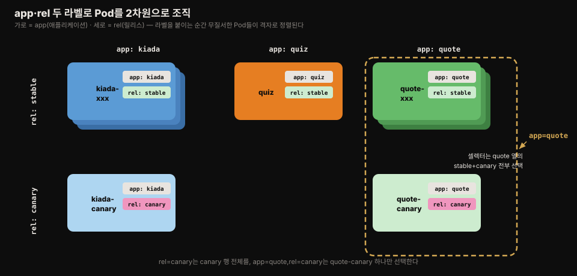
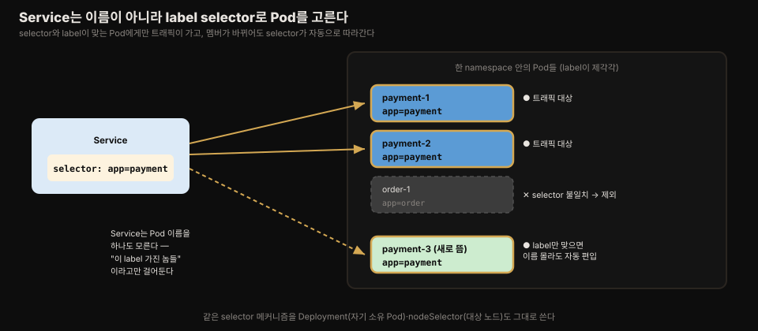

# label과 label selector로 오브젝트 조직하기
---
> Pod가 수백 개로 늘어나도 "이건 어느 앱의 어느 릴리스인가"를 한눈에 알게 하는 장치가 label이고, 그 label로 오브젝트 부분집합을 골라 일괄 작업하는 장치가 label selector입니다. 이 편에서는 라벨의 부착·문법·표준 키, equality/set-based 셀렉터, 그리고 셀렉터로 Pod를 특정 노드에 스케줄링하는 nodeSelector·nodeAffinity를 정리합니다.


## 진입 — 이 문서를 읽고 나면 무엇을 할 수 있는가

> 이 문서를 읽고 나면 app·rel 같은 라벨로 Pod를 다차원으로 조직하고, `-l` 셀렉터로 목록 필터링·일괄 삭제를 수행하며, nodeSelector와 nodeAffinity(matchExpressions의 6개 연산자)로 Pod를 원하는 노드 집합에 배치할 수 있습니다.

이 개념은 파일에 태그를 붙여 폴더 구조와 무관하게 여러 축으로 분류하는 익숙한 발상입니다. 다만 쿠버네티스에서 라벨은 단순 표시를 넘어 시스템이 오브젝트 집합을 참조하는 **공식 수단**이라는 점이 다릅니다 — Service가 트래픽을 보낼 Pod를, Deployment가 자기 소유의 Pod를 고르는 기준이 전부 label selector입니다.


## 1. label — 오브젝트의 역할을 드러내는 key-value

> label은 오브젝트에 붙이는 key-value 쌍으로, 키는 오브젝트 안에서 유일해야 하며 생성 시점은 물론 나중에도 바꿀 수 있습니다.



마이크로서비스를 쓰는 시스템에서는 서비스가 100개를 넘기도 하고, 복제와 다중 버전 운영까지 겹치면 Pod가 수백~수천 개에 이릅니다. Kiada 스위트만 해도 Kiada 서비스의 stable 3개 + canary 1개, Quote 서비스의 stable 3개 + canary 1개, Quiz 1개 — 아홉 개 Pod만으로도 시스템 그림이 어지러워집니다.

> **canary release**는 새 버전을 stable 버전 옆에 배포하고 요청의 일부만 새 버전으로 보내, 전체 사용자에게 풀기 전에 동작을 관찰하는 배포 패턴입니다. 나쁜 릴리스가 너무 많은 사용자에게 노출되는 것을 막습니다.

이들을 세 namespace로 나눌 수도 있지만 그것은 namespace의 본래 용도가 아닙니다. 이 경우에 맞는 메커니즘이 **label**입니다.

label은 오브젝트에 붙이는 key-value 쌍으로, 클러스터의 어떤 사용자든 그 오브젝트의 역할을 알아볼 수 있게 합니다. 키와 값 모두 자유롭게 정하는 문자열이고, 한 오브젝트에 라벨 여러 개를 붙일 수 있되 **키는 그 오브젝트 안에서 유일**해야 합니다. 보통 생성 시점에 붙이지만 나중에 바꿔도 됩니다. 쿠버네티스는 어떤 라벨을 붙이든 관여하지 않습니다.

Kiada 스위트에는 두 라벨이 어울립니다.

1. **app** — 이 Pod가 어느 애플리케이션에 속하는가 (kiada · quiz · quote)
2. **rel** — stable 릴리스인가 canary 릴리스인가

이 두 라벨을 붙이면 Pod들이 두 차원으로 조직됩니다 — 가로로는 애플리케이션별, 세로로는 릴리스별로요.


## 2. label 붙이기·바꾸기·지우기

> 라벨은 매니페스트의 metadata.labels에 정의하고, 기존 오브젝트에는 kubectl label로 추가하되 변경에는 --overwrite, 제거에는 키 뒤 마이너스 기호를 씁니다.

라벨은 모든 오브젝트 종류가 지원하며 `metadata.labels` 맵에 지정합니다.

```yaml
apiVersion: v1
kind: Pod
metadata:
  name: kiada-001
  labels:
    app: kiada      # 애플리케이션
    rel: stable     # 릴리스 종류
spec:
  ...
```

라벨 확인 방법은 여럿입니다.

```bash
kubectl describe pod kiada-001        # Labels: 행에 표시
kubectl get pods --show-labels        # LABELS 열 추가
kubectl get pods -L app,rel           # 지정한 라벨을 각자 열로 표시(--label-columns)
```

기존 오브젝트에 라벨을 붙일 때는 매니페스트를 고쳐 재적용하거나 `kubectl edit`을 쓸 수도 있지만, 가장 간단한 방법은 `kubectl label`입니다.

```bash
kubectl label pod kiada-canary app=kiada rel=canary
# pod/kiada-canary labeled
```

이미 있는 라벨의 값을 바꾸려 하면 실수 방지를 위해 거부됩니다 — `--overwrite`를 명시해야 합니다.

```bash
kubectl label pod quote-canary app=quote
# error: 'app' already has a value (kiada), and --overwrite is false

kubectl label pod quote-canary app=quote --overwrite
# pod/quote-canary labeled
```

`--all`로 namespace 안 모든 오브젝트에 한꺼번에 붙일 수 있고, 제거는 키 뒤에 마이너스 기호를 붙입니다.

```bash
kubectl label pod --all suite=kiada-suite   # 모든 Pod에 추가

kubectl label pod kiada-canary suite-       # 키 뒤 마이너스 = 제거

kubectl label pod --all suite-              # 모든 Pod에서 제거
```

> 라벨 값을 빈 문자열로 설정해도 키는 제거되지 않습니다. 제거하려면 반드시 마이너스 기호를 써야 합니다.


## 3. label 문법 규칙과 표준 키

> 키는 선택적 prefix(DNS 서브도메인, 253자)와 이름(63자)으로 이뤄지고 값은 최대 63자·공백 불가이며, kubernetes.io/ 접두사는 예약돼 있습니다.

예제의 app·rel·suite처럼 prefix 없는 키는 사용자 사유(private)로 간주됩니다. 쿠버네티스 자신이 붙이거나 읽는 라벨 키는 항상 prefix로 시작합니다. 예를 들어 `kubernetes.io/arch`는 Node 오브젝트에서 노드의 아키텍처를 나타냅니다. `kubernetes.io/`와 `k8s.io/` prefix는 쿠버네티스 컴포넌트용으로 예약돼 있으므로, prefix를 쓰려면 자기 조직의 도메인 이름을 써서 충돌을 피합니다.

| 구분 | 규칙 |
|------|------|
| prefix (선택) | DNS 서브도메인(소문자 영숫자·하이픈·밑줄·점), 253자 이하, 슬래시로 끝남 |
| 키 이름 | 영숫자로 시작·끝, 하이픈·밑줄·점 허용, **대문자 허용**, 63자 이하 |
| 값 | 빈 값 허용, 비어 있지 않으면 영숫자로 시작, 영숫자·하이픈·밑줄·점만, **공백 불가**, 63자 이하 |

예를 들어 `example.com/foo`·`my.example.com/foo`는 유효하지만 아래 넷은 무효입니다.

- `/foo` — prefix 가 비었습니다.
- `example..com/foo` — 점이 연속합니다.
- `my@example.com/foo` — 특수문자가 들어갔습니다.
- `value with spaces` — 값에 공백이 있습니다.

이 규칙에 맞지 않는 값을 붙여야 한다면 라벨 대신 annotation을 씁니다(07-03).

### 잘 알려진 라벨과 커뮤니티 권장 라벨

쿠버네티스는 시스템 오브젝트, 특히 노드에 여러 라벨을 붙입니다.

| 라벨 키 | 예시 값 | 대상 | 의미 |
|---------|--------|------|------|
| kubernetes.io/arch | amd64 | Node | 노드 아키텍처 |
| kubernetes.io/os | linux | Node | 노드 운영체제 |
| kubernetes.io/hostname | worker-node1 | Node | 노드 호스트명 |
| topology.kubernetes.io/region | eu-west3 | Node·PV | 노드/볼륨이 위치한 리전 |
| topology.kubernetes.io/zone | eu-west3-c | Node·PV | 노드/볼륨이 위치한 존 |
| node.kubernetes.io/instance-type | micro-1 | Node | 클라우드 인스턴스 타입 |

> 일부 라벨은 `kubernetes.io` 외에 더 오래된 `beta.kubernetes.io` prefix로도 존재합니다. 클라우드 제공자는 추가 라벨을 붙이기도 합니다 — 예를 들어 GKE는 `cloud.google.com/gke-nodepool` 등을 붙입니다.

커뮤니티가 합의한 배포 컴포넌트용 표준 라벨도 있습니다. 같은 애플리케이션 인스턴스에 속한 모든 오브젝트에 같은 세트를 붙여 두면, 누구든 어떤 컴포넌트가 함께 속하는지 알 수 있고 셀렉터로 일괄 관리할 수 있습니다.

| 라벨 | 예시 | 의미 |
|------|------|------|
| app.kubernetes.io/name | quotes | 애플리케이션 이름(다중 컴포넌트면 전체 앱 이름) |
| app.kubernetes.io/instance | quotes-foo | 이 애플리케이션 인스턴스의 이름 |
| app.kubernetes.io/component | database | 아키텍처에서 이 컴포넌트의 역할 |
| app.kubernetes.io/part-of | kubia-demo | 속한 애플리케이션 스위트 이름 |
| app.kubernetes.io/version | 1.0.0 | 애플리케이션 버전 |
| app.kubernetes.io/managed-by | quotes-operator | 배포·업데이트를 관리하는 도구 |


## 4. label selector — 부분집합을 골라 일괄 작업하기

> 셀렉터에는 값의 일치를 보는 equality-based와 집합·존재 여부를 보는 set-based 두 종류가 있고, 쉼표로 조합하면 모든 조건을 만족하는 오브젝트만 선택됩니다.

라벨의 진짜 힘은 **label selector**로 오브젝트를 필터링할 때 나옵니다. 셀렉터는 특정 라벨 키·값의 보유 여부로 오브젝트를 거르는 기준이며 두 종류가 있습니다.

**equality-based selector**는 라벨 값이 특정 값과 같은지/다른지를 봅니다 — `app=quote`(quote 앱의 stable+canary 전부), `app!=quote`(quote를 제외한 전부).

**set-based selector**는 더 표현력이 큽니다.

1. 값이 집합에 속함 — `app in (quiz, quote)`
2. 값이 집합에 속하지 않음 — `app notin (kiada)`
3. 키가 존재함 — `app`
4. 키가 존재하지 않음 — `!app`

여러 셀렉터를 쉼표로 조합하면 **모든** 셀렉터를 만족하는 오브젝트만 선택됩니다 — `app=quote,rel=canary`는 quote-canary Pod 하나만 고릅니다.

kubectl에서는 `--selector`(축약 `-l`)로 지정합니다.

```bash
kubectl get pods -l app=quote                 # quote 앱 전부(stable+canary)
kubectl get pods -l rel=canary                # 모든 canary
kubectl get pods -l app=quote,rel=canary      # 둘 다 만족 → quote-canary만
kubectl get pods -l 'app in (quiz, quote)' -L app   # set-based + APP 열 표시
kubectl get pods -l '!rel'                    # rel 키가 없는 Pod
kubectl get pods -l rel                       # rel 키가 있는 Pod
```

> `!rel`은 셸이 느낌표를 해석하지 않도록 반드시 작은따옴표로 감쌉니다.

셀렉터는 삭제에도 쓸 수 있습니다. canary 두 개가 기대대로 동작하지 않아 내려야 한다면 하나씩 지우는 대신 한 번에 지웁니다.

```bash
kubectl delete pods -l rel=canary
# pod "kiada-canary" deleted
# pod "quote-canary" deleted
```

> ⚠️ `kubectl delete`는 확인을 묻지 않습니다. 셀렉터로 삭제할 때는, 특히 프로덕션에서는 각별히 주의해야 합니다.


## 5. 셀렉터로 Pod를 특정 노드에 스케줄링하기

> 오브젝트 매니페스트 안에서도 셀렉터가 쓰입니다 — **nodeSelector**는 equality만 지원하는 간단한 형태이고, **nodeAffinity**의 matchExpressions는 6개 연산자를 갖춘 set-based 셀렉터입니다.



셀렉터는 kubectl 관리용만이 아닙니다. 쿠버네티스 내부에서 오브젝트가 다른 오브젝트의 부분집합을 참조할 때도 쓰입니다 — Service는 트래픽을 전달할 Pod를(11장), Deployment·ReplicaSet·DaemonSet·StatefulSet은 자기에게 속한 Pod를 셀렉터로 정의합니다. 여기서 핵심은 참조하는 쪽이 대상 Pod의 **이름을 적지 않는다**는 점입니다. Service는 `app=payment` 같은 셀렉터만 걸어 두고, 그 라벨을 가진 Pod가 새로 뜨거나 사라져도 대상 집합을 스스로 갱신합니다.

이 편에서는 그 여러 쓰임 중 Pod를 특정 노드 집합에 스케줄링하는 예를 봅니다.

보통은 Pod가 어느 노드에 가는지 신경 쓸 필요가 없지만, 예외가 있습니다. 하드웨어가 균질하지 않은 경우(HDD 노드와 SSD 노드가 섞여 있어 저지연 스토리지가 필요한 Pod는 SSD 노드로), 프론트엔드와 백엔드 Pod를 다른 노드 군에 두고 싶은 경우, 고객마다 보안상 전용 노드 집합을 주는 경우 등입니다. 이때 특정 노드 하나를 지정하는 대신 **조건을 만족하는 노드 집합**에서 쿠버네티스가 고르게 합니다 — 노드 하나가 죽어도 다른 노드로 옮길 수 있도록요.

먼저 노드에 라벨을 붙입니다.

```bash
kubectl label node kind-worker node-role=front-end
kubectl get node -l node-role=front-end     # 프론트엔드 노드 확인
```

그리고 Pod 매니페스트의 `spec.nodeSelector`에 그 라벨을 지정합니다.

```yaml
apiVersion: v1
kind: Pod
metadata:
  name: kiada-front-end
spec:
  nodeSelector:
    node-role: front-end    # 이 라벨을 가진 노드에만 스케줄링됨
  containers: ...
```

이 Pod는 `node-role=front-end` 라벨이 붙은 노드에만 배치됩니다. `kubectl get pod -o wide`의 NODE 열로 확인합니다.

단 `nodeSelector` 필드는 **equality-based 셀렉터만** 지원합니다 — not-equal이나 set-based는 쓸 수 없습니다.

### nodeAffinity — set-based 노드 셀렉터

set-based 셀렉터가 필요하면 Pod의 `nodeAffinity` 필드를 씁니다. 같은 목적(라벨 기반 노드 배치)이지만 특정 라벨을 가진 노드를 **제외**하는 것까지 표현할 수 있습니다.

```yaml
apiVersion: v1
kind: Pod
metadata:
  name: kiada-front-end-affinity
spec:
  affinity:
    nodeAffinity:
      requiredDuringSchedulingIgnoredDuringExecution:
        nodeSelectorTerms:
        - matchExpressions:          # set-based 셀렉터
          - key: node-role
            operator: In             # node-role 라벨이 front-end이고
            values:
            - front-end
          - key: skip-me
            operator: DoesNotExist   # skip-me 라벨이 없는 노드
  ...
```

`nodeSelectorTerms`에는 term 여러 개를 둘 수 있고 노드는 **term 중 하나만** 만족하면 됩니다 — OR 입니다. 반면 한 term 안의 `matchExpressions`는 **모두** 만족해야 하는 AND 입니다.

각 표현식은 key·operator·values로 이뤄지며 연산자는 여섯 가지입니다.

| operator | 의미 |
|----------|------|
| In | 라벨 값이 values 중 하나와 일치해야 함 |
| NotIn | 라벨 값이 values의 어떤 값과도 일치하면 안 됨 |
| Exists | 라벨 키가 존재해야 함(값 무관, values 생략) |
| DoesNotExist | 라벨 키가 없어야 함(values 생략) |
| Lt | 라벨 값이 values의 단일 값보다 작아야 함 |
| Gt | 라벨 값이 values의 단일 값보다 커야 함 |

동작을 확인하려면 프론트엔드 노드에 `skip-me` 라벨을 붙인 뒤 이 Pod를 만들어 봅니다.

```bash
kubectl label nodes -l node-role=front-end skip-me=true   # 셀렉터로 노드들에 라벨 부착

kubectl get pods
# NAME                       READY   STATUS    RESTARTS   AGE
# kiada-front-end            2/2     Running   0          5m
# kiada-front-end-affinity   0/2     Pending   0          20s   ← 매칭 노드가 없어 미배치
```

DoesNotExist 조건에 걸리는 노드가 없으므로 Pod는 `Pending`에 머뭅니다. 이유는 이벤트에서 확인합니다.

> **실습에서 확인한 것 (kind k8s-lab, v1.35).** `kubectl describe pod`의 Events보다 `kubectl get events --field-selector involvedObject.name=<pod>`가 사유를 한 줄로 깔끔하게 보여줍니다. 실제 사유 문자열은 `didn't match Pod's node affinity/selector`입니다 — nodeSelector와 nodeAffinity가 **같은 메시지**를 쓰므로, 이 문자열만 보고 둘을 구분할 수는 없습니다. 노드 3개 중 worker 2개는 라벨 불일치로, control-plane 1개는 taint로 제외되어 합쳐서 `0/3 nodes are available`이 됩니다. 손으로 돌려 본 STEP별 출력은 실습 저장소 `k8s_in_action/07-organizing-objects/labels` <!-- 링크 끊김(2026-08): ../../../../../k8s_in_action/07-organizing-objects/labels/README.md -->에 박제해 두었습니다.


## Spring 앱 운영 관점에서

> 권장 라벨 세트는 Spring 마이크로서비스의 "어느 서비스·어느 버전·누가 배포했나"를 표준화하고, rel 라벨 + Service 셀렉터 조합이 canary 배포의 뼈대가 됩니다.

Spring 마이크로서비스를 여럿 배포하는 조직이라면 §3의 `app.kubernetes.io/*` 권장 라벨 세트를 처음부터 강제하는 것이 좋습니다. `name=order-service, version=2.3.1, part-of=commerce, managed-by=helm`처럼 붙여 두면 "이 Pod가 어느 서비스의 어느 버전인지"를 kubectl만으로 파악할 수 있습니다. Helm·ArgoCD 같은 배포 도구도 이 라벨을 읽고 씁니다.

**라벨 값에는 63자·공백 불가 제한(§3)이 있습니다.** 그래서 Git 커밋 메시지 같은 긴 정보는 라벨이 아니라 annotation(07-03)에 넣는다는 구분을 함께 정해 두면 혼선이 줄어듭니다.

이 편의 app·rel 라벨 예제는 Spring 서비스의 canary 배포 뼈대 그대로입니다. Service의 Pod 셀렉터를 `app=order`로만 잡으면 stable과 canary가 **같은 셀렉터에 걸려** 트래픽이 endpoint 수 비율로 자연 분배됩니다. stable 3 + canary 1이면 약 25%가 canary로 갑니다. 문제가 생기면 `kubectl delete pods -l app=order,rel=canary` 한 줄로 canary만 걷어냅니다 — 셀렉터가 `app=order` 그대로라 stable 트래픽은 끊기지 않습니다.

§5의 노드 스케줄링도 JVM 워크로드에서 실용적입니다. 메모리를 많이 쓰는 배치성 Spring 앱은 `node-role=batch` 라벨을 붙인 고메모리 노드로, 지연에 민감한 API 서버는 SSD 노드로 보내는 식입니다. 이때 `nodeSelector`로 시작하고, "특정 노드 제외"나 존·리전 조건(`topology.kubernetes.io/zone`)이 필요해지는 시점에 nodeAffinity로 넘어가면 유지보수하기 쉽습니다.


## 면접에서 받을 만한 질문

> 먼저 스스로 답을 소리 내어 말해 본 뒤, 아래 정답 섹션을 펼쳐 맞춰 봅니다.

1. label과 label selector는 각각 무엇이고, 쿠버네티스에서 selector가 "공식 수단"이라는 말은 무슨 뜻입니까?
2. equality-based selector와 set-based selector는 어떻게 다릅니까? 각각 예를 들어 보세요.
3. `nodeSelector`로는 안 되고 `nodeAffinity`로만 되는 것은 무엇입니까?
4. Service가 대상 Pod를 이름이 아니라 label selector로 참조하면 무엇이 좋습니까?
5. 라벨에 담을 수 없는 정보(예: 긴 설명·공백 포함 값)는 어디에 넣습니까? 왜입니까?

### 빈칸 채우기 — selector·nodeAffinity 핵심

기존 라벨 값을 `kubectl label`로 바꾸려면 실수 방지를 위해 `1____` 플래그를 명시해야 하고, 라벨을 제거하려면 키 뒤에 `2____`를 붙입니다.

nodeAffinity의 `matchExpressions`에서 "라벨 키가 **없는** 노드만"을 고르는 연산자는 `3____`이고, "값이 여러 개 중 하나"는 `4____`입니다. 한 term 안의 여러 `matchExpressions`는 `5____`(AND/OR) 관계로 묶입니다.


## 정답 (자답 후 펼치기)

### 정답 1 — label과 selector

label은 오브젝트에 붙이는 key-value 쌍으로, 키는 그 오브젝트 안에서 유일하고 나중에도 바꿀 수 있습니다. selector는 특정 라벨의 보유 여부로 오브젝트 부분집합을 골라내는 기준입니다. "공식 수단"이라는 말은, Service가 트래픽 보낼 Pod를·Deployment가 자기 소유 Pod를 고르는 기준이 전부 label selector라는 뜻입니다 — 단순 표시가 아니라 시스템이 오브젝트 집합을 참조하는 메커니즘입니다.

### 정답 2 — equality vs set-based

equality-based는 값의 일치/불일치를 봅니다. `app=quote`가 같음이고 `app!=quote`가 다름입니다.

set-based는 더 표현력이 커서 집합 소속과 키 존재까지 봅니다. `app in (quiz, quote)`·`app notin (kiada)`가 집합 소속이고, `app`이 키 존재, `!app`이 키 비존재입니다.

쉼표로 여러 셀렉터를 이으면 모두 만족하는 것만 남는 AND입니다.

### 정답 3 — nodeSelector vs nodeAffinity

`nodeSelector`는 equality-based만 됩니다 — "키=값" 등호 하나뿐이라 not-equal도, 여러 값 중 하나도 표현하지 못합니다. `nodeAffinity`의 `matchExpressions`는 set-based라 "disk가 ssd 또는 nvme"(`In`)나 "특정 라벨이 **없는** 노드"(`DoesNotExist`)까지 고릅니다. nodeAffinity는 nodeSelector를 닮은 게 아니라 넘어섭니다.

### 정답 4 — 이름이 아니라 라벨로 참조

참조하는 쪽이 대상 Pod의 이름을 적지 않으므로, 그 라벨을 가진 Pod가 새로 뜨거나 사라져도 대상 집합이 스스로 갱신됩니다. Service는 `app=payment` 셀렉터만 걸어 두면 되고, 스케일 인/아웃이나 롤링 업데이트로 Pod 멤버가 바뀌어도 자동으로 따라갑니다.

### 정답 5 — 라벨이 못 담는 정보

라벨 값은 63자·공백 불가 등 문법 제약이 있으므로, 긴 설명이나 공백 포함 값(예: Git 커밋 메시지, 빌드 URL)은 라벨이 아니라 annotation(07-03)에 넣습니다. 라벨은 selector로 거르는 대상이라 문법이 엄격하고, annotation은 selector 대상이 아니라 자유 형식을 허용하기 때문입니다.

### 정답 빈칸 — 1 `--overwrite` · 2 `-`(마이너스) · 3 `DoesNotExist` · 4 `In` · 5 AND

`kubectl label ... --overwrite`로 기존 값을 덮어쓰고, `kubectl label pod X key-`로 라벨을 제거합니다. nodeAffinity에서 `DoesNotExist`는 키가 없는 노드를, `In`은 값이 values 중 하나인 노드를 고릅니다. 한 term 안 `matchExpressions`는 모두 만족(AND), `nodeSelectorTerms`의 term 사이는 하나만 만족(OR)입니다.


## 관련 문서

> 이 편은 label의 부착·문법·표준 키와 label selector의 필터링·노드 스케줄링 활용을 다룹니다. 다음 편(07-03)에서 라벨이 못 담는 것을 담는 field selector와 annotation으로 이어집니다.

- [07-03.field selector와 annotation](./07-03.field%20selector%EC%99%80%20annotation.md) — 라벨이 아닌 필드로 필터링하고, 라벨 규칙에 안 맞는 정보를 담는 다음 편
- [07-01.namespace로 클러스터를 가상 분할하기](./07-01.namespace%EB%A1%9C%20%ED%81%B4%EB%9F%AC%EC%8A%A4%ED%84%B0%EB%A5%BC%20%EA%B0%80%EC%83%81%20%EB%B6%84%ED%95%A0%ED%95%98%EA%B8%B0.md) — 오브젝트를 겹치지 않는 그룹으로 나누는 namespace를 다룬 이전 편
- [핵심 워크로드](../../kubernetes/01_workloads/01-01.%ED%95%B5%EC%8B%AC%20%EC%9B%8C%ED%81%AC%EB%A1%9C%EB%93%9C.md) — Service·Deployment가 셀렉터로 Pod를 참조하는 구조를 다룬 편
- [Kubernetes 공식 문서 — Labels and Selectors](https://kubernetes.io/docs/concepts/overview/working-with-objects/labels/) — 라벨·셀렉터 문법의 최신 공식 명세
