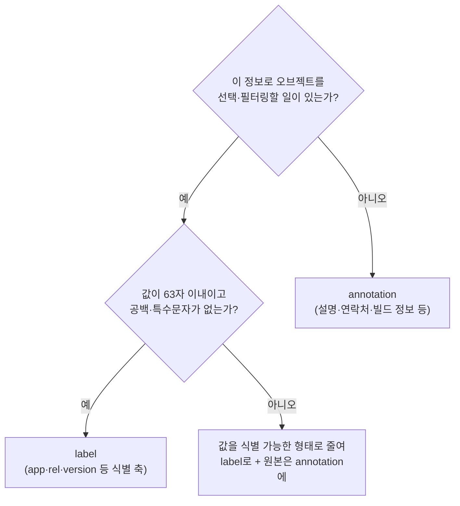

# field selector와 annotation
---
> 라벨이 아닌 오브젝트 속성으로 필터링하고 싶을 때는 field selector를, 라벨의 63자·공백 불가 규칙에 맞지 않는 정보를 붙이고 싶을 때는 annotation을 씁니다. 이 편에서는 두 장치의 용도와 한계, 그리고 쿠버네티스가 새 API 필드 대신 annotation을 먼저 도입하는 관행까지 정리합니다.


## 진입 — 이 문서를 읽고 나면 무엇을 할 수 있는가

> 이 문서를 읽고 나면 field selector로 특정 노드의 Pod나 Running이 아닌 Pod를 골라내고, annotation과 label의 용도 차이를 설명하며, YAML에서 annotation 값에 따옴표가 필요한 경우를 구분할 수 있습니다.

이 개념은 07-02에서 배운 label selector의 빈틈을 메우는 두 장치입니다. label selector는 라벨에만 동작하므로 "이 노드에서 도는 Pod"처럼 라벨이 아닌 속성으로는 거를 수 없고, 라벨 값에는 63자·공백 불가 제한이 있어 설명문·URL 같은 것을 담을 수 없습니다.


## 1. field selector — 필드 값으로 오브젝트 거르기

> field selector는 오브젝트의 필드 값으로 필터링하며, 지원 필드는 오브젝트 종류마다 다르지만 metadata.name과 metadata.namespace는 항상 지원됩니다.

쿠버네티스는 처음에 label selector로만 필터링을 허용했지만, 사용자들이 다른 속성으로도 거르고 싶어 한다는 것이 분명해졌습니다 — 대표적으로 "특정 클러스터 노드에서 도는 Pod"입니다. 이것이 지금은 **field selector**로 가능합니다. 셀렉터에 쓸 수 있는 필드 집합은 오브젝트 종류에 따라 다르지만, `metadata.name`과 `metadata.namespace`는 항상 지원됩니다.

가장 유용한 두 예시가 있습니다. 첫째, 특정 노드에 스케줄링된 Pod 나열입니다.

```bash
kubectl get pods --field-selector spec.nodeName=kind-worker
# NAME              READY   STATUS    RESTARTS   AGE
# kiada-front-end   2/2     Running   0          15m
# kiada-002         2/2     Running   0          3h
# quote-002         2/2     Running   0          3h
```

둘째, 실행 중이 아닌 Pod 찾기입니다.

```bash
kubectl get pods --field-selector status.phase!=Running
# NAME                       READY   STATUS    RESTARTS   AGE
# kiada-front-end-affinity   0/2     Pending   0          41m
```

07-02에서 nodeAffinity 조건에 걸려 Pending에 머문 Pod가 바로 잡힙니다.

> 클러스터 전체에서 비실행 Pod를 찾으려면 `-A`(--all-namespaces)를 붙입니다: `kubectl get pods --field-selector status.phase!=Running -A`

셀렉터에 쓸 필드 이름은 4장에서 배운 `kubectl explain pod.spec`으로 찾습니다. 어떤 필드가 field selector를 지원하는지까지 알려주지는 않지만, 일단 써 보면 지원하지 않는 필드일 때 kubectl이 알려줍니다.

### 매니페스트 안의 field selector — matchFields

필드 값 기반 선택은 일부 오브젝트 매니페스트 안에서도 가능합니다. 07-02에서 본 nodeAffinity는 `matchExpressions` 대신 `matchFields`를 쓰면 노드의 라벨이 아니라 **필드 값**으로 매칭합니다 — 예를 들어 특정 이름의 노드를 스케줄링에서 제외할 수 있습니다.

```yaml
spec:
  affinity:
    nodeAffinity:
      requiredDuringSchedulingIgnoredDuringExecution:
        nodeSelectorTerms:
        - matchFields:            # 라벨이 아니라 필드로 매칭
          - key: metadata.name
            operator: NotIn       # node-a를 제외한 모든 노드에 매칭
            values:
            - node-a
```


## 2. annotation — 라벨이 못 담는 정보를 담는 곳

> annotation도 key-value 쌍이지만 식별 정보가 아니고 필터링에 못 쓰며, 대신 값이 최대 256KB에 어떤 문자든 담을 수 있습니다.

라벨에는 아무거나 담을 수 없습니다 — 값은 최대 63자이고 공백을 아예 못 씁니다. 그래서 쿠버네티스는 **annotation**도 제공합니다. annotation도 key-value 쌍이지만 목적과 쓰임이 다릅니다.

| 구분 | label | annotation |
|------|-------|------------|
| 목적 | 식별 정보 — 오브젝트의 역할 표시 | 비식별 부가 정보 |
| 필터링(셀렉터) | 가능 | **불가** (field selector로도 못 거름) |
| 값 길이 | 최대 63자 | 최대 256KB(집필 시점) |
| 값 문자 | 영숫자·하이픈·밑줄·점, 공백 불가 | 아무 문자나 — 평문·YAML·JSON·Base64 |
| 키 규칙 | prefix(253자)+이름(63자) | 라벨 키와 동일 |

어떤 정보를 어디에 붙일지는 다음 기준으로 가릅니다.



### 쿠버네티스가 annotation을 먼저 도입하는 이유

kubectl과 여러 컨트롤러는 오브젝트 필드에 담을 수 없는 정보를 annotation에 붙입니다. annotation은 특히 **새 기능이 도입될 때** 자주 쓰입니다. 기능이 API 변경(스키마에 새 필드 추가)을 요구하면, 그 변경은 보통 몇 릴리스 뒤로 미뤄집니다 — API에 필드를 한번 추가하면 제거할 수 없고, 제거하면 그 API를 쓰는 모두가 깨지기 때문입니다. 그래서 새 필드 대신 **새 annotation을 먼저 도입**해 커뮤니티가 실전에서 써 보게 하고, 몇 릴리스 뒤 모두가 만족하면 정식 필드를 추가하고 annotation은 deprecated시킨 뒤 다시 몇 릴리스 뒤에 제거합니다.

### 직접 붙이는 annotation의 쓰임

사용자도 annotation을 자유롭게 붙일 수 있습니다. 오브젝트마다 설명을 달아 두면 클러스터의 모든 사용자가 정보를 다른 곳에서 찾지 않아도 됩니다 — 만든 사람의 이름·연락처를 담아 협업을 돕거나, Pod에 Git 저장소 URL·커밋 해시·빌드 타임스탬프를 붙여 실행 중인 애플리케이션의 출처를 남기거나, 특정 annotation 값(예: true)을 도구가 읽고 오브젝트를 처리할지 판단하게 하는 식입니다.


## 3. annotation 붙이기·조회·수정·제거

> kubectl annotate로 붙이고 describe나 jq로 조회하며, 라벨과 마찬가지로 변경에는 --overwrite, 제거에는 키 뒤 마이너스를 씁니다.

기존 오브젝트에 붙이는 가장 간단한 방법은 `kubectl annotate`입니다.

```bash
kubectl annotate pod kiada-front-end created-by='Marko Luksa <marko.luksa@xyz.com>'
# pod/kiada-front-end annotated
```

매니페스트에서는 `metadata.annotations`에 정의합니다.

```yaml
apiVersion: v1
kind: Pod
metadata:
  name: pod-with-annotations
  annotations:
    created-by: Marko Luksa <marko.luksa@xyz.com>
    contact-phone: +1 234 567 890
    managed: 'yes'      # 따옴표 필수 — 아니면 불리언으로 파싱됨
    revision: '3'       # 따옴표 필수 — 아니면 숫자로 파싱됨
spec:
  ...
```

> ⚠️ YAML 파서가 문자열이 아닌 것으로 해석할 값은 반드시 따옴표로 감싸야 합니다. `123` 같은 숫자나 `true`·`false`·`yes`·`no`처럼 불리언으로 해석될 수 있는 값을 그대로 두면 적용 시 `unable to decode yaml ... ReadString: expects " or n, but found t` 같은 알 수 없는 오류가 납니다.

라벨과 달리 `kubectl get`에는 annotation을 목록에 표시하는 옵션이 없습니다. `kubectl describe`를 쓰거나 YAML·JSON 정의에서 찾습니다.

```bash
kubectl describe pod pod-with-annotations
# Annotations:  contact-phone: +1 234 567 890
#               created-by: Marko Luksa <marko.luksa@xyz.com>
#               managed: yes
#               revision: 3

kubectl get pod pod-with-annotations -o json | jq .metadata.annotations
# {
#   "contact-phone": "+1 234 567 890",
#   "created-by": "Marko Luksa <marko.luksa@xyz.com>",
#   "kubectl.kubernetes.io/last-applied-configuration": "...",
#   "managed": "yes",
#   "revision": "3"
# }
```

jq 출력에는 `kubectl.kubernetes.io/last-applied-configuration`이라는 추가 annotation이 보입니다. kubectl이 내부적으로 쓰는 것이라 describe에는 표시되지 않으며(출력이 너무 길어지기도 하고), 앞으로 deprecated되어 제거될 수 있습니다.

수정과 제거는 라벨과 같은 문법입니다.

```bash
kubectl annotate pod kiada-front-end created-by='Humpty Dumpty' --overwrite   # 변경
kubectl annotate pod kiada-front-end created-by-                              # 제거(키 뒤 마이너스)
```


## Spring 앱 운영 관점에서

> Spring 서비스 Pod에 빌드 출처(커밋 해시·빌드 시각)를 annotation으로 새기면 "지금 도는 게 어느 빌드인가"라는 운영 질문이 kubectl 한 줄로 끝나고, field selector는 노드 단위 장애 조사에서 첫 필터가 됩니다.

이 편 §2의 "Git 저장소 URL·커밋 해시·빌드 타임스탬프를 annotation으로" 관행은 Spring CI/CD에서 그대로 표준이 됩니다. Jenkins·GitHub Actions 파이프라인이 매니페스트를 렌더링할 때 `example.com/git-commit: ${GIT_SHA}`·`example.com/build-time: ...`을 Pod 템플릿에 새겨 두면, 장애 조사 때 "이 Pod가 어느 커밋 빌드인가"를 `kubectl get pod -o json | jq`로 즉시 확인할 수 있습니다. Spring Boot의 `build-info.gradle`이 만드는 `/actuator/info`와 같은 정보이지만, annotation은 앱이 죽어 HTTP 응답을 못 할 때도 **읽을 수 있다**는 점이 다릅니다. 커밋 해시는 63자 이내이니 라벨로도 되지 않냐는 질문이 나오는데, 빌드 URL·설명처럼 공백·특수문자가 든 정보와 한 묶음으로 관리하려면 annotation 쪽이 일관됩니다 — 식별·선택에 쓸 것(버전 라벨)과 참고용 메타데이터(annotation)를 §2의 표 기준으로 가르면 됩니다.

field selector는 노드 단위 장애 조사의 첫 필터입니다. 특정 워커 노드의 디스크·네트워크가 이상할 때 `kubectl get pods -A --field-selector spec.nodeName=<node>`로 그 노드의 모든 Spring 서비스 Pod를 한 번에 보고, 배포 후 `--field-selector status.phase!=Running -A`로 어딘가 Pending·Failed에 걸린 Pod가 없는지 훑는 습관은 06장에서 배운 상태 진단과 자연스럽게 이어집니다. 한 가지 주의할 점은 annotation으로는 필터링이 안 된다는 것입니다 — "이 커밋으로 빌드된 Pod를 전부 찾아줘"가 필요하다면 그 값은 annotation이 아니라 라벨(예: `version`)로 붙어 있어야 합니다.


## 관련 문서

> 이 편은 label selector의 빈틈을 메우는 field selector와 annotation을 다루며 7장을 마무리합니다. 라벨·셀렉터 본편은 07-02, 필드 구조 탐색은 04-02를 참고합니다.

- [07-02.label과 label selector로 오브젝트 조직하기](./07-02.label%EA%B3%BC%20label%20selector%EB%A1%9C%20%EC%98%A4%EB%B8%8C%EC%A0%9D%ED%8A%B8%20%EC%A1%B0%EC%A7%81%ED%95%98%EA%B8%B0.md) — 이 편이 보완하는 label과 selector를 다룬 이전 편
- [08-01.command·args와 환경변수](./08-01.command%C2%B7args%EC%99%80%20%ED%99%98%EA%B2%BD%EB%B3%80%EC%88%98.md) — 오브젝트 조직을 마치고 애플리케이션 설정으로 넘어가는 다음 편
- [04-02.Node와 Event 오브젝트로 보는 필드 실습](./04-02.Node%EC%99%80%20Event%20%EC%98%A4%EB%B8%8C%EC%A0%9D%ED%8A%B8%EB%A1%9C%20%EB%B3%B4%EB%8A%94%20%ED%95%84%EB%93%9C%20%EC%8B%A4%EC%8A%B5.md) — field selector에 쓸 필드 이름을 kubectl explain으로 찾는 법을 다룬 편
- [Kubernetes 공식 문서 — Annotations](https://kubernetes.io/docs/concepts/overview/working-with-objects/annotations/) — annotation의 최신 공식 설명
- [Kubernetes 공식 문서 — Field Selectors](https://kubernetes.io/docs/concepts/overview/working-with-objects/field-selectors/) — 오브젝트별 지원 필드의 최신 공식 명세
