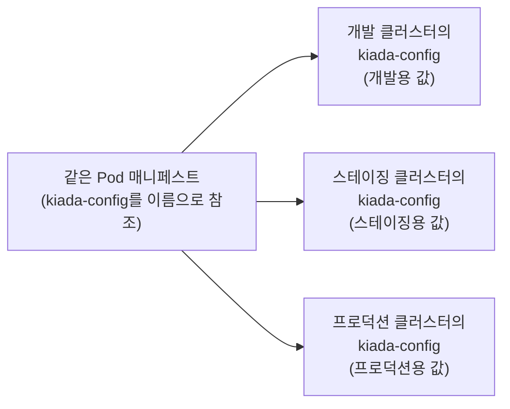

# ConfigMap으로 설정 분리하기
---
> 설정을 매니페스트에 하드코딩하면 환경(개발·스테이징·프로덕션)마다 매니페스트를 따로 둬야 합니다. 설정을 ConfigMap 오브젝트로 분리하고 Pod가 이름으로 참조하게 하면, 같은 Pod 매니페스트를 모든 환경에 배포하면서 환경마다 다른 설정을 쓸 수 있습니다. 이 편에서는 ConfigMap의 생성·주입·갱신과 immutable 옵션을 정리합니다.


## 진입 — 이 문서를 읽고 나면 무엇을 할 수 있는가

> 이 문서를 읽고 나면 --from-literal·--from-file·--from-env-file로 ConfigMap을 만들고, configMapKeyRef·envFrom으로 환경변수에 주입하고 optional의 효과를 설명하며, ConfigMap 갱신이 실행 중인 Pod에 언제 반영되는지와 immutable을 쓰는 이유를 말할 수 있습니다.

이 개념은 "설정 파일을 코드에서 분리해 배포 환경별로 갈아 끼운다"는 익숙한 외부화 원칙입니다. 다만 쿠버네티스는 그 설정을 파일이 아니라 API 오브젝트로 두고, Pod가 **이름으로** 참조하게 해 같은 매니페스트가 어느 환경에서든 그 환경의 설정을 집어 들게 한다는 점이 다릅니다.


## 1. ConfigMap이 푸는 문제 — 매니페스트에서 설정 떼어내기

> ConfigMap은 key-value 목록을 담는 API 오브젝트이고, 애플리케이션은 쿠버네티스를 모른 채 환경변수나 파일로 그 값을 받습니다.

08-01에서는 설정을 Pod 매니페스트에 직접 넣었습니다. 이미지에 하드코딩하는 것보다는 낫지만, 배포 환경(개발·스테이징·프로덕션 클러스터)마다 매니페스트를 따로 둬야 할 수 있어 여전히 이상적이지 않습니다. 같은 Pod 정의를 여러 환경에서 재사용하려면 설정을 매니페스트에서 분리해야 하고, 그 방법 중 하나가 설정을 **ConfigMap** 오브젝트로 옮기고 Pod에서 참조하는 것입니다.

ConfigMap은 key-value 쌍의 목록을 담는 API 오브젝트입니다. 값은 짧은 문자열부터 애플리케이션 설정 파일에서 볼 법한 큰 구조화 텍스트 블록까지 다양합니다. Pod 하나가 여러 ConfigMap을 참조할 수 있고, 여러 Pod가 같은 ConfigMap을 쓸 수 있습니다.

애플리케이션을 쿠버네티스에 무관하게(Kubernetes-agnostic) 유지하기 위해, 보통 애플리케이션이 쿠버네티스 REST API로 ConfigMap을 읽게 하지 않습니다. 대신 ConfigMap의 key-value 쌍을 **환경변수**로 전달하거나 configMap 볼륨으로 컨테이너 파일시스템에 **파일로 마운트**합니다(볼륨은 다음 장).


핵심 이점은 환경 분리입니다. Pod는 ConfigMap을 **이름**으로 참조하므로, 환경마다 같은 이름의 다른 ConfigMap 매니페스트를 적용해 두면 동일한 Pod 매니페스트를 모든 환경에 배포해도 각 환경의 설정이 적용됩니다.




## 2. ConfigMap 만들기 — 명령·매니페스트·파일

> kubectl create configmap은 --from-literal·--from-file·--from-env-file 세 방식으로 엔트리를 채우며, --dry-run=client -o yaml과 조합하면 버전 관리용 매니페스트를 생성할 수 있습니다.

가장 빠른 생성 방법은 `kubectl create configmap`입니다.

```bash
kubectl create configmap kiada-config \
  --from-literal status-message="This status message is set in the kiada-config ConfigMap"
```

> ConfigMap의 키는 영숫자·대시·밑줄·점만 쓸 수 있습니다.

엔트리를 채우는 옵션은 세 가지이고, 여러 번 반복하거나 조합할 수 있습니다(--from-env-file은 집필 시점 기준 다른 옵션과 조합 불가).

| 옵션 | 동작 |
|------|------|
| --from-literal | key=value를 직접 지정 |
| --from-file | 파일 내용을 엔트리로. `파일명`만 주면 파일 basename이 키·내용이 값, `key=파일`이면 지정 키에 저장, **디렉터리**를 주면 안의 각 파일이 별도 엔트리(부적합한 이름의 파일·하위 디렉터리 등은 무시) |
| --from-env-file | `key=value` 형식의 줄들로 이뤄진 파일을 각 줄이 별도 엔트리가 되게 삽입 |

YAML 매니페스트로도 만듭니다 — key-value는 `data` 필드에 둡니다.

```yaml
apiVersion: v1
kind: ConfigMap
metadata:
  name: kiada-config
data:
  status-message: This status message is set in the kiada-config ConfigMap
```

파일 기반 ConfigMap을 버전 관리 시스템에 두고 싶다면 `--dry-run=client -o yaml` 조합으로 매니페스트를 생성합니다.

```bash
kubectl create configmap dummy-config \
      --from-file=dummy.txt \
      --from-file=dummy.bin \
      --dry-run=client -o yaml > dummy-configmap.yaml
```

생성된 매니페스트를 보면 바이너리 파일은 `binaryData` 필드에 Base64로 인코딩되어 들어갑니다 — 엔트리에 UTF-8이 아닌 바이트가 있으면 binaryData에 둬야 하고, kubectl이 어디에 둘지 자동으로 판단합니다. 텍스트 파일은 `data` 필드에 파이프 문자(`|`)를 쓴 멀티라인 값으로 그대로 보입니다.

> **공백 위생.** 파일의 어느 줄이든 끝에 공백이 있으면 그 엔트리는 이스케이프된 따옴표 문자열로 직렬화되어 읽기 어려워집니다. 후행 공백이 없는 파일은 읽기 좋은 멀티라인 문자열로 표현됩니다.

조회는 다른 오브젝트와 같습니다.

```bash
kubectl get cm                              # 축약형 cm
kubectl get cm kiada-config -o yaml         # data 필드가 알파벳순이라 위쪽에 나옴
kubectl get cm kiada-config -o json | jq .data                    # 엔트리만
kubectl get cm kiada-config -o json | jq '.data["status-message"]'  # 특정 값
```


## 3. 환경변수로 주입 — configMapKeyRef와 envFrom

> 엔트리 하나는 valueFrom.configMapKeyRef로, 전체는 envFrom.configMapRef로 주입하며, optional을 주지 않으면 참조 대상이 없을 때 해당 컨테이너만 시작이 막힙니다.

엔트리 하나를 환경변수로 주입하려면 value 대신 `valueFrom`을 씁니다.

```yaml
spec:
  containers:
  - name: kiada
    env:
    - name: INITIAL_STATUS_MESSAGE
      valueFrom:
        configMapKeyRef:          # 고정값 대신 ConfigMap 키에서 가져옴
          name: kiada-config      # ConfigMap 이름
          key: status-message     # 그 안의 키
          optional: true          # 없어도 컨테이너는 실행됨
```

`optional: true`면 ConfigMap이나 키가 없어도 컨테이너가 실행되고 환경변수만 설정되지 않습니다. optional이 아닌데 참조 대상이 없으면 — Pod는 정상적으로 스케줄링되고 다른 컨테이너들도 정상 시작되지만, **그 키를 참조하는 컨테이너만** ConfigMap이 생길 때까지 시작이 막힙니다.

변수를 몇 개 이상 쓰게 되면 하나씩 지정하는 것이 번거롭고 실수하기 쉽습니다. `env` 대신 `envFrom`을 쓰면 ConfigMap의 **모든 엔트리를 한 번에** 주입합니다.

```yaml
spec:
  containers:
  - name: kiada
    envFrom:
    - configMapRef:
        name: kiada-config    # 키 지정 없이 이름만
        optional: true
```

단점은 키를 환경변수 이름으로 변환할 수 없다는 것입니다 — 키가 이미 올바른 형태(예: `INITIAL_STATUS_MESSAGE`)여야 하며, 가능한 유일한 변환은 각 키 앞에 **prefix를 붙이는 것**뿐입니다.

envFrom은 리스트이므로 여러 ConfigMap을 조합할 수 있습니다. 두 ConfigMap에 같은 키가 있으면 **마지막 것이 우선**하고, envFrom과 env를 함께 쓸 수도 있는데 **env에 설정된 변수가 envFrom보다 우선**합니다.


## 4. ConfigMap 갱신과 삭제 — 반영 시점과 immutable

> ConfigMap을 갱신해도 실행 중인 Pod의 환경변수는 바뀌지 않고 컨테이너가 재시작될 때만 새 값을 쓰므로, 인스턴스 간 설정 불일치가 생길 수 있습니다 — immutable로 아예 변경을 막는 것이 한 답입니다.

빠른 수정에는 `kubectl edit`을 씁니다.

```bash
kubectl edit configmap kiada-config     # 기본 편집기로 열림, 닫으면 API에 반영
```

> 편집기는 `KUBE_EDITOR` 환경변수로 바꿉니다(예: `export KUBE_EDITOR="/usr/bin/nano"`). 없으면 보통 `EDITOR` 환경변수로 설정된 기본 편집기를 씁니다. JSON으로 편집하려면 `-o json`.

**갱신의 반영 시점**이 중요합니다. ConfigMap을 갱신해도 기존 Pod의 환경변수 값은 갱신되지 않습니다. 컨테이너가 재시작되면(크래시 또는 liveness probe 실패로 종료) 그때 새 컨테이너가 새 값을 씁니다.

> 다음 장에서 배우듯, ConfigMap 엔트리를 환경변수가 아니라 **파일**로 노출하면 참조하는 모든 실행 중 컨테이너에서 갱신됩니다 — 재시작이 필요 없습니다.

이 동작은 곱씹을 필요가 있습니다. 컨테이너의 핵심 속성은 불변성 — 같은 컨테이너의 여러 인스턴스 사이에 차이가 없다는 확신 — 인데, 실행 중인 Pod가 쓰는 ConfigMap을 바꾸면 어떻게 될까요? 기존 인스턴스는 영향을 받지 않지만, 일부가 재시작되거나 새 인스턴스를 만들면 그것들은 새 설정을 씁니다. **서로 다르게 설정된 Pod들이 공존**하게 되고, 시스템 일부가 나머지와 다르게 동작할 수 있습니다.

이를 막으려면 ConfigMap을 **immutable**로 표시합니다.

```yaml
apiVersion: v1
kind: ConfigMap
metadata:
  name: my-immutable-configmap
data:
  mykey: myvalue
immutable: true      # data·binaryData 변경을 API 서버가 거부
```

immutable ConfigMap은 사용자의 실수를 막을 뿐 아니라 클러스터 성능도 개선합니다 — 워커 노드의 Kubelet이 ConfigMap 변경 알림을 받을 필요가 없어져 API 서버의 부하가 줄어듭니다. 다른 설정으로 Pod 집합을 돌리고 싶으면 새 ConfigMap을 만들어 새 Pod들이 쓰게 하는 것이 정석입니다.

삭제는 `kubectl delete`로 합니다. ConfigMap을 참조하는 실행 중 Pod는 계속 돌지만, 컨테이너가 재시작돼야 하는 순간부터는 — 참조가 optional이 아니라면 — 컨테이너가 실행에 실패합니다.


## Spring 앱 배포 관점에서

> ConfigMap은 Spring의 application.yml 외부화가 쿠버네티스에서 취하는 표준 형태이고, "같은 이름·다른 값" 패턴이 Spring 프로파일별 설정 파일을 대체합니다.

Spring Boot의 설정 외부화는 이 편의 ConfigMap과 자연스럽게 맞물립니다. 가장 단순한 형태는 §3의 `envFrom`으로 ConfigMap 전체를 환경변수로 부어 넣고 relaxed binding(08-01)에 맡기는 것입니다 — `SPRING_DATASOURCE_URL` 같은 키를 ConfigMap에 두면 코드·이미지·매니페스트 어디도 건드리지 않고 환경별 DB 주소가 갈립니다. `application.yml` 파일 통째로는 §2의 `--from-file`로 ConfigMap에 담아 볼륨으로 마운트하는 쪽(다음 장)이 맞고, 이때 §2의 후행 공백 위생이 실질적 문제가 됩니다 — YAML 설정 파일에 후행 공백이 있으면 ConfigMap 매니페스트가 읽기 힘든 이스케이프 문자열이 되어 리뷰가 어려워집니다.

§4의 갱신 반영 시점은 Spring 운영에서 자주 오해되는 지점입니다. 환경변수로 주입한 설정은 ConfigMap을 고쳐도 **재시작 전까지 절대 반영되지 않으므로**, "ConfigMap 바꿨는데 왜 안 바뀌지"의 답은 대부분 이것입니다. 인스턴스 간 불일치 문제를 정공법으로 푸는 관행이 immutable ConfigMap + 이름에 해시를 붙이는 패턴입니다 — `kiada-config-8f3a2b`처럼 내용 해시가 든 이름으로 새 ConfigMap을 만들고 Pod 템플릿의 참조 이름을 바꾸면, Deployment 롤링 업데이트가 트리거되어 모든 인스턴스가 일제히 새 설정으로 넘어갑니다(Helm·Kustomize의 configMapGenerator가 이 패턴을 자동화합니다). immutable의 Kubelet watch 절감 효과는 Pod 수가 많은 Spring 마이크로서비스 플릿에서 무시할 수 없는 API 서버 부하 차이를 만듭니다.


## 관련 문서

> 이 편은 설정을 매니페스트에서 분리하는 ConfigMap의 생성·주입·갱신을 다룹니다. 다음 편(08-03)에서 민감 정보를 담는 Secret과 Pod 메타데이터를 주입하는 Downward API로 이어집니다.

- [08-03.Secret과 Downward API](./08-03.Secret%EA%B3%BC%20Downward%20API.md) — 민감 데이터용 Secret과 Pod 메타데이터 주입을 다루는 다음 편
- [08-01.command·args와 환경변수](./08-01.command%C2%B7args%EC%99%80%20%ED%99%98%EA%B2%BD%EB%B3%80%EC%88%98.md) — ConfigMap 값을 받아 쓸 env·args 참조 문법을 다룬 이전 편
- [K8s 환경변수와 Spring 설정 주입](../../kubernetes/03_platform/03-04.K8s%20%ED%99%98%EA%B2%BD%EB%B3%80%EC%88%98%EC%99%80%20Spring%20%EC%84%A4%EC%A0%95%20%EC%A3%BC%EC%9E%85.md) — ConfigMap→환경변수→Spring 프로퍼티로 이어지는 주입 경로를 실습 관점에서 다룬 개념 노트
- [Kubernetes 공식 문서 — ConfigMaps](https://kubernetes.io/docs/concepts/configuration/configmap/) — ConfigMap의 최신 공식 설명
