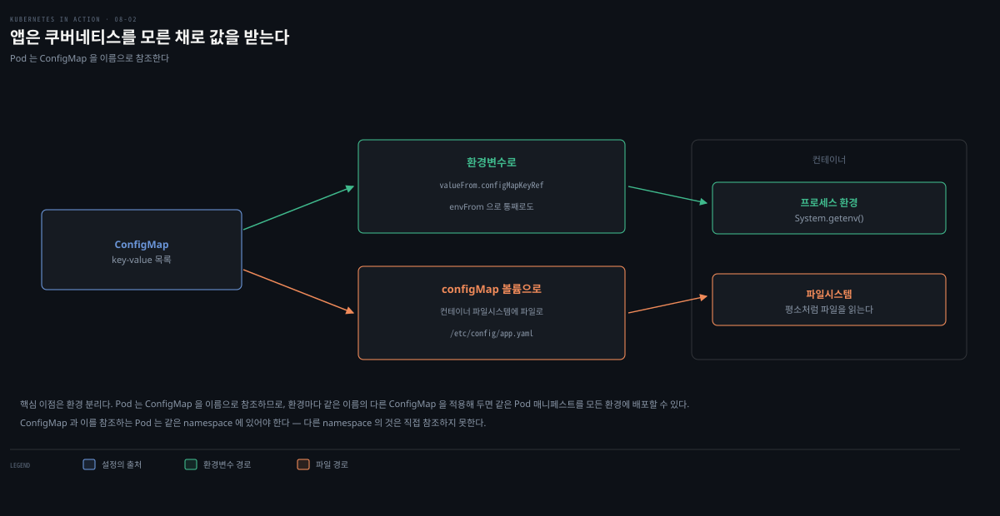
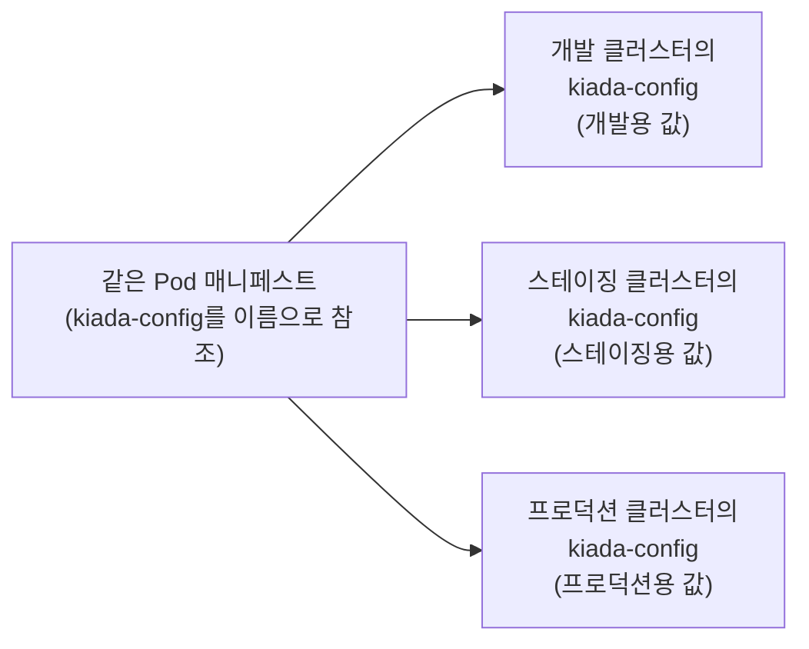
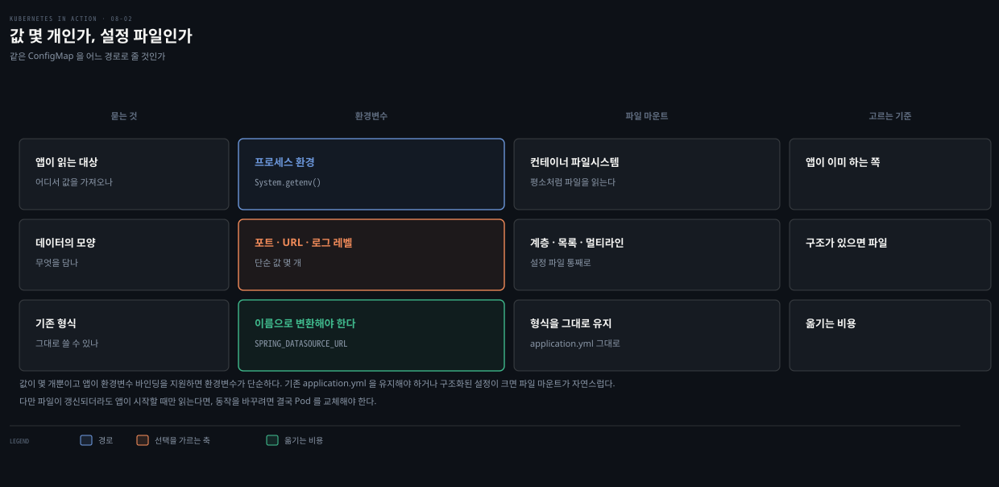
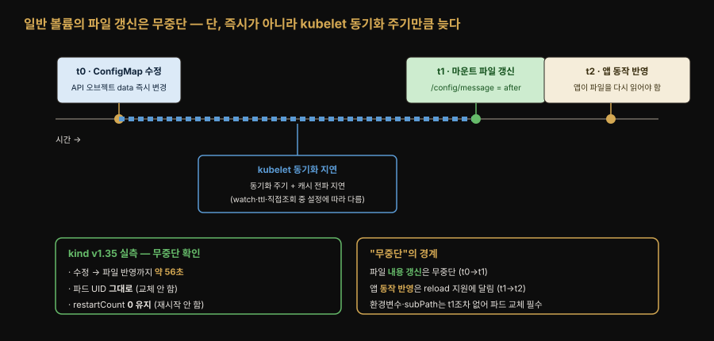
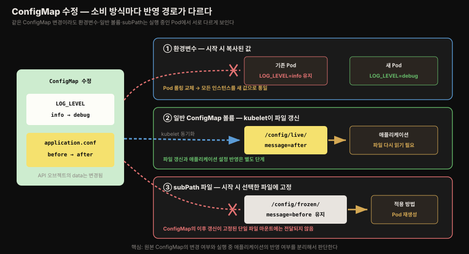

# ConfigMap으로 설정 분리하기
---
> 설정을 매니페스트에 하드코딩하면 환경(개발·스테이징·프로덕션)마다 매니페스트를 따로 둬야 합니다. 설정을 ConfigMap 오브젝트로 분리하고 Pod가 이름으로 참조하게 하면, 같은 Pod 매니페스트를 모든 환경에 배포하면서 환경마다 다른 설정을 쓸 수 있습니다. 이 편에서는 ConfigMap의 생성·주입·갱신과 immutable 옵션을 정리합니다.


## 진입 — 이 문서를 읽고 나면 무엇을 할 수 있는가

> 이 문서를 읽고 나면 --from-literal·--from-file·--from-env-file로 ConfigMap을 만들고, configMapKeyRef·envFrom으로 환경변수에 주입하고 optional의 효과를 설명하며, ConfigMap 갱신이 실행 중인 Pod에 언제 반영되는지와 immutable을 쓰는 이유를 말할 수 있습니다.

이 개념은 "설정 파일을 코드에서 분리해 배포 환경별로 갈아 끼운다"는 익숙한 외부화 원칙입니다. 다만 쿠버네티스는 그 설정을 파일이 아니라 API 오브젝트로 두고, Pod가 **이름으로** 참조하게 해 같은 매니페스트가 어느 환경에서든 그 환경의 설정을 집어 들게 한다는 점이 다릅니다.


## 1. ConfigMap이 푸는 문제 — 매니페스트에서 설정 떼어내기

> ConfigMap은 key-value 목록을 담는 API 오브젝트이고, 애플리케이션은 쿠버네티스를 모른 채 환경변수나 파일로 그 값을 받습니다.

08-01에서는 설정을 Pod 매니페스트에 직접 넣었습니다. 이미지에 하드코딩하는 것보다는 낫지만, 배포 환경(개발·스테이징·프로덕션 클러스터)마다 매니페스트를 따로 둬야 할 수 있어 여전히 이상적이지 않습니다. 같은 Pod 정의를 여러 환경에서 재사용하려면 설정을 매니페스트에서 분리해야 하고, 그 방법 중 하나가 설정을 **ConfigMap** 오브젝트로 옮기고 Pod에서 참조하는 것입니다.

ConfigMap은 key-value 쌍의 목록을 담는 API 오브젝트입니다. 값은 짧은 문자열부터 애플리케이션 설정 파일에서 볼 법한 큰 구조화 텍스트 블록까지 다양합니다. Pod 하나가 여러 ConfigMap을 참조할 수 있고, 여러 Pod가 같은 ConfigMap을 쓸 수 있습니다.

ConfigMap과 이를 참조하는 Pod는 같은 namespace에 있어야 합니다. 개발과 운영 namespace에 같은 이름의 ConfigMap을 각각 만들 수 있지만, Pod가 다른 namespace의 ConfigMap을 직접 참조할 수는 없습니다.

애플리케이션을 쿠버네티스에 무관하게(Kubernetes-agnostic) 유지하기 위해, 보통 애플리케이션이 쿠버네티스 REST API로 ConfigMap을 읽게 하지 않습니다. 대신 ConfigMap의 key-value 쌍을 **환경변수**로 전달하거나 configMap 볼륨으로 컨테이너 파일시스템에 **파일로 마운트**합니다(볼륨은 다음 장).



핵심 이점은 환경 분리입니다. Pod는 ConfigMap을 **이름**으로 참조하므로, 환경마다 같은 이름의 다른 ConfigMap 매니페스트를 적용해 두면 동일한 Pod 매니페스트를 모든 환경에 배포해도 각 환경의 설정이 적용됩니다.




## 2. ConfigMap 만들기 — 명령·매니페스트·파일

> kubectl create configmap은 --from-literal·--from-file·--from-env-file 세 방식으로 엔트리를 채우며, --dry-run=client -o yaml과 조합하면 버전 관리용 매니페스트를 생성할 수 있습니다.

가장 빠른 생성 방법은 `kubectl create configmap`입니다.

```bash
kubectl create configmap kiada-config \
  --from-literal status-message="This status message is set in the kiada-config ConfigMap"
```

> ConfigMap의 키는 영숫자·대시·밑줄·점만 쓸 수 있습니다.

엔트리를 채우는 옵션은 세 가지입니다. 같은 옵션을 여러 번 사용해 여러 엔트리를 만들 수 있습니다.

| 옵션 | 동작 |
|------|------|
| --from-literal | key=value를 직접 지정 |
| --from-file | 파일 내용을 엔트리로. `파일명`만 주면 파일 basename이 키·내용이 값, `key=파일`이면 지정 키에 저장, **디렉터리**를 주면 안의 각 파일이 별도 엔트리(부적합한 이름의 파일·하위 디렉터리 등은 무시) |
| --from-env-file | `key=value` 형식의 줄들로 이뤄진 파일을 각 줄이 별도 엔트리가 되게 삽입 |

세 방식의 차이는 생성된 `data`를 보면 분명해집니다. 다음 명령은 API 서버에 저장하지 않고 결과 YAML만 출력하므로 키가 어떻게 만들어지는지 확인하기 좋습니다.

```bash
# data.LOG_LEVEL=debug인 엔트리 하나를 직접 만듭니다.
kubectl create configmap literal-config \
  --from-literal=LOG_LEVEL=debug \
  --dry-run=client -o yaml

# 파일명 application.yml이 키, 파일 내용 전체가 값이 됩니다.
kubectl create configmap file-config \
  --from-file=application.yml \
  --dry-run=client -o yaml

# application.env의 각 KEY=value 줄이 별도 키가 됩니다.
kubectl create configmap env-file-config \
  --from-env-file=application.env \
  --dry-run=client -o yaml
```

실제 출력은 다음과 같습니다. `--dry-run=client`를 사용했으므로 이 YAML은 화면에만 출력되고 클러스터에는 저장되지 않습니다.

```yaml
# --from-literal 결과: 지정한 LOG_LEVEL이 키가 됩니다.
apiVersion: v1
data:
  LOG_LEVEL: debug
kind: ConfigMap
metadata:
  name: literal-config
---
# --from-file 결과: 파일명 하나가 키, 파일 전체가 값이 됩니다.
apiVersion: v1
data:
  application.yml: |
    server:
      port: 8080
    logging:
      level:
        root: INFO
kind: ConfigMap
metadata:
  name: file-config
---
# --from-env-file 결과: 각 KEY=value 줄이 별도 엔트리가 됩니다.
apiVersion: v1
data:
  APP_MODE: practice
  LOG_LEVEL: info
  SERVER_PORT: "8080"
kind: ConfigMap
metadata:
  name: env-file-config
```

YAML 매니페스트로도 만듭니다 — key-value는 `data` 필드에 둡니다.

```yaml
apiVersion: v1
kind: ConfigMap
metadata:
  name: kiada-config
data:
  status-message: This status message is set in the kiada-config ConfigMap
```

파일 기반 ConfigMap을 버전 관리 시스템에 두고 싶다면 `--dry-run=client -o yaml` 조합으로 매니페스트를 생성합니다.

```bash
kubectl create configmap dummy-config \
      --from-file=dummy.txt \
      --from-file=dummy.bin \
      --dry-run=client -o yaml > dummy-configmap.yaml
```

생성된 매니페스트를 보면 바이너리 파일은 `binaryData` 필드에 Base64로 인코딩되어 들어갑니다 — 엔트리에 UTF-8이 아닌 바이트가 있으면 binaryData에 둬야 하고, kubectl이 어디에 둘지 자동으로 판단합니다. 텍스트 파일은 `data` 필드에 파이프 문자(`|`)를 쓴 멀티라인 값으로 그대로 보입니다.

> **공백 위생.** 파일의 어느 줄이든 끝에 공백이 있으면 그 엔트리는 이스케이프된 따옴표 문자열로 직렬화되어 읽기 어려워집니다. 후행 공백이 없는 파일은 읽기 좋은 멀티라인 문자열로 표현됩니다.

조회는 다른 오브젝트와 같습니다.

```bash
kubectl get cm                              # 축약형 cm
kubectl get cm kiada-config -o yaml         # data 필드가 알파벳순이라 위쪽에 나옴
kubectl get cm kiada-config -o json | jq .data                    # 엔트리만
kubectl get cm kiada-config -o json | jq '.data["status-message"]'  # 특정 값
```


## 3. 환경변수로 주입 — configMapKeyRef와 envFrom

> ConfigMap에는 여러 설정이 함께 들어 있지만, 컨테이너가 그 값을 모두 필요로 하는 것은 아닙니다. 필요한 키만 명시적으로 받으려면 `configMapKeyRef`, 설정 묶음 전체를 받으려면 `envFrom`을 사용합니다.

두 필드가 따로 존재하는 이유는 **ConfigMap과 컨테이너 사이의 결합 범위**를 선택하기 위해서입니다. 예를 들어 ConfigMap에 `SERVER_PORT`, `LOG_LEVEL`, `APP_MODE`가 있어도 웹 컨테이너가 포트만 필요하다면 `configMapKeyRef`로 `SERVER_PORT` 하나만 가져오는 편이 안전합니다. 세 설정을 모두 사용하는 애플리케이션이라면 `envFrom`으로 한 번에 가져오는 편이 간결합니다.

| 선택 기준 | configMapKeyRef | envFrom |
|-----------|-----------------|---------|
| 가져오는 범위 | 지정한 키 하나 | ConfigMap의 모든 키 |
| 환경변수 이름 | `env[].name`으로 변경 가능 | ConfigMap 키를 그대로 사용하며 prefix만 추가 가능 |
| ConfigMap에 새 키가 추가될 때 | 컨테이너 환경에 들어오지 않음 | 컨테이너 환경에도 자동으로 추가됨 |
| 적합한 상황 | 필요한 설정과 이름을 명시적으로 관리 | 같은 목적의 설정 묶음을 통째로 사용 |

엔트리 하나를 환경변수로 주입하려면 value 대신 `valueFrom`을 씁니다.

```yaml
spec:
  containers:
  - name: kiada
    env:
    - name: INITIAL_STATUS_MESSAGE
      valueFrom:
        configMapKeyRef:          # 고정값 대신 ConfigMap 키에서 가져옴
          name: kiada-config      # ConfigMap 이름
          key: status-message     # 그 안의 키
          optional: true          # 없어도 컨테이너는 실행됨
```

`optional: true`면 ConfigMap이나 키가 없어도 컨테이너가 실행되고 환경변수만 설정되지 않습니다. optional이 아닌 참조 대상이 없으면 Pod는 스케줄링되지만 해당 컨테이너는 `CreateContainerConfigError` 상태로 기다립니다. 같은 Pod의 다른 컨테이너는 문제가 된 ConfigMap을 참조하지 않는다면 실행될 수 있습니다.

변수를 몇 개 이상 쓰게 되면 하나씩 지정하는 것이 번거롭고 실수하기 쉽습니다. `env` 대신 `envFrom`을 쓰면 ConfigMap의 **모든 엔트리를 한 번에** 주입합니다.

```yaml
spec:
  containers:
  - name: kiada
    envFrom:
    - configMapRef:
        name: kiada-config    # 키 지정 없이 이름만
        optional: true
```

단점은 키를 환경변수 이름으로 변환할 수 없다는 것입니다 — 키가 이미 올바른 형태(예: `INITIAL_STATUS_MESSAGE`)여야 하며, 가능한 유일한 변환은 각 키 앞에 **prefix를 붙이는 것**뿐입니다.

envFrom은 리스트이므로 여러 ConfigMap을 조합할 수 있습니다. 두 ConfigMap에 같은 키가 있으면 **마지막 것이 우선**하고, envFrom과 env를 함께 쓸 수도 있는데 **env에 설정된 변수가 envFrom보다 우선**합니다.

### 환경변수와 파일 중 무엇을 선택할까

두 방식은 ConfigMap이라는 같은 원본을 사용하지만 **애플리케이션에 전달하는 인터페이스**가 다릅니다. 환경변수 방식은 kubelet이 값을 컨테이너의 프로세스 환경에 넣고 애플리케이션이 `getenv`나 설정 바인딩으로 읽습니다. 파일 방식은 kubelet이 ConfigMap 키를 파일로 만들고, 애플리케이션이 YAML·JSON·properties 같은 형식을 직접 해석합니다.

Kubernetes가 `application.yml`을 Spring 설정으로 해석해 주는 것은 아닙니다. Kubernetes의 역할은 파일을 컨테이너에 마운트하는 데서 끝납니다. 그 파일의 위치를 알고 설정으로 읽는 책임은 Spring Boot나 Envoy 같은 애플리케이션에 있습니다.

| 선택 기준 | 환경변수로 주입 | 파일로 마운트 |
|-----------|-----------------|----------------|
| 애플리케이션이 읽는 대상 | 프로세스 환경 | 컨테이너 파일시스템 |
| 적합한 데이터 | 포트·URL·로그 레벨 같은 단순 값 | 계층·목록·멀티라인이 있는 설정 파일 |
| 기존 설정 형식 유지 | 환경변수 이름으로 변환 필요 | YAML·JSON·properties 형식을 그대로 유지 |
| 실행 중 ConfigMap 수정 | 기존 Pod의 값은 바뀌지 않음 | 일반 볼륨 파일은 나중에 갱신될 수 있음 |
| 실제 동작 반영 | Pod 교체 필요 | 애플리케이션의 파일 재로딩 지원 필요 |



- 값이 몇 개뿐이고 애플리케이션이 환경변수 바인딩을 지원하면 환경변수가 단순합니다. 기존 `application.yml`을 유지해야 하거나 구조화된 설정이 크면 파일 마운트가 자연스럽습니다. 파일이 갱신되더라도 애플리케이션이 시작할 때만 읽는다면 동작을 바꾸기 위해 결국 Pod를 교체해야 합니다.


## 4. ConfigMap 갱신과 삭제 — 반영 시점과 immutable

> ConfigMap을 갱신해도 실행 중인 Pod의 환경변수는 바뀌지 않습니다. 모든 인스턴스에 같은 값을 적용하려면 Pod를 롤링 교체해야 하며, immutable ConfigMap은 설정 변경을 새 버전 배포로 다루게 합니다.

빠른 수정에는 `kubectl edit`을 씁니다.

```bash
kubectl edit configmap kiada-config     # 기본 편집기로 열림, 닫으면 API에 반영
```

> 편집기는 `KUBE_EDITOR` 환경변수로 바꿉니다(예: `export KUBE_EDITOR="/usr/bin/nano"`). 없으면 보통 `EDITOR` 환경변수로 설정된 기본 편집기를 씁니다. JSON으로 편집하려면 `-o json`.

### 환경변수와 볼륨은 갱신 경로가 다르다

> 이 편은 ConfigMap을 환경변수와 파일로 전달했을 때 **갱신 시점이 어떻게 달라지는지**까지만 다룹니다. `mountPath`·`subPath`의 파일 배치, 특정 키 선택, Secret·Downward API를 합치는 projected 볼륨은 [09-03.ConfigMap·Secret·Downward API·projected 볼륨](./09-03.ConfigMap%C2%B7Secret%C2%B7Downward%20API%C2%B7projected%20%EB%B3%BC%EB%A5%A8.md)에서 자세히 설명합니다.

**ConfigMap을 환경변수로 주입하면 kubelet이 컨테이너 시작 전에 값을 복사해 실행 환경을 만듭니다.** 실행 중인 프로세스의 환경은 ConfigMap과 계속 연결되어 있지 않으므로 원본을 수정해도 바뀌지 않습니다. 운영에서는 `kubectl rollout restart deployment/<이름>`처럼 Pod를 롤링 교체해 모든 인스턴스를 새 값으로 통일합니다.

**ConfigMap을 볼륨으로 마운트하면 kubelet이 관리하는 파일을 컨테이너에서 읽습니다.** kubelet 동기화 후 일반 마운트의 파일은 바뀔 수 있지만, 이것은 파일 내용의 갱신일 뿐입니다. 애플리케이션이 파일을 다시 읽거나 변경을 감지하지 않으면 실제 동작은 이전 설정을 계속 사용합니다.

**이 파일 갱신은 파드를 교체하거나 컨테이너를 재시작하지 않고 일어나므로 무중단입니다.** 다만 즉시가 아니라 kubelet 동기화 주기와 캐시 전파 지연만큼 늦습니다. 실제로 `kind-k8s-lab`(v1.35)에서 ConfigMap을 고친 뒤 마운트 파일이 바뀌기까지 약 56초가 걸렸고, 그동안 파드 UID와 `restartCount`는 그대로였습니다. 지연의 크기는 kubelet의 `configMapAndSecretChangeDetectionStrategy`(watch·ttl·직접 조회) 설정에 따라 달라집니다. 볼륨의 배치·투영 원리는 [09-03](./09-03.ConfigMap%C2%B7Secret%C2%B7Downward%20API%C2%B7projected%20%EB%B3%BC%EB%A5%A8.md)에서 다룹니다.



| 전달 방식 | 실행 중인 Pod에서 ConfigMap 수정 결과 | 새 설정을 적용하는 방법 |
|-----------|--------------------------------------|--------------------------|
| 환경변수 | 기존 값 유지 | Pod 롤링 교체 |
| 일반 ConfigMap 볼륨 | kubelet 동기화 후 파일 갱신 | 애플리케이션이 파일을 다시 읽음 |
| `subPath` 파일 마운트 | 파일이 갱신되지 않음 | Pod를 새로 생성 |



실습에서는 같은 볼륨을 일반 디렉터리와 `subPath` 파일로 동시에 마운트해 차이를 비교했습니다.

```yaml
volumeMounts:
  - name: config
    mountPath: /config/live
  - name: config
    mountPath: /config/frozen/application.conf
    subPath: application.conf
volumes:
  - name: config
    configMap:
      name: file-config
```

일반 마운트는 ConfigMap의 디렉터리 투영을 통해 새 파일을 보지만, `subPath`는 컨테이너 시작 시 선택한 파일 하나를 고정해서 마운트합니다. 이후 kubelet이 ConfigMap 볼륨의 내용을 갱신해도 이 고정된 마운트에는 전달되지 않습니다. 볼륨의 구성과 투영 원리는 09-03에서 자세히 다룹니다.

교체 전에 스케일 아웃하거나 장애로 새 Pod가 만들어지면 기존 Pod의 환경변수는 이전 값, 새 Pod는 변경된 값을 사용합니다. **서로 다르게 설정된 Pod들이 공존**하게 되고, 시스템 일부가 나머지와 다르게 동작할 수 있습니다.

### 설정 혼재를 막는 immutable

이를 막는 한 가지 방법은 ConfigMap을 **immutable**로 표시하는 것입니다.

```yaml
apiVersion: v1
kind: ConfigMap
metadata:
  name: my-immutable-configmap
data:
  mykey: myvalue
immutable: true      # data·binaryData 변경을 API 서버가 거부
```

immutable ConfigMap은 한 번 설정하면 `data`와 `binaryData`를 바꿀 수 없고, `immutable`을 다시 제거할 수도 없습니다. 사용자의 실수를 막을 뿐 아니라 kubelet이 변경 감시를 유지할 필요가 없어 API 서버 부하도 줄어듭니다. 값을 바꾸려면 새 이름의 ConfigMap을 만들고 Deployment의 참조 이름을 변경해 롤링 업데이트를 일으킵니다.

삭제는 `kubectl delete`로 합니다. ConfigMap을 환경변수로 받은 실행 중 Pod는 기존 값으로 계속 돌지만, 참조가 optional이 아닌 새 Pod는 시작하지 못합니다. 따라서 ConfigMap을 지우기 전에 이를 참조하는 워크로드의 교체와 스케일 아웃 가능성까지 확인해야 합니다.


## 5. 실습 기록

> ConfigMap의 생성·주입·갱신 동작을 `kind-k8s-lab` 클러스터에서 확인했습니다. 전체 매니페스트와 재현 명령은 `k8s_in_action/08-configuring-apps/configmap/README.md`에 있습니다.

### 생성 방식과 환경변수 주입

`--dry-run=client -o yaml`로 세 생성 방식의 결과를 비교했습니다. `--from-literal`은 지정한 이름을 키로 사용했고, `--from-file`은 `application.yml`이라는 파일명 하나를 키로 사용했습니다. `--from-env-file`은 파일의 `APP_MODE`, `LOG_LEVEL`, `SERVER_PORT`를 각각 별도 키로 만들었습니다.

`envFrom`과 `configMapKeyRef`를 함께 사용한 Pod에서는 다음 결과가 나왔습니다. 앞의 세 변수는 `envFrom`이 모두 가져왔고, `HTTP_PORT`는 `configMapKeyRef`가 `SERVER_PORT` 하나를 골라 다른 이름으로 주입했습니다.

```text
APP_MODE=practice LOG_LEVEL=info SERVER_PORT=8080 HTTP_PORT=8080
```

### 필수 참조와 optional 참조

존재하지 않는 ConfigMap을 필수로 참조한 컨테이너는 시작하지 못했습니다. 같은 Pod에서 해당 ConfigMap과 무관한 컨테이너는 정상 실행됐으므로 Pod 상태는 `1/2`가 됐습니다.

```text
configmap-required   1/2   CreateContainerConfigError
independent => running
required => configmap "does-not-exist" not found
```

`optional: true`를 지정한 Pod는 `1/1 Running`이 됐습니다. 환경변수 자체는 만들어지지 않았으므로 `printenv`는 종료 코드 1을 반환했습니다.

### 환경변수 갱신과 롤링 교체

두 Pod가 `LOG_LEVEL=info`를 사용하는 동안 ConfigMap을 `debug`로 수정하고 replica를 하나 늘렸습니다. 기존 Pod 두 개는 `info`, 새 Pod 하나는 `debug`를 출력해 설정이 섞였습니다.

```text
pod=configmap-rollout-... LOG_LEVEL=info
pod=configmap-rollout-... LOG_LEVEL=info
pod=configmap-rollout-... LOG_LEVEL=debug
```

Deployment를 롤링 재시작한 뒤 새 ReplicaSet의 Pod 세 개가 모두 `debug`를 출력했습니다. ConfigMap 수정은 기존 환경변수를 바꾸지 않으며, Pod 교체가 모든 인스턴스를 새 값으로 통일한다는 사실을 확인했습니다.

### 볼륨 갱신과 immutable

ConfigMap의 `application.conf`를 `message=before`에서 `message=after`로 수정했습니다. kubelet 동기화 후 일반 볼륨은 새 값으로 바뀌었지만 `subPath` 파일은 이전 값에 머물렀습니다.

```text
# 일반 마운트
message=after
feature.enabled=true

# subPath 마운트
message=before
feature.enabled=false
```

마지막으로 `immutable: true`인 `immutable-config-v1`의 `data` 수정을 시도했습니다. API 서버는 `field is immutable` 오류로 요청을 거부했고, 새 값은 별도 오브젝트인 `immutable-config-v2`에 저장했습니다.


## Spring 앱 배포 관점에서

> Spring Boot 설정은 ConfigMap의 환경변수나 설정 파일로 주입할 수 있습니다. 어떤 방식을 쓰더라도 설정 변경과 애플리케이션 반영 시점을 따로 판단해야 합니다.

간단한 프로퍼티는 `envFrom`과 Spring Boot의 relaxed binding을 조합합니다. 예를 들어 ConfigMap의 `SPRING_DATASOURCE_URL`과 `SERVER_PORT`는 각각 `spring.datasource.url`과 `server.port`에 연결됩니다. 설정 파일 전체를 유지해야 한다면 `--from-file`로 `application.yml`을 담고 ConfigMap 볼륨으로 마운트하는 편이 자연스럽습니다.

환경변수 방식은 실행 중인 Spring 프로세스에서 바뀌지 않으므로 ConfigMap을 수정한 뒤 Deployment의 Pod를 롤링 교체해야 합니다. 파일 방식은 마운트된 파일이 나중에 갱신될 수 있지만, Spring Boot가 기본적으로 모든 설정 파일 변경을 자동 재로딩하는 것은 아닙니다. 파일이 바뀌었다는 사실만으로 애플리케이션 설정도 바뀐다고 가정하면 안 됩니다.

파일 방식이라도 값의 성격에 따라 결국 파드를 교체해야 하는 경우가 있습니다. `server.port`가 그 예입니다. 톰캣은 부팅하면서 그 포트로 소켓을 bind합니다. 그래서 파일이 무중단으로 `9090`으로 바뀌어도 이미 열린 리스너를 런타임에 옮길 수 없어 재기동이 유일한 길입니다. JVM 힙 크기나 커넥션 풀 초기 크기처럼 시작 시점에 한 번만 읽히는 값도 같습니다. 반대로 로그 레벨이나 기능 플래그처럼 요청마다 다시 읽히는 값은 파일 갱신만으로 무중단 반영됩니다. 그 사이에 `@RefreshScope`와 actuator `/refresh`, Spring Cloud Kubernetes의 `spring.cloud.kubernetes.reload`처럼 앱이 명시적 리프레시를 구현했을 때만 런타임에 반영되는 값도 있습니다. 즉 "파일 갱신은 무중단"과 "그 값을 앱이 런타임에 받아들일 수 있는가"는 별개의 문제입니다. 후자는 값이 프로세스 시작 시점에 고정되는지에 달렸습니다.

운영에서는 `kiada-config-8f3a2b`처럼 내용 해시가 포함된 새 ConfigMap을 만들고 Pod 템플릿의 참조 이름을 변경하는 방식을 자주 사용합니다. Pod 템플릿이 바뀌므로 Deployment가 롤링 업데이트를 시작하고, 이전 설정과 새 설정의 배포 이력도 이름으로 구분할 수 있습니다. Kustomize의 `configMapGenerator`는 이 이름 생성과 참조 변경을 자동화합니다.


## 6. 면접 대비

> ConfigMap의 생성 구조, 주입 범위, 누락 시 상태, 갱신 전략을 네 질문으로 회상합니다.

### Q1. --from-file과 --from-env-file은 무엇이 다릅니까?

`--from-file`은 파일명을 ConfigMap의 키로, 파일 내용 전체를 값으로 저장합니다. `--from-env-file`은 파일의 각 `KEY=value` 줄을 별도 엔트리로 만듭니다. 두 방식 모두 값을 치환하지 않습니다.

### Q2. configMapKeyRef와 envFrom은 언제 사용합니까?

`configMapKeyRef`는 특정 키 하나를 선택하고 컨테이너의 환경변수 이름을 다르게 지정할 때 사용합니다. `envFrom`은 ConfigMap의 모든 엔트리를 키와 같은 환경변수 이름으로 한 번에 가져올 때 사용합니다.

### Q3. 필수 ConfigMap이 없으면 Pod는 어떤 상태가 됩니까?

참조하는 컨테이너는 `state.waiting.reason=CreateContainerConfigError`로 기다리고 Pod phase는 `Pending`입니다. 같은 Pod의 다른 컨테이너는 해당 참조와 무관하면 실행될 수 있습니다. `optional: true`를 지정하면 참조 대상이 없어도 컨테이너가 실행되며 환경변수는 설정되지 않습니다.

### Q4. ConfigMap을 수정하면 실행 중인 Pod에 어떻게 반영합니까?

환경변수는 기존 Pod에서 바뀌지 않으므로 워크로드의 Pod를 롤링 교체해야 합니다. 일반 ConfigMap 볼륨 파일은 kubelet 동기화 후 갱신되지만 애플리케이션이 파일을 다시 읽어야 실제 동작이 바뀝니다. `subPath` 마운트는 ConfigMap이 변경돼도 갱신되지 않습니다.


## 관련 문서

> 이 편은 설정을 매니페스트에서 분리하는 ConfigMap의 생성·주입·갱신을 다룹니다. 다음 편(08-03)에서 민감 정보를 담는 Secret과 Pod 메타데이터를 주입하는 Downward API로 이어집니다.

- [08-03.Secret과 Downward API](./08-03.Secret%EA%B3%BC%20Downward%20API.md) — 민감 데이터용 Secret과 Pod 메타데이터 주입을 다루는 다음 편
- [08-01.command·args와 환경변수](./08-01.command%C2%B7args%EC%99%80%20%ED%99%98%EA%B2%BD%EB%B3%80%EC%88%98.md) — ConfigMap 값을 받아 쓸 env·args 참조 문법을 다룬 이전 편
- [09-03.ConfigMap·Secret·Downward API·projected 볼륨](./09-03.ConfigMap%C2%B7Secret%C2%B7Downward%20API%C2%B7projected%20%EB%B3%BC%EB%A5%A8.md) — ConfigMap을 볼륨 파일로 배치하고 여러 설정 소스를 투영하는 방법
- [K8s 환경변수와 Spring 설정 주입](../../kubernetes/02_configuration/02-01.K8s%20%ED%99%98%EA%B2%BD%EB%B3%80%EC%88%98%EC%99%80%20Spring%20%EC%84%A4%EC%A0%95%20%EC%A3%BC%EC%9E%85.md) — ConfigMap→환경변수→Spring 프로퍼티로 이어지는 주입 경로를 실습 관점에서 다룬 개념 노트
- [Kubernetes 공식 문서 — ConfigMaps](https://kubernetes.io/docs/concepts/configuration/configmap/) — ConfigMap의 최신 공식 설명
