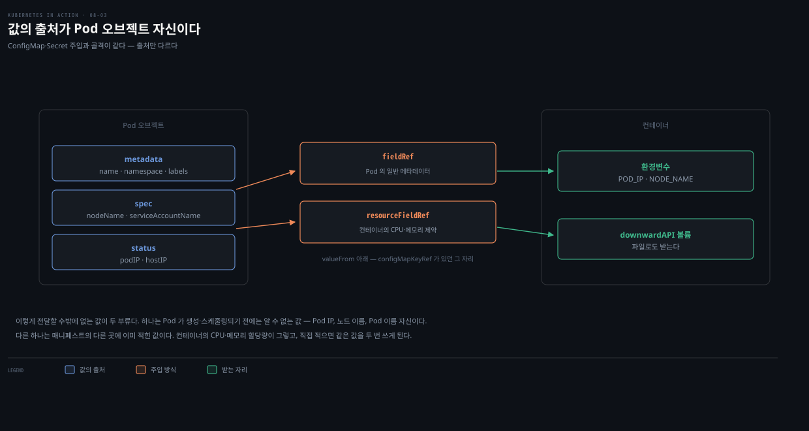

# Secret과 Downward API
---
> 자격증명·인증서 같은 민감 데이터는 ConfigMap이 아니라 Secret에 담습니다 — 쿠버네티스가 필요한 노드에만 배포하고 노드에서 메모리에만 유지하기 때문입니다. 이 편에서는 Secret의 구조와 내장 타입, 생성과 주입, "Base64는 암호화가 아니다"로 요약되는 보안 한계, 그리고 Pod 자신의 메타데이터를 컨테이너에 주입하는 Downward API를 정리합니다.


## 진입 — 이 문서를 읽고 나면 무엇을 할 수 있는가

> 이 문서를 읽고 나면 Secret과 ConfigMap의 필드 차이(data·stringData)를 설명하고, generic·tls·docker-registry Secret을 만들고, 환경변수 주입이 왜 위험한지 말하며, fieldRef·resourceFieldRef로 Pod 이름·IP·리소스 한도를 컨테이너에 주입할 수 있습니다.

이 개념은 08-02의 ConfigMap과 같은 key-value 주입 메커니즘의 두 변형입니다 — Secret은 "값이 민감할 때", Downward API는 "값이 Pod 오브젝트 자신 안에 이미 있을 때"를 맡습니다.


## 1. Secret — ConfigMap과 무엇이 다른가

> Secret은 ConfigMap보다 먼저 도입돼 기능이 수렴했지만, 필드 구조(data는 Base64·stringData는 write-only)와 type 필드, 그리고 쿠버네티스의 취급 방식(필요 노드에만 배포·메모리 저장)이 다릅니다.

Secret도 key-value 쌍을 담고 환경변수·파일 주입에 쓰이므로 ConfigMap과 크게 다르지 않아 보입니다. 사실 Secret이 ConfigMap보다 **먼저** 도입됐습니다. 초기 Secret은 값이 Base64 인코딩이어야 해서 평문 데이터를 다루기 불편했고, 그래서 나중에 ConfigMap이 도입됐습니다.

시간이 지나며 둘 다 평문·바이너리를 지원하게 되어 기능이 수렴했습니다 — 지금 만든다면 하나의 오브젝트 타입이었을 것입니다. 다만 각자 점진적으로 진화한 탓에 차이가 남아 있습니다. 필드 구조·type 필드·쿠버네티스 취급 방식 세 축에서 갈립니다.


| Secret 필드 | ConfigMap 필드 | 설명 |
|-------------|----------------|------|
| data | binaryData | Base64 인코딩된 값의 key-value 맵 |
| stringData | data | 평문 값의 key-value 맵. Secret의 stringData는 **write-only** |
| immutable | immutable | 데이터 변경 가능 여부 |
| type | (없음) | Secret의 종류. 임의 문자열도 되지만 내장 타입엔 요구사항이 있음 |

`stringData`는 값을 손으로 인코딩하지 않고 평문으로 넣게 해 주는 **쓰기 전용** 필드입니다. API에서 Secret을 다시 읽으면 stringData 필드는 없고, 거기 넣었던 것이 `data` 필드에 Base64 문자열로 나타납니다 — 넣은 필드에 그대로 저장되는 ConfigMap의 data·binaryData와 다른 동작입니다.

> data 필드의 값이 Base64인 것은 YAML·JSON이 바이너리를 직접 담지 못하기 때문이며, **매니페스트 안에서만** 인코딩된 상태입니다. Secret을 컨테이너에 주입할 때 쿠버네티스가 디코딩하므로, 애플리케이션은 원본 값을 그대로 읽습니다.

`type` 필드는 주로 프로그램적 처리를 위한 것이고, 내장 타입은 특정 키에 특정 형식의 값을 요구합니다.

| 내장 타입 | 용도·요구사항 |
|-----------|--------------|
| Opaque | 임의 키의 비밀 데이터. type 없이 만들면 이것 |
| bootstrap.kubernetes.io/token | 새 클러스터 노드 부트스트랩용 토큰 |
| kubernetes.io/basic-auth | 기본 인증 자격증명 — `username`·`password` 키 필수 |
| kubernetes.io/dockercfg | 레거시 Docker 레지스트리 자격증명 — `.dockercfg` 키 |
| kubernetes.io/dockerconfigjson | Docker 레지스트리 자격증명 — `.dockerconfigjson` 키(~/.docker/config.json 내용) |
| kubernetes.io/service-account-token | 서비스 어카운트 식별 토큰 |
| kubernetes.io/ssh-auth | SSH 개인 키 — `ssh-privatekey` 키 |
| kubernetes.io/tls | TLS 인증서·개인 키 — `tls.crt`·`tls.key` 키 |

필드 차이 외에 쿠버네티스의 **취급**도 다릅니다. Secret 데이터는 그 Secret이 필요한 Pod가 도는 **노드에만 배포**되고, 워커 노드에서는 항상 **메모리에만 저장**되며 물리 스토리지에 쓰이지 않습니다. 민감 데이터가 새어 나갈 가능성을 줄이는 조치들이며, 그래서 민감 데이터는 ConfigMap이 아니라 Secret에만 담아야 합니다.


## 2. Secret 만들기 — generic·tls·docker-registry

> kubectl create secret은 타입을 바로 뒤에 지정하며, Secret 매니페스트는 보안상 버전 관리에 두지 않으므로 명령 생성이 ConfigMap보다 훨씬 자주 쓰입니다.

ConfigMap과 달리 `kubectl create secret` 뒤에 **타입을 즉시 지정**합니다.

```bash
kubectl create secret generic kiada-secret-config \
  --from-literal status-message="This status message is set in the kiada-secret-config Secret"
```

여기서 `generic`은 단순한 옵션이 아니라 **서브커맨드**입니다. 이 서브커맨드가 Secret의 type과 그 type이 요구하는 키 형식을 함께 정합니다. `--type=`을 직접 주는 게 아니라 kubectl이 서브커맨드에 맞는 type을 YAML에 자동으로 박습니다.

| 서브커맨드 | 정해지는 type | 채워지는 키 |
|-----------|--------------|------------|
| `generic` | (생략 = `Opaque`) | 임의 키(`--from-literal`·`--from-file`이 준 대로) |
| `tls` | `kubernetes.io/tls` | `--cert`→`tls.crt`, `--key`→`tls.key` |
| `docker-registry` | `kubernetes.io/dockerconfigjson` | `--docker-*` 플래그를 합쳐 `.dockerconfigjson` |

그래서 아래 `tls`·`docker-registry` 예시는 `type:` 줄을 손으로 쓰지 않아도 서브커맨드가 §1 표의 내장 타입을 그대로 붙여 줍니다. YAML을 직접 작성할 때만 `type:`과 요구 키를 표대로 맞춰 넣으면 됩니다.

> Secret의 최대 크기도 ConfigMap처럼 약 1MB입니다.

Secret도 API 오브젝트라 YAML 매니페스트로 만들 수 있지만, 당연한 보안상 이유로 Secret 매니페스트를 버전 관리 시스템에 두는 것은 좋은 생각이 아닙니다. 그래서 Secret은 ConfigMap보다 `kubectl create secret` 명령을 훨씬 자주 쓰게 됩니다. 매니페스트가 필요하면 `--dry-run=client -o yaml` 기법을 씁니다 — Base64 인코딩을 손으로 하는 것보다 훨씬 쉽습니다.

```bash
kubectl create secret generic my-credentials \
   --from-literal user=my-username \
   --from-literal pass=my-password \
   --dry-run=client -o yaml
# data:
#   pass: bXktcGFzc3dvcmQ=      ← Base64 인코딩된 값
#   user: bXktdXNlcm5hbWU=
```

인코딩을 아예 피하려면 `stringData`로 평문을 넣습니다.

```yaml
apiVersion: v1
kind: Secret
type: Opaque           # 생략해도 됨 — 지정 안 하면 Opaque로 간주
stringData:            # 평문 그대로 — 읽어 보면 data에 Base64로 나타남
  user: my-username
  pass: my-password
```

> 위 YAML의 `type: Opaque`는 생략할 수 있습니다.
>
> `kubectl create secret generic`을 `--dry-run=client -o yaml`로 뽑아 보면 `type` 줄이 아예 나오지 않습니다. generic의 기본 타입이 Opaque라 kubectl이 기본값을 명시하지 않기 때문입니다.
>
> 반대로 `kubectl create secret tls`는 `type: kubernetes.io/tls`를, `docker-registry`는 `type: kubernetes.io/dockerconfigjson`을 YAML에 명시적으로 찍습니다. 즉 임의 비밀이면 type을 생략하면 그만입니다. 내장 타입을 쓰려면 §1의 표대로 `type:` 줄과 요구 키를 직접 맞춰 넣습니다.

> 엔트리가 항상 Base64로 표현되는 Secret은 특히 읽을 때 ConfigMap만큼 친절하지 않습니다. 가능한 곳엔 ConfigMap을 쓰되, **편의를 위해 보안을 희생하지는 마십시오.**

**TLS Secret.** kiada-ssl Pod의 Envoy가 쓰는 인증서·개인 키는 지금 컨테이너 이미지에 들어 있는데, 그보다 나은 자리가 Secret입니다.

```bash
kubectl create secret tls kiada-tls \
  --cert example-com.crt \      # 인증서 파일 경로
  --key example-com.key         # 개인 키 파일 경로
```

**Docker 레지스트리 Secret.** 프라이빗 레지스트리의 이미지는 자격증명이 없으면 pull이 안 됩니다. pull Secret을 만들어 Pod에서 참조합니다.

```bash
kubectl create secret docker-registry pull-secret \
  --docker-server=<registry-server> \
  --docker-username=<name> \
  --docker-password=<password> \
  --docker-email=<email>

# 또는 로컬 Docker 설정 파일에서:
kubectl create secret docker-registry --from-file $HOME/.docker/config.json
```

```yaml
apiVersion: v1
kind: Pod
metadata:
  name: private-image
spec:
  imagePullSecrets:        # 이 Secret의 자격증명으로 프라이빗 이미지를 pull
  - name: pull-secret
  containers:
  - name: private
    image: docker.io/me/my-private-image
```


## 3. Secret 주입 — 그런데 환경변수로 해도 될까

> 문법은 ConfigMap과 같지만(secretKeyRef·secretRef), 환경변수는 로그·에러 리포트·자식 프로세스로 새기 쉬우므로 Secret은 파일(secret 볼륨)로 주입하는 편이 안전합니다.

주입 문법은 ConfigMap과 평행합니다 — `configMapKeyRef` 대신 `secretKeyRef`, `configMapRef` 대신 `secretRef`입니다.

```yaml
  containers:
  - name: kiada
    env:
    - name: INITIAL_STATUS_MESSAGE
      valueFrom:
        secretKeyRef:                  # 값을 Secret에서 가져옴
          name: kiada-secret-config
          key: status-message
```

하지만 쿠버네티스가 허용한다고 해서 좋은 방법인 것은 아닙니다. 애플리케이션은 보통 에러 리포트에 환경변수를 출력하거나 시작 시 로그에 쓰기도 하므로, Secret을 환경변수에 주입하면 **의도치 않게 노출**될 수 있습니다. 또 자식 프로세스는 부모의 환경변수를 전부 상속하므로, 서드파티 자식 프로세스를 호출하면 비밀이 새 나갈 수 있습니다. 더 나은 접근은 Secret을 **secret 볼륨의 파일로** 컨테이너에 투영하는 것입니다(다음 장).


## 4. Secret이 항상 안전하지는 않은 이유

> Base64는 인코딩이지 암호화가 아니고, etcd에 기본적으로 미암호화 저장되며, RBAC 미설정으로 노출될 수 있고, 자동 로테이션도 없습니다 — 진짜 보안은 외부 비밀 관리 도구로 보강합니다.

Secret이 ConfigMap보다 낫긴 하지만, 생각만큼 안전하지 않다는 것을 이해해야 합니다.

1. **인코딩 ≠ 암호화.** Secret의 값이 암호화돼 있다는 흔한 오해가 있지만, Base64는 인코딩일 뿐입니다. Secret에 접근할 수 있는 사람은 누구나 쉽게 디코딩해 읽을 수 있습니다.
2. **etcd에 미암호화 저장될 수 있음.** Secret은 다른 리소스처럼 etcd에 저장되는데, 암호화를 켜지 않으면 디스크에 평문으로 저장됩니다. 공격자가 그 디스크나 etcd에 직접 접근하면 모든 비밀이 보입니다.
3. **다른 사용자가 읽을 수 있음.** Secret 접근은 RBAC(Role-Based Access Control)로 통제되는데, 규칙 미스컨피그나 과도한 권한이 의도치 않은 노출을 만듭니다. Pod에 주입된 뒤에는 애플리케이션이 침해당하면 민감 데이터도 샙니다.
4. **자동 로테이션 없음.** 쿠버네티스 Secret은 주기적 자동 교체 기능이 없습니다(연결된 Secret이 갱신될 때 secret 볼륨의 파일이 자동 갱신되는 것이 전부). 비밀 교체는 직접 해야 합니다.

권장되는 해법은 HashiCorp Vault 같은 **전용 외부 비밀 관리 도구**로 쿠버네티스 Secret을 보완하는 것입니다 — 견고한 암호화, 세밀한 접근 제어, 자동 로테이션, 감사 로그, 동적 비밀 생성을 제공합니다.


## 5. Downward API — Pod 자신의 메타데이터 주입하기

> Downward API는 REST 엔드포인트가 아니라, Pod 오브젝트의 metadata·spec·status 필드 값을 환경변수나 파일로 컨테이너에 "내려보내는" 주입 방식입니다.

지금까지 전달한 설정은 전부 정적이었습니다 — Pod를 배포하기 전에 알던 값이고, 같은 Pod의 복제본 여럿이 모두 같은 값을 씁니다. 그런데 Pod가 생성·스케줄링되기 전에는 알 수 없는 데이터 — Pod의 IP, 노드 이름, Pod 이름 자신 — 나, 매니페스트의 다른 곳에 이미 적힌 데이터(컨테이너의 CPU·메모리 할당량)는 어떻게 전달할까요? 매니페스트에 정보를 중복해 적고 싶지는 않습니다.

**Downward API**가 이를 맡습니다. 애플리케이션이 호출하는 REST 엔드포인트가 아니라, Pod 매니페스트의 metadata·spec·status 필드 값을 컨테이너로 **주입**하는 방식입니다 — 그래서 "아래로(downward)"라는 이름이 붙었습니다. ConfigMap·Secret 주입과 다를 게 없고, 값의 출처가 Pod 오브젝트 자신이라는 점만 다릅니다.



환경변수로 받으려면 `valueFrom`에 — ConfigMap의 configMapKeyRef, Secret의 secretKeyRef 자리에 — `fieldRef`(Pod의 일반 메타데이터) 또는 `resourceFieldRef`(컨테이너의 컴퓨팅 리소스 제약)를 씁니다. 파일로 받으려면 downwardAPI 볼륨을 씁니다(다음 장).

여기서 07-03의 **field selector**와 이름이 겹쳐 혼동하기 쉽습니다. 둘 다 `spec.nodeName` 같은 필드 경로 문자열을 씁니다. 그런데 방향이 정반대입니다.

| 구분 | field selector (07-03) | fieldRef (08-03) |
|------|------------------------|-------------------|
| 하는 일 | 클러스터에서 조건 맞는 오브젝트를 골라내는 **검색 필터** | 한 Pod가 자기 필드 값 하나를 컨테이너에 넣는 **주입 참조** |
| 방향 | 여러 오브젝트 → 목록 조회 | 자기 오브젝트 → env·파일 |
| 예시 | `--field-selector spec.nodeName=worker` | `valueFrom.fieldRef.fieldPath: spec.nodeName` |

같은 `spec.nodeName`이라도 field selector는 "그 노드에 있는 Pod를 찾는" 조건으로 쓰고 fieldRef는 "내가 있는 노드 이름을 나에게 주입하는" 출처로 씁니다. 같은 필드 경로가 두 코드에서 어떻게 갈리는지 나란히 보면 분명합니다.

field selector는 명령줄에서 조건으로 씁니다. 그 노드에 있는 Pod들의 목록이 나옵니다.

```bash
# 07-03: worker 노드에 있는 Pod를 전부 조회
kubectl get pods --field-selector spec.nodeName=k8s-lab-worker
```

fieldRef는 매니페스트에서 출처로 씁니다. 그 Pod가 배정된 노드 이름이 자기 컨테이너의 환경변수로 들어갑니다.

```yaml
# 08-03: 내가 배정된 노드 이름을 NODE_NAME env로 주입
env:
- name: NODE_NAME
  valueFrom:
    fieldRef:
      fieldPath: spec.nodeName    # 같은 경로 — 이번엔 '검색 조건'이 아니라 '주입 출처'
```

앞의 명령은 클러스터를 향해 "이 노드의 Pod를 내놔라"라고 묻습니다. 뒤의 매니페스트는 Pod 자신을 향해 "네가 있는 노드 이름을 너에게 넣어라"라고 지시합니다. field selector 상세는 [07-03](./07-03.field%20selector%EC%99%80%20annotation.md)을 봅니다.

아무 필드나 주입할 수 있는 것은 아닙니다. fieldRef로 지원되는 필드와 노출 경로는 다음과 같습니다.

| 필드 | 내용 | env | 볼륨 |
|------|------|-----|------|
| metadata.name / namespace / uid | Pod 이름·네임스페이스·UID | 가능 | 가능 |
| metadata.labels | 라벨 전체(줄마다 key="value") | 불가 | 가능 |
| metadata.labels['key'] | 특정 라벨 값 | 가능 | 가능 |
| metadata.annotations | 어노테이션 전체 | 불가 | 가능 |
| metadata.annotations['key'] | 특정 어노테이션 값 | 가능 | 가능 |
| spec.nodeName | Pod가 도는 워커 노드 이름 | 가능 | 불가 |
| spec.serviceAccountName | Pod의 서비스 어카운트 이름 | 가능 | 불가 |
| status.podIP(s) / hostIP(s) | Pod IP / 노드 IP | 가능 | 불가 |

resourceFieldRef로는 `requests.cpu`·`requests.memory`·`requests.ephemeral-storage`·`requests.hugepages-*`와 각각의 `limits.*` — 총 여덟 종류를 환경변수·볼륨 어느 쪽으로든 주입할 수 있습니다.


## 6. Downward API 실전 — Pod 정보와 리소스 한도 주입

> Kiada 0.4가 기대하는 POD_NAME·POD_IP·NODE_NAME·NODE_IP를 fieldRef로 채우고, 리소스 한도는 resourceFieldRef에 divisor를 곁들여 원하는 단위로 받습니다.

Kiada 0.4는 Pod 이름·IP와 노드 이름·IP를 각각 POD_NAME·POD_IP·NODE_NAME·NODE_IP 환경변수로 받기를 기대합니다.

```yaml
spec:
  containers:
  - name: kiada
    image: luksa/kiada:0.4
    env:
    - name: POD_NAME
      valueFrom:
        fieldRef:
          fieldPath: metadata.name      # Pod 오브젝트의 이름 필드
    - name: POD_IP
      valueFrom:
        fieldRef:
          fieldPath: status.podIP       # status의 Pod IP
    - name: NODE_NAME
      valueFrom:
        fieldRef:
          fieldPath: spec.nodeName      # 배정된 노드 이름
    - name: NODE_IP
      valueFrom:
        fieldRef:
          fieldPath: status.hostIP      # 노드 IP
```

배포 후 애플리케이션에 요청을 보내면 응답에 이 값들이 담기고, `kubectl get po kiada -o wide`·`kubectl get node <n> -o wide`의 값과 일치하는 것을 확인할 수 있습니다.

**리소스 한도 주입.** 컨테이너가 쓸 수 있는 CPU 코어 수와 메모리 양(리소스 한도)을 애플리케이션이 알아야 주어진 제약 안에서 최적으로 돌 수 있는 경우가 있습니다.

```yaml
  env:
    - name: MAX_CPU_CORES
      valueFrom:
        resourceFieldRef:
          resource: limits.cpu
    - name: MAX_MEMORY_KB
      valueFrom:
        resourceFieldRef:
          resource: limits.memory
          divisor: 1k                # 값을 1000으로 나눠 킬로바이트 단위로
```

- `divisor`는 값의 단위를 정합니다. 메모리는 1(바이트)·1k(킬로바이트)·1Ki(키비바이트)·1M·1Mi 등이고, CPU의 기본 divisor는 1(코어 전체)이며 1m(밀리코어, 1/1000 코어)로도 지정할 수 있습니다.
- divisor를 생략하면 1입니다. 환경변수는 컨테이너 정의 안에 있으므로 기본적으로 **그 컨테이너의** 리소스 제약이 쓰이는데, 같은 Pod 안 다른 컨테이너의 한도가 필요하면 resourceFieldRef의 `containerName` 필드로 지정합니다.


## 7. 실습 기록

> Secret의 Base64 저장·주입 동작과 Downward API의 필드 주입을 `kind-k8s-lab` 클러스터(v1.35)에서 확인했습니다. 전체 매니페스트와 재현 명령은 실습 저장소 `k8s_in_action/08-configuring-apps/secret-downward` <!-- 링크 끊김(2026-08): ../../../../../k8s_in_action/08-configuring-apps/secret-downward/README.md -->에 있습니다.

### Base64 저장 형태 vs 주입 형태

같은 Secret 값이 저장될 때와 컨테이너에 주입될 때 다른 형태로 나타나는 것을 한 화면에서 대조했습니다. `pass=s3cr3t-p@ss`로 만든 Secret을 API로 조회하면 Base64 문자열이 나옵니다. 같은 값을 env로 주입한 컨테이너에서는 평문이 나옵니다.

```pseudocode
# 저장 형태 — kubectl get secret ... -o jsonpath='{.data.pass}'
czNjcjN0LXBAc3M=
# 주입 형태 — 컨테이너 안 env (kubectl logs)
DB_PASSWORD=s3cr3t-p@ss
```

저장 형태를 `base64 -d`로 디코딩하면 그대로 `s3cr3t-p@ss`가 나옵니다. 주입 시 쿠버네티스가 디코딩한다는 §1의 설명이 이 두 줄로 확인됩니다. 주입 형태의 logs 한 줄만으로는 디코딩 과정이 보이지 않습니다. 저장 형태와 주입 형태를 나란히 두어야 그 전환이 드러납니다.

### Downward API 4필드가 실제 오브젝트와 일치

`fieldRef`로 주입한 POD_NAME·POD_IP·NODE_NAME과 `resourceFieldRef`로 주입한 메모리 한도가 실제 오브젝트 값과 일치하는지 교차 검증했습니다.

```pseudocode
# 주입된 env (kubectl logs)
POD_NAME=downward-env-demo
POD_IP=10.244.1.52
NODE_NAME=k8s-lab-worker
MAX_MEMORY_MIB=128
# 실제 오브젝트 (kubectl get pod -o wide)
downward-env-demo   1/1   Running   10.244.1.52   k8s-lab-worker
```

`get -o wide`의 IP·NODE 열이 주입 env와 정확히 일치합니다. `POD_IP`는 Pod를 다시 만들 때마다 바뀝니다. status가 실행 시점에 채워진 뒤에야 이 값이 주입되기 때문입니다.

### divisor는 한도가 아니라 표시 단위

`MAX_MEMORY_MIB=128`은 이 컨테이너가 128MiB만 쓸 수 있다는 뜻이 아닙니다. 메모리 한도는 매니페스트의 `limits.memory: 128Mi`로 고정돼 있습니다. `divisor`는 그 한도를 앱에 어떤 숫자로 보여줄지만 정합니다. 같은 128Mi 한도를 divisor만 바꿔 주입해 대조했습니다.

```pseudocode
# divisor: 1Mi  → 128Mi ÷ 1Mi
MAX_MEMORY_MIB=128
# divisor: 1    → 128Mi ÷ 1(바이트) = 128 × 1024 × 1024
BYTES=134217728
```

두 값 모두 같은 한도를 가리킵니다. divisor를 나눗셈의 분모로 이해하면 헷갈리지 않습니다 — 한도(분자)는 그대로이며 분모를 바꾸면 몫의 단위만 달라집니다.


## Spring 앱 운영 관점에서

> DB 자격증명은 Secret으로 가되 환경변수 주입의 노출 경로(에러 페이지·로그)를 경계합니다. Downward API의 POD_NAME은 분산 로깅에서 "어느 인스턴스가 낸 로그인가"를 식별하는 표준 답입니다.

### Secret — 자격증명 주입과 노출 경로

Spring 앱의 `spring.datasource.username`·`password`가 이 편의 Secret이 맡을 첫 대상입니다. `secretKeyRef`로 `SPRING_DATASOURCE_PASSWORD`를 주입하면 relaxed binding으로 바로 연결됩니다. 다만 §3의 "환경변수 주입은 새기 쉽다"는 경고가 Spring에서 특히 현실적입니다.

- Actuator의 `/actuator/env` 엔드포인트는 환경변수를 그대로 노출합니다(마스킹이 기본이지만 버전·설정에 따라 다릅니다).
- 에러 스택트레이스나 시작 로그에 환경을 찍는 라이브러리도 있습니다.

그래서 실무 기준은 자격증명을 secret 볼륨 파일로 주입하는 것입니다. Spring에서는 `spring.config.import=configtree:/mnt/secrets/`로 읽습니다. §4의 한계(etcd 미암호화·로테이션 부재)를 넘어서야 하면 Vault + Spring Cloud Vault 조합으로 갑니다.

프라이빗 레지스트리(Harbor·ECR)의 Spring 이미지를 쓰는 조직이라면 §2의 `imagePullSecrets`가 모든 Pod 매니페스트의 상수 항목이 됩니다.

### Downward API — 로깅 식별과 리소스 튜닝

`POD_NAME`은 Spring 로깅과 바로 연결됩니다. 복제본 여럿이 같은 로그 스트림에 쓰는 환경에서 `logging.pattern`이나 MDC에 `${POD_NAME}`을 끼워 넣으면, "이 오류가 어느 인스턴스에서 났는가"가 로그 한 줄에서 판별됩니다.

`resourceFieldRef`의 리소스 한도 주입은 JVM에서 쓰임이 시대에 따라 갈립니다. JDK 10 이전에는 컨테이너 한도를 JVM이 몰라, 이 주입으로 받은 값에서 `-Xmx`를 직접 계산했습니다. 지금은 02-01에서 본 `UseContainerSupport`가 cgroup 한도를 직접 읽으므로 힙 설정 목적으로는 불필요합니다. 대신 스레드 풀 크기 계산 같은 애플리케이션 수준 튜닝에 쓰는 것이 맞습니다.


## 관련 문서

> 이 편은 민감 데이터용 Secret과 Pod 메타데이터 주입용 Downward API를 다루며 8장을 마무리합니다. 파일 기반 주입(secret·downwardAPI 볼륨)은 다음 장에서 다룹니다.

- [08-02.ConfigMap으로 설정 분리하기](./08-02.ConfigMap%EC%9C%BC%EB%A1%9C%20%EC%84%A4%EC%A0%95%20%EB%B6%84%EB%A6%AC%ED%95%98%EA%B8%B0.md) — Secret과 주입 문법을 공유하는 ConfigMap을 다룬 이전 편
- [06-01.Pod 상태 — phase·conditions·컨테이너 상태](./06-01.Pod%20%EC%83%81%ED%83%9C%20%E2%80%94%20phase%C2%B7conditions%C2%B7%EC%BB%A8%ED%85%8C%EC%9D%B4%EB%84%88%20%EC%83%81%ED%83%9C.md) — Downward API가 읽어 오는 status 필드(podIP 등)의 구조를 다룬 편
- [Kubernetes 공식 문서 — Secrets](https://kubernetes.io/docs/concepts/configuration/secret/) — Secret 타입·보안 고려사항의 최신 공식 설명
- [Kubernetes 공식 문서 — Downward API](https://kubernetes.io/docs/concepts/workloads/pods/downward-api/) — 주입 가능한 필드의 최신 공식 명세
