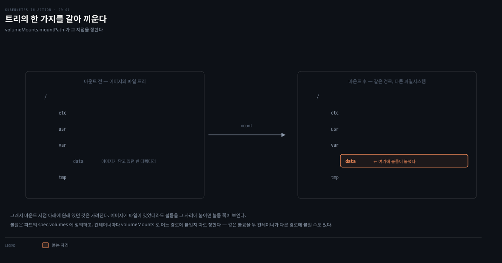
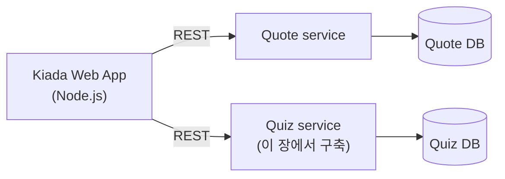
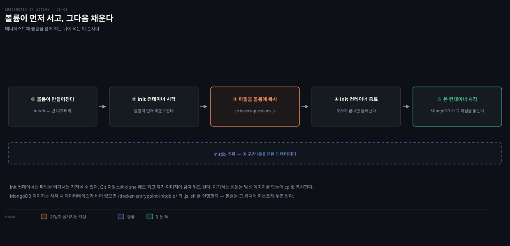

# 볼륨 이해와 emptyDir로 데이터 보존하기
---
> 컨테이너의 파일시스템은 재시작할 때마다 이미지 상태로 초기화됩니다. 파드에 볼륨을 붙여 컨테이너에 마운트하면, 그 데이터는 컨테이너 재시작을 넘어 파드가 사는 동안 보존되고, 같은 파드의 컨테이너끼리 파일을 나눌 수도 있습니다.


> 이 문서를 읽고 나면 emptyDir 볼륨이 컨테이너 재시작에서 데이터를 지키는 원리를 그림 없이 설명하고, init 컨테이너로 볼륨을 초기화하는 매니페스트를 직접 작성하며, MongoDB 재시작 시 데이터가 사라지는 문제를 진단할 수 있습니다.


## 진입 — 왜 볼륨이 필요한가

> 컨테이너 파일시스템은 재시작 때 이미지로 되돌아갑니다. 그래서 재시작을 넘어 살아남아야 하는 데이터는 컨테이너 *바깥* — 볼륨에 둬야 합니다.

이 개념은 [05-03편의 init 컨테이너·사이드카](./05-03.%EB%A9%80%ED%8B%B0%20%EC%BB%A8%ED%85%8C%EC%9D%B4%EB%84%88%C2%B7init%C2%B7%EB%84%A4%EC%9D%B4%ED%8B%B0%EB%B8%8C%20%EC%82%AC%EC%9D%B4%EB%93%9C%EC%B9%B4%EC%99%80%20%EC%82%AD%EC%A0%9C.md)에서 다룬 "파드 = 컨테이너의 논리적 묶음"을 파일시스템 축으로 이어받은 것입니다. 컨테이너들은 CPU·RAM·네트워크 인터페이스는 공유하지만, 일반 컴퓨터의 프로세스와 달리 *파일시스템은 각자 격리된 것*을 씁니다. 각 컨테이너의 파일시스템은 이미지가 제공합니다.

파드는 하나의 애플리케이션을 돌리는 작은 논리적 컴퓨터에 가깝습니다. 그 애플리케이션은 여러 컨테이너로 이뤄질 수 있고, 각 컨테이너는 자기 이미지에서 온 파일로 파일시스템을 시작합니다. 프로세스가 그 파일을 고치거나 새로 만들 수 있지만, [06장에서 본 파드 생애주기](./06-01.Pod%20%EC%83%81%ED%83%9C%20%E2%80%94%20phase%C2%B7conditions%C2%B7%EC%BB%A8%ED%85%8C%EC%9D%B4%EB%84%88%20%EC%83%81%ED%83%9C.md)대로, 컨테이너가 종료되고 재시작하면 그 변경은 전부 사라집니다.

왜 사라질까요? 컨테이너는 *진짜로 재시작되는 게 아니라 새 인스턴스로 교체*되기 때문입니다. 새 컨테이너의 파일시스템은 다시 이미지 상태에서 출발합니다. 그래서 컨테이너화된 애플리케이션은 재시작하면 멈췄던 지점에서 이어갈 수 없습니다. 어떤 애플리케이션은 이래도 괜찮지만, 파일시스템 전체 — 또는 일부라도 — 를 재시작 너머로 보존해야 하는 애플리케이션도 있습니다. 이때 파드에 볼륨을 붙여 컨테이너에 마운트합니다.

> **마운트란**: 어떤 저장 장치나 볼륨의 파일시스템을 운영체제 파일 트리의 특정 위치에 붙이는 행위입니다. 그 위치로 가면 볼륨의 내용이 보입니다.




## 1. 볼륨 없이 돌리면 무엇이 깨지는가 — Quiz 서비스

> Quiz 서비스는 API 프런트엔드 + MongoDB 백엔드로 이뤄집니다. 볼륨이 없으면 MongoDB 컨테이너가 재시작될 때 저장한 질문이 모두 사라집니다.

이 장에서는 Kiada 애플리케이션에 새 **Quiz 서비스**를 붙입니다. Kiada 웹 앱이 표시할 객관식 문제를 제공하고, 사용자의 응답도 저장하는 서비스입니다. 이 서비스는 지속 저장이 필요하고, 그래서 볼륨이 왜 없으면 안 되는지를 직접 보여 주는 예제가 됩니다.



Quiz 서비스는 Go로 쓴 RESTful API 프런트엔드(`quiz-api`)와 MongoDB 데이터베이스(`mongo`)로 구성됩니다. 처음에는 이 둘을 *같은 파드의 두 컨테이너*로 돌립니다. [05장에서 설명한 대로](./05-01.Pod%20%EC%9D%B4%ED%95%B4%20%E2%80%94%20%EC%BB%A8%ED%85%8C%EC%9D%B4%EB%84%88%20%EA%B7%B8%EB%A3%B9%ED%99%94%EC%99%80%20%EC%82%AC%EC%9D%B4%EB%93%9C%EC%B9%B4.md) 이렇게 묶는 건 좋은 방법이 아닙니다. 컨테이너를 따로 스케일할 수 없기 때문입니다. 그럼에도 한 파드에 두는 이유는, 파드끼리 통신하는 올바른 방법을 아직 배우지 않았기 때문입니다. 이는 11장에서 두 컨테이너를 별도 파드로 쪼갤 때 배웁니다.

다음은 볼륨이 없는 quiz 파드 매니페스트입니다.

```yaml
apiVersion: v1
kind: Pod
metadata:
  name: quiz
spec:
  containers:
  - name: quiz-api                 # Go로 쓴 API 서버
    image: luksa/quiz-api:0.1
    ports:
    - name: http
      containerPort: 8080
  - name: mongo                    # MongoDB 백엔드
    image: mongo
```

파드를 만들고 `kubectl port-forward`로 8080 포트에 터널을 뚫은 뒤 랜덤 질문을 요청하면, 처음엔 데이터베이스가 비어 있습니다.

```bash
$ curl localhost:8080/questions/random
ERROR: Question random not found       # DB가 비어 있음
```

Quiz API에는 질문을 넣는 기능이 없으니 Mongo 셸로 직접 넣습니다. `kubectl exec`로 `mongo` 컨테이너 안의 셸을 띄웁니다.

```bash
# -c mongo: quiz 파드의 mongo 컨테이너를 지정 (두 컨테이너 중 하나 고르기)
$ kubectl exec -it quiz -c mongo -- mongosh
> use kiada
> db.questions.insertOne({
    id: 1,
    text: "What does k8s mean?",
    answers: ["Kates", "Kubernetes", "Kooba Dooba Doo!"],
    correctAnswerIndex: 1})
```

질문을 넣은 뒤 API로 다시 요청하면 이제 정상으로 랜덤 질문이 돌아옵니다. 여기까지는 서비스가 제 몫을 합니다. 문제는 데이터 지속성입니다.

### MongoDB를 재시작하면 데이터가 증발합니다

MongoDB는 컨테이너 파일시스템에 파일을 씁니다. 이 컨테이너가 재시작되면 파일시스템은 이미지 상태로 리셋되고, 넣었던 질문이 전부 사라집니다. 데이터베이스에 종료 명령을 보내 확인해 봅니다.

```bash
# DB를 셧다운시키면 → 컨테이너 종료 → K8s가 새 컨테이너로 교체
$ kubectl exec -it quiz -c mongo -- mongosh admin --eval "db.shutdownServer()"

# 교체된 새 컨테이너에는 넣었던 질문이 없음
$ kubectl exec -it quiz -c mongo -- mongosh kiada --quiet \
    --eval "db.questions.countDocuments()"
0       # 질문이 하나도 없음
```

주의할 점은, quiz 파드는 *여전히 같은 파드*라는 것입니다. `quiz-api` 컨테이너는 이 시간 내내 멀쩡히 돌았고, `mongo` 컨테이너만 재시작 — 더 정확히는 *재생성* — 됐습니다. 이번엔 셧다운으로 유발했지만 어떤 이유로든 일어날 수 있습니다. 이런 데이터 손실은 받아들일 수 없습니다. 데이터가 컨테이너 재시작을 넘어 살아남으려면 컨테이너 *바깥* — 볼륨에 저장돼야 합니다.


## 2. 볼륨은 파드에 어떻게 들어맞는가

> 볼륨은 컨테이너처럼 파드의 구성 요소이고, 생애주기가 파드에 묶입니다. 그래서 개별 컨테이너의 생애주기와 무관하게 재시작을 넘어 데이터를 보존합니다.

볼륨은 파드나 노드 같은 최상위 리소스가 아니라 *파드 안의 구성 요소*이며, 파드의 생애주기를 공유합니다. 볼륨은 파드 수준에서 정의되고, 컨테이너의 원하는 위치에 마운트됩니다. 볼륨의 생애주기는 컨테이너가 아니라 파드 전체에 묶이므로, 볼륨은 컨테이너 재시작을 넘어 데이터를 보존하는 데 쓸 수 있습니다.

파드의 모든 볼륨은 파드가 세팅될 때 — 어느 컨테이너보다도 *먼저* — 만들어지고, 파드가 종료될 때 함께 허물어집니다. 컨테이너가 (재)시작될 때마다, 그 컨테이너가 쓰도록 설정된 볼륨이 컨테이너 파일시스템에 마운트됩니다. 볼륨과 마운트가 쓰기 가능으로 설정돼 있으면 컨테이너 안 애플리케이션이 볼륨을 읽고 쓸 수 있습니다.

### 어떤 파일을 보존할지는 애플리케이션 작성자가 정합니다

볼륨을 붙이는 대표적 이유는 컨테이너 재시작을 넘어 데이터를 보존하기 위해서입니다. 볼륨을 마운트하지 않으면 컨테이너 파일시스템 전체가 휘발성입니다. 컨테이너 재시작이 컨테이너 전체를 교체하므로 파일시스템도 이미지에서 재생성되고, 애플리케이션이 쓴 파일은 모두 사라집니다. 반대로 애플리케이션이 마운트된 볼륨에 데이터를 쓰면, 새 컨테이너의 프로세스가 재시작 후에도 같은 데이터에 접근합니다.


어떤 파일을 재시작 때 남길지는 애플리케이션 작성자가 정합니다. 보통은 애플리케이션 상태를 나타내는 데이터를 보존하고 싶어 합니다. 다만 로컬 캐시 데이터는 보존하지 *않는* 편이 나을 수 있습니다. 캐시가 손상돼 애플리케이션이 죽는 경우, 매번 새로 시작하면 스스로 치유될 여지가 생기기 때문입니다. 손상된 파일을 그대로 다시 읽으면 끝없는 크래시 루프에 빠질 수 있습니다.

> **팁**: 재시작을 넘어 파일을 보존하려고 볼륨을 마운트하기 전에, 그것이 컨테이너의 자가 치유 능력에 어떤 영향을 주는지 먼저 생각합니다.

### 하나의 컨테이너에 여러 볼륨을 마운트할 수 있습니다

파드는 볼륨을 여럿 가질 수 있고, 각 컨테이너는 이 볼륨을 0개·1개·여러 개를 서로 다른 위치에 마운트할 수 있습니다. 여러 볼륨을 한 컨테이너에 마운트하는 이유는, 볼륨마다 목적이 다르고 성능 특성이 다른 타입일 수 있기 때문입니다.

컨테이너가 둘 이상인 파드에서는 어떤 볼륨을 일부 컨테이너에만 마운트하고 다른 컨테이너엔 마운트하지 않을 수 있습니다. 볼륨에 민감한 정보가 담겨 일부 컨테이너만 접근해야 할 때 특히 유용합니다.

### 여러 컨테이너가 파일을 나눌 수 있습니다

볼륨은 둘 이상의 컨테이너에 마운트해, 그 컨테이너의 애플리케이션끼리 파일을 나누게 할 수 있습니다. 예를 들어 웹 서버 컨테이너와 콘텐츠 생성 에이전트 컨테이너를 한 파드에 두는 경우입니다. 에이전트가 정적 콘텐츠를 만들면 웹 서버가 그것을 클라이언트에 전달합니다. 각 컨테이너는 혼자서는 값이 작은 일을 하지만, 볼륨을 둘 다에 마운트하면 개별 컨테이너의 합보다 큰 완전한 시스템으로 기능합니다.


같은 볼륨이라도 컨테이너마다 다른 위치에 마운트할 수 있습니다. 에이전트가 `/var/data`에 쓰면 거기에 마운트하고, 웹 서버가 `/var/html`에서 콘텐츠를 읽으면 웹 서버 컨테이너는 그 위치에 마운트합니다. 마운트는 컨테이너마다 read/write 또는 read-only로 다르게 설정할 수 있습니다. 에이전트는 써야 하니 read/write, 웹 서버는 읽기만 하니 read-only로 둡니다. 보안상 웹 서버가 볼륨에 쓰지 못하게 막는 편이 좋습니다. 웹 서버에 임의 파일 쓰기 취약점이 있으면 공격자가 파일을 심어 실행할 수 있기 때문입니다.

### 파드 인스턴스와 파드 사이에서도 데이터를 나눌 수 있습니다

볼륨은 파드 생애주기에 묶여 파드가 사는 동안만 존재합니다. 다만 볼륨 *타입*에 따라, 파드와 볼륨이 사라진 뒤에도 파일은 온전히 남아 새 볼륨에 다시 마운트될 수 있습니다. 파드 볼륨이 파드 바깥의 지속 저장소 — 보통 네트워크 연결 스토리지(NAS) — 에 매핑되는 경우입니다. 이때 데이터는 지속적이라, 파드가 다른 워커 노드의 새 파드로 교체돼도 애플리케이션이 이전 데이터를 쓸 수 있습니다.

기술에 따라 같은 외부 볼륨을 여러 파드에 동시에 붙여 데이터를 공유할 수도 있습니다. NFS 같은 기술은 여러 머신에서 read/write로 마운트하는 것을 지원합니다. 클라우드의 GCE Persistent Disk 같은 기술은 단일 노드에서 read/write, 또는 여러 노드에서 read-only 중 하나만 허용합니다.

> 지속 저장소를 파드에 통합하는 이식성 있는 방법 — `persistentVolumeClaim` — 은 다음 장의 주제입니다. 이 장은 파드에 직접 정의할 수 있는 볼륨 타입에 집중합니다.

### 사용 가능한 볼륨 타입 목록

볼륨을 붙일 때는 타입을 지정합니다. 이 장에서 다루는, 파드에 직접 정의할 수 있는 타입은 다음과 같습니다.

| 타입 | 용도 |
|------|------|
| `emptyDir` | 파드 생애 동안 데이터를 두는 빈 디렉터리. 파드 시작 직전에 만들어져 처음엔 비어 있음 |
| `hostPath` | 워커 노드 파일시스템의 파일을 파드에 마운트 |
| `configMap`·`secret`·`downwardAPI`·`projected` | ConfigMap·Secret의 데이터나 파드 메타데이터를 노출하는 특수 볼륨 |
| `image` | 다른 컨테이너 이미지의 파일시스템을 볼륨으로 마운트 |
| `ephemeral` | CSI 드라이버가 제공하는, 파드 생애 동안만 존재하는 임시 볼륨 |
| `persistentVolumeClaim` | 외부 스토리지를 파드에 통합하는 이식성 있는 방법 (다음 장) |

`nfs`·`gcePersistentDisk`·`awsElasticBlockStore`·`azureFile`/`azureDisk` 같은 기술 종속 타입은 이제 폐기 예정입니다. 쿠버네티스 코드베이스 밖으로 옮겨져 CSI 드라이버로 접근하며, 파드에는 보통 `persistentVolumeClaim` 볼륨을 대신 씁니다.


## 3. emptyDir 볼륨으로 재시작을 넘어 보존하기

> emptyDir는 가장 단순한 볼륨 타입입니다. 빈 디렉터리로 시작해 파드 생애 동안 데이터를 보존하지만, 다른 파드와는 공유되지 않습니다.

emptyDir 볼륨은 이름 그대로 빈 디렉터리로 시작합니다. 이 타입을 컨테이너에 마운트하면, 볼륨에 쓴 파일이 파드가 존재하는 동안 보존됩니다. 단일 컨테이너 파드에서 재시작을 넘어 데이터를 지킬 때, 컨테이너 파일시스템이 read-only인데 임시로 쓸 공간이 필요할 때, 그리고 둘 이상의 컨테이너 사이에서 데이터를 나눌 때 씁니다.

앞의 quiz 파드에 emptyDir 볼륨을 붙여, MongoDB 컨테이너가 재시작돼도 데이터가 사라지지 않게 고쳐 봅니다. 두 가지 변경이 필요합니다 — 파드에 emptyDir 볼륨을 추가하고, 그 볼륨을 컨테이너에 마운트합니다.

```yaml
apiVersion: v1
kind: Pod
metadata:
  name: quiz
spec:
  volumes:                     # (1) 볼륨을 파드 수준에 정의
  - name: quiz-data
    emptyDir: {}               # {} 는 medium·sizeLimit 미지정을 명시(생략 가능)
  containers:
  - name: quiz-api
    image: luksa/quiz-api:0.1
    ports:
    - name: http
      containerPort: 8080
  - name: mongo
    image: mongo
    volumeMounts:              # (2) 그 볼륨을 컨테이너에 마운트
    - name: quiz-data          # spec.volumes 의 이름과 일치해야 함
      mountPath: /data/db      # MongoDB가 파일을 쓰는 위치
```

`quiz-data`라는 emptyDir 볼륨을 `spec.volumes`에 정의하고, `mongo` 컨테이너의 `/data/db`에 마운트합니다. 이 위치는 MongoDB가 파일을 쓰는 곳이라, 데이터가 컨테이너 파일시스템 대신 볼륨에 기록됩니다.

### 볼륨과 마운트 설정 필드

볼륨 정의에는 이름과 타입이 필요합니다. 타입은 중첩 필드 이름(여기선 `emptyDir`)으로 나타납니다. emptyDir는 두 필드로 설정합니다.

| 필드 | 설명 |
|------|------|
| `medium` | 저장 매체. 비우면 노드 디스크에 디렉터리를 만듦. `Memory`로 두면 tmpfs(메모리 파일시스템)를 써서 파일을 디스크가 아닌 메모리에 둠 |
| `sizeLimit` | 디렉터리에 필요한 로컬 저장 용량. 예: 최대 10 메비바이트는 `10Mi` |

마운트 정의는 이름과 `mountPath`(컨테이너 안 마운트 경로)가 핵심이고, 나머지 필드는 고급 용도입니다.

| 필드 | 설명 |
|------|------|
| `name` | 마운트할 볼륨 이름. 파드에 정의된 볼륨과 일치 |
| `mountPath` | 볼륨을 마운트할 컨테이너 안 경로 |
| `readOnly` | read-only 마운트 여부(기본 false). true여도 하위 경로까지 보장하려면 `recursiveReadOnly` 병행 |
| `recursiveReadOnly` | 마운트 경로 아래 모든 하위 경로까지 진짜 read-only로 |
| `mountPropagation` | 볼륨 안에 추가 마운트가 생길 때의 전파 방향(None·HostToContainer·Bidirectional) |
| `subPath` | 볼륨 전체가 아니라 볼륨 안 특정 하위 경로만 마운트 |
| `subPathExpr` | `subPath`와 같되 `$(ENV_VAR)` 참조 가능. 컨테이너에 명시 정의된 변수만 해석 |

대부분은 `name`·`mountPath`·`readOnly`만 지정합니다. `subPath`·`subPathExpr`는 하나의 볼륨 안 여러 디렉터리를 서로 다른 컨테이너에 마운트할 때 유용합니다. 특히 `subPathExpr`는 볼륨이 여러 파드 레플리카에 공유될 때, [08장 Downward API](./08-03.Secret%EA%B3%BC%20Downward%20API.md)로 파드 이름을 환경변수에 주입한 뒤 이를 참조해 레플리카마다 자기 하위 디렉터리를 쓰게 할 수 있습니다.

### emptyDir 볼륨의 파일은 어디에 저장되는가

emptyDir로 고친 파드에 질문을 넣고 MongoDB 컨테이너를 재시작하면, 이번엔 질문이 그대로 보존됩니다.

```bash
$ kubectl exec -it quiz -c mongo -- mongosh admin --eval "db.shutdownServer()"

# RESTARTS 가 1로 오르며 mongo 컨테이너가 재시작됐지만
$ kubectl get po quiz
NAME   READY   STATUS    RESTARTS   AGE
quiz   2/2     Running   1          10m

# 데이터는 살아남음 — 볼륨에 저장됐기 때문
$ kubectl exec -it quiz -c mongo -- mongosh kiada --quiet \
    --eval "db.questions.countDocuments()"
1
```

파일이 이제 컨테이너 파일시스템이 아니라 볼륨에 있어서 사라지지 않습니다. 그렇다면 볼륨은 어디에 있을까요? emptyDir 볼륨의 파일은 *호스트 노드 파일시스템의 한 디렉터리*에 저장됩니다. 평범한 파일 디렉터리이고, 이것이 컨테이너의 원하는 위치에 마운트됩니다. 보통 다음 위치입니다.

```
/var/lib/kubelet/pods/<pod_UID>/volumes/kubernetes.io~empty-dir/<volume_name>
```

`pod_UID`는 파드 오브젝트의 `metadata` 안에 있는 고유 ID이고(`kubectl get po quiz -o json | jq -r .metadata.uid`), `volume_name`은 매니페스트의 볼륨 이름(`quiz-data`)입니다. 노드에 로그인해 이 디렉터리를 보면 `mongo` 컨테이너의 `/data/db`와 파일이 일치합니다.

다만 데이터가 컨테이너 재시작은 넘어도 *파드 삭제는 넘지 못합니다*. 파드를 지우면 이 디렉터리도 지워집니다. 데이터를 제대로 지속하려면 다음 장의 퍼시스턴트 볼륨이 필요합니다.

### 메모리에 만들기·크기 제한

emptyDir는 기본적으로 노드 디스크에 디렉터리를 만들어, 성능이 노드 드라이브 종류에 좌우됩니다. I/O를 최대한 빠르게 하려면 `medium: Memory`로 tmpfs를 써서 파일을 메모리에 둡니다.

```yaml
volumes:
  - name: content
    emptyDir:
      medium: Memory     # 디스크가 아닌 메모리(tmpfs)에 저장
```

메모리에 만드는 것은 민감 데이터를 다룰 때도 좋습니다. 디스크에 쓰이지 않아, 데이터가 원하지 않게 오래 남거나 노출될 확률이 줄기 때문입니다. 쿠버네티스가 Secret 데이터를 컨테이너에 노출할 때 쓰는 것과 같은 접근입니다. 볼륨 크기는 `sizeLimit`으로 제한합니다. 특히 인메모리 볼륨은 파드 전체 메모리가 리소스 제한으로 묶여 있을 때 이 필드가 중요합니다.


## 4. init 컨테이너로 emptyDir 볼륨 초기화하기

> emptyDir는 빈 채로 시작하므로, 매번 데이터를 손으로 넣어야 합니다. init 컨테이너로 파일을 볼륨에 미리 복사해 두면, 파드가 뜰 때 데이터베이스가 자동으로 채워집니다.

quiz 파드는 emptyDir로 만들 때마다 데이터베이스가 비어 있어, 질문을 손으로 넣어야 합니다. MongoDB 이미지는 시작 시 데이터베이스가 비어 있으면 `/docker-entrypoint-initdb.d/` 디렉터리의 `.js`·`.sh` 파일을 실행하는 메커니즘을 제공합니다. 질문이 담긴 파일을 MongoDB 시작 전에 이 위치에 넣기만 하면 됩니다.

파일을 볼륨에 넣는 한 방법이 [init 컨테이너](./05-03.%EB%A9%80%ED%8B%B0%20%EC%BB%A8%ED%85%8C%EC%9D%B4%EB%84%88%C2%B7init%C2%B7%EB%84%A4%EC%9D%B4%ED%8B%B0%EB%B8%8C%20%EC%82%AC%EC%9D%B4%EB%93%9C%EC%B9%B4%EC%99%80%20%EC%82%AD%EC%A0%9C.md)입니다. init 컨테이너는 파일을 어디서든 가져올 수 있습니다 — Git 저장소를 clone할 수도, 자기 이미지에 파일을 담아 둘 수도 있습니다. 여기서는 질문을 JSON 파일로 담은 이미지를 만들고, 그 파일을 공유 볼륨에 복사해 MongoDB가 시작 시 읽게 합니다.



파드가 시작되면 볼륨이 먼저 만들어지고, 그다음 init 컨테이너가 시작됩니다. 이는 매니페스트에서 볼륨을 init 컨테이너보다 앞에 정의하든 뒤에 정의하든 마찬가지입니다. init 컨테이너 시작 전 `initdb` 볼륨이 마운트되고, 컨테이너 이미지 안의 `insert-questions.js` 파일이 볼륨으로 복사됩니다. 복사가 끝나면 init 컨테이너가 종료되고 본 컨테이너들이 시작됩니다. `initdb` 볼륨은 MongoDB가 초기화 스크립트를 찾는 위치에 마운트돼, 첫 시작 시 스크립트가 실행되어 질문이 삽입됩니다.

init 컨테이너 이미지의 Dockerfile은 단순합니다. `cp` 명령으로 파일을 공유 볼륨 마운트 위치에 복사합니다.

```dockerfile
FROM busybox
COPY insert-questions.js /
# 컨테이너 실행 시 파일을 /initdb.d 로 복사 — 이 경로에 공유 볼륨이 마운트됨
CMD cp /insert-questions.js /initdb.d/ \
    && echo "Successfully copied insert-questions.js to /initdb.d" \
    || echo "Error copying insert-questions.js to /initdb.d"
```

파드 매니페스트에는 `initdb` emptyDir 볼륨과 init 컨테이너를 추가합니다.

```yaml
apiVersion: v1
kind: Pod
metadata:
  name: quiz
spec:
  volumes:
  - name: initdb              # init 컨테이너가 채울 볼륨
    emptyDir: {}
  - name: quiz-data           # DB 파일용 볼륨(재시작 보존)
    emptyDir: {}
  initContainers:
  - name: installer
    image: luksa/quiz-initdb-script-installer:0.1
    volumeMounts:
    - name: initdb
      mountPath: /initdb.d    # init 컨테이너가 파일을 복사하는 위치
  containers:
  - name: quiz-api
    image: luksa/quiz-api:0.1
    ports:
    - name: http
      containerPort: 8080
  - name: mongo
    image: mongo
    volumeMounts:
    - name: quiz-data
      mountPath: /data/db
    - name: initdb                              # 같은 볼륨을 mongo 에도
      mountPath: /docker-entrypoint-initdb.d/   # MongoDB가 초기화 스크립트를 찾는 위치
      readOnly: true
```

`installer` init 컨테이너가 `insert-questions.js`를 볼륨에 복사한 뒤 종료하면, `mongo`가 그 파일을 `/docker-entrypoint-initdb.d/`에서 발견해 실행하고 질문으로 데이터베이스를 채웁니다.

### 매니페스트에 파일 내용을 인라인으로 초기화하기

짧은 파일이라면, init 컨테이너에서 `cat` 히어독으로 파일 내용을 매니페스트에 직접 써 넣는 요령도 있습니다.

```yaml
spec:
  initContainers:
  - name: my-volume-initializer
    image: busybox
    command:
    - sh
    - -c
    - |
      cat <<EOF > /mnt/my-volume/my-file.txt
      line 1: This is a multi-line file
      line 2: Written from an init container
      line 3: Defined inline in the Pod manifest
      EOF
    volumeMounts:
    - name: my-volume
      mountPath: /mnt/my-volume
```

다른 리소스 없이 애플리케이션에 짧은 설정 파일 한둘을 제공할 때 빠르고 간편한 방법입니다.


## 5. 컨테이너 사이에서 파일 공유하기

> emptyDir 볼륨은 여러 본 컨테이너가 동시에 쓸 수 있습니다. 한 컨테이너가 파일을 쓰고 다른 컨테이너가 그것을 읽어, 개별 컨테이너보다 큰 시스템을 만듭니다.

[08장의 quote 파드](./08-03.Secret%EA%B3%BC%20Downward%20API.md)를 떠올려 봅니다. post-start hook으로 `fortune` 명령을 돌려 인용문 파일을 만들고 Nginx가 그것을 서빙하던 파드입니다. 문제는 매번 같은 인용문만 나온다는 것입니다. 이번엔 1분마다 새 인용문을 서빙하는 버전을 만듭니다.

Nginx는 웹 서버로 유지하되, post-start hook 대신 주기적으로 `fortune`을 돌려 파일을 갱신하는 `quote-writer` 컨테이너를 둡니다. `nginx` 컨테이너가 `quote-writer`가 만든 파일을 볼 수 있게, 파드에 볼륨을 정의해 두 컨테이너에 마운트합니다.

```yaml
apiVersion: v1
kind: Pod
metadata:
  name: quote
spec:
  volumes:
  - name: shared
    emptyDir: {}
  containers:
  - name: quote-writer
    image: luksa/quote-writer:0.1
    volumeMounts:
    - name: shared
      mountPath: /var/local/output     # writer 가 인용문을 쓰는 위치
  - name: nginx
    image: nginx:alpine
    volumeMounts:
    - name: shared
      mountPath: /usr/share/nginx/html # nginx 가 서빙하는 위치
      readOnly: true                   # 서버는 읽기만 — 보안상 쓰기 차단
    ports:
    - name: http
      containerPort: 80
```

두 컨테이너에 같은 볼륨을 *다른 위치*에 마운트합니다. `quote-writer`는 자기 `/var/local/output`에 쓰고, `nginx`는 `/usr/share/nginx/html`에서 서빙하기 때문입니다.

> **주의**: 두 컨테이너가 동시에 시작하므로, nginx가 이미 도는데 인용문이 아직 생성되지 않은 짧은 구간이 생길 수 있습니다. 이를 막으려면 §4처럼 init 컨테이너로 초기 인용문을 미리 만들어 둡니다.

파드를 만든 뒤 `kubectl port-forward`로 터널을 뚫고 1분 간격으로 인용문을 가져오면 값이 바뀝니다. 두 컨테이너 어느 쪽에서 파일을 출력해도 같은 내용이 나옵니다. 두 경로가 공유 볼륨의 같은 파일을 가리키기 때문입니다.

```bash
# 두 명령의 출력이 동일 — 같은 볼륨의 같은 파일을 가리킴
$ kubectl exec quote -c quote-writer -- cat /var/local/output/quote
$ kubectl exec quote -c nginx -- cat /usr/share/nginx/html/quote
```


## 면접에서 받을 만한 질문

1. 컨테이너를 재시작하면 파일시스템이 초기화되는 이유는 무엇이고, 이것이 볼륨과 어떻게 관계됩니까?
2. 볼륨의 생애주기는 무엇에 묶입니까? emptyDir 볼륨은 컨테이너 재시작과 파드 삭제 각각에서 데이터가 어떻게 됩니까?
3. `emptyDir: {}`의 중괄호는 무엇을 뜻합니까? `medium: Memory`는 언제 씁니까?
4. 같은 볼륨을 두 컨테이너에 마운트할 때, 마운트 위치와 read-only 설정을 다르게 두는 이유는 무엇입니까?
5. init 컨테이너로 emptyDir를 초기화할 때, 볼륨과 init 컨테이너 중 무엇이 먼저 만들어집니까? 매니페스트 정의 순서가 이에 영향을 줍니까?

> 5개 질문에 *먼저 스스로 답해 보세요.* 자답이 끝나면 아래 §정답으로 내려갑니다. 자답 없이 먼저 읽으면 학습 효과가 0입니다.


## 정답 (자답 후 펼치기)

> 위 §면접에서 받을 만한 질문의 5개에 *먼저 자답한 뒤* 아래를 읽으세요.

### 정답 1 — 재시작 시 파일시스템 초기화와 볼륨

컨테이너는 재시작될 때 *진짜로 재시작되는 게 아니라 새 인스턴스로 교체*됩니다. 새 컨테이너의 파일시스템은 이미지에서 다시 만들어지므로, 이전 컨테이너가 쓴 파일은 모두 사라집니다. 그래서 재시작을 넘어 살아남아야 하는 데이터는 컨테이너 파일시스템이 아니라 *볼륨* — 생애주기가 컨테이너가 아닌 파드에 묶인 저장 공간 — 에 둬야 합니다. 볼륨은 컨테이너가 (재)시작될 때마다 다시 마운트되므로 새 컨테이너가 이전 데이터에 이어서 접근합니다.

### 정답 2 — 볼륨 생애주기와 emptyDir의 두 경계

볼륨의 생애주기는 개별 컨테이너가 아니라 *파드 전체*에 묶입니다. 파드가 세팅될 때 모든 컨테이너보다 먼저 만들어지고 파드 종료 시 함께 허물어집니다. emptyDir는 이 규칙을 따라, 컨테이너 재시작은 넘어 데이터를 보존하지만(볼륨은 그대로 있고 새 컨테이너에 다시 마운트되므로) *파드 삭제는 넘지 못합니다*. 파드를 지우면 노드의 emptyDir 디렉터리도 지워집니다. 파드 삭제를 넘어 지속하려면 다음 장의 퍼시스턴트 볼륨이 필요합니다.

### 정답 3 — 중괄호와 Memory 매체

`emptyDir: {}`의 `{}`는 `medium`·`sizeLimit` 두 설정을 *아무것도 지정하지 않음*을 명시적으로 나타냅니다. 생략해도 동작은 같습니다. `medium: Memory`는 볼륨을 tmpfs(메모리 파일시스템)로 만들어 파일을 디스크가 아닌 메모리에 둡니다. I/O를 최대한 빠르게 하고 싶을 때, 그리고 민감 데이터를 디스크에 남기고 싶지 않을 때 씁니다. 대신 파드 메모리를 소비하므로 리소스 제한이 걸린 환경에서는 `sizeLimit`을 함께 둡니다.

### 정답 4 — 다른 위치·다른 권한으로 마운트하는 이유

같은 볼륨이라도 컨테이너마다 데이터를 다루는 경로가 다르기 때문입니다. 콘텐츠를 만드는 컨테이너는 자기 출력 경로(`/var/data`)에, 서빙하는 웹 서버는 자기 문서 루트(`/var/html`)에 마운트합니다. read-only 차이는 보안 때문입니다. 서버는 읽기만 하면 되므로 read-only로 두면, 서버에 임의 파일 쓰기 취약점이 있어도 공격자가 볼륨에 파일을 심어 실행하는 경로를 막습니다.

### 정답 5 — 볼륨과 init 컨테이너의 생성 순서

*볼륨이 먼저* 만들어지고, 그다음 init 컨테이너가 시작됩니다. 그래야 init 컨테이너가 마운트된 볼륨에 파일을 복사할 수 있습니다. 이 순서는 매니페스트에서 볼륨을 init 컨테이너 앞에 쓰든 뒤에 쓰든 *바뀌지 않습니다*. 파드의 모든 볼륨은 어느 컨테이너보다도 먼저 세팅된다는 규칙이 정의 순서와 무관하게 적용되기 때문입니다.


## 관련 문서

> 이 편은 05·06장에서 쌓은 파드·컨테이너 개념을 파일시스템 축으로 이어받고, image·hostPath 볼륨(09-02)과 특수 볼륨(09-03)으로 이어집니다.

- [05-03. 멀티 컨테이너·init·네이티브 사이드카와 삭제](./05-03.%EB%A9%80%ED%8B%B0%20%EC%BB%A8%ED%85%8C%EC%9D%B4%EB%84%88%C2%B7init%C2%B7%EB%84%A4%EC%9D%B4%ED%8B%B0%EB%B8%8C%20%EC%82%AC%EC%9D%B4%EB%93%9C%EC%B9%B4%EC%99%80%20%EC%82%AD%EC%A0%9C.md) § "init 컨테이너" — 이 편의 볼륨 초기화가 init 컨테이너 위에 서 있음
- [06-01. Pod 상태 — phase·conditions·컨테이너 상태](./06-01.Pod%20%EC%83%81%ED%83%9C%20%E2%80%94%20phase%C2%B7conditions%C2%B7%EC%BB%A8%ED%85%8C%EC%9D%B4%EB%84%88%20%EC%83%81%ED%83%9C.md) — 컨테이너 재시작=재생성이라 파일시스템이 초기화되는 근거
- [09-02. image·hostPath 볼륨](./09-02.image%C2%B7hostPath%20%EB%B3%BC%EB%A5%A8.md) — init 컨테이너 없이 이미지를 볼륨으로 마운트하는 더 간단한 방법
- [08_cloud/kubernetes — 핵심 워크로드](../../kubernetes/01_workloads/01-01.%ED%95%B5%EC%8B%AC%20%EC%9B%8C%ED%81%AC%EB%A1%9C%EB%93%9C.md) — 파드·컨테이너 개념의 책-비종속 통합본
- [Kubernetes 공식 문서 — Volumes](https://kubernetes.io/docs/concepts/storage/volumes/) — 전체 볼륨 타입의 1차 레퍼런스
