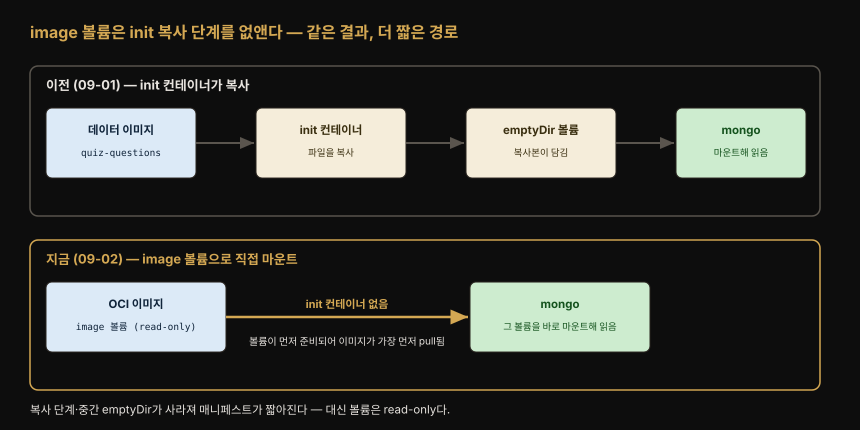
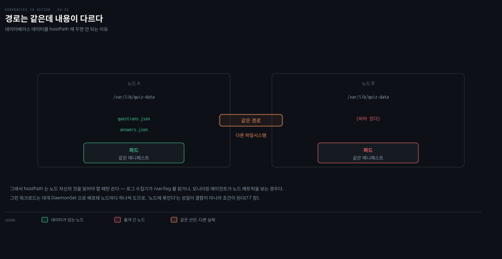
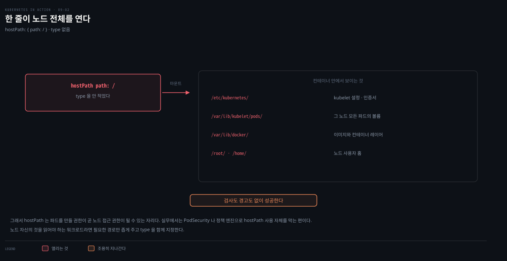
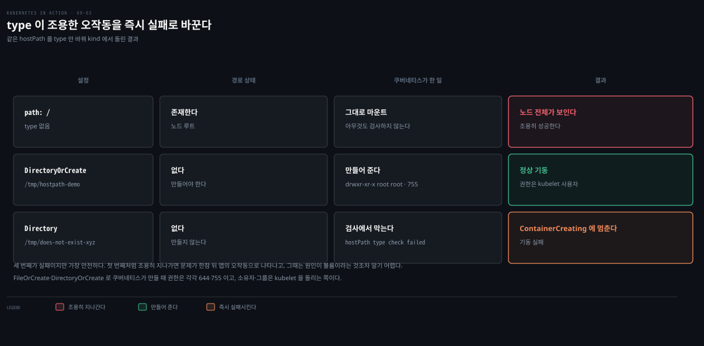
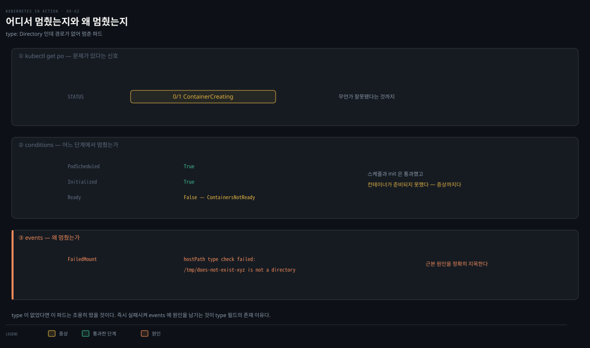

# image·hostPath 볼륨
---
> image 볼륨은 다른 OCI 이미지의 파일을 볼륨으로 마운트해, init 컨테이너로 파일을 복사하던 수고를 없앱니다. hostPath 볼륨은 워커 노드의 파일시스템을 파드에 뚫어 주는데, 노드 전체를 장악할 수 있어 가장 위험한 볼륨 타입입니다.


> 이 문서를 읽고 나면 image 볼륨과 init 컨테이너 초기화 방식의 차이를 설명하고, hostPath 볼륨이 왜 특권 파드로 제한되는지 그 위험을 근거와 함께 말하며, hostPath의 type 필드 8종이 각각 무엇을 검사하는지 구별할 수 있습니다.


## 진입 — 볼륨에 미리 준비된 데이터를 넣는 두 방법

> 컨테이너가 미리 준비된 데이터에 접근해야 할 때, [09-01편의 init 컨테이너 복사](./09-01.%EB%B3%BC%EB%A5%A8%20%EC%9D%B4%ED%95%B4%EC%99%80%20emptyDir%EB%A1%9C%20%EB%8D%B0%EC%9D%B4%ED%84%B0%20%EB%B3%B4%EC%A1%B4%ED%95%98%EA%B8%B0.md)는 손이 많이 갑니다. image 볼륨은 그 데이터를 이미지째 볼륨으로 마운트해 이 수고를 없앱니다.

컨테이너는 미리 준비된 데이터에 접근해야 할 때가 많습니다. [09-01편](./09-01.%EB%B3%BC%EB%A5%A8%20%EC%9D%B4%ED%95%B4%EC%99%80%20emptyDir%EB%A1%9C%20%EB%8D%B0%EC%9D%B4%ED%84%B0%20%EB%B3%B4%EC%A1%B4%ED%95%98%EA%B8%B0.md)의 quiz 파드에서 데이터베이스를 질문으로 채운 것이 그 예입니다. AI 모델 서빙 컨테이너가 큰 언어 모델의 가중치 파일에 접근해야 하는 경우도 흔합니다. 이런 파일을 서빙 이미지에 직접 넣을 수도 있지만, 모델 가중치와 서빙 바이너리는 따로 패키징하는 편이 일반적입니다.

09-01편에서는 질문을 담은 이미지를 만들고, 컨테이너 시작 시 그 파일을 새 위치로 복사한 뒤, 다른 컨테이너가 볼 수 있게 그 위치에 볼륨을 마운트했습니다. 단순한 일치고는 손이 많이 갑니다. 이제 더 간단한 방법이 있습니다 — image 볼륨입니다.

이 기능은 v1.31에서 alpha로 들어와 v1.33에서 beta, **v1.36에서 stable(GA)** 이 됐습니다.[^image-volume] beta가 된 v1.33까지는 `ImageVolume` 피처 게이트를 켜야 했지만, v1.35 클러스터에서는 이미 기본으로 켜져 있습니다. 실습에 쓰는 `kind-k8s-lab`(v1.35)에서 확인하면 게이트가 활성 상태로 보고됩니다.

```bash
kubectl get --raw /metrics | grep ImageVolume
# kubernetes_feature_enabled{name="ImageVolume",stage="BETA"} 1
```

> **피처 게이트란**: 쿠버네티스에서 기능이 일반 사용 가능(GA)이 되기 전에는 보통 피처 게이트 뒤에 숨어 있습니다. 클러스터 관리자가 명시적으로 켜야 하고, 켜지 않으면 API에 필드가 보여 설정할 수는 있어도 동작하지 않습니다. 다만 게이트가 있다고 항상 꺼져 있는 것은 아닙니다 — beta 단계에 들어서면 기본값이 켜짐으로 바뀌는 기능이 많고, image 볼륨이 그런 경우입니다. **"게이트가 있다"와 "꺼져 있다"를 같은 말로 읽지 않도록** 위 명령으로 실제 상태를 확인하는 편이 확실합니다.


## 1. image 볼륨 타입

> image 볼륨은 OCI 이미지의 파일을 볼륨으로 노출해 같은 파드의 다른 컨테이너에 마운트합니다. 다른 컨테이너는 이 볼륨을 읽을 수만 있고 쓸 수는 없습니다.

image 볼륨 타입은 OCI(Open Container Initiative) 이미지의 파일을 볼륨으로 노출해, 같은 파드의 다른 컨테이너에 마운트하게 합니다. 예상대로 다른 컨테이너는 이 볼륨을 읽을 수만 있고 쓸 수는 없습니다.

> **container image vs OCI image**: 이 책에서 자주 쓰는 "컨테이너 이미지"는 애플리케이션과 소프트웨어 의존성을 담은 이미지에 한정된 말입니다. "OCI 이미지"는 더 넓어서, 애플리케이션이 아닌 다른 종류의 파일도 묶을 수 있습니다. image 볼륨은 OCI 호환 이미지라면 무엇이든 볼륨으로 쓸 수 있습니다.

09-01편의 quiz 파드를, init 컨테이너가 초기화하는 emptyDir 대신 image 볼륨으로 질문을 제공하도록 고쳐 봅니다.

```yaml
apiVersion: v1
kind: Pod
metadata:
  name: quiz
spec:
  volumes:
  - name: initdb
    image:                              # image 볼륨 — init 컨테이너가 사라짐
      reference: luksa/quiz-questions:latest   # 볼륨을 채울 OCI 아티팩트
      pullPolicy: Always                # 컨테이너 이미지처럼 pull 정책 지정 가능
  - name: quiz-data
    emptyDir: {}
  containers:
  - name: quiz-api
    image: luksa/quiz-api:0.1
    imagePullPolicy: IfNotPresent
    ports:
    - name: http
      containerPort: 8080
  - name: mongo
    image: mongo:7
    volumeMounts:
    - name: quiz-data
      mountPath: /data/db
    - name: initdb                              # image 볼륨을 mongo 에 마운트
      mountPath: /docker-entrypoint-initdb.d/   # 이전 예제와 동일한 위치
      readOnly: true
```

emptyDir + init 컨테이너 버전과 크게 다르지 않습니다. init 컨테이너가 사라지고, emptyDir가 image 볼륨으로 바뀌었을 뿐입니다. 볼륨은 `mongo` 컨테이너에 이전과 똑같이 마운트됩니다.



09-01편은 데이터 이미지를 init 컨테이너가 emptyDir로 복사한 뒤 그 볼륨을 마운트하는 네 단계를 거쳤습니다. image 볼륨은 OCI 이미지 자체를 볼륨으로 삼아 곧장 마운트합니다. 그래서 중간의 init 컨테이너와 emptyDir가 통째로 사라집니다. 대신 이 볼륨은 read-only라 컨테이너가 그 안 파일을 고칠 수는 없습니다.

> 마운트 대상은 컨테이너 이미지에 국한되지 않습니다. 공식 문서는 `image` 볼륨 소스를 "an OCI object (a container image or artifact)"로 정의합니다 — **컨테이너 이미지와 OCI 아티팩트 둘 다** 마운트할 수 있다는 뜻입니다. 파일 묶음만 배포하면 되는 경우라면 Dockerfile로 이미지를 빌드할 것 없이 아티팩트를 레지스트리에 push하는 것으로 끝납니다.

파드를 만들고 `kubectl describe pod quiz`로 이벤트를 보면, `quiz-questions` 이미지가 *가장 먼저* pull됩니다. [09-01편](./09-01.%EB%B3%BC%EB%A5%A8%20%EC%9D%B4%ED%95%B4%EC%99%80%20emptyDir%EB%A1%9C%20%EB%8D%B0%EC%9D%B4%ED%84%B0%20%EB%B3%B4%EC%A1%B4%ED%95%98%EA%B8%B0.md)에서 배운 대로, 파드 볼륨은 어느 컨테이너보다 먼저 만들어지기 때문입니다.

```bash
kubectl exec -it quiz -c mongo -- ls -la /docker-entrypoint-initdb.d/
-rw-rw-r--. 1 root root 2361 Mar 14  2022 insert-questions.js   # 이미지에서 온 파일
```

MongoDB가 시작 시 이 파일을 실행하므로, 파일 안 질문이 데이터베이스에 들어가고 이전처럼 API로 가져올 수 있습니다.


## 2. hostPath 볼륨 — 노드 파일시스템 접근

> **hostPath 볼륨은 호스트 노드의 특정 파일·디렉터리를 파드에 마운트합니다.** 노드에 종속되므로 파드가 다른 노드로 재스케줄되면 같은 데이터를 못 봅니다. 가장 위험한 볼륨 타입입니다.

대부분의 파드는 자기가 어느 노드에서 도는지 신경 쓰지 않고, 노드 파일시스템의 파일에 접근하지도 않아야 합니다. 예외는 시스템 수준 파드입니다. 노드의 파일을 읽거나, 노드 파일시스템을 통해 노드의 장치·컴포넌트에 접근해야 할 수 있습니다. 쿠버네티스는 이를 hostPath 볼륨으로 가능하게 합니다.

hostPath 볼륨은 호스트 노드 파일시스템의 특정 파일이나 디렉터리를 가리킵니다. 같은 노드에서 같은 경로의 hostPath 볼륨을 쓰는 파드들은 같은 파일에 접근하지만, 다른 노드의 파드는 그러지 못합니다.



hostPath 볼륨은 데이터베이스 데이터를 두기에 좋은 곳이 *아닙니다*. 데이터베이스 파드가 항상 같은 노드에서 돈다는 보장이 없다면 다른 노드로 재스케줄됐을 때 데이터에 접근할 수 없기 때문입니다. hostPath는 보통 노드에서 도는 프로세스가 읽거나 만드는 파일을 파드가 읽고 써야 할 때 씁니다. 시스템 수준 로그가 그런 예입니다.

### hostPath는 왜 위험한가

hostPath는 쿠버네티스에서 가장 위험한 볼륨 타입 중 하나이고, 보통 특권 파드에만 허용됩니다. hostPath를 무제한으로 허용하면 클러스터 사용자가 노드에서 무엇이든 할 수 있게 됩니다. 예를 들어 Docker 소켓 파일(보통 `/var/run/docker.sock`)을 컨테이너에 마운트한 뒤, 컨테이너 안에서 Docker 클라이언트를 돌려 호스트 노드에서 root로 아무 명령이나 실행할 수 있습니다.

이를 시연하는 파드는 노드 파일시스템 전체를 파드 안에서 탐색하게 해 줍니다.

```yaml
apiVersion: v1
kind: Pod
metadata:
  name: node-explorer
spec:
  volumes:
  - name: host-root
    hostPath:
      path: /              # 노드 파일시스템의 루트 디렉터리를 가리킴
  containers:
  - name: node-explorer
    image: alpine
    command: ["sleep", "9999999999"]
    volumeMounts:
    - name: host-root
      mountPath: /host     # 컨테이너 /host 에 노드 루트가 통째로 보임
```

파드를 만들고 셸을 띄운 뒤 `/host`로 가면 노드의 파일을 탐색할 수 있습니다. 컨테이너와 셸이 root로 도니 워커 노드의 어떤 파일도 고칠 수 있습니다.

```bash
kubectl exec -it node-explorer -- sh
/ # cd /host          # 여기서부터 노드 파일시스템 전체가 보임
```

실제로 kind(k8s-lab)에서 이 파드를 띄워 `kubectl exec node-explorer -- ls /host`를 돌려 보면, 컨테이너 것이 아니라 워커 노드의 루트가 그대로 나옵니다.`bin`·`etc`·`var` 사이에 `kind` 디렉터리가 섞여 있어, 여기가 kind 노드의 파일시스템임이 드러납니다. 더 위험한 것은 `/host/var/lib/kubelet/pods`를 열면 이 파드 것이 아닌 **다른 파드들의 볼륨 디렉터리**(파드 UID 이름)까지 보인다는 점입니다. 노드 루트 하나를 마운트했을 뿐인데 노드의 모든 파일과 남의 파드 데이터에 손이 닿습니다.



만약 공격자가 쿠버네티스 API에 접근해 프로덕션 클러스터에 이런 파드를 배포할 수 있다면 노드 전체가 장악됩니다. 쿠버네티스는 **기본 설정에서 일반 사용자가 hostPath 볼륨을 쓰는 것을 막지 않습니다.** 그 자체로는 전혀 안전하지 않다는 뜻입니다.

막는 장치는 따로 켜야 합니다. Pod Security Standards의 **Baseline** 프로파일이 `hostPath` 볼륨을 금지하므로, 네임스페이스에 `pod-security.kubernetes.io/enforce: baseline` 라벨을 붙이면 그 네임스페이스에서 hostPath 파드가 거부됩니다.[^pss] 클러스터를 남과 공유한다면 "위험하다"로 끝내지 말고 이 라벨이 붙어 있는지 확인하는 편이 낫습니다.

```bash
kubectl get ns <namespace> -o jsonpath='{.metadata.labels}' | tr ',' '\n' | grep pod-security
```

### hostPath의 type 필드

hostPath에는 `path`만이 아니라 `type`도 지정해, 그 경로가 컨테이너 프로세스가 기대하는 것(파일·디렉터리 등)인지 검사할 수 있습니다.

| type | 설명 |
|------|------|
| `<empty>` | 마운트 전 아무 검사도 하지 않음 |
| `Directory` | 경로에 디렉터리가 있는지 검사. 없으면 파드를 못 돌게 함 |
| `DirectoryOrCreate` | `Directory`와 같되, 아무것도 없으면 빈 디렉터리를 생성 |
| `File` | 경로가 파일이어야 함 |
| `FileOrCreate` | `File`과 같되, 아무것도 없으면 빈 파일을 생성 |
| `BlockDevice` | 경로가 블록 장치여야 함 |
| `CharDevice` | 경로가 캐릭터 장치여야 함 |
| `Socket` | 경로가 UNIX 소켓이어야 함 |

경로가 type과 맞지 않으면 파드 컨테이너가 돌지 않고, 파드 이벤트가 hostPath type 검사가 왜 실패했는지 설명합니다.

> **주의**: type이 `FileOrCreate`·`DirectoryOrCreate`라서 쿠버네티스가 파일·디렉터리를 만들어야 할 때, 권한은 각각 644(`rw-r--r--`)·755(`rwxr-xr-x`)로 설정됩니다. 소유자·그룹은 Kubelet을 돌리는 사용자·그룹입니다.

같은 hostPath를 type만 바꿔 kind(k8s-lab)에서 세 형태로 돌려 보면 이 검사의 효과가 드러납니다. path만 `/`로 준 node-explorer는 노드 루트가 통째로 노출됐습니다. `DirectoryOrCreate`는 없던 `/tmp/hostpath-demo`를 `drwxr-xr-x root root`(755)로 자동 생성해 정상 기동했습니다. `Directory`는 존재하지 않는 경로라 파드가 `ContainerCreating`에 멈춰 기동에 실패했습니다.



### type 검사 실패는 어디서 원인을 찾는가 — 조건은 증상, 이벤트가 원인

`Directory` 케이스가 멈췄을 때, 파드의 어디를 봐야 원인이 나올까요? 여기서 conditions와 events의 역할이 갈립니다. 실측한 파드의 상태를 세 층으로 좁혀 보겠습니다.

먼저 `kubectl get po`의 STATUS가 `0/1 ContainerCreating`으로 문제를 알립니다. 다음으로 conditions를 보면 `PodScheduled=True`·`Initialized=True`인데 `Ready=False (ContainersNotReady)`입니다. 스케줄과 init은 통과했고 컨테이너가 준비되지 못했다는 것 즉 **어느 단계에서 멈췄는지**까지는 알려줍니다. 다만 왜 멈췄는지는 말해 주지 않습니다. conditions는 증상까지입니다.

원인은 events에 있습니다. `kubectl get events`를 보면 `FailedMount`가 반복해 찍힙니다. 메시지는 `hostPath type check failed: /tmp/does-not-exist-xyz is not a directory`로 근본 원인을 정확히 지목합니다. kubelet이 마운트를 계속 재시도하며 매달려 있는 것도 여기서 드러납니다.



이 대비가 type 필드의 존재 이유이기도 합니다. type이 없으면 경로가 기대와 달라도 조용히 마운트돼 나중에 애플리케이션이 엉뚱하게 오작동합니다. type을 지정하면 시작 시점에 명확히 실패시켜, 문제를 초기에 events로 드러냅니다 — "조용한 오작동"을 "즉시 실패 + 원인 로그"로 바꾸는 안전장치입니다.


## 면접에서 받을 만한 질문

1. image 볼륨은 init 컨테이너로 파일을 복사하던 방식에 비해 무엇이 나아집니까? 어떤 제약이 있습니까?
2. image 볼륨의 파일이 컨테이너보다 먼저 준비되는 이유는 무엇입니까?
3. hostPath 볼륨을 데이터베이스 데이터 저장에 쓰면 안 되는 이유는 무엇입니까?
4. hostPath가 "가장 위험한 볼륨 타입"으로 불리는 구체적 시나리오 하나를 설명해 보세요.
5. hostPath의 `type: DirectoryOrCreate`와 `type: Directory`는 무엇이 다릅니까? type을 지정하는 이유는 무엇입니까?

> 5개 질문에 *먼저 스스로 답해 보세요.* 자답이 끝나면 아래 §정답으로 내려갑니다. 자답 없이 먼저 읽으면 학습 효과가 0입니다.


## 정답 (자답 후 펼치기)

> 위 §면접에서 받을 만한 질문의 5개에 *먼저 자답한 뒤* 아래를 읽으세요.

### 정답 1 — image 볼륨 vs init 컨테이너 복사

init 컨테이너 방식은 세 단계를 거칩니다. 파일을 담은 이미지를 만들고, 컨테이너가 그 파일을 볼륨으로 복사한 뒤, 다른 컨테이너가 그 볼륨을 마운트합니다. image 볼륨은 그 이미지를 *볼륨째로* 마운트해 복사 단계와 init 컨테이너 자체를 없앱니다.

제약은 클러스터 버전입니다. v1.36에서 stable이 됐고 v1.33~v1.35에서는 beta로 기본 활성이므로, 그보다 낮은 버전에서만 `ImageVolume` 게이트를 확인하면 됩니다. 마운트 대상은 컨테이너 이미지와 OCI 아티팩트 양쪽이며, 볼륨은 항상 read-only로 붙습니다.

### 정답 2 — image 볼륨이 먼저 준비되는 이유

파드의 모든 볼륨은 어느 컨테이너보다도 먼저 세팅된다는 규칙 때문입니다. image 볼륨도 볼륨이므로, `kubectl describe`의 이벤트를 보면 컨테이너 이미지들보다 `quiz-questions` 이미지가 가장 먼저 pull됩니다. 그래야 컨테이너가 시작될 때 그 파일이 이미 마운트돼 있어 곧바로 읽을 수 있습니다.

### 정답 3 — hostPath와 데이터베이스

hostPath 볼륨의 내용은 *특정 노드의 파일시스템*에 저장됩니다. 데이터베이스 파드가 다른 노드로 재스케줄되면, 이전 노드에 남은 데이터에 접근할 수 없어 데이터를 잃은 것처럼 보입니다. 파드가 항상 같은 노드에서 돈다고 보장할 수 있는 게 아니라면 hostPath에 DB 데이터를 두면 안 됩니다.

### 정답 4 — hostPath 위험 시나리오

hostPath로 노드 루트(`/`)나 Docker 소켓(`/var/run/docker.sock`)을 컨테이너에 마운트하면, 컨테이너가 root로 도는 상태에서 노드 파일시스템 전체를 고치거나 Docker 클라이언트로 노드에서 임의 명령을 실행할 수 있습니다. 공격자가 API에 접근해 이런 파드를 배포하면 노드 전체가 장악됩니다. 쿠버네티스가 기본적으로 일반 사용자의 hostPath 사용을 막지 않기 때문에 위험이 큽니다.

### 정답 5 — DirectoryOrCreate vs Directory와 type의 목적

`Directory`는 경로에 디렉터리가 *이미 있어야* 하고, 없으면 파드를 못 돌게 합니다. `DirectoryOrCreate`는 같되, 아무것도 없으면 빈 디렉터리를 *만들어* 줍니다. 다만 만들어 주는 것은 **마지막 한 칸뿐**입니다. 부모 디렉터리가 없으면 그것까지 만들어 주지는 않습니다.

type을 지정하는 이유는 그 경로가 컨테이너 프로세스가 기대하는 종류인지 마운트 전에 검사하기 위해서입니다. 파일·디렉터리·블록 장치·소켓 중 무엇인지 확인해, 어긋나면 조용히 잘못 동작하는 대신 파드 이벤트로 실패 원인을 드러냅니다.

[^image-volume]: [image volumes](https://kubernetes.io/docs/tasks/configure-pod-container/image-volumes/): "FEATURE STATE: `Kubernetes v1.36 [stable]` (enabled by default)". 소스 정의는 [Volumes / image](https://kubernetes.io/docs/concepts/storage/volumes/#image): "An `image` volume source represents an OCI object (a container image or artifact)."

[^pss]: Kubernetes 공식 문서 [Pod Security Standards](https://kubernetes.io/docs/concepts/security/pod-security-standards/) — Baseline 프로파일의 제한 목록에 `HostPath Volumes` 가 포함됩니다.


## 관련 문서

> 이 편은 09-01의 emptyDir·init 컨테이너를 더 간단히 대체하는 image 볼륨과, 노드 파일시스템을 다루는 hostPath를 잇고, 특수 볼륨(09-03)으로 이어집니다.

- [09-01. 볼륨 이해와 emptyDir로 데이터 보존하기](./09-01.%EB%B3%BC%EB%A5%A8%20%EC%9D%B4%ED%95%B4%EC%99%80%20emptyDir%EB%A1%9C%20%EB%8D%B0%EC%9D%B4%ED%84%B0%20%EB%B3%B4%EC%A1%B4%ED%95%98%EA%B8%B0.md) § "init 컨테이너로 초기화" — image 볼륨이 대체하는 원래 방식
- [09-03. ConfigMap·Secret·Downward API·projected 볼륨](./09-03.ConfigMap%C2%B7Secret%C2%B7Downward%20API%C2%B7projected%20%EB%B3%BC%EB%A5%A8.md) — ConfigMap·Secret·메타데이터를 파일로 노출하는 특수 볼륨
- [05-03. 멀티 컨테이너·init·네이티브 사이드카와 삭제](./05-03.%EB%A9%80%ED%8B%B0%20%EC%BB%A8%ED%85%8C%EC%9D%B4%EB%84%88%C2%B7init%C2%B7%EB%84%A4%EC%9D%B4%ED%8B%B0%EB%B8%8C%20%EC%82%AC%EC%9D%B4%EB%93%9C%EC%B9%B4%EC%99%80%20%EC%82%AD%EC%A0%9C.md) — 볼륨 준비를 담당하는 init 컨테이너의 원리
- [Kubernetes 공식 문서 — hostPath](https://kubernetes.io/docs/concepts/storage/volumes/#hostpath) — hostPath type 필드와 보안 권고의 1차 레퍼런스
