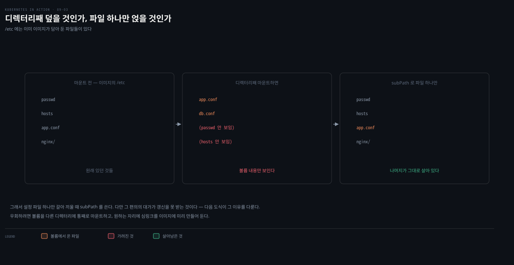
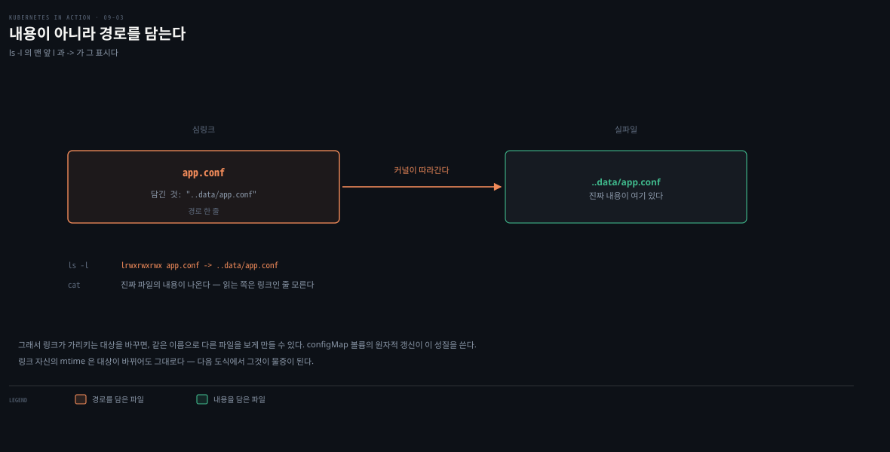
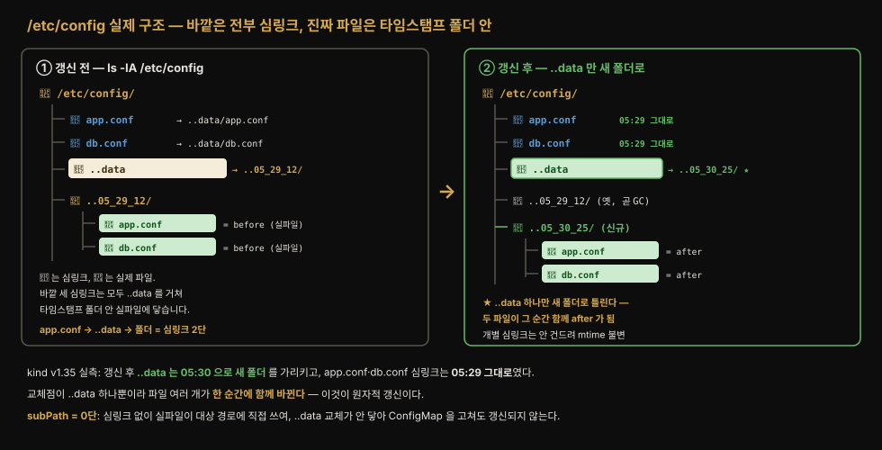
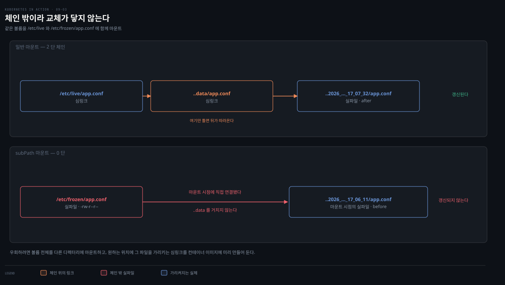
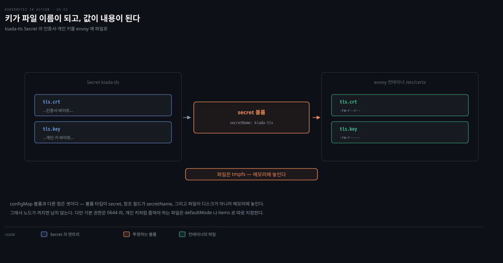

# ConfigMap·Secret·Downward API·projected 볼륨
---
> [08장](./08-02.ConfigMap%EC%9C%BC%EB%A1%9C%20%EC%84%A4%EC%A0%95%20%EB%B6%84%EB%A6%AC%ED%95%98%EA%B8%B0.md)에서 ConfigMap·Secret·Downward API를 환경변수로 주입했다면, 이 편은 같은 데이터를 *파일*로 노출합니다. 긴 설정 파일은 환경변수보다 파일이 낫고, configMap 볼륨은 실행 중 갱신까지 반영합니다. projected 볼륨은 이 셋을 한 디렉터리로 합칩니다.


> 이 문서를 읽고 나면 configMap 볼륨이 심볼릭 링크로 파일을 원자적으로 갱신하는 원리를 설명하고, secret 볼륨에서 파일 권한과 그룹 소유권(fsGroup)을 맞추는 이유를 진단하며, projected 볼륨으로 여러 소스를 한 디렉터리로 합치는 매니페스트를 작성할 수 있습니다.


## 진입 — 환경변수 대신 파일로 노출하기

> 짧은 단일 라인 값은 환경변수가, 길고 여러 줄인 값은 파일이 낫습니다. 이 편은 [08장](./08-02.ConfigMap%EC%9C%BC%EB%A1%9C%20%EC%84%A4%EC%A0%95%20%EB%B6%84%EB%A6%AC%ED%95%98%EA%B8%B0.md)에서 환경변수로 주입한 ConfigMap·Secret·메타데이터를 볼륨으로 파일화하는 방법입니다.

[08장](./08-03.Secret%EA%B3%BC%20Downward%20API.md)에서 ConfigMap·Secret·Downward API를 배웠지만, 그때는 그 정보를 환경변수와 명령행 인자로 주입하는 법만 다뤘습니다. 그 정보를 볼륨의 파일로도 노출할 수 있다고 언급만 했는데, 이 장이 볼륨 편이니 그 방법을 봅니다.

[05장](./05-03.%EB%A9%80%ED%8B%B0%20%EC%BB%A8%ED%85%8C%EC%9D%B4%EB%84%88%C2%B7init%C2%B7%EB%84%A4%EC%9D%B4%ED%8B%B0%EB%B8%8C%20%EC%82%AC%EC%9D%B4%EB%93%9C%EC%B9%B4%EC%99%80%20%EC%82%AD%EC%A0%9C.md)에서 배포한 kiada 파드에는 TLS 트래픽을 처리하는 Envoy 사이드카가 있었습니다. 그때는 볼륨을 아직 안 배워서 Envoy가 쓰는 설정 파일·TLS 인증서·개인 키를 컨테이너 이미지에 직접 넣었습니다. 옳은 방법이 아닙니다.

이 파일들을 ConfigMap·Secret에 두고 컨테이너에 파일로 주입하면 이미지를 다시 빌드하지 않고 갱신할 수 있습니다. 설정과 인증서·키는 보안 함의가 다르므로 설정은 ConfigMap에, 인증서·키는 Secret에 둡니다.


## 1. configMap 볼륨으로 ConfigMap 엔트리를 파일로 노출하기

> 환경변수는 짧은 단일 라인 값에, configMap 볼륨은 길고 여러 줄인 설정 파일에 씁니다. ConfigMap 엔트리가 개별 파일로 나타나고, ConfigMap을 고치면 파일이 갱신됩니다 — 다만 즉시가 아니라 kubelet 동기화 주기만큼 늦습니다.

환경변수는 짧은 단일 라인 값을 애플리케이션에 넘길 때, 길고 여러 줄인 값은 파일로 넘길 때가 낫습니다. 큰 ConfigMap 엔트리는 configMap 볼륨으로 컨테이너에 넘깁니다.

> **크기 한계**: ConfigMap·Secret에 담을 수 있는 정보량은 오브젝트를 저장하는 etcd가 정합니다. 상한은 **1 MiB**이며 근사치가 아니라 하드 리밋입니다.

configMap 볼륨은 ConfigMap 엔트리를 개별 파일로 노출합니다. 컨테이너 프로세스가 이 파일을 읽어 값을 얻습니다. 큰 설정 파일을 넘길 때 가장 자주 쓰지만 작은 값에도 쓸 수 있습니다. `env`·`envFrom`과 섞어 큰 엔트리는 파일로, 작은 엔트리는 환경변수로 넘기는 것도 가능합니다.

```yaml
apiVersion: v1
kind: Pod
metadata:
  name: kiada-ssl
spec:
  volumes:
  - name: envoy-config
    configMap:                # configMap 볼륨 — 아래 ConfigMap을 가리킴
      name: kiada-ssl-config
  containers:
  - name: envoy
    image: luksa/kiada-ssl-proxy:0.1
    volumeMounts:
    - name: envoy-config
      mountPath: /etc/envoy   # ConfigMap 엔트리가 이 디렉터리에 파일로 나타남
```

`envoy-config` 볼륨은 `kiada-ssl-config` ConfigMap을 가리키고, `envoy` 컨테이너의 `/etc/envoy`에 마운트됩니다. ConfigMap이 존재하지 않고 참조가 optional이 아니면, 컨테이너는 시작되지 못합니다.

### optional 표시와, ConfigMap이 없을 때의 차이

[08장](./08-02.ConfigMap%EC%9C%BC%EB%A1%9C%20%EC%84%A4%EC%A0%95%20%EB%B6%84%EB%A6%AC%ED%95%98%EA%B8%B0.md)에서, 환경변수가 없는 ConfigMap을 참조하면 그 *컨테이너만* 시작이 막히고 다른 컨테이너는 정상 시작한다고 배웠습니다. 볼륨에서 참조할 때는 다릅니다. 파드의 모든 볼륨은 컨테이너가 시작되기 전에 세팅돼야 하므로, 볼륨이 없는 ConfigMap을 참조하면 그 볼륨을 마운트한 컨테이너뿐 아니라 *파드의 모든 컨테이너*가 시작되지 못합니다.

> **optional 표시**: 볼륨 정의에 `optional: true`를 넣으면 configMap 볼륨을 optional로 만들 수 있습니다. optional인데 ConfigMap이 없으면 볼륨이 만들어지지 않고, 컨테이너는 볼륨을 마운트하지 않은 채 시작됩니다.

### 특정 엔트리만 투영하기

configMap 볼륨은 어떤 ConfigMap 엔트리를 파일로 투영할지 지정할 수 있습니다. Envoy는 `status-message` 엔트리가 필요 없지만 다른 컨테이너가 그것을 요구해 ConfigMap에서 뺄 수 없는 경우, `items`로 필요한 엔트리만 고릅니다.

```yaml
  volumes:
  - name: envoy-config
    configMap:
      name: kiada-ssl-config
      items:               # 나열한 엔트리만 볼륨에 포함
      - key: envoy.yaml    # ConfigMap의 키
        path: envoy.yaml   # 볼륨 안 파일명
```

`items`에 나열되지 않은 엔트리는 볼륨에 포함되지 않습니다. 이렇게 하면 하나의 ConfigMap을 파드가 쓰면서 일부 엔트리는 환경변수로, 일부는 파일로 나눠 노출할 수 있습니다.


## 2. configMap 볼륨의 동작 — 마운트와 심볼릭 링크

> configMap 볼륨을 쓰기 전에 두 가지를 알아야 합니다. 볼륨 마운트가 기존 파일을 어떻게 가리는가, 그리고 쿠버네티스가 심볼릭 링크로 파일을 어떻게 원자적으로 갱신하는가입니다.

configMap 볼륨을 디렉터리에 마운트하면 단순히 파일 몇 개가 생기는 게 아니라, 두 가지 주의점이 따라옵니다.

1. 볼륨 마운트 일반의 동작
2. 쿠버네티스가 심볼릭 링크로 파일을 원자적으로 갱신하는 방식

### 마운트가 기존 파일을 가립니다 — subPath로 완화

볼륨을 컨테이너 파일시스템의 어떤 디렉터리에 마운트하면, 이미지에서 온 그 디렉터리의 기존 파일은 *더 이상 보이지 않습니다*. 하위 디렉터리까지 포함해서입니다. 예를 들어 `/etc`(유닉스에서 중요한 설정 파일이 모인 곳)에 configMap 볼륨을 마운트하면, 애플리케이션은 ConfigMap이 제공한 파일만 보고 나머지 `/etc` 파일은 가려져 실행에 실패할 수 있습니다. 이는 `subPath` 필드로 완화합니다.

`my-app.conf` 파일 하나만 담은 configMap 볼륨을 `/etc`의 기존 파일을 덮지 않고 넣고 싶다면, 볼륨 전체가 아니라 특정 파일만 `mountPath`·`subPath` 조합으로 마운트합니다.

```yaml
spec:
  containers:
  - name: my-container
    volumeMounts:
    - name: my-volume
      subPath: my-app.conf          # 볼륨 전체가 아니라 이 파일 하나만
      mountPath: /etc/my-app.conf   # 단일 파일이므로 파일 경로를 지정
```



### 심볼릭 링크로 원자적 갱신

일부 애플리케이션은 설정 파일 변경을 감시해 자동으로 다시 읽습니다. 큰 파일이나 여러 파일을 쓰면, 모든 갱신이 다 쓰이기 전에 변경을 감지해 *부분적으로만 갱신된* 파일을 읽어 오작동할 수 있습니다. 쿠버네티스는 이를 막으려고 configMap 볼륨의 모든 파일을 *원자적으로* 갱신합니다. 곧, 모든 갱신이 순간적으로 함께 이뤄집니다. 이는 심볼릭 링크로 구현됩니다.

먼저 심볼릭 링크(심링크)가 무엇인지 짚습니다. 일반 파일은 이름이 디스크의 실제 데이터를 직접 가리킵니다. 심링크는 데이터가 아니라 *다른 경로 문자열*을 담은 포인터 파일입니다. 심링크를 열면 시스템이 그 경로를 따라가 실제 파일에 도달합니다. `ls -l`에서 맨 앞 글자가 일반 파일은 `-`, 심링크는 `l`로 표시되고 `->` 뒤에 가리키는 대상이 나옵니다. 핵심은 대상을 바꾸면 심링크 자체는 그대로 두고 *가리키는 곳만* 바뀐다는 점입니다.



```bash
kubectl exec kiada-ssl -c envoy -- ls -lA /etc/envoy
drwxr-xr-x  ..2020_11_14_11_47_45.728287366                # 실제 파일이 든 하위 디렉터리
lrwxrwxrwx  ..data -> ..2020_11_14_11_47_45.728287366      # 그 디렉터리를 가리키는 심링크
lrwxrwxrwx  envoy.yaml -> ..data/envoy.yaml                # 엔트리마다 심링크
```

- ConfigMap 엔트리는 `..data`라는 하위 디렉터리 안 파일을 가리키는 심볼릭 링크이고, `..data` 자체도 타임스탬프 이름의 디렉터리를 가리키는 심링크입니다.
- 애플리케이션이 읽는 파일 경로는 두 번의 심링크를 거쳐 실제 파일에 도달합니다. 불필요해 보이지만 이 구조가 원자적 갱신을 가능하게 합니다. ConfigMap을 바꿀 때마다 쿠버네티스는 타임스탬프가 붙은 새 디렉터리를 만들어 갱신된 파일을 거기 쓰고, `..data` 심링크를 새 디렉터리로 바꿔 *모든 파일을 한 번에* 교체합니다.

**왜 심링크를 두 번 거치게 만들까요.** 핵심은 *교체점을 하나로 모으는* 데 있습니다.

- 만약 파일마다 심링크를 직접 새 파일로 바꾼다면(1단), 파일이 여러 개일 때 `app.conf`는 이미 새 값을 가리키는데 `db.conf`는 아직 옛 값을 가리키는 *섞인 찰나*가 생깁니다. 이 순간에 애플리케이션이 두 파일을 함께 읽으면 새 설정과 옛 설정이 뒤섞인 상태를 봅니다.
- 2단 구조는 개별 파일 심링크를 건드리지 않습니다. 새 타임스탬프 디렉터리에 *모든* 파일을 먼저 쓴 뒤, `..data`가 가리키는 대상만 새 디렉터리로 바꿉니다. `app.conf`·`db.conf` 심링크의 경로(`..data/app.conf`)는 그대로 유지됩니다. 그 아래 `..data`의 대상만 전환되므로 모든 파일이 한 순간에 함께 교체됩니다.

`kind-k8s-lab`(v1.35)에서 `app.conf`·`db.conf` 두 엔트리를 담은 볼륨의 실제 구조를 `ls -lA`로 봤습니다. 바깥의 `app.conf`·`db.conf`·`..data`는 모두 `l`로 시작하는 심링크이고, 진짜 파일은 타임스탬프 디렉터리 안에 `-rw-r--r--`로 들어 있습니다.

```bash
kubectl exec symdemo -- ls -lA /etc/demo
# drwxr-xr-x  ..2026_08_14_17_06_20.3002930748
# lrwxrwxrwx  ..data -> ..2026_08_14_17_06_20.3002930748
# lrwxrwxrwx  app.conf -> ..data/app.conf
# lrwxrwxrwx  db.conf -> ..data/db.conf
```

디렉터리 이름 끝의 `.3002930748`은 나노초입니다. kubelet의 atomic writer가 항상 붙이므로, 초 단위까지만 보이는 이름을 만났다면 출력이 잘린 것입니다.

ConfigMap을 `after`로 수정한 뒤 다시 보면 이렇게 바뀝니다.

```bash
# drwxr-xr-x  ..2026_08_14_17_07_32.2118119027     ← 새 디렉터리
# lrwxrwxrwx  ..data -> ..2026_08_14_17_07_32.2118119027   ← 대상만 전환
# lrwxrwxrwx  app.conf -> ..data/app.conf          ← mtime 그대로 17:06
# lrwxrwxrwx  db.conf -> ..data/db.conf            ← mtime 그대로 17:06
```

새 디렉터리가 생기고 `..data`가 그쪽을 가리키도록 바뀝니다. 반면 `app.conf`·`db.conf` 심링크의 mtime은 처음 그대로입니다. 그러면서 두 파일 내용은 `before`에서 `after`로 *함께* 바뀝니다. 개별 파일 심링크는 손대지 않고 `..data` 하나만 새 디렉터리로 튼다는 물증입니다.

반영은 즉시가 아닙니다. 같은 실측에서 ConfigMap을 고친 뒤 파일 내용이 바뀌기까지 **약 62초**가 걸렸습니다. 이 지연은 kubelet 동기화 주기와 캐시 전파 지연의 합이며, 08-02에서 잰 56초와 같은 계통입니다.



이 관점에서 보면 `subPath`는 심링크가 아예 없는 *0단*입니다. subPath는 마운트 시점에 그때 `..data/app.conf`가 가리키던 *실제 파일 하나*를 대상 경로에 직접 연결합니다. 그래서 `/etc/frozen/app.conf`는 심링크가 아니라 `-rw-r--r--` 실파일로 나타납니다. `..data`를 거치지 않는 것입니다. 쿠버네티스가 갱신 때 `..data`를 새 디렉터리로 틀어도, 이 교체는 `..data`를 경유하는 파일에만 전파되므로 체인 밖에 있는 subPath 실파일에는 닿지 않습니다. 파일은 읽히지만 ConfigMap을 고쳐도 옛 값에 머무는 이유가 이것입니다.

실제로 kind에서 같은 볼륨을 `/etc/live`(일반)와 `/etc/frozen/app.conf`(subPath)에 함께 마운트하고 ConfigMap을 `after`로 고치면, `/etc/live`는 `after`로 갱신되지만 `/etc/frozen`은 `before` 그대로였습니다.



심링크·하드링크·inode의 리눅스 기초는 [../../02_os/kernel/01-01.커널과 컨테이너](../../../02_os/kernel/01-01.%EC%BB%A4%EB%84%90%EA%B3%BC%20%EC%BB%A8%ED%85%8C%EC%9D%B4%EB%84%88.md)와 함께 보면 좋습니다.

> **주의**: `subPath`를 쓰면 이 메커니즘이 동작하지 않습니다. 파일이 대상 디렉터리에 직접 쓰여, ConfigMap을 고쳐도 갱신되지 않습니다. 이 문제를 우회하려면 볼륨 전체를 다른 디렉터리에 마운트하고, 원하는 위치에 그 파일을 가리키는 심링크를 컨테이너 이미지에 미리 만들어 둡니다.


## 3. secret 볼륨

> configMap 볼륨이 있으면 secret 볼륨도 있습니다. 추가 방법은 거의 같고, 볼륨 타입이 `secret`, 참조가 `secretName`이라는 점만 다릅니다. Secret 파일은 tmpfs(메모리)에 저장됩니다.

Secret은 ConfigMap과 크게 다르지 않아, secret 볼륨을 파드에 추가하는 것도 configMap 볼륨과 거의 같습니다. [08장](./08-03.Secret%EA%B3%BC%20Downward%20API.md)에서 만든 `kiada-tls` Secret의 TLS 인증서·개인 키를 envoy 컨테이너에 파일로 주입합니다.

```yaml
apiVersion: v1
kind: Pod
metadata:
  name: kiada-ssl
spec:
  volumes:
  - name: cert-and-key
    secret:
      secretName: kiada-tls      # configMap의 name 대신 secretName
      items:                     # Secret 키를 Envoy 설정의 파일명에 매핑
      - key: tls.crt
        path: example-com.crt
      - key: tls.key
        path: example-com.key
  containers:
  - name: envoy
    image: envoyproxy/envoy:v1.14.1   # 파일을 밖에서 주입하니 커스텀 이미지 불필요
    volumeMounts:
    - name: cert-and-key
      mountPath: /etc/certs
      readOnly: true
```

볼륨 정의는 configMap 볼륨과 거의 같고, 타입이 `secret`이고 참조가 `secretName`이라는 두 가지만 다릅니다. 설정·인증서·키를 모두 이미지 밖에서 받으니, 커스텀 `kiada-ssl-proxy` 이미지를 범용 `envoyproxy/envoy` 이미지로 교체할 수 있습니다. 커스텀 이미지를 시스템에서 없애면 더 이상 유지보수할 필요가 없어지는 큰 개선입니다.



Secret 엔트리를 secret 볼륨으로 컨테이너에 투영하면, Secret YAML의 값이 Base64로 인코딩돼 있어도 파일로 쓰일 때 *디코딩*됩니다. 애플리케이션은 파일을 읽을 때 디코딩할 필요가 없습니다. Secret 엔트리를 환경변수에 주입할 때도 마찬가지입니다.

> **주의**: secret 볼륨의 파일은 인메모리 파일시스템(tmpfs)에 저장돼, 노출될 위험이 낮습니다.


## 4. secret·configMap 볼륨의 파일 권한과 소유권

> 보안을 위해 파일 권한을 제한하는 게 좋지만, 그러면 컨테이너 프로세스가 파일을 못 읽을 수 있습니다. 그룹 소유권을 fsGroup으로 맞춰야 합니다.

보안을 높이려면 configMap, 특히 secret 볼륨의 파일 권한을 제한하는 게 좋습니다. 다만 권한을 바꾸면, 그룹 소유권도 함께 맞추지 않는 한 컨테이너 프로세스가 파일에 접근하지 못할 수 있습니다.

### 기본 권한과 변경

secret·configMap 볼륨의 기본 파일 권한은 `rw-r--r--`(8진수 `0644`)입니다. 소유자는 읽고 쓸 수 있고(실행은 불가), 그룹과 다른 사용자는 읽기만 됩니다. 기본 권한은 볼륨 정의의 `defaultMode`로 바꿉니다. 예를 들어 `rwxr-----`은 `defaultMode: 0740`입니다.

> **팁**: YAML에서 파일 권한을 지정할 때는 앞의 0을 반드시 넣어 8진수임을 표시합니다. 0을 빼면 10진수로 해석돼 의도치 않은 권한이 됩니다. JSON에서는 10진수를 씁니다. `kubectl get -o yaml`로 파드를 보면 권한이 10진수로 표시됩니다 — 예를 들어 `420`은 8진수 `0644`(기본 권한)의 10진수 값입니다.

개별 파일 권한은 각 item의 `key`·`path` 옆에 `mode`를 둡니다.

```yaml
  volumes:
  - name: cert-and-key
    secret:
      secretName: kiada-tls
      items:
      - key: tls.key
        path: example-com.key
        mode: 0640             # 이 파일만 rw-r-----
```

secret·configMap 볼륨의 파일은 심볼릭 링크임을 잊지 마세요. 실제 파일 권한을 보려면 링크를 따라가야 합니다(`ls -lL`). 심링크 자체는 항상 `rwxrwxrwx`로 보이지만 의미가 없고, 시스템은 대상 파일의 권한을 씁니다.

### 그룹 소유권 — fsGroup

fsGroup을 이해하려면 리눅스 권한 검사가 어떻게 도는지부터 잡아야 합니다. 파일 권한 `rw-r-----`(0640)의 세 칸은 각각 소유자·그룹·기타(others)를 뜻합니다. 프로세스가 파일에 접근할 때 시스템은 이 세 칸 중 **딱 한 칸만** 골라 적용합니다. 계급처럼 위 칸이 아래 칸을 포함하는 게 아니라 "내가 소유자인가 → 아니면 소유 그룹의 멤버인가 → 둘 다 아니면 기타"로, 위에서부터 매칭되는 첫 칸에서 끝납니다. 그래서 프로세스가 소유자도 소유 그룹도 아니면 *기타* 칸이 적용됩니다. 0640은 기타에 읽기 비트가 없어 읽기가 막힙니다.

여기서 한 프로세스는 여러 그룹에 동시에 속할 수 있다는 점이 열쇠입니다. 로그인 시 정해지는 **주 그룹**(gid)은 하나입니다. 그 밖에 **보충 그룹**(supplementary groups)으로 다른 그룹의 멤버가 될 수 있습니다. 그룹 칸 매칭은 파일의 소유 그룹이 프로세스의 주 그룹이든 보충 그룹이든 하나라도 걸리면 성립합니다. 뒤에서 볼 fsGroup이 바로 이 보충 그룹을 이용합니다. 참고로 root는 uid·gid가 모두 0입니다.

기본 권한(`rw-r--r--`)은 누구나 읽게 하지만, 권한을 제한하면 프로세스의 UID·GID가 파일 소유자·그룹과 맞지 않을 때 프로세스가 파일을 못 읽을 수 있습니다. 예를 들어 kiada-ssl 파드의 Envoy는 `envoy` 사용자(uid 101, gid 101)로 도는데, 볼륨의 파일은 `root` 사용자·`root` 그룹 소유입니다.

```bash
kubectl exec kiada-ssl -c envoy -- id envoy
uid=101(envoy) gid=101(envoy) groups=101(envoy)

kubectl exec kiada-ssl -c envoy -- ls -lL /etc/certs
-rw-r--r--. 1 root root 1992 ... example-com.crt
-rw-r-----. 1 root root 3268 ... example-com.key   # root 만 읽을 수 있음
```

`envoy` 사용자는 root 그룹에 속하지도, root 사용자도 아니라, 개인 키를 소유자·그룹만 읽게 제한하면 Envoy가 키 파일을 못 읽어 시작에 실패합니다. 이는 파드 스펙의 `securityContext.fsGroup`으로 해결합니다. 이 필드는 볼륨과 파일의 그룹 소유권을 바꿉니다.

```yaml
apiVersion: v1
kind: Pod
metadata:
  name: kiada-ssl
spec:
  securityContext:
    fsGroup: 101      # 모든 컨테이너의 보충 그룹 + 볼륨 파일 그룹 소유권을 envoy(101)로
  volumes:
  ...
```

`fsGroup`을 101로 두면 볼륨과 파일이 `envoy` 그룹(gid 101) 소유가 됩니다. 파드를 다시 만들면 두 컨테이너가 정상 시작되고, 파일 그룹이 `envoy`로 바뀐 것을 확인할 수 있습니다.

```bash
kubectl exec kiada-ssl -c envoy -- ls -lL /etc/certs
-rw-r--r--. 1 root envoy 1992 ... example-com.crt
-rw-r-----. 1 root envoy 3268 ... example-com.key   # 그룹이 envoy 로 바뀜 → 읽기 가능
```

`fsGroup: 2000`을 준 파드를 kind에서 확인하면, 프로세스의 `groups`가 `1000`에서 `1000,2000`으로 늘고 파일 그룹이 `root`에서 `2000`으로 바뀝니다. fsGroup은 두 가지를 동시에 하기 때문입니다 — 볼륨 파일의 그룹 소유권을 지정 gid로 바꾸는 것과, 프로세스를 그 gid의 보충 그룹 멤버로 넣는 것입니다. 그 결과 앞서 막혔던 그룹 칸 매칭이 성립해 파일을 읽게 됩니다.


fsGroup은 이렇게 파일 그룹과 프로세스 보충 그룹 양쪽을 손댑니다. 그래서 비슷한 이름의 다른 필드와 방향을 헷갈리지 않는 게 중요합니다. `runAsUser`·`runAsGroup`은 *프로세스의 신분*(uid·gid)을 정합니다. `fsGroup`은 *파일의 그룹 소유권*을 정합니다. 하나는 프로세스 쪽, 하나는 파일 쪽을 건드립니다. 그리고 이 글을 쓰는 시점에 fsGroup은 파일의 *사용자* 소유권은 바꿀 수 없습니다. 그룹 소유권만 바꿀 수 있습니다.


## 5. downwardAPI 볼륨으로 파드 메타데이터를 파일로

> ConfigMap·Secret처럼, 파드 메타데이터도 downwardAPI 볼륨으로 컨테이너 파일시스템에 파일로 투영할 수 있습니다.

파드 이름을 컨테이너 안 파일로 제공해야 한다면, 다음 볼륨·마운트를 추가해 파드 이름을 `/etc/pod/name.txt`에 씁니다.

```yaml
  volumes:
  - name: metadata
    downwardAPI:
      items:
      - path: name.txt                  # 볼륨 안 파일명
        fieldRef:
          fieldPath: metadata.name      # 파드 오브젝트의 metadata.name 값을 씀
  containers:
  - name: foo
    volumeMounts:
    - name: metadata
      mountPath: /etc/pod               # 이 경로에 name.txt 파일이 생김
```

- configMap·secret 볼륨처럼 `defaultMode`로 기본 권한, `mode`로 개별 권한을 설정할 수 있습니다. [08장](./08-03.Secret%EA%B3%BC%20Downward%20API.md)에서 환경변수로 주입할 때처럼, 각 item은 파드 오브젝트 필드를 가리키는 `fieldRef`나 컨테이너 리소스 필드를 가리키는 `resourceFieldRef`를 씁니다.
- 리소스 필드는 볼륨이 파드 수준에 정의돼 어느 컨테이너의 리소스인지 분명하지 않으므로 `containerName`을 반드시 지정합니다. 환경변수처럼 `divisor`로 값을 원하는 단위로 변환할 수 있습니다.


## 6. projected 볼륨으로 여러 소스 합치기

> projected 볼륨은 여러 ConfigMap·Secret·Downward API를 한 볼륨으로 합칩니다. `subPath` 없이도 서로 다른 소스의 파일을 한 디렉터리에 담고, 소스가 바뀌면 갱신됩니다.

`subPath`를 쓰지 않으면 configMap·secret·downwardAPI 볼륨의 파일을 같은 디렉터리에 넣을 수 없습니다. 예를 들어 서로 다른 Secret의 키를 하나의 디렉터리로 합칠 수 없습니다. `subPath`로 개별 파일을 넣을 수는 있지만, 그러면 §2에서 본 대로 소스 값이 바뀌어도 파일이 갱신되지 않습니다. projected 볼륨이 이를 해결합니다.

projected 볼륨은 여러 소스를 한 볼륨으로 합칩니다. 합칠 수 있는 소스는 여섯 종류입니다.[^projected-sources]

| 소스 | 무엇을 넣는가 |
|---|---|
| `configMap` | ConfigMap 엔트리 |
| `secret` | Secret 엔트리 |
| `downwardAPI` | Pod 메타데이터·리소스 값 |
| `serviceAccountToken` | 만료 시간이 붙은 API 토큰 |
| `clusterTrustBundle` | 클러스터가 배포하는 CA 인증서 묶음 |
| `podCertificate` | 파드용 인증서 |

이 편에서 주로 쓰는 것은 앞의 셋이지만, `serviceAccountToken`도 남 얘기가 아닙니다. §7에서 볼 `kube-api-access` 볼륨이 바로 이 소스로 만들어져 **모든 파드에 이미 붙어 있습니다.**

kiada-ssl 파드에서 `/etc/envoy`에 마운트하던 configMap 볼륨과 `/etc/certs`에 마운트하던 secret 볼륨을, 하나의 projected 볼륨으로 대체해 세 파일을 같은 `/etc/envoy` 디렉터리에 둡니다.

```yaml
apiVersion: v1
kind: Pod
metadata:
  name: kiada-ssl
spec:
  volumes:
  - name: etc-envoy
    projected:                          # 하나의 projected 볼륨이 두 볼륨을 대체
      sources:
      - configMap:                      # 소스 1 — ConfigMap의 envoy.yaml 만 투영
          name: kiada-ssl-config
          items:
          - key: envoy.yaml
            path: envoy.yaml
      - secret:                         # 소스 2 — Secret의 인증서·키를 투영
          name: kiada-tls
          items:
          - key: tls.crt
            path: example-com.crt
          - key: tls.key
            path: example-com.key
            mode: 0600                  # 개인 키만 제한 권한
  containers:
  - name: envoy
    image: envoyproxy/envoy:v1.14.1
    volumeMounts:
    - name: etc-envoy                   # 볼륨이 하나이므로 마운트도 하나
      mountPath: /etc/envoy
      readOnly: true
```

소스 정의는 configMap·secret 볼륨과 크게 다르지 않습니다. 앞에서 배운 모든 것이 그대로 적용되고, 이제 하나의 볼륨에 여러 소스의 정보를 채울 수 있을 뿐입니다. 마운트 후 확인하면 ConfigMap의 파일과 하위 디렉터리, Secret의 인증서 파일이 한 트리에 담깁니다.

```bash
kubectl exec kiada-ssl -c envoy -- ls -LR /etc/envoy
/etc/envoy:
certs
envoy.yaml               # ConfigMap 에서 온 파일
/etc/envoy/certs:
example-com.crt          # Secret 에서 온 파일
example-com.key
```

### 거의 모든 파드에 내장된 kube-api-access 볼륨

`kubectl get pod -o yaml`로 파드 매니페스트를 보면, 각 파드에 내장 projected 볼륨이 모든 컨테이너에 마운트돼 있습니다. 매니페스트에 하나만 정의해도 파드에 projected 볼륨이 둘 보이는 이유입니다.

```yaml
volumes:
- name: kube-api-access-gc7lf         # kube-api-access-<랜덤> — 자동 추가
  projected:
    defaultMode: 420
    sources:
      - serviceAccountToken:          # 파드의 ServiceAccount 토큰
          expirationSeconds: 3607
          path: token
      - configMap:                    # CA 인증서(kube-root-ca.crt ConfigMap)
          items:
            - key: ca.crt
              path: ca.crt
          name: kube-root-ca.crt
      - downwardAPI:                  # 파드 네임스페이스
          items:
            - fieldRef:
                fieldPath: metadata.namespace
              path: namespace
```

이름 그대로 이 볼륨은 파드가 쿠버네티스 API에 접근하는 데 필요한 정보를 담습니다. `token`·`ca.crt`·`namespace` 세 파일이며, 각각 다른 소스에서 옵니다.

> **팁**: 대부분의 파드는 쿠버네티스 API에 접근할 필요가 없습니다. 최소 권한 원칙에 따라, 그런 파드는 `automountServiceAccountToken: false`로 이 볼륨을 끄는 게 좋습니다. ServiceAccount 자체에서 설정할 수도 있습니다.


## 7. 그 밖의 볼륨 타입 한눈에

> `persistentVolumeClaim`·`ephemeral`·`csi`는 외부 스토리지를 파드에 통합하는 타입입니다. 대부분은 다음 장의 주제이고, 이 장은 파드 생애를 넘지 않는 임시 볼륨에 집중했습니다.

`kubectl explain pod.spec.volumes`를 돌리면 이 장에서 다루지 않은 여러 타입이 나옵니다.

| 타입 | 용도 |
|------|------|
| `persistentVolumeClaim` | PersistentVolumeClaim 리소스를 참조해 지속 스토리지를 요청. 기존 PV에 바인딩하거나 새로 만듦 |
| `ephemeral` | PVC 인라인 템플릿을 정의해 PV를 동적 프로비저닝. `persistentVolumeClaim`처럼 동작하되 단일 파드 인스턴스용이라 파드 삭제 시 함께 삭제 |
| `awsElasticBlockStore`·`azureDisk`·`gcePersistentDisk` 등 | 기술 종속 타입. 대부분 폐기 예정 → CSI 드라이버 경유의 `persistentVolumeClaim`·`ephemeral`로 |
| `csi` | Container Storage Interface. PVC·PV 없이 파드 매니페스트에 CSI 드라이버를 직접 설정. 일부 드라이버만 지원, 보통은 PVC·ephemeral 권장 |

이 장은 파드 생애주기를 넘지 않는 *임시 볼륨*에 집중했습니다. 지속 스토리지는 훨씬 넓고 복잡한 주제라 별도의 장이 필요하고, 그것이 다음 장의 주제입니다.


## 면접에서 받을 만한 질문

1. 볼륨이 없는 ConfigMap을 참조할 때, 환경변수 참조와 볼륨 참조는 컨테이너 시작에 어떻게 다르게 영향을 줍니까?
2. configMap 볼륨이 심볼릭 링크(`..data` → 타임스탬프 디렉터리)를 쓰는 이유는 무엇입니까?
3. `subPath`로 파일을 마운트하면 어떤 편의를 얻고, 대신 무엇을 잃습니까?
4. secret 볼륨의 개인 키 파일을 `root`만 읽게 제한했더니 Envoy가 시작에 실패했습니다. 원인과 해결책은 무엇입니까?
5. projected 볼륨이 `subPath`보다 나은 점은 무엇입니까? kube-api-access 볼륨은 왜 거의 모든 파드에 있습니까?

> 5개 질문에 *먼저 스스로 답해 보세요.* 자답이 끝나면 아래 §정답으로 내려갑니다. 자답 없이 먼저 읽으면 학습 효과가 0입니다.


## 정답 (자답 후 펼치기)

> 위 §면접에서 받을 만한 질문의 5개에 *먼저 자답한 뒤* 아래를 읽으세요.

### 정답 1 — 환경변수 참조 vs 볼륨 참조의 시작 영향

없는 ConfigMap을 *환경변수*로 참조하면 그 *컨테이너만* 시작이 막히고, 같은 파드의 다른 컨테이너는 정상 시작합니다. 반면 *볼륨*으로 참조하면, 파드의 모든 볼륨이 컨테이너 시작 전에 세팅돼야 하므로 그 볼륨을 마운트한 컨테이너뿐 아니라 *파드의 모든 컨테이너*가 시작되지 못합니다. 이를 피하려면 볼륨 정의에 `optional: true`를 둡니다.

### 정답 2 — 심볼릭 링크와 원자적 갱신

애플리케이션이 큰 설정 파일이나 여러 파일을 감시해 자동으로 다시 읽을 때, 갱신이 다 쓰이기 전에 *부분적으로 갱신된* 파일을 읽어 오작동하는 것을 막기 위해서입니다. 쿠버네티스는 ConfigMap을 바꿀 때 타임스탬프가 붙은 새 디렉터리에 갱신 파일을 다 쓴 뒤 `..data` 심링크를 새 디렉터리로 한 번에 바꿉니다. 그래서 모든 파일이 순간적으로 함께 교체되어(원자적) 반쯤 갱신된 상태가 노출되지 않습니다.

### 정답 3 — subPath의 득실

`subPath`는 볼륨 전체가 아니라 특정 파일 하나만 마운트해, 그 디렉터리의 *기존 파일을 가리지 않고* 파일 하나를 끼워 넣게 해 줍니다(예: `/etc`의 다른 파일을 살린 채 `my-app.conf`만 추가). 대신 §2의 심볼릭 링크 원자 갱신 메커니즘이 동작하지 않아, ConfigMap을 고쳐도 그 파일이 *갱신되지 않습니다*. 갱신이 필요하면 볼륨 전체를 다른 디렉터리에 마운트하고 심링크로 우회합니다.

### 정답 4 — fsGroup으로 그룹 소유권 맞추기

원인은 볼륨 파일이 `root` 사용자·그룹 소유인데 Envoy 프로세스는 `envoy` 사용자(uid/gid 101)로 돌기 때문입니다. 개인 키를 소유자·그룹만 읽게 제한하면, root 그룹에 속하지 않은 `envoy`가 파일을 못 읽어 시작에 실패합니다. 해결책은 파드 스펙에 `securityContext.fsGroup: 101`을 두는 것입니다. 그러면 볼륨과 파일의 그룹 소유권이 `envoy` 그룹(101)으로 바뀌어 프로세스가 키를 읽을 수 있습니다. 참고로 이 시점에는 그룹 소유권만 바꿀 수 있고 사용자 소유권은 바꿀 수 없습니다.

### 정답 5 — projected 볼륨의 이점과 kube-api-access

`subPath`도 여러 소스의 파일을 한 디렉터리에 넣을 수 있지만 그 파일들이 갱신되지 않습니다. projected 볼륨은 여러 ConfigMap·Secret·Downward API를 *하나의 볼륨*으로 합치면서 원자적 갱신을 유지합니다. kube-api-access 볼륨이 거의 모든 파드에 있는 이유는, 파드가 쿠버네티스 API에 접근하는 데 필요한 세 파일(ServiceAccount 토큰·CA 인증서·네임스페이스)을 자동으로 제공하기 위해서입니다. API 접근이 필요 없는 파드는 최소 권한 원칙에 따라 `automountServiceAccountToken: false`로 끄는 게 좋습니다.


[^projected-sources]: Kubernetes 공식 문서 [Projected Volumes](https://kubernetes.io/docs/concepts/storage/projected-volumes/) — "A projected volume can currently combine the following types of volume sources: `secret`, `downwardAPI`, `configMap`, `serviceAccountToken`, `clusterTrustBundle`, `podCertificate`." 클러스터에서는 `kubectl explain pod.spec.volumes.projected.sources` 로 같은 목록을 확인할 수 있습니다.


## 관련 문서

> 이 편은 09-01·09-02의 볼륨 기초 위에서 특수 볼륨(ConfigMap·Secret·Downward API·projected)을 다루고, 08장의 환경변수 주입과 짝을 이룹니다.

- [08-02. ConfigMap으로 설정 분리하기](./08-02.ConfigMap%EC%9C%BC%EB%A1%9C%20%EC%84%A4%EC%A0%95%20%EB%B6%84%EB%A6%AC%ED%95%98%EA%B8%B0.md) § "CM 갱신 반영" — 환경변수 주입은 재시작 전 미반영, 이 편의 볼륨 주입은 자동 갱신
- [08-03. Secret과 Downward API](./08-03.Secret%EA%B3%BC%20Downward%20API.md) — 같은 소스를 환경변수로 주입하는 짝 방식
- [09-01. 볼륨 이해와 emptyDir로 데이터 보존하기](./09-01.%EB%B3%BC%EB%A5%A8%20%EC%9D%B4%ED%95%B4%EC%99%80%20emptyDir%EB%A1%9C%20%EB%8D%B0%EC%9D%B4%ED%84%B0%20%EB%B3%B4%EC%A1%B4%ED%95%98%EA%B8%B0.md) § "볼륨과 마운트 설정 필드" — subPath·마운트 필드의 기초
- [09-02. image·hostPath 볼륨](./09-02.image%C2%B7hostPath%20%EB%B3%BC%EB%A5%A8.md) — 이 장의 다른 볼륨 타입
- [Kubernetes 공식 문서 — Projected Volumes](https://kubernetes.io/docs/concepts/storage/projected-volumes/) — projected 볼륨 소스 6종의 1차 레퍼런스
