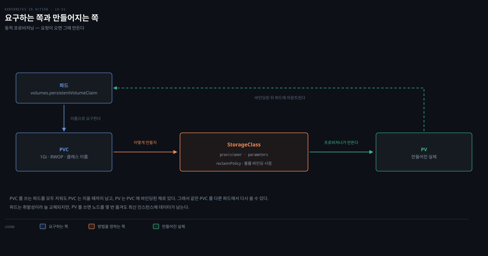
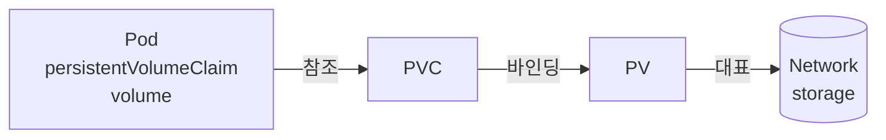

# PV·PVC·StorageClass와 동적 프로비저닝
---
> 개발자는 클러스터가 어떤 스토리지 기술을 쓰는지 몰라도 됩니다. PersistentVolumeClaim으로 "이런 속성의 지속 스토리지가 필요하다"고 선언하면, 클러스터가 맞는 PersistentVolume을 찾거나 새로 만들어 파드에 붙여 줍니다.


> 이 문서를 읽고 나면 PV·PVC·StorageClass 세 오브젝트의 역할과 관계를 그림 없이 설명하고, 동적 프로비저닝으로 quiz Pod에 지속 스토리지를 붙이는 매니페스트를 작성하며, accessMode 4종과 reclaim policy가 볼륨 공유·삭제에 어떻게 작용하는지 진단할 수 있습니다.


## 진입 — 왜 스토리지를 추상화하는가

> 개발자가 파드를 배포할 때 특정 스토리지 볼륨을 직접 가리키지 않습니다. "이런 속성이 필요하다"고 선언하면 클러스터가 맞는 볼륨을 찾거나 만듭니다. 인프라 상세는 클러스터 운영자의 몫입니다.

이 개념은 [09장의 볼륨](./09-01.%EB%B3%BC%EB%A5%A8%20%EC%9D%B4%ED%95%B4%EC%99%80%20emptyDir%EB%A1%9C%20%EB%8D%B0%EC%9D%B4%ED%84%B0%20%EB%B3%B4%EC%A1%B4%ED%95%98%EA%B8%B0.md)에서 이어집니다. 9장은 파드 생애를 넘지 않는 *휘발성* 볼륨(emptyDir 등)을 다뤘고, 이 장은 파드와 무관하게 사는 *지속* 볼륨을 다룹니다. emptyDir는 파드를 지우면 데이터가 사라졌는데, quiz 서비스의 응답은 그러면 안 됩니다.

이상적으로 개발자는 파드를 돌리는 물리 서버의 속성을 몰라도 되듯, 클러스터가 어떤 스토리지 기술을 쓰는지도 몰라야 합니다. 인프라 상세는 클러스터를 운영하는 사람이 관리합니다. 그래서 애플리케이션을 배포할 때 특정 지속 스토리지 볼륨을 직접 참조하지 않습니다. 대신 특정 속성을 가진 지속 스토리지가 필요하다고 명시하면, 클러스터가 그 속성에 맞는 기존 볼륨을 찾거나 새 볼륨을 프로비저닝합니다.

> 이 편은 스토리지 개념의 책만의 관점·예제(quiz Pod·GKE/Kind 실측)에 집중합니다. PV/PVC/StorageClass의 개념 정의는 [스토리지와 상태](../../kubernetes/03_storage/03-01.%EC%8A%A4%ED%86%A0%EB%A6%AC%EC%A7%80%EC%99%80%20%EC%83%81%ED%83%9C.md) 통합 개념본이 더 넓게 다룹니다.


## 1. PV·PVC·StorageClass 세 오브젝트

> 파드는 PVC를 참조하고, PVC는 StorageClass 이름으로 스토리지 종류를 고르며, 클러스터가 맞는 PV를 찾거나 만들어 바인딩합니다. PV가 실제 네트워크 스토리지를 대표합니다.

파드가 지속 스토리지 볼륨이 필요하면 PersistentVolumeClaim(PVC) 오브젝트를 만들어 파드 매니페스트에서 참조합니다. 클러스터는 StorageClass 오브젝트로 대표되는 하나 이상의 스토리지 클래스를 지원하고, PVC에서 원하는 StorageClass를 이름으로 지정합니다. 클러스터는 맞는 PersistentVolume(PV) 오브젝트를 찾거나 새로 만들어 PVC에 바인딩합니다.



세 리소스의 역할을 정리하면 이렇습니다.

1. **PersistentVolume**은 애플리케이션 데이터를 지속하는 스토리지 볼륨을 대표합니다. 밑바탕 스토리지의 프로비저닝은 보통 클러스터에 배포된 CSI(Container Storage Interface) 드라이버가 맡습니다.
2. **PersistentVolumeClaim**은 사용자의 PV에 대한 *청구*를 대표합니다. 생애주기가 파드에 묶이지 않아, PV 소유권을 파드에서 분리합니다. 사용자는 PV를 쓰기 전에 먼저 PVC를 만들어 볼륨을 청구하고, 청구 후에는 독점권을 가집니다. 파드를 언제 지워도 소유권을 잃지 않고, 볼륨이 더 필요 없으면 PVC를 지워 해제합니다.
3. **StorageClass**는 그 클래스의 볼륨을 만드는 프로비저너와 추가 파라미터를 정의합니다. 클래스 이름을 `standard`·`fast`처럼 일관되게 지으면, 클러스터마다 밑바탕 스토리지 기술이 달라도 PVC 매니페스트가 이식성을 가집니다.

> **중요**: PVC 매니페스트는 보통 애플리케이션 개발자가 작성해 파드 등 다른 매니페스트와 함께 묶습니다. PV는 그렇지 않습니다 — 클러스터 운영자의 영역입니다.

### 파드에서 persistentVolumeClaim 볼륨 쓰기

[09장](./09-03.ConfigMap%C2%B7Secret%C2%B7Downward%20API%C2%B7projected%20%EB%B3%BC%EB%A5%A8.md)에서 자세히 다루지 않은 볼륨 타입이 `persistentVolumeClaim`이었습니다. 이 볼륨 정의에는 미리 만든 PVC 오브젝트의 이름을 지정해, 연결된 PV를 파드에 붙입니다. 예를 들어 NFS 파일 공유를 대표하는 PV에 바인딩된 `my-nfs-share` PVC가 있으면, 그 PVC를 참조하는 `persistentVolumeClaim` 볼륨 정의를 추가해 NFS 공유를 파드에 붙입니다. 볼륨 정의에는 NFS 서버 IP 같은 인프라 종속 정보가 필요 없습니다.



파드가 노드에 스케줄되면, 쿠버네티스는 파드가 참조한 PVC에 바인딩된 PV를 찾고, PV 오브젝트의 정보로 네트워크 스토리지 볼륨을 파드 컨테이너에 마운트합니다. 여러 파드가 같은 PVC를 참조해 같은 PV를 공유할 수도 있습니다. 이 파드들이 같은 노드에서 돌아야 하는지, 다른 노드에서도 접근할 수 있는지는 스토리지 기술에 달렸습니다. 여러 노드에 동시 어태치를 지원하면 다른 노드의 파드도 쓸 수 있고, 아니면 모두 최초로 스토리지를 붙인 노드에 스케줄돼야 합니다.


## 2. 동적 vs 정적 프로비저닝

> PV는 동적으로 만들거나 정적으로 미리 만듭니다. 오늘날 대부분 동적 프로비저닝을 쓰고, 정적은 운영자가 로컬 스토리지를 미리 준비하는 시나리오에 유용합니다.

PV는 동적으로 프로비저닝하거나 정적으로 프로비저닝할 수 있습니다. 오늘날 대부분의 클러스터는 필요할 때 볼륨 생성을 자동화하는 동적 프로비저닝을 씁니다. 다만 운영자가 로컬 스토리지를 미리 준비하는 경우처럼 정적 프로비저닝이 유용한 시나리오도 있고, 한 클러스터가 두 방식을 동시에 지원할 수도 있습니다.

**동적 프로비저닝**에서는 볼륨이 요청 시 만들어집니다. 운영자가 CSI 드라이버를 배포해 `CSIDriver` 리소스로 등록하고, 그 드라이버를 참조하는 StorageClass를 만듭니다. 사용자가 PVC를 만들면 프로비저너가 PV 오브젝트를 만들고 밑바탕 스토리지를 프로비저닝합니다. 운영자는 PV나 스토리지를 미리 준비할 필요가 없고, 요청 시 프로비저닝되고 필요 없어지면 자동으로 파괴됩니다.


동적 프로비저닝된 PV의 생애주기는 이렇습니다. 사용자가 PVC를 만든 직후 PV와 밑바탕 스토리지가 프로비저닝됩니다. 여러 파드가 같은 PVC와 PV를 쓸 수 있고, PVC·PV의 생애주기는 파드에 묶이지 않아 참조하는 파드가 없어도 남아 있습니다. PVC 오브젝트를 지우면 PV와 밑바탕 스토리지가 보통 삭제되지만, 필요하면 보존할 수도 있습니다.

**정적 프로비저닝**에서는 운영자가 밑바탕 스토리지 볼륨을 수동으로 준비하고 각각에 대응하는 PV 오브젝트를 만듭니다. 사용자는 PVC를 만들어 이 미리 준비된 PV를 청구합니다. 사용자가 PVC에서 특정 PV를 이름으로 참조하거나, 최소 크기·원하는 access mode 같은 요구사항을 명시하면, 쿠버네티스가 조건에 맞는 사용 가능한 PV를 찾아 바인딩합니다. 바인딩된 PV는 다른 PVC에 바인딩될 수 없습니다. 정적 프로비저닝의 상세는 [10-02편](./10-02.%EC%A0%95%EC%A0%81%20%ED%94%84%EB%A1%9C%EB%B9%84%EC%A0%80%EB%8B%9D%EA%B3%BC%20node-local%20%EB%B3%BC%EB%A5%A8.md)에서 다룹니다.


## 3. 동적으로 PV 프로비저닝하기

> quiz Pod의 emptyDir를 동적 프로비저닝 PV로 바꿉니다. 먼저 PVC를 만드는데, 기본 StorageClass가 있으면 storageClassName 없이도 가장 이식성 있게 만들 수 있습니다.

[09장](./09-01.%EB%B3%BC%EB%A5%A8%20%EC%9D%B4%ED%95%B4%EC%99%80%20emptyDir%EB%A1%9C%20%EB%8D%B0%EC%9D%B4%ED%84%B0%20%EB%B3%B4%EC%A1%B4%ED%95%98%EA%B8%B0.md)의 quiz Pod는 emptyDir 볼륨을 써서, 파드를 지웠다 다시 만들 때마다 데이터가 사라졌습니다. 응답이 지속 저장되도록 quiz Pod를 동적 프로비저닝 PV를 쓰게 고칩니다. 먼저 PVC를 만듭니다.

### PVC 매니페스트 만들기

storageClassName을 명시하지 않으면 매니페스트가 최소한이 되고, 기본 StorageClass를 정의한 모든 클러스터에서 이식성을 가집니다.

```yaml
apiVersion: v1
kind: PersistentVolumeClaim
metadata:
  name: quiz-data
spec:
  resources:
    requests:
      storage: 1Gi          # 볼륨 최소 크기
  accessModes:
  - ReadWriteOncePod        # 원하는 access mode
# storageClassName 미지정 → 기본 StorageClass 사용
```

크기와 access mode만이 PVC의 필수 값이지만, storageClassName 필드가 사실상 가장 중요합니다.

### StorageClass 이름 지정

클러스터가 제공하는 StorageClass는 `kubectl get sc`로 봅니다(sc = storageclass 약어).

```bash
$ kubectl get sc
NAME                     PROVISIONER             RECLAIMPOLICY   VOLUMEBINDINGMODE
premium-rwo              pd.csi.storage.gke.io   Delete          WaitForFirstConsumer
standard                 kubernetes.io/gce-pd    Delete          Immediate
standard-rwo (default)   pd.csi.storage.gke.io   Delete          WaitForFirstConsumer
```

GKE는 세 StorageClass를 제공하고 `standard-rwo`가 기본입니다. Kind로 만든 클러스터는 `standard` 하나(`rancher.io/local-path`)만 제공합니다. PVC에서 StorageClass를 지정하려면 `storageClassName: premium-rwo`처럼 씁니다. 지정하지 않으면 기본 StorageClass가 쓰입니다.

> **주의**: PVC가 없는 StorageClass를 참조하면 청구가 계속 Pending 상태에 머뭅니다. 쿠버네티스가 주기적으로 바인딩을 시도하며 매번 `ProvisioningFailed` 이벤트를 냅니다. `kubectl describe`로 볼 수 있습니다.

### 크기·access mode·volume mode

`resources.requests.storage`는 밑바탕 볼륨의 최소 크기입니다. 동적 프로비저닝은 보통 요청한 크기 그대로 만들고, 정적 프로비저닝은 요청 크기 이상인 PV만 바인딩 후보로 봅니다. access mode는 밑바탕 기술에 따라 여러 노드·파드가 동시에 read/write 또는 read-only로 마운트할 수 있는지를 정합니다.

| Access Mode | 약어 | 설명 |
|-------------|------|------|
| ReadWriteOncePod | RWOP | 클러스터 전체에서 단일 파드가 read/write로 마운트 |
| ReadWriteOnce | RWO | 단일 노드가 read/write로 마운트. 그 노드의 여러 파드는 모두 읽고 쓸 수 있음 |
| ReadWriteMany | RWX | 여러 워커 노드가 동시에 read/write로 마운트 |
| ReadOnlyMany | ROX | 여러 워커 노드가 동시에 read-only로 마운트 |

> `ReadOnlyOnce`는 없습니다. RWO 볼륨을 쓰기가 필요 없는 파드에 쓸 때는 read-only 모드로 마운트하면 됩니다.

volume mode는 밑바탕 볼륨을 파일시스템으로 포맷할지, 포맷 없이 raw 블록 장치로 쓸지를 정합니다.

| Volume Mode | 설명 |
|-------------|------|
| Filesystem | 컨테이너 파일 트리의 디렉터리에 마운트. 기본값 |
| Block | 파일시스템 없이 raw 블록 장치로 애플리케이션에 제공. 데이터베이스 같은 특수 애플리케이션이 파일시스템 오버헤드 없이 읽고 씀 |

quiz Pod는 볼륨을 읽고 쓰며 한 인스턴스만 돌리므로 `ReadWriteOncePod`를 요청하고, volumeMode를 지정하지 않아 기본 Filesystem으로 씁니다.

### PVC 만들고 상태 확인하기

`kubectl apply`로 PVC를 만들고 `kubectl get pvc`로 상태를 봅니다(pvc = persistentvolumeclaim 약어).

```bash
$ kubectl get pvc
NAME         STATUS    STORAGECLASS   AGE
quiz-data    Pending   standard-rwo   20s
```

STATUS와 STORAGECLASS를 봅니다. 세 가지가 가능합니다.

1. STATUS가 `Bound`면 PVC가 PV에 바인딩됐습니다.
2. STATUS가 `Pending`이고 STORAGECLASS가 비어 있지 않으면, 아직 바인딩 안 됐지만 클러스터가 기본 StorageClass를 제공합니다.
3. STATUS가 `Pending`이고 STORAGECLASS가 비어 있으면, 클러스터에 기본 StorageClass가 없습니다. 기본 StorageClass를 제공하는 다른 클러스터를 써야 합니다.

바로 바인딩되는 클러스터와 안 되는 클러스터가 갈리는 이유는 StorageClass마다 volume binding mode가 다르기 때문입니다. 일부는 즉시 PV를 프로비저닝하고, 일부는 PVC를 쓰는 첫 파드가 스케줄될 때까지 기다립니다.


## 4. PVC를 파드에서 쓰기

> PVC는 독립 오브젝트라, persistentVolumeClaim 볼륨으로 파드에 붙입니다. 첫 파드가 스케줄되면 그제야 PV가 프로비저닝·바인딩되는 경우가 많습니다.

파드에서 PV를 쓰려면 PVC 오브젝트를 참조하는 `persistentVolumeClaim` 볼륨을 정의합니다. quiz Pod를 앞에서 만든 `quiz-data` PVC를 쓰게 고칩니다.

```yaml
apiVersion: v1
kind: Pod
metadata:
  name: quiz
spec:
  volumes:
  - name: quiz-data
    persistentVolumeClaim:      # PVC 참조 — claimName 만 지정하면 끝
      claimName: quiz-data
  containers:
  - name: quiz-api
    image: luksa/quiz-api:0.1
    ports:
    - name: http
      containerPort: 8080
  - name: mongo
    image: mongo
    volumeMounts:               # 다른 볼륨 타입과 똑같이 마운트
    - name: quiz-data
      mountPath: /data/db
```

PVC 볼륨 추가는 간단합니다. `claimName`에 PVC 이름만 지정하면 끝이고, 나머지는 모든 마운트를 read-only로 강제하는 `readOnly` 필드뿐입니다. 파드를 만들면 앞의 PVC가 마침내 PV에 바인딩됩니다.

```bash
$ kubectl get pvc quiz-data
NAME        STATUS   VOLUME            CAPACITY   ACCESS MODES
quiz-data   Bound    pvc-5d9b8a8b-...  1Gi        RWOP

# PV는 요청 시(on demand) 만들어졌고 속성이 PVC·SC 요구와 일치
$ kubectl get pv
NAME              CAPACITY   ACCESS MODES   RECLAIM POLICY   STATUS   CLAIM
pvc-5d9b8a8b-...  1Gi        RWOP           Delete           Bound    default/quiz-data
```

PV가 요청 시 만들어졌고 용량 1Gi·access mode RWOP가 PVC 요구와 정확히 일치합니다. 이제 볼륨이 파드 호스트 노드에 붙어 `mongo` 컨테이너에 마운트됩니다.

### PVC 재사용과 detach

PVC를 통해 PV를 쓰는 파드를 지우면, 그 노드에서 그 볼륨을 쓰는 마지막 파드였을 경우 밑바탕 스토리지가 노드에서 detach됩니다. PVC를 쓰는 파드를 모두 지워도 PVC는 지울 때까지 남고, PV는 PVC에 바인딩된 채로 있습니다. 그래서 같은 PVC를 다른 파드에서 다시 쓸 수 있습니다. 파드는 휘발성이라 늘 교체되지만, quiz Pod가 이제 PV를 써서 노드를 몇 번 옮겨도 최신 인스턴스에 데이터가 유지됩니다.


## 5. PVC·PV 삭제와 reclaim policy

> PVC를 지우면 바인딩된 PV가 Released 상태가 됩니다. 그다음 무슨 일이 일어나는지는 PV의 reclaim policy가 정합니다 — Retain·Delete·Recycle.

파드와 PVC를 지운 뒤 PV 상태를 보면 `Available`이 아니라 `Released`입니다.

```bash
$ kubectl delete pod quiz && kubectl delete pvc quiz-data
$ kubectl get pv
NAME        RECLAIM POLICY   STATUS     CLAIM
pvc-...     Delete           Released   default/quiz-data
```

PV가 해제될 때 무슨 일이 일어나는지는 PV의 reclaim policy가 정합니다. PV 오브젝트 spec의 `persistentVolumeReclaimPolicy` 또는 StorageClass의 `reclaimPolicy`로 설정합니다.

| Reclaim policy | 설명 |
|----------------|------|
| Retain | 청구를 지워 PV가 해제돼도 볼륨을 보존. 운영자가 수동으로 회수. 수동 생성 PV의 기본값 |
| Delete | 해제 시 PV 오브젝트와 밑바탕 스토리지를 자동 삭제. 동적 프로비저닝 PV의 기본값 |
| Recycle | 폐기 예정 — 밑바탕 플러그인이 지원 안 할 수 있어 쓰지 않음 |

> **팁**: 기존 PV의 reclaim policy는 언제든 바꿀 수 있습니다. `Delete`인데 청구 삭제 시 데이터를 잃고 싶지 않으면, 삭제 전에 `Retain`으로 바꿉니다.

> **경고**: PV가 Released인 상태에서 reclaim policy를 Retain에서 Delete로 바꾸면 PV 오브젝트와 밑바탕 스토리지가 삭제됩니다.


## 6. access mode 심화 — 노드냐 파드냐

> RWOP는 파드 하나, RWO는 노드 하나가 볼륨을 붙입니다. RWO에서 다른 노드의 파드가 같은 볼륨을 붙이려 하면 Multi-Attach 에러로 Pending에 걸립니다.

**ReadWriteOncePod(RWOP)**: quiz Pod의 PV는 RWOP라 한 번에 한 파드만 씁니다. 같은 PVC를 쓰는 둘째 파드를 돌리면 그 파드는 Pending에 머뭅니다. RWOP는 다른 access mode와 달리 여러 파드의 동시 사용을 허용하지 않기 때문입니다.

**ReadWriteOnce(RWO)**: RWOP와 비슷해 보이지만, 파드가 아니라 *노드* 하나가 볼륨을 붙입니다. 같은 노드의 여러 파드는 볼륨을 쓸 수 있습니다. `generateName`으로 여러 파드를 만들어 여러 노드에 흩뿌리면, 첫 노드의 파드는 모두 정상 실행되고 다른 노드의 파드는 `ContainerCreating`에 걸립니다.

```bash
$ kubectl get pods -l app=demo-read-write-once -o wide
NAME                         READY   STATUS              NODE
demo-read-write-once-4ltgn   1/1     Running             node-36xk   # 같은 노드 — 정상
demo-read-write-once-8msr4   1/1     Running             node-36xk
demo-read-write-once-w8wkj   0/1     ContainerCreating   node-334g   # 다른 노드 — 붙일 수 없음
```

`kubectl describe`로 걸린 파드의 이벤트를 보면 볼륨을 노드에 붙일 수 없다는 것이 드러납니다.

```
Warning  FailedAttachVolume  ...  Multi-Attach error for volume "pvc-..."
                                  Volume is already used by pod(s) demo-read-write-once-8msr4, ...
```

볼륨이 첫 노드에 이미 read-write로 붙어서입니다. RWO는 단일 노드만 read-write로 붙일 수 있어, 둘째 노드가 같은 시도를 하면 실패합니다.

> **주의**: `generateName`을 쓰는 매니페스트는 `kubectl apply` 대신 `kubectl create`를 써야 합니다. 파드 이름이 없어서입니다.

**ReadWriteMany(RWX)**: 여러 노드에 동시 어태치하고도 read/write가 됩니다. 다만 모든 스토리지 기술이 지원하지는 않습니다. GKE 기본 StorageClass는 RWX를 지원하지 않지만 `GcpFilestoreCsiDriver`를 켜면 지원하는 StorageClass가 생깁니다.

**ReadOnlyMany(ROX)**와 PVC 복제: ROX는 동적 프로비저닝에서 조금 다릅니다. 새 PV는 비어 있어 read-only로 쓰려면 미리 채워야 합니다. 쿠버네티스는 PVC에 data source를 정의하게 해, PV가 프로비저닝될 때 그 소스로 초기화한 뒤 마운트합니다. 다른 PVC(정확히는 연결된 PV)를 소스로 쓰는 예는 이렇습니다.

```yaml
apiVersion: v1
kind: PersistentVolumeClaim
metadata:
  name: demo-read-only-many
spec:
  resources:
    requests:
      storage: 1Gi
  accessModes:
  - ReadOnlyMany
  dataSourceRef:                     # 다른 PVC를 소스로 → PV 초기화
    kind: PersistentVolumeClaim
    name: demo-read-write-once
```

`dataSourceRef`에 소스 오브젝트의 kind·name만 지정하면 됩니다. 이 방식으로 access mode와 무관하게 어떤 PV든 새 PV로 복제할 수 있습니다.

> **주의**: `dataSourceRef`와 비슷한 `dataSource` 필드도 있지만 향후 폐기 예정입니다.


## 7. StorageClass와 CSI 드라이버

> StorageClass는 프로비저너와 파라미터를 정하고, volumeBindingMode로 PV를 언제 바인딩할지 정합니다. 실제 프로비저닝은 CSI 드라이버가 맡습니다.

storageClassName은 PVC에서 사실상 가장 중요한 속성으로, 어떤 지속 스토리지 클래스를 프로비저닝할지 정합니다. 각 StorageClass는 어떤 프로비저너를 쓰고 볼륨 프로비저닝 시 어떤 파라미터를 넘길지 지정합니다. GKE 기본 StorageClass의 YAML을 보면 이렇습니다.

```yaml
apiVersion: storage.k8s.io/v1
kind: StorageClass
metadata:
  name: standard-rwo
  annotations:
    storageclass.kubernetes.io/is-default-class: "true"   # 기본 클래스 표시
parameters:
  type: pd-balanced                       # 프로비저너에 넘길 파라미터
provisioner: pd.csi.storage.gke.io        # PV 프로비저닝을 호출할 프로비저너
reclaimPolicy: Delete
volumeBindingMode: WaitForFirstConsumer   # PV를 언제 프로비저닝·바인딩할지
```

> StorageClass는 spec·status 섹션이 없습니다. 정적 정보만 담아서입니다. 필드가 두 섹션으로 나뉘지 않고 알파벳 순으로 표시돼, apiVersion·kind·metadata 위에 필드가 올 수 있으니 놓치지 않도록 합니다.

같은 프로비저너를 쓰는 StorageClass라도 파라미터가 다르면 다른 종류의 스토리지를 제공합니다. `volumeBindingMode`는 PV를 언제 바인딩할지 정합니다.

| Volume binding mode | 설명 |
|---------------------|------|
| Immediate | PVC 생성 직후 PV를 프로비저닝·바인딩. 청구의 소비자를 아직 모르므로 어느 노드에서든 접근 가능한 볼륨에만 적합 |
| WaitForFirstConsumer | PVC를 참조하는 첫 파드가 생성될 때 PV를 프로비저닝·바인딩. 요즘 많은 StorageClass가 이 모드 |

### CSI 드라이버

과거에는 쿠버네티스 코드베이스가 여러 스토리지 기술을 직접 지원했지만, 대부분이 "out-of-tree"로 옮겨져 여러 CSI 드라이버로 존재합니다. 덕분에 쿠버네티스 코드·API를 바꾸지 않고 새 스토리지 기술을 추가할 수 있습니다. 각 CSI 드라이버는 보통 두 컴포넌트로 이뤄집니다 — PV를 동적 프로비저닝하는 컨트롤러와, 모든 노드에서 돌며 스토리지 볼륨을 노드에 붙이고 떼는 노드 레벨 에이전트입니다.

설치된 CSI 드라이버는 `CSIDriver` 리소스로 대표돼 `kubectl get csidrivers`로 봅니다. 이름이 StorageClass의 provisioner 필드 값과 일치합니다. `CSIDriver` 오브젝트는 보통 수동으로 만들지 않고, 드라이버 설치 과정에서 자동 생성됩니다. 노드 레벨 파드는 보통 `kube-system` 네임스페이스에 있고, GKE에서는 노드마다 `pdcsi-node-xyz` 파드가 있습니다.


## 면접에서 받을 만한 질문

1. 개발자가 파드에서 특정 스토리지 볼륨을 직접 참조하지 않고 PVC를 쓰는 이유는 무엇입니까?
2. RWOP·RWO·RWX·ROX 네 access mode는 무엇이 다릅니까? "노드"와 "파드"의 구분이 왜 중요합니까?
3. RWO 볼륨을 쓰는 파드가 여러 노드에 흩어질 때 무슨 일이 일어납니까? 왜 그렇습니까?
4. reclaim policy Retain·Delete는 PVC를 지울 때 각각 어떻게 동작합니까? 동적/정적 프로비저닝의 기본값은 무엇입니까?
5. volumeBindingMode의 Immediate와 WaitForFirstConsumer는 무엇이 다르고, 각각 언제 적합합니까?

> 5개 질문에 *먼저 스스로 답해 보세요.* 자답이 끝나면 아래 §정답으로 내려갑니다. 자답 없이 먼저 읽으면 학습 효과가 0입니다.


## 정답 (자답 후 펼치기)

> 위 §면접에서 받을 만한 질문의 5개에 *먼저 자답한 뒤* 아래를 읽으세요.

### 정답 1 — PVC로 추상화하는 이유

개발자는 파드를 돌리는 물리 서버 속성을 몰라도 되듯, 클러스터가 어떤 스토리지 기술을 쓰는지도 몰라야 하기 때문입니다. PVC로 "이런 속성(크기·access mode·StorageClass)이 필요하다"고 선언하면, 클러스터가 맞는 PV를 찾거나 새로 만들어 붙여 줍니다. 인프라 상세(NFS 서버 IP 등)는 PV·StorageClass에 담겨 운영자가 관리하므로, PVC 매니페스트는 클러스터 간 이식성을 가집니다. 또 PVC 생애주기가 파드와 분리돼, 파드를 지워도 볼륨 소유권을 잃지 않습니다.

### 정답 2 — 네 access mode와 노드/파드 구분

RWOP는 클러스터 전체에서 *단일 파드*만, RWO는 *단일 노드*(그 노드의 여러 파드 허용)가, RWX는 *여러 노드*가 read/write로, ROX는 *여러 노드*가 read-only로 붙입니다. "노드냐 파드냐" 구분이 중요한 이유는 RWO에서 흔한 오해 때문입니다 — RWO는 파드 하나가 아니라 노드 하나 제한이라, 같은 노드의 여러 파드는 동시에 쓸 수 있지만 다른 노드의 파드는 못 씁니다. 진짜 단일 파드 제한은 RWOP입니다.

### 정답 3 — RWO 볼륨과 멀티노드

첫 노드의 파드들은 모두 정상 실행되지만, 다른 노드에 스케줄된 파드는 `ContainerCreating`에 걸려 `Multi-Attach error`가 납니다. RWO는 단일 노드만 read-write로 볼륨을 붙일 수 있어서입니다. 볼륨이 첫 노드에 이미 붙어 있으면 둘째 노드의 어태치 시도가 실패합니다. 여러 노드에서 쓰려면 RWX를 지원하는 스토리지가 필요합니다.

### 정답 4 — reclaim policy 동작과 기본값

`Retain`은 PVC를 지워 PV가 해제돼도 볼륨을 보존하고 운영자가 수동 회수합니다(수동 생성 PV의 기본값). `Delete`는 해제 시 PV 오브젝트와 밑바탕 스토리지를 자동 삭제합니다(동적 프로비저닝 PV의 기본값). 그래서 동적 프로비저닝에서 PVC를 지우면 보통 데이터까지 사라지고, 이를 막으려면 삭제 전 policy를 Retain으로 바꿔야 합니다.

### 정답 5 — volumeBindingMode 두 모드

`Immediate`는 PVC 생성 직후 PV를 프로비저닝·바인딩합니다. 소비자(파드)가 아직 정해지지 않은 시점이라, 어느 노드에서든 접근 가능한 볼륨에만 적합합니다. `WaitForFirstConsumer`는 PVC를 참조하는 첫 파드가 스케줄될 때까지 바인딩을 미룹니다. 노드에 종속된 볼륨(로컬 스토리지 등)은 파드가 어느 노드에 갈지 정해진 뒤 바인딩해야 하므로 이 모드가 맞습니다.


## 관련 문서

> 이 편은 09장의 휘발성 볼륨에서 지속 스토리지로 넘어오며, 정적 프로비저닝(10-02)과 개념 통합본으로 이어집니다.

- [09-01. 볼륨 이해와 emptyDir로 데이터 보존하기](./09-01.%EB%B3%BC%EB%A5%A8%20%EC%9D%B4%ED%95%B4%EC%99%80%20emptyDir%EB%A1%9C%20%EB%8D%B0%EC%9D%B4%ED%84%B0%20%EB%B3%B4%EC%A1%B4%ED%95%98%EA%B8%B0.md) § "emptyDir 생애주기" — 파드 삭제 시 사라지는 휘발성과 대비되는 지속성
- [09-03. ConfigMap·Secret·Downward API·projected 볼륨](./09-03.ConfigMap%C2%B7Secret%C2%B7Downward%20API%C2%B7projected%20%EB%B3%BC%EB%A5%A8.md) — 미뤄 뒀던 persistentVolumeClaim 볼륨 타입의 상세
- [10-02. 정적 프로비저닝과 node-local 볼륨](./10-02.%EC%A0%95%EC%A0%81%20%ED%94%84%EB%A1%9C%EB%B9%84%EC%A0%80%EB%8B%9D%EA%B3%BC%20node-local%20%EB%B3%BC%EB%A5%A8.md) — 운영자가 PV를 미리 만드는 반대 방식
- [08_cloud/kubernetes — 스토리지와 상태](../../kubernetes/03_storage/03-01.%EC%8A%A4%ED%86%A0%EB%A6%AC%EC%A7%80%EC%99%80%20%EC%83%81%ED%83%9C.md) — PV/PVC/StorageClass/StatefulSet의 책-비종속 통합 개념본
- [Kubernetes 공식 문서 — Persistent Volumes](https://kubernetes.io/docs/concepts/storage/persistent-volumes/) — PV·PVC·access mode·reclaim policy의 1차 레퍼런스
