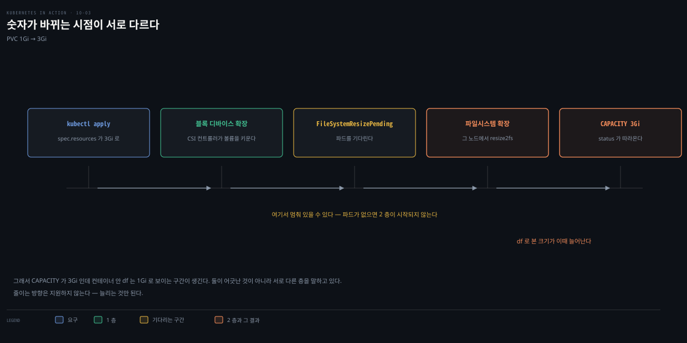
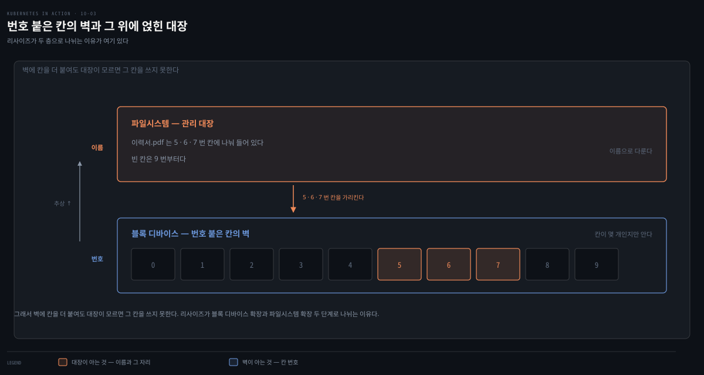
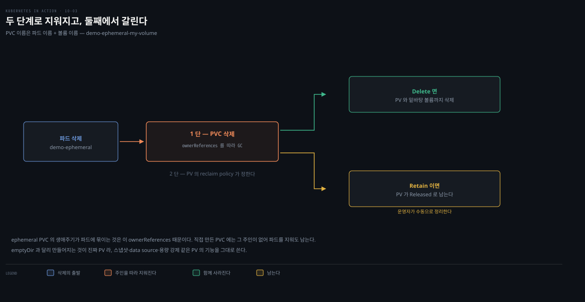
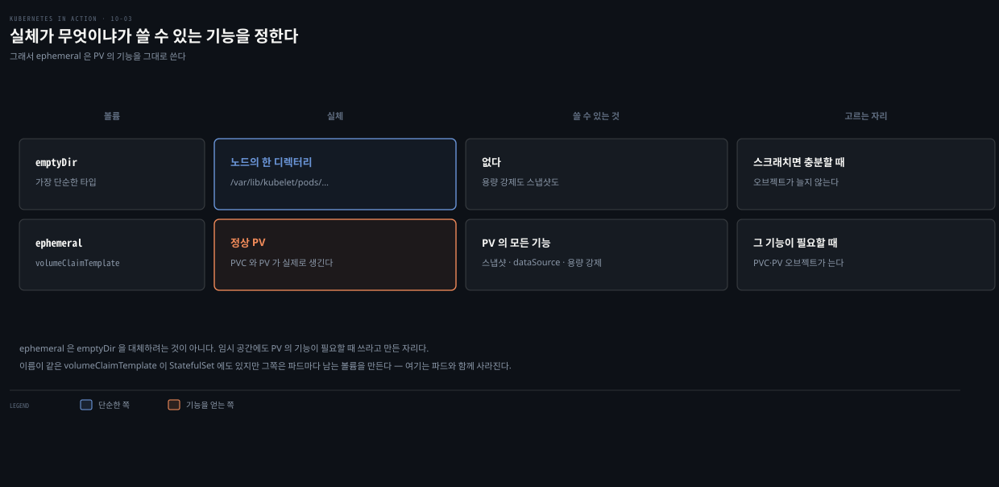

# PV 관리 — 리사이즈·스냅샷·ephemeral
---
> **PVC는 크기만 나중에 키울 수 있고, 그마저 파드를 재시작해야 파일시스템 리사이즈가 끝납니다.** VolumeSnapshot으로 볼륨을 백업·복제하고, ephemeral 볼륨으로 파드 전용 PV를 자동 생성·삭제할 수 있습니다.


> 이 문서를 읽고 나면 PVC 리사이즈가 파드 재시작을 요구하는 이유를 진단하고, VolumeSnapshot·VolumeSnapshotClass·VolumeSnapshotContent 세 오브젝트의 관계를 PVC·PV에 빗대어 설명하며, ephemeral 볼륨이 emptyDir보다 나은 점을 근거와 함께 말할 수 있습니다.


## 진입 — PV를 만든 뒤에 하는 일

> 앞 편들이 PV를 프로비저닝·바인딩하는 법이었다면, 이 편은 이미 있는 PV를 *관리*하는 법입니다 — 크기를 키우고, 스냅샷으로 백업·복제하고, 파드 전용 임시 PV를 만드는 것입니다.

[10-01](./10-01.PV%C2%B7PVC%C2%B7StorageClass%EC%99%80%20%EB%8F%99%EC%A0%81%20%ED%94%84%EB%A1%9C%EB%B9%84%EC%A0%80%EB%8B%9D.md)·[10-02](./10-02.%EC%A0%95%EC%A0%81%20%ED%94%84%EB%A1%9C%EB%B9%84%EC%A0%80%EB%8B%9D%EA%B3%BC%20node-local%20%EB%B3%BC%EB%A5%A8.md)에서 스토리지를 정적·동적으로 프로비저닝해 파드에 붙이는 법과, 기존 PVC를 `dataSourceRef`로 참조해 볼륨을 복제하는 법을 배웠습니다. 이 편은 복제 없이 기존 PV를 리사이즈하고, 스냅샷을 만들고, 스냅샷에서 새 PV를 만드는 법을 다룹니다.


## 1. PVC 리사이즈

> PVC의 spec은 대부분 생성 후 불변이지만, 크기(resources.requests)는 바인딩 후에도 키울 수 있습니다. 다만 파일시스템 리사이즈를 끝내려면 파드를 재시작해야 합니다.

사용자는 PVC와 StorageClass로 볼륨을 self-provision하지만, 나중에 다른 StorageClass로 바꾸려면 새 PVC를 만들어야 합니다. 쿠버네티스는 PVC의 storageClassName 수정을 지원하지 않고, 시도하면 이런 에러가 납니다.

```
* spec: Forbidden: spec is immutable after creation except
  resources.requests and volumeAttributesClassName for bound claims
```

PVC spec의 대부분 필드는 불변이지만, 볼륨 크기를 정하는 `spec.resources.requests`는 바인딩 후에도 수정할 수 있습니다. 앞의 MongoDB 예제에서 1 GiB를 요청했는데, DB가 커져 공간이 부족해졌다고 상상해 봅니다.

리사이즈 가능 여부는 StorageClass의 `ALLOWVOLUMEEXPANSION` 컬럼(`allowVolumeExpansion`)이 정합니다. 기존 `quiz-data` PVC의 크기를 10Gi로 늘립니다.

```yaml
apiVersion: v1
kind: PersistentVolumeClaim
metadata:
  name: quiz-data          # 기존 청구 이름과 일치해야 함
spec:
  resources:
    requests:
      storage: 10Gi        # 더 큰 용량 요청(줄이는 것은 불가)
  accessModes:
    - ReadWriteOncePod
```

> **주의**: 볼륨 크기는 키울 수만 있고 줄일 수 없습니다.

`kubectl apply`하면 StorageClass가 확장을 지원할 경우 기존 PVC가 갱신됩니다. 그런데 `kubectl get pvc`로 확인하면 CAPACITY가 여전히 1Gi입니다.

```bash
$ kubectl get pvc quiz-data

NAME        STATUS   VOLUME         CAPACITY   ACCESS MODES
quiz-data   Bound    pvc-ed36b...   1Gi        RWO           # 아직 1Gi
```

CAPACITY는 청구가 요청한 크기가 아니라 바인딩된 볼륨의 크기를 보여 줍니다. 크기가 안 바뀐 이유를 `kubectl describe`로 보면 conditions에 드러납니다.

```
Conditions:
  Type                      Status  Message
  ----                      ------  -------
  FileSystemResizePending   True    Waiting for user to (re-)start a pod to
                                    finish file system resize of volume on node.
```

PV를 리사이즈하려면 PVC를 쓰는 파드를 지우고 다시 만들어야 합니다. 그러면 청구와 볼륨이 새 크기(10Gi)로 표시됩니다.

### 왜 파드를 재시작해야 끝나는가 — 2층 확장

리사이즈가 파드 재시작을 요구하는 이유는 스토리지가 두 층으로 나뉘어 있기 때문입니다. 두 층의 확장 시점이 서로 다릅니다. 아래 층인 **블록 디바이스**는 CSI 컨트롤러가 파드와 무관하게 즉시 키웁니다. 반면 그 위 **파일시스템**은 자기 메타데이터에 옛 크기를 기록 중이라 디바이스가 커진 것을 스스로 모릅니다. `resize2fs`(ext4)·`xfs_growfs`(xfs)로 "너 커졌다"를 알려 줘야 하는데, 이 파일시스템 확장은 kubelet이 볼륨을 다시 마운트하는 시점에 트리거됩니다.

재마운트 경계에서 하는 이유는 안전 때문입니다. 이미 마운트돼 파드가 읽고 쓰는 볼륨에 끼어들어 확장하는 것보다, 언마운트 → 재마운트 경계에서 처리하는 편이 데이터 정합성 위험이 없습니다. 그래서 파드를 지우고 다시 만들면 재마운트가 일어나고, 그때 파일시스템 확장이 완료돼 `FileSystemResizePending` 조건이 풀리며 CAPACITY가 갱신됩니다.


시간 순서로 보면 이 다섯 단계입니다.



### 먼저 — 블록 디바이스와 파일시스템이 뭔지

두 층을 이해하려면 그 둘이 애초에 무엇인지부터 잡아야 합니다.

**블록 디바이스**는 디스크(SSD·HDD·클라우드 디스크)를 똑같은 크기의 칸으로 잘라 번호를 매긴 것입니다. 칸 하나가 *블록*(보통 512바이트나 4KB)입니다. 각 칸에 0번, 1번, 2번… 주소가 붙습니다. **번호 매긴 사물함 벽**을 떠올리면 됩니다 — 아는 명령은 딱 둘, "N번 칸에 써"와 "N번 칸 읽어"뿐입니다. 블록 디바이스는 "파일"이라는 개념을 *모릅니다*. "사진.jpg가 어디 있어?"에는 답할 수 없습니다. 오직 번호 매긴 칸만 압니다. 리눅스에서는 `/dev/sda`, `/dev/nvme0n1` 같은 이름으로 보입니다. 클라우드 디스크·LVM 논리 볼륨이 이 사물함 벽을 제공합니다.

**파일시스템**은 그 사물함 벽 위에 얹은 **관리 대장**입니다. 사람은 "3번 칸"이 아니라 "이력서.pdf"라는 이름으로 데이터를 다루는데, 그 간극을 파일시스템이 메웁니다. 대장에는 "이력서.pdf는 5·6·7번 칸에 나눠 들어 있다", "빈 칸은 9번부터다", "이 벽의 전체 크기는 100칸이다"가 적혀 있습니다. `ext4`·`xfs`가 이 대장을 관리하는 방식(파일시스템 종류)입니다. 파일을 만든다는 건 대장에서 빈 칸을 찾아 데이터를 쓰고 "이 파일 = 이 번호들"을 기록하는 일이고, 읽을 때는 대장을 보고 해당 칸들을 열어 이어 붙입니다.



이 비유는 "칸 ↔ 파일 매핑·전체 크기 기록" 구조까지 유효합니다. 저널링·inode·단편화 같은 파일시스템 내부 최적화는 사물함 비유로는 표현되지 않으니, 딱 이 구조까지만 빌려 씁니다.

### 두 층은 택일이 아니라 겹쳐 쓰는 스택

이제 두 층이 왜 따로 노는지 자연스럽게 이어집니다. A층과 B층은 *둘 중 하나를 고르는 게* 아니라 **항상 위아래로 겹쳐 함께 쓰입니다**. 아래 층(블록 디바이스)이 *땅*이라면, 위 층(파일시스템)은 그 땅 위에 그린 *지도*입니다. 땅이 없으면 지도가 그릴 대상이 없고, 지도가 없으면 파일·디렉터리 개념이 없어 바이트만 있는 빈 공간입니다.

그래서 A층과 B층에서 고르는 것은 *서로 다른 축의 선택지*입니다.

- **A층 = 무엇으로 땅을 만들었나**: 클라우드 디스크(GCP PD·AWS EBS)냐, 온프렘 LVM 논리 볼륨이냐. 둘 다 "블록 디바이스"를 제공하는 방식일 뿐이라 같은 A층입니다. 쿠버네티스는 CSI 드라이버로 어느 쪽이든 "블록 디바이스 확장"으로 추상화합니다.
- **B층 = 무엇으로 포맷했나**: ext4냐 xfs냐. 둘 다 리눅스 파일시스템이고 역할이 같아 같은 B층입니다. 확장 명령만 다릅니다 — ext4는 `resize2fs`, xfs는 `xfs_growfs`.

정리하면, "클라우드 디스크 vs LVM"은 *A층 안의* 선택이고 "ext4 vs xfs"는 *B층 안의* 선택이라, 예컨대 `클라우드 디스크 + xfs` 조합처럼 두 축을 각각 골라 겹쳐 씁니다. 리사이즈가 2단계인 이유도 여기서 나옵니다 — 두 층이 별개라 각자 확장돼야 하고, B층이 갱신되기 전까지는 넓어진 땅을 파일시스템이 못 씁니다.

리사이즈는 새 크기를 지정하고 파드를 재시작하면 끝나는 작업입니다. 온라인 확장을 지원하는 CSI 드라이버는 재시작 없이 파일시스템 확장까지 끝내기도 하지만, local-path 같은 기본 경로는 위 오프라인 흐름을 따릅니다.


## 2. VolumeSnapshot으로 스냅샷 만들기

> **밑바탕 CSI 드라이버가 지원하면 PV의 스냅샷을 만들 수 있습니다.** 
>
> VolumeSnapshot 오브젝트가 스냅샷을 *요청*하고, VolumeSnapshotClass가 드라이버·파라미터를 정합니다.

백업·복제를 위해, CSI 드라이버가 지원하면 PV의 스냅샷을 만들 수 있습니다. VolumeSnapshot 오브젝트를 만들어 소스로 쓸 PV의 PVC를 가리킵니다. 먼저 VolumeSnapshotClass가 필요합니다.

VolumeSnapshotClass는 StorageClass처럼 스냅샷을 만들 때 CSI 드라이버가 쓸 드라이버·파라미터를 지정합니다.

```yaml
apiVersion: snapshot.storage.k8s.io/v1
kind: VolumeSnapshotClass
metadata:
  name: pd-csi
driver: pd.csi.storage.gke.io     # 스냅샷을 만들 CSI 드라이버
deletionPolicy: Delete            # VolumeSnapshot 삭제 시 VSC도 자동 삭제
```

그다음 VolumeSnapshot 오브젝트로 스냅샷을 요청합니다.

```yaml
apiVersion: snapshot.storage.k8s.io/v1
kind: VolumeSnapshot
metadata:
  name: quiz-data-1
spec:
  volumeSnapshotClassName: pd-csi           # 원하는 스냅샷 클래스
  source:
    persistentVolumeClaimName: quiz-data    # quiz-data PVC 에서 스냅샷 생성
```

VolumeSnapshot은 VolumeSnapshotClass 이름과 소스 PVC 이름을, 또는 기존 VolumeSnapshotContent 이름을 지정합니다. 만든 뒤 상태를 보면 처음엔 아직 준비 중입니다.

```bash
$ kubectl get vs                     # vs = volumesnapshot 약어
NAME          READYTOUSE   SOURCEPVC   RESTORESIZE   SNAPSHOTCONTENT
quiz-data-1   false        quiz-data                 snapcontent-36356...

# 잠시 후 완료
$ kubectl get vs
NAME          READYTOUSE   RESTORESIZE   CREATIONTIME   AGE
quiz-data-1   true         10Gi          63s            66s
```

READYTOUSE가 true가 되고 RESTORESIZE에 스냅샷 크기가 표시됩니다. CREATIONTIME은 실제 스냅샷이 만들어진 시점, AGE는 VolumeSnapshot 요청 오브젝트가 만들어진 시점입니다.

### VolumeSnapshot과 VolumeSnapshotContent

VolumeSnapshot은 스냅샷 *요청*을 대표하고, 실제 스냅샷은 VolumeSnapshotContent 오브젝트가 대표합니다. 이는 PVC가 스토리지 요청을, PV가 실제 스토리지를 대표하는 것과 같은 구조입니다.


- VolumeSnapshot은 PVC처럼 *네임스페이스* 오브젝트이고, VolumeSnapshotContent와 PV는 *클러스터 범위* 오브젝트라 운영자가 관리합니다. 
- 운영자는 `kubectl get vsc`로 VolumeSnapshotContent를 나열합니다(vsc = volumesnapshotcontent 약어). VolumeSnapshot 하나는 VolumeSnapshotContent 하나와 연결되고, 스냅샷을 또 만들려면 새 VolumeSnapshot을 만들어 새 VolumeSnapshotContent를 얻습니다.


## 3. 스냅샷에서 PV 복원

> 스냅샷에서 PVC를 복원하는 것은 다른 PVC에서 복원하는 것과 거의 같습니다. dataSourceRef에 PVC 대신 VolumeSnapshot을 지정하되, apiGroup을 반드시 명시합니다.

VolumeSnapshot과 VolumeSnapshotContent가 있으면 스냅샷에서 PVC를 복원할 수 있습니다. [10-01편](./10-01.PV%C2%B7PVC%C2%B7StorageClass%EC%99%80%20%EB%8F%99%EC%A0%81%20%ED%94%84%EB%A1%9C%EB%B9%84%EC%A0%80%EB%8B%9D.md)에서 PVC를 다른 PVC로 초기화한 것과 비슷하고, data source로 PVC 대신 VolumeSnapshot을 지정할 뿐입니다.

```yaml
apiVersion: v1
kind: PersistentVolumeClaim
metadata:
  name: quiz-data-from-snapshot
spec:
  resources:
    requests:
      storage: 1Gi
  accessModes:
  - ReadWriteOncePod
  dataSourceRef:                           # quiz-data-1 스냅샷에서 초기화
    apiGroup: snapshot.storage.k8s.io      # 스냅샷은 apiGroup 필수
    kind: VolumeSnapshot
    name: quiz-data-1
```

> **중요**: PVC의 `dataSourceRef`에서 VolumeSnapshot을 참조할 때는 `snapshot.storage.k8s.io`를 apiGroup으로 반드시 지정합니다. PVC를 소스로 쓸 때는 apiGroup을 생략할 수 있는 것과 다릅니다.

storageClassName을 지정하지 않으면 기본 StorageClass가 쓰입니다. 그 클래스가 `WaitForFirstConsumer`면 복원을 시작하려면 파드도 만들어야 합니다.


## 4. 파드 전용 ephemeral 볼륨

> 이 장은 파드와 무관하게 사는 지속 스토리지가 초점이었는데, ephemeral 볼륨은 이름대로 파드 생애에 묶인 PV를 만듭니다. volumeClaimTemplate으로 파드 전용 PVC를 자동 생성합니다.

이 장은 특정 파드에 묶이지 않고 독립된 생애주기를 갖는 지속 스토리지가 초점이었습니다. `PersistentVolume`이라는 이름도 지속을 함의하므로, ephemeral PersistentVolume은 조금 뜻밖입니다. ephemeral 볼륨 타입은 [10-01편](./10-01.PV%C2%B7PVC%C2%B7StorageClass%EC%99%80%20%EB%8F%99%EC%A0%81%20%ED%94%84%EB%A1%9C%EB%B9%84%EC%A0%80%EB%8B%9D.md)의 `persistentVolumeClaim` 타입과 비슷하되, 이름대로 파드용 임시 볼륨을 만듭니다.

쿠버네티스에는 "파드에 잠깐 붙었다 사라지는" 임시 개념이 셋 있어 헷갈리기 쉽습니다. 이 편이 다루는 것은 그중 *볼륨*이며, 나머지 둘은 별도 개념입니다.

| 개념 | 무엇인가 | 어디서 다루나 |
|------|---------|--------------|
| ephemeral **볼륨** | 파드 생애에 묶인 임시 볼륨. `volumeClaimTemplate`으로 파드 전용 PVC 자동 생성 | 이 편 §4·§5 |
| ephemeral **컨테이너** | 실행 중인 파드에 디버깅용으로 붙이는 임시 컨테이너(`kubectl debug`) | [05-02](./05-02.Pod%20%EC%83%9D%EC%84%B1%EA%B3%BC%20%EC%83%81%ED%98%B8%EC%9E%91%EC%9A%A9.md) § "ephemeral 컨테이너로 디버깅하기" |
| **init** 컨테이너 | 주 컨테이너 시작 *전* 순차 실행 후 종료. 이름에 ephemeral은 안 붙지만 생애가 짧음 | [05-03](./05-03.%EB%A9%80%ED%8B%B0%20%EC%BB%A8%ED%85%8C%EC%9D%B4%EB%84%88%C2%B7init%C2%B7%EB%84%A4%EC%9D%B4%ED%8B%B0%EB%B8%8C%20%EC%82%AC%EC%9D%B4%EB%93%9C%EC%B9%B4%EC%99%80%20%EC%82%AD%EC%A0%9C.md) § "init 컨테이너" |

셋 다 파드 생애에 묶이지만, 볼륨은 데이터를, 컨테이너 둘은 프로세스를 담는다는 점이 다릅니다. 공식 문서로는 [generic ephemeral volumes](https://kubernetes.io/docs/concepts/storage/ephemeral-volumes/#generic-ephemeral-volumes)·[ephemeral containers](https://kubernetes.io/docs/concepts/workloads/pods/ephemeral-containers/)를 참고합니다.

ephemeral 볼륨 정의에는 `volumeClaimTemplate`이 들어갑니다. 파드가 만들어질 때 이 템플릿으로 PVC 오브젝트가 만들어지고, 그 PVC는 이 파드만 쓰며 생애주기가 파드에 묶입니다.

```yaml
apiVersion: v1
kind: Pod
metadata:
  name: demo-ephemeral
spec:
  volumes:
  - name: my-volume
    ephemeral:                     # ephemeral 볼륨 정의
      volumeClaimTemplate:         # PVC 템플릿 — 일반 PVC와 같은 필드
        spec:
          accessModes:
          - ReadWriteOnce
          resources:
            requests:
              storage: 1Gi
  containers:
  - name: main
    image: busybox
    command: ["sh", "-c", "touch /mnt/ephemeral/file.txt; sleep infinity"]
    volumeMounts:
    - mountPath: /mnt/ephemeral
      name: my-volume
  terminationGracePeriodSeconds: 0
```

파드를 만들면 쿠버네티스가 `demo-ephemeral-my-volume`이라는 PVC가 필요하다고 판단합니다. ephemeral 볼륨용 PVC 이름은 *파드 이름 + 볼륨 이름*으로 만들어집니다(파드 `demo-ephemeral` + 볼륨 `my-volume`).

```bash
$ kubectl get pvc demo-ephemeral-my-volume
NAME                       STATUS   VOLUME         CAPACITY
demo-ephemeral-my-volume   Bound    pvc-1856b...   1Gi
```

PVC·PV가 만들어지면 파드가 스케줄되고 PV가 `/mnt/ephemeral`에 마운트됩니다. ephemeral PVC의 생애주기는 파드에 묶여, 파드를 지우면 PVC가 지워지고, PV의 reclaim policy가 Delete라 PV도 지워집니다.

이 정리는 한 번에 일어나지 않고 두 단계로 진행됩니다. 1단은 자동 생성된 PVC가 파드를 `ownerReferences`(주인)로 두기 때문에, 주인 파드가 사라지면 가비지 컬렉터가 PVC를 따라 지웁니다. 2단은 그 PVC에 바인딩됐던 PV의 reclaim policy가 정합니다 — Delete면 PV와 밑바탕 볼륨까지 삭제되고, Retain이면 PV가 `Released` 상태로 남아 운영자가 수동으로 정리합니다.




## 5. ephemeral 볼륨은 왜 필요한가

> ephemeral 볼륨은 emptyDir처럼 파드 전용 임시 저장이지만, 만들어지는 게 진짜 PV라 **스냅샷·data source·고정 크기 제한 같은 PV의 모든 기능을 씁니다.**

ephemeral 볼륨은 emptyDir처럼 파드가 독점하는 스크래치 저장 공간을 제공하고, 파드가 끝나면 데이터가 보통 버려집니다. 그렇다면 volumeClaimTemplate을 쓰고 PVC·PV 오브젝트까지 필요한 ephemeral 볼륨이 왜 필요할까요? emptyDir 하나면 되는데 말입니다.

ephemeral 볼륨으로 만들어지는 PV는 로컬이든 네트워크 연결이든 *정상 PV*라, 표준 PV·PVC의 모든 기능을 제공합니다. 볼륨에서 스냅샷을 만들 수 있고, 다른 data source로 초기화할 수 있습니다. 또 ephemeral 볼륨은 파드가 초과할 수 없는 고정 크기를 설정할 수 있는데, emptyDir는 그럴 수 없습니다. 물론 ephemeral 볼륨도 나중에 리사이즈할 수 있습니다.

핵심은 아래 표의 능력들이 개별 기능이 아니라 하나의 사실에서 파생된다는 점입니다. emptyDir는 노드의 빈 디렉터리일 뿐이라 아무 오브젝트도 없지만, ephemeral 볼륨은 `volumeClaimTemplate`으로 진짜 PVC·PV를 만듭니다. 만들어진 게 정상 PV이기 때문에 스냅샷·data source·고정 크기·리사이즈가 전부 *상속*됩니다.



| 항목 | emptyDir | ephemeral 볼륨 |
|------|----------|----------------|
| 저장 위치 | 노드 로컬 디렉터리(또는 메모리) | 정상 PV(로컬·네트워크 연결) |
| 스냅샷·복원 | 불가 | 가능(PV 기능) |
| data source 초기화 | 불가 | 가능 |
| 고정 크기 제한 | 파드가 초과 가능 | 초과 불가 |
| 리사이즈 | 불가 | 가능 |
| 생애주기 | 파드 | 파드(PVC 자동 생성·삭제) |

### 일반 PVC와의 차이 — 생애주기를 일부러 파드에 묶는다

ephemeral 볼륨의 정체를 한 줄로 잡으면 "PVC를 손으로 안 만들고, 파드가 태어날 때 자동으로 하나 찍어 주고 파드가 죽을 때 자동으로 치워 주는 방식"입니다. 여기서 일반 PVC와의 결정적 차이가 갈립니다.

- **일반 PVC**는 사용자가 미리 만들고 파드와 *독립적으로* 삽니다. 파드를 지워도 PVC와 데이터는 남습니다. DB 데이터처럼 *오래 보존*해야 할 때 씁니다.
- **ephemeral 볼륨**은 PVC가 파드와 *운명을 같이* 합니다. 파드가 태어나면 생기고 죽으면 사라집니다. 데이터가 *파드 살아 있는 동안만* 필요할 때 씁니다.

즉 "PVC의 파드-독립 생애주기"를 일부러 반대로 뒤집어, 임시 볼륨인데도 PVC·PV라는 정상 오브젝트를 갖게 한 것입니다.

### 언제 ephemeral을 쓰나 — emptyDir의 한계가 걸릴 때

대부분의 파드 전용 임시 저장은 emptyDir로 충분합니다. ephemeral 볼륨은 *임시인데 emptyDir의 한계가 걸리는* 특수 상황에서 고릅니다.

1. **큰 임시 데이터에 크기 상한을 걸어야 할 때**. 로그 파싱·비디오 트랜스코딩 파드가 수십 GB scratch 공간을 쓰는데, emptyDir는 노드 디스크를 상한 없이 먹어 같은 노드의 다른 파드를 굶길 수 있습니다. ephemeral은 "1GiB까지만"처럼 파드가 초과할 수 없는 고정 크기로 막습니다.
2. **네트워크 스토리지나 특정 성능 등급이 필요할 때**. emptyDir는 노드 로컬 디스크뿐이지만, ephemeral은 정상 PV라 StorageClass로 빠른 SSD·특정 존을 지정할 수 있습니다.
3. **임시 볼륨에도 스냅샷 같은 CSI 기능을 쓰고 싶을 때**.

정리하면, ephemeral 볼륨은 "파드마다 새로 태어났다 죽는 임시 공간인데, emptyDir의 무제한·노드로컬 한계를 벗어나야 하는" 경우의 선택지입니다.


## 면접에서 받을 만한 질문

1. PVC의 어떤 필드는 생성 후에도 수정할 수 있고, 어떤 필드는 불변입니까?
2. PVC 크기를 늘렸는데 CAPACITY가 그대로입니다. 원인과 해결책은 무엇입니까?
3. VolumeSnapshot·VolumeSnapshotContent는 각각 무엇을 대표하고, 어떤 기존 오브젝트 쌍에 대응합니까? 네임스페이스 범위는 어떻게 다릅니까?
4. 스냅샷에서 PVC를 복원할 때 dataSourceRef에서 주의할 점은 무엇입니까?
5. ephemeral 볼륨이 emptyDir보다 나은 점은 무엇입니까? ephemeral PVC의 이름은 어떻게 정해집니까?

> 5개 질문에 *먼저 스스로 답해 보세요.* 자답이 끝나면 아래 §정답으로 내려갑니다. 자답 없이 먼저 읽으면 학습 효과가 0입니다.


## 정답 (자답 후 펼치기)

> 위 §면접에서 받을 만한 질문의 5개에 *먼저 자답한 뒤* 아래를 읽으세요.

### 정답 1 — 수정 가능 필드와 불변 필드

PVC spec은 생성 후 대부분 불변입니다. 바인딩된 청구에서 수정 가능한 것은 `resources.requests`(볼륨 크기)와 `volumeAttributesClassName`뿐입니다. 특히 `storageClassName`은 불변이라, 다른 StorageClass로 바꾸려면 새 PVC를 만들어야 합니다. 크기도 *키울* 수만 있고 줄일 수 없습니다.

### 정답 2 — CAPACITY가 그대로인 이유

`kubectl describe pvc`의 conditions에 `FileSystemResizePending`이 True로 나타납니다 — 파일시스템 리사이즈를 끝내려면 파드를 (재)시작해야 한다는 뜻입니다. PVC 크기 요청을 늘려도 밑바탕 파일시스템 리사이즈는 파드가 볼륨을 다시 마운트할 때 완료됩니다. 그래서 CAPACITY 컬럼(바인딩된 볼륨의 실제 크기)이 아직 이전 값입니다. 해결책은 PVC를 쓰는 파드를 지우고 다시 만드는 것입니다. 그러면 새 크기로 표시됩니다.

### 정답 3 — VolumeSnapshot vs VolumeSnapshotContent

VolumeSnapshot은 스냅샷 *요청*을, VolumeSnapshotContent는 *실제 스냅샷*을 대표합니다. 이는 PVC(스토리지 요청) ↔ PV(실제 스토리지) 쌍에 정확히 대응합니다. 네임스페이스 범위도 같은 패턴입니다 — VolumeSnapshot은 PVC처럼 *네임스페이스* 오브젝트라 일반 사용자가 다루고, VolumeSnapshotContent는 PV처럼 *클러스터 범위* 오브젝트라 운영자가 관리합니다.

### 정답 4 — 스냅샷 복원 시 dataSourceRef

VolumeSnapshot을 참조할 때는 `apiGroup: snapshot.storage.k8s.io`를 *반드시* 지정해야 합니다. PVC를 소스로 쓸 때는 apiGroup을 생략할 수 있지만, 스냅샷은 다른 API 그룹에 속해 생략하면 참조가 해석되지 않습니다. 나머지는 PVC를 소스로 쓰는 복제와 거의 같습니다.

### 정답 5 — ephemeral vs emptyDir와 네이밍

ephemeral 볼륨으로 만들어지는 것은 *정상 PV*라, emptyDir가 못 하는 스냅샷·data source 초기화·고정 크기 제한(파드가 초과 불가)·리사이즈를 모두 지원합니다. emptyDir는 파드가 크기를 초과할 수 있고 이런 PV 기능이 없습니다. ephemeral PVC의 이름은 *파드 이름 + 볼륨 이름*으로 자동 생성됩니다 — 파드 `demo-ephemeral`, 볼륨 `my-volume`이면 `demo-ephemeral-my-volume`입니다.


## 관련 문서

> 이 편은 10-01·10-02에서 만든 PV를 관리(리사이즈·스냅샷)하고, 09장의 emptyDir와 대비되는 ephemeral 볼륨으로 10장을 마무리합니다.

- [10-01. PV·PVC·StorageClass와 동적 프로비저닝](./10-01.PV%C2%B7PVC%C2%B7StorageClass%EC%99%80%20%EB%8F%99%EC%A0%81%20%ED%94%84%EB%A1%9C%EB%B9%84%EC%A0%80%EB%8B%9D.md) § "access mode 심화" — dataSourceRef로 볼륨을 복제하는 기초
- [10-02. 정적 프로비저닝과 node-local 볼륨](./10-02.%EC%A0%95%EC%A0%81%20%ED%94%84%EB%A1%9C%EB%B9%84%EC%A0%80%EB%8B%9D%EA%B3%BC%20node-local%20%EB%B3%BC%EB%A5%A8.md) — PV 프로비저닝의 다른 축
- [09-01. 볼륨 이해와 emptyDir로 데이터 보존하기](./09-01.%EB%B3%BC%EB%A5%A8%20%EC%9D%B4%ED%95%B4%EC%99%80%20emptyDir%EB%A1%9C%20%EB%8D%B0%EC%9D%B4%ED%84%B0%20%EB%B3%B4%EC%A1%B4%ED%95%98%EA%B8%B0.md) § "emptyDir 볼륨" — ephemeral 볼륨과 대비되는 단순 임시 저장
- [08_cloud/kubernetes — 스토리지와 상태](../../kubernetes/03_storage/03-01.%EC%8A%A4%ED%86%A0%EB%A6%AC%EC%A7%80%EC%99%80%20%EC%83%81%ED%83%9C.md) — 스토리지 전반의 통합 개념본
- [Kubernetes 공식 문서 — Volume Snapshots](https://kubernetes.io/docs/concepts/storage/volume-snapshots/) — VolumeSnapshot 리소스의 1차 레퍼런스
