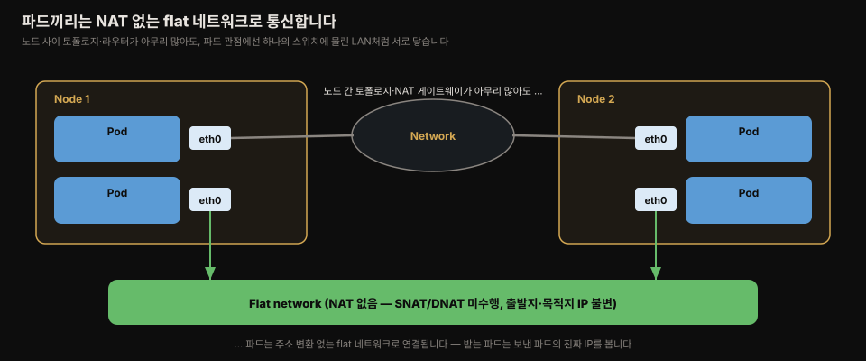
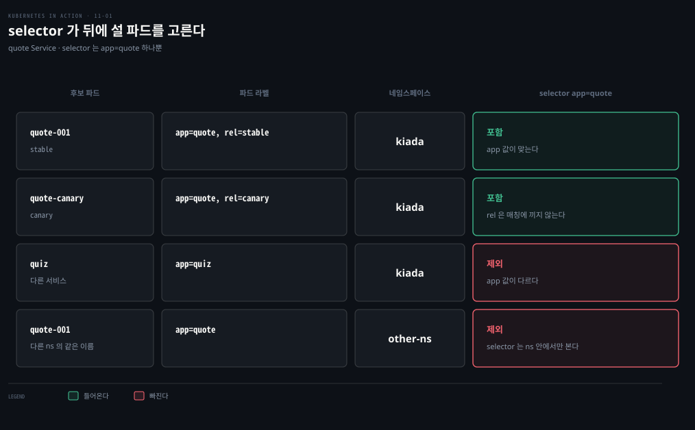

# Service 기초 — 파드 통신·ClusterIP·세션 어피니티
---
> 파드는 언제든 지워지고 새 IP로 다시 뜨기 때문에, 파드 IP를 직접 붙잡으면 안 됩니다. Service는 같은 일을 하는 파드 묶음 앞에 변하지 않는 단일 IP를 세워, 클라이언트가 그 IP 하나만 알면 되게 합니다.


> 이 문서를 읽고 나면 파드끼리 NAT 없이 통신하는 이유를 설명하고, ClusterIP Service를 label selector로 만들어 클러스터 안에서 접근하며, 세션 어피니티가 왜 쿠키가 아니라 클라이언트 IP 기준인지 근거와 함께 말할 수 있습니다.


## 진입 — 왜 파드 IP를 직접 쓰면 안 되는가

> 오늘날은 한 파드가 아니라 여러 replica를 여러 노드에 흩어 돌립니다. 이때 클라이언트가 replica 하나하나의 IP를 추적하는 대신, 단일 주소로 묶어 접근하게 하는 것이 Service입니다.

Kiada 애플리케이션은 세 서비스로 이뤄집니다 — Kiada 서비스가 Quote 서비스에서 책 인용구를, Quiz 서비스에서 퀴즈 문제를 받아 응답에 합칩니다. 각 서비스는 여러 파드 replica로 제공되므로, replica의 개수와 IP가 수시로 바뀝니다. Service 오브젝트가 이 변동을 흡수하는 안정적 접근점입니다.

파드 IP를 직접 쓰지 못하는 이유는 세 가지입니다. 파드는 ephemeral이라 노드 축출·노드 장애·스케일 축소 등으로 언제든 지워지고 대체됩니다. 파드는 노드에 배정될 때 비로소 IP를 받으므로 미리 알 수 없습니다. 수평 확장에서는 replica마다 IP가 달라, 하나의 IP나 DNS 이름 뒤에서 부하를 분산해 줄 무언가가 필요합니다.




## 1. 파드끼리의 통신 — flat 네트워크

> 클러스터의 모든 파드는 하나의 사설 flat 네트워크로 연결됩니다. 파드가 다른 파드에 패킷을 보낼 때 SNAT도 DNAT도 일어나지 않아, 받는 쪽은 보낸 파드의 IP를 출발지로 그대로 봅니다.

각 파드는 자기 IP를 가진 네트워크 인터페이스를 갖습니다. 노드들이 여러 라우터를 사이에 두고 멀리 떨어져 있어도, 파드는 NAT가 필요 없는 자신들의 flat 네트워크 위에서 통신합니다. 이 파드 네트워크는 대개 노드를 잇는 실제 네트워크 위에 얹힌 소프트웨어 정의 네트워크입니다.

파드가 다른 파드로 패킷을 보낼 때 출발지 IP·포트와 목적지 IP·포트는 바뀌지 않습니다. 보내는 파드가 받는 파드의 IP를 알면 그대로 패킷을 보낼 수 있고, 받는 파드는 보낸 쪽 IP를 출발지로 봅니다. 네트워크 플러그인은 여러 종류가 있지만 모두 이렇게 동작해야 하므로, 두 파드가 같은 노드에 있든 다른 지역의 노드에 있든 통신 방식은 같습니다. 애플리케이션 관점에서 노드 사이의 실제 토폴로지는 중요하지 않습니다.

> **Spring 관점.** Boot 앱이 다른 Boot 앱을 `RestClient`로 호출할 때, 이 flat 네트워크 덕분에 상대 파드 IP만 알면 바로 닿습니다. 다만 그 IP가 불안정하다는 것이 이 장 전체의 문제의식이고, 그래서 IP 대신 Service 이름(`http://quote`)을 URL에 씁니다.


## 2. Service가 파드를 선택하는 방법 — label selector

> Service는 label selector로 자기 뒤에 설 파드를 정합니다. 파드에 라벨을 달고 Service에 selector를 적으면, selector에 맞는 라벨을 가진 파드가 그 Service의 일원이 됩니다.

Service는 여러 파드가 뒷받침할 수 있습니다. Service에 연결하면 그 연결은 뒷받침 파드 중 하나로 넘어갑니다. 어느 파드가 이 Service에 속하는지는 label selector가 정합니다. 파드 오브젝트에 라벨을 달고 Service 오브젝트에 selector를 지정하면, 라벨이 selector에 맞는 파드가 Service에 포함됩니다.



Quote 서비스의 selector는 `app=quote`입니다. 이 selector는 stable이든 canary든 `app` 키에 `quote` 값을 가진 모든 quote 파드를 고릅니다. 파드에 붙은 다른 라벨은 매칭에 영향을 주지 않습니다. 위 그림에서 `app: quiz` 파드는 selector에 맞지 않아 제외되고, 같은 라벨을 가졌어도 다른 네임스페이스에 있는 파드는 selector가 네임스페이스 안에서만 매칭하므로 포함되지 않습니다.


## 3. ClusterIP Service 만들기

> 타입을 지정하지 않으면 ClusterIP Service가 만들어집니다. 이 타입은 클러스터 안에서만 접근되며, 클러스터 내부 파드끼리 쓰는 Quiz·Quote 서비스에 알맞습니다.

쿠버네티스 Service 타입은 ClusterIP·NodePort·LoadBalancer·ExternalName 넷입니다. ClusterIP는 클러스터 내부 전용이고, 타입을 적지 않으면 기본으로 이 타입이 됩니다. Kiada 서비스는 외부에도 노출돼야 하므로 ClusterIP만으로는 부족한데, 이 부분은 [11-02](./11-02.%EC%99%B8%EB%B6%80%20%EB%85%B8%EC%B6%9C%20%E2%80%94%20NodePort%C2%B7LoadBalancer%C2%B7%ED%8A%B8%EB%9E%98%ED%94%BD%20%EC%A0%95%EC%B1%85.md)에서 다룹니다.

quote Service의 최소 매니페스트입니다.

```yaml
apiVersion: v1
kind: Service
metadata:
  name: quote
spec:
  type: ClusterIP        # 기본값 — 클러스터 안에서만 접근
  selector:
    app: quote           # 이 라벨을 가진 파드가 뒷받침
  ports:
  - name: http           # 포트가 하나여도 이름을 붙이는 게 좋습니다
    port: 80             # Service의 cluster IP에서 여는 포트
    targetPort: 80       # 파드에서 연결이 향하는 포트
    protocol: TCP
```

이 매니페스트는 `app=quote` 라벨을 가진 파드 중 하나를 무작위로 골라 80번 포트로 연결을 넘기는 ClusterIP Service를 정의합니다. 포트가 여럿이면 각 포트에 이름을 반드시 붙여야 하고, 포트가 하나여도 붙이는 편이 낫습니다. `targetPort`에는 포트 번호 대신 파드 정의의 포트 이름을 적을 수도 있는데, 그러면 뒷받침 파드마다 포트 번호가 달라도 Service가 올바른 대상 포트를 씁니다.

### kubectl expose로 만들기

매니페스트를 `kubectl apply`하는 대신 `kubectl expose`로도 Service를 만들 수 있습니다.

```bash
kubectl expose pod quiz --name quiz
# service/quiz exposed
```

이 명령은 quiz 파드의 라벨을 읽어, 그 라벨 전부에 맞는 selector를 가진 Service를 만듭니다. 3장에서 Deployment를 expose했을 때는 Deployment의 selector를 가져와 그 파드 전부를 노출했습니다.

### 만든 Service 확인

Service를 만들면 클러스터 안 워크로드가 파드에 닿을 수 있는 내부 IP, 곧 cluster IP가 배정됩니다.

```bash
kubectl get svc -o wide
# NAME    TYPE        CLUSTER-IP      EXTERNAL-IP   PORT(S)    AGE   SELECTOR
# quiz    ClusterIP   10.96.136.190   <none>        8080/TCP   15s   app=quiz,rel=stable
# quote   ClusterIP   10.96.74.151    <none>        80/TCP     23s   app=quote
```

`kubectl expose`로 만든 quiz Service는 selector가 `app=quiz,rel=stable`입니다 — quiz 파드가 가진 라벨을 그대로 가져왔기 때문입니다. 그런데 나중에 canary를 배포하면 트래픽이 canary에도 가야 하므로, selector가 stable에만 묶이는 건 대개 바라는 바가 아닙니다.


## 4. 만든 뒤에 Service 고치기

> selector와 포트는 만든 뒤에도 바꿀 수 있습니다. selector는 `kubectl set selector`로, 포트는 `kubectl edit`이나 매니페스트 재적용으로 고칩니다.

quiz Service의 selector를 `rel: stable` 없이 `app: quiz`만으로 좁히려면 이렇게 합니다.

```bash
kubectl set selector service quiz app=quiz
# service/quiz selector updated
```

이렇게 selector를 바꾸는 방식은 여러 버전을 배포하고 클라이언트를 한 버전에서 다른 버전으로 돌릴 때 유용합니다. 포트를 바꾸려면 `kubectl edit svc quiz`로 `port`를 8080에서 80으로 고치되, quiz 파드가 실제로 듣는 포트는 8080이므로 `targetPort`는 8080으로 둡니다.

### Service spec의 기본 필드

Service 오브젝트 spec의 기본 필드입니다.

| 필드 | 타입 | 설명 |
|------|------|------|
| `type` | string | ClusterIP·NodePort·LoadBalancer·ExternalName 중 하나. 기본 ClusterIP |
| `clusterIP` | string | 클러스터 내부 IP. 보통 비워 두고 쿠버네티스가 배정. `None`이면 headless (11-03) |
| `selector` | map | 이 Service가 트래픽을 넘길 파드가 가져야 할 라벨. 안 적으면 엔드포인트를 직접 관리 (11-03) |
| `ports` | []Object | 노출 포트 목록. 각 항목에 name·protocol·appProtocol·port·nodePort·targetPort |

### IPv4/IPv6 듀얼스택

쿠버네티스는 IPv4와 IPv6를 함께 지원합니다. `ipFamilyPolicy`로 single-stack(기본)·PreferDualStack·RequireDualStack을 고릅니다. 만든 뒤 `spec.ipFamilies` 배열이 배정된 IP family(IPv4·IPv6)를 알려 줍니다. 듀얼스택 Service에서는 `spec.clusterIP`가 IP 하나만 담고, `spec.clusterIPs`가 IPv4·IPv6 둘 다를 `ipFamilies` 순서대로 담습니다.


## 5. 클러스터 안에서 Service 접근

> ClusterIP Service는 클러스터 안에서만 접근됩니다. 내 노트북에서는 닿지 않으므로, 노드에 ssh로 들어가거나 `kubectl exec`로 기존 파드 안에서 curl을 실행해 확인합니다.

quote-001 파드 안에서 셸을 열고 두 서비스에 접근해 봅니다.

```bash
kubectl exec -it quote-001 -c nginx -- sh
# / # curl http://10.96.136.190      # quiz의 cluster IP
# This is the quiz service running in pod quiz
# / # curl http://10.96.74.151       # quote의 cluster IP
# This is the quote service running in pod quote-canary
```

포트를 curl에 안 적은 이유는 Service 포트를 80으로 뒀고, 80이 HTTP 기본 포트이기 때문입니다. quote 서비스에 여러 번 요청하면 매번 다른 파드가 처리하는 것을 볼 수 있습니다 — Service가 부하 분산기로서 뒤의 파드들에 요청을 흩뿌립니다.

> `kubectl port-forward svc/my-service`는 Service에 연결하는 것처럼 보이지만, 실제로는 Service를 이용해 파드 하나를 찾아 그 파드에 *직접* 연결합니다 — Service를 우회합니다.

### 세션 어피니티

Service가 연결마다 다른 파드로 넘길지, 같은 클라이언트의 연결을 모두 같은 파드로 넘길지는 `spec.sessionAffinity`로 정합니다. 값은 None과 ClientIP 둘뿐입니다. 기본 None은 어느 파드로 갈지 보장하지 않고, ClientIP는 같은 IP에서 온 연결을 모두 같은 파드로 넘깁니다. 지속 시간은 `sessionAffinityConfig.clientIP.timeoutSeconds`로 정하며 기본 3시간입니다.

쿠버네티스가 쿠키 기반 어피니티를 제공하지 않는 것이 뜻밖일 수 있는데, Service는 OSI 전송 계층(UDP·TCP)에서 동작하지 애플리케이션 계층(HTTP)에서 동작하지 않으므로 HTTP 쿠키를 아예 이해하지 못하기 때문입니다.

### cluster DNS로 이름 resolve

클러스터는 대개 내부 DNS 서버(CoreDNS 또는 kube-dns)를 돌리고, 파드가 이를 쓰도록 설정됩니다. 그래서 파드는 cluster IP 대신 Service 이름으로 접근할 수 있습니다.

```bash
# / # curl http://quiz              # cluster IP 대신 Service 이름
# This is the quiz service running in pod quiz
```

파드는 같은 네임스페이스의 Service를 이름만으로 resolve하고, 다른 네임스페이스면 `http://quiz.kiada/`처럼 네임스페이스를 붙입니다. Service는 다음 DNS 이름들로 resolve됩니다 — `<service>`(같은 네임스페이스), `<service>.<namespace>`, `<service>.<namespace>.svc`, `<service>.<namespace>.svc.cluster.local`. FQDN을 다 안 적어도 되는 이유는 파드의 `/etc/resolv.conf`에 있는 `search` 줄이 도메인 접미사를 차례로 붙여 매칭될 때까지 시도하기 때문입니다. DNS 레코드는 [11-03](./11-03.%EC%97%94%EB%93%9C%ED%8F%AC%EC%9D%B8%ED%8A%B8%C2%B7DNS%C2%B7%ED%86%A0%ED%8F%B4%EB%A1%9C%EC%A7%80%C2%B7readiness.md)에서 더 파고듭니다.

### 환경변수로 Service 발견 (옛 방식)

DNS가 없던 초창기에는 파드가 환경변수로 Service IP를 찾았고, 이 변수는 지금도 남아 있습니다. 컨테이너가 시작될 때 쿠버네티스는 그 파드 네임스페이스에 존재하는 각 Service마다 환경변수 묶음을 채웁니다.

```bash
# QUIZ_SERVICE_HOST=10.96.136.190
# QUIZ_SERVICE_PORT=80
# QUIZ_PORT=tcp://10.96.136.190:80
# ... (포트마다 _TCP_ADDR·_TCP_PORT·_TCP_PROTO 등)
```

이 변수는 Service보다 파드를 먼저 만들면 채워지지 않으므로, 확인하려면 컨테이너를 재시작해야 합니다(`kubectl exec quote-001 -c nginx -- kill 1`). Service 이름의 하이픈은 밑줄로 바뀌고 모두 대문자가 됩니다. 요즘은 DNS로 정보를 얻으므로 이 변수는 덜 쓰이고, 오히려 문제를 일으킬 수 있습니다 — 네임스페이스의 Service가 너무 많으면 새 파드가 `argument list too long` 오류로 시작에 실패합니다. 막으려면 파드 spec의 `enableServiceLinks`를 false로 둡니다.

### Service IP를 ping할 수 없는 이유

Service가 트래픽을 안 넘길 때 IP를 ping해 보고 싶겠지만, ping은 패킷이 하나도 통과하지 않습니다. Service IP는 가상이라 Service에 정의된 포트와 짝지을 때만 의미가 있어, IP 자체는 ping할 수 없습니다.

### 파드에서 Service 쓰기

Kiada 파드는 두 서비스의 URL을 환경변수 `QUIZ_URL`·`QUOTE_URL`로 기대합니다. 이는 쿠버네티스가 자동으로 넣는 변수가 아니라, 애플리케이션이 두 서비스를 어디서 찾을지 알도록 직접 설정하는 변수입니다.

```yaml
env:
- name: QUOTE_URL
  value: http://quote/quote      # Service 이름이 곧 호스트명
- name: QUIZ_URL
  value: http://quiz
```

호스트명이 앞서 만든 Service 이름과 같습니다. 이렇게 두면 Kiada 파드가 cluster DNS로 두 서비스를 resolve해 통신합니다.

> **Spring 관점.** Boot 앱에서도 같은 패턴입니다 — 다른 서비스 URL을 `application.yml`이나 환경변수(`QUOTE_URL`)로 주입하고, 값에는 파드 IP가 아니라 Service 이름(`http://quote`)을 씁니다. 12-factor의 "backing service는 설정으로 붙인다" 원칙이 K8s에서는 Service 이름 주입으로 나타납니다.


## 면접에서 받을 만한 질문

> 아래 질문에 먼저 스스로 답해 본 뒤, 챕터 끝의 정답과 맞춰 봅니다.

1. 파드끼리 패킷을 주고받을 때 SNAT·DNAT가 일어나지 않는다는 것이 애플리케이션에 어떤 의미인가요? 이를 flat 네트워크라 부르는 이유는 무엇인가요?
2. Service가 어느 파드를 뒷받침으로 삼을지는 무엇이 정하나요? `kubectl expose pod`로 만든 Service의 selector가 나중에 문제가 되는 상황을 예로 드세요.
3. Service의 cluster IP를 ping하면 왜 응답이 없나요?
4. 세션 어피니티로 쿠키 기반을 못 쓰고 ClientIP만 되는 이유는 무엇인가요?
5. Service를 이름만으로 resolve할 수 있는 이유는 무엇인가요? `search` 줄과 `ndots`가 어떤 역할을 하나요?


## 정답 (자답 후 펼치기)

> 위 질문에 답해 본 다음 아래와 맞춰 봅니다. 순서는 질문과 1:1로 대응합니다.

### 정답 1 — flat 네트워크와 NAT 없음

파드가 다른 파드로 패킷을 보낼 때 출발지·목적지 IP와 포트가 그대로 유지됩니다. 받는 파드는 보낸 파드의 진짜 IP를 출발지로 보므로, 애플리케이션이 상대를 그대로 식별하고 접근 로그에 실제 IP를 남길 수 있습니다. flat이라 부르는 이유는 노드가 지리적으로 흩어져 여러 라우터를 거치더라도, 파드 관점에서는 하나의 스위치에 물린 LAN처럼 NAT 없이 서로 닿기 때문입니다.

### 정답 2 — label selector와 expose selector 함정

Service 오브젝트에 적은 label selector가 뒷받침 파드를 정합니다. selector에 맞는 라벨을 가진 파드가 자동으로 포함됩니다. `kubectl expose pod quiz`는 그 파드의 라벨 *전부*(`app=quiz,rel=stable`)를 selector로 가져오는데, 나중에 canary(`rel: canary`)를 배포하면 canary 라벨이 stable과 달라 selector에 맞지 않으므로 트래픽이 canary로 가지 않습니다. `kubectl set selector`로 `app=quiz`만 남겨 좁혀야 합니다.

### 정답 3 — cluster IP를 ping 못 하는 이유

Service의 cluster IP는 실제 인터페이스에 붙은 IP가 아니라 가상 IP입니다. Service에 정의된 포트와 짝지어질 때만 의미를 갖고, iptables·IPVS 규칙이 그 IP:포트 조합을 파드로 리다이렉트합니다. ICMP(ping)에는 대응하는 포트 규칙이 없으므로 패킷이 어디로도 가지 못해 100% 손실이 납니다.

### 정답 4 — 쿠키 어피니티가 없는 이유

Service는 OSI 전송 계층(TCP·UDP)에서 동작합니다. HTTP 쿠키는 애플리케이션 계층 개념이라 전송 계층에서는 보이지 않습니다. 그래서 쿠버네티스 Service는 쿠키를 이해하지 못하고, 어피니티를 걸 수 있는 유일한 기준이 패킷에서 바로 읽히는 클라이언트 IP입니다. `sessionAffinity: ClientIP`로 걸며 기본 지속 시간은 3시간입니다.

### 정답 5 — 이름만으로 resolve되는 이유

파드의 `/etc/resolv.conf`에 있는 `search` 줄(`kiada.svc.cluster.local svc.cluster.local cluster.local …`)이 짧은 이름 뒤에 도메인 접미사를 차례로 붙여 매칭될 때까지 시도합니다. `options ndots:5`는 점이 5개 미만인 이름을 상대 이름으로 보고 search 접미사를 붙이게 합니다. 그래서 `quiz`만 적어도 `quiz.kiada.svc.cluster.local`로 확장돼 resolve됩니다.


## 관련 문서

> 이 편은 06장 파드 개념과 10장 지속 스토리지를 이어받아, 여러 파드 replica를 단일 주소로 묶는 Service의 기초(11-02·11-03)로 이어집니다.

- [11-02. 외부 노출 — NodePort·LoadBalancer·트래픽 정책](./11-02.%EC%99%B8%EB%B6%80%20%EB%85%B8%EC%B6%9C%20%E2%80%94%20NodePort%C2%B7LoadBalancer%C2%B7%ED%8A%B8%EB%9E%98%ED%94%BD%20%EC%A0%95%EC%B1%85.md) — ClusterIP를 넘어 클러스터 밖으로 노출하는 법
- [11-03. 엔드포인트·DNS·토폴로지·readiness](./11-03.%EC%97%94%EB%93%9C%ED%8F%AC%EC%9D%B8%ED%8A%B8%C2%B7DNS%C2%B7%ED%86%A0%ED%8F%B4%EB%A1%9C%EC%A7%80%C2%B7readiness.md) — Service 뒤 엔드포인트와 DNS 레코드
- [10-03. PV 관리 — 리사이즈·스냅샷·ephemeral](./10-03.PV%20%EA%B4%80%EB%A6%AC%20%E2%80%94%20%EB%A6%AC%EC%82%AC%EC%9D%B4%EC%A6%88%C2%B7%EC%8A%A4%EB%83%85%EC%83%B7%C2%B7ephemeral.md) — 앞 장(지속 스토리지)
- [02-04. Service와 EndpointSlice](../../kubernetes/02_networking/02-04.Service%EC%99%80%20EndpointSlice.md) — Service·ClusterIP 통합 개념본(책 비종속)
- [02-05. DNS와 CoreDNS](../../kubernetes/02_networking/02-05.DNS%EC%99%80%20CoreDNS.md) — 클러스터 DNS resolve 통합 개념본
- 원서: 《Kubernetes in Action, 2nd Ed.》 Ch11 §11.1 — [Manning](https://www.manning.com/books/kubernetes-in-action-second-edition), [예제 코드](https://github.com/luksa/kubernetes-in-action-2nd-edition/tree/master/Chapter11)
- 공식 문서: [Service](https://kubernetes.io/docs/concepts/services-networking/service/)
