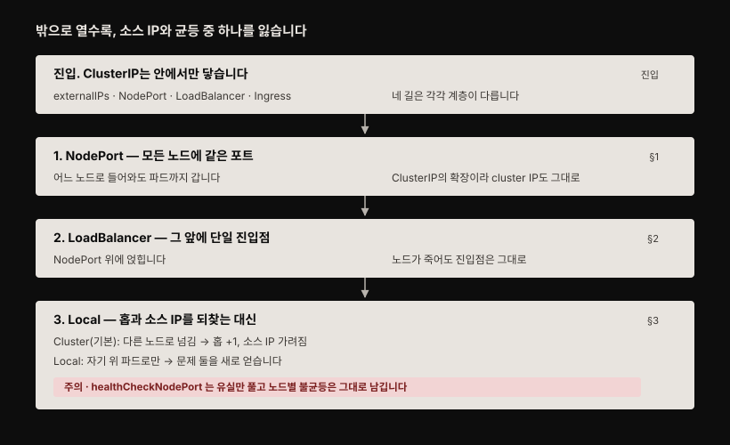
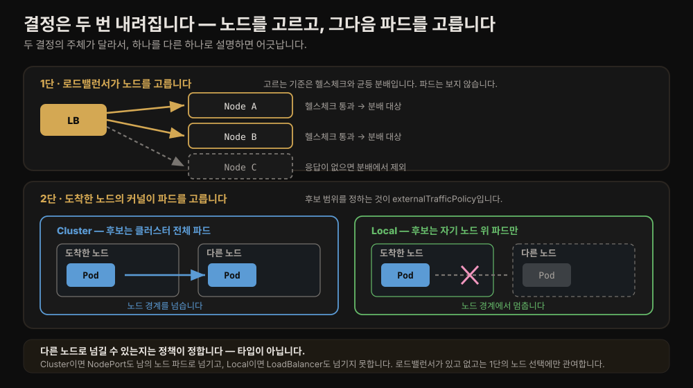
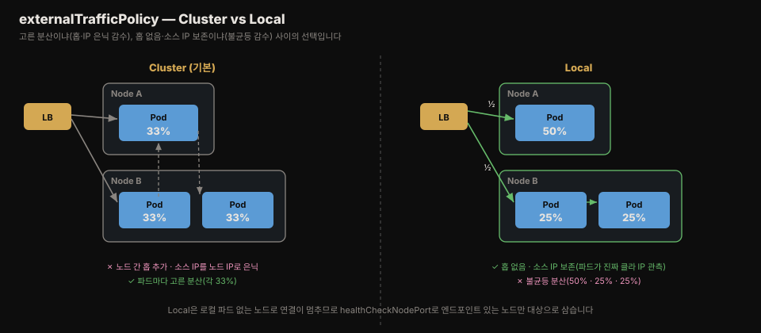

# 외부 노출 — NodePort·LoadBalancer·트래픽 정책
---
> **ClusterIP**는 클러스터 안에서만 닿습니다. 밖에서 접근하려면 NodePort로 모든 노드에 포트를 열거나, LoadBalancer로 실제 로드밸런서를 띄웁니다. 노드 사이 홉과 소스 IP 은닉을 피하려면 externalTrafficPolicy를 Local로 바꿉니다.

> 이 문서를 읽고 나면 외부 노출 네 방식의 차이를 설명하고, NodePort의 여섯 포트 번호가 어떻게 매핑되는지 그리며, externalTrafficPolicy Cluster와 Local의 트레이드오프를 근거와 함께 고를 수 있습니다.




## 진입 — 클러스터 밖으로 노출하는 네 방식

> ClusterIP는 내부 전용이라 외부 클라이언트가 Kiada 서비스에 닿지 못합니다. 외부 노출에는 네 가지 길이 있고, 각각 계층이 다릅니다.

지금까지 만든 Service는 **건물 안에서만 통하는 내선 전화**와 같습니다. 같은 건물 사람끼리는 번호만 누르면 되지만, 바깥 사람은 그 번호로 걸 수 없습니다. 실제 사용자는 건물 밖에 있으니 어떻게든 바깥 번호를 하나 내줘야 합니다. 이 편이 그 방법을 다룹니다.

그런데 밖으로 열면 대가가 따라옵니다. 바깥에서 온 요청이 어느 문으로 들어오느냐에 따라 **"누가 걸었는지"(원래 클라이언트 IP)가 지워지거나, 일부 서버에만 일이 몰립니다.** 이 편의 절반은 그 대가를 줄이는 이야기입니다.

[11-01](./11-01.Service%20%EA%B8%B0%EC%B4%88%20%E2%80%94%20%ED%8C%8C%EB%93%9C%20%ED%86%B5%EC%8B%A0%C2%B7ClusterIP%C2%B7%EC%84%B8%EC%85%98%20%EC%96%B4%ED%94%BC%EB%8B%88%ED%8B%B0.md)의 ClusterIP는 클러스터 안에서만 접근됩니다. 지금까지 포트 포워딩으로 접근했지만 그것은 개발용일 뿐이고, 파드 묶음을 제대로 외부에 열려면 다음 넷 중 하나를 씁니다.

- `externalIPs`에 노드의 추가 IP를 지정 — 드물게 쓰는 방식
- 타입을 `NodePort`로 — 모든 노드의 특정 포트로 접근
- 타입을 `LoadBalancer`로 — 쿠버네티스가 로드밸런서를 프로비저닝
- Ingress 오브젝트로 노출 — 하나의 IP로 여러 Service를 노출(다음 장)

`externalIPs`는 그 IP로 향하는 트래픽을 Service가 처리하도록 지정하는 방식으로, 흔치 않습니다. 이 편은 실무에서 주로 쓰는 NodePort와 LoadBalancer, 그리고 둘 다에 적용되는 트래픽 정책을 다룹니다. Ingress는 [04-06](../../kubernetes/04_networking/04-06.Ingress%EC%99%80%20Gateway%20API.md) 통합 개념본과 원서 다음 장에서 다룹니다.


## 1. NodePort Service

> NodePort는 모든 노드에 같은 포트를 열어, 어느 노드로 접속해도 그 노드가 뒷받침 파드로 연결을 넘깁니다. ClusterIP의 확장이라 cluster IP도 그대로 갖습니다.


NodePort Service를 만들면 selector에 맞는 파드가 모든 노드의 특정 포트(node port)로 접근됩니다. 이 포트가 노드에 열려 있어 node port라 부릅니다. 어느 노드로 접속하든 상관없이, 모든 노드가 파드가 도는 노드와 무관하게 연결을 뒷받침 파드로 넘깁니다.

Kiada 파드를 두 포트로 노출하는 NodePort Service입니다.

```yaml
apiVersion: v1
kind: Service
metadata:
  name: kiada
spec:
  type: NodePort           # 타입을 NodePort로
  selector:
    app: kiada
  ports:
  - name: http
    port: 80               # cluster IP에서 여는 포트
    nodePort: 30080        # 각 노드에서 여는 포트
    targetPort: 8080       # 파드가 듣는 포트
  - name: https
    port: 443
    nodePort: 30443
    targetPort: 8443
```

`nodePort`를 비우면 쿠버네티스가 번호를 배정해 NodePort Service 사이 포트 충돌을 막습니다. 여섯 번호가 헷갈리기 쉬운데, HTTP는 노드 30080 → cluster IP 80 → 파드 8080, HTTPS는 노드 30443 → cluster IP 443 → 파드 8443으로 각각 세 단계입니다.

여기서 화살표를 오해하기 쉽습니다. 이 표기는 **어느 주소로 접속하면 어느 파드 포트에 닿는지의 매핑 관계**이고, 한 요청이 세 주소를 차례로 밟는다는 뜻이 아닙니다. cluster IP와 node port는 같은 파드 목록을 가리키는 **두 개의 입구**입니다. 

- 클러스터 내부 클라이언트는 `cluster IP:80`으로 들어오고 외부 클라이언트는 `노드IP:30080`으로 들어오는데, 어느 입구로 들어와도 도착지는 같은 파드의 8080입니다. 외부에서 들어온 요청이 cluster IP를 정류장처럼 거쳐 가는 것이 아닙니다
- cluster IP 자체가 어느 인터페이스에도 붙지 않은 가상 주소라 무언가를 경유시킬 실체가 없고, 두 입구는 각자 독립적으로 파드 주소로 이어집니다. 이 이어짐이 실제로 어떻게 일어나는지는 §3에서 다룹니다.

### NodePort 접근

접근 가능한 IP:포트 조합을 알려면 node port 번호와 노드 IP가 필요합니다. `kubectl get nodes -o wide`의 INTERNAL-IP·EXTERNAL-IP를 봅니다. 클라우드 노드는 대개 external IP가 있고, 베어메탈은 internal IP만 있을 수 있습니다.

```bash
kubectl get svc
# NAME    TYPE        CLUSTER-IP      EXTERNAL-IP   PORT(S)                      AGE
# kiada   NodePort    10.96.226.212   <none>        80:30080/TCP,443:30443/TCP   1m
```

kiada Service는 cluster IP의 80·443 외에 노드 포트 30080·30443도 엽니다. `172.18.0.4:30080`처럼 아무 노드 IP:node port로 접근하면, 그 노드가 뒷받침 파드로 연결을 넘깁니다 — 요청을 보낸 노드와 파드가 도는 노드가 달라도 첫 노드가 두 번째 노드로 포워딩합니다. GKE에서 node port를 열려면 방화벽 규칙(`gcloud compute firewall-rules create ... --allow=tcp:30000-32767`)이 필요합니다.

응답의 Client IP를 보면 요청을 보낸 컴퓨터의 IP가 아니라 접속한 노드의 IP로 찍힙니다. 이 소스 IP 은닉은 3절 트래픽 정책에서 다룹니다.


## 2. LoadBalancer Service

> LoadBalancer는 NodePort의 확장으로, 실제 로드밸런서를 프로비저닝해 노드 앞에 세웁니다. 클라이언트는 로드밸런서 IP로 접속하고, 로드밸런서가 건강한 노드의 node port로만 넘깁니다.

모든 Service가 부하 분산기 역할을 하지만, LoadBalancer 타입은 *실제* 로드밸런서를 만듭니다. 로드밸런서가 노드 앞에 서서 클라이언트 연결을 받아, 노드 중 하나의 node port로 넘깁니다. LoadBalancer는 NodePort의 확장이라 node port로도 접근됩니다. 클라이언트를 특정 노드의 node port가 아니라 로드밸런서로 향하게 하면, 로드밸런서가 건강한 노드로만 트래픽을 넘기므로 죽은 노드에 연결을 시도하지 않고 노드 간 고른 분산도 얻습니다.

```yaml
apiVersion: v1
kind: Service
metadata:
  name: kiada
spec:
  type: LoadBalancer       # 이 한 줄만 NodePort와 다릅니다
  selector:
    app: kiada
  ports:
  - name: http
    port: 80
    nodePort: 30080
    targetPort: 8080
  - name: https
    port: 443
    nodePort: 30443
    targetPort: 8443
```

NodePort 매니페스트와 `type` 한 줄만 다릅니다. `nodePort`는 무작위 배정을 막으려고 적었을 뿐, 번호가 상관없으면 생략해도 됩니다. 기존 kiada Service에 이 매니페스트를 apply하면 cluster IP가 유지된 채 타입만 바뀝니다.

로드밸런서가 만들어지기까지 몇 분 걸릴 수 있고, 그동안 EXTERNAL-IP에 `<pending>`이 뜹니다. 만들어지면 그 IP로 80·443 포트에 접근합니다. 모든 클러스터가 이 타입을 지원하지는 않아, 클라우드는 대개 지원하고 베어메탈은 MetalLB 같은 애드온을 깔아야 합니다. 지원하지 않으면 Service는 만들어지되 node port로만 접근됩니다.

### LoadBalancer 튜닝

더 세밀히 제어하려면 spec에 다음 필드를 씁니다.

| 필드 | 타입 | 설명 |
|------|------|------|
| `loadBalancerClass` | string | 여러 로드밸런서 클래스가 있을 때 어느 것을 쓸지. 설치된 컨트롤러에 따라 값이 다름 |
| `loadBalancerIP` | string | 클라우드가 지원하면 원하는 로드밸런서 IP 지정 |
| `loadBalancerSourceRanges` | []string | 로드밸런서를 통한 접근을 허용할 클라이언트 IP 제한. 일부 컨트롤러만 지원 |
| `allocateLoadBalancerNodePorts` | boolean | node port 할당 여부. 일부 구현은 node port 없이 파드로 직접 넘김 |

> **Spring 관점.** 사내 K8s에 Boot 앱을 노출할 때, 팀마다 LoadBalancer를 하나씩 띄우면 클라우드 로드밸런서 비용이 쌓입니다. 그래서 실무에서는 Service는 ClusterIP로 두고 Ingress 하나로 여러 앱을 묶는 편이 흔합니다 — LoadBalancer는 "이 앱만은 전용 L4 진입점이 필요하다" 할 때 씁니다.


## 3. externalTrafficPolicy — 노드 간 홉과 소스 IP

> 외부 연결이 다른 노드의 파드로 넘어가면 홉이 하나 늘고, 소스 IP가 노드 IP로 가려집니다. externalTrafficPolicy를 Local로 두면 노드가 자기 위의 파드로만 넘겨 이 둘을 없애지만, 대신 문제 둘을 얻고 그중 하나만 장치로 막힙니다.

외부 클라이언트가 node port나 로드밸런서로 접속하면 연결이 접속한 노드가 아닌 다른 노드의 파드로 넘어갈 수 있습니다. 이때 대가가 둘입니다.

- 홉이 하나 더 들어 지연이 늘어납니다.
- 파드가 진짜 클라이언트 IP를 보지 못합니다. 웹 서버가 접근 로그에 실제 클라이언트를 남기지 못합니다.

이것이 기본값의 동작이며, 바꾸는 손잡이가 `externalTrafficPolicy`입니다. 어디에 선언하는지부터 봅니다.

`externalTrafficPolicy`는 Service의 `spec` 필드입니다. 값은 `Cluster`(기본)와 `Local` 둘이고, 로드밸런서나 노드에 따로 설정하는 것이 아닙니다.

```yaml
spec:
  type: LoadBalancer
  externalTrafficPolicy: Local    # Service spec 필드
```

- 선언하는 곳과 집행하는 곳이 다릅니다. 당신이 Service에 `Local`을 적으면 kube-proxy가 그 값을 읽어 각 노드의 커널에 "이 노드 위 파드만 후보로 삼는" 규칙을 심습니다. 
- 그래서 필드는 Service에 있지만 실제로 트래픽을 가르는 것은 노드 커널이고, 이 분리를 알아 두면 다음 두 절의 서술이 어긋나 보이지 않습니다.

### 결정은 두 번 내려집니다

외부 요청이 파드에 닿기까지 결정이 두 번 있습니다. 이 둘을 섞으면 "NodePort는 다른 노드로 못 넘기는데 LoadBalancer는 넘기나?" 같은 혼동이 생깁니다.



1. 첫 번째 결정은 **로드밸런서가 어느 노드로 보낼지 고르는 것**입니다. 헬스체크로 죽은 노드를 빼고 남은 노드에 균등하게 나눕니다. 이 단계에서 로드밸런서는 파드를 보지 않습니다.
2. 두 번째 결정은 **도착한 노드의 커널이 어느 파드로 넘길지 고르는 것**이고, 후보 범위를 정하는 것이 `externalTrafficPolicy`입니다. `Cluster`면 클러스터 전체 파드가 후보라 남의 노드 파드로도 넘기고, `Local`이면 자기 노드 위 파드만 후보입니다.

그러니 **다른 노드로 넘길 수 있는지는 정책이 정하고, Service 타입이 정하지 않습니다.** `Cluster`이면 NodePort도 남의 노드 파드로 넘기고(§1에서 본 그대로), `Local`이면 LoadBalancer도 넘기지 못합니다. 로드밸런서가 있고 없고는 첫 번째 결정에만 관여합니다.

### 한 패킷에서 바뀌는 필드는 둘입니다

연결이 다른 노드의 파드로 넘어갈 때 주소가 두 군데 바뀝니다. 방향이 달라 이름도 다릅니다 — 목적지를 바꾸는 것이 DNAT, 출발지를 바꾸는 것이 SNAT입니다([11-01 §1](./11-01.Service%20%EA%B8%B0%EC%B4%88%20%E2%80%94%20%ED%8C%8C%EB%93%9C%20%ED%86%B5%EC%8B%A0%C2%B7ClusterIP%C2%B7%EC%84%B8%EC%85%98%20%EC%96%B4%ED%94%BC%EB%8B%88%ED%8B%B0.md)에서 정의한 용어입니다).


집에 있는 PC(`203.0.113.7`)가 노드 A(`172.18.0.4`)의 30080으로 접속했고 파드는 노드 B(`10.244.2.9`)에 있다고 하면, 노드 A의 커널이 이렇게 바꿉니다.

- **목적지** `172.18.0.4:30080` → `10.244.2.9:8080` — 두 정책 모두 합니다. 안 바꾸면 패킷이 파드에 닿지 못하니까요.
- **출발지** `203.0.113.7` → `172.18.0.4` — **`Cluster`만 합니다.** 응답 패킷이 반드시 노드 A로 되돌아와야 클라이언트에 전달되므로, 노드 A가 출발지를 자기 주소로 위조합니다.

목적지가 cluster IP를 거치지 않는다는 점을 눈여겨봅니다. §1에서 본 대로 cluster IP와 node port는 같은 파드 목록을 가리키는 두 입구이고, node port로 들어온 패킷은 곧바로 파드 주소로 바뀝니다.

`Local`이 소스 IP를 보존하는 이유가 여기서 드러납니다. 자기 노드 위 파드로만 넘기니 응답이 딴 노드로 샐 일이 없고, 그래서 **출발지를 위조할 이유가 없어 SNAT을 생략합니다.** "소스 IP 은닉이 사라진다"는 결과가 아니라, 애초에 그 변환을 하지 않는 것입니다. 대가로 파드는 진짜 클라이언트 IP를 보고, 웹 서버가 접근 로그에 실제 클라이언트를 남길 수 있습니다.

### Local의 대가는 둘이고, 장치가 푸는 것은 하나입니다

`Local`은 홉과 SNAT을 없애는 대신 문제 둘을 얻습니다. 둘은 성격이 달라 하나는 장치로 막히고 하나는 막히지 않습니다.

노드 A에 파드 3개, 노드 B에 1개, 노드 C에 0개인 클러스터에 요청 100개가 들어오는 경우로 봅니다.



| 설정 | 파드당 요청 수 | 파드 없는 노드로 간 요청 | 소스 IP |
|------|---------------|------------------------|---------|
| `Cluster` | 25 · 25 · 25 · 25 (균등) | 남의 노드 파드로 넘김 | 노드 IP로 위조 |
| `Local` | 11 · 11 · 11 · 33 (3배 어긋남) | 33개 유실 | 클라이언트 IP 보존 |
| `Local` + `healthCheckNodePort` | 16.7 · 16.7 · 16.7 · 50 (3배 어긋남) | 노드가 분배에서 제외됨 | 클라이언트 IP 보존 |

1. 첫 번째 문제는 **파드 없는 노드로 간 요청이 죽는 것**입니다. 
   - 노드 C에는 넘길 파드가 없고 남의 노드로 넘기지도 못하니 연결이 타임아웃 납니다. 이것은 `healthCheckNodePort`가 풉니다
   - `Local` Service를 만들면 쿠버네티스가 포트를 하나 열고, 그 노드에 로컬 엔드포인트가 있으면 200, 없으면 503을 응답합니다. 로드밸런서가 이 포트로 헬스체크를 돌려 503인 노드를 분배 대상에서 뺍니다.
2. 두 번째 문제는 **파드당 부하가 어긋나는 것**입니다. 
   - 로드밸런서는 노드 단위로 균등하게 나누는데 노드마다 파드 수가 다르니, 파드가 적은 노드의 파드가 더 많이 받습니다. 
   - 노드 B의 단일 파드는 노드 A의 파드보다 3배를 처리합니다. **이쪽은 `healthCheckNodePort`로 풀리지 않습니다.** 
   - 노드 C가 빠지면 A·B가 50개씩 받아 숫자는 커지지만 3배 비율은 그대로입니다. 줄이려면 노드별 파드 수를 고르게 맞춰야 하고, DaemonSet이나 `topologySpreadConstraints`가 그 수단입니다.

어느 정책을 쓸지는 감수할 트레이드오프에 달렸습니다 — 균등 분산을 택하면 소스 IP를 잃고, 소스 IP를 지키면 분산이 노드별 파드 수에 휘둘립니다.


## 면접에서 받을 만한 질문

> 아래 질문에 먼저 스스로 답해 본 뒤, 챕터 끝의 정답과 맞춰 봅니다.

1. NodePort Service의 여섯 포트 번호(port·nodePort·targetPort × HTTP·HTTPS)가 각각 어디에서 어디로 매핑되는지 설명하세요.
2. LoadBalancer 타입이 NodePort의 "확장"이라는 말은 무슨 뜻인가요? LoadBalancer를 지원하지 않는 클러스터에서 이 타입을 만들면 어떻게 되나요?
3. 외부 클라이언트가 노드 A의 node port로 접속했고 파드는 노드 B에 있습니다. 이때 패킷의 목적지 IP와 출발지 IP가 각각 무엇에서 무엇으로 바뀌며, 둘 중 어느 변환이 Local 정책에서는 일어나지 않나요?
4. "다른 노드의 파드로 넘길 수 있는지"를 결정하는 것은 Service 타입(NodePort냐 LoadBalancer냐)인가요, externalTrafficPolicy인가요? 그렇게 판단한 근거를 대세요.
5. 노드 A에 파드 3개, 노드 B에 1개, 노드 C에 0개가 있고 요청 100개가 들어옵니다. Local 정책에서 각 파드는 몇 개를 받고, 노드 C로 간 요청은 어떻게 되나요?
6. 5번에서 healthCheckNodePort를 켜면 숫자가 어떻게 달라지나요? 이 장치가 풀지 *못하는* 문제는 무엇이고, 그것은 무엇으로 풀어야 하나요?


## 정답 (자답 후 펼치기)

> 위 질문에 답해 본 다음 아래와 맞춰 봅니다. 순서는 질문과 1:1로 대응합니다.

### 정답 1 — NodePort 여섯 포트 매핑

HTTP와 HTTPS 모두 `nodePort → port → targetPort` 세 단계로 흐릅니다.

- HTTP: 노드 `nodePort` 30080 → cluster IP `port` 80 → 파드 `targetPort` 8080
- HTTPS: 노드 30443 → cluster IP 443 → 파드 8443

외부 클라이언트는 노드 IP:30080으로 접속하고, 클러스터 내부 클라이언트는 cluster IP:80으로 접속합니다. 둘 다 최종적으로 파드 8080에 닿습니다. `nodePort`를 비우면 쿠버네티스가 30000~32767 범위에서 자동 배정합니다.

### 정답 2 — LoadBalancer는 NodePort의 확장

LoadBalancer는 내부적으로 NodePort처럼 node port를 엽니다. 그 앞에 실제 로드밸런서를 프로비저닝합니다. 로드밸런서가 건강한 노드의 node port로 트래픽을 넘기므로 죽은 노드를 피하고 고른 분산을 얻습니다. 지원하지 않는 클러스터(애드온 없는 베어메탈)에서 만들면 Service는 생성되지만 EXTERNAL-IP가 `<pending>`에 머뭅니다. 이때는 node port로만 접근됩니다.

### 정답 3 — 목적지는 두 정책 모두, 출발지는 Cluster만

노드 A(`172.18.0.4`)로 들어온 패킷이 노드 B의 파드(`10.244.2.9`)로 갈 때, 노드 A의 커널이 두 필드를 바꿉니다.

- **목적지** `172.18.0.4:30080` → `10.244.2.9:8080` (DNAT) — 두 정책 모두 합니다. 안 바꾸면 패킷이 파드에 닿지 못합니다.
- **출발지** 클라이언트 IP → `172.18.0.4` (SNAT) — **Cluster만** 합니다. 응답이 반드시 노드 A로 되돌아와야 하므로 출발지를 자기 주소로 위조합니다.

Local 정책에서 일어나지 않는 것은 **출발지 변환(SNAT)** 입니다. 자기 노드 위 파드로만 넘기니 응답 경로가 어긋날 일이 없어 위조할 이유가 없습니다. 목적지 변환은 Local도 합니다.

주의할 점은 목적지가 cluster IP를 거치지 않는다는 것입니다. cluster IP와 node port는 같은 파드 목록을 가리키는 두 입구이므로, node port로 들어온 패킷은 곧바로 파드 주소로 바뀝니다.

### 정답 4 — 정책이 정합니다

`externalTrafficPolicy`가 정합니다. 근거는 결정이 두 번 내려지고 둘의 주체가 다르다는 데 있습니다. 로드밸런서는 **어느 노드로 보낼지**만 고르고(헬스체크로 죽은 노드 제외 + 균등 분배), 도착한 노드의 커널이 **어느 파드로 넘길지**를 고릅니다. 후보 범위를 정하는 것이 정책입니다.

그래서 `Cluster`이면 NodePort Service도 남의 노드 파드로 넘기고, `Local`이면 LoadBalancer Service도 넘기지 못합니다. 로드밸런서의 존재는 첫 번째 결정에만 관여하므로 타입은 이 질문의 답이 아닙니다.

### 정답 5 — Local의 불균등과 유실

로드밸런서는 노드 **셋 모두**에 균등하게 나누므로 A·B·C가 각 33개를 받습니다. Local이라 각 노드는 자기 위 파드로만 넘깁니다.

- 노드 A의 33개를 파드 3개가 나눠 각 **11개**
- 노드 B의 33개를 파드 1개가 전부 받아 **33개**
- 노드 C의 33개는 넘길 파드가 없고 남의 노드로도 못 넘기니 **버려집니다**(타임아웃)

파드당 부하가 11 대 33으로 3배 어긋납니다. 로드밸런서는 노드 단위로 공평했지만 파드 단위로는 불공평해졌습니다.

### 정답 6 — 장치는 유실만 풉니다

`healthCheckNodePort`를 켜면 노드 C가 503을 응답해 분배 대상에서 빠지고, A·B가 **50개씩** 받습니다. 노드 A의 파드 3개는 각 **16.7개**, 노드 B의 파드 1개는 **50개**입니다.

유실은 사라졌지만 **불균등은 그대로 남습니다**. 16.7 대 50으로 여전히 3배입니다. 이 장치는 "파드 없는 노드로 간 요청이 죽는다"만 풀고 불균등은 풀지 못합니다.

불균등의 뿌리는 로드밸런서가 노드 단위로 나누는데 노드마다 파드 수가 다르다는 데 있습니다. 그래서 노드별 파드 수를 고르게 맞춰야 줄어듭니다. DaemonSet이나 `topologySpreadConstraints`가 그 수단입니다.


## 관련 문서

> 이 편은 11-01의 ClusterIP를 클러스터 밖으로 여는 NodePort·LoadBalancer와 트래픽 정책을 다루고, 엔드포인트·DNS(11-03)로 이어집니다.

- [11-01. Service 기초 — 파드 통신·ClusterIP·세션 어피니티](./11-01.Service%20%EA%B8%B0%EC%B4%88%20%E2%80%94%20%ED%8C%8C%EB%93%9C%20%ED%86%B5%EC%8B%A0%C2%B7ClusterIP%C2%B7%EC%84%B8%EC%85%98%20%EC%96%B4%ED%94%BC%EB%8B%88%ED%8B%B0.md) — ClusterIP·내부 접근(앞 편)
- [11-03. 엔드포인트·DNS·토폴로지·readiness](./11-03.%EC%97%94%EB%93%9C%ED%8F%AC%EC%9D%B8%ED%8A%B8%C2%B7DNS%C2%B7%ED%86%A0%ED%8F%B4%EB%A1%9C%EC%A7%80%C2%B7readiness.md) — 엔드포인트·DNS·readiness(다음 편)
- [04-04. Service와 EndpointSlice](../../kubernetes/04_networking/04-04.Service%EC%99%80%20EndpointSlice.md) — Service 타입 통합 개념본(책 비종속)
- [04-06. Ingress와 Gateway API](../../kubernetes/04_networking/04-06.Ingress%EC%99%80%20Gateway%20API.md) — 네 번째 노출 방식(Ingress)
- [01-02. K8s 패킷 여정 — netfilter·conntrack·라우팅](../../../02_os/networking/01-02.K8s%20%ED%8C%A8%ED%82%B7%20%EC%97%AC%EC%A0%95%20%E2%80%94%20netfilter%C2%B7conntrack%C2%B7%EB%9D%BC%EC%9A%B0%ED%8C%85.md) § "2.5 K8s에서 SNAT는 언제 걸리는가" — §3의 소스 IP 은닉이 실제로 어느 커널 훅에서 걸리는지
- 원서: 《Kubernetes in Action, 2nd Ed.》 Ch11 §11.2 — [Manning](https://www.manning.com/books/kubernetes-in-action-second-edition), [예제 코드](https://github.com/luksa/kubernetes-in-action-2nd-edition/tree/master/Chapter11)
- 공식 문서: [Service types](https://kubernetes.io/docs/concepts/services-networking/service/#publishing-services-service-types), [MetalLB](https://metallb.universe.tf/)
