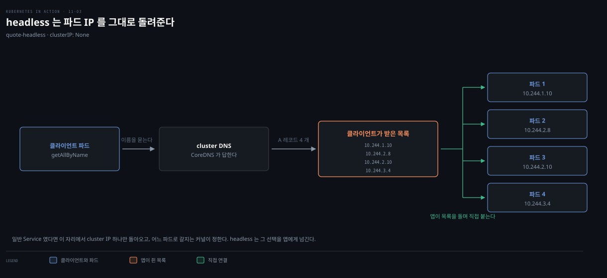
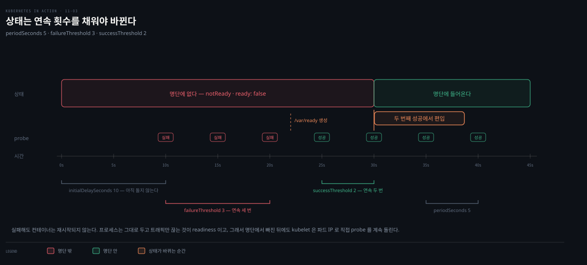

# 엔드포인트·DNS·토폴로지·readiness
---
> Service와 파드는 Endpoints·EndpointSlice 오브젝트로 이어지고, 이 오브젝트는 파드가 아닌 무엇이든(외부 IP까지) 가리킬 수 있습니다. DNS는 Service를 A·SRV·CNAME 레코드로 노출하며, headless Service는 cluster IP 대신 파드 IP를 그대로 돌려줍니다. 파드는 readiness probe를 통과해야 비로소 엔드포인트가 됩니다.

> 이 문서를 읽고 나면 Endpoints와 EndpointSlice가 갈라진 이유를 설명하고, headless·ExternalName Service의 DNS 동작을 구분하며, readiness probe가 외부 의존을 검사하면 안 되는 이유를 근거와 함께 말할 수 있습니다.


## 진입 — Service 뒤에는 무엇이 있는가

> Service가 label selector로 파드를 고른다고 배웠지만, 엔드포인트는 IP를 가진 것이면 무엇이든 될 수 있습니다. 이 편은 그 엔드포인트 오브젝트, DNS 레코드, 트래픽을 가까운 파드로 보내는 법, 그리고 파드가 언제 엔드포인트가 되는지를 다룹니다.

[11-01](./11-01.Service%20%EA%B8%B0%EC%B4%88%20%E2%80%94%20%ED%8C%8C%EB%93%9C%20%ED%86%B5%EC%8B%A0%C2%B7ClusterIP%C2%B7%EC%84%B8%EC%85%98%20%EC%96%B4%ED%94%BC%EB%8B%88%ED%8B%B0.md)·[11-02](./11-02.%EC%99%B8%EB%B6%80%20%EB%85%B8%EC%B6%9C%20%E2%80%94%20NodePort%C2%B7LoadBalancer%C2%B7%ED%8A%B8%EB%9E%98%ED%94%BD%20%EC%A0%95%EC%B1%85.md)에서 Service를 만들고 안팎으로 노출하는 법을 배웠습니다. 이 편은 Service와 파드를 잇는 엔드포인트 오브젝트(§11.3), DNS 레코드와 headless·ExternalName(§11.4), 가까운 엔드포인트로 보내는 트래픽 정책(§11.5), 파드를 엔드포인트에 넣고 빼는 readiness probe(§11.6)를 다룹니다.


## 1. Endpoints와 EndpointSlice

> Service 오브젝트에는 뒷받침 파드 목록이 들어 있지 않습니다. 그 목록은 이름이 같은 Endpoints 오브젝트에, 그리고 성능을 위해 쪼갠 EndpointSlice 오브젝트에 담겨 쿠버네티스가 자동 관리합니다.

Service는 대개 label selector에 맞는 파드 묶음이 뒷받침하지만, spec·status 어디에도 파드 목록은 없습니다. `kubectl describe svc`로 보면 Endpoints에 파드 IP가 뜨는데, 이 데이터는 Service가 아니라 이름이 같은 Endpoints 오브젝트에서 옵니다.

```bash
kubectl get endpoints        # 약어 ep, 종류는 Endpoints(복수형)
# NAME    ENDPOINTS                                              AGE
# kiada   10.244.1.7:8443,10.244.1.8:8443,10.244.1.9:8443 + 5   25m
# quiz    10.244.1.11:8080                                       66m
# quote   10.244.1.10:80,10.244.2.10:80,10.244.2.8:80 + 1        66m
```

이 세 Endpoints 오브젝트는 직접 만들지 않았고, Service를 만들 때 쿠버네티스가 만들어 완전히 관리합니다. selector에 맞는 파드가 나타나거나 사라질 때마다 엔드포인트를 더하거나 뺍니다.

### EndpointSlice가 도입된 이유

Service에 엔드포인트가 아주 많으면 Endpoints 오브젝트가 문제가 됩니다 — 변경마다 컨트롤 플레인이 오브젝트 전체를 모든 노드로 보내야 해, 큰 클러스터에서 성능이 나빠집니다. 그래서 EndpointSlice가 도입되고 Endpoints는 deprecated됐습니다. EndpointSlice는 한 Service의 엔드포인트를 여러 조각으로 나눕니다.

Endpoints가 여러 subset을 담는 반면 EndpointSlice는 하나만 담습니다. 두 파드 그룹이 다른 포트로 노출되면 서로 다른 EndpointSlice에 들어갑니다. 또한 EndpointSlice는 최대 1000개 엔드포인트를 지원하되 기본으로는 조각당 100개까지만 넣고, 포트 수도 100으로 제한됩니다. 그래서 엔드포인트가 수백 개거나 포트가 많은 Service는 여러 EndpointSlice를 가질 수 있습니다.

```bash
kubectl get endpointslices -l kubernetes.io/service-name=kiada
# NAME        ADDRESSTYPE  PORTS      ENDPOINTS                          AGE
# kiada-m24zq IPv4         8080,8443  10.244.1.7,10.244.1.8,... + 1 more 88m
```

Endpoints와 달리 EndpointSlice 이름에는 Service 이름 뒤에 무작위 접미사가 붙어, 한 Service에 여러 조각이 존재할 수 있습니다.

### 엔드포인트 수동 관리

selector 없이 Service를 만들면 Endpoints 오브젝트가 자동 생성되지 않으므로 직접 만들어야 합니다. 대개 외부 서비스를 클러스터 안에서 다른 이름으로 접근하게 할 때 이렇게 합니다 — 그러면 그 서비스를 cluster DNS와 환경변수로 찾을 수 있습니다.

```yaml
# Service (selector 없음)
apiVersion: v1
kind: Service
metadata:
  name: external-service
spec:
  ports:
  - name: http
    port: 80
---
# Endpoints (Service와 이름이 같아야 함)
apiVersion: v1
kind: Endpoints
metadata:
  name: external-service
subsets:
- addresses:
  - ip: 1.1.1.1        # 외부 목적지 IP
  - ip: 2.2.2.2
  ports:
  - name: http
    port: 88
```

Endpoints는 Service와 이름이 같아야 하고, 목적지 IP·포트를 담습니다. EndpointSlice는 만들 필요가 없습니다 — 쿠버네티스가 Endpoints를 미러링해 만듭니다. 나중에 이 외부 서비스를 클러스터 안 파드로 옮기려면 Service에 selector를 더하면 됩니다 — 그 순간부터 쿠버네티스가 Endpoints를 관리합니다. 반대로 selector를 빼면 쿠버네티스가 관리를 멈춰 수동 관리로 돌아갑니다. Service를 지우지 않고 고치므로 cluster IP가 유지돼, 클라이언트는 서비스가 옮겨진 줄도 모릅니다.


## 2. DNS 레코드 — A·SRV·CNAME

> Service마다 cluster IP를 가리키는 A(또는 IPv6면 AAAA) 레코드가 생기고, 노출 포트마다 SRV 레코드가 생깁니다. ExternalName Service는 CNAME 레코드로 외부 이름의 별칭을 만듭니다.

Service는 cluster IP로 resolve되는 A 레코드를 하나 받고, 포트마다 SRV 레코드를 하나씩 받습니다. SRV 레코드는 `_port-name._port-protocol.service.namespace.svc.cluster.local` 형식으로, 스마트 클라이언트가 Service가 어떤 포트를 제공하는지 찾을 수 있습니다. SIP·XMPP 같은 일부 프로토콜이 SRV에 의존하지만, 대부분은 쓸 일이 없습니다. DNS 이름 규칙과 CoreDNS 동작은 [02-05](../../kubernetes/02_networking/02-05.DNS%EC%99%80%20CoreDNS.md) 통합 개념본이 자세히 다룹니다.

### headless Service — 파드에 직접 연결

Service IP로 연결하면 뒤의 파드 하나로 넘어가고 부하가 자동 분산됩니다. 그런데 클라이언트가 직접 로드밸런싱하거나, 어느 파드에 붙을지 고르거나, 모든 파드에 붙어야 한다면 어떻게 할까요. `clusterIP`를 `None`으로 두면 headless Service가 되어, cluster DNS가 cluster IP 하나가 아니라 파드마다 A 레코드를 돌려줍니다.



```yaml
apiVersion: v1
kind: Service
metadata:
  name: quote-headless
spec:
  clusterIP: None          # 이 한 줄이 headless로 만듭니다
  selector:
    app: quote
  ports:
  - name: http
    port: 80
    targetPort: 80
```

headless Service를 resolve하면 DNS가 네 파드의 IP를 모두 돌려줍니다 — 일반 Service가 cluster IP 하나를 돌려주는 것과 다릅니다. 클라이언트는 받은 IP 중 하나·일부·전부에 연결할 수 있습니다. DNS lookup을 직접 하지 않는 클라이언트는 일반 Service처럼 써도 되는데, DNS 서버가 IP 목록을 돌려 주므로(rotate) FQDN만 URL에 쓰면 요청이 파드마다 흩어집니다. 차이는 headless에서는 파드 IP에 직접 붙고, 일반 Service에서는 cluster IP에 붙어 그 연결이 파드로 포워딩된다는 점입니다. selector 없는 Service도 `clusterIP: None`으로 headless가 될 수 있습니다.

### ExternalName — CNAME 별칭

기존 서비스(내부든 외부든)의 별칭을 만들려면 타입을 `ExternalName`으로 두고 `externalName`에 resolve될 외부 이름을 적습니다.

```yaml
apiVersion: v1
kind: Service
metadata:
  name: time-api
spec:
  type: ExternalName            # CNAME 레코드를 만듭니다
  externalName: worldtimeapi.org
```

Endpoints·EndpointSlice가 필요 없습니다. 파드는 `time-api.<namespace>.svc.cluster.local`(같은 네임스페이스면 `time-api`)로 외부 서비스에 접근합니다. ExternalName은 DNS 수준(CNAME)에서 구현되므로 클라이언트는 cluster IP를 거치지 않고 외부 서비스에 직접 붙습니다. headless처럼 cluster IP가 없어, `kubectl get svc`의 CLUSTER-IP가 `<none>`으로 뜹니다.


## 3. 가까운 엔드포인트로 라우팅

> 노드가 여러 존·리전에 걸쳐 있으면 트래픽을 가까운 파드로 보내 지연·비용을 줄이는 게 낫습니다. 노드-로컬 전용은 internalTrafficPolicy Local로, 존 우선은 topology-aware hints로 합니다.

### internalTrafficPolicy Local — 같은 노드 안에서만

파드가 노드에 묶인 서비스(예: 노드마다 도는 시스템 파드)를 제공하면, 클라이언트 파드가 같은 노드의 엔드포인트에만 붙어야 합니다. `internalTrafficPolicy: Local`로 두면 특정 노드의 파드에서 온 트래픽이 같은 노드의 파드로만 넘어가고, 노드-로컬 엔드포인트가 없으면 연결이 실패합니다.

```yaml
spec:
  internalTrafficPolicy: Local    # 같은 노드의 파드로만 넘김
  selector:
    app: quote
```

[11-02](./11-02.%EC%99%B8%EB%B6%80%20%EB%85%B8%EC%B6%9C%20%E2%80%94%20NodePort%C2%B7LoadBalancer%C2%B7%ED%8A%B8%EB%9E%98%ED%94%BD%20%EC%A0%95%EC%B1%85.md)의 externalTrafficPolicy가 *외부* 트래픽의 노드 간 홉을 막는 것이라면, internalTrafficPolicy는 비슷하지만 *내부* 트래픽을 같은 노드로 묶는 다른 목적입니다. 같은 노드에 quote 파드가 없어지면 다음 연결은 `Connection refused`로 실패합니다.

### topology-aware hints — 존 우선

노드가 여러 존에 흩어져 있을 때, 로컬 존에 파드가 있으면 같은 존 안에서 연결이 이뤄지길 바랍니다. `service.kubernetes.io/topology-aware-hints` 어노테이션을 `Auto`로 두고 엔드포인트가 충분하면, 쿠버네티스가 EndpointSlice의 각 엔드포인트에 hints를 답니다.

```yaml
endpoints:
- addresses:
  - 10.244.2.2
  hints:
    forZones:
    - name: zoneA        # 이 엔드포인트는 zoneA에서 소비
  zone: zoneA            # 이 엔드포인트가 있는 존
```

hints는 EndpointSlice 컨트롤러가 존별 CPU 코어 수에 비례해 계산합니다 — 코어가 많은 존이 엔드포인트를 더 많이 배정받습니다. 각 노드는 자기 존이 hints에 든 엔드포인트만 처리하고 나머지는 무시하므로, 트래픽이 대개 존 안에 머뭅니다. 지금은 켜고 끄는 것 외에 라우팅을 조정할 수 없습니다.


## 4. readiness probe로 엔드포인트 편입 제어

> 파드는 라벨이 맞아도 곧바로 트래픽을 받으면 안 됩니다 — 애플리케이션이 아직 준비되지 않았을 수 있습니다. readiness probe가 실패하는 동안 파드는 엔드포인트에서 빠지고, 통과하면 다시 들어옵니다.

애플리케이션은 설정·데이터를 읽거나 웜업하느라 시간이 필요할 수 있습니다. 이때 파드로 요청을 보내면 실패하므로, 준비될 때까지 요청을 넘기지 않는 편이 낫습니다. liveness probe가 실패한 컨테이너를 재시작하는 것과 달리, readiness probe가 실패한 컨테이너는 재시작되지 않고 자기가 속한 Service의 엔드포인트에서만 제거됩니다.



### probe 타입과 설정

readiness probe도 liveness처럼 세 타입입니다 — 프로세스를 실행하는 `exec`, GET 요청을 보내는 `httpGet`, TCP 연결을 여는 `tcpSocket`. `initialDelaySeconds`·`periodSeconds`·`failureThreshold`·`timeoutSeconds`를 쓰고, 여기에 더해 `successThreshold`(준비로 보려면 몇 번 연속 성공해야 하는지)를 지원합니다.

```yaml
readinessProbe:
  exec:
    command: [ls, /var/ready]      # 파일이 있으면 성공(exit 0)
  initialDelaySeconds: 10
  periodSeconds: 5
  failureThreshold: 3
  successThreshold: 2              # 두 번 연속 성공해야 준비
  timeoutSeconds: 2
```

`successThreshold: 2`라 `/var/ready`를 만든 뒤에도 준비까지 약 10초(5초 × 2회) 걸립니다. probe가 실패하는 동안 파드는 Endpoints의 `notReadyAddresses`에, EndpointSlice에서는 `ready: false` 조건으로 들어갑니다. `publishNotReadyAddresses`를 true로 두면 준비되지 않은 파드도 준비된 것으로 표시돼, DNS가 A·SRV 레코드를 발행합니다 — headless로 모든 파드에 레코드를 주고 싶을 때 씁니다.

> 파드를 Service에서 수동으로 빼려면 readiness probe를 조작하지 말고, 파드를 지우거나 라벨을 바꿉니다. `enabled=true` 같은 라벨을 파드에 달고 Service selector에 `enabled=true`를 더한 뒤, 라벨을 떼면 파드가 빠집니다.

### 실무 readiness probe 원칙

readiness probe를 정의하지 않으면 파드가 생성되자마자 엔드포인트가 되어, 애플리케이션이 준비되기 전 연결이 실패합니다. 그래서 항상 정의하는 게 좋습니다. HTTP 서버라면 `GET /`에 응답하는지 확인하는 최소 probe만 있어도 없는 것보다 낫습니다 — 200~399 응답이면 성공, 그 외거나 연결 실패면 실패입니다.

더 나은 probe는 애플리케이션이 *실제로 제공할 준비*가 됐는지 봅니다. Quote 파드는 인용구를 `/quote`로 제공하므로 `/`가 아니라 `/quote`를 검사해, 인용구 파일이 아직 없으면 준비되지 않은 것으로 봅니다. 나아가 `/healthz/ready`·`/readyz` 같은 전용 엔드포인트를 두어, 요청이 오면 내부 점검(예: Quiz 파드가 MongoDB에 연결되는지)을 수행하고 200 OK 또는 500을 돌려주는 방식이 흔합니다.

```go
func (s *HTTPServer) handleReadiness(res http.ResponseWriter, req *http.Request) {
    conn, err := s.db.Connect()      // 같은 파드 안 MongoDB 연결 시도
    if err != nil {
        res.WriteHeader(http.StatusInternalServerError)   // 500 → 준비 안 됨
        return
    }
    defer conn.Close()
    res.WriteHeader(http.StatusOK)                         // 200 → 준비됨
}
```

### 외부 의존을 검사하면 안 되는 이유

Quiz 파드의 MongoDB는 *같은 파드 안* 의존이지만, Kiada 파드의 Quote·Quiz 서비스는 *외부* 의존입니다. readiness probe에서 외부 의존을 검사하면, 일시적 네트워크 지연으로 probe가 실패할 때 파드가 엔드포인트에서 빠집니다. 이것이 모든 Kiada 파드에 동시에 일어나면 요청을 처리할 파드가 하나도 남지 않습니다. 지연은 1초였어도 파드가 다시 편입되기까지 `periodSeconds`·`successThreshold`에 따라 수십 초가 걸릴 수 있습니다.

> **원칙.** readiness probe는 외부 의존을 검사하지 않되, 같은 파드 안 의존은 검사해도 됩니다. 너무 똑똑한 probe는 푸는 문제보다 만드는 문제가 많습니다. Kiada는 `/healthz/ready`가 200 OK만 돌려줘, Quote·Quiz에 연결하지 않고 자기 응답 여부만 확인합니다.

### 종료 중인 파드

종료 중인 파드는 어떤 Service에도 속하면 안 됩니다. 다행히 파드를 지우면 쿠버네티스가 종료 신호를 보내는 동시에 모든 Service에서 파드를 제거하므로, readiness probe에서 종료를 따로 다룰 필요가 없습니다.

> **Spring 관점.** Boot Actuator의 `/actuator/health/readiness`가 정확히 이 전용 엔드포인트입니다. `readinessProbe.httpGet.path`를 여기로 두면 됩니다. 다만 Actuator의 readiness 그룹에 외부 DB·다른 서비스 health indicator를 넣으면 위 함정에 빠지므로, K8s readiness에는 "이 앱 자체가 요청을 받을 수 있는가"만 담고 외부 의존은 liveness가 아닌 별도 모니터링으로 봅니다. liveness/startup probe는 [06-02](./06-02.liveness%C2%B7startup%20probe%EB%A1%9C%20%EC%BB%A8%ED%85%8C%EC%9D%B4%EB%84%88%20%EA%B1%B4%EA%B0%95%20%EC%9C%A0%EC%A7%80.md)에서 다뤘습니다.


## 면접에서 받을 만한 질문

> 아래 질문에 먼저 스스로 답해 본 뒤, 챕터 끝의 정답과 맞춰 봅니다.

1. EndpointSlice가 Endpoints를 대체한 이유는 무엇인가요? EndpointSlice의 엔드포인트·포트 개수 상한은 얼마인가요?
2. selector 없는 Service는 어떻게 만들고, 어떤 상황에 쓰나요? 나중에 파드로 옮기려면 어떻게 하나요?
3. headless Service를 DNS로 resolve하면 무엇이 돌아오나요? 일반 Service와 무엇이 다른가요?
4. ExternalName Service와 headless Service는 cluster IP가 없다는 공통점이 있습니다. 클라이언트가 목적지에 닿는 경로는 어떻게 다른가요?
5. readiness probe에서 외부 의존(다른 서비스)을 검사하면 안 되는 이유는 무엇인가요? 그럼 무엇을 검사해야 하나요?


## 정답 (자답 후 펼치기)

> 위 질문에 답해 본 다음 아래와 맞춰 봅니다. 순서는 질문과 1:1로 대응합니다.

### 정답 1 — EndpointSlice 도입 이유와 상한

Endpoints는 한 오브젝트에 모든 엔드포인트를 담아, 변경마다 컨트롤 플레인이 오브젝트 전체를 모든 노드로 보내야 했습니다. 엔드포인트가 많은 큰 클러스터에서 이 전송이 성능을 갉아먹어, 엔드포인트를 여러 조각으로 나누는 EndpointSlice가 도입되고 Endpoints는 deprecated됐습니다. EndpointSlice는 최대 1000개 엔드포인트를 지원하되 기본 100개씩 넣고, 포트 수도 100으로 제한됩니다.

### 정답 2 — selector 없는 Service

selector를 비우면 Endpoints가 자동 생성되지 않으므로, 이름이 같은 Endpoints 오브젝트를 직접 만들어 목적지 IP·포트를 적습니다. 외부 서비스를 클러스터 안에서 다른 이름·cluster IP로 접근하게 할 때 씁니다. 나중에 그 서비스를 파드로 옮기려면 Service에 selector를 더하면 됩니다 — 그 순간부터 쿠버네티스가 Endpoints를 관리하고, cluster IP가 유지돼 클라이언트는 변화를 모릅니다.

### 정답 3 — headless Service의 DNS

headless Service(`clusterIP: None`)를 resolve하면 cluster IP 하나가 아니라 selector에 맞는 파드마다 A 레코드가 돌아옵니다. 일반 Service는 cluster IP 하나를 돌려주고 그 IP로 붙은 연결이 파드로 포워딩되는 반면, headless는 파드 IP 전부를 돌려줘 클라이언트가 파드에 직접 붙습니다. DNS lookup을 하지 않는 클라이언트는 DNS의 IP rotate 덕에 일반 Service처럼 요청이 파드마다 흩어집니다.

### 정답 4 — ExternalName vs headless의 경로

둘 다 cluster IP가 없지만 구현 계층이 다릅니다. headless는 A 레코드로 파드 IP를 돌려줘, 클라이언트가 클러스터 안 파드에 직접 붙습니다. ExternalName은 CNAME 레코드로 외부 도메인의 별칭을 만들어, 클라이언트가 클러스터를 거치지 않고 외부 서비스에 직접 붙습니다. headless는 안쪽 파드로, ExternalName은 바깥 서비스로 향한다는 점이 다릅니다.

### 정답 5 — 외부 의존 검사 금지

readiness probe에서 외부 서비스를 검사하면, 일시적 네트워크 지연이 probe 실패로 이어져 파드가 엔드포인트에서 빠집니다. 이것이 모든 파드에 동시에 일어나면 요청을 처리할 파드가 하나도 남지 않고, 지연이 1초였어도 재편입까지 수십 초가 걸릴 수 있습니다. 그래서 readiness probe는 "이 애플리케이션 자체가 요청을 받을 수 있는가"(같은 파드 안 의존 포함)만 검사하고, 외부 의존은 검사하지 않습니다.


## 관련 문서

> 이 편은 Service 뒤 엔드포인트·DNS·토폴로지·readiness를 다뤄 11장을 마무리하고, readiness는 06장 liveness/startup probe와 짝을 이룹니다.

- [11-01. Service 기초 — 파드 통신·ClusterIP·세션 어피니티](./11-01.Service%20%EA%B8%B0%EC%B4%88%20%E2%80%94%20%ED%8C%8C%EB%93%9C%20%ED%86%B5%EC%8B%A0%C2%B7ClusterIP%C2%B7%EC%84%B8%EC%85%98%20%EC%96%B4%ED%94%BC%EB%8B%88%ED%8B%B0.md) — Service 기초·ClusterIP
- [11-02. 외부 노출 — NodePort·LoadBalancer·트래픽 정책](./11-02.%EC%99%B8%EB%B6%80%20%EB%85%B8%EC%B6%9C%20%E2%80%94%20NodePort%C2%B7LoadBalancer%C2%B7%ED%8A%B8%EB%9E%98%ED%94%BD%20%EC%A0%95%EC%B1%85.md) — 외부 노출·externalTrafficPolicy
- [06-02. liveness·startup probe로 컨테이너 건강 유지](./06-02.liveness%C2%B7startup%20probe%EB%A1%9C%20%EC%BB%A8%ED%85%8C%EC%9D%B4%EB%84%88%20%EA%B1%B4%EA%B0%95%20%EC%9C%A0%EC%A7%80.md) — readiness의 짝(liveness/startup)
- [02-04. Service와 EndpointSlice](../../kubernetes/02_networking/02-04.Service%EC%99%80%20EndpointSlice.md) — EndpointSlice 통합 개념본(책 비종속)
- [02-05. DNS와 CoreDNS](../../kubernetes/02_networking/02-05.DNS%EC%99%80%20CoreDNS.md) — DNS 레코드·resolve 통합 개념본
- 원서: 《Kubernetes in Action, 2nd Ed.》 Ch11 §11.3~11.6 — [Manning](https://www.manning.com/books/kubernetes-in-action-second-edition), [예제 코드](https://github.com/luksa/kubernetes-in-action-2nd-edition/tree/master/Chapter11)
- 공식 문서: [EndpointSlices](https://kubernetes.io/docs/concepts/services-networking/endpoint-slices/), [Topology Aware Routing](https://kubernetes.io/docs/concepts/services-networking/topology-aware-routing/)
