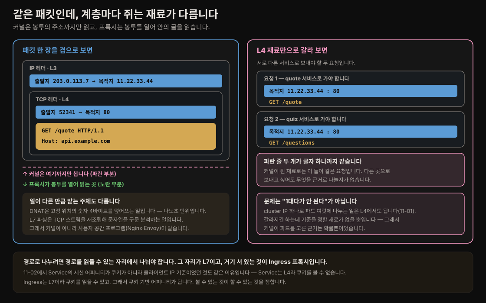
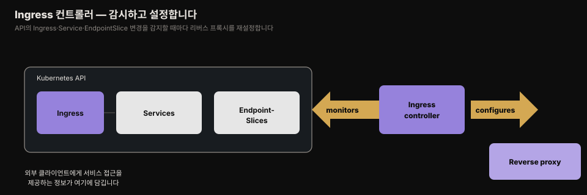
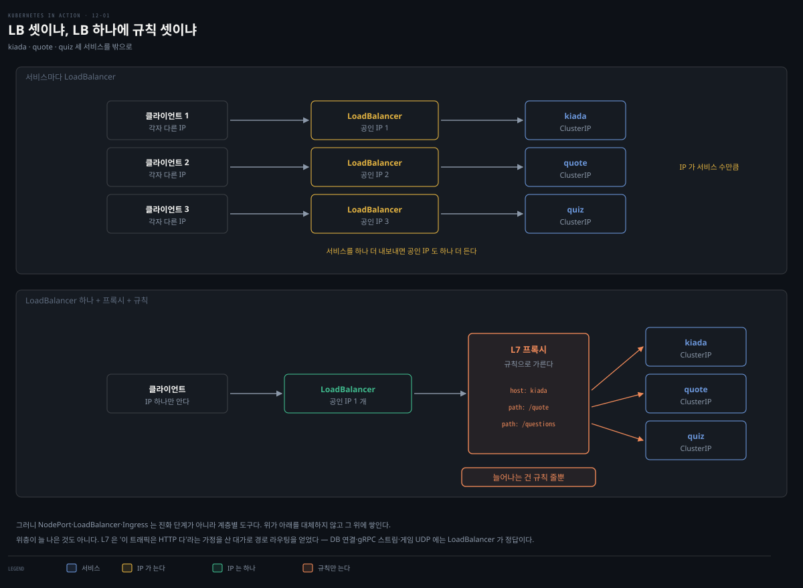
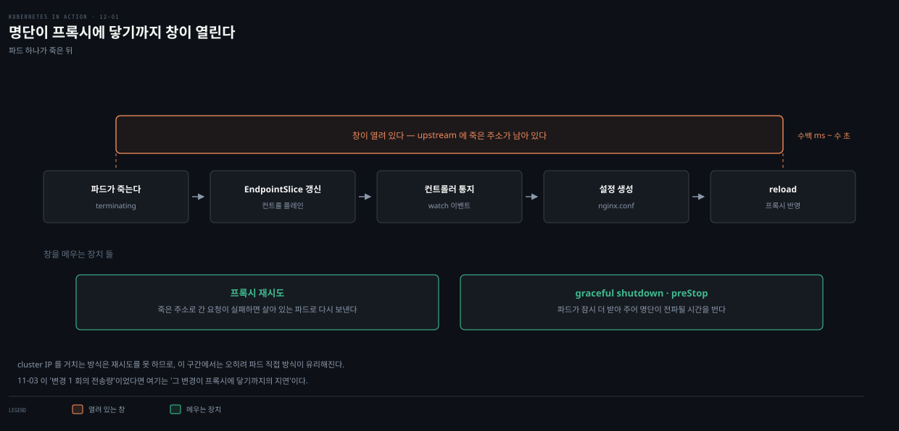
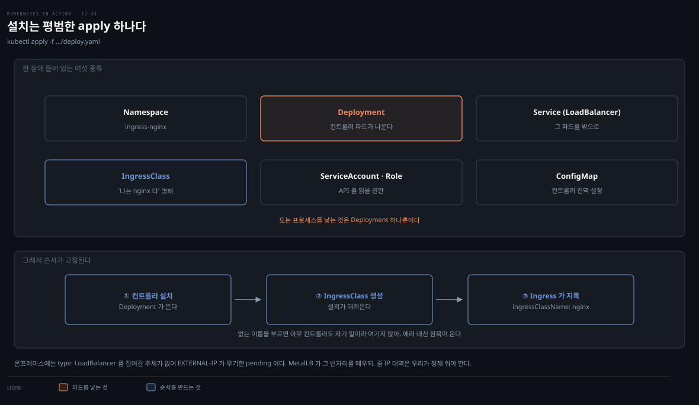
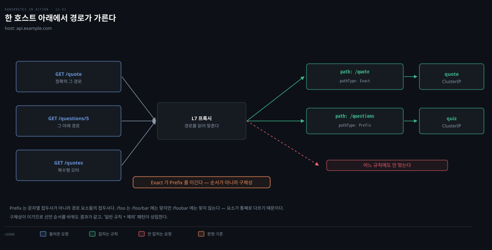
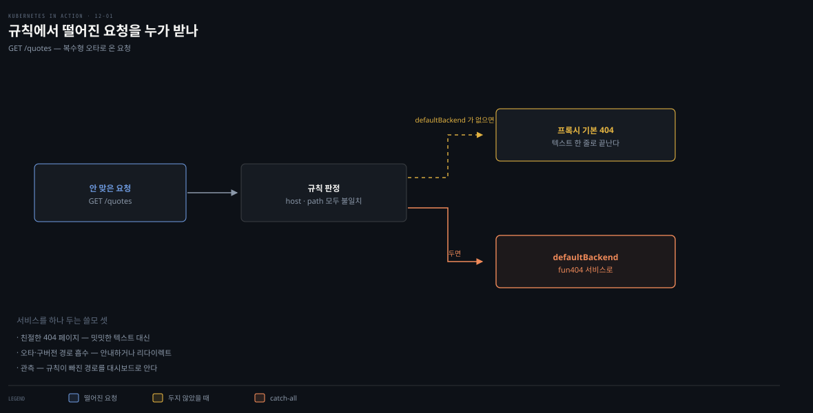
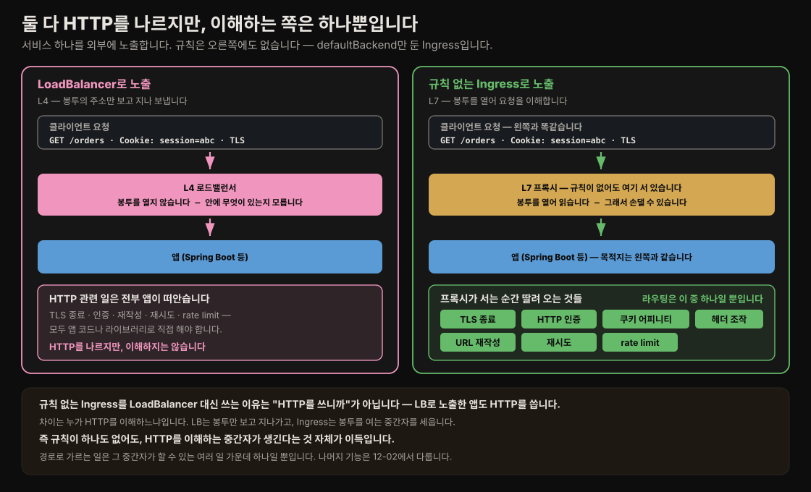

# Ingress로 여러 서비스를 한 IP에 노출하기
---
> LoadBalancer는 서비스마다 공인 IP가 하나씩 필요해 서비스가 많아지면 비용이 커집니다. Ingress는 단 하나의 IP로 여러 서비스를 노출하고, HTTP 호스트·경로로 어느 서비스로 보낼지 정합니다.

이 문서를 읽고 나면 Ingress·Ingress 컨트롤러·리버스 프록시 세 요소의 역할을 구분하고, 호스트·경로 규칙으로 여러 서비스를 한 IP에 노출하며, pathType 세 종류의 매칭 규칙과 default backend를 근거와 함께 설명할 수 있습니다.


## 진입 — 왜 Ingress인가

> LoadBalancer 서비스를 서비스마다 하나씩 두면 공인 IP가 그만큼 필요합니다. 
>
> Ingress는 하나의 IP 뒤에서 L7 프록시가 HTTP 요청을 뜯어 알맞은 서비스로 보내므로, IP 하나로 끝납니다.


[11-02](./11-02.%EC%99%B8%EB%B6%80%20%EB%85%B8%EC%B6%9C%20%E2%80%94%20NodePort%C2%B7LoadBalancer%C2%B7%ED%8A%B8%EB%9E%98%ED%94%BD%20%EC%A0%95%EC%B1%85.md)에서 LoadBalancer 서비스로 파드를 외부에 노출했습니다. 서비스 하나면 괜찮지만, 서비스가 많아지면 각자 공인 IP를 요구해 문제가 됩니다. Ingress는 IP 하나로 여러 서비스를 노출하고, HTTP 인증·쿠키 기반 세션 어피니티·URL 재작성처럼 Service가 못 하는 기능도 제공합니다.


## 1. Ingress를 이루는 세 요소

> **Ingress 기능은 세 요소로 나뉩니다** — 설정을 담는 Ingress API 오브젝트, 트래픽을 실제로 넘기는 L7 프록시, 그리고 둘을 잇는 Ingress 컨트롤러입니다.

쿠버네티스에서 Ingress는 외부 클라이언트가 클러스터 안 서비스에 접근하는 길입니다. 세 요소로 이뤄집니다.

- **Ingress API 오브젝트** — Ingress를 정의·설정
- **L7 로드밸런서(리버스 프록시)** — 백엔드 서비스로 트래픽 라우팅
- **Ingress 컨트롤러** — API를 감시하며 프록시를 배치·설정

L4(전송 계층 TCP·UDP)와 L7(응용 계층 HTTP)은 OSI 모델의 계층입니다. 포워드 프록시가 나가는 트래픽을 다루고 클라이언트 곁에 있는 것과 달리, 리버스 프록시는 들어오는 트래픽을 받아 백엔드 서버로 라우팅하며 그 서버들 곁에 있습니다. **흔히 "Ingress 컨트롤러"라는 말로 프록시와 컨트롤러를 한 덩어리로 부르지만, 둘은 별개 컴포넌트입니다.**

### L4가 보는 것과 L7이 보는 것

이 구분이 왜 Ingress를 필요하게 만드는지는 패킷 한 장을 겹으로 놓고 보면 잡힙니다.



봉투에 비유하면 **커널은 겉면의 주소**까지만 읽고, **프록시는 봉투를 열어 안에 적힌 글**을 읽습니다. 그래서 `/quote` 요청과 `/questions` 요청은 커널이 보기에 **완전히 같은 요청**입니다. 목적지가 둘 다 `11.22.33.44:80`이라 구별할 근거가 없습니다.

- 여기서 오해가 하나 걷힙니다. Ingress가 필요한 이유는 "IP 하나로 여러 곳에 못 보내서"가 아닙니다. 
- cluster IP 하나가 파드 여럿을 뒷받침하는 일은 [11-01](./11-01.Service%20%EA%B8%B0%EC%B4%88%20%E2%80%94%20%ED%8C%8C%EB%93%9C%20%ED%86%B5%EC%8B%A0%C2%B7ClusterIP%C2%B7%EC%84%B8%EC%85%98%20%EC%96%B4%ED%94%BC%EB%8B%88%ED%8B%B0.md)에서 봤듯 L4에서도 됩니다.

문제는 **갈라지긴 하는데 기준을 정할 재료가 없다**는 것입니다. 커널이 파드를 고른 근거가 확률뿐이었던 이유가 여기 있습니다.

일의 성격이 다른 만큼 맡는 주체도 갈립니다. DNAT은 헤더의 고정된 자리에 있는 숫자를 덮어쓰는 일이라 나노초 단위로 끝나지만, L7 파싱은 TCP 스트림을 재조립해 문자열을 구문 분석하는 일입니다. 그래서 후자는 커널이 하지 않고 사용자 공간 프로그램인 Nginx·Envoy가 맡습니다.

[11-02](./11-02.%EC%99%B8%EB%B6%80%20%EB%85%B8%EC%B6%9C%20%E2%80%94%20NodePort%C2%B7LoadBalancer%C2%B7%ED%8A%B8%EB%9E%98%ED%94%BD%20%EC%A0%95%EC%B1%85.md)에서 Service의 세션 어피니티가 쿠키가 아니라 클라이언트 IP 기준이었던 것도 같은 이유입니다. Service는 L4라 쿠키를 볼 수 없었습니다. Ingress는 L7이라 쿠키를 읽을 수 있고, 그래서 쿠키 기반 어피니티가 됩니다. 볼 수 있는 것이 할 수 있는 것을 정합니다.

> OSI 계층 일반론과 TCP/IP 상세는 이 편의 소관이 아닙니다. 여기서는 L4와 L7을 가르는 데 필요한 만큼만 봤습니다.

> **용어 주의.** LoadBalancer 서비스의 트래픽을 다루는 L4 로드밸런서와 헷갈리지 않게, 이 편에서는 L7 로드밸런서를 프록시라 부릅니다. Ingress가 백엔드 파드 하나로만 라우팅하면 부하 분산은 일어나지 않습니다.

### 11장과 구조가 같고, 배우만 바뀝니다

세 요소를 처음 보면 새 구조 같지만, 11장에서 이미 본 것과 같은 골격입니다. **선언하는 오브젝트 · 그것을 감시해 설정을 만드는 컨트롤러 · 실제로 트래픽을 나르는 집행자**로 나뉘는 구조가 그대로 반복됩니다.

| 요소 | 하는 일 | 11장의 대응물 |
|---|---|---|
| Ingress 오브젝트 | 규칙 선언(호스트·경로 → 서비스) | Service 오브젝트 |
| Ingress 컨트롤러 | Ingress·Service·EndpointSlice 감시 → 프록시 설정 생성 | kube-proxy (감시 → 설정) |
| L7 프록시 | HTTP를 받아 파싱·라우팅 | 노드 커널의 DNAT 규칙 |

- 달라진 것은 나르는 주체뿐입니다. 11장에서는 커널이 규칙을 받아 패킷을 넘겼고, 여기서는 파드로 도는 프로그램이 HTTP를 읽어 넘깁니다.

그래서 ⛔ **kube-proxy가 Ingress를 처리한다고 오해하기 쉬운데, kube-proxy는 Ingress를 감시하지 않습니다.** Service와 EndpointSlice만 봅니다. 이유는 앞 절과 이어집니다 — kube-proxy가 심을 수 있는 규칙은 "목적지 IP:port가 X면 Y로" 형태뿐이라, "경로가 `/quote`면"이라는 조건을 적을 자리가 없습니다. 조건을 쓸 문법이 없으니 그 일을 맡을 수도 없습니다.


## 2. Ingress 컨트롤러의 역할

> **컨트롤러는 API 서버에 붙어 Ingress·Service·Endpoints(또는 EndpointSlice) 오브젝트를 감시합니다.** 
>
> 이들을 만들거나 고치거나 지우면 컨트롤러가 통지받아, 그 정보를 프록시 설정으로 변환하고 새 프록시를 세운 뒤 외부에서 닿게 합니다 — 프록시가 클러스터 안 파드로 돌면 대개 LoadBalancer 서비스를 만들어 외부에 노출합니다.



### 프록시도 파드다 — LoadBalancer 위에 얹힌다

마지막 구절이 지나가듯 적혀 있지만 Ingress 구조의 핵심입니다. **프록시 자신도 클러스터 안 파드라서, 외부에 나가려면 결국 LoadBalancer가 필요합니다.**



- 그래서 Ingress는 LoadBalancer를 **없앤 게 아니라 그 위에 얹힌 것**입니다. 서비스 셋에 LB 셋이 아니라, **LB 하나 + 프록시 + 규칙 셋**이 됩니다. 서비스를 더 내보내도 늘어나는 것은 규칙 줄 수뿐이라 공인 IP도 요금도 그대로입니다.

이 점이 정리되면 자연스럽게 따라오는 물음이 있습니다 — NodePort·LoadBalancer·Ingress는 L3에서 L7으로 가는 진화 단계인가. **아닙니다. 진화가 아니라 계층별 도구입니다.** 위가 아래를 대체하지 않고 그 위에 쌓입니다. 방금 본 그림에서 LoadBalancer가 사라지지 않고 프록시 앞에 그대로 남아 있는 것이 그 증거입니다.

그리고 위층이 늘 나은 것도 아닙니다. L7은 **"이 트래픽은 HTTP다"라는 가정을 산 대가로** 경로 라우팅을 얻었습니다. 그 가정이 틀린 트래픽에는 쓸 수 없습니다.

- 데이터베이스 연결
- gRPC 스트림
- 게임의 UDP

이런 트래픽에는 LoadBalancer가 정답입니다.

### 설정은 실제로 어떻게 만들어지나

"프록시 설정으로 변환한다"는 말이 추상적으로 들리는데, Nginx 기반 컨트롤러라면 하는 일은 **텍스트 파일을 쓰는 것**입니다. Ingress YAML을 읽어 `nginx.conf`를 만들고, 프록시 파드에 쓴 뒤 reload를 겁니다.

```nginx
server {
    listen 80;
    server_name api.example.com;      # ← Ingress의 host 규칙에서
    location = /quote {               # ← path + pathType: Exact ("="가 정확 일치)
        proxy_pass http://upstream_quote;
    }
}
upstream upstream_quote {             # ← EndpointSlice에서 가져온 파드 IP
    server 10.244.1.10:80;
    server 10.244.2.8:80;
}
```

YAML의 각 필드가 어느 지시자로 옮겨 가는지 한눈에 보입니다.

- `host` → `server_name`
- `path` + `pathType` → `location`의 형태
- 백엔드 서비스 → `upstream` 블록

특히 **`upstream`에 cluster IP가 아니라 파드 IP가 적힌다**는 점을 눈여겨봅니다. 다음 절에서 다룰 "파드로 직접 보낸다"가 여기서 이미 드러납니다.

Envoy 기반 구현(Contour·Emissary)은 파일 대신 xDS API로 설정을 밀어 넣습니다. 문법과 전달 방식은 달라도 **감시해서 설정을 만들어 프록시에 넘긴다**는 일 자체는 같습니다.

### 프록시가 트래픽을 서비스로 넘기는 법

> 프록시 설정에는 가상 호스트 목록과 각 호스트의 엔드포인트 IP 목록이 들어갑니다. 클라이언트가 붙으면 프록시가 요청 경로·헤더로 파드 같은 엔드포인트를 골라 라우팅합니다. 
>
> <u>주목할 점은 프록시가 서비스 IP가 아니라 **파드로 직접** 요청을 보낸다는 것입니다.</u> — 대부분의 Ingress 구현이 이렇게 동작합니다.

이게 가능한 이유는 앞 절에 이미 나왔습니다. 컨트롤러가 EndpointSlice를 감시하므로 **프록시는 파드 IP 명단을 이미 손에 쥐고 있습니다.** cluster IP에 다시 물어볼 이유가 없습니다.

얻는 것은 홉 하나를 줄이는 데서 그치지 않습니다.


프록시가 요청을 파싱해 "이건 카나리로 보낸다"고 정했다고 해 봅니다. 그런데 그 요청을 cluster IP로 넘기면, 커널은 L4라 그 판단을 읽지 못하고 파드를 **확률로 다시 고릅니다.** 애써 파싱해 내린 결정이 그 지점에서 버려집니다. **판단하는 주체와 목적지를 정하는 주체가 갈리면, 판단은 버려집니다.**

파드로 직접 보내면 부하 분산의 주인이 커널에서 프록시로 옮겨 옵니다. 그 차이가 기능으로 드러나는 곳이 넷입니다.

| | 커널(cluster IP 경유) | L7 프록시(파드 직접) |
|---|---|---|
| 선택 방식 | 확률(iptables random) | 라운드로빈·least-conn·가중치 |
| 세션 어피니티 | 클라이언트 IP만 | 쿠키 기반 |
| 재시도 | 못 합니다 | 실패하면 다른 파드로 |
| 카나리 | 파드 개수 비율로 대략 | 트래픽 % 정밀 지정 |

[11-01](./11-01.Service%20%EA%B8%B0%EC%B4%88%20%E2%80%94%20%ED%8C%8C%EB%93%9C%20%ED%86%B5%EC%8B%A0%C2%B7ClusterIP%C2%B7%EC%84%B8%EC%85%98%20%EC%96%B4%ED%94%BC%EB%8B%88%ED%8B%B0.md)에서 "정밀한 % 카나리는 L7이 필요하다"고 미뤄 둔 이야기가 여기서 채워집니다. 파드 개수로 비율을 맞추면 10%를 만들려고 파드를 아홉 개와 한 개로 두어야 하지만, 프록시는 트래픽 자체를 나누므로 파드 수와 무관하게 비율을 정합니다.

### 파드 IP를 직접 쓰면 11장 원칙과 어긋나지 않나

[11-01](./11-01.Service%20%EA%B8%B0%EC%B4%88%20%E2%80%94%20%ED%8C%8C%EB%93%9C%20%ED%86%B5%EC%8B%A0%C2%B7ClusterIP%C2%B7%EC%84%B8%EC%85%98%20%EC%96%B4%ED%94%BC%EB%8B%88%ED%8B%B0.md)에서 파드 IP를 직접 쓰지 말라고 배웠는데, 여기서는 프록시가 바로 그렇게 합니다. 모순처럼 보이지만 아닙니다.

11-01이 파드 IP를 금한 이유는 **클라이언트가 그 주소를 알아낼 방법도, 바뀐 걸 알아챌 방법도 없어서**였습니다. 프록시는 둘 다 가지고 있습니다

-  IP를 붙잡아 두는 게 아니라 EndpointSlice를 watch하며 명단을 구독합니다. cluster IP를 쓰든 파드 IP를 쓰든 변화를 추적하는 메커니즘은 같고(kube-proxy도 같은 명단으로 규칙을 고칩니다), 차이는 명단을 커널이 쥐느냐 프록시가 쥐느냐뿐입니다.

진짜 위험은 다른 데 있습니다.



- 파드가 죽어도 그 사실이 프록시 설정에 반영되기까지 시간이 걸립니다. EndpointSlice 갱신부터 컨트롤러 통지, 설정 생성, reload까지 수백 밀리초에서 수 초입니다. 그동안 `upstream` 목록에는 죽은 주소가 남아 있어 요청이 그리로 갑니다. **위험한 것은 IP가 바뀌는 게 아니라 바뀐 걸 아는 데 걸리는 시간입니다.**

그 창을 메우는 장치가 둘입니다. 

1.  **프록시 재시도**로, 죽은 파드로 간 요청이 실패하면 살아 있는 다른 파드로 다시 보냅니다 — cluster IP 방식은 못 하는 일이라, 오히려 파드 직접 방식이 유리해지는 지점입니다.
2. **graceful shutdown과 preStop hook**으로, 파드가 곧바로 죽지 않고 잠시 요청을 더 받아 주어 명단이 전파될 시간을 법니다.

EndpointSlice 변경 한 번이 어느 규모로 퍼지는지는 [11-03](./11-03.%EC%97%94%EB%93%9C%ED%8F%AC%EC%9D%B8%ED%8A%B8%C2%B7DNS%C2%B7%ED%86%A0%ED%8F%B4%EB%A1%9C%EC%A7%80%C2%B7readiness.md)에서 다뤘습니다. 그쪽이 "변경 1회의 전송량"이라면, 여기는 "그 변경이 프록시에 닿기까지의 지연"입니다.

> **Spring 관점.** Boot 앱 여러 개를 하나의 도메인 아래 경로로 나눠 노출할 때(예: `api.example.com/orders`·`/payments`) Ingress가 딱 맞습니다. 
>
> 앱마다 LoadBalancer를 두는 대신 Ingress 하나로 묶으면 클라우드 LB 비용이 IP 하나로 줄어듭니다. Spring Cloud Gateway를 앱 안에 두는 것과 달리, Ingress는 클러스터 인프라 계층에서 라우팅을 담당합니다.


## 3. Ingress 컨트롤러 설치

> 모든 클러스터가 Ingress를 기본 지원하지는 않습니다. 매니지드 클러스터는 대개 컨트롤러가 이미 있고, 없으면 Nginx Ingress 컨트롤러 등을 직접 설치합니다.

Ingress는 클러스터 애드온인 Ingress 컨트롤러가 제공합니다. GKE는 GLBC, AWS는 AWS Load Balancer Controller, Azure는 AGIC를 제공합니다. 없으면 직접 설치하며, 원서는 쿠버네티스 메인테이너가 만든 Nginx Ingress 컨트롤러를 씁니다(Nginx 저작자판과 별개이며, 입문자는 전자로 시작하는 게 낫습니다).

```bash
# kind 클러스터에 Nginx Ingress 컨트롤러 설치 (80·443을 호스트로 매핑하는 설정 필요)
kubectl apply -f https://raw.githubusercontent.com/kubernetes/ingress-nginx/main/deploy/static/provider/kind/deploy.yaml

# Minikube: minikube addons enable ingress (+ minikube tunnel)
```

- 컨트롤러 목록은 공식 문서의 [Ingress controllers](https://kubernetes.io/docs/concepts/services-networking/ingress-controllers/)에 있습니다. 
- Nginx·Ambassador·Contour·Traefik이 인기 있고, 대부분 Nginx·HAProxy·Envoy를 리버스 프록시로 씁니다.

### 설치가 실제로 만드는 것

"설치"라는 말이 특별한 절차처럼 들리지만, 위 명령이 하는 일은 **평범한 `kubectl apply`**입니다. 그 YAML 한 장에 여러 종류의 오브젝트가 들어 있을 뿐입니다.



| 오브젝트 | 무엇을 하나 |
|---|---|
| Namespace | `ingress-nginx` 네임스페이스를 만듭니다 |
| **Deployment** | **컨트롤러 파드가 여기서 나옵니다** |
| Service (LoadBalancer) | 그 파드를 외부에 노출합니다 |
| **IngressClass** | "나는 nginx다"라는 명패를 세웁니다 |
| ServiceAccount·Role·RoleBinding | 컨트롤러가 API를 읽을 권한을 줍니다 |
| ConfigMap | 컨트롤러 전역 설정을 담습니다 |

- 이 목록에서 **파드를 낳는 것은 Deployment 하나뿐**입니다. 나머지는 도는 프로세스가 없는 선언물입니다 — IngressClass는 이름표이고 Role은 권한 규칙일 따름입니다.

#### 그 로드밸런서는 누가 만드나

위 표에서 눈여겨볼 줄이 `Service (LoadBalancer)`입니다. 앞의 전체 흐름도에서 프록시 앞에 서 있던 로드밸런서가 **여기서 나옵니다.** 다만 컨트롤러가 그것을 직접 만드는 것은 아닙니다. 설치 YAML은 `type: LoadBalancer` Service를 선언할 뿐이고, 그 선언을 보고 실물을 띄우는 것은 **따로 있습니다.**

```pseudocode
컨트롤러 설치 YAML
  ├─ Deployment              → 컨트롤러 파드가 뜹니다
  └─ Service(LoadBalancer)   → "누가 이 파드를 외부에 내보내 주세요"
                                      ↓ 이 선언을 집어가는 쪽
                              클라우드 컨트롤러 매니저 → 실물 LB 프로비저닝
```

그 "집어가는 쪽"이 환경마다 다릅니다. AWS·GCP·Azure에서는 각 클라우드의 컨트롤러 매니저가 그 일을 하고, 잠시 뒤 `EXTERNAL-IP`에 공인 IP가 채워집니다. **온프레미스에는 그 역할을 할 주체가 아예 없습니다.** 그래서 Service를 만들어도 아무도 집어가지 않고 `EXTERNAL-IP`가 `<pending>`인 채로 남습니다 — 무기한입니다.[^metallb]

**MetalLB를 쓰는 이유가 정확히 이 빈자리입니다.** 클라우드 컨트롤러 매니저가 하던 일을 대신 맡아, `<pending>` 상태의 Service를 집어가 IP를 배정합니다. 다만 클라우드와 달리 **줄 IP를 우리가 정해 줘야 합니다.** 클라우드는 자기 IP 풀이 있지만 사내망 대역은 MetalLB가 알 길이 없기 때문입니다. `IPAddressPool`로 대역을 주고, L2 모드라면 `L2Advertisement`까지 만들어야 실제로 광고가 나갑니다 — 둘 중 하나라도 없으면 MetalLB는 가만히 있습니다.

| | 클라우드(AWS·GCP·Azure) | 온프레미스 |
|---|---|---|
| `type: LoadBalancer`를 집어가는 주체 | 클라우드 컨트롤러 매니저 | 없음 → **MetalLB 등을 따로 설치** |
| IP는 어디서 오나 | 클라우드가 알아서 배정 | **내가 대역을 지정** (`IPAddressPool`) |
| 안 하면 | — | `EXTERNAL-IP`가 `<pending>`으로 무기한 |

⚠️ 다만 **AWS Load Balancer 컨트롤러는 이 그림에서 벗어납니다.** 아래 「만들어지는 프록시는 어디에 서나」에서 보듯 그 구현은 클러스터 안에 프록시를 두지 않고 ALB 자체가 프록시 노릇을 하므로, `type: LoadBalancer` Service를 거치지 않고 컨트롤러가 AWS API를 직접 호출합니다. **LB가 곧 프록시라 층이 하나 접히는** 경우입니다.

여기서 순서 하나가 고정됩니다. **IngressClass는 컨트롤러 설치가 데려오는 것이지, Ingress를 만들어서 생기는 것이 아닙니다.**

```pseudocode
① 컨트롤러 설치  →  ② IngressClass 자동 생성  →  ③ Ingress가 그 이름을 지목
```

①②가 먼저 서 있어야 ③이 의미를 갖습니다. 다음 절에서 "ADDRESS가 안 뜨면 `ingressClassName`을 확인하라"고 하는 증상이 이 순서를 어겼을 때 나옵니다 — 없는 이름을 부르면 아무 컨트롤러도 자기 일이라 여기지 않고, 그래서 에러 대신 침묵이 옵니다.

### 만들어지는 프록시는 어디에 서나

앞 절에서 컨트롤러가 "프록시 설정을 만든다"고 했는데, 그 결과물이 **구현마다 다른 곳에 놓입니다.**

| 구현 | 설정이 향하는 곳 | 프록시가 서는 자리 |
|---|---|---|
| Nginx 컨트롤러 | `nginx.conf` 파일을 쓰고 reload | 클러스터 안 파드 |
| Envoy 기반(Contour) | xDS API로 밀어 넣기 | 클러스터 안 파드 |
| AWS Load Balancer 컨트롤러 | **AWS API 호출** | **클러스터 밖** (AWS 인프라) |

앞의 둘은 프록시가 이미 파드로 돌고 있고 그 설정만 갈아 끼웁니다. 반면 ALB 컨트롤러는 클러스터 안에 프록시를 두지 않고, AWS에 실제 로드밸런서를 프로비저닝합니다. 콘솔에 실물이 뜨는 쪽이 이 경우입니다.

이 차이가 뒤에서 한 번 더 나옵니다. 프록시가 클러스터 안 파드면 그 앞의 LoadBalancer도 하나라 여러 Ingress가 나눠 쓰지만, 프록시 자체가 클라우드 LB인 구현에서는 **Ingress마다 LB가 하나씩** 생깁니다. §6에서 "대부분 구현은 Ingress마다 공인 IP를 요구한다"고 말하는 근거가 여기 있습니다.


## 4. Ingress로 서비스 노출하기

> Ingress 오브젝트는 하나 이상의 Service를 이름으로 참조합니다. 규칙 하나로 특정 호스트의 모든 요청을 한 서비스로 보낼 수 있습니다.

Ingress로 노출하는 서비스는 대개 ClusterIP로 둡니다(일부 구현은 NodePort를 요구). kiada 서비스를 `kiada.example.com`에 노출하는 최소 Ingress입니다.

```yaml
apiVersion: networking.k8s.io/v1
kind: Ingress
metadata:
  name: kiada-example-com     # 호스트와 같을 필요는 없지만 반영하길 권장
spec:
  rules:
  - host: kiada.example.com   # Host 헤더가 이 값인 요청에 매칭
    http:
      paths:
      - path: /
        pathType: Prefix      # 경로 무관 전부 매칭
        backend:
          service:
            name: kiada       # 이름으로 서비스 참조
            port:
              number: 80      # 이 서비스의 80 포트로 포워딩
```

이 규칙은 `kiada.example.com`으로 온 모든 요청을 경로와 무관하게 kiada 서비스의 80 포트로 넘깁니다. GKE에서는 Ingress 이름에 점을 넣으면 안 됩니다(로드밸런서 이름 검증 실패).

### 공인 IP 확인과 접근

```bash
kubectl get ingresses     # 약어 ing
# NAME                CLASS   HOSTS               ADDRESS       PORTS   AGE
# kiada-example-com   nginx   kiada.example.com   11.22.33.44   80      30s
```

ADDRESS가 클라이언트가 요청을 보낼 L7 프록시의 IP입니다(status.loadBalancer.ingress에도 있음). 주소가 몇 분 뒤에도 안 뜨면 어떤 컨트롤러도 이 Ingress를 처리하지 않은 것이니, 컨트롤러 실행 여부와 `ingressClassName` 지정 여부를 확인합니다.

Ingress는 가상 호스팅으로 라우팅하므로, 요청의 Host 헤더가 규칙과 맞아야 원하는 결과가 나옵니다. curl은 `--resolve`로 DNS·hosts 파일 없이 접근할 수 있습니다.

```bash
# --resolve로 kiada.example.com을 Ingress IP로 매핑 (DNS/hosts 불필요)
curl --resolve kiada.example.com:80:11.22.33.44 http://kiada.example.com
```

브라우저로 쓰려면 `/etc/hosts`에 `11.22.33.44  kiada.example.com`을 추가합니다. 운영 클러스터에서는 도메인 DNS에 Ingress IP를 가리키는 A 레코드를 넣습니다.


## 5. 경로 기반 라우팅과 pathType

> 한 Ingress에 여러 규칙·경로를 담아 여러 호스트·경로를 여러 서비스로 매핑할 수 있습니다. pathType이 Exact·Prefix·ImplementationSpecific 중 무엇이냐에 따라 매칭 방식이 달라집니다.



quote·quiz 서비스를 같은 호스트 `api.example.com` 아래 경로로 나눠 노출합니다 — `/quote`는 quote로, `/questions`로 시작하면 quiz로 보냅니다.

```yaml
spec:
  rules:
  - host: api.example.com
    http:
      paths:
      - path: /quote
        pathType: Exact        # 정확히 /quote인 요청만
        backend:
          service:
            name: quote
            port:
              name: http       # 포트를 이름으로도 참조 가능
      - path: /questions
        pathType: Prefix       # /questions로 시작하는 요청
        backend:
          service:
            name: quiz
            port:
              name: http
```

기본적으로 Ingress 프록시는 URL을 재작성하지 않습니다 — 클라이언트가 `/quote`를 요청하면 백엔드로도 `/quote`가 갑니다(일부 구현은 재작성 규칙 제공).

### pathType 세 종류

| pathType | 매칭 방식 |
|----------|-----------|
| Exact | 요청 경로가 규칙 경로와 정확히 일치(대소문자 구분) |
| Prefix | 요청 경로가 규칙 경로로 시작(요소 단위 비교, 대소문자 구분) |
| ImplementationSpecific | 컨트롤러 구현에 따름(예: GKE는 `/foo/*` 와일드카드) |

- 한 규칙에 여러 경로가 있고 요청이 둘 이상 매칭되면 Exact가 우선합니다. Prefix는 문자열이 아니라 `/`로 쪼갠 **요소 단위**로 비교하는 점이 함정입니다.
- `/foo`는 `/foo/bar`에 매칭되지만 `/foobar`에는 매칭되지 않습니다.

Exact가 이기는 기준은 **구체성**입니다. Exact `/quote`는 딱 그 경로 하나만 잡지만 Prefix `/quote`는 `/quote/*` 아래를 무한히 잡으므로, 좁게 지정한 쪽의 의도를 존중합니다. 그래서 **선언 순서를 바꿔도 결과는 같습니다** — Prefix 규칙을 YAML 위쪽에 올려도 Exact가 이깁니다. 방화벽 규칙이나 `if-else`처럼 먼저 걸린 것이 이기는 방식이 아닙니다.

반대로 Prefix가 이긴다면 어떻게 될지 생각해 보면 이 설계가 합리적인 이유가 보입니다. 넓은 규칙 하나를 거는 순간 세밀한 예외를 걸 수 없게 됩니다 — `/api` 전부를 한 서비스로 보내면서 `/api/health`만 다른 곳으로 빼는 일이 불가능해집니다. 구체성이 이기기 때문에 **"일반 규칙 + 예외" 패턴이 성립합니다.** 순서와 무관하다는 점은 §5에서 여러 Ingress의 규칙을 한 오브젝트로 합칠 때도 안전을 보장합니다.

요소 단위 비교는 표로 놓고 보면 분명해집니다. 규칙 `/foo`는 요소가 `["foo"]` 하나입니다.

같은 원리가 호스트에도 그대로 적용됩니다. 쪼개는 구분자만 다릅니다 — 경로는 `/`로, 호스트는 `.`으로 나눕니다. 아래 표에서 위 네 줄은 경로, 아래 세 줄은 호스트입니다.

| 규칙 | 요청 | 요소 분해 | 판정 |
|---|---|---|---|
| `/foo` (Prefix) | `/foo/bar` | `["foo","bar"]` | 첫 요소 `foo` 일치 → 매칭 ✅ |
| `/foo` (Prefix) | `/foobar` | `["foobar"]` | `"foobar"` ≠ `"foo"` → 불일치 ❌ |
| `/foo` (Prefix) | `/foo` | `["foo"]` | 완전 일치 → 매칭 ✅ |
| `/foo` (Prefix) | `/fooxyz/bar` | `["fooxyz","bar"]` | 첫 요소 불일치 → 불일치 ❌ |
| `*.example.com` | `kiada.example.com` | `[kiada, example, com]` | 3요소 · `*`가 `kiada` 하나를 덮음 → 매칭 ✅ |
| `*.example.com` | `foo.kiada.example.com` | `[foo, kiada, example, com]` | 4요소 · `*`가 둘을 못 덮음 → 불일치 ❌ |
| `*.example.com` | `example.com` | `[example, com]` | 2요소 · `*`가 덮을 요소가 없음 → 불일치 ❌ |

이름이 "Prefix"라 문자열 접두사로 읽히는 게 함정입니다. 정확히는 **경로 요소들의 접두사**입니다.

호스트 쪽에는 함정이 하나 더 있습니다. **Prefix는 뒤에 요소가 더 붙어도 매칭되지만, 와일드카드 `*`는 요소 개수가 고정입니다.** `*.example.com`은 정확히 세 요소짜리 이름만 받습니다.

- 하나 많아도 어긋납니다 — `foo.kiada.example.com`
- 하나 적어도 어긋납니다 — `example.com`

그래서 `example.com` 자체까지 받으려면 규칙을 따로 써야 합니다. 와일드카드 문법은 [§5](#5-규칙-여럿을-한-ingress로-통합)에서 다시 다룹니다.

실무에서는 이 차이가 404로 나타납니다. `/api`를 Prefix로 걸면 `/api/v1/users`는 잡히지만 **`/apiv2/orders`는 안 잡힙니다.** "prefix니까 되겠지"로 넘어가면 배포 후에야 발견합니다.


## 6. 규칙 여럿을 한 Ingress로 통합

> Ingress 오브젝트는 규칙을 여러 개 담을 수 있으므로, 여러 Ingress를 하나로 합쳐 공인 IP를 하나만 쓸 수 있습니다.

대부분 구현은 Ingress마다 공인 IP를 요구하므로, 두 Ingress를 쓰면 IP도 둘입니다. 규칙을 한 오브젝트에 모으면 IP 하나로 Kiada suite 전체를 처리합니다.

```yaml
spec:
  rules:
  - host: kiada.example.com      # 첫째 규칙: kiada 서비스로
    http:
      paths:
      - {path: /, pathType: Prefix, backend: {service: {name: kiada, port: {name: http}}}}
  - host: api.example.com        # 둘째 규칙: 경로로 quote·quiz 분기
    http:
      paths:
      - {path: /quote, pathType: Exact, backend: {service: {name: quote, port: {name: http}}}}
      - {path: /questions, pathType: Prefix, backend: {service: {name: quiz, port: {name: http}}}}
```

- host 필드는 와일드카드를 지원합니다 — `*.example.com`은 `kiada.example.com`·`api.example.com`에 매칭되지만 `foo.kiada.example.com`(요소 둘)이나 `example.com`에는 매칭되지 않습니다. 
- 와일드카드는 DNS 이름 한 요소만 덮기 때문입니다. host를 아예 생략하면 모든 호스트에 매칭됩니다.

이 판정이 §4의 경로 매칭과 **같은 요소 단위 원리**입니다. 요소 분해를 나란히 놓은 표는 [§4](#4-경로-기반-라우팅과-pathtype)에 있습니다. host 생략은 와일드카드보다도 넓은 catch-all이라, 다음 절의 defaultBackend와 짝을 이룹니다.


## 7. default backend — 매칭 안 되는 요청

> 어떤 규칙에도 맞지 않는 요청은 기본적으로 404를 받지만, **defaultBackend**를 두면 그 요청을 지정 서비스로 보내는 catch-all이 됩니다.



`spec.defaultBackend`에 서비스 이름·포트를 적으면, 규칙에 안 맞는 요청이 그리로 갑니다.

```yaml
spec:
  defaultBackend:            # 규칙에 안 맞으면 여기로
    service:
      name: fun404
      port:
        name: http
  rules:
  ...
```

일부 구현은 명시 안 하면 `kube-system`의 `default-http-backend`를 씁니다.

### default backend는 왜 있어야 하나

404를 돌려주는 건 프록시가 이미 하는 일인데 왜 굳이 서비스를 하나 두는지 물을 만합니다. 쓸모가 셋입니다.

- **친절한 404 페이지** — 프록시 기본 404는 밋밋한 텍스트 한 줄입니다. 문서 예시의 서비스 이름이 `fun404`인 것이 이 용도를 드러냅니다
- **오타·구버전 경로 흡수** — `/quotes`처럼 복수형 오타로 온 요청을 그냥 버리지 않고 안내하거나 올바른 경로로 리다이렉트합니다
- **관측** — 매칭되지 않은 요청을 한곳에 모으면 "어떤 경로로 오는데 규칙이 없는가"를 집계할 수 있습니다. 라우팅 설정 누락을 발견하는 통로가 됩니다

세 번째가 실무에서 특히 값합니다. 규칙이 빠진 것을 사용자 문의로 아는 것과 대시보드로 아는 것은 대응 속도가 다릅니다.

### 규칙 없는 Ingress를 LoadBalancer 대신 쓰는 이유

규칙 없이 defaultBackend만 둔 Ingress로 모든 트래픽을 한 서비스에 보낼 수도 있습니다. 그러면 라우팅을 하나도 안 하는 셈인데, 그래도 LoadBalancer보다 나은 이유가 있습니다.

흔한 오해는 "Ingress는 HTTP를 쓰니까"입니다. 그런데 **LoadBalancer로 노출한 앱도 HTTP를 씁니다.** 오가는 트래픽은 양쪽 다 똑같은 HTTP입니다.



- 차이는 **누가 HTTP를 이해하느냐**입니다. LoadBalancer는 L4라 봉투의 주소만 보고 지나 보내지만, Ingress는 L7 프록시를 세우므로 그 프록시가 요청을 열어 읽습니다. §1에서 본 [계층 차이](#1-ingress를-이루는-세-요소)가 여기서 다시 작동합니다.

그래서 **규칙이 하나도 없어도, HTTP를 이해하는 중간자가 생긴다는 것 자체가 이득입니다.** 그 중간자가 서는 순간 TLS 종료·HTTP 인증·쿠키 기반 세션 어피니티·헤더 조작·URL 재작성·재시도·rate limit이 인프라 계층에서 가능해집니다. 경로로 가르는 일은 그 중간자가 할 수 있는 여러 일 가운데 하나일 뿐입니다.

이 기능들을 실제로 켜는 방법은 [12-02](./12-02.Ingress%20TLS%C2%B7%EC%84%A4%EC%A0%95%C2%B7IngressClass.md)에서 다룹니다.


## 면접에서 받을 만한 질문

> 아래 질문에 먼저 스스로 답해 본 뒤, 챕터 끝의 정답과 맞춰 봅니다.

1. Ingress 기능을 이루는 세 요소는 무엇이며, "Ingress 컨트롤러"라는 말이 왜 혼동을 줄 수 있나요?
2. Ingress가 LoadBalancer 서비스보다 나은 점은 무엇인가요? IP 관점과 기능 관점에서 각각 말하세요.
3. Ingress 프록시가 요청을 서비스 IP가 아니라 파드로 직접 보내는 것이 일반적입니다. 이것이 무엇을 뜻하나요?
4. pathType Prefix에서 `/foo`가 `/foo/bar`에는 매칭되지만 `/foobar`에는 매칭되지 않는 이유는 무엇인가요?
5. default backend는 무엇이고, 규칙 없이 defaultBackend만 둔 Ingress를 LoadBalancer 대신 쓰는 이유는 무엇인가요?


## 정답 (자답 후 펼치기)

> 위 질문에 답해 본 다음 아래와 맞춰 봅니다. 순서는 질문과 1:1로 대응합니다.

### 정답 1 — Ingress의 세 요소

세 요소는 설정을 담는 Ingress API 오브젝트, 트래픽을 백엔드로 넘기는 L7 로드밸런서(리버스 프록시), 그리고 API를 감시하며 프록시를 배치·설정하는 Ingress 컨트롤러입니다. "Ingress 컨트롤러"라는 말이 흔히 프록시와 컨트롤러를 한 덩어리로 가리키지만, 둘은 별개 컴포넌트입니다 — 컨트롤러는 감시·설정 주체이고, 프록시는 실제 HTTP 트래픽을 처리하는 주체입니다.

### 정답 2 — Ingress가 LoadBalancer보다 나은 점

IP 관점에서, LoadBalancer는 서비스마다 공인 IP가 하나씩 필요해 서비스가 많아지면 비용이 커지지만, Ingress는 노출 서비스 개수와 무관하게 IP 하나로 끝납니다. 기능 관점에서, Ingress는 L7에서 동작하므로 HTTP 인증·쿠키 기반 세션 어피니티·URL 재작성·TLS 종료처럼 L4에서 동작하는 Service가 못 하는 기능을 제공합니다.

### 정답 3 — 파드로 직접 보내는 의미

Ingress 프록시는 Ingress·Service·EndpointSlice에서 엔드포인트 IP 목록을 얻어, 요청을 서비스의 cluster IP로 보내지 않고 파드 IP로 직접 보냅니다. 이는 프록시 자체가 엔드포인트를 알고 부하 분산까지 하므로, 서비스 cluster IP를 한 번 더 거치는 홉이 생략된다는 뜻입니다. 다만 이는 대부분의 구현이 그럴 뿐 구현에 따라 다를 수 있습니다.

### 정답 4 — Prefix의 요소 단위 매칭

Prefix는 요청 경로를 문자열로 보고 접두사인지 검사하지 않습니다. 규칙 경로와 요청 경로를 각각 `/`로 쪼개 요소끼리 비교합니다. `/foo`는 요소가 `["foo"]`이고 `/foo/bar`는 `["foo","bar"]`라 첫 요소가 일치하므로 매칭됩니다. 반면 `/foobar`는 요소가 `["foobar"]`로 `foo`와 다른 요소라 매칭되지 않습니다. `/fooxyz/bar`도 같은 이유로 매칭되지 않습니다.

### 정답 5 — default backend와 그 활용

default backend는 어떤 Ingress 규칙에도 맞지 않는 요청을 받는 catch-all 서비스입니다. `spec.defaultBackend`에 지정하며, 없으면 기본 404가 반환됩니다. 규칙 없이 defaultBackend만 둔 Ingress로 모든 트래픽을 한 서비스로 보낼 수 있는데, 이를 LoadBalancer 대신 쓰는 이유는 TLS 종료·HTTP 인증 같은 L7 기능을 얻기 위해서입니다 — LoadBalancer는 L4라 이를 못 합니다.


## 관련 문서

> 이 편은 11장 Service를 이어받아 여러 서비스를 한 IP에 노출하는 Ingress 개념·라우팅을 다루고, TLS·설정·IngressClass(12-02)로 이어집니다.

- [12-02. Ingress TLS·설정·IngressClass](./12-02.Ingress%20TLS%C2%B7%EC%84%A4%EC%A0%95%C2%B7IngressClass.md) — TLS 종료·annotation 설정·다중 컨트롤러(다음 편)
- ⭐ **두 편을 한 장으로** — 12-02 §「12장 전체 — 요청 하나가 지나는 길」에 브라우저부터 파드까지의 전 구간과, 이 편에서 다룬 것들(컨트롤러↔프록시 분리·`pathType`·파드 IP 직접·default backend)이 각각 어디서 작동하는지를 그린 도식이 있습니다.
- [11-02. 외부 노출 — NodePort·LoadBalancer·트래픽 정책](./11-02.%EC%99%B8%EB%B6%80%20%EB%85%B8%EC%B6%9C%20%E2%80%94%20NodePort%C2%B7LoadBalancer%C2%B7%ED%8A%B8%EB%9E%98%ED%94%BD%20%EC%A0%95%EC%B1%85.md) — 네 번째 노출 방식의 앞 세 방식
- [02-06. Ingress와 Gateway API](../../kubernetes/04_networking/04-06.Ingress%EC%99%80%20Gateway%20API.md) — Ingress 통합 개념본(책 비종속)
- [02-04. Service와 EndpointSlice](../../kubernetes/04_networking/04-04.Service%EC%99%80%20EndpointSlice.md) — Ingress가 참조하는 Service·엔드포인트
- 원서: 《Kubernetes in Action, 2nd Ed.》 Ch12 §12.1~12.2 — [Manning](https://www.manning.com/books/kubernetes-in-action-second-edition), [예제 코드](https://github.com/luksa/kubernetes-in-action-2nd-edition/tree/master/Chapter12)
- 공식 문서: [Ingress](https://kubernetes.io/docs/concepts/services-networking/ingress/), [Ingress controllers](https://kubernetes.io/docs/concepts/services-networking/ingress-controllers/)

[^metallb]: [MetalLB](https://metallb.io/) · [Configuration](https://metallb.io/configuration/) (2026-07-29 조회). "LoadBalancers will remain in the 'pending' state indefinitely when created" 가 공식 문서의 표현입니다. L2·BGP 두 모드가 있고, `IPAddressPool` 로 대역을 주기 전까지 MetalLB 는 유휴 상태로 있습니다("MetalLB remains idle until configured"). L2 모드에서는 `L2Advertisement` 를 함께 만들어야 그 대역이 광고됩니다. MetalLB 외에 kube-vip·PureLB 같은 대안도 있습니다.
