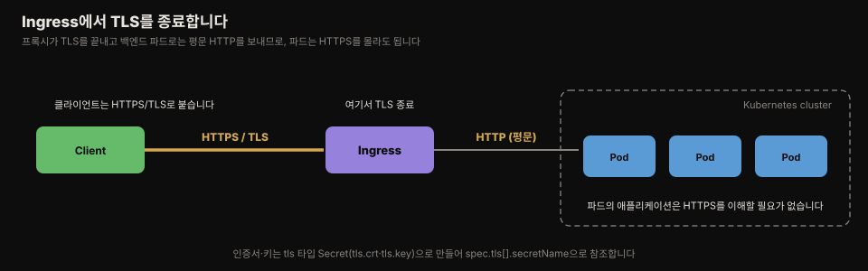
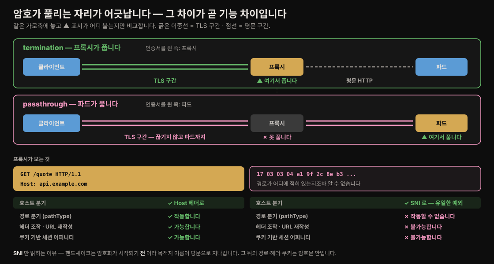
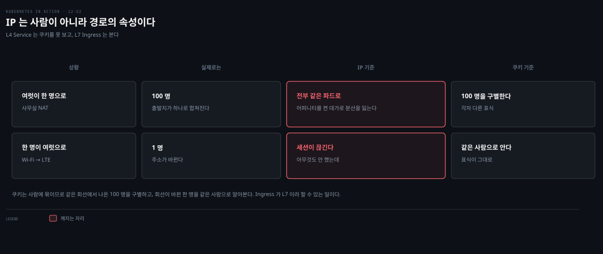
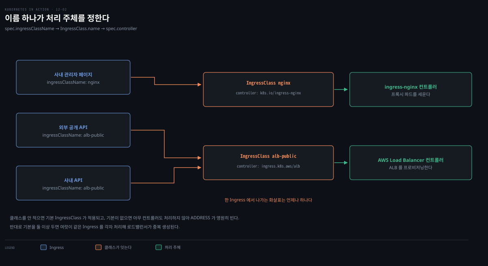

# Ingress TLS·설정·IngressClass
---
> Ingress 프록시가 TLS 연결을 대신 종료하면, 백엔드 파드는 HTTPS를 몰라도 됩니다. 프록시별 세부 설정은 annotation이나 별도 커스텀 오브젝트로 하고, 컨트롤러가 여럿이면 IngressClass로 어느 컨트롤러가 처리할지 정합니다.

이 문서를 읽고 나면 Ingress에서 TLS를 종료하는 법을 Secret과 함께 설명하고, annotation·커스텀 오브젝트로 세션 어피니티 같은 프록시 설정을 붙이며, IngressClass로 다중 컨트롤러를 구분하고 파라미터를 주는 법을 근거와 함께 말할 수 있습니다.


## 진입 — Ingress에 HTTPS와 세부 설정 더하기

> 지금까지 Ingress로 HTTP만 다뤘지만, 외부 트래픽은 대개 TLS로 보호합니다. 또 HTTP 프록시가 제공하는 세부 기능은 Ingress spec에 다 담을 수 없어, 구현별 annotation·커스텀 오브젝트로 붙입니다.

[12-01](./12-01.Ingress%EB%A1%9C%20%EC%97%AC%EB%9F%AC%20%EC%84%9C%EB%B9%84%EC%8A%A4%EB%A5%BC%20%ED%95%9C%20IP%EC%97%90%20%EB%85%B8%EC%B6%9C%ED%95%98%EA%B8%B0.md)에서 Ingress로 HTTP 트래픽을 서비스로 보냈습니다. 이 편은 그 연결을 TLS로 보호하고, 프록시별 세부 설정을 붙이고, 컨트롤러가 여럿일 때 IngressClass로 구분하고, 서비스가 아닌 커스텀 리소스를 백엔드로 쓰는 법을 다룹니다.


## 1. Ingress에서 TLS 종료하기

> HTTPS를 붙이는 길은 둘입니다 — 프록시를 통과시켜 백엔드 파드가 TLS를 끝내거나(passthrough), 프록시가 TLS를 끝내고 백엔드로는 HTTP로 보내거나(termination). 후자가 대부분의 컨트롤러가 지원하는 표준입니다.

프록시가 TLS를 종료하면 클라이언트↔프록시 구간만 암호화되고, 프록시는 복호화한 HTTP 요청을 백엔드 파드로 보냅니다. 그래서 백엔드 파드는 HTTPS를 몰라도 됩니다.



### TLS Secret 만들고 붙이기

프록시가 TLS를 끝내려면 인증서와 개인 키가 필요합니다. 이를 Secret으로 만들어 Ingress에서 참조합니다.

```bash
# 자체 서명 인증서·키 생성 후 tls 타입 Secret 생성
openssl req -x509 -newkey rsa:2048 -keyout example.key -out example.crt \
  -sha256 -days 7300 -nodes -subj '/CN=*.example.com' \
  -addext 'subjectAltName = DNS:*.example.com'
kubectl create secret tls tls-example-com --cert=example.crt --key=example.key
```

인증서·키는 Secret의 `tls.crt`·`tls.key` 키에 저장됩니다. 이 Secret을 Ingress의 `spec.tls`에 붙입니다.

```yaml
spec:
  tls:                          # 배열이라 여러 Secret 추가 가능
  - secretName: tls-example-com # 인증서·키를 담은 Secret 이름
    hosts:
    - "*.example.com"           # 인증서에 담긴 호스트와 일치해야 함
  rules:
  ...
```

`tls.hosts`는 Secret 안 인증서의 이름과 반드시 일치해야 합니다. 붙인 뒤 `https://kiada.example.com`로 접근하면 프록시가 설정한 인증서로 응답합니다. 한 Ingress에 여러 서비스가 있으면 TLS Secret 하나로 그 서비스 전부가 HTTPS로 보호됩니다 — 백엔드 파드가 HTTPS를 제공하지 않아도 Ingress가 대신합니다.

#### 어기면 어떻게 되나

"반드시 일치해야 한다"는 당위만 알면 어긋났을 때를 대비할 수 없습니다. 실제로는 **조용히 지나가고 접속할 때 터집니다.**


쿠버네티스는 인증서 내용과 host 규칙이 맞는지 검증하지 않습니다. 그래서 배포 과정이 전부 조용히 지나갑니다.

- `kubectl apply` — 성공
- `kubectl get ingress` — 정상 표시
- 컨트롤러 로그 — 에러 없음
- 프록시 설정 반영 — 정상

실패는 브라우저가 `ERR_CERT_COMMON_NAME_INVALID`를 띄우는 순간 처음 드러납니다.

원인은 **검증 주체가 서버가 아니라 클라이언트**라는 데 있습니다. 서버는 잘못된 인증서라도 그냥 내밀고, 브라우저가 인증서의 CN·SAN을 접속한 도메인과 비교해 스스로 끊습니다. 그래서 배포 파이프라인은 전부 초록불인데 사용자만 막히는 상황이 됩니다.

와일드카드 인증서에도 12-01 §5에서 본 **요소 단위 규칙**이 그대로 적용됩니다. `*.example.com`은 `api.example.com`을 덮지만 `foo.api.example.com`은 덮지 못합니다. 별 하나가 한 요소만 대신하기 때문입니다. 같은 원리가 **DNS 매칭 · Ingress host 매칭 · 인증서 SAN 검증** 세 곳에 공통으로 적용되므로, 셋을 따로 외울 필요가 없습니다.

### TLS passthrough (비표준)

쿠버네티스는 TLS passthrough를 위한 표준 방식을 제공하지 않습니다. Nginx 컨트롤러는 `nginx.ingress.kubernetes.io/ssl-passthrough: "true"` annotation으로 켜되, 컨트롤러를 `--enable-ssl-passthrough` 플래그로 시작해야 합니다. 이는 컨트롤러에 크게 의존하는 비표준 기능이라, 표준인 termination에 집중하는 편이 낫습니다.

#### 흘려보낸다는 것은 무엇을 포기하는 것인가

두 방식의 갈림길은 **암호가 어디서 풀리느냐**입니다. termination은 프록시가 인증서를 쥐고 자기 자리에서 풀지만, passthrough는 인증서를 파드가 쥐고 있어 프록시가 풀지 못합니다.

암호를 푸는 주체가 컨트롤러가 아니라 **프록시**라는 점도 짚어 둡니다. [12-01](./12-01.Ingress%EB%A1%9C%20%EC%97%AC%EB%9F%AC%20%EC%84%9C%EB%B9%84%EC%8A%A4%EB%A5%BC%20%ED%95%9C%20IP%EC%97%90%20%EB%85%B8%EC%B6%9C%ED%95%98%EA%B8%B0.md)에서 갈라 둔 대로 컨트롤러는 설정을 만들 뿐이고, 트래픽은 프록시가 처리합니다.

그리고 이 갈림길이 **프록시가 무엇을 볼 수 있는지**를 그대로 정합니다.



TLS가 감추는 것이 하필 프록시가 읽어야 할 바로 그 부분입니다. passthrough에서 프록시가 보는 것은 `17 03 03 ...`으로 시작하는 암호문 바이트뿐이라, 경로가 어디에 적혀 있는지조차 알 수 없습니다.

| | termination | passthrough |
|---|---|---|
| 호스트 분기 | 가능 (Host 헤더) | 가능 (**SNI** — 핸드셰이크는 암호화 전이라 평문) |
| **경로 분기** (`pathType`) | 가능 | **불가능** |
| 헤더 조작·URL 재작성·쿠키 어피니티 | 가능 | 불가능 |

호스트 분기만 예외인 이유는 SNI 필드가 TLS 핸드셰이크 중, 즉 암호화가 시작되기 **전에** 오가기 때문입니다. "어느 호스트로 가는가"는 평문으로 읽히지만 그 뒤의 경로·헤더·쿠키는 암호화된 본문 안에 있습니다.

그래서 **passthrough는 L7 중간자의 눈을 가리는 선택**입니다. 12-01 §6에서 정리한 "Ingress를 쓰는 이유가 HTTP를 이해하는 중간자를 두는 것"과 정면으로 상충하고, 12-01 §4의 `pathType` 매칭도 작동할 수 없습니다. 종단 간 암호화가 꼭 필요한 경우에만 그 대가를 치르는 것이라, 표준이 되지 못했습니다.

#### "표준"이란 무슨 뜻인가

여기서 말하는 표준은 **쿠버네티스 API에 정식 필드로 있는가**입니다. termination은 `spec.tls`가 정식 필드라 어느 컨트롤러를 쓰든 같은 YAML이 통합니다. passthrough는 그런 필드가 없어 annotation과 컨트롤러 플래그에 기대므로, 컨트롤러를 바꾸면 통째로 안 통합니다.

둘 중 무엇을 고를지는 이렇게 갈립니다.

| | termination | passthrough |
|---|---|---|
| 장점 | L7 기능 전부 · 인증서를 인프라에 모아 관리 · 파드는 평문만 다루면 됨 | **종단 간 암호화**(프록시조차 못 봄) · mTLS를 앱이 직접 검증 |
| 단점 | 프록시↔파드 구간이 평문 · 인증서가 프록시에 몰려 단일 실패점 | 경로 라우팅 불가 · 인증서를 파드마다 배포·갱신 · 컨트롤러 의존 |
| 쓰는 곳 | 일반 웹·API | 규제 산업(금융·의료)의 종단 간 암호화 요건 |

termination이 사실상 기본이 된 이유는 둘입니다. 하나는 cert-manager와 Let's Encrypt로 발급·갱신이 자동화된 것이고, 다른 하나는 "프록시↔파드 구간이 평문"이라는 약점을 passthrough가 아니라 **서비스 메시**(사이드카 mTLS)로 푸는 흐름이 된 것입니다.

> 이 판단은 2026년 7월 기준의 생태계 흐름을 근거로 합니다. 어느 방식이 주류인지는 컨트롤러 구현과 서비스 메시 도입 상황에 따라 바뀌므로, 실제 선택 전에는 쓰는 컨트롤러의 공식 문서를 확인합니다.

> **Spring 관점.** Boot 앱에서 `server.ssl`로 앱이 직접 TLS를 끝낼 수도 있지만, Ingress termination을 쓰면 인증서 관리(갱신·교체)를 인프라 계층에 모을 수 있습니다. cert-manager를 붙이면 Let's Encrypt 인증서를 Secret으로 자동 발급·갱신해, 앱은 평문 HTTP만 신경 쓰면 됩니다.


## 2. annotation으로 프록시 설정하기

> Ingress spec에는 defaultBackend·rules·tls·ingressClassName 넷뿐입니다. HTTP 프록시의 나머지 기능(인증·세션 어피니티·URL 재작성 등)은 구현별 annotation이나 커스텀 오브젝트로 설정합니다.

`kubectl explain ingress.spec`을 보면 spec 필드가 넷뿐인 게 놀랍습니다. 모든 구현의 모든 설정을 스키마에 담기란 사실상 불가능하기 때문입니다. 그래서 구현별 설정은 annotation으로 붙입니다.

### 왜 필드로 만들지 못하나

"불가능하다"는 말이 분량 문제로 읽히기 쉬운데, 실은 **의미를 API가 보장할 수 없는** 문제입니다. `rateLimit: 100`이라는 필드를 만든다고 해 봅니다.

- 단위가 초당인지 분당인지
- 기준이 IP인지 사용자인지 API 키인지
- 초과하면 429인지 503인지

이 답이 구현마다 다르고, **AWS ALB에는 그 개념 자체가 없습니다.** `rewrite`도 마찬가지여서 Nginx는 정규식 캡처 그룹을 쓰고 GKE는 다른 문법을 씁니다. 같은 필드에 같은 값을 넣어도 컨트롤러를 바꾸면 다르게 동작하거나 아예 안 통합니다.

**필드를 만들면 그 의미를 API가 보장해야 하는데, 구현이 제각각이면 보장할 수 없습니다.** 그래서 어느 구현에나 공통인 최소한(라우팅·TLS·클래스 지정)만 spec에 두었습니다. 12-01 §4의 `pathType: ImplementationSpecific`이 같은 결입니다 — 표준화할 수 없다는 사실을 **명시적으로 인정한** 장치입니다.

11장에서 Service는 L4라 쿠키 기반 세션 어피니티를 못 한다고 배웠습니다. Ingress는 L7이라 가능합니다. Nginx 컨트롤러에서 annotation으로 켭니다.

쿠키를 쓸 수 있다는 것이 왜 이득인지는 IP로 했을 때 무엇이 깨지는지를 보면 분명해집니다.



실패가 **양방향**입니다.

- **여럿이 한 명으로** — 사무실에서 100명이 NAT을 거쳐 나오면 출발지가 하나로 합쳐집니다. 그 100명이 전부 같은 파드에 고정돼, 어피니티를 켠 대가로 분산을 잃습니다
- **한 명이 여럿으로** — 모바일 사용자가 Wi-Fi에서 LTE로 옮기면 주소가 바뀝니다. 아무것도 하지 않았는데 세션이 끊깁니다

원인을 한 줄로 줄이면 이렇습니다 — **IP는 사용자의 신원이 아니라 요청이 지나온 경로의 속성**입니다. 쿠키는 서버가 그 사용자에게 발급한 표식이라 경로가 아니라 사람에 묶입니다. 그래서 같은 회선에서 나온 100명을 구별하고, 회선이 바뀐 한 명을 같은 사람으로 알아봅니다.

```yaml
metadata:
  name: kiada
  annotations:
    nginx.ingress.kubernetes.io/affinity: cookie                  # 쿠키 기반 어피니티 켜기
    nginx.ingress.kubernetes.io/session-cookie-name: SESSION_COOKIE  # 쿠키 이름 지정
spec:
  ...
```

annotation 키 접두사(`nginx.ingress.kubernetes.io/`)가 이 설정이 Nginx 컨트롤러 전용이며 다른 구현은 무시함을 나타냅니다. 적용하면 응답에 `Set-Cookie: SESSION_COOKIE=...`가 붙고, 그 쿠키를 요청에 담으면 매번 같은 파드로 갑니다. Nginx가 지원하는 annotation 목록은 [공식 문서](https://kubernetes.github.io/ingress-nginx/user-guide/nginx-configuration/annotations/)에 있습니다.

⛔ 여기서 "무시한다"가 조용하다는 점이 위험합니다. 컨트롤러를 갈아타면 접두사가 안 맞는 annotation은 **아무 일도 하지 않는데 에러도 나지 않습니다.** 어피니티를 켠 줄 알았는데 실은 꺼져 있는 상태로 운영되는 식입니다. 컨트롤러 교체는 annotation 재작성 작업을 동반한다고 보는 편이 안전합니다.

### annotation과 ConfigMap은 다른 층입니다

설정을 붙인다고 하면 ConfigMap을 떠올리기 쉬운데, 둘은 담는 것도 읽는 주체도 다릅니다.

| | 담는 것 | 읽는 주체 | 전달 경로 |
|---|---|---|---|
| **annotation** | 오브젝트에 붙은 메타데이터 (Ingress별 프록시 설정) | 컨트롤러 | API에서 읽습니다 |
| **ConfigMap** | 앱이 읽는 설정 | 앱 | 볼륨·환경변수로 주입합니다 |

[07-03](./07-03.field%20selector%EC%99%80%20annotation.md)에서 다룬 "스키마에 없는 부가 정보를 붙이는 수단"이 바로 이 annotation입니다.

다만 Nginx 컨트롤러에도 ConfigMap이 쓰이긴 합니다 — 워커 수나 기본 타임아웃 같은 **컨트롤러 전역 설정**이 그쪽입니다. 정리하면 층이 이렇게 갈립니다.

- **Ingress별 설정** → annotation
- **컨트롤러 전역 설정** → 컨트롤러의 ConfigMap

> **⚠️ ingress-nginx는 유지보수가 종료됩니다.** 공식 README는 "Best-effort maintenance will continue until March 2026. Afterward, there will be no further releases, no bugfixes, and no updates to resolve any security vulnerabilities"라고 밝히고, 아직 쓰지 않는다면 "you should identify a Gateway API implementation and use it"을 권합니다.[^ingress-nginx-eol] 이 편의 Nginx annotation 예시는 *annotation이라는 메커니즘*을 보여 주는 용도로는 그대로 유효하지만, 새로 배포한다면 [13-01](./13-01.Gateway%20API%20%EA%B0%9C%EB%85%90%EA%B3%BC%20Gateway%20%EB%B0%B0%ED%8F%AC.md)의 Gateway API 구현을 먼저 봅니다.

### 커스텀 오브젝트로 설정하기 (GKE)

일부 구현은 annotation 대신 자체 오브젝트 종류를 씁니다. GKE는 `BackendConfig` 오브젝트를 만들어 Service에서 `cloud.google.com/backend-config` annotation으로 참조합니다.

```yaml
apiVersion: cloud.google.com/v1
kind: BackendConfig            # GKE 전용 커스텀 오브젝트
metadata:
  name: kiada-backend-config
spec:
  sessionAffinity:
    affinityType: GENERATED_COOKIE   # 쿠키 기반 어피니티
```

같은 목적(세션 어피니티)을 Nginx는 annotation으로, GKE는 커스텀 오브젝트로 한다는 점이 핵심입니다 — 방식은 컨트롤러에 따라 다르므로 해당 문서를 봅니다.

### 어피니티와 트래픽 정책은 다른 구간의 일입니다

여기서 자연스럽게 나오는 물음이 있습니다. Service의 `externalTrafficPolicy`가 `Local`이든 `Cluster`든 L7 어피니티를 쓸 수 있는가.

쓸 수 있습니다. 다만 이유가 "정책과 무관해서"가 아니라 **애초에 다른 구간의 일이라 만나지 않아서**입니다. 경로를 구간별로 갈라 보면 분명해집니다.

```text
클라이언트 → LB → 프록시 파드 → (파드 IP 직접) → 백엔드 파드
             └─ Service 소관 ─┘   └─ 프록시 소관 (Service를 거치지 않습니다) ─┘
```

12-01에서 확인한 대로 **프록시는 cluster IP를 건너뛰고 파드로 직접 보냅니다.** 그러니 프록시→백엔드 구간에는 Service가 개입할 자리가 없고, `externalTrafficPolicy`도 `sessionAffinity`도 그 구간에는 적용되지 않습니다.

⚠️ 단 **한 곳에서 만납니다.** LB→프록시 구간에 `Cluster` 정책이 걸려 있으면 SNAT 때문에 **프록시가 보는 클라이언트 IP가 노드 IP로 오염됩니다**([11-02](./11-02.%EC%99%B8%EB%B6%80%20%EB%85%B8%EC%B6%9C%20%E2%80%94%20NodePort%C2%B7LoadBalancer%C2%B7%ED%8A%B8%EB%9E%98%ED%94%BD%20%EC%A0%95%EC%B1%85.md) §3).

그러면 IP 기반 어피니티가 무의미해지고 접근 로그의 출발지도 전부 노드 주소가 됩니다. 그래서 실무에서는 컨트롤러의 LB Service에 `externalTrafficPolicy: Local`을 거는 것이 관행입니다.


## 3. 다중 컨트롤러와 IngressClass

> 구현마다 부가 기능이 다르므로 컨트롤러를 여럿 설치할 수 있습니다. 이때 각 Ingress는 어느 컨트롤러가 처리할지 IngressClass로 지정합니다.

옛날엔 `kubernetes.io/ingress.class` annotation으로 컨트롤러를 지정했지만(지금은 deprecated), 올바른 방식은 IngressClass 오브젝트입니다. 컨트롤러를 설치하면 대개 IngressClass가 하나 이상 만들어집니다.



```bash
kubectl get ingressclasses
# NAME    CONTROLLER             PARAMETERS   AGE
# nginx   k8s.io/ingress-nginx   <none>       10h
```

IngressClass는 컨트롤러 이름과 선택적 파라미터를 담습니다. Ingress에서 `spec.ingressClassName`으로 IngressClass 이름을 적으면, 그 클래스가 지정한 컨트롤러가 이 Ingress를 처리합니다.

```yaml
spec:
  ingressClassName: nginx    # 이 Ingress를 처리할 클래스
  rules:
  ...
```

컨트롤러가 여럿이면 IngressClass도 여럿입니다. Ingress가 클래스를 지정하지 않으면 `ingressclass.kubernetes.io/is-default-class: "true"` annotation이 붙은 기본 IngressClass가 적용됩니다.

### 개수 관계 — 무엇이 여럿이고 무엇이 하나인가

"컨트롤러가 여럿"이라는 말이 *하나의 Ingress를 여럿이 나눠 처리한다*로 읽히기 쉬운데, 그렇지 않습니다.

| 개수 | 무엇 |
|---|---|
| 컨트롤러 여럿 | 한 클러스터에 공존할 수 있습니다 (Nginx + ALB) |
| IngressClass 여럿 | 컨트롤러마다 하나 이상. 같은 컨트롤러에 파라미터만 다른 클래스도 가능 |
| Ingress 여럿 | 각각 **클래스 하나**를 지목합니다 |
| **Ingress 1개를 처리하는 컨트롤러** | **항상 하나** |

컨트롤러를 여럿 두는 의미는 트래픽을 나눠 갖는 것이 아니라 **Ingress 집합, 즉 일감을 나눠 갖는 것**입니다. 사내 관리자 페이지는 `ingressClassName: nginx`로, 외부 공개 API는 `ingressClassName: alb-public`으로 적으면 각 Ingress를 서로 다른 컨트롤러가 맡습니다.

클래스를 안 적었을 때도 "아무거나 골라 분산"이 아니라 분기가 정해져 있습니다.

```text
ingressClassName 생략
  ├─ 기본 IngressClass 있음 → 그 클래스가 적용됩니다
  └─ 기본 없음 → 아무 컨트롤러도 처리하지 않습니다 → ADDRESS가 영원히 비어 있습니다
```

12-01 §3에서 "주소가 안 뜨면 컨트롤러 실행 여부와 `ingressClassName`을 확인하라"고 한 증상의 원인이 바로 아래쪽 분기입니다.

⚠️ 반대로 **기본 클래스를 둘 이상 두면** 여러 컨트롤러가 같은 Ingress를 각자 처리해 프록시와 로드밸런서가 중복 생성되고 비용이 이중으로 나갑니다. "둘이 동시에 달라붙는" 상황이 실제로 벌어지는 유일한 경우입니다.

### IngressClass에 파라미터 주기

IngressClass는 한 컨트롤러가 여러 "맛(flavor)"을 제공할 때, 클래스마다 다른 파라미터를 줘 구분하는 데도 씁니다. IngressClass 자체에는 파라미터 필드가 없고(컨트롤러마다 필드가 다르므로), 구현별 커스텀 오브젝트를 만들어 참조합니다.

```yaml
kind: IngressClass
spec:
  controller: ingress.k8s.aws/alb     # AWS Load Balancer 컨트롤러
  parameters:                         # 파라미터를 담은 커스텀 오브젝트 참조
    apiGroup: elbv2.k8s.aws
    kind: IngressClassParams
    name: custom-ingress-params
```

AWS는 `IngressClassParams` 오브젝트(scheme·ipAddressType·tags 등)에 설정을 담고, IngressClass가 이를 참조합니다. 쿠버네티스는 이 오브젝트 내용을 신경 쓰지 않고, 컨트롤러만 읽어 씁니다.

#### 왜 컨트롤러를 직접 적지 않나

Ingress에 컨트롤러 이름을 바로 쓰면 간단할 텐데 클래스를 한 단계 거칩니다. 참조가 이렇게 이어집니다.

```text
Ingress.spec.ingressClassName: "alb-public"
        ↓
IngressClass "alb-public"
  spec.controller: ingress.k8s.aws/alb        ← 실제 컨트롤러
  spec.parameters: → IngressClassParams (scheme: internet-facing)
```

한 단계를 두는 이유는 **같은 컨트롤러를 다른 파라미터로 여러 번 쓰기** 위해서입니다. ALB 컨트롤러 하나로 `alb-public`(internet-facing)과 `alb-internal`(internal) 두 클래스를 만들 수 있습니다. Ingress에 컨트롤러 이름을 직접 적는 구조였다면 이 구분이 불가능합니다 — 둘 다 `ingress.k8s.aws/alb`라 구별할 방법이 없습니다.

**관심사도 갈립니다.** 앱 개발자는 `alb-public`이라는 이름 하나만 알면 되고, 그 뒤의 scheme·태그·IP 유형은 인프라팀이 IngressClass에서 관리합니다.

한 가지 더 눈여겨볼 것은 이것이 **annotation에서 정식 필드로 승격된** 사례라는 점입니다. 예전 `kubernetes.io/ingress.class` annotation이 지금의 `spec.ingressClassName` 필드가 됐습니다. §2에서 본 "표준화할 수 없으면 annotation으로"와 **정확히 반대 방향**입니다 — 모든 구현에 공통으로 필요하다고 판단되면 필드로 올라옵니다. annotation은 임시 수단이자 표준 후보를 시험하는 자리이기도 합니다.


## 4. 서비스가 아닌 커스텀 리소스를 백엔드로

> 지금까지 백엔드는 늘 Service였지만, 일부 컨트롤러는 다른 리소스를 백엔드로 허용합니다. 대개 고급 라우팅 규칙을 커스텀 리소스로 설정하는 용도입니다.

Citrix 컨트롤러는 `HTTPRoute` 커스텀 오브젝트를 백엔드로 지정할 수 있습니다 — Service 대신 `resource`의 apiGroup·kind·name을 적습니다.

```yaml
spec:
  ingressClassName: citrix
  rules:
  - host: example.com
    http:
      paths:
      - pathType: ImplementationSpecific
        backend:
          resource:                # Service가 아닌 커스텀 리소스
            apiGroup: citrix.com
            kind: HTTPRoute
            name: my-example-route
```

이 Ingress는 `example.com` 트래픽을 `HTTPRoute` 오브젝트의 규칙대로 라우팅합니다. HTTPRoute는 쿠버네티스 표준이 아니라 Citrix가 제공하는 것으로, Ingress 규칙과 비슷하되 더 많은 설정을 담습니다. 커스텀 리소스 백엔드를 지원하는 컨트롤러는 아직 드뭅니다.


## 면접에서 받을 만한 질문

> 아래 질문에 먼저 스스로 답해 본 뒤, 챕터 끝의 정답과 맞춰 봅니다.

1. Ingress에서 HTTPS를 지원하는 두 방식(passthrough·termination)은 무엇이 다른가요? 표준은 어느 쪽인가요?
2. TLS termination에서 백엔드 파드가 HTTPS를 몰라도 되는 이유는 무엇인가요? 인증서·키는 어떻게 프록시에 전달하나요?
3. Ingress spec에 필드가 넷(defaultBackend·rules·tls·ingressClassName)뿐인 이유는 무엇인가요? 나머지 설정은 어떻게 하나요?
4. Service는 쿠키 기반 세션 어피니티를 못 하는데 Ingress는 할 수 있는 이유는 무엇인가요?
5. 클러스터에 컨트롤러가 여럿일 때, 어느 컨트롤러가 특정 Ingress를 처리할지 어떻게 정하나요? Ingress가 클래스를 안 적으면 어떻게 되나요?


## 정답 (자답 후 펼치기)

> 위 질문에 답해 본 다음 아래와 맞춰 봅니다. 순서는 질문과 1:1로 대응합니다.

### 정답 1 — passthrough vs termination

passthrough는 TLS 연결을 프록시가 통과시켜 백엔드 파드가 직접 TLS를 끝내는 방식이고, termination은 프록시가 TLS를 끝내고 백엔드로는 평문 HTTP를 보내는 방식입니다. termination이 대부분의 컨트롤러가 지원하는 표준이고, passthrough는 쿠버네티스에 표준 방식이 없어 컨트롤러별 annotation(Nginx는 `ssl-passthrough`)과 플래그(`--enable-ssl-passthrough`)에 의존하는 비표준 기능입니다.

### 정답 2 — 파드가 HTTPS를 몰라도 되는 이유

termination에서는 클라이언트↔프록시 구간만 TLS로 암호화되고, 프록시가 복호화한 뒤 백엔드 파드로는 평문 HTTP를 보냅니다. 따라서 파드의 애플리케이션은 HTTPS를 처리할 필요가 없습니다. 인증서와 개인 키는 `tls` 타입 Secret(`tls.crt`·`tls.key`)으로 만들어, Ingress의 `spec.tls[].secretName`으로 참조해 프록시에 전달합니다. `tls.hosts`는 인증서 이름과 일치해야 합니다.

### 정답 3 — spec 필드가 넷뿐인 이유

모든 Ingress 구현의 모든 설정 옵션을 하나의 스키마에 담기란 사실상 불가능하기 때문입니다. 그래서 공통으로 필요한 defaultBackend·rules·tls·ingressClassName만 spec에 두고, 구현별 세부 설정(인증·세션 어피니티·URL 재작성·CORS 등)은 annotation이나 컨트롤러가 제공하는 커스텀 오브젝트로 붙입니다.

### 정답 4 — Ingress가 쿠키 어피니티를 할 수 있는 이유

Service는 OSI L4(TCP·UDP)에서 동작해 HTTP 쿠키를 이해하지 못하므로 클라이언트 IP 기반 어피니티만 가능합니다. Ingress는 L7(HTTP)에서 동작하므로 요청의 쿠키를 읽고 쓸 수 있어, 쿠키 기반 세션 어피니티를 지원합니다(Nginx는 `affinity: cookie` annotation으로).

### 정답 5 — 다중 컨트롤러와 IngressClass

각 Ingress의 `spec.ingressClassName`에 IngressClass 이름을 적고, IngressClass가 컨트롤러 이름을 지정하므로, 그 컨트롤러가 이 Ingress를 처리합니다. Ingress가 클래스를 안 적으면 `ingressclass.kubernetes.io/is-default-class: "true"` annotation이 붙은 기본 IngressClass가 적용됩니다. 기본 클래스도 없고 지정도 안 하면 어떤 컨트롤러도 처리하지 않아 주소가 안 잡힙니다.


## 관련 문서

> 이 편은 12-01의 Ingress 라우팅을 이어받아 TLS 종료·annotation 설정·IngressClass·커스텀 백엔드로 12장을 마무리합니다.

- [12-01. Ingress로 여러 서비스를 한 IP에 노출하기](./12-01.Ingress%EB%A1%9C%20%EC%97%AC%EB%9F%AC%20%EC%84%9C%EB%B9%84%EC%8A%A4%EB%A5%BC%20%ED%95%9C%20IP%EC%97%90%20%EB%85%B8%EC%B6%9C%ED%95%98%EA%B8%B0.md) — Ingress 개념·경로 라우팅·default backend(앞 편)
- [11-03. 엔드포인트·DNS·토폴로지·readiness](./11-03.%EC%97%94%EB%93%9C%ED%8F%AC%EC%9D%B8%ED%8A%B8%C2%B7DNS%C2%B7%ED%86%A0%ED%8F%B4%EB%A1%9C%EC%A7%80%C2%B7readiness.md) — Ingress가 참조하는 EndpointSlice·세션 어피니티(L4 한계)
- [02-06. Ingress와 Gateway API](../../kubernetes/04_networking/04-06.Ingress%EC%99%80%20Gateway%20API.md) — Ingress 통합 개념본(책 비종속)·Gateway API로의 진화
- 원서: 《Kubernetes in Action, 2nd Ed.》 Ch12 §12.3~12.6 — [Manning](https://www.manning.com/books/kubernetes-in-action-second-edition), [예제 코드](https://github.com/luksa/kubernetes-in-action-2nd-edition/tree/master/Chapter12)
- 공식 문서: [Ingress TLS](https://kubernetes.io/docs/concepts/services-networking/ingress/#tls), [Nginx annotations](https://kubernetes.github.io/ingress-nginx/user-guide/nginx-configuration/annotations/)

[^ingress-nginx-eol]: ingress-nginx 공식 저장소 README의 은퇴 공지 — [kubernetes/ingress-nginx](https://github.com/kubernetes/ingress-nginx) (2026-07-27 조회). 쿠버네티스 블로그 "What You Need to Know about Ingress NGINX Retirement"로 연결됩니다.
