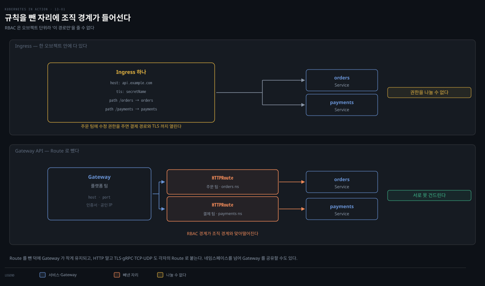
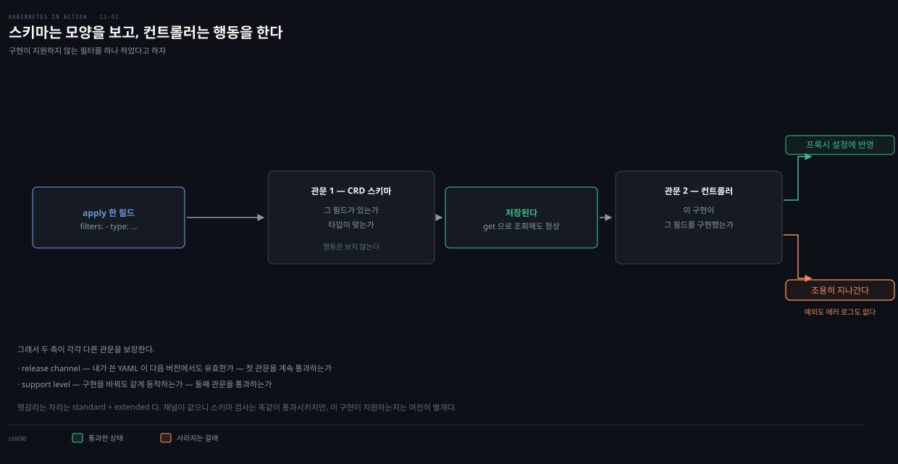
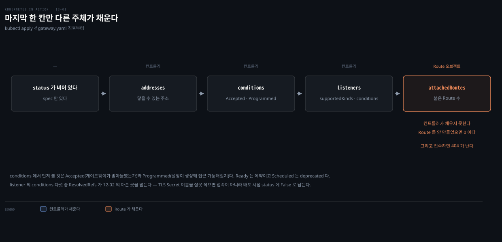
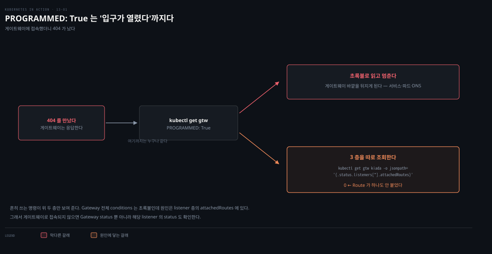

# Gateway API 개념과 Gateway 배포
---
> **Ingress는 표준 기능이 빈약해 구현별 비표준 확장에 기대야 했습니다**. Gateway API는 그 자리를 대체하며, 라우팅 규칙을 별도 Route 오브젝트로 빼내 역할을 나누고, HTTP를 넘어 TLS·TCP·UDP·gRPC까지 L4로 내려가 노출합니다.

이 문서를 읽고 나면 다음 세 가지를 할 수 있습니다.

- Gateway API가 Ingress와 무엇이 다른지 리소스 대응으로 설명하기
- release channel·support level이 왜 도입됐는지 근거를 대기
- Istio를 provider로 Gateway를 배포하고 그 status로 준비 여부를 진단하기


## 진입 — 왜 Gateway API인가

> Ingress는 L7(HTTP) 전용이고 표준 필드가 적어 실무에선 구현별 annotation에 의존했습니다. Gateway API는 L4까지 내려가 여러 프로토콜을 지원하고, 라우팅 규칙을 별도 오브젝트로 분리해 여러 사람이 나눠 관리하게 합니다.

[12-02](./12-02.Ingress%20TLS%C2%B7%EC%84%A4%EC%A0%95%C2%B7IngressClass.md)에서 Ingress로 서비스를 외부에 노출하며, 표준 기능이 부족해 구현별 비표준 확장(annotation·커스텀 오브젝트)에 기대야 했습니다. Gateway API는 그 대안입니다 — 하나 이상의 게이트웨이 프록시로 서비스를 노출하되, HTTP·TLS뿐 아니라 일반 TCP·UDP 서비스도 다룹니다. Ingress가 L7 프록시라면, Gateway API는 L4까지 지원합니다.

Gateway API의 개념 모델·역할 분리·GAMMA는 `service-mesh 통합 개념본` <!-- 링크 끊김(2026-08): ../../service-mesh/01_foundation/03-01.Gateway API와 트래픽.md -->이 크게 다룹니다. 이 편은 책의 실측(Istio provider·Gateway status·Envoy sidecar) 관점에서 차이분을 정리합니다.


## 1. Ingress와 Gateway API 비교

> Ingress에서 Ingress 오브젝트를 만드는 것처럼, Gateway API에서는 Gateway 오브젝트를 만듭니다. 큰 차이는 서비스를 연결하는 방식입니다 — Ingress는 오브젝트 안에 서비스를 직접 적지만, Gateway는 별도 Route 오브젝트로 연결합니다.



리소스가 대응합니다 — Ingress↔Gateway, IngressClass↔GatewayClass. 여기까지는 이름만 다릅니다. 차이는 서비스 연결에서 갈립니다. Gateway API에서는 노출할 서비스 종류에 따라 Route 오브젝트(HTTPRoute·TLSRoute·TCPRoute·UDPRoute·GRPCRoute)를 만들어 연결합니다.

### Route를 분리한 세 가지 이점

Route를 별도 오브젝트로 빼낸 덕에 세 가지를 얻습니다.

1. **Gateway 오브젝트가 작게 유지**됩니다. 모든 규칙을 하나의 큰 오브젝트에 담는 대신, 성격에 맞는 여러 Route로 나눕니다. Ingress가 HTTP만 지원한 것과 달리 TLS·gRPC·TCP·UDP를 직접 지원합니다.
2. **관리 책임을 역할별로 나눌 수 있다는 것**입니다. Gateway는 대개 클러스터 관리자가, Route는 애플리케이션 개발자가 만듭니다. Ingress에서는 이 책임을 나눌 수 없어 개발자가 게이트웨이까지 관리하거나 관리자가 개발자 대신 해야 했습니다.
3. **Gateway를 네임스페이스 간에 공유**할 수 있다는 것입니다. 한 네임스페이스의 Route가 다른 네임스페이스의 Gateway를 참조할 수 있고, 다른 네임스페이스의 서비스도 참조할 수 있습니다. 그래서 Gateway 하나와 공인 IP 하나로 여러 네임스페이스의 서비스를 노출할 수 있어, Ingress보다 훨씬 강력합니다.

### 왜 굳이 쪼갰나 — 담긴 내용이 비슷해 보이는데

호스트와 경로는 둘 다 "어디로 보낼지"라 한 오브젝트에 있어도 될 것 같습니다. 그런데 **결정 주체와 변경 빈도가 다릅니다.**

| | 누가 정하나 | 얼마나 자주 바뀌나 |
|---|---|---|
| 호스트·포트·인증서·공인 IP | **플랫폼/인프라 팀** | 거의 안 바뀝니다 (도메인 하나 사면 몇 년) |
| 경로 → 어느 서비스로 | **각 앱 개발자** | 배포마다 바뀝니다 (`/orders/v2` 추가) |

성격이 다른 둘이 한 오브젝트에 있으면 마찰이 둘 생깁니다.

- **개발자에게 수정 권한을 주면** — RBAC은 오브젝트 단위라 "이 Ingress의 이 경로만"은 줄 수 없습니다. 주문팀이 결제팀 경로나 TLS 설정을 깨뜨릴 수 있습니다
- **인프라 팀이 대신 하면** — 앱 배포마다 티켓이 필요하고, 배포 속도가 인프라 팀 처리량에 묶입니다

쪼개면 RBAC 경계가 조직 경계와 맞아떨어집니다.

```pseudocode
플랫폼 팀 → Gateway 1개
주문 팀   → HTTPRoute (orders 네임스페이스)    ← 자기 것만
결제 팀   → HTTPRoute (payments 네임스페이스)  ← 서로 못 건드립니다
```

> **Spring 관점.** 플랫폼 팀이 Gateway를 만들어 두면, 각 서비스 팀은 자기 네임스페이스에서 HTTPRoute만 만들어 붙입니다. Boot 앱을 배포하는 개발자가 클러스터 진입점 전체를 건드리지 않고 자기 라우팅만 선언하는 구조 — 역할 분리가 조직 경계와 맞아떨어집니다.


## 2. Gateway API 구현 — 이식성 보장 장치

> Gateway API는 규격일 뿐이고 구현은 서드파티가 합니다. 여러 구현의 동작 차이를 막으려고, 각 기능에 **release channel(안정성)**과 **support level(이식성)**을 붙였습니다.

Gateway API는 API(규격)이라 누군가 구현해야 하고, Ingress처럼 쿠버네티스 자체는 구현을 제공하지 않습니다. 여러 구현이 있으면 동작·기능 차이가 생기는데(Ingress에서 겪은 문제), Network SIG는 그 실수를 되풀이하지 않으려고 각 기능에 두 속성을 붙였습니다.

### release channel — standard vs experimental

Gateway API를 쓰려면 먼저 CRD(Custom Resource Definition)를 설치하는데, 각 리소스·필드는 두 채널 중 하나에 속합니다.

- **standard** — 안정적이며 앞으로 바뀌지 않을 리소스·필드
- **experimental** — 실험적이며 바뀔 수 있는 추가 리소스·필드

작성 시점 기준 standard에는 HTTPRoute만 있고, 나머지 Route는 모두 experimental입니다. Network SIG가 그 API가 모든 사용 사례를 최적으로 덮는다고 확신하면 standard로 옮깁니다.

### support level — core vs extended vs implementation-specific

기능이 standard 채널에 있다는 건 API가 안 바뀐다는 뜻이지, 모든 구현이 지원한다는 뜻은 아닙니다. 그래서 support level로도 나눕니다.

| level | 이식성 | 의미 |
|-------|--------|------|
| core | 이식 가능 | 모든 구현이 지원해야 함. 이것만 쓰면 구현 전환 자유 |
| extended | 이식 가능 | 모든 구현이 지원하지는 않지만, 지원하면 동작이 같음 |
| implementation-specific | 이식 불가 | 동작·의미가 구현에 종속. 전환 시 설정 변경 필요 |

- 무서워 보이지만, 실무에서 다른 provider로 전환하는 일이 드물어 어느 level인지 크게 신경 쓸 필요는 없습니다.

### 두 속성이 실제로 어디에 적혀 있나

두 속성은 개념이 아니라 클러스터에 설치되는 오브젝트에 그대로 박혀 있습니다. 확인할 곳이 둘입니다 — **channel은 CRD의 annotation에**, **support level은 그 CRD 안 필드 설명에** 있습니다.

먼저 channel입니다. 앞서 `-k`로 설치한 CRD를 `kubectl get crd gateways.gateway.networking.k8s.io -o yaml` 로 열어 보면 metadata에 두 줄이 붙어 있습니다.

```yaml
apiVersion: apiextensions.k8s.io/v1
kind: CustomResourceDefinition
metadata:
  annotations:
    gateway.networking.k8s.io/bundle-version: v1.4.0
    gateway.networking.k8s.io/channel: standard    # ← 이 CRD가 속한 채널
  name: gateways.gateway.networking.k8s.io
spec:
  group: gateway.networking.k8s.io
  names:
    kind: Gateway
    shortNames:
    - gtw                                          # §4의 그 약어가 여기서 옵니다
  scope: Namespaced
```

`experimental` 채널로 설치한 CRD는 같은 자리의 값만 다릅니다. TCPRoute가 그렇습니다 — `kubectl get crd tcproutes.gateway.networking.k8s.io -o yaml` 로 확인합니다.

```yaml
metadata:
  annotations:
    gateway.networking.k8s.io/channel: experimental   # ← 여기만 다릅니다
  name: tcproutes.gateway.networking.k8s.io
```

그래서 "내가 지금 어느 채널을 깔았나"는 기억이 아니라 조회로 답할 수 있습니다.

```bash
kubectl get crd -l gateway.networking.k8s.io/policy!=true \
  -o custom-columns='NAME:.metadata.name,CHANNEL:.metadata.annotations.gateway\.networking\.k8s\.io/channel'
```

support level은 annotation이 아니라 **각 필드의 description 안에 `Support: <level>` 한 줄**로 적혀 있습니다. 위에서 본 그 standard 채널 Gateway CRD 하나 안에, 세 등급이 모두 들어 있습니다.

```yaml
# 같은 CRD의 spec.versions[].schema — 필드별 description 발췌
listeners:
  description: |-
    Listeners associated with this Gateway. ...
    Support: Core                         # ← 모든 구현이 지원해야 함
addresses:
  description: |-
    The Addresses field represents a request for the address(es) on the
    "outside of the Gateway" ...
    Support: Extended                     # ← 지원 여부는 구현에 달림
infrastructure:
  parametersRef:
    description: |-
      ... When both are specified, the merging behavior is implementation specific.
      Support: Implementation-specific    # ← 동작이 구현에 종속
```

이 발췌가 §2의 주장을 그대로 보여 줍니다. **한 오브젝트 안에서 필드마다 이식성 보장이 다릅니다.** `listeners`는 어느 provider에서도 같게 동작합니다. 바로 옆 `addresses`는 이 구현이 지원할 때만 동작합니다. 그런데 둘은 같은 CRD에 있으니 채널도 같은 standard입니다.

앞 절에서 "standard + extended가 헷갈리는 자리"라고 한 것이 이 조합입니다. 채널이 같으니 스키마 검사는 둘을 똑같이 통과시킵니다. 갈리는 지점은 그 뒤입니다.

`addresses`가 특히 좋은 예인 이유는 아래 §4에서 이미 만나기 때문입니다. 거기서 "addresses를 지정할 수도 있는데, 안 하면 자동 배정됩니다"라고 넘어간 그 필드입니다. 적어도 apply는 언제나 성공하지만, 그 요청을 실제로 반영할지는 provider가 정합니다.[^gwapi-support]

[^gwapi-support]: 업스트림 CRD 원본에서 확인했습니다. [standard 채널 Gateway CRD](https://github.com/kubernetes-sigs/gateway-api/blob/main/config/crd/standard/gateway.networking.k8s.io_gateways.yaml), [experimental 채널 CRD](https://github.com/kubernetes-sigs/gateway-api/tree/main/config/crd/experimental) (2026-08-03 조회). `bundle-version` 값은 설치한 릴리스에 따라 다릅니다.

### 왜 축이 둘이나 필요한가

축을 둘로 나눈 이유는 **스키마가 모양은 강제해도 행동은 강제하지 못하기** 때문입니다. 지원하지 않는 필터를 적으면 예외가 날 것 같지만, 실제로는 아무 일도 일어나지 않습니다.



도식은 필드 하나가 지나는 경로를 따라갑니다. 관문이 둘이고 둘은 서로 다른 것을 봅니다. 첫 관문인 CRD 스키마를 통과하면 오브젝트는 저장되고 `get`으로 조회해도 정상으로 보입니다.

문제는 두 번째 관문에서 갈립니다. 컨트롤러가 그 필드를 구현했으면 프록시 설정에 반영됩니다. 구현하지 않았으면 아무 반응 없이 지나갑니다. 이 갈림에서 예외도 에러 로그도 나지 않는다는 것이 핵심입니다.

CRD 스키마가 검사하는 것은 **그 필드가 있는가**와 **타입이 맞는가**까지입니다. 그 필드대로 컨트롤러가 행동하는지는 검사 범위 밖입니다 — 행동은 컨트롤러가 하는 일이고, 스키마는 컨트롤러를 모릅니다. 자바 인터페이스에 견주면 메서드를 구현했다는 사실은 컴파일러가 확인해 주지만 `void applyFilter() { }`처럼 몸통이 비어도 컴파일은 통과하는 것과 같습니다.

그래서 두 축이 각각 다른 것을 보장합니다. 도식의 두 관문에 하나씩 대응합니다.

- **release channel** — 내가 쓴 YAML이 다음 버전에서도 유효한가 (첫 관문을 계속 통과하는가)
- **support level** — 구현을 바꿔도 같게 동작하는가 (둘째 관문을 통과하는가)

둘을 조합하면 헷갈리는 자리가 하나 생깁니다. **standard + extended**는 API가 안 바뀐다는 것만 보장하지 이 구현이 지원한다는 뜻이 아닙니다. standard 채널에 있다고 안심하면 걸리는 지점입니다.

이것은 [12-02](./12-02.Ingress%20TLS%C2%B7%EC%84%A4%EC%A0%95%C2%B7IngressClass.md)의 annotation 함정과 **같은 구조**입니다. 접두사가 안 맞는 annotation을 다른 컨트롤러가 조용히 무시하듯, 정식 스키마로 올려도 "이 구현이 처리하는가"는 여전히 별개입니다. 다른 점은 Gateway API가 그 답을 support level로 **규격에 적어 두었다**는 것입니다.

`extended`의 정의가 "지원하면 **동작이 같다**"인 것도 Ingress와의 결정적 차이입니다. Ingress는 같은 기능을 구현마다 다른 이름·문법으로 했지만, extended는 이름과 의미를 규격이 고정합니다.

### provider와 이 책의 선택 — Istio

작성 시점 인기 provider는 Contour·Cilium·GKE(자체 구현)·Istio·Kong·NGINX Kubernetes Gateway 등입니다. 클라우드가 자체 구현을 제공하면 그것을, 없으면 위 중 하나를 씁니다. 이 책은 **Istio**를 Gateway API provider로 씁니다. Istio는 service mesh로 알려졌지만 Gateway API도 구현하며, mesh 기능을 쓰지 않고도 provider로만 쓸 수 있습니다.


## 3. Istio를 Gateway API provider로 배포

> Gateway API를 쓰려면 CRD를 설치하고(experimental 채널), 리소스를 살아 움직이게 할 컨트롤러(Istio 등)를 설치합니다. Kustomize의 `-k` 옵션으로 CRD를 적용합니다.

먼저 클러스터가 Gateway API 리소스를 아는지 확인하고, 없으면 GitHub에서 CRD를 설치합니다.

```bash
# CRD 존재 확인 (없으면 NotFound 에러)
kubectl get crd gateways.gateway.networking.k8s.io

# 없으면 experimental 채널로 설치 (-k = Kustomize, 이 장 모든 예제에 필요)
kubectl apply -k github.com/kubernetes-sigs/gateway-api/config/crd/experimental
```

- `-k`는 파일을 Kustomize로 처리한 뒤 적용합니다. `-f`는 그대로 적용합니다. Kustomize는 `kustomization.yaml`에 매니페스트 목록과 패치를 담습니다. dev·staging·prod처럼 클러스터별로 매니페스트를 조금씩 바꿀 때 중복 없이 차이만 드러냅니다.

CRD는 메타데이터일 뿐이라 컨트롤러가 있어야 살아납니다. istioctl로 Istio를 설치합니다.

```bash
curl -sL https://istio.io/downloadIstioctl | sh -   # istioctl 다운로드
istioctl install -y --set profile=minimal           # istio-system 네임스페이스에 설치
kubectl get pods -n istio-system                     # istiod 파드가 Ready인지 확인
```

istiod 파드 안에서 Gateway API 리소스를 관리하는 컨트롤러가 돕니다. GKE라면 Istio 대신 `gcloud container clusters update --gateway-api=standard`로 켭니다.

> **주의.** Istio는 Gateway API의 Gateway 리소스 외에 자기 것도 설치하는데, 후자는 무시합니다. Gateway API 것은 `gateway.networking.k8s.io/v1`, Istio 것은 `networking.istio.io/v1`입니다.


## 4. Gateway 배포 — GatewayClass와 listener

> Gateway를 만들 때 클래스(GatewayClass)를 지정합니다. Gateway는 listener 목록을 정의하는데, listener는 게이트웨이가 연결을 받는 논리적 엔드포인트입니다.

### GatewayClass

클러스터의 각 Gateway 클래스는 GatewayClass 오브젝트로 표현됩니다(IngressClass↔IngressClass처럼). Istio를 설치하면 `istio` GatewayClass가 자동 생성됩니다.

```bash
kubectl get gatewayclasses
# NAME    CONTROLLER                    ACCEPTED   AGE
# istio   istio.io/gateway-controller   True       2m
```

- GatewayClass는 이 클래스의 Gateway를 관리할 `controllerName`과 설명을 담습니다. 클래스가 여럿이면 서로 다른 컨트롤러나 파라미터 오브젝트를 가리킵니다. Gateway를 만들 때마다 클래스를 참조해야 하므로 클래스 이름을 기억합니다.

### Gateway 오브젝트

HTTP 서비스를 노출할 가장 단순한 Gateway입니다.

```yaml
apiVersion: gateway.networking.k8s.io/v1
kind: Gateway
metadata:
  name: kiada
spec:
  gatewayClassName: istio      # 클러스터의 GatewayClass와 일치해야 함
  listeners:                   # 하나 이상의 listener 필수
  - name: http
    port: 80
    protocol: HTTP
    hostname: '*.example.com'  # 이 listener가 매칭할 호스트
```

listener는 게이트웨이가 네트워크 연결을 받는 논리적 엔드포인트입니다. 이 listener는 80 포트에서 `example.com` 도메인의 모든 호스트를 매칭합니다. Gateway에 addresses를 지정할 수도 있는데, 안 하면 자동 배정됩니다.

```bash
kubectl apply -f gtw.kiada.yaml
kubectl get gtw     # 약어 gtw (Istio 자체 gw와 혼동 주의!)
# NAME    CLASS   ADDRESS          PROGRAMMED   AGE
# kiada   istio   172.18.255.200   True         14s
```

> **gtw vs gw 혼동 주의.** `gtw`는 Gateway API의 Gateway 약어, `gw`는 무시해야 할 Istio 자체 Gateway 리소스의 약어입니다.

### 컨트롤러가 만드는 것

Gateway 오브젝트를 만들면 컨트롤러가 대개 LoadBalancer 서비스를 만들어 게이트웨이에 연결합니다. Istio는 `kiada-istio` LoadBalancer 서비스와, `istio.io/gateway-name=kiada` 라벨을 가진 파드를 만듭니다. 그 파드는 Envoy 프록시를 돌리며, 모든 외부 트래픽이 이 게이트웨이를 통과합니다. 서비스·파드는 Gateway 오브젝트를 만든 네임스페이스에 배포되므로, Gateway마다 전용 프록시가 생깁니다 — 클러스터 전체가 쓰는 시스템 프록시가 아닙니다. 다만 파드·서비스 생성은 Istio의 구현 세부라, 다른 provider는 다르게 만들 수 있습니다.


#### 왜 Gateway마다 전용 프록시인가

입구가 여럿일 수는 없으니 프록시 하나를 공유할 것 같지만, Gateway마다 따로 뜹니다. 공유하지 않는 이유가 셋입니다.

- **성능 격리** — 주문팀 트래픽 폭주가 결제팀을 느리게 만들지 않습니다
- **장애 범위** — 프록시 재시작이나 설정 오류가 모든 팀을 동시에 죽이지 않습니다
- **관측** — 로그·메트릭이 팀 단위로 갈립니다

§1의 RBAC이 **선언** 경계였다면, 여기서 **런타임** 경계까지 생깁니다. 역할 분리가 두 층에서 완성되는 셈입니다.

다만 [12-01](./12-01.Ingress%EB%A1%9C%20%EC%97%AC%EB%9F%AC%20%EC%84%9C%EB%B9%84%EC%8A%A4%EB%A5%BC%20%ED%95%9C%20IP%EC%97%90%20%EB%85%B8%EC%B6%9C%ED%95%98%EA%B8%B0.md)과 정반대 방향의 대가를 치릅니다.

| | Ingress | Gateway API |
|---|---|---|
| 프록시·LB 개수 | 대개 하나 (여러 Ingress가 공유) | **Gateway마다** |
| 얻는 것 | 공인 IP 비용 절감 | 팀별 격리 + RBAC 경계 |

12-01에서 "LB 하나 + 프록시 + 규칙 N개"로 IP를 아꼈는데, 여기서는 Gateway마다 LB가 생겨 그 이점이 뒤집힙니다.

풀 방법은 Gateway를 팀마다가 아니라 **격리가 필요한 단위마다** 만드는 것입니다. Route는 다른 네임스페이스의 Gateway를 참조할 수 있으므로, 공개용 Gateway 하나에 여러 팀 Route를 붙이면 됩니다.

권한 통제는 `ReferenceGrant`가 맡습니다([13-03](./13-03.TLS%C2%B7%EA%B8%B0%ED%83%80%20%ED%94%84%EB%A1%9C%ED%86%A0%EC%BD%9C%C2%B7%ED%81%AC%EB%A1%9C%EC%8A%A4%20%EB%84%A4%EC%9E%84%EC%8A%A4%ED%8E%98%EC%9D%B4%EC%8A%A4%C2%B7mesh.md)). 그러면 "Gateway마다 프록시"와 "IP 하나로 여러 팀"이 모순되지 않습니다.


## 5. Gateway status로 준비 진단

> Gateway는 대개 블랙박스로 다루되, status로 준비 여부를 봅니다 — 배정된 addresses, Gateway 전체 conditions, listener별 status(attachedRoutes·conditions)입니다.



도식은 status가 **채워지는 순서**를 따라갑니다. apply한 직후에는 spec만 있고 status는 비어 있습니다. 컨트롤러가 이를 감지해 위에서부터 채워 나가는데, 마지막 `attachedRoutes`만은 컨트롤러가 채우지 못합니다 — 이 값은 Route 오브젝트가 이 Gateway를 참조할 때 비로소 오릅니다. 아래에서 볼 404가 여기서 나옵니다.

status의 세 부분입니다.

**addresses** — 게이트웨이에 닿을 수 있는 주소 목록. spec에 안 적어도 자동 배정됩니다. 각 주소는 type(IPAddress·Hostname·구현별)과 value를 가집니다.

**conditions** — Gateway 오브젝트의 조건. type을 먼저 보고 status가 True/False인지 봅니다. False면 reason·message로 이유를 찾습니다. `Accepted`(게이트웨이가 받아들였는지)와 `Programmed`(설정이 생성돼 접근 가능해질지)가 핵심입니다. `Ready`는 예약, `Scheduled`는 deprecated입니다.

**listeners** — spec의 각 listener에 대응하는 status. 담는 필드는 셋입니다.

- `attachedRoutes` — 연결된 Route 수
- `supportedKinds` — 받을 수 있는 Route 종류
- `conditions` — 이 listener의 조건 목록

그 `conditions`에 들어가는 조건은 다섯입니다.

| 조건 | 무엇을 보나 |
|---|---|
| `Accepted` | 포트·프로토콜·주소가 유효한가 |
| `Conflicted` | 다른 listener와 호스트·프로토콜이 충돌하는가 |
| `Programmed` | 설정이 생성됐는가 |
| `Ready` | (예약된 조건) |
| `ResolvedRefs` | TLS 인증서 등 참조가 해석되는가 |

kiada Gateway의 listener를 보면 조건에 오류가 없지만, `attachedRoutes`가 0이라 게이트웨이에 접속하면 404가 납니다 — 아직 Route를 만들지 않았기 때문입니다. [13-02](./13-02.HTTPRoute%20%E2%80%94%20%EB%9D%BC%EC%9A%B0%ED%8C%85%EA%B3%BC%20%ED%95%84%ED%84%B0.md)에서 첫 Route를 만들어 이를 고칩니다.

> **팁.** 게이트웨이로 서비스에 접속되지 않으면 Gateway status뿐 아니라 해당 listener의 status도 확인합니다.

### 왜 위층만 보면 놓치나

이 팁이 필요한 이유는 층마다 보이는 것이 다르고, **흔히 쓰는 명령이 위 두 층만 보여 주기** 때문입니다.



앞 도식이 status가 채워지는 순서를 따라갔다면, 이 도식은 반대 방향입니다 — 404를 만난 뒤 **조회가 갈라지는 지점**을 따라갑니다. `kubectl get gtw` 출력까지는 누구나 같습니다. 갈림은 그 `True`를 어떻게 읽느냐에서 생깁니다. 초록불로 읽고 멈추면 게이트웨이 바깥을 뒤지게 되고, 3층을 따로 조회하면 `attachedRoutes: 0`이 나옵니다.

`kubectl get gtw`가 보여 주는 `PROGRAMMED: True`는 초록불로 보이지만, 그 뜻은 **"설정이 생성돼 게이트웨이에 닿을 수 있다"**입니다. "라우팅이 완성됐다"가 아닙니다. 입구는 열렸고 안내판이 없는 상태라고 보면 맞습니다.

그래서 3층은 따로 조회합니다.

```bash
kubectl get gtw kiada -o jsonpath='{.status.listeners[*].attachedRoutes}'
# 0  ← Route가 하나도 안 붙었다는 뜻
```

listener 층의 조건은 셋입니다.

| 조건 | 무엇을 보나 |
|---|---|
| `Accepted` | 이 listener 설정을 받아들였는가 |
| `Conflicted` | 다른 listener와 포트·호스트가 겹치는가 |
| `ResolvedRefs` | 참조한 것들이 실제로 있는가 (TLS Secret 등) |

마지막 `ResolvedRefs`가 [12-02](./12-02.Ingress%20TLS%C2%B7%EC%84%A4%EC%A0%95%C2%B7IngressClass.md)의 아픈 곳을 덮어 줍니다. TLS Secret 이름을 잘못 적으면 여기서 `False`로 잡힙니다. Ingress에서는 같은 실수가 오브젝트상으로는 정상으로 보이고 **접속 시점 브라우저 오류로만** 드러났는데, Gateway API는 그것을 배포 시점 status에 남깁니다. 진단할 수 있게 된 것이 이 API의 개선점입니다.


## 면접에서 받을 만한 질문

> 아래 질문에 먼저 스스로 답해 본 뒤, 챕터 끝의 정답과 맞춰 봅니다.

1. Ingress와 Gateway API의 리소스는 어떻게 대응되나요? 서비스를 연결하는 방식에서 무엇이 다른가요?
2. Route를 별도 오브젝트로 분리해서 얻는 이점 세 가지는 무엇인가요? 그중 가장 큰 것은 무엇인가요?
3. Gateway API에서 release channel과 support level을 도입한 이유는 무엇인가요? 둘은 각각 무엇을 보장하나요?
4. Gateway 오브젝트를 만들면 Istio가 무엇을 함께 만드나요? 그 프록시는 클러스터 전체가 쓰나요?
5. 게이트웨이에 접속했는데 404가 난다면 status의 어디를 봐야 하나요? attachedRoutes가 0이면 무슨 뜻인가요?


## 정답 (자답 후 펼치기)

> 위 질문에 답해 본 다음 아래와 맞춰 봅니다. 순서는 질문과 1:1로 대응합니다.

### 정답 1 — 리소스 대응과 연결 방식

Ingress↔Gateway, IngressClass↔GatewayClass로 대응됩니다. 여기까지는 이름만 다릅니다. 차이는 서비스 연결 방식입니다. Ingress는 오브젝트 안에 백엔드 서비스를 직접 적습니다. Gateway API는 노출할 서비스 종류에 따라 별도 Route 오브젝트를 만들어 Gateway와 서비스를 연결합니다. HTTPRoute·TLSRoute·TCPRoute·UDPRoute·GRPCRoute 가 그 종류입니다.

### 정답 2 — Route 분리의 세 이점

첫째, Gateway 오브젝트가 작게 유지되고 규칙이 성격별 Route로 나뉩니다. HTTP 외에 TLS·TCP·UDP·gRPC도 직접 지원합니다.

둘째, 관리 책임을 역할별로 나눌 수 있습니다. Gateway는 클러스터 관리자가, Route는 개발자가 만듭니다.

셋째, Gateway를 네임스페이스 간에 공유할 수 있습니다. 그래서 IP 하나로 여러 네임스페이스의 서비스를 노출합니다.

가장 큰 이점은 둘째인 역할 분리입니다. Ingress에서는 이 책임을 나눌 수 없었습니다.

### 정답 3 — release channel과 support level

여러 구현이 있으면 동작·기능이 갈립니다. Ingress에서 겪은 그 문제를 막으려고 두 속성을 도입했습니다.

**release channel**은 API의 **안정성**을 보장합니다. `standard`는 앞으로 안 바뀌고, `experimental`은 바뀔 수 있습니다.

**support level**은 **이식성**을 보장합니다. `core`는 모든 구현이 지원해 전환이 자유롭습니다. `extended`는 지원하기만 하면 동작이 같습니다. `implementation-specific`은 구현에 종속됩니다.

둘은 별개 축입니다. standard 채널이어도 모든 구현이 지원하는 것은 아니기 때문입니다.

### 정답 4 — Istio가 함께 만드는 것

Gateway 오브젝트를 만들면 컨트롤러가 대개 LoadBalancer 서비스를 만들어 연결합니다. Istio는 `kiada-istio` LoadBalancer 서비스와 `istio.io/gateway-name=kiada` 라벨을 가진 파드(Envoy 프록시)를 만듭니다. 이 프록시는 Gateway 오브젝트를 만든 네임스페이스에 배포되어 그 애플리케이션 트래픽에만 쓰이는 전용 프록시입니다 — 클러스터 전체가 쓰는 시스템 프록시가 아닙니다. 다만 이는 Istio 구현 세부라 다른 provider는 다를 수 있습니다.

### 정답 5 — 404 진단과 attachedRoutes

Gateway status뿐 아니라 해당 listener의 status도 봐야 합니다. Gateway·listener conditions에 오류가 없어도, listener status의 `attachedRoutes`가 0이면 그 listener에 연결된 Route가 하나도 없다는 뜻입니다. Route가 없으면 게이트웨이가 트래픽을 어디로 보낼지 몰라 404 Not Found를 반환합니다. HTTPRoute를 만들어 Gateway에 붙이면 해결됩니다.


## 관련 문서

> 이 편은 12장 Ingress를 이어받아 그 한계를 넘는 Gateway API 개념·Gateway 배포·status를 다루고, HTTPRoute 라우팅(13-02)·TLS와 기타 프로토콜(13-03)로 이어집니다.

- [13-02. HTTPRoute — 라우팅과 필터](./13-02.HTTPRoute%20%E2%80%94%20%EB%9D%BC%EC%9A%B0%ED%8C%85%EA%B3%BC%20%ED%95%84%ED%84%B0.md) — HTTPRoute로 트래픽 분할·조건 라우팅·필터(다음 편)
- [13-03. TLS·기타 프로토콜·크로스 네임스페이스·mesh](./13-03.TLS%C2%B7%EA%B8%B0%ED%83%80%20%ED%94%84%EB%A1%9C%ED%86%A0%EC%BD%9C%C2%B7%ED%81%AC%EB%A1%9C%EC%8A%A4%20%EB%84%A4%EC%9E%84%EC%8A%A4%ED%8E%98%EC%9D%B4%EC%8A%A4%C2%B7mesh.md) — TLS·TCP/UDP/gRPC·ReferenceGrant·GAMMA
- [12-02. Ingress TLS·설정·IngressClass](./12-02.Ingress%20TLS%C2%B7%EC%84%A4%EC%A0%95%C2%B7IngressClass.md) — Gateway API가 대체하는 Ingress(앞 장)
- `Gateway API와 트래픽` <!-- 링크 끊김(2026-08): ../../service-mesh/01_foundation/03-01.Gateway API와 트래픽.md --> — Gateway API 리소스 모델·역할 분리·GAMMA 통합 개념본
- `Istio Ingress Gateway` <!-- 링크 끊김(2026-08): ../../service-mesh/03_istio/03-01.Istio Ingress Gateway.md --> — Istio Gateway API vs K8s Gateway API·마이그레이션
- [02-06. Ingress와 Gateway API](../../kubernetes/04_networking/04-06.Ingress%EC%99%80%20Gateway%20API.md) — Ingress↔Gateway 비교 통합 개념본
- 원서: 《Kubernetes in Action, 2nd Ed.》 Ch13 §13.1~13.2 — [Manning](https://www.manning.com/books/kubernetes-in-action-second-edition), [예제 코드](https://github.com/luksa/kubernetes-in-action-2nd-edition/tree/master/Chapter13)
- 공식 문서: [Gateway API](https://gateway-api.sigs.k8s.io/), [Istio Gateway API](https://istio.io/latest/docs/tasks/traffic-management/ingress/gateway-api/)
