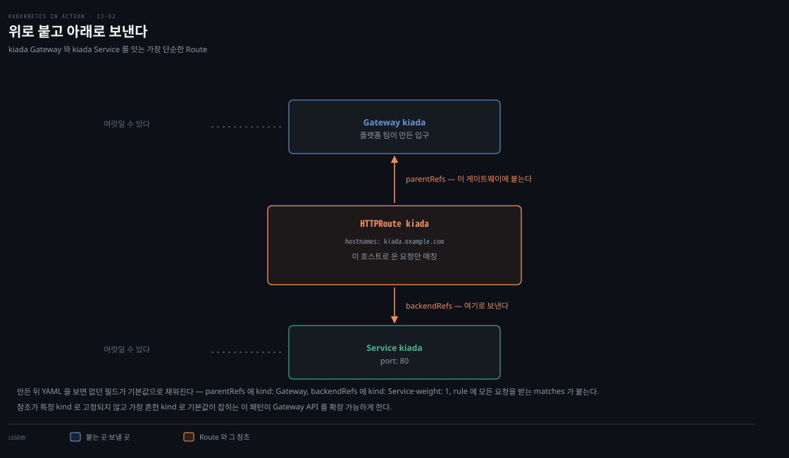
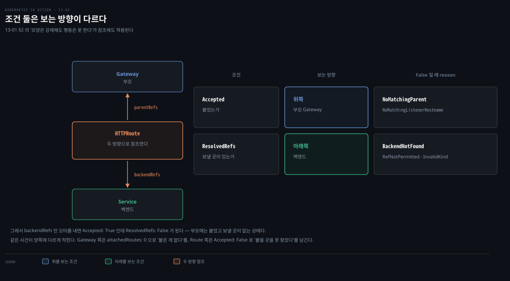
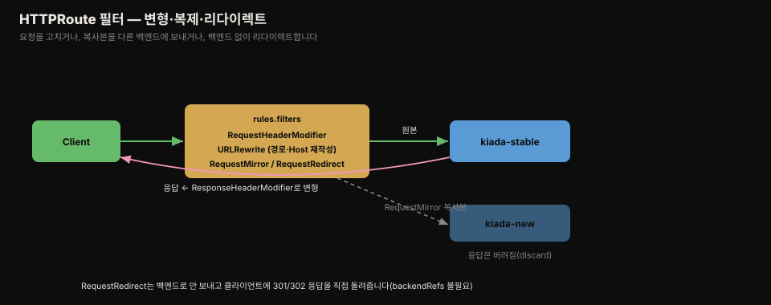
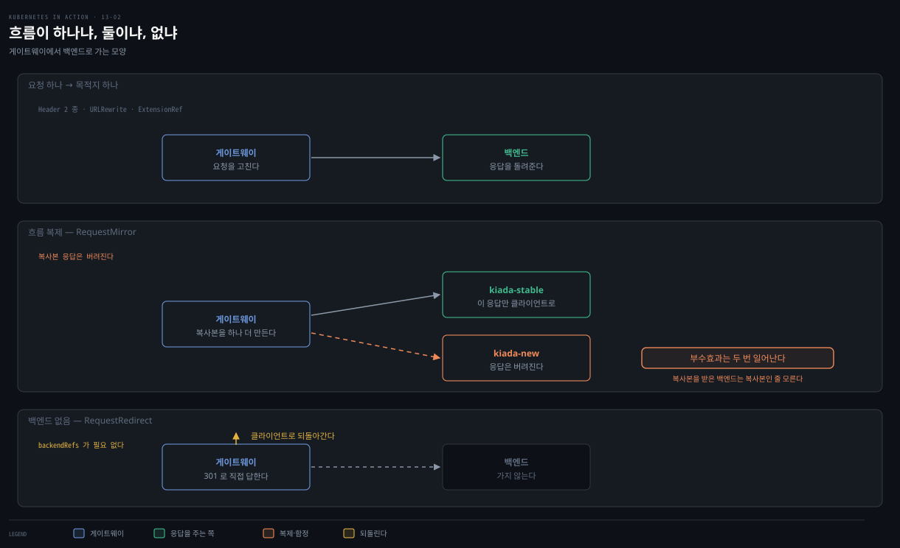

# HTTPRoute — 라우팅과 필터
---
> HTTPRoute는 게이트웨이와 서비스를 잇고, HTTP 요청의 메서드·헤더·경로·쿼리로 어느 백엔드로 보낼지 정합니다. weight로 트래픽을 나누고, 필터로 헤더를 고치거나 URL을 재작성하거나 다른 서비스에 요청을 복제할 수 있습니다.

이 문서를 읽고 나면 HTTPRoute의 parentRefs·backendRefs·rules 구조를 설명할 수 있습니다. weight로 카나리 트래픽을 나누는 법, method·header·path·query 조건으로 라우팅하는 법, 여섯 필터로 요청·응답을 변형·복제·리다이렉트하는 법도 함께 익힙니다.


## 진입 — Route가 게이트웨이와 서비스를 잇는다

> [13-01](./13-01.Gateway%20API%20%EA%B0%9C%EB%85%90%EA%B3%BC%20Gateway%20%EB%B0%B0%ED%8F%AC.md)에서 Gateway를 만들었지만 attachedRoutes가 0이라 404가 났습니다. HTTPRoute가 그 Gateway와 서비스를 이어 트래픽을 흐르게 합니다.

Gateway API가 지원하는 여러 Route 중 가장 흔한 것이 HTTPRoute입니다. HTTP 서비스를 하나 이상의 게이트웨이에 연결합니다. 작성 시점에 HTTPRoute만 stable(v1)이고, 나머지 Route는 experimental(v1alpha2)입니다.


## 1. 가장 단순한 HTTPRoute

> HTTPRoute는 parentRefs로 게이트웨이를, backendRefs로 서비스를 참조해 둘을 잇습니다. 지정한 hostname으로 온 트래픽을 백엔드로 보냅니다.



```yaml
apiVersion: gateway.networking.k8s.io/v1
kind: HTTPRoute
metadata:
  name: kiada
spec:
  parentRefs:            # 이 Route가 붙을 게이트웨이(부모)
  - name: kiada
  hostnames:             # 이 호스트로 온 요청만 매칭
  - kiada.example.com
  rules:
  - backendRefs:         # 트래픽을 보낼 백엔드 서비스·포트
    - name: kiada
      port: 80
```

kiada Gateway가 받은 트래픽 중 `kiada.example.com`에 매칭되는 HTTP를 kiada 서비스로 보냅니다. HTTPRoute·Gateway·Service 이름이 같지만 필수는 아닙니다.

### 기본값으로 채워지는 필드

만든 뒤 YAML을 보면, 원래 매니페스트에 없던 필드가 기본값으로 채워집니다.

- `parentRefs` — `group: gateway.networking.k8s.io` · `kind: Gateway`
- `backendRefs` — `group: ""`(core) · `kind: Service` · `weight: 1`
- rule — `matches: [{path: {type: PathPrefix, value: /}}]`, 곧 모든 요청 매칭

참조가 특정 kind로 고정되지 않고 가장 흔한 kind로 기본값이 잡히는 이 패턴이 Gateway API를 확장 가능하게 합니다.

### status로 진단

HTTPRoute는 여러 게이트웨이에 붙을 수 있어, status를 부모(parent)별로 따로 보고합니다. 각 parent 항목에 `controllerName`과 conditions가 있습니다. `controllerName`은 GatewayClass에서 옵니다. 볼 조건은 둘입니다.

- `Accepted` — 부모 게이트웨이가 받아들였는가. False 면 `NotAllowedByListeners`·`NoMatchingListenerHostname`·`NoMatchingParent` 등이 reason 에 옵니다.
- `ResolvedRefs` — 참조를 해석했는가. False 면 `RefNotPermitted`·`InvalidKind`·`BackendNotFound` 가 옵니다.

#### 참조 실패는 apply를 막지 않습니다

`parentRefs`에 존재하지 않는 Gateway 이름을 적으면 거부될 것 같지만, **`apply`는 성공합니다.**



스키마 검증이 보는 것은 `parentRefs` 필드가 있는지와 `name`이 문자열인지까지입니다. **그 이름의 Gateway가 실제로 존재하는지는 다른 오브젝트를 조회해야 알 수 있어 스키마가 모릅니다.** 필수값 검사도 "모양"에 속해서, 값이 있는지만 보고 그 값이 가리키는 대상이 있는지는 보지 않습니다. [13-01](./13-01.Gateway%20API%20%EA%B0%9C%EB%85%90%EA%B3%BC%20Gateway%20%EB%B0%B0%ED%8F%AC.md) §2에서 본 "스키마는 모양을 강제하나 행동은 못 한다"가 참조에도 그대로 적용됩니다.

두 조건은 **보는 방향이 다릅니다.**

| 조건 | 보는 방향 | False일 때 reason |
|---|---|---|
| `Accepted` | **위쪽**(부모 Gateway) | `NoMatchingParent` · `NoMatchingListenerHostname` · `NotAllowedByListeners` |
| `ResolvedRefs` | **아래쪽**(백엔드) | `BackendNotFound` · `RefNotPermitted` · `InvalidKind` |

§1에서 본 두 방향 참조가 각각 자기 조건을 갖는 구조입니다. 그래서 `backendRefs`만 오타를 내면 `Accepted: True`인데 `ResolvedRefs: False`가 됩니다 — 부모에는 붙었고, 보낼 곳이 없는 상태입니다.

같은 사건이 **양쪽에 다르게 기록**된다는 점도 알아 둘 만합니다.

```pseudocode
오타로 Route가 안 붙음
├─ Gateway status → listeners[].attachedRoutes: 0     "붙은 게 없다"
└─ Route status   → parents[].Accepted: False         "붙을 곳을 못 찾았다"
```

> **팁.** HTTPRoute에 문제가 있으면 먼저 그 status를 보되, 전체 그림이 안 보이면 부모 Gateway의 status도 함께 봅니다.

위 대비가 이 팁의 이유입니다. 한쪽만 보면 "안 붙었다"와 "못 찾았다" 중 한 문장만 읽게 됩니다.


## 2. weight로 트래픽 나누기

> backendRefs에 서비스를 여럿 적고 weight를 주면, 그 비율대로 트래픽이 나뉩니다. 신버전에 1%만 보내 문제가 나도 그 1%만 영향받게 하는 카나리에 씁니다.

```yaml
spec:
  rules:
  - backendRefs:
    - name: kiada-stable    # weight 9 → 90%
      port: 80
      weight: 9
    - name: kiada-new       # weight 1 → 10%
      port: 80
      weight: 1
```

weight를 생략하면 나열한 서비스에 고르게 나눕니다. 지정하면 비율만큼 보냅니다 — 위는 합이 10이라 stable이 10분의 9, new가 10분의 1을 받습니다.

#### 파드 개수로 나누는 것과 무엇이 다른가

쿠버네티스 기본 동작으로도 비율을 만들 수는 있습니다. 파드를 stable 9개·new 1개로 두면 커널이 확률로 고르므로 대략 9:1이 됩니다. 그런데 두 가지가 걸립니다.

| 하고 싶은 일 | 파드 개수 방식 | weight 방식 |
|---|---|---|
| 1% 카나리 | **파드 100개** 필요 (stable 99 + new 1) | weight 99:1, 파드는 각 1개 |
| 카나리 비율 조정 | 파드 수 변경(재배포) | 숫자만 수정 |
| 용량 증설 | 파드 수 변경 → **비율도 같이 바뀝니다** | replica만 변경, 비율은 그대로 |

- **해상도가 파드 수에 묶입니다** — 0.1%를 만들려면 1000개가 필요합니다. 트래픽이 적은 서비스인데 비율을 맞추려고 파드를 늘리는 건 낭비입니다
- **비율과 용량이 한 손잡이에 묶입니다** — "트래픽을 더 보내고 싶다"와 "처리 용량을 늘리고 싶다"가 같은 조작이 됩니다. new가 느려서 파드를 늘리면 **의도치 않게 트래픽 비율도 올라갑니다**. weight는 이 둘을 분리합니다

앞선 두 편에서 미뤄 둔 이야기가 여기서 완성됩니다.

- [11-01](./11-01.Service%20%EA%B8%B0%EC%B4%88%20%E2%80%94%20%ED%8C%8C%EB%93%9C%20%ED%86%B5%EC%8B%A0%C2%B7ClusterIP%C2%B7%EC%84%B8%EC%85%98%20%EC%96%B4%ED%94%BC%EB%8B%88%ED%8B%B0.md) — "기본은 파드 개수 비율로 대략, 정밀한 %는 L7이 필요하다"
- [12-01](./12-01.Ingress%EB%A1%9C%20%EC%97%AC%EB%9F%AC%20%EC%84%9C%EB%B9%84%EC%8A%A4%EB%A5%BC%20%ED%95%9C%20IP%EC%97%90%20%EB%85%B8%EC%B6%9C%ED%95%98%EA%B8%B0.md) — "프록시가 파드 목록을 직접 쥐어 정밀 카나리가 가능하다"

weight가 바로 그 정밀한 %를 선언으로 쓰는 방법입니다.

> **Spring 관점.** Boot 앱 신버전을 배포할 때, Deployment로 롤링 업데이트하는 대신 kiada-new 서비스를 따로 두고 weight 1로 카나리를 흘립니다. 문제가 없으면 weight를 점점 올려 전환합니다 — 애플리케이션 코드 변경 없이 라우팅 선언만으로 점진 배포를 합니다.


## 3. HTTP 요청 데이터로 라우팅

> weight 분할 외에, HTTP 메서드·헤더·경로·쿼리 파라미터로도 서로 다른 백엔드로 보낼 수 있습니다. rule의 matches에 조건을 적으면, 그 조건을 모두 만족하는 요청이 그 백엔드로 갑니다.

요청이 `matches`의 어느 항목에 맞으면 그 백엔드로 갑니다. 한 항목은 method·headers·path·queryParams 조건을 담고, 그 안의 조건을 **모두** 만족해야 매칭됩니다.

| 라우팅 축 | 필드 | 매칭 타입 |
|-----------|------|-----------|
| 메서드 | `method: POST` | 값 그대로 |
| 헤더 | `headers: [{type, name, value}]` | Exact / RegularExpression |
| 경로 | `path: {type, value}` | Exact / PathPrefix / RegularExpression |
| 쿼리 | `queryParams: [{type, name, value}]` | Exact / RegularExpression |

예를 들어 POST 요청만 kiada-new로, 나머지는 catch-all rule로 kiada-stable로 보냅니다.

```yaml
spec:
  rules:
  - matches:
    - method: POST         # POST면 kiada-new
    backendRefs:
    - name: kiada-new
      port: 80
  - backendRefs:           # matches 없는 catch-all → 나머지 전부
    - name: kiada-stable
      port: 80
```

### 결합은 세 층입니다

복수형 이름(`rules`·`matches`·`backendRefs`·`parentRefs`)이 전부 배열이라 중첩 구조가 되는데, 층마다 결합 방식이 다릅니다.

| 층 | 결합 |
|---|---|
| 한 `matches` **항목 안**의 조건들 (method·path·headers) | **AND** — 모두 만족해야 합니다 |
| `matches` 배열의 **항목끼리** | **OR** — 하나만 맞으면 됩니다 |
| `rules` 배열의 **rule 끼리** | 구체성 우선 (아래) |

그래서 "POST 또는 PUT"은 `matches` 항목을 둘로 씁니다.

```yaml
  - matches:
    - method: POST       # 항목 1
    - method: PUT        # 항목 2 — 둘은 OR
    backendRefs:
    - name: kiada-new
      port: 80
```

`matches`를 아예 생략하면 기본값(`{path: {type: PathPrefix, value: /}}`)이 채워져 모든 경로에 매칭되는 **catch-all**이 됩니다. 12-01의 `defaultBackend`와 같은 역할이지만, 별도 필드가 아니라 **조건 없는 rule**로 표현한다는 점이 다릅니다.

### 여러 rule이 맞으면 무엇이 이기나

선언 순서가 아니라 **구체성**입니다. 명세가 순서를 이렇게 못박아 두었습니다.[^gwapi-precedence]

1. `Exact` 경로 매칭
2. `PathPrefix` 중 **글자 수가 많은** 것
3. `method` 매칭이 있는 것
4. `header` 매칭 수가 많은 것
5. `queryParam` 매칭 수가 많은 것

여기까지 동률이면 **Route 간**에는 생성 시각이 이른 쪽, 그다음 `{namespace}/{name}` 알파벳 순으로 가릅니다. 그래도 동률인 경우에 한해 **한 HTTPRoute 안에서 리스트에 앞선 rule**이 이깁니다. 즉 선언 순서는 무관한 게 아니라 **맨 마지막 순위**입니다.

12-01 §4에서 본 "Exact가 순서와 무관하게 이긴다"와 같은 원리입니다. 다른 점은 Gateway API가 그 규칙을 **명세에 못박아 이식성을 확보**했다는 것입니다 — 구현마다 다르게 해석할 여지를 없앴습니다. [13-01](./13-01.Gateway%20API%20%EA%B0%9C%EB%85%90%EA%B3%BC%20Gateway%20%EB%B0%B0%ED%8F%AC.md) §2의 support level과 같은 결의 장치입니다.

⚠️ 우선순위 판정은 한 HTTPRoute 안이 아니라 **그 Gateway에 붙은 모든 Route를 통틀어** 이뤄집니다. 명세의 표현은 "Across all rules specified on applicable Routes" 입니다. 여러 팀이 Route를 각자 만들어 붙이면, 다른 팀 Route의 더 구체적인 rule이 내 rule을 이길 수 있습니다.

헤더·쿼리는 `Exact`로 정확히, `RegularExpression`으로 정규식 매칭합니다(정규식 문법은 구현마다 다르니 문서 확인). 경로 `PathPrefix`는 12장 Ingress와 같은 요소 단위 접두사입니다. headers·queryParams에 여러 항목을 적으면 모두 만족해야 하고, 한 rule에 path·headers를 함께 두면 그것들도 모두 만족해야 합니다.


## 4. 필터로 트래픽 변형

> rules.filters에 필터를 두면, 백엔드로 보내기 전 요청을 고치거나, 여러 백엔드에 동시에 보내거나, 백엔드 없이 클라이언트를 리다이렉트하거나, 응답을 고칠 수 있습니다.



필터는 모두 여섯이고, 위 그림은 그것을 요청·응답을 고치는 쪽과 흐름 자체를 바꾸는 쪽으로 가른 것입니다.

### 흐름 구조로 갈라 보면

평면으로 나열하면 성격 차이가 안 보이는데, **트래픽 흐름 구조**를 기준으로 세 갈래로 갈립니다.



| 갈래 | 필터 | 성격 |
|---|---|---|
| 요청 하나 → 목적지 하나 | Header 2종 · URLRewrite · ExtensionRef | 고치거나 위임하되 흐름은 하나 |
| **흐름 복제** | **RequestMirror** | 백엔드 둘이 동시에 처리, 복사본 응답은 버림 |
| **백엔드 없음** | **RequestRedirect** | 게이트웨이가 직접 응답 → `backendRefs` 불필요 |

`ExtensionRef`와 `RequestMirror`가 나머지와 결이 다른데, **다른 축에서** 다릅니다. `ExtensionRef`는 *설정을 어디 두는가*(HTTPRoute 밖 별도 오브젝트)가 다르고, `RequestMirror`는 *트래픽 흐름 구조*가 다릅니다.

### RequestHeaderModifier / ResponseHeaderModifier

요청·응답 헤더를 add·set·remove합니다. `add`는 기존 헤더 값에 덧붙이고, `set`은 덮어씁니다(없으면 추가). 응답 헤더는 필터 type을 `ResponseHeaderModifier`로, 설정을 `responseHeaderModifier`로 둡니다.

```yaml
filters:
- type: RequestHeaderModifier
  requestHeaderModifier:
    add:    [{name: added-by-gateway, value: "..."}]   # 값 덧붙임
    set:    [{name: set-by-gateway, value: "..."}]      # 값 덮어씀
    remove: [RemoveMe]                                   # 헤더 제거
```

### URLRewrite

백엔드로 보내기 전 요청 URL을 재작성합니다. HTTPRoute가 매칭한 경로가 백엔드가 기대하는 경로와 다를 때 유용합니다. 전체 경로 교체(`ReplaceFullPath`)나 매칭된 접두사만 교체(`ReplacePrefixMatch`)를 고릅니다.

```yaml
filters:
- type: URLRewrite
  urlRewrite:
    hostname: newhost.kiada.example.com   # Host 헤더 교체
    path:
      type: ReplaceFullPath               # 전체 경로 교체
      replaceFullPath: /new/path
```

`ReplaceFullPath`는 `/foo`·`/foo/bar` 무엇이든 백엔드에는 `/new/path`가 갑니다. `ReplacePrefixMatch`로 접두사 `/foo`만 `/new/path`로 바꾸면, `/foo/bar`는 `/new/path/bar`가 됩니다.

### RequestRedirect

백엔드로 라우팅하지 않고 클라이언트를 다른 URL로 리다이렉트합니다. 애플리케이션에 리다이렉션을 구현하지 않고 HTTP→HTTPS로 보낼 때 씁니다. `backendRefs`가 필요 없습니다.

```yaml
filters:
- type: RequestRedirect
  requestRedirect:
    scheme: https     # 비우면 요청의 scheme 사용
    port: 443
    statusCode: 301   # 생략 시 302 Found
```

hostname·path를 비우면 원래 요청 값이 쓰입니다. path는 URLRewrite처럼 ReplaceFullPath·ReplacePrefixMatch를 씁니다.

### RequestMirror

가장 흥미로운 필터입니다. 원본 요청은 rule의 백엔드로 그대로 보내면서, **복사본**을 다른 백엔드에도 보냅니다. 클라이언트는 원본 백엔드 응답만 받고 복제본 응답은 버려집니다. 신버전이 프로덕션에서 어떻게 동작할지 클라이언트에 영향 없이 보고 싶을 때 씁니다.

```yaml
filters:
- type: RequestMirror
  requestMirror:
    backendRef:
      name: kiada-new   # 복사본을 여기로 (응답은 버림)
      port: 80
```

원본은 kiada-stable로 가 응답을 클라이언트에 돌려주고, 같은 요청 복사본이 kiada-new에도 가 로그에 찍힙니다.

§2의 weight 카나리와 나란히 놓으면 쓰임이 갈립니다.

| | weight 카나리 | RequestMirror |
|---|---|---|
| 클라이언트가 신버전 응답을 받나 | **받습니다** (1%라도) | **안 받습니다** |
| 신버전이 죽으면 | 그 1%가 실패합니다 | 클라이언트 영향이 없습니다 |
| 무엇을 검증하나 | 실제 응답 품질까지 | 처리 가능 여부·성능·에러율 |

그래서 실무 순서는 **미러링으로 먼저 보고, 그다음 weight 카나리**입니다. 미러링으로 "터지지 않는다"를 확인한 뒤, 실제 응답 품질은 소수 트래픽을 실어 봐야 알 수 있습니다.

> ⛔ **함정 — 복사본도 실제로 처리됩니다.** "그림자 트래픽"이라는 말 때문에 안전해 보이지만, 복사본을 받은 백엔드는 그것이 복사본인 줄 모릅니다. 신버전이 DB에 쓰거나 결제를 호출하면 **부수효과가 두 번** 일어납니다 — 주문이 두 건 생기고 결제가 두 번 나갑니다. 미러링은 **읽기 요청**이거나 **부수효과가 격리된 환경**(별도 DB)일 때만 씁니다.

### ExtensionRef

구현별 커스텀 필터를 씁니다. type을 `ExtensionRef`로 두고 `extensionRef`에 커스텀 오브젝트(group·kind·name)를 참조합니다. 설정이 HTTPRoute가 아니라 별도 오브젝트(같은 네임스페이스)에 있습니다. 작성 시점에 대부분 구현이 아직 커스텀 필터를 제공하지 않습니다.


## 면접에서 받을 만한 질문

> 아래 질문에 먼저 스스로 답해 본 뒤, 챕터 끝의 정답과 맞춰 봅니다.

1. HTTPRoute가 게이트웨이와 서비스를 잇는 두 필드는 무엇인가요? 원래 매니페스트에 name만 적어도 동작하는 이유는 무엇인가요?
2. weight 기반 트래픽 분할은 어떤 상황에 쓰나요? weight를 생략하면 어떻게 되나요?
3. 한 rule의 matches 항목 안에 method·headers·path를 함께 적으면, 어떤 요청이 매칭되나요?
4. RequestMirror 필터가 다른 필터와 근본적으로 다른 점은 무엇인가요? 어떤 상황에 유용한가요?
5. RequestRedirect 필터를 쓸 때 backendRefs가 필요 없는 이유는 무엇인가요?


## 정답 (자답 후 펼치기)

> 위 질문에 답해 본 다음 아래와 맞춰 봅니다. 순서는 질문과 1:1로 대응합니다.

### 정답 1 — parentRefs·backendRefs와 기본값

`parentRefs`로 게이트웨이(부모)를, `backendRefs`로 백엔드 서비스를 참조해 둘을 잇습니다. name만 적어도 동작하는 이유는 오브젝트가 만들어질 때 나머지 필드가 기본값으로 채워지기 때문입니다. parentRefs는 group `gateway.networking.k8s.io`·kind Gateway 로 초기화됩니다. backendRefs는 group `""`(core)·kind Service·weight 1 로, rule은 모든 요청을 매칭하는 matches 로 채워집니다.

### 정답 2 — weight 분할

신버전을 안전하게 배포하는 카나리에 씁니다 — 신버전에 1%만 보내면 문제가 나도 그 1%만 영향받습니다. weight를 생략하면 나열한 백엔드에 트래픽이 고르게 나뉩니다. 지정하면 전체 weight 합에서 각 백엔드의 비율만큼 보냅니다(9:1이면 90%:10%).

### 정답 3 — matches 안의 조건 결합

한 matches 항목 안의 조건은 AND로 결합됩니다. method·headers·path를 함께 적으면, 세 조건을 **모두** 만족하는 요청만 그 백엔드로 매칭됩니다. 반면 rules 배열의 여러 rule 중 어느 것이 이길지는 선언 순서가 아니라 **구체성**이 정합니다 — Exact 경로, 더 긴 Prefix, method 매칭, header·queryParam 조건 수 순입니다. 완전히 동률일 때만 리스트에서 앞선 rule이 이깁니다. matches가 없는 rule은 catch-all로 나머지를 받습니다.

### 정답 4 — RequestMirror의 차이

다른 필터가 요청을 변형·리다이렉트하는 것과 달리, RequestMirror는 원본 요청을 rule의 백엔드로 그대로 보내면서 **복사본**을 다른 백엔드에 동시에 보냅니다. 클라이언트는 원본 백엔드의 응답만 받고 복제본 응답은 버려집니다. 신버전이 프로덕션 트래픽에서 어떻게 동작할지 클라이언트에 영향 없이 관찰할 때 유용합니다.

### 정답 5 — RequestRedirect와 backendRefs

RequestRedirect는 요청을 백엔드로 라우팅하지 않고, 클라이언트에게 다른 URL로 가라는 리다이렉트 응답(예: 301·302)을 직접 돌려줍니다. 게이트웨이가 요청을 어떤 백엔드로도 보내지 않으므로 backendRefs를 지정할 필요가 없습니다. HTTP→HTTPS 리다이렉트처럼 애플리케이션에 로직을 넣지 않고 게이트웨이에서 처리할 때 씁니다.


## 관련 문서

> 이 편은 13-01의 Gateway를 이어받아 HTTPRoute로 트래픽을 분할·라우팅·변형하는 법을 다루고, TLS와 기타 프로토콜(13-03)로 이어집니다.

- [13-01. Gateway API 개념과 Gateway 배포](./13-01.Gateway%20API%20%EA%B0%9C%EB%85%90%EA%B3%BC%20Gateway%20%EB%B0%B0%ED%8F%AC.md) — Gateway·GatewayClass·status(앞 편)
- [13-03. TLS·기타 프로토콜·크로스 네임스페이스·mesh](./13-03.TLS%C2%B7%EA%B8%B0%ED%83%80%20%ED%94%84%EB%A1%9C%ED%86%A0%EC%BD%9C%C2%B7%ED%81%AC%EB%A1%9C%EC%8A%A4%20%EB%84%A4%EC%9E%84%EC%8A%A4%ED%8E%98%EC%9D%B4%EC%8A%A4%C2%B7mesh.md) — TLSRoute·TCP/UDP/gRPC·ReferenceGrant(다음 편)
- `Gateway API와 트래픽` <!-- 링크 끊김(2026-08): ../../service-mesh/01_foundation/03-01.Gateway API와 트래픽.md --> — 카나리·미러링 등 트래픽 관리 패턴 통합 개념본
- 원서: 《Kubernetes in Action, 2nd Ed.》 Ch13 §13.3 — [Manning](https://www.manning.com/books/kubernetes-in-action-second-edition), [예제 코드](https://github.com/luksa/kubernetes-in-action-2nd-edition/tree/master/Chapter13)
- 공식 문서: [HTTPRoute](https://gateway-api.sigs.k8s.io/api-types/httproute/)

[^gwapi-precedence]: Gateway API 공식 타입 정의 `HTTPRouteRule` 주석 — [kubernetes-sigs/gateway-api `apis/v1/httproute_types.go`](https://github.com/kubernetes-sigs/gateway-api/blob/main/apis/v1/httproute_types.go) (2026-07-27 조회). "Across all rules specified on applicable Routes, precedence must be given to the match having..." 이하 우선순위·타이브레이크 규정.
