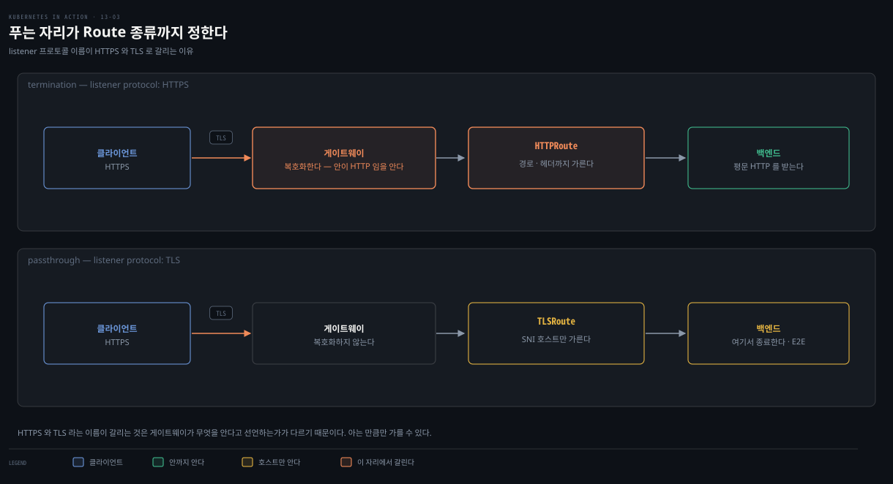

# TLS·기타 프로토콜·크로스 네임스페이스·mesh
---
> 게이트웨이는 TLS를 직접 종료하거나 그대로 통과시킬 수 있고, HTTP뿐 아니라 TCP·UDP·gRPC도 각 Route로 노출합니다. Route는 다른 네임스페이스의 Gateway·서비스도 참조할 수 있으며, 그 확장이 service mesh 내부 통신까지 닿습니다.


> 이 문서를 읽고 나면 TLS termination과 passthrough를 Route 종류와 함께 구분하고, TCP·UDP·gRPC 서비스를 각 Route로 노출하며, allowedRoutes·ReferenceGrant로 네임스페이스를 넘는 참조를 허가하고, GAMMA가 Gateway API를 mesh로 확장한 방식을 설명할 수 있습니다.


## 진입 — HTTP를 넘어서

> [13-02](./13-02.HTTPRoute%20%E2%80%94%20%EB%9D%BC%EC%9A%B0%ED%8C%85%EA%B3%BC%20%ED%95%84%ED%84%B0.md)까지 HTTP만 다뤘습니다. 이 편은 TLS 보안, TCP·UDP·gRPC 프로토콜, 네임스페이스를 넘는 참조, 그리고 mesh 내부 통신으로 Gateway API를 넓힙니다.

지금까지 평문 HTTP로 노출했지만 공개 서비스에는 부적절합니다. 또 Ingress와 달리 Gateway API는 일반 TCP·UDP·gRPC 서비스도 노출합니다. 이 편은 TLS·기타 프로토콜·크로스 네임스페이스·service mesh를 다룹니다.


## 1. TLS — termination vs passthrough

> 게이트웨이가 TLS를 직접 종료해 백엔드로 평문을 보내거나(termination), TLS를 그대로 통과시켜 백엔드가 종료하게(passthrough) 할 수 있습니다. 전자는 게이트웨이가 내용을 이해하고, 후자는 SNI의 호스트명만 압니다.

두 방식은 비슷해 보이지만 다릅니다. termination에서는 게이트웨이가 복호화해 HTTP 요청을 이해하지만, passthrough에서는 복호화하지 않아 안의 HTTP를 모릅니다 — SNI(Server Name Indication) 확장으로 수신자 호스트명만 압니다.



### termination — 게이트웨이가 종료

백엔드가 TLS를 못 하면 게이트웨이가 종료하고 백엔드로 평문 HTTP를 보냅니다. HTTPS listener에 `tls.mode: Terminate`와 인증서 Secret을 참조합니다.

```yaml
spec:
  listeners:
  - name: http
    port: 80
    protocol: HTTP
  - name: https
    port: 443
    protocol: HTTPS       # termination은 HTTPS 프로토콜
    tls:
      mode: Terminate
      certificateRefs:
      - kind: Secret       # 생략 시 기본 Secret
        name: kiada-tls
```

인증서가 Secret에 있으면 이름만 적으면 됩니다(kind는 기본 Secret). `tls.options`로 최소 TLS 버전·cipher suite 같은 구현별 옵션도 줍니다. termination에서는 게이트웨이가 밑 프로토콜을 알므로, 백엔드로 HTTP를 쓰는 것과 똑같이 **HTTPRoute**로 라우팅합니다 — 13-02에서 만든 HTTPRoute가 HTTP·HTTPS 요청을 모두 kiada 파드로 보냅니다.

### passthrough — 백엔드가 종료 (E2E 암호화)

각 kiada 파드는 TLS를 종료하는 Envoy sidecar를 돌립니다. 그러면 게이트웨이가 TLS를 종료하지 않고 통과시켜, 암호화가 백엔드까지 이어집니다(평문은 파드 안 loopback으로만 흐름). 대신 게이트웨이가 내용을 모르므로 HTTPRoute를 못 쓰고 **TLSRoute**를 씁니다.

```yaml
  - name: tls
    port: 443
    protocol: TLS         # passthrough는 TLS 프로토콜(HTTPS 아님)
    tls:
      mode: Passthrough
```

```yaml
apiVersion: gateway.networking.k8s.io/v1alpha2   # TLSRoute는 experimental
kind: TLSRoute
metadata:
  name: kiada
spec:
  parentRefs:
  - name: kiada
  hostnames:
  - kiada.example.com     # SNI 호스트명으로만 라우팅 가능
  rules:
  - backendRefs:
    - name: kiada-stable
      port: 443
```

TLSRoute는 SNI의 호스트명으로만 라우팅합니다 — 밑이 HTTP여도 경로·헤더 라우팅은 못 합니다(암호화돼 안 보임). 다만 weight로 백엔드 분할은 됩니다. 요청은 클라이언트→게이트웨이→Envoy sidecar까지 암호화된 채 흐르고, sidecar가 복호화해 같은 파드의 메인 컨테이너로 넘깁니다.


## 2. TCP·UDP·gRPC 노출

> Ingress와 달리 Gateway API는 일반 TCP·UDP를 TCPRoute·UDPRoute로, gRPC를 GRPCRoute로 노출합니다. 게이트웨이에 해당 프로토콜 listener를 더하고 Route를 만듭니다.

HTTP·TLS가 아닌 서비스는 프로토콜에 맞는 listener를 게이트웨이에 더하고 Route를 만들어 노출합니다.

### TCPRoute

listener `protocol: TCP`를 더하고 TCPRoute를 만듭니다. TCPRoute는 TLSRoute처럼 부모와 백엔드만 잇습니다 — 게이트웨이가 TCP 패킷 내용을 모르므로 내용 기반 라우팅은 못 하고, weight 분할만 됩니다.

```yaml
# Gateway listener
  - name: tcp200
    port: 200
    protocol: TCP
---
apiVersion: gateway.networking.k8s.io/v1alpha2   # experimental
kind: TCPRoute
metadata:
  name: test
spec:
  parentRefs:
  - name: test-gtw
  rules:
  - backendRefs:
    - name: test
      port: 2000
```

게이트웨이 200 포트로 온 TCP 연결이 백엔드 2000 포트로 넘어갑니다.

### UDPRoute

listener `protocol: UDP` + UDPRoute로 UDP 서비스를 노출합니다. 구조는 TCPRoute와 같습니다. 다만 작성 시점에 **Istio는 UDPRoute를 지원하지 않습니다** — 확인법은 Route를 만든 뒤 status를 보는 것입니다. status가 비어 있으면 어떤 컨트롤러도 처리하지 않았다는 뜻입니다.

### GRPCRoute

listener `protocol: HTTP`(gRPC는 HTTP 위에서 동작) + GRPCRoute로 gRPC를 노출합니다. HTTPRoute처럼 matches로 gRPC service·method를 매칭하고(Exact 또는 RegularExpression), RequestHeaderModifier·ResponseHeaderModifier·RequestMirror·ExtensionRef 필터를 씁니다.

```yaml
apiVersion: gateway.networking.k8s.io/v1alpha2
kind: GRPCRoute
spec:
  rules:
  - matches:
    - method:
        service: yages.Echo   # gRPC service
        method: Ping          # gRPC method
        type: Exact
    backendRefs:
    - name: test
      port: 9000
```

작성 시점에 **Istio는 GRPCRoute도 지원하지 않습니다** — 마찬가지로 status로 확인합니다.


## 3. 네임스페이스를 넘는 참조

> Route는 다른 네임스페이스의 Gateway·서비스를 참조할 수 있지만, 명시적 허가가 있어야 합니다. Gateway 공유는 allowedRoutes로, 서비스 참조는 ReferenceGrant로 허가합니다.

### Gateway 공유 — allowedRoutes

기본적으로 Gateway는 같은 네임스페이스의 Route만 참조할 수 있습니다. 각 listener의 `allowedRoutes.namespaces.from`으로 허용 범위를 넓힙니다 — `Same`(기본)·`All`·`Selector`.

```yaml
  - name: http
    port: 80
    protocol: HTTP
    allowedRoutes:
      namespaces:
        from: All            # 모든 네임스페이스의 Route 허용
  - name: tcp
    port: 200
    protocol: TCP
    allowedRoutes:
      namespaces:
        from: Selector       # 라벨 맞는 네임스페이스만
        selector:
          matchLabels:
            part-of: kiada
```

Route 쪽에서는 `parentRefs`에 `namespace`를 적어 다른 네임스페이스의 Gateway를 참조합니다. 네임스페이스를 이름으로 고르려면 `kubernetes.io/metadata.name` 라벨 키를 selector에 씁니다.

### 서비스 참조 — ReferenceGrant

Gateway 공유는 Gateway 오브젝트에서 허가하지만, 다른 네임스페이스의 서비스를 백엔드로 쓰는 것은 Service가 아니라 별도 `ReferenceGrant` 오브젝트로 허가합니다. Route의 backendRef에 다른 네임스페이스 서비스를 적으면, ReferenceGrant가 없는 한 ResolvedRefs가 `RefNotPermitted`로 False가 됩니다.

```yaml
apiVersion: gateway.networking.k8s.io/v1beta1   # stable
kind: ReferenceGrant
metadata:
  name: from-httproutes-in-kiada-to-some-service
  namespace: service-namespace     # 참조 대상(서비스)의 네임스페이스에 생성
spec:
  from:                            # 참조하는 쪽
  - group: gateway.networking.k8s.io
    kind: HTTPRoute
    namespace: kiada
  to:                              # 참조되는 쪽
  - group: ''
    kind: Service
    name: some-service             # 생략하면 그 kind 전부 허용
```

ReferenceGrant는 참조 **대상(referent)의 네임스페이스**에 만듭니다. `from`은 참조하는 리소스(name은 못 적음), `to`는 참조되는 리소스(name은 선택)를 적습니다. 이걸 만들면 kiada 네임스페이스의 HTTPRoute가 service-namespace의 some-service를 백엔드로 쓸 수 있습니다.


## 4. ingress gateway에서 service mesh로

> Gateway API는 원래 클러스터 밖→안(north/south) 트래픽용이었지만, 약간의 변경으로 서비스 간(east/west) 통신도 관리합니다. Route의 parentRef를 Gateway가 아니라 Service로 두는 것이 GAMMA의 해법입니다.

지금까지는 외부 클라이언트에게 서비스를 노출하는 north/south 트래픽이었습니다. 같은 API로 클러스터 안 서비스 간 east/west 트래픽도 관리할 수 있음을 알게 되어, 이것이 service mesh의 핵심이 됩니다.

service mesh는 서비스 간 통신을 돕는 전용 인프라 계층으로, 애플리케이션을 재설정·재배포하지 않고 관찰성·트래픽 관리·보안을 개선합니다. 처음엔 각 mesh가 자기 설정 방식을 썼고, SMI 명세가 표준화를 시도했으며, 이후 Gateway API를 확장하는 GAMMA(Gateway API Mesh Management and Administration) 이니셔티브로 옮겨갔습니다.

east/west에서는 트래픽이 추가 게이트웨이가 아니라 서비스 간에 직접 흘러야 합니다. GAMMA의 해법은 Route의 `parentRefs`에 Gateway 대신 **Service**를 두는 것입니다.

```yaml
kind: HTTPRoute
spec:
  parentRefs:
  - name: destination-service
    kind: Service          # 부모가 Gateway가 아니라 Service
    group: core
    port: 80
  rules:
  - ...
```

이 HTTPRoute는 그 서비스로 향하는 트래픽에 rule을 적용해 백엔드로 라우팅하고, 13-02의 필터로 변형도 합니다. service mesh와 GAMMA의 상세는 [service-mesh 통합 개념본](../../service-mesh/01_foundation/03-01.Gateway%20API%EC%99%80%20%ED%8A%B8%EB%9E%98%ED%94%BD.md)이 다룹니다.

> **Spring 관점.** Boot 앱 사이 호출(east/west)에 재시도·타임아웃·서킷 브레이커를 코드가 아니라 mesh 설정으로 넣습니다. Resilience4j를 앱에 넣는 대신, mesh가 프록시 계층에서 같은 일을 해 애플리케이션 코드를 얇게 유지합니다 — 다만 이는 mesh 도입 결정이 선행돼야 합니다.


## 면접에서 받을 만한 질문

> 아래 질문에 먼저 스스로 답해 본 뒤, 챕터 끝의 정답과 맞춰 봅니다.

1. TLS termination과 passthrough는 무엇이 다른가요? 각각 어떤 Route를 쓰고, 라우팅에 쓸 수 있는 정보는 무엇인가요?
2. TCPRoute·TLSRoute가 HTTPRoute와 달리 내용 기반 라우팅을 못 하는 이유는 무엇인가요? 그래도 할 수 있는 것은 무엇인가요?
3. Istio가 UDPRoute·GRPCRoute를 지원하는지 어떻게 확인하나요?
4. 다른 네임스페이스의 Gateway를 공유하는 것과 다른 네임스페이스의 서비스를 백엔드로 쓰는 것은 허가 방식이 어떻게 다른가요? ReferenceGrant는 어느 네임스페이스에 만드나요?
5. Gateway API가 north/south 트래픽에서 east/west(mesh) 트래픽으로 확장된 방식은 무엇인가요?


## 정답 (자답 후 펼치기)

> 위 질문에 답해 본 다음 아래와 맞춰 봅니다. 순서는 질문과 1:1로 대응합니다.

### 정답 1 — termination vs passthrough

termination은 게이트웨이가 TLS를 종료(복호화)해 백엔드로 평문 HTTP를 보냅니다 — 게이트웨이가 내용을 이해하므로 **HTTPRoute**로 경로·헤더까지 라우팅합니다(listener protocol HTTPS). passthrough는 TLS를 그대로 통과시켜 백엔드가 종료합니다 — 게이트웨이는 SNI의 호스트명만 알고 안의 HTTP는 모르므로 **TLSRoute**로 호스트명 기반 라우팅만 합니다(listener protocol TLS). passthrough는 암호화가 백엔드까지 이어져 더 안전합니다.

### 정답 2 — 내용 기반 라우팅 불가

TCPRoute·TLSRoute는 게이트웨이가 패킷 내용을 모르기 때문입니다 — TCP는 애초에 페이로드가 불투명하고, TLS는 암호화돼 SNI 호스트명 외엔 안 보입니다. 그래서 TLSRoute는 호스트명으로만, TCPRoute는 아무 조건 없이 라우팅합니다. 다만 둘 다 백엔드를 여럿 두고 weight를 주면 트래픽을 나눌 수 있습니다.

### 정답 3 — 지원 여부 확인

Route 오브젝트를 만든 뒤 그 status를 봅니다. 지원하는 컨트롤러가 처리하면 status에 조건이 채워지지만, 처리하는 컨트롤러가 없으면 status가 비어 있습니다. 작성 시점에 Istio는 UDPRoute·GRPCRoute를 지원하지 않아, 이들을 만들면 status가 비어 있는 것으로 확인됩니다(TCPRoute는 status가 채워짐).

### 정답 4 — Gateway 공유 vs 서비스 참조 허가

Gateway 공유는 Gateway 오브젝트 자체에서 허가합니다 — 각 listener의 `allowedRoutes.namespaces.from`을 Same·All·Selector로 설정합니다. 반면 다른 네임스페이스의 서비스를 백엔드로 쓰는 것은 Service 오브젝트가 아니라 별도 `ReferenceGrant` 오브젝트로 허가합니다. ReferenceGrant는 참조 **대상(referent)의 네임스페이스**(즉 서비스가 있는 네임스페이스)에 만들고, from에 참조하는 쪽, to에 참조되는 쪽을 적습니다.

### 정답 5 — north/south에서 east/west로

Route 오브젝트의 `parentRefs`에 Gateway 대신 **Service**를 두는 것이 GAMMA의 해법입니다. north/south에서는 parentRef가 Gateway를 가리켜 외부→서비스 트래픽을 관리하지만, east/west에서는 parentRef의 kind를 Service·group을 core로 두어, 그 서비스로 향하는 서비스 간 트래픽에 rule과 필터를 적용합니다. 덕분에 같은 API로 mesh 내부 통신까지 재설정·재배포 없이 관리합니다.


## 관련 문서

> 이 편은 TLS·TCP/UDP/gRPC·크로스 네임스페이스·mesh로 13장을 마무리하고, service mesh의 상세는 별도 개념본으로 이어집니다.

- [13-01. Gateway API 개념과 Gateway 배포](./13-01.Gateway%20API%20%EA%B0%9C%EB%85%90%EA%B3%BC%20Gateway%20%EB%B0%B0%ED%8F%AC.md) — Gateway·GatewayClass·status
- [13-02. HTTPRoute — 라우팅과 필터](./13-02.HTTPRoute%20%E2%80%94%20%EB%9D%BC%EC%9A%B0%ED%8C%85%EA%B3%BC%20%ED%95%84%ED%84%B0.md) — HTTP 라우팅·필터(앞 편)
- [Gateway API와 트래픽](../../service-mesh/01_foundation/03-01.Gateway%20API%EC%99%80%20%ED%8A%B8%EB%9E%98%ED%94%BD.md) — GAMMA·east/west·트래픽 관리 통합 개념본
- [Istio Ingress Gateway](../../service-mesh/03_istio/03-01.Istio%20Ingress%20Gateway.md) — Istio TLS 모드·TCP Gateway·마이그레이션
- 원서: 《Kubernetes in Action, 2nd Ed.》 Ch13 §13.4~13.7 — [Manning](https://www.manning.com/books/kubernetes-in-action-second-edition), [예제 코드](https://github.com/luksa/kubernetes-in-action-2nd-edition/tree/master/Chapter13)
- 공식 문서: [GAMMA](https://gateway-api.sigs.k8s.io/concepts/gamma/), [TLSRoute](https://gateway-api.sigs.k8s.io/api-types/tlsroute/)
