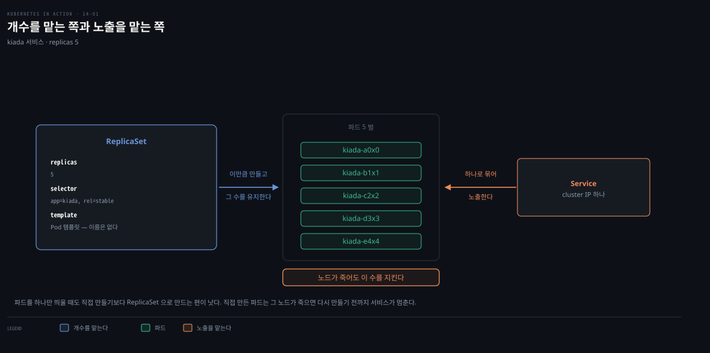
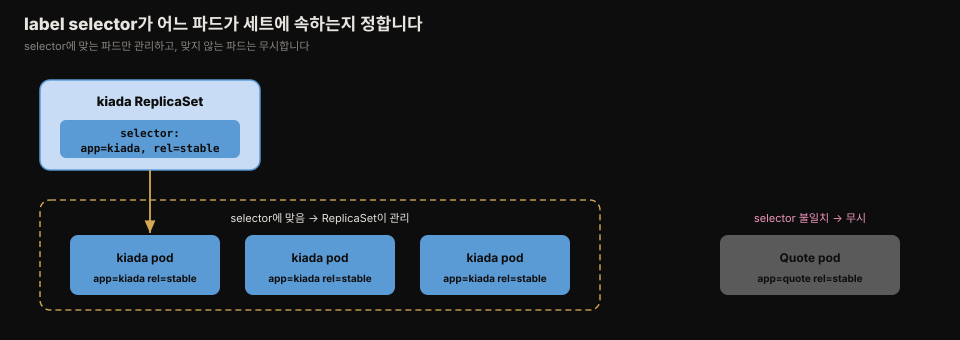
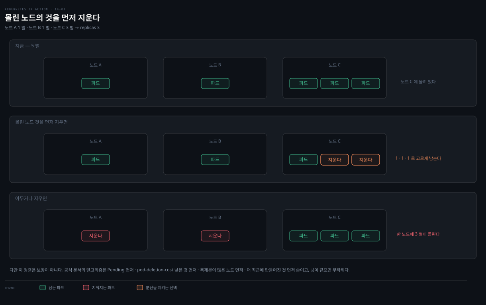

# ReplicaSet 기초 — 생성·소유·스케일링
---
> ReplicaSet은 똑같은 파드 여러 벌을 한 단위로 관리합니다. Pod 템플릿과 원하는 복제본 수를 적으면 쿠버네티스가 그만큼 파드를 만들고, 노드가 죽거나 파드가 사라져도 그 수를 유지합니다. label selector로 어느 파드가 이 세트에 속하는지 가립니다.


> 이 문서를 읽고 나면 ReplicaSet의 세 필드(replicas·selector·template)를 설명하고, label selector가 파드 소속을 어떻게 가리는지 근거를 대며, kubectl scale로 스케일하고, ownerReferences로 소유·가비지 컬렉션 관계를 읽을 수 있습니다.


## 진입 — 파드를 직접 만들지 않는 이유

> 프로덕션에서는 같은 파드를 수십·수백 벌 띄웁니다. 하나씩 만들고 관리하기는 어렵습니다. ReplicaSet은 그 생성·관리를 자동화합니다.

지금까지는 Pod 오브젝트를 직접 만들어 워크로드를 배포했습니다. 복제본이 몇 개 안 되면 괜찮지만, 수십·수백 벌이 되면 손으로 관리하기 어렵습니다. ReplicaSet 오브젝트가 이 자동화를 맡습니다.

파드를 하나만 띄울 때도 직접 만들기보다 ReplicaSet으로 만드는 편이 낫습니다. 중요한 서비스의 파드를 직접 만들었는데 자리를 비운 사이 그 노드가 죽으면, 파드를 다시 만들기 전까지 서비스가 멈춥니다. ReplicaSet으로 배포했다면 자동으로 파드를 재생성합니다.

ReplicaSet의 개념 모델·컨트롤러·reconciliation은 [핵심 워크로드 통합 개념본](../../kubernetes/01_foundation/01-02.%ED%95%B5%EC%8B%AC%20%EC%9B%8C%ED%81%AC%EB%A1%9C%EB%93%9C.md)이 크게 다룹니다. 이 편은 책의 실습(Kiada 서비스·kubectl 실측·소유권) 관점에서 차이분을 정리합니다.

> **주의.** ReplicaSet 이전에는 ReplicationController가 같은 일을 했고 지금은 deprecated입니다. 동작이 같아 이 장의 설명은 ReplicationController에도 그대로 적용됩니다.

> **왜 배우나.** 실무에서 워크로드는 ReplicaSet이 아니라 Deployment로 배포합니다(선언적 업데이트를 위해). 그런데 Deployment 기능 대부분은 그 밑에서 쿠버네티스가 만드는 ReplicaSet이 처리합니다. Deployment는 업데이트만 맡고 나머지는 ReplicaSet이 하므로, ReplicaSet을 이해해야 [15장 Deployment](./README.md)를 이해합니다.


## 1. ReplicaSet과 Service·Pod의 관계

> ReplicaSet은 파드를 한 단위로 관리할 뿐이라, 하나로 노출하려면 여전히 Service가 필요합니다. 특정 서비스를 제공하는 파드 세트는 대개 ReplicaSet과 Service를 둘 다 둡니다.



ReplicaSet은 복제본을 만들고 그 수를 유지합니다. 하지만 이 파드들을 하나의 대상으로 외부에 노출하는 것은 별개입니다 — 그 일은 [Service](./11-01.Service%20%EA%B8%B0%EC%B4%88%20%E2%80%94%20%ED%8C%8C%EB%93%9C%20%ED%86%B5%EC%8B%A0%C2%B7ClusterIP%C2%B7%EC%84%B8%EC%85%98%20%EC%96%B4%ED%94%BC%EB%8B%88%ED%8B%B0.md)가 합니다. 그래서 한 서비스를 제공하는 파드 세트는 보통 ReplicaSet(파드 관리)과 Service(파드 노출)를 짝으로 둡니다.

Service와 마찬가지로, ReplicaSet의 label selector와 파드 label이 어느 파드가 이 세트에 속하는지 정합니다. ReplicaSet은 selector에 맞는 파드만 신경 쓰고 나머지는 무시합니다.




## 2. ReplicaSet 만들기

> ReplicaSet의 spec에는 replicas·selector·template 세 필드를 적습니다. selector와 template는 필수, replicas는 생략하면 1입니다. selector의 label은 template label의 부분집합이어야 합니다.

세 필드의 뜻입니다.

| 필드 | 설명 |
|------|------|
| replicas | 원하는 복제본 수. ReplicaSet을 만들면 이 수만큼 template으로 파드를 만들고, 삭제 전까지 그 수를 유지 |
| selector | matchLabels(라벨 맵) 또는 matchExpressions(요구 목록). 매칭되는 파드를 이 세트의 일부로 간주 |
| template | 파드를 만들 Pod 템플릿. 새 파드가 필요할 때 이걸로 만듦 |

Kiada 서비스의 ReplicaSet 매니페스트입니다.

```yaml
apiVersion: apps/v1        # ReplicaSet은 apps 그룹 v1
kind: ReplicaSet
metadata:
  name: kiada
spec:
  replicas: 5              # 이 수만큼 파드 생성·유지
  selector:               # 어느 파드가 이 세트에 속하는지
    matchLabels:
      app: kiada
      rel: stable
  template:               # 이 템플릿으로 파드 생성(이름 없음 — RS 이름에서 생성)
    metadata:
      labels:
        app: kiada
        rel: stable
    spec:
      containers:
      - name: kiada
        image: luksa/kiada:0.5
      # ...
```

template의 label이 selector의 label을 포함해야 합니다. 그렇지 않으면 template으로 만든 파드가 원하는 복제본 수에 안 잡혀 파드가 무한히 생성되므로, 쿠버네티스 API가 ReplicaSet을 거부합니다. template에 파드 **이름이 없다**는 점도 눈에 띕니다 — 이름은 ReplicaSet 이름에서 생성됩니다.

```bash
kubectl apply -f rs.kiada.yaml
# replicaset.apps/kiada created
```


## 3. ReplicaSet과 파드 조회

> get rs는 DESIRED·CURRENT·READY를, `-o wide`는 컨테이너·이미지·selector를 보여줍니다. 파드는 selector를 get po `-l`에 넣어 나열합니다.

```bash
kubectl get rs kiada
# NAME    DESIRED   CURRENT   READY   AGE
# kiada   5         5         5       1m
```

세 열은 각각 status의 `replicas`(desired)·`fullyLabeledReplicas`(current)·`readyReplicas`(readiness probe 기준)에서 옵니다. `availableReplicas`(가용 복제본)도 있지만 이 명령엔 안 보입니다. rs 약어는 `rs`입니다.

`-o wide`를 붙이면 selector에 더해 **컨테이너 이름·이미지**까지 나옵니다. 정작 `get pods`에는 이 정보가 없으니, 컨테이너·이미지를 볼 때는 파드가 아니라 ReplicaSet을 `-o wide`로 나열합니다.

```bash
kubectl get rs -o wide
# NAME    ...   CONTAINERS    IMAGES                     SELECTOR
# kiada   ...   kiada,envoy   luksa/kiada:0.5,...         app=kiada,rel=stable
```

파드는 kubectl에 직접 방법이 없어, ReplicaSet의 selector를 `-l`에 넣어 나열합니다.

```bash
kubectl get po -l app=kiada,rel=stable
# kiada-001     2/2   Running   ...   # 이전에 직접 만든 3개 (adopt됨)
# kiada-002     2/2   Running   ...
# kiada-003     2/2   Running   ...
# kiada-86wzp   2/2   Running   ...   # RS가 새로 만든 2개
# kiada-k9hn2   2/2   Running   ...
```

ReplicaSet을 만들기 전 직접 만든 파드 3개의 label이 selector에 맞아 **adopt(입양)**됐고, 원하는 수 5를 채우려 2개가 새로 생겼습니다.

### 파드 이름 생성 — generateName

새 파드 이름에는 순번 대신 랜덤 문자 다섯 자가 붙습니다. 쿠버네티스가 만드는 오브젝트에 흔한 방식입니다. `name` 대신 `generateName`에 접두사를 적으면 API가 전체 이름을 생성하는데, ReplicaSet은 이 필드를 자기 이름으로 설정합니다.

```yaml
metadata:
  generateName: kiada-     # RS 이름 = 접두사. API가 전체 이름 생성
  name: kiada-86wzp        # 생성된 이름
```

ReplicaSet 파드는 서로 정확한 복제본이라 교체 가능(fungible)하고 순서 개념이 없어, 랜덤 이름이 자연스럽습니다. 순번은 삭제 시 구멍이 생겨 무의미합니다. 상태가 있는(stateful) 워크로드는 순번이 의미 있는데, 그건 [16장 StatefulSet](./README.md)이 맡습니다.

### 로그 — rs/name

파드 이름이 랜덤이라 로그 보기가 번거롭습니다. `rs/kiada`로 ReplicaSet을 지정하면 됩니다.

```bash
kubectl logs rs/kiada -c kiada                    # 파드 1개 로그(-c로 컨테이너 지정)
kubectl logs rs/kiada --all-pods -c envoy         # 모든 파드의 envoy 로그
kubectl logs rs/kiada --all-pods --all-containers # 모든 파드·컨테이너
kubectl logs rs/kiada --all-pods -c kiada -f      # 스트리밍(요청 분산 확인)
```

트래픽이 파드 간에 나뉠 때, 어느 파드가 처리했든 모든 요청을 보려면 여러 파드 로그를 한꺼번에 보는 게 유용합니다.


## 4. 파드 소유권 — ownerReferences와 GC

> ReplicaSet이 만든 파드는 그 ReplicaSet이 소유·제어합니다. 파드의 ownerReferences가 이 관계를 담고, 가비지 컬렉터가 소유자 삭제 시 의존 오브젝트를 함께 지웁니다.

```bash
kubectl describe po kiada-001
# ...
# Controlled By:  ReplicaSet/kiada   # 이제 이 파드는 RS가 제어
```

이 정보는 파드 매니페스트의 metadata에서 옵니다.

```yaml
metadata:
  name: kiada-001
  ownerReferences:                 # 이 오브젝트의 소유자 목록
  - apiVersion: apps/v1
    kind: ReplicaSet
    name: kiada
    controller: true               # 이 소유자가 제어자(controller)
    blockOwnerDeletion: true
    uid: 8e19d9b3-...
```

`ownerReferences`는 소유자를 담습니다. 여러 소유자가 가능하지만 대개 하나입니다. 여기서 kiada ReplicaSet이 소유자이고, 파드는 **의존(dependent)** 오브젝트입니다.

쿠버네티스의 **가비지 컬렉터**는 소유자가 삭제되면 의존 오브젝트를 자동으로 지웁니다. 소유자가 여럿이면 모두 사라졌을 때 지웁니다. kiada ReplicaSet을 지우면 그 파드들도 GC가 함께 지웁니다.

`controller: true`는 이 소유자가 오브젝트의 제어자임을 뜻합니다. 이제 세 파드를 직접 제어하지 말고 ReplicaSet을 통해 다뤄야 합니다.

> **Spring 관점.** Boot 앱을 replica 5로 띄워 두면, 노드 하나가 죽어도 ReplicaSet이 다른 노드에 파드를 재생성해 가용성을 유지합니다. 애플리케이션 코드는 그대로 두고, "몇 벌 띄울지"만 선언해 수평 확장·HA를 얻습니다. 다만 실무 배포는 이 ReplicaSet을 직접 쓰지 않고 [15장 Deployment](./README.md)로 감싸 롤링 업데이트까지 얻습니다.


## 5. 스케일링 — 복제본 수 바꾸기

> selector는 불변이지만 replicas와 template는 바꿀 수 있습니다. replicas를 바꾸면 스케일됩니다 — scale·edit·apply 모두 가능하고, kubectl scale이 가장 간단합니다.

```bash
kubectl scale rs kiada --replicas 6      # 6으로 스케일업
# kubectl edit rs kiada 로 매니페스트의 replicas를 4로 → 스케일다운도 가능
```

스케일업하면 파드가 하나 늘고, 스케일다운하면 초과분이 Terminating으로 사라집니다. 사용자가 늘면 같은 명령으로 100벌 이상으로도 순식간에 스케일합니다(클러스터 용량이 받쳐 주는 한).

### 스케일다운 시 삭제 순서 8규칙

스케일다운에서 쿠버네티스는 잘 설계된 순서로 어느 파드를 먼저 지울지 정합니다 — 무작위가 아닙니다.

1. 아직 노드에 배정 안 된 파드
2. phase가 unknown인 파드
3. ready가 아닌 파드
4. deletion cost가 낮은 파드
5. 더 많은 관련 복제본과 같은 노드에 몰린(collocated) 파드
6. ready였던 시간이 더 짧은 파드
7. 컨테이너 재시작이 더 많은 파드
8. 나중에 생성된 파드

미스케줄·결함 파드를 먼저 지우고 잘 도는 파드는 남깁니다. `controller.kubernetes.io/pod-deletion-cost` 어노테이션(32비트 정수 문자열)으로 우선순위를 조정할 수 있습니다 — 값이 낮거나 없는 파드가 먼저 삭제됩니다.

쿠버네티스는 파드를 노드에 고르게 유지하려 합니다. 5→3으로 줄일 때, 한 노드에 복제본이 몰려 있으면 그 노드 것을 먼저 지웁니다 — 안 그러면 한 노드에 3벌이 몰릴 수 있습니다.



### 0으로 스케일

복제본을 0으로 줄이면 관리하는 파드가 모두 삭제되지만 ReplicaSet 오브젝트는 남아, 언제든 다시 올릴 수 있습니다. 워크로드를 잠시 전부 내려야 하면 ReplicaSet을 지우지 말고 복제본을 0으로 둡니다. [15장 Deployment](./README.md)가 소유한 ReplicaSet이 0으로 스케일된 상태는 아주 흔합니다.


## 6. Pod 템플릿 수정 — 쿠키 커터

> template를 바꿔도 기존 파드는 바뀌지 않고, 이후 만들어지는 파드에만 적용됩니다. 이 점이 ReplicaSet과 Deployment를 가르는 핵심입니다.

파드에 버전 label을 넣으려면 template의 `metadata.labels`에 넣습니다(selector가 아니라). `kubectl label`은 ReplicaSet 자체에 붙으니, `kubectl edit`로 template를 고칩니다.

```yaml
  template:
    metadata:
      labels:
        app: kiada
        rel: stable
        ver: '0.5'      # 여기에 추가. label 값은 문자열이라 반드시 따옴표
```

selector에는 넣지 않습니다 — selector는 불변이라 API가 거부합니다. 버전 번호는 따옴표로 감싸야 합니다. 안 그러면 YAML 파서가 소수로 읽어 실패합니다(label 값은 문자열이어야 함). selector의 label과 template의 label이 똑같을 필요는 없지만, **selector의 label은 template label의 부분집합**이어야 합니다.

수정 후 기존 파드를 보면 label이 안 바뀝니다. 스케일업으로 새 파드를 하나 만들어야 그 파드에만 새 label이 붙습니다.

```bash
kubectl scale rs kiada --replicas 3
kubectl get pods -l app=kiada --show-labels
# kiada-dl7vz   ...   app=kiada,rel=stable            # 기존 — 미변경
# kiada-z9dp2   ...   app=kiada,rel=stable,ver=0.5    # 새 파드 — label 붙음
```

template는 쿠버네티스가 새 파드를 찍어 내는 **쿠키 커터**입니다. template를 바꾸면 커터만 바뀌고, 그 뒤에 찍힌 파드만 영향받습니다. 기존 파드를 새 버전으로 바꾸려면 이것으로는 부족합니다 — 그 자동화가 바로 Deployment입니다([15장](./README.md) 복선).


## 면접에서 받을 만한 질문

> 아래 질문에 먼저 스스로 답해 본 뒤, 챕터 끝의 정답과 맞춰 봅니다.

1. ReplicaSet의 spec에 적는 세 필드는 무엇인가요? 그중 필수는 무엇이고, selector의 label과 template의 label은 어떤 관계여야 하나요?
2. ReplicaSet과 Service는 각각 무슨 역할을 하나요? 왜 둘을 짝으로 두나요?
3. ReplicaSet이 기존에 직접 만든 파드를 관리하게 되는 조건은 무엇인가요(adopt)? 파드 이름은 어떻게 정해지나요?
4. ownerReferences와 가비지 컬렉터는 어떤 관계인가요? controller: true는 무엇을 뜻하나요?
5. ReplicaSet의 template를 수정하면 기존 파드는 어떻게 되나요? 이 동작을 무엇에 비유하며, 어떤 함의가 있나요?


## 정답 (자답 후 펼치기)

> 위 질문에 답해 본 다음 아래와 맞춰 봅니다. 순서는 질문과 1:1로 대응합니다.

### 정답 1 — 세 필드와 label 관계

replicas(원하는 복제본 수)·selector(어느 파드가 속하는지)·template(파드를 만들 Pod 템플릿)입니다. selector와 template는 필수이고, replicas는 생략하면 1입니다. selector의 label은 반드시 **template label의 부분집합**이어야 합니다. 둘이 어긋나면 template으로 만든 파드가 원하는 수에 안 잡혀 파드가 무한 생성되므로, API가 ReplicaSet을 거부합니다.

### 정답 2 — ReplicaSet vs Service

ReplicaSet은 파드를 만들고 그 수를 유지하며(관리), Service는 그 파드들을 하나의 안정된 주소로 외부에 노출합니다(노출). 둘은 관심사가 달라 한 오브젝트가 겸하지 않습니다. 그래서 한 서비스를 제공하는 파드 세트는 대개 ReplicaSet과 Service를 짝으로 둡니다 — 하나는 파드를 살아 있게 하고, 하나는 클라이언트가 닿게 합니다.

### 정답 3 — adopt와 이름 생성

ReplicaSet의 label selector에 맞는 label을 가진 파드는, 직접 만든 것이라도 그 ReplicaSet이 adopt(입양)해 관리합니다 — 소속은 이름이 아니라 오직 label로 정해집니다. 파드 이름은 template에 이름이 없고, ReplicaSet 이름을 접두사로 한 `generateName`으로 API가 랜덤 문자를 붙여 생성합니다. 복제본은 서로 교체 가능하고 순서 개념이 없어 랜덤 이름이 자연스럽습니다.

### 정답 4 — ownerReferences와 GC

파드의 `ownerReferences`는 그 파드를 소유한 오브젝트(여기선 ReplicaSet)를 담습니다. 가비지 컬렉터는 소유자가 삭제되면 그 의존(dependent) 오브젝트를 자동으로 지웁니다 — ReplicaSet을 지우면 그 파드들도 GC가 함께 지웁니다(소유자가 여럿이면 모두 사라졌을 때). `controller: true`는 그 소유자가 오브젝트의 제어자라는 뜻으로, 이제 파드를 직접 다루지 말고 ReplicaSet을 통해 다뤄야 함을 알립니다.

### 정답 5 — template 수정과 쿠키 커터

template를 수정해도 **기존 파드는 바뀌지 않고**, 그 뒤에 새로 만들어지는 파드에만 새 template가 적용됩니다. 이 동작은 **쿠키 커터**에 비유합니다 — 커터를 바꿔도 이미 찍어 낸 쿠키는 그대로이고, 이후에 찍는 쿠키만 새 모양이 됩니다. 함의는 ReplicaSet만으로는 실행 중인 워크로드를 새 버전으로 업데이트할 수 없다는 것입니다. 그 자동화가 Deployment이며, 이것이 실무에서 ReplicaSet 대신 Deployment를 쓰는 핵심 이유입니다.


## 관련 문서

> 이 편은 13장 Gateway API를 이어받아 "replica를 누가 관리하는가"로 넘어가며, ReplicaSet 컨트롤러의 reconciliation·장애 복구·삭제(14-02)로 이어집니다.

- [14-02. ReplicaSet 컨트롤러 — reconciliation·장애복구·삭제](./14-02.ReplicaSet%20%EC%BB%A8%ED%8A%B8%EB%A1%A4%EB%9F%AC%20%E2%80%94%20reconciliation%C2%B7%EC%9E%A5%EC%95%A0%EB%B3%B5%EA%B5%AC%C2%B7%EC%82%AD%EC%A0%9C.md) — 컨트롤러 동작·노드 장애·orphan(다음 편)
- [13-03. TLS·기타 프로토콜·크로스 네임스페이스·mesh](./13-03.TLS%C2%B7%EA%B8%B0%ED%83%80%20%ED%94%84%EB%A1%9C%ED%86%A0%EC%BD%9C%C2%B7%ED%81%AC%EB%A1%9C%EC%8A%A4%20%EB%84%A4%EC%9E%84%EC%8A%A4%ED%8E%98%EC%9D%B4%EC%8A%A4%C2%B7mesh.md) — Gateway API 마지막 편(앞 장)
- [11-01. Service 기초 — 파드 통신·ClusterIP·세션 어피니티](./11-01.Service%20%EA%B8%B0%EC%B4%88%20%E2%80%94%20%ED%8C%8C%EB%93%9C%20%ED%86%B5%EC%8B%A0%C2%B7ClusterIP%C2%B7%EC%84%B8%EC%85%98%20%EC%96%B4%ED%94%BC%EB%8B%88%ED%8B%B0.md) — ReplicaSet과 짝을 이루는 Service·label selector
- [07-02. label과 label selector로 오브젝트 조직하기](./07-02.label%EA%B3%BC%20label%20selector%EB%A1%9C%20%EC%98%A4%EB%B8%8C%EC%A0%9D%ED%8A%B8%20%EC%A1%B0%EC%A7%81%ED%95%98%EA%B8%B0.md) — matchLabels·matchExpressions 상세
- [핵심 워크로드](../../kubernetes/01_foundation/01-02.%ED%95%B5%EC%8B%AC%20%EC%9B%8C%ED%81%AC%EB%A1%9C%EB%93%9C.md) — ReplicaSet·Deployment·컨트롤러 통합 개념본
- [02-04. Service와 EndpointSlice](../../kubernetes/02_networking/02-04.Service%EC%99%80%20EndpointSlice.md) — label selector로 파드를 묶는 개념본
- 원서: 《Kubernetes in Action, 2nd Ed.》 Ch14 §14.1~14.2 — [Manning](https://www.manning.com/books/kubernetes-in-action-second-edition), [예제 코드](https://github.com/luksa/kubernetes-in-action-2nd-edition/tree/master/Chapter14)
- 공식 문서: [ReplicaSet](https://kubernetes.io/docs/concepts/workloads/controllers/replicaset/)
