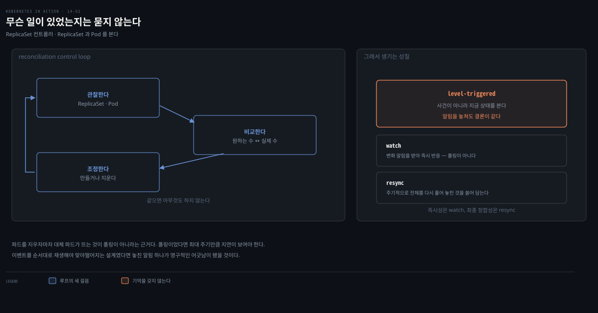
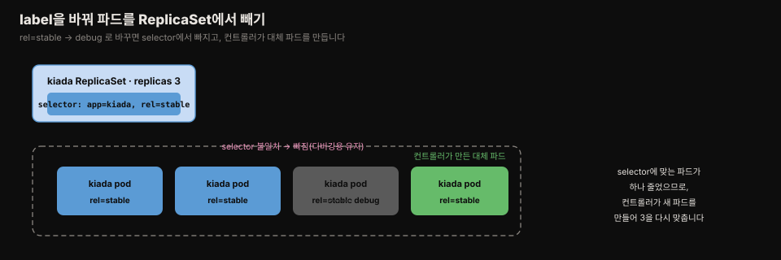

# ReplicaSet 컨트롤러 — reconciliation·장애복구·삭제
---
> ReplicaSet 컨트롤러는 원하는 파드 수와 실제 파드 수를 끊임없이 비교해 맞춥니다. 파드를 지우거나 노드가 죽으면 즉시 재생성하고, selector에 맞는 파드가 넘치면 지웁니다. 이 관찰-비교-조정 순환이 모든 쿠버네티스 컨트롤러의 심장입니다.


> 이 문서를 읽고 나면 reconciliation control loop를 관찰-비교-조정으로 설명하고, 파드 삭제·노드 장애에 컨트롤러가 어떻게 반응하는지 근거를 대며, ReplicaSet이 무엇을 보장하고 무엇을 보장하지 않는지 가르고, --cascade=orphan으로 파드를 보존할 수 있습니다.


## 진입 — 컨트롤러가 하는 일

> ReplicaSet의 replicas·template를 바꾸면 쿠버네티스가 파드에 무언가를 합니다. 그 행동을 하는 컴포넌트가 컨트롤러입니다. 대부분의 오브젝트 타입에는 연관된 컨트롤러가 있습니다.

[14-01](./14-01.ReplicaSet%20%EA%B8%B0%EC%B4%88%20%E2%80%94%20%EC%83%9D%EC%84%B1%C2%B7%EC%86%8C%EC%9C%A0%C2%B7%EC%8A%A4%EC%BC%80%EC%9D%BC%EB%A7%81.md)에서 replicas·template를 바꾸자 쿠버네티스가 파드를 만들거나 지웠습니다. 그 일을 하는 컴포넌트가 **컨트롤러**입니다.

API로 만드는 오브젝트 타입 대부분에 연관 컨트롤러가 있습니다. Ingress에는 Ingress controller가, Endpoints에는 Endpoints controller가, Namespace에는 Namespace controller가 붙는 식입니다.

ReplicaSet은 당연히 ReplicaSet 컨트롤러가 관리합니다. ReplicaSet에 가한 변경은 이 컨트롤러가 감지·처리하고, 스케일하면 이 컨트롤러가 파드를 만들거나 지웁니다. 그때마다 **Event** 오브젝트를 만들어 무엇을 했는지 알립니다.

```bash
kubectl describe rs kiada
# Events:
#   Normal  SuccessfulDelete  34m  replicaset-controller  Deleted pod: kiada-k9hn2
#   Normal  SuccessfulCreate  30m  replicaset-controller  Created pod: kiada-dl7vz
```

컨트롤러의 동작을 알아야 ReplicaSet을 이해합니다. 컨트롤러 일반 모델은 [핵심 워크로드 개념본](../../kubernetes/01_workloads/01-01.%ED%95%B5%EC%8B%AC%20%EC%9B%8C%ED%81%AC%EB%A1%9C%EB%93%9C.md)이 다룹니다.


## 1. reconciliation control loop

> 컨트롤러는 소유·의존 오브젝트의 상태를 관찰하고, 변화가 있을 때마다 의존 오브젝트의 실제 상태를 소유 오브젝트의 원하는 상태와 비교합니다. 다르면 조정합니다. 이 순환이 모든 컨트롤러에 있습니다.



컨트롤러는 소유(owner) 오브젝트와 의존(dependent) 오브젝트의 상태를 관찰합니다. 상태가 바뀔 때마다 의존 오브젝트의 상태를 소유 오브젝트에 적힌 원하는 상태와 비교합니다. 둘이 다르면 의존 오브젝트를 바꿔 두 상태를 맞춥니다. 이 조정을 reconcile이라 하고, 순환 전체를 **reconciliation control loop**이라 부릅니다. 모든 컨트롤러에 있습니다.

ReplicaSet 컨트롤러의 순환은 ReplicaSet과 Pod를 관찰합니다. 둘 중 하나가 바뀔 때마다 ReplicaSet에 딸린 파드 목록을 확인해, 실제 파드 수가 원하는 수와 같은지 봅니다. 실제가 적으면 template로 새 복제본을 만들고, 많으면 초과분을 지웁니다.

### 주기적으로 세는 것이 아니라 변화에 반응합니다

"관찰한다"를 몇 초에 한 번씩 깨어나 세어 보는 폴링으로 읽기 쉬운데, 그렇지 않습니다. 컨트롤러는 API 서버의 **watch** 로 변화 알림을 받아 그때 반응합니다. 파드를 지우자마자 대체 파드가 뜨는 것이 근거입니다. 폴링이었다면 최대 주기만큼 지연이 보여야 합니다.

다만 watch 하나만으로는 구멍이 납니다. 연결이 끊기거나 컨트롤러가 재시작되는 사이의 알림은 아무도 다시 보내 주지 않아, 어긋난 상태가 그대로 남습니다. 그래서 실제 구현은 watch 로 즉시 반응하면서, 주기적으로 전체를 다시 훑는 **resync** 를 함께 돌려 놓친 것을 쓸어 담습니다. 즉시성은 watch 가, 최종적인 정합성은 resync 가 맡는 이중 구조입니다.

이 구조가 앞 절의 성질과 이어집니다. 루프는 "무슨 일이 있었는가"를 기억하지 않고 **매번 지금 상태만** 봅니다. 그래서 알림을 몇 개 놓쳐도 다음 관찰에서 같은 결론에 도달합니다. 이벤트를 순서대로 재생해야 맞아떨어지는 설계였다면 놓친 알림 하나가 영구적인 어긋남이 됐을 것입니다.


## 2. 파드 변경에 대한 반응

> replicas를 건드리지 않아도 실제 파드 수가 바뀔 수 있습니다. 파드를 지우면 재생성하고, selector에 맞는 파드를 수동으로 만들면 지웁니다 — 이름이 아니라 label만 봅니다.

### 파드를 지우면 재생성

```bash
kubectl delete pod kiada-z9dp2
kubectl get pods -l app=kiada
# kiada-dl7vz   ...   Running   ...
# kiada-dn9fb   ...   Running   ...
# kiada-rfkqb   ...   Running   47s   # 사라진 파드를 대체한 새 파드
```

- 지운 파드는 사라지고 새 파드가 즉시 그 자리를 채워, 다시 원하는 수와 같아집니다. 모든 Kiada 파드를 지워도 곧바로 새것이 나타납니다.

### selector에 맞는 파드를 수동 생성하면 삭제

컨트롤러는 파드가 부족하면 만들듯, 넘치면 지웁니다. 이름이 `kiada-` 접두사와 안 맞아도, label이 selector에 맞으면 컨트롤러 눈에는 초과분입니다.

```bash
kubectl apply -f pod.one-kiada-too-many.yaml
kubectl get po -l app=kiada
# ...
# one-kiada-too-many   0/2   Terminating   3s   # 방금 만들었는데 이미 삭제 중
```

이름은 상관없고 오직 파드의 label만 봅니다.

### 노드 장애 시 파드 교체

ReplicaSet의 진짜 이점은 노드가 죽었을 때 파드가 자동 교체되는 것입니다. 노드의 네트워크 인터페이스를 내려 장애를 흉내 냅니다(kind 기준).

```bash
docker exec kind-worker2 ip link set eth0 down   # 노드 네트워크 down
```

곧 Node 오브젝트 status가 NotReady로 바뀝니다. Kubelet이 한동안 API 서버에 연락하지 못했다는 뜻입니다. 일시적 네트워크 장애일 수도 있어 파드는 잠시 Running으로 남지만, 몇 분 뒤 쿠버네티스가 노드가 죽었다고 판단해 그 파드들을 삭제 대상으로 마킹합니다.

```bash
kubectl get pods -l app=kiada -o wide
# kiada-ffstj   ...   Running       ...   kind-worker    # 대체 새 파드
# kiada-l2r85   ...   Terminating   ...   kind-worker2   # 죽은 노드의 파드
# kiada-n98df   ...   Terminating   ...   kind-worker2
# kiada-vnc4b   ...   Running       ...   kind-worker
# kiada-wkpsn   ...   Running       ...   kind-worker    # 대체 새 파드
```

죽은 노드의 파드 2개가 Terminating이 되고, 건강한 노드에 새 파드 2개가 배정돼 다시 3벌이 됩니다. Terminating 파드는 노드가 돌아올 때까지 그 상태로 남습니다 — 노드의 Kubelet이 API 서버와 통신하지 못해 컨테이너를 아직 종료하지 않기 때문입니다. 네트워크가 복구되면 Kubelet이 컨테이너를 종료하고 파드 오브젝트가 지워집니다.

> **주의.** 노드가 불가용해진 뒤 그 파드가 삭제되기까지 걸리는 시간은 Taints and Tolerations로 설정합니다.

> **공식 문서로 보강 — "몇 분"의 정체는 300초입니다.** 책이 "몇 분 뒤"로 뭉뚱그린 그 시간은 임의값이 아니라 **taint 기반 축출의 기본 `tolerationSeconds=300`**(5분)입니다. 노드가 응답하지 않으면 `node.kubernetes.io/not-ready` 또는 `node.kubernetes.io/unreachable` taint가 노드에 붙고, 쿠버네티스는 모든 파드에 이 두 taint에 대한 toleration을 `tolerationSeconds=300`으로 **자동 추가**합니다.[^taint] 그래서 파드는 5분간 Running으로 버티다 축출됩니다.
>
> 이 값을 알면 앞의 관찰이 설명됩니다 — NotReady 전환은 빠른데 파드 교체는 한참 뒤인 이유가 이 5분입니다. 장애 감지를 앞당기려면 파드 spec에 `tolerationSeconds`를 더 짧게 직접 선언합니다. 다만 짧게 잡으면 일시적 네트워크 순단에도 파드가 축출되니, "빠른 복구"와 "불필요한 재배치" 사이의 트레이드오프입니다.
>
> 구현 위치도 옮겨졌습니다. **v1.29부터** taint 기반 축출은 node controller가 아니라 별도의 `taint-eviction-controller`가 맡습니다.[^taint] 책(v1.21 기준 출력)과 최신 클러스터의 컴포넌트 이름이 다른 이유입니다.


#### Terminating은 실제 종료가 아니라 삭제 표시입니다

여기서 헷갈리기 쉬운 지점이 있습니다. 노드와 연락이 끊겼는데 어떻게 그 노드의 파드를 Terminating으로 바꿀 수 있느냐는 것입니다. 답은 **그 표시가 노드에서 일어나는 일이 아니기 때문**입니다. 삭제는 두 단계로 나뉩니다.

1. API 서버가 파드 오브젝트에 `deletionTimestamp`를 찍습니다. etcd 안의 기록을 고치는 일이라 노드와 통신할 필요가 없습니다.
2. 그 노드의 kubelet이 표시를 보고 컨테이너를 종료한 뒤 완료를 보고하면, 그때 오브젝트가 사라집니다.

`kubectl get`이 보여 주는 `Terminating`은 1번의 타임스탬프를 읽어 표시한 것입니다. 공식 문서도 이 값이 사용자 직관을 위한 **kubectl 표시 필드**일 뿐 Pod API의 `phase`가 아니라고 못 박습니다.[^pod-lifecycle] 지금은 2번이 오지 않으므로, **장부에는 "삭제 중"인데 컨테이너는 그 노드에서 계속 돌고 있을 수 있습니다.** 네트워크가 복구되면 kubelet이 밀린 지시를 수행하고 그제야 파드가 사라집니다.

그래서 공식 문서는 이 상태의 파드를 없애는 길을 셋으로 정리합니다. Node 오브젝트를 지우거나, kubelet이 응답을 재개해 스스로 정리하거나, 사용자가 강제 삭제하는 것입니다.[^force-delete]

#### 컨트롤러는 Terminating 파드를 세지 않습니다

옛 파드가 아직 안 없어졌는데 대체 파드가 먼저 뜨는 이유가 여기 있습니다. 컨트롤러는 `deletionTimestamp`가 찍힌 파드를 세지 않습니다. [14-01](./14-01.ReplicaSet%20%EA%B8%B0%EC%B4%88%20%E2%80%94%20%EC%83%9D%EC%84%B1%C2%B7%EC%86%8C%EC%9C%A0%C2%B7%EC%8A%A4%EC%BC%80%EC%9D%BC%EB%A7%81.md)의 status 필드가 하나같이 non-terminating 파드만 센다고 정의된 것이 이 규칙입니다. 5개 중 2개가 Terminating이면 컨트롤러 눈에는 3개이고, 부족한 2개를 즉시 만듭니다.

빠른 복구를 얻는 대신 **일시적으로 복제본이 초과할 수 있음**을 받아들인 선택입니다. 옛 컨테이너가 아직 살아 있다면 잠시 5벌이 아니라 7벌이 도는 셈입니다. Kiada 같은 stateless 웹 앱은 잠깐 초과해도 문제가 없어 이 절충이 성립합니다.

반대로 "같은 정체성의 인스턴스가 동시에 둘일 수 없다"가 깨지면 안 되는 워크로드는 이 방식을 쓸 수 없습니다. 공식 문서가 강제 삭제를 경고하는 이유도 같습니다 — kubelet의 확인을 기다리지 않고 지우면 아직 살아 있는 파드가 복제되어, StatefulSet이 보장하려는 at-most-one 의미가 깨집니다.[^force-delete] 그 보수적인 처리는 [16장 StatefulSet](./README.md)이 다룹니다.


## 3. ReplicaSet이 보장하지 않는 것

> ReplicaSet은 원하는 **수**의 파드가 존재함만 보장하지, 그 컨테이너가 실제로 건강하고 트래픽을 받을 수 있음은 보장하지 않습니다. probe에 실패해 계속 죽는 파드는 자동으로 교체되지 않습니다.

파드 수가 원하는 값과 같아도, 그 파드들이 서비스를 못 할 수 있을까요? 그럴 수 있습니다. liveness probe가 실패하면 컨테이너가 재시작되고, 여러 번 실패하면 [지수 백오프](./06-02.liveness%C2%B7startup%20probe%EB%A1%9C%20%EC%BB%A8%ED%85%8C%EC%9D%B4%EB%84%88%20%EA%B1%B4%EA%B0%95%20%EC%9C%A0%EC%A7%80.md)로 재시작이 지연됩니다.

그 지연 동안 컨테이너는 동작하지 않습니다. 그래도 쿠버네티스는 결국 돌아온다고 가정하며, readiness probe 실패 역시 언젠가 고쳐진다고 봅니다.

그래서 컨테이너가 계속 크래시하거나 probe에 실패하는 파드는, 컨트롤러가 정상 파드로 교체할 수 있는데도 **자동으로 삭제하지 않습니다**. ReplicaSet은 원하는 수의 건강한 복제본을 항상 보장하지는 않습니다.

```bash
kubectl exec rs/kiada -c kiada -- curl -X POST localhost:9901/healthcheck/fail
kubectl get pods -l app=kiada
# kiada-78j7m   1/2   Running   ...   # 컨테이너 2개 중 1개만 ready
kubectl get rs
# kiada   3   3   2   ...             # 3개 중 2개만 ready인데 교체 안 함
```

> **주의.** ReplicaSet은 원하는 수의 파드가 존재함만 보장합니다. 그 컨테이너가 실제로 돌며 트래픽을 받을 준비가 됐음은 보장하지 않습니다.

### 1/2인데 Running인 것은 모순이 아닙니다

위 출력에서 `READY`는 `1/2`인데 `STATUS`는 `Running`입니다. 두 열이 서로 다른 층을 보기 때문입니다. Pod phase `Running`의 정의는 "파드가 노드에 배정됐고 **모든** 컨테이너가 생성됐으며, **최소 하나가** 실행 중이거나 시작·재시작 중"입니다.[^pod-lifecycle] 둘 중 하나만 살아 있어도 조건을 만족합니다.

ready 여부는 phase가 아니라 컨테이너별 **condition**에 들어 있고, `READY` 열이 그것을 세어 보여 줍니다. 그래서 두 값은 층이 다릅니다.

- **phase**: 파드가 생애주기의 어느 단계에 있는가 (Pending·Running·Succeeded·Failed·Unknown)
- **condition**: 지금 트래픽을 받을 수 있는가

컨트롤러가 세는 것은 파드의 존재이지 이 condition이 아닙니다. 그래서 `1/2`짜리 파드도 컨트롤러에게는 온전한 한 개입니다.

### 왜 컨트롤러가 ready까지 보지 않는가 — 책임의 경계

"컨트롤러가 ready 상태까지 보고 교체하면 되지 않나"는 자연스러운 의문입니다. 앞서 본 무한 재생성 위험이 첫 번째 이유이고, 두 번째 이유는 **책임이 겹치기 때문**입니다.

그 파드를 고치려 애쓰는 주체는 이미 있습니다. kubelet이 liveness probe로 컨테이너를 재시작하고, 실패가 반복되면 백오프로 간격을 늘립니다. 여기서 컨트롤러까지 "not ready니 파드째로 지우자"고 나서면 같은 파드를 두고 두 주체가 반대 판단을 내립니다. 어느 쪽이 이기는지가 타이밍에 좌우되면 재현되지 않는 장애가 됩니다.

그래서 경계를 파드 껍데기에 긋습니다.

| 주체 | 책임 | 보는 것 |
|---|---|---|
| kubelet | 파드 **안** — 컨테이너를 살아 있게 유지 | 컨테이너 프로세스, probe 결과 |
| ReplicaSet 컨트롤러 | 파드 **개수** — 세트에 몇 개 있는가 | 오브젝트의 존재 여부 |

각자 한 층만 책임지면 충돌 자체가 생기지 않습니다. 대신 그 사이에 공백이 남습니다. **개수는 맞는데 서비스가 반쪽인 상태를 쿠버네티스가 스스로 알아채지 못합니다.**

### 공백은 관측이 메웁니다

이 공백은 설계상 바깥으로 넘긴 몫입니다. [14-01](./14-01.ReplicaSet%20%EA%B8%B0%EC%B4%88%20%E2%80%94%20%EC%83%9D%EC%84%B1%C2%B7%EC%86%8C%EC%9C%A0%C2%B7%EC%8A%A4%EC%BC%80%EC%9D%BC%EB%A7%81.md)에서 본 `readyReplicas`·`availableReplicas`가 RS의 status에 굳이 따로 존재하는 이유가 그것입니다. 컨트롤러가 판정에 쓰려고가 아니라, **바깥에서 지켜보라고** 내어 둔 값입니다.

실무에서는 `availableReplicas`가 `spec.replicas`보다 작은 상태가 일정 시간 이어지면 알람을 겁니다. kube-state-metrics가 이 값을 메트릭으로 노출하고, Prometheus가 수집해 Alertmanager가 알리는 경로가 표준적입니다. 자가 치유가 닿지 않는 영역을 사람이 제때 알도록 만드는 장치입니다.

프로덕션에서 이런 일이 나고 남은 파드가 트래픽을 다 못 받으면, 문제 파드를 직접 지워야 합니다. 그런데 지우기 전에 원인을 조사하고 싶다면 어떻게 할까요.


## 4. 파드를 ReplicaSet에서 분리

> selector에 맞는 파드 수가 원하는 수와 같도록 컨트롤러가 늘 맞추므로, 문제 파드의 label을 바꿔 selector에서 빼면 컨트롤러가 대체 파드를 만듭니다. 문제 파드는 남아 있어 느긋하게 디버깅합니다.



문제 파드가 selector에 맞으려면 `app=kiada`·`rel=stable`을 둘 다 가져야 합니다. 하나를 바꾸면 세트에서 빠집니다.

```bash
kubectl label po kiada-78j7m rel=debug --overwrite
kubectl get pods -l app=kiada -L app,rel
# kiada-78j7m   1/2   Running   ...   kiada   debug    # selector에서 빠진 문제 파드
# kiada-98lmx   2/2   Running   ...   kiada   stable
# kiada-wk99p   2/2   Running   ...   kiada   stable
# kiada-xtxcl   2/2   Running   ...   kiada   stable   # 대체 파드
```

`rel`을 debug로 바꾸니 selector에 맞는 파드가 하나 줄어, 컨트롤러가 즉시 대체 파드를 만듭니다. 문제 파드는 더 이상 ReplicaSet이 관리하지 않으니, 조사가 끝나면 직접 지워야 합니다. 파드를 세트에서 빼면 그 파드의 `ownerReferences`에서 ReplicaSet 참조가 제거됩니다.

#### 소유권을 정리하는 것은 라벨 변경이 아니라 컨트롤러입니다

`kubectl label` 명령이 `ownerReferences`를 직접 건드리는 것은 아닙니다. 라벨이 바뀐 것을 관찰한 컨트롤러가 소유권을 떼어 냅니다. [14-01](./14-01.ReplicaSet%20%EA%B8%B0%EC%B4%88%20%E2%80%94%20%EC%83%9D%EC%84%B1%C2%B7%EC%86%8C%EC%9C%A0%C2%B7%EC%8A%A4%EC%BC%80%EC%9D%BC%EB%A7%81.md)의 adopt와 정확히 대칭을 이루는 동작입니다.

- **adopt**: selector에 맞는데 내 것이 아닌 파드를 보면 소유권을 붙인다
- **release**: 내 것인데 selector에서 벗어난 파드를 보면 소유권을 뗀다

소속이 처음부터 끝까지 라벨 하나로 결정된다는 뜻입니다. 라벨을 붙이면 들어오고 떼면 나가며, `ownerReferences`는 그 결과를 기록할 뿐입니다.


## 5. ReplicaSet 삭제

> ReplicaSet을 지우면 딸린 파드도 GC가 함께 지웁니다. 파드를 살려 두려면 --cascade=orphan을 씁니다 — selector 변경(불변이라 재생성)이나 무중단 교체에 유용합니다.

```bash
kubectl delete rs kiada
# 파드도 함께 삭제됨 (GC)
# kiada-2dq4f   0/2   Terminating   ...
```

ReplicaSet은 파드 복제본 그룹을 한 단위로 나타내므로, 지우면 "이 파드들이 더는 필요 없다"는 뜻이라 GC가 파드를 함께 지웁니다.

하지만 파드를 살리고 싶을 때가 있습니다. selector는 불변이라 바꾸려면 ReplicaSet을 지우고 새로 만들어야 하는데, 그 사이 파드까지 지워지면 서비스가 끊깁니다. `--cascade=orphan`으로 파드를 orphan(고아)으로 남깁니다.

```bash
kubectl delete rs kiada --cascade=orphan   # RS만 삭제, 파드는 보존
```

이러면 파드가 남고, 그 매니페스트의 `ownerReferences`에서 ReplicaSet이 빠집니다. 이 orphan 파드들은, 같은 selector를 가진 새 ReplicaSet을 만들면 그것이 adopt합니다 — [14-01](./14-01.ReplicaSet%20%EA%B8%B0%EC%B4%88%20%E2%80%94%20%EC%83%9D%EC%84%B1%C2%B7%EC%86%8C%EC%9C%A0%C2%B7%EC%8A%A4%EC%BC%80%EC%9D%BC%EB%A7%81.md)의 adopt와 같은 흐름입니다.

### orphan은 "부모를 잃은" 상태가 아닙니다

이름 때문에 오해하기 쉬운 용어입니다. 직관적으로는 "소유자를 가리키는데 그 소유자가 없는 것"이 고아처럼 들리지만, 쿠버네티스에서 그 상태는 고아가 아니라 **GC의 삭제 대상**입니다. 참조가 가리키는 대상이 사라졌으니 따라 지워집니다.

orphan은 반대로 **소유 참조 자체를 걷어내 아무에게도 속하지 않게 만든** 상태입니다. 부모를 잃은 쪽이 아니라 호적에서 빠진 쪽에 가깝습니다. 판정 기준은 "참조가 가리키는 대상이 있느냐"가 아니라 "참조가 있느냐"입니다.

그렇다고 `ownerReferences`가 빈 오브젝트가 전부 orphan인 것도 아닙니다. 손으로 만든 Pod, Service, ConfigMap은 애초에 소유자가 없지만 그냥 독립 오브젝트입니다. orphan은 상태가 아니라 **그 상태에 이른 경위**를 가리키는 말이라, 한때 소유자가 있었다가 관계가 끊긴 경우에 씁니다. `--cascade=orphan`이 "지우지 말고 고아로 만들어라"라는 동사에 가까운 이유입니다.

구조만 보면 orphan 파드와 손으로 만든 파드는 구분되지 않습니다. 셋 다 같습니다.

- 소유자가 없다
- 아무도 개수를 지켜 주지 않는다
- selector에 맞는 새 ReplicaSet이 생기면 adopt된다

차이는 이력뿐입니다.

> **공식 문서로 보강 — cascade 는 두 값이 아니라 셋입니다.** 책은 기본 삭제와 `--cascade=orphan` 두 갈래만 보여 주지만, 실제 삭제 정책은 세 가지이고 **기본은 background** 입니다.[^gc]
>
> | 정책 | 동작 | 언제 |
> |---|---|---|
> | `background` (**기본**) | API 서버가 **소유자를 즉시 삭제**하고, GC 가 의존 오브젝트를 뒤에서 정리 | 보통의 `kubectl delete rs` |
> | `foreground` | 소유자가 먼저 *deletion in progress* 상태로 들어가고, **의존 오브젝트를 다 지운 뒤** 소유자가 사라짐 | 파드가 완전히 사라진 것을 확인하고 넘어가야 할 때 |
> | `orphan` | 소유자만 삭제, 의존 오브젝트는 남기고 `ownerReferences` 에서 소유자 참조 제거 | selector 변경·무중단 교체 |
>
> 기본이 background 라는 점이 실무에서 중요합니다 — `kubectl delete rs` 가 즉시 반환해도 **파드는 아직 정리 중**일 수 있습니다. 그 직후 같은 selector 로 새 ReplicaSet 을 만들면, 아직 안 지워진 옛 파드를 새 ReplicaSet 이 adopt 해 버리는 경합이 생길 수 있습니다. 삭제 완료를 전제로 다음 단계를 진행해야 한다면 `--cascade=foreground` 를 씁니다.
>
> 소유 관계에는 경계 제약도 있습니다. **네임스페이스 소유자는 의존 오브젝트와 같은 네임스페이스에 있어야 하고**, 클러스터 스코프 의존 오브젝트는 클러스터 스코프 소유자만 지정할 수 있습니다 — 네임스페이스를 넘는 소유 참조는 설계상 금지입니다.[^gc] [13-03](./13-03.TLS%C2%B7%EA%B8%B0%ED%83%80%20%ED%94%84%EB%A1%9C%ED%86%A0%EC%BD%9C%C2%B7%ED%81%AC%EB%A1%9C%EC%8A%A4%20%EB%84%A4%EC%9E%84%EC%8A%A4%ED%8E%98%EC%9D%B4%EC%8A%A4%C2%B7mesh.md)에서 본 "참조는 경계를 넘으려면 허가가 필요하다"와 같은 결이되, 소유 참조는 아예 허가 장치조차 없이 막혀 있습니다.


## 면접에서 받을 만한 질문

> 아래 질문에 먼저 스스로 답해 본 뒤, 챕터 끝의 정답과 맞춰 봅니다.

1. reconciliation control loop는 무엇을 관찰하고, 어떤 판단을 하나요? 왜 이것이 ReplicaSet뿐 아니라 모든 컨트롤러에 공통인가요?
2. selector에 맞는 파드를 이름을 다르게 해서 수동으로 만들면 어떻게 되나요? 그 이유는 무엇인가요?
3. 노드가 죽으면 파드가 곧바로 교체되나요? Node status·파드 상태의 변화를 순서대로 설명해 보세요.
4. ReplicaSet이 "보장하는 것"과 "보장하지 않는 것"은 각각 무엇인가요? probe에 계속 실패하는 파드는 왜 자동 교체되지 않나요?
5. 문제 파드를 지우지 않고 대체 파드를 얻으려면 어떻게 하나요? ReplicaSet을 지우면서 파드는 살리려면요?


## 정답 (자답 후 펼치기)

> 위 질문에 답해 본 다음 아래와 맞춰 봅니다. 순서는 질문과 1:1로 대응합니다.

### 정답 1 — reconciliation control loop

컨트롤러는 소유 오브젝트와 의존 오브젝트의 상태를 관찰합니다. 변화가 있을 때마다 의존 오브젝트의 실제 상태를 소유 오브젝트에 적힌 원하는 상태와 비교해, 다르면 의존 오브젝트를 바꿔 맞춥니다. ReplicaSet 컨트롤러는 ReplicaSet과 Pod를 관찰해 실제 파드 수를 원하는 수와 맞춥니다. 이것이 모든 컨트롤러에 공통인 이유는, 쿠버네티스의 오브젝트 타입 대부분이 "원하는 상태를 선언하면 컨트롤러가 실제를 그에 맞추는" 같은 선언적 모델을 따르기 때문입니다.

### 정답 2 — 수동 생성 파드의 삭제

컨트롤러가 즉시 그 파드를 지웁니다. selector에 맞는 파드가 원하는 수보다 많아지면 컨트롤러는 초과분으로 보기 때문입니다. 파드 이름이 ReplicaSet의 접두사와 다르든 상관없습니다 — 소속은 오직 label로 판단하므로, label이 selector에 맞으면 컨트롤러가 관리 대상으로 여겨 초과분을 제거합니다.

### 정답 3 — 노드 장애와 교체 순서

곧바로 교체되지 않습니다. 노드의 Kubelet이 한동안 API 서버에 연락하지 못하면 Node status가 NotReady로 바뀝니다. 이때는 일시적 네트워크 장애일 수도 있어 그 노드의 파드는 잠시 Running으로 남습니다. 몇 분 뒤 쿠버네티스가 노드가 죽었다고 판단해 파드를 삭제 대상으로 마킹하면, 그제야 ReplicaSet 컨트롤러가 다른 건강한 노드에 대체 파드를 만듭니다. 죽은 노드의 파드는 노드가 복구될 때까지 Terminating으로 남습니다(마킹까지 걸리는 시간은 Taints/Tolerations로 설정).

### 정답 4 — 보장하는 것과 아닌 것

ReplicaSet은 원하는 **수**의 파드가 존재함만 보장합니다. 그 파드의 컨테이너가 실제로 돌며 트래픽을 받을 준비가 됐음은 보장하지 않습니다. liveness/readiness probe에 계속 실패하는 파드가 자동 교체되지 않는 이유는, 쿠버네티스가 그 문제를 일시적이며 결국 회복된다고 가정하기 때문입니다(liveness 실패는 재시작+지수 백오프, readiness 실패는 언젠가 고쳐짐). 그래서 개수가 맞아도 일부 파드가 not ready일 수 있고, 그런 파드는 직접 지워야 합니다.

### 정답 5 — 대체 파드 얻기와 파드 보존

문제 파드의 label을 바꿔 ReplicaSet의 selector에서 빼면 됩니다. `rel=stable`을 `rel=debug`로 바꾸는 식입니다. 그러면 selector에 맞는 파드가 하나 줄어 컨트롤러가 대체 파드를 만들고, 문제 파드는 남아 느긋하게 디버깅할 수 있습니다. 이때 컨트롤러가 그 파드의 `ownerReferences`에서 RS 참조를 떼어 냅니다(release).

 ReplicaSet을 지우면서 파드를 살리려면 `kubectl delete rs --cascade=orphan`을 씁니다 — ReplicaSet만 삭제되고 파드는 orphan으로 보존되며, 같은 selector의 새 ReplicaSet을 만들면 그것이 adopt합니다.


## 관련 문서

> 이 편은 14-01의 ReplicaSet 기초를 이어받아 그 컨트롤러의 동작·장애 복구·삭제를 다루고, 선언적 업데이트를 더하는 15장 Deployment로 이어집니다.

- [14-01. ReplicaSet 기초 — 생성·소유·스케일링](./14-01.ReplicaSet%20%EA%B8%B0%EC%B4%88%20%E2%80%94%20%EC%83%9D%EC%84%B1%C2%B7%EC%86%8C%EC%9C%A0%C2%B7%EC%8A%A4%EC%BC%80%EC%9D%BC%EB%A7%81.md) — replicas·selector·template·adopt·GC(앞 편)
- [06-02. liveness·startup probe로 컨테이너 건강 유지](./06-02.liveness%C2%B7startup%20probe%EB%A1%9C%20%EC%BB%A8%ED%85%8C%EC%9D%B4%EB%84%88%20%EA%B1%B4%EA%B0%95%20%EC%9C%A0%EC%A7%80.md) — probe 실패·지수 백오프(미교체 §14.3.2와 연결)
- [핵심 워크로드](../../kubernetes/01_workloads/01-01.%ED%95%B5%EC%8B%AC%20%EC%9B%8C%ED%81%AC%EB%A1%9C%EB%93%9C.md) — 컨트롤러·reconciliation·선언적 모델 통합 개념본
- 원서: 《Kubernetes in Action, 2nd Ed.》 Ch14 §14.3~14.4 — [Manning](https://www.manning.com/books/kubernetes-in-action-second-edition), [예제 코드](https://github.com/luksa/kubernetes-in-action-2nd-edition/tree/master/Chapter14)
- 공식 문서: [Controllers](https://kubernetes.io/docs/concepts/architecture/controller/), [Garbage Collection](https://kubernetes.io/docs/concepts/architecture/garbage-collection/) — cascade 3정책·소유 네임스페이스 제약
- 공식 문서: [Taints and Tolerations](https://kubernetes.io/docs/concepts/scheduling-eviction/taint-and-toleration/) — 노드 장애 시 `tolerationSeconds=300`

[^taint]: Kubernetes 공식 문서, [Taints and Tolerations — Taint based evictions](https://kubernetes.io/docs/concepts/scheduling-eviction/taint-and-toleration/) (2026-08-07 조회). 원문: "Kubernetes automatically adds a toleration for `node.kubernetes.io/not-ready` and `node.kubernetes.io/unreachable` with `tolerationSeconds=300`".

[^gc]: Kubernetes 공식 문서, [Garbage Collection — Cascading deletion](https://kubernetes.io/docs/concepts/architecture/garbage-collection/) (2026-08-07 조회). 원문: "By default, Kubernetes uses background cascading deletion", "A namespaced owner must exist in the same namespace as the dependent."

[^pod-lifecycle]: Kubernetes 공식 문서, [Pod Lifecycle](https://kubernetes.io/docs/concepts/workloads/pods/pod-lifecycle/) (2026-08-10 조회). Running 정의는 "At least one container is still running, or is in the process of starting or restarting."이고, Terminating 은 "a kubectl display field for user intuition"으로 phase 와 구분됩니다.

[^force-delete]: Kubernetes 공식 문서, [Force Delete StatefulSet Pods](https://kubernetes.io/docs/tasks/run-application/force-delete-stateful-set-pod/) (2026-08-10 조회). 원문: "A Pod is not deleted automatically when a node is unreachable." 제거 경로 세 가지와 강제 삭제 시 "this can lead to the duplication of a still-running Pod" 경고가 이 문서의 서술입니다.
