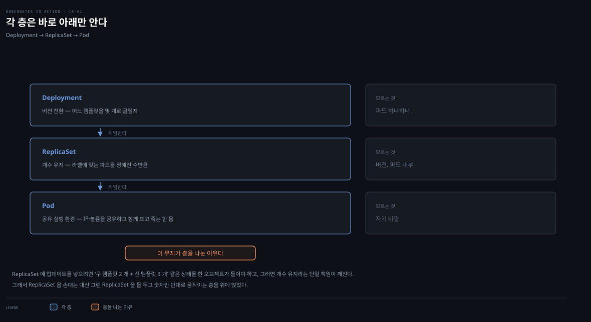

# Deployment 기초 — 생성·pod-template-hash·스케일링
---
> Deployment는 ReplicaSet 위의 추상화입니다. 파드를 직접 관리하지 않고, 자동으로 만든 ReplicaSet을 통해 간접 관리하며, 그 덕에 애플리케이션을 선언적으로 업데이트합니다. ReplicaSet 이름의 pod-template-hash가 이 간접 구조의 열쇠입니다.


> 이 문서를 읽고 나면 Deployment가 ReplicaSet을 통해 파드를 간접 제어하는 구조를 설명하고, pod-template-hash가 왜 붙는지 근거를 대며, Deployment를 스케일하고, replicas 필드 재적용 함정을 피할 수 있습니다.


## 진입 — ReplicaSet의 한계를 넘어

> ReplicaSet은 파드를 매끄럽게 업데이트하는 기능이 없습니다([14장 쿠키 커터](./14-01.ReplicaSet%20%EA%B8%B0%EC%B4%88%20%E2%80%94%20%EC%83%9D%EC%84%B1%C2%B7%EC%86%8C%EC%9C%A0%C2%B7%EC%8A%A4%EC%BC%80%EC%9D%BC%EB%A7%81.md)). 그 기능을 Deployment가 제공합니다.

[14장](./14-01.ReplicaSet%20%EA%B8%B0%EC%B4%88%20%E2%80%94%20%EC%83%9D%EC%84%B1%C2%B7%EC%86%8C%EC%9C%A0%C2%B7%EC%8A%A4%EC%BC%80%EC%9D%BC%EB%A7%81.md)에서 파드를 ReplicaSet으로 배포했지만, ReplicaSet은 파드를 매끄럽게 업데이트하지 못합니다. template을 고쳐도 이미 떠 있는 파드에는 반영되지 않습니다. 커터를 바꾼다고 이미 찍어낸 쿠키가 바뀌지는 않습니다.

실무에서 워크로드를 ReplicaSet으로 배포하는 일이 드문 이유입니다. 그 업데이트 기능을 Deployment 오브젝트가 제공합니다.

Deployment의 개념 모델·컨트롤러·RollingUpdate는 [핵심 워크로드 통합 개념본](../../kubernetes/01_workloads/01-01.%ED%95%B5%EC%8B%AC%20%EC%9B%8C%ED%81%AC%EB%A1%9C%EB%93%9C.md)이 크게 다룹니다. 이 편은 책의 실습(Kiada·pod-template-hash 실측·kubectl) 관점에서 차이분을 정리합니다.


## 1. Deployment와 ReplicaSet·Pod의 관계

> Deployment는 Pod 오브젝트를 직접 관리하지 않고, 생성 시 자동으로 만들어지는 ReplicaSet을 통해 관리합니다. Deployment가 ReplicaSet을 제어하고, ReplicaSet이 파드를 제어합니다.



워크로드는 보통 Deployment 오브젝트를 만들어 배포합니다. Deployment는 파드를 직접 다루지 않습니다. 생성될 때 자동으로 만들어지는 ReplicaSet을 통해 다룹니다. Deployment가 ReplicaSet을 제어하고 ReplicaSet이 개별 파드를 제어하는 3계층입니다.

Deployment는 애플리케이션을 **선언적으로** 업데이트하게 해 줍니다. 파드 세트를 새 버전으로 바꾸는 일련의 작업을 손으로 하는 대신, Deployment 오브젝트의 설정만 바꾸면 쿠버네티스가 업데이트를 자동화합니다.

ReplicaSet처럼 Deployment에도 Pod 템플릿·원하는 복제본 수·label selector를 적습니다. 만들어지는 파드는 서로 정확한 복제본이라 교체 가능(fungible)합니다. 그래서 Deployment는 주로 **stateless 워크로드**에 씁니다. stateful 워크로드를 단일 인스턴스로 돌릴 수도 있지만, 여러 인스턴스로 스케일되는 것을 막는 기능이 없어 애플리케이션 자체가 단일 활성을 보장해야 합니다.

> **주의.** 복제되는 stateful 워크로드는 StatefulSet이 낫습니다([16장](./README.md)).

### 세 층이 각각 모르는 것

3계층을 "누가 무엇을 책임지는가"로 세워 보면, 오른쪽 열이 더 중요합니다.

| 층 | 책임 | 모르는 것 |
|---|---|---|
| Deployment | 버전 전환 — 어느 템플릿을 몇 개로 굴릴지 | 파드 하나하나 |
| ReplicaSet | 개수 유지 — 라벨에 맞는 파드를 정해진 수만큼 | 버전, 파드 내부 |
| Pod | 공유 실행 환경 — 컨테이너들이 IP·볼륨을 공유하고 함께 뜨고 죽는 한 몸 | 자기 바깥 |

각 층은 바로 아래만 알고 그 아래는 모릅니다. 이 무지가 층을 나눈 이유입니다.

그렇다면 왜 ReplicaSet에 업데이트 기능을 직접 넣지 않았을까요. ReplicaSet의 `replicas`는 숫자 하나이고 `template`도 하나입니다. 여기에 롤아웃을 넣으려면 "구 템플릿 2개 + 신 템플릿 3개" 같은 상태를 한 오브젝트가 들어야 합니다. 그러면 숫자 하나로는 부족해지고, `status.readyReplicas`도 "어느 쪽 3개인지" 없이는 의미를 잃습니다. **개수 유지라는 단일 책임이 깨집니다.**

쿠버네티스는 ReplicaSet을 손대는 대신, 그런 ReplicaSet을 두 개 두고 숫자만 반대로 움직이는 층을 위에 얹었습니다.

```pseudocode
RS-v1.0   replicas: 3 → 2 → 1 → 0
RS-v1.1   replicas: 0 → 1 → 2 → 3
```

각 ReplicaSet은 여전히 자기 숫자만 지킵니다. 롤아웃이라는 개념 자체를 모릅니다. 14장에서 정리한 "ReplicaSet은 라벨로만 파드를 고르니 이미지 태그 변화를 줄 수 없다"는 한계를 Deployment가 **없앤 것이 아니라 우회했다**는 뜻입니다. 기존 부품의 책임을 늘리는 대신 그 부품을 여러 개 조합하는 상위 부품을 만드는 쪽을 택했습니다.


## 2. Deployment 만들기

> Deployment의 spec은 ReplicaSet과 거의 같고 strategy 필드 하나만 더 있습니다. 기존 ReplicaSet 매니페스트에서 kind만 바꾸면 Deployment가 됩니다.

먼저 파드를 지우지 않고 ReplicaSet만 제거합니다.

```bash
kubectl delete rs kiada --cascade=orphan
```

### spec 4필드

| 필드 | 설명 |
|------|------|
| replicas | 원하는 복제본 수 |
| selector | 이 Deployment에 속하는 파드를 고르는 label selector |
| template | 파드를 만들 Pod 템플릿 |
| strategy | Pod 템플릿을 업데이트할 때 파드를 어떻게 교체할지 (ReplicaSet에 없는 추가 필드) |

replicas·selector·template는 ReplicaSet과 같은 역할이고, strategy만 새로 추가됩니다.

> **공식 스키마와 대조.** 위 4필드는 책이 *업데이트 동작을 설명하기 위해* 고른 묶음입니다. 실제 스키마를 열어 보면 Deployment의 spec 필드는 8개이고, ReplicaSet(`replicas`·`selector`·`template`·`minReadySeconds`) 대비 늘어나는 것은 strategy 하나가 아니라 **넷**입니다.[^deploy-spec]
>
> | Deployment에만 있는 필드 | 역할 |
> |---|---|
> | `strategy` | 파드 교체 방식(Recreate·RollingUpdate) |
> | `revisionHistoryLimit` | 보관할 옛 ReplicaSet 수(기본 10) |
> | `paused` | 롤아웃 일시정지 |
> | `progressDeadlineSeconds` | 진행 정체 판정 기한(기본 600초) |
>
> 넷 다 *업데이트를 관리하기 위한* 필드라, "Deployment는 업데이트를 맡고 나머지는 ReplicaSet이 한다"는 14장의 정리와 그대로 맞아떨어집니다. `minReadySeconds`는 Deployment 고유가 아니라 **ReplicaSet에도 있는** 필드입니다.[^deploy-spec] 나머지 셋은 이 편과 [15-03](./15-03.rollout%20%EC%A0%9C%EC%96%B4%EC%99%80%20%EB%B0%B0%ED%8F%AC%20%EC%A0%84%EB%9E%B5%20%E2%80%94%20pause%C2%B7faulty%C2%B7rollback%C2%B7%EC%A0%84%EB%9E%B5%205%EC%A2%85.md)에서 하나씩 다룹니다.

### 매니페스트 만들기

기존 매니페스트가 없으면 `--dry-run=client -o yaml`로 골격을 뽑습니다.

```bash
kubectl create deployment my-app --image=my-image \
  --dry-run=client -o yaml > deploy.yaml
```

기존 ReplicaSet 매니페스트가 있으면 더 간단합니다 — 복사해서 `kind`를 ReplicaSet에서 Deployment로 바꾸면 됩니다.

```yaml
apiVersion: apps/v1
kind: Deployment       # ReplicaSet → Deployment로만 변경
metadata:
  name: kiada
spec:
  replicas: 3
  selector:
    matchLabels:
      app: kiada
      rel: stable
  template:
    metadata:
      labels:
        app: kiada
        rel: stable
        ver: '0.5'
    spec:
      # ...
```

```bash
kubectl apply -f deploy.kiada.yaml
```


## 3. Deployment 조회

> get deploy는 READY·UP-TO-DATE·AVAILABLE을 보여줍니다. rollout status로 배포 성공 여부를, wait --for=Available로 스크립트에서 준비를 기다립니다.

```bash
kubectl get deploy kiada
# NAME    READY   UP-TO-DATE   AVAILABLE   AGE
# kiada   3/3     3            3           25s
```

세 열의 출처는 이렇습니다.

| 열 | 출처 |
|---|---|
| READY | `status.readyReplicas` / **`spec.replicas`** (분모만 spec) |
| UP-TO-DATE | `status.updatedReplicas` |
| AVAILABLE | `status.availableReplicas` |

분모가 status가 아니라 **spec**이라는 점이 중요합니다. 공식 문서도 READY를 "ready/**desired**" 패턴으로 설명합니다.[^deploy-columns]

`status.replicas`라는 필드가 따로 있지만 이 표에는 안 나옵니다. 그것은 "selector에 걸린 non-terminating 파드 총수"라, 스케일다운 중이거나 흘러든 파드가 있으면 `spec.replicas`와 갈립니다. 모니터링 쿼리에서 둘을 바꿔 쓰면 값이 어긋납니다.

약어는 `deploy`이고, `-o wide`로 selector·컨테이너·이미지를 봅니다.

배포 성공 여부만 알고 싶으면 `rollout status`를 씁니다.

```bash
kubectl rollout status deployment kiada
# Waiting for deployment "kiada" rollout to finish: 0 of 3 updated replicas are available...
# deployment "kiada" successfully rolled out
```

셸 스크립트에서 준비될 때까지 기다리려면 `kubectl wait --for condition=Available deployment/kiada`를 씁니다.


## 4. pod-template-hash — 간접 구조의 열쇠

> Deployment가 만드는 ReplicaSet 이름에는 pod-template-hash 접미사가 붙습니다. 이 해시가 label에도 더해져, 이전 파드가 새 ReplicaSet에 흡수되지 않는 이유가 됩니다.

Deployment를 만들고 파드를 나열하면 놀랍게도 5개가 나옵니다 — 14장 ReplicaSet이 남긴 2개와 Deployment가 만든 3개입니다. Deployment의 selector가 기존 2개에 맞는데도 왜 흡수하지 않았을까요.

Deployment는 파드를 직접 제어하지 않고 ReplicaSet에 위임합니다. 그 ReplicaSet을 보면 이름이 그냥 `kiada`가 아니라 `kiada-7bffb9bf96`처럼 접미사가 붙어 있습니다.

```bash
kubectl describe rs kiada     # 이름 일부만 쳐도 됨
# Name:       kiada-7bffb9bf96
# Selector:   app=kiada,pod-template-hash=7bffb9bf96,rel=stable
# Controlled By:  Deployment/kiada
```

ReplicaSet의 selector·template·자기 label에 Deployment에 없던 `pod-template-hash` label이 붙어 있고, 값이 ReplicaSet 이름 끝과 같습니다. 이 label이 기존 2개가 흡수되지 않은 이유입니다.


```bash
kubectl get pods -l app=kiada,rel=stable --show-labels
# kiada-4t87s             ...  app=kiada,rel=stable,ver=0.5                              # 기존 — hash 없음

# kiada-7bffb9bf96-4knb6  ...  app=kiada,pod-template-hash=7bffb9bf96,rel=stable,ver=0.5 # Deployment 것 — hash 있음
```

ReplicaSet이 만들어질 때 selector에 맞는 파드가 없어 3개를 새로 만들었습니다. 만약 기존 2개에 이 label을 미리 붙였다면 흡수됐을 것입니다.

pod-template-hash 값은 랜덤이 아니라 **Pod 템플릿 내용**에서 계산됩니다. 같은 값이 ReplicaSet 이름에도 쓰이므로, 이름이 template 내용에 의존합니다. 따라서 Pod 템플릿을 바꿀 때마다 새 ReplicaSet이 생기는데, 이것이 [15-02](./15-02.Deployment%20%EC%97%85%EB%8D%B0%EC%9D%B4%ED%8A%B8%20%E2%80%94%20Recreate%C2%B7RollingUpdate%C2%B7maxSurge.md) 업데이트의 핵심입니다.

Deployment에 속하지 않는 기존 2개는, hash가 없는 파드만 골라 지웁니다.

```bash
kubectl delete po -l 'app=kiada,rel=stable,!pod-template-hash'
```

### 파드가 안 뜰 때 — 밑의 ReplicaSet을 보라

Deployment를 만들었는데 파드가 안 생기면, Deployment의 events에는 파드 생성 실패가 잡히지 않고 conditions가 원인을 알려 줍니다. events가 비어 있다는 뜻은 아닙니다 — 거기에는 `ScalingReplicaSet` 같은 *ReplicaSet 조작* 이벤트가 옵니다(§5에서 그 쓰임을 봅니다). 층위가 다를 뿐입니다.

```bash
kubectl describe deploy where-are-the-pods
# Conditions:
#   Progressing      True    NewReplicaSetCreated
#   Available        False   MinimumReplicasUnavailable
#   ReplicaFailure   True    FailedCreate       # 복제본 생성 실패
```

세 condition은 서로 다른 축을 봅니다. 특히 `Progressing`을 "잘 되고 있다"로 읽으면 오독입니다.

| Condition | 읽는 법 |
|---|---|
| `Available` | 서비스 최소선을 넘겼는가 — available 파드 수 ≥ `spec.replicas - maxUnavailable` |
| `Progressing` | 롤아웃이 살아 있는가 — 진전이 있었거나, 아직 `progressDeadlineSeconds`(기본 600초) 안쪽인가 |
| `ReplicaFailure` | 밑의 ReplicaSet이 파드 생성 자체에 실패했는가 |

`Available`의 기준선이 "전부"가 아니라 `spec.replicas - maxUnavailable`이라는 점을 눈여겨볼 만합니다.[^available-calc] 여기서도 층이 갈립니다. **어떤 파드가 available인지는 Deployment 컨트롤러가 판단하지 않습니다.** `minReadySeconds`를 재서 파드를 available로 세는 일은 ReplicaSet 컨트롤러가 하고, Deployment 컨트롤러는 그렇게 올라온 `status.availableReplicas`를 합산해 기준선과 비교할 뿐입니다. §1의 책임 분리가 여기서도 그대로 지켜집니다.

`Progressing`은 조금 까다롭습니다. `True`가 곧 "진행 중"을 뜻하지는 않습니다 — 롤아웃이 **성공적으로 끝난** Deployment도 reason `NewReplicaSetAvailable`로 `True`를 답니다. 그래서 `Progressing=True`는 "아직 실패로 판정되지 않았다"로 읽는 편이 안전하고, 지금 진행 중인지는 `Available`·`ReplicaFailure`와 함께 봐야 압니다.

`Progressing`이 뒤집히는 조건은 데드라인입니다. 시한이 지나면 `False`로 바뀌고 reason에 `ProgressDeadlineExceeded`가 찍힙니다. 그래도 컨트롤러는 재시도를 멈추지 않습니다. 데드라인은 롤아웃을 중단시키는 스위치가 아니라 **상태 필드에 실패를 기록하는 시한**입니다.[^progress-deadline] `kubectl rollout status`가 그제서야 non-zero로 빠져나오는 것도 이 기록을 읽기 때문입니다.

그래서 `Available=False` + `Progressing=True`는 "아직 안 떴지만 기다리는 중"입니다. 여기에 `ReplicaFailure=True`가 붙으면 "기다려도 안 될 이유가 이미 밝혀졌다"가 됩니다. 셋째가 있으면 600초를 기다릴 이유가 없다는 것이 실무 판단 지점입니다.

`ReplicaFailure=True`·reason `FailedCreate`는 뭉뚱그린 표현이라, 밑의 ReplicaSet events에서 진짜 메시지를 봅니다.

`describe`가 conditions를 Type·Status·Reason 세 열로만 찍는다는 점은 알아 둘 만합니다. 같은 condition의 `message` 필드에는 더 긴 설명이 담기므로, RS까지 내려가기 전에 `kubectl get deploy where-are-the-pods -o yaml`로 `status.conditions[].message`를 먼저 확인하면 한 단계 아낄 수 있습니다.

```bash
kubectl describe rs where-are-the-pods-67cbc77f88
# Warning  FailedCreate  ...  Error creating: ... serviceaccount "missing-service-account" not found
```

원인은 대개 사용자 권한 관련(여기선 service account 누락)입니다. 파드가 안 뜨면 Deployment가 아니라 **밑의 ReplicaSet**에서 원인을 찾습니다.


## 5. 스케일링

> Deployment 스케일은 ReplicaSet 스케일과 다르지 않습니다. Deployment 컨트롤러는 밑의 ReplicaSet만 스케일하고, 나머지는 ReplicaSet 컨트롤러가 합니다.


```bash
kubectl scale deploy kiada --replicas 5
# deployment.apps/kiada scaled
```

edit·apply로도 가능합니다. events를 보면 Deployment 컨트롤러가 ReplicaSet을 스케일했음(`ScalingReplicaSet`)이 보이고, 실제 파드는 ReplicaSet 컨트롤러가 만듭니다. 14장에서 배운 ReplicaSet 스케일·조정이 그대로 적용됩니다.

### Deployment가 소유한 ReplicaSet을 직접 스케일하면

Deployment가 소유·제어하는 ReplicaSet을 직접 스케일하면 어떻게 될까요. 값이 7로 올라갔다가 곧 5로 되돌아갑니다. Deployment 컨트롤러가 ReplicaSet의 복제본 수가 Deployment와 안 맞는 걸 감지해 되돌리기 때문입니다.

정상 경로가 2단이라는 점을 보면 이유가 분명해집니다. 사람은 상류만 만지고, 하류는 컨트롤러가 대신 만집니다.

```pseudocode
정상    사람 → Deployment.spec.replicas=5
                    ↓ Deployment 컨트롤러가 옮겨 적음
              ReplicaSet.spec.replicas=5      → 파드 5개 (유지됨)

실수    사람 → ReplicaSet.spec.replicas=7     → 파드 7개 (잠깐)
                    ↑ 컨트롤러가 Deployment(5)와 비교해 덮어씀
              ReplicaSet.spec.replicas=5      → 파드 5개 (되돌아감)
```

컨트롤러는 그 값을 자기가 썼는지 사람이 썼는지 구분하지 않습니다. 그저 Deployment의 값과 다르면 맞춥니다. 상류를 거치지 않고 하류에 직접 쓴 값이 살아남지 못하는 이유입니다.

> **주의.** 다른 오브젝트가 소유한 오브젝트를 바꾸면, 그것을 관리하는 컨트롤러가 되돌린다고 예상해야 합니다.

Deployment 컨트롤러는 스케일뿐 아니라 ReplicaSet에 가한 어떤 변경도 되돌립니다. ReplicaSet 오브젝트를 지워도 다시 만듭니다.

그래서 Deployment를 쓰는 순간 포기하는 조작이 하나 생깁니다. **개별 ReplicaSet의 복제본 수를 사람이 직접 정하는 일**입니다. 롤아웃 중에는 ReplicaSet이 둘 존재하는데, 그 둘의 숫자 배분은 전적으로 컨트롤러의 몫입니다.

사람에게 남는 것은 `strategy`로 규칙을 미리 선언할 권한입니다. `maxSurge`·`maxUnavailable`이 그래서 필요합니다([15-02](./15-02.Deployment%20%EC%97%85%EB%8D%B0%EC%9D%B4%ED%8A%B8%20%E2%80%94%20Recreate%C2%B7RollingUpdate%C2%B7maxSurge.md)). 자동화를 얻고 수동 개입을 잃는 절충입니다. "새 버전만 1개로 오래 두기" 같은 카나리가 필요하면 Deployment 하나로는 안 되고, 둘로 나누거나 별도 도구를 씁니다.

### 실수로 스케일하는 함정

프로덕션에서 Deployment를 5로 스케일했다고 합시다. 그런데 Deployment 오브젝트 자체에 label을 안 붙인 걸 깨닫고(template에는 붙였지만), 매니페스트를 고쳐 다시 적용합니다. 매니페스트의 `replicas: 3`이 살아 있으면, label만 추가하려던 재적용이 **복제본 수를 3으로 덮어씁니다** — 2개가 삭제됩니다.

replicas 필드를 지우면 나아질까요? 책은 "생략하면 API가 값을 1로 설정한다(null로 명시해도 같음)"고 적습니다. 수백 replica가 돌던 프로덕션이라면 심각한 장애라는 것입니다.

> **공식 문서와 대조 — 이 서술은 조건을 붙여 읽어야 합니다.** `replicas`를 뺐다고 언제나 1이 되지는 않습니다. 갈리는 지점은 그 필드가 **`last-applied-configuration`에 있었느냐**입니다.[^replicas-default]
>
> | 상황 | 결과 |
> |---|---|
> | 오브젝트를 **처음 만들 때** replicas 없음 | apiserver 가 기본값 **1** 적용 |
> | 이전 apply 에 replicas가 **있었는데** 이번에 뺌 | 삭제 대상으로 판정 → 필드가 사라져 **1** |
> | 이전 apply 에 replicas가 **없었고**(예: `kubectl scale`로만 조정) 이번에도 뺌 | **스케일해 둔 값이 유지됨** |
>
> apply 는 "last-applied 에 있고 이번 매니페스트에 없는" 필드만 지웁니다. 공식 문서의 실습 예제는 `kubectl scale`로 2를 만든 뒤 replicas 없는 매니페스트를 apply 해도 값이 2로 남는 것을 보여주며, 해당 줄에 `replicas: 2 # Set by kubectl scale. Ignored by kubectl apply.`라고 달아 둡니다.[^replicas-default]
>
> 즉 셋째 줄이 바로 아래 **예방책이 성립하는 근거**입니다. 책의 경고는 "한 번 적었던 필드를 빼는" 둘째 줄 상황을 말한 것으로 읽는 편이 맞습니다.

예방책은 Deployment를 만들 때 원본 매니페스트에 **replicas 필드**를 아예 넣지 않는 것입니다. 이미 만든 Deployment는 다음으로 고칩니다.

```bash
kubectl apply edit-last-applied deployment/kiada   # last-applied-configuration에서 replicas 제거
```

`kubectl.kubernetes.io/last-applied-configuration` annotation을 열어 replicas를 지우면, 이후 apply가 복제본 수를 덮어쓰지 않습니다(replicas 필드를 안 넣는 한).

> **팁.** 매니페스트 재적용마다 실수로 스케일되는 걸 막으려면, 오브젝트를 만들 때 replicas 필드를 생략합니다. 처음엔 1개만 뜨지만 필요한 만큼 스케일하면 됩니다.

> **Spring 관점.** Boot 앱을 Deployment로 배포하고 트래픽에 따라 `kubectl scale`로 수평 확장합니다. 다만 CI가 매니페스트를 재적용하는 파이프라인이라면, replicas를 매니페스트에 박아 두면 배포마다 스케일이 리셋됩니다 — HPA(오토스케일러)나 수동 스케일과 충돌하니, replicas는 매니페스트에서 빼고 스케일은 별도로 관리합니다.


## 6. Deployment 삭제

> Deployment를 지우면 밑의 ReplicaSet과 파드도 지워집니다. --cascade=orphan은 바로 아래 한 단계만 끊어 ReplicaSet까지 보존하며, 재생성 시 라벨로 입양하고 템플릿으로 지목해 흡수합니다. replicas 0인 옛 ReplicaSet은 리비전 저장소라 GC가 아니라 Deployment 컨트롤러가 revisionHistoryLimit으로 정리합니다.

Deployment를 지우면 밑의 ReplicaSet과 파드가 함께 지워집니다(14장 GC와 같은 원리). 파드를 살리려면 `--cascade=orphan`을 씁니다. Deployment의 경우 파드뿐 아니라 **ReplicaSet까지 보존**되고, 파드는 여전히 그 ReplicaSet이 제어합니다.

### orphan은 바로 아래 한 단계만 끊습니다

14장에서 ReplicaSet에 `--cascade=orphan`을 걸었을 때와 결과가 다른 이유가 여기 있습니다. 이 옵션은 **지우는 오브젝트와 그 직계 자식 사이의 소유 관계만** 끊고, 그 아래는 건드리지 않습니다.

```pseudocode
14장    ReplicaSet 삭제 --cascade=orphan
        → 파드가 아무 소유자 없이 맨몸으로 남음. 자가 치유 없음

지금    Deployment 삭제 --cascade=orphan
        → ReplicaSet이 고아. 하지만 RS는 살아 있고 파드도 계속 소유·관리함
        → 파드가 죽으면 여전히 되살아남. 잃은 것은 롤아웃 능력뿐
```

### 다시 만들면 라벨로 입양하고 템플릿으로 지목합니다

Deployment를 다시 만들면, 그 사이 Pod 템플릿을 안 바꿨다는 전제 아래 **기존 ReplicaSet을 흡수**합니다. 파드는 처음부터 그 ReplicaSet 밑에 있었으니 한 번도 죽지 않습니다.

흡수는 이름을 맞춰 보는 것이 아니라 두 단계로 일어납니다.[^rs-adopt]

1. **라벨 입양** — 네임스페이스의 ReplicaSet 중 Deployment의 selector에 라벨이 맞는 고아를 찾아 `ownerReferences`를 자기로 씁니다. 14장에서 ReplicaSet이 파드를 입양하던 것과 같은 구조(`ControllerRefManager`)입니다.
2. **템플릿 지목** — 입양한 것 중 `spec.template`이 자기 것과 같은(hash label만 빼고 deep-equal) ReplicaSet을 "새 ReplicaSet"으로 지목합니다. 나머지는 옛 리비전이 됩니다.

이름이 같아 보이는 것은 원인이 아니라 결과입니다. 이름의 접미사가 템플릿 해시라서, 템플릿이 같으면 대개 이름도 같아질 뿐입니다. 템플릿이 같은 ReplicaSet이 둘 이상 잡히는 드문 경우(클러스터 업그레이드 등)에는 컨트롤러가 **가장 오래된 것**을 고르도록 정해 두었습니다.[^rs-adopt]

### 옛 ReplicaSet은 리비전 저장소입니다

롤백하면 옛 ReplicaSet이 되살아납니다. 템플릿이 원래대로 돌아왔으니 해시도 원래 값이고, 그 ReplicaSet이 아직 있으므로 새로 만들 이유가 없습니다.

```bash
kubectl get rs
# NAME               DESIRED   CURRENT   READY
# kiada-7d4f9c8b6d   3         3         3      # 1.0 — 되살아남
# kiada-5b8c7f9d44   0         0         0      # 1.1 — 껍데기로 남음
```

`replicas: 0`인 ReplicaSet을 지우지 않고 남기는 이유가 이것입니다. 파드는 하나도 없지만 **`spec.template`이 그대로 보관**되어 있습니다. Deployment는 되돌릴 내용을 자기가 들고 있지 않습니다. 공식 문서의 표현대로 리비전 이력은 컨트롤하는 ReplicaSet에 저장되며, 옛 ReplicaSet이 지워지면 그 리비전으로 되돌릴 능력을 잃습니다.[^revision-limit] `kubectl rollout history`가 보여 주는 목록도 결국 이 ReplicaSet들을 읽어 온 것입니다.

그렇다면 배포할 때마다 껍데기가 무한히 쌓일까요. 여기서 치우는 주체를 헷갈리기 쉽습니다. **GC는 이것을 가져가지 않습니다.** GC가 치우는 것은 소유자가 사라진 오브젝트인데, 이 ReplicaSet은 Deployment가 멀쩡히 소유하고 있습니다. 파드가 0개인 것과 소유자가 없는 것은 다릅니다.

누적을 끊는 것은 **Deployment 컨트롤러 자신**이고, 기준이 `revisionHistoryLimit`(기본 10)입니다. 배포할 때마다 `replicas: 0`인 옛 ReplicaSet을 세서 한도를 넘으면 오래된 것부터 지웁니다.

이 값을 `0`으로 두면 롤아웃이 끝날 때마다 `replicas: 0`인 옛 ReplicaSet이 모두 정리되어 **`rollout undo`가 불가능해집니다.**[^revision-limit] 되돌릴 템플릿이 클러스터에 남지 않으니 `rollout history`도 비고, 사람이 옛 매니페스트를 찾아 다시 apply하는 수밖에 없습니다.

정리 시점이 "즉시"가 아니라 **롤아웃 완료 후**라는 점은 짚어 둘 만합니다. 컨트롤러는 `replicas`가 0이 아닌 ReplicaSet을 삭제 대상에서 빼므로, 롤아웃이 진행 중인 동안에는 옛 ReplicaSet이 아직 남아 있습니다.[^revision-limit] 반대로 많이 남기면 `kubectl get rs` 출력이 껍데기로 지저분해지고 etcd에 오브젝트가 쌓입니다. 기본 10은 그 사이의 절충입니다.

### 이 성질이 쓰이는 곳 — selector를 바꿔야 할 때

`spec.selector`는 `apps/v1`에서 **생성 후 변경할 수 없습니다.**[^selector-immutable] 라벨 체계를 바꾸려면 Deployment를 지우는 수밖에 없는데, 그냥 지우면 서비스가 끊깁니다. 그래서 orphan으로 워크로드를 살려 두고 오브젝트만 갈아끼웁니다.

```bash
kubectl delete deploy kiada --cascade=orphan   # 파드·RS를 살려 둔 채 Deployment만 제거
kubectl apply -f kiada-new-selector.yaml       # 새 selector로 다시 생성
```

다만 selector가 바뀌면 template 라벨도 함께 바뀌어 해시가 달라집니다. 새 Deployment는 새 ReplicaSet을 만들고, 옛 파드는 라벨이 안 맞아 입양되지 않은 채 남습니다. 트래픽이 새 파드로 넘어간 것을 확인한 뒤 옛 것을 손으로 지우는 **수동 블루그린**이 됩니다.

`--cascade=orphan`의 쓰임은 결국 둘입니다. selector처럼 불변 필드를 바꿀 때, 그리고 관리 주체를 옮길 때(Helm에서 Kustomize로 이관하는 식). 둘 다 **오브젝트는 갈아엎되 실행 중인 워크로드는 건드리지 않는다**는 같은 목적입니다.


## 면접에서 받을 만한 질문

> 아래 질문에 먼저 스스로 답해 본 뒤, 챕터 끝의 정답과 맞춰 봅니다.

1. Deployment는 파드를 어떻게 관리하나요? ReplicaSet과 비교해 spec에 추가되는 필드는 무엇인가요?
2. pod-template-hash는 어떤 값이며 왜 붙나요? 이것 때문에 기존 파드가 흡수되지 않는 이유는 무엇인가요?
3. Deployment를 만들었는데 파드가 안 뜨면 어디를 봐야 하나요?
4. Deployment가 소유한 ReplicaSet을 직접 스케일하면 어떻게 되나요? 그 때문에 포기하게 되는 조작은 무엇인가요?
5. 매니페스트에 replicas 필드를 두면 어떤 함정이 있나요? 필드를 생략하면요? 권장 방법은 무엇인가요?
6. 롤백하면 옛 ReplicaSet이 되살아납니다. `replicas: 0`인 ReplicaSet을 GC가 치우지 않는 이유는 무엇이며, 그럼 누가 정리하나요? `revisionHistoryLimit: 0`으로 두면 무엇을 잃나요?
7. Deployment를 `--cascade=orphan`으로 지우면 무엇이 남나요? 14장에서 ReplicaSet에 같은 옵션을 걸었을 때와 무엇이 다른가요? 다시 만들면 기존 ReplicaSet을 무엇으로 찾아 흡수하나요?
8. ReplicaSet에 업데이트 기능을 직접 넣지 않고 Deployment라는 층을 따로 둔 이유는 무엇인가요?


## 정답 (자답 후 펼치기)

> 위 질문에 답해 본 다음 아래와 맞춰 봅니다. 순서는 질문과 1:1로 대응합니다.

### 정답 1 — Deployment의 파드 관리와 추가 필드

Deployment는 파드를 직접 관리하지 않고, 생성 시 자동으로 만들어지는 ReplicaSet을 통해 간접 관리합니다 — Deployment가 ReplicaSet을 제어하고 ReplicaSet이 파드를 제어하는 3계층입니다.

spec 필드는 ReplicaSet과 같은 replicas·selector·template에 더해 **strategy**가 추가됩니다. strategy는 Pod 템플릿을 업데이트할 때 파드를 어떻게 교체할지(Recreate/RollingUpdate) 정합니다.

책이 "strategy 하나만 더"라고 정리한 것은 업데이트 동작을 설명하기 위한 묶음이고, 실제 스키마에서 ReplicaSet 대비 늘어나는 필드는 `strategy`·`revisionHistoryLimit`·`paused`·`progressDeadlineSeconds` **넷**입니다. 넷 다 업데이트를 관리하는 필드라는 점이 핵심입니다.

### 정답 2 — pod-template-hash

pod-template-hash는 **Pod 템플릿 내용에서 계산한 해시**로(랜덤 아님), Deployment가 만드는 ReplicaSet의 이름 접미사이자 selector·label에 더해지는 값입니다. Deployment의 selector에는 이 label이 없지만 ReplicaSet의 selector에는 있으므로, hash label이 없는 기존 파드는 새 ReplicaSet의 selector에 맞지 않아 흡수되지 않습니다. template 내용이 바뀌면 해시가 달라져 새 ReplicaSet이 생기는데, 이것이 업데이트의 핵심입니다.

### 정답 3 — 파드가 안 뜰 때

밑의 ReplicaSet을 봐야 합니다. Deployment의 conditions에서 `ReplicaFailure=True`·reason `FailedCreate`를 볼 수 있지만 뭉뚱그린 표현이라, 밑의 ReplicaSet의 events(또는 Deployment YAML status의 message 필드)에서 진짜 원인을 봅니다. 원인은 대개 사용자 권한 관련(예: service account 누락)입니다. 결론은 파드가 안 뜨면 Deployment가 아니라 밑의 ReplicaSet에서 원인을 찾는다는 것입니다.

### 정답 4 — 소유된 ReplicaSet 직접 스케일

값이 잠깐 올라갔다가 곧 Deployment의 복제본 수로 되돌아갑니다. Deployment 컨트롤러가 ReplicaSet의 복제본 수가 Deployment 오브젝트와 안 맞는 걸 감지해 되돌리기 때문입니다. 정상 경로는 사람이 Deployment를 고치면 컨트롤러가 ReplicaSet에 옮겨 적는 2단인데, 하류에 직접 쓰면 그 경로를 건너뛴 것이라 다음 조정에서 덮어써집니다. 컨트롤러는 값을 누가 썼는지 구분하지 않고 Deployment와 다르면 맞출 뿐입니다.

스케일뿐 아니라 ReplicaSet에 가한 어떤 변경도 되돌리며, ReplicaSet을 지워도 다시 만듭니다. 다른 컨트롤러가 소유한 오브젝트를 바꾸면 그 변경은 되돌려진다고 예상해야 합니다.

그래서 포기하는 조작은 **개별 ReplicaSet의 복제본 수를 사람이 직접 정하는 일**입니다. 롤아웃 중 두 ReplicaSet의 숫자 배분은 컨트롤러의 몫이고, 사람에게는 `strategy`(`maxSurge`·`maxUnavailable`)로 규칙을 미리 선언할 권한만 남습니다.

### 정답 5 — replicas 필드 함정

매니페스트에 `replicas: 3`을 두면, label 추가 같은 무관한 변경으로 재적용해도 복제본 수가 3으로 **덮어써집니다**(스케일해 둔 값이 리셋).

필드를 빼는 것이 답인지는 **그 필드가 이전 apply에 있었느냐**에 달렸습니다. 한 번 적었던 replicas를 이번에 빼면 apply가 삭제로 판정해 값이 **1로** 떨어지고, 수백 replica 프로덕션에선 심각한 장애입니다. 반대로 처음부터 적지 않았다면 지울 것이 없어, `kubectl scale`로 조정해 둔 값이 그대로 유지됩니다.

그래서 권장 방법은 Deployment를 만들 때 원본 매니페스트에서 replicas 필드를 **처음부터 생략**하는 것입니다. 이미 적어 버렸다면 `kubectl apply edit-last-applied`로 last-applied-configuration에서 replicas를 지워 같은 상태로 만듭니다.

### 정답 6 — 옛 ReplicaSet과 리비전 이력

GC가 치우는 것은 **소유자가 사라진** 오브젝트인데, `replicas: 0`인 옛 ReplicaSet은 Deployment가 멀쩡히 소유하고 있습니다. 파드가 0개인 것과 소유자가 없는 것은 다릅니다.

정리하는 주체는 **Deployment 컨트롤러**이고 기준은 `revisionHistoryLimit`(기본 10)입니다. 배포할 때마다 옛 ReplicaSet을 세서 한도를 넘으면 오래된 것부터 지웁니다.

남겨 두는 이유는 그 ReplicaSet이 **리비전 저장소**이기 때문입니다. 파드는 없어도 `spec.template`이 보관되어 있어 `rollout undo`가 그것을 되살립니다. 따라서 `revisionHistoryLimit: 0`으로 두면 롤아웃이 끝날 때마다 옛 ReplicaSet이 정리되어 되돌릴 템플릿이 사라지고, **롤백 능력을 잃습니다**. `rollout history`도 비게 됩니다.

### 정답 7 — orphan 삭제와 재흡수

`--cascade=orphan`은 **바로 아래 한 단계의 소유 관계만** 끊습니다. Deployment에 걸면 ReplicaSet이 고아가 되지만, ReplicaSet과 파드의 관계는 그대로라 파드가 죽으면 여전히 되살아납니다. 잃는 것은 롤아웃 능력뿐입니다. 14장에서 ReplicaSet에 걸었을 때는 그 아래 파드가 아무 소유자 없이 남아 자가 치유가 사라졌습니다.

다시 만들 때의 흡수는 이름이 아니라 두 단계로 일어납니다. 먼저 Deployment의 selector에 **라벨이 맞는** 고아 ReplicaSet을 입양하고(14장 파드 입양과 같은 구조), 그 중 `spec.template`이 자기 것과 **deep-equal**인 것을 새 ReplicaSet으로 지목합니다. 이름이 같아 보이는 것은 접미사가 템플릿 해시라서 생긴 결과이지 매칭 기준이 아닙니다.

### 정답 8 — 왜 층을 따로 두었나

ReplicaSet의 `replicas`는 숫자 하나이고 `template`도 하나입니다. 롤아웃을 넣으려면 "구 템플릿 2개 + 신 템플릿 3개" 같은 상태를 한 오브젝트가 들어야 하는데, 그러면 숫자 하나로는 부족해지고 `status.readyReplicas`도 어느 쪽인지 없이는 의미를 잃습니다. **개수 유지라는 단일 책임이 깨집니다.**

그래서 ReplicaSet은 그대로 두고, 그런 ReplicaSet을 두 개 두고 숫자만 반대로 움직이는 층을 위에 얹었습니다. 각 ReplicaSet은 여전히 자기 숫자만 지키며 롤아웃이라는 개념을 모릅니다. Deployment는 ReplicaSet의 한계를 없앤 것이 아니라 **우회**했습니다.


## 관련 문서

> 이 편은 14장 ReplicaSet을 이어받아 그 위의 추상화인 Deployment의 구조·pod-template-hash·스케일링을 다루고, Deployment의 진짜 이점인 업데이트(15-02)로 이어집니다.

- [15-02. Deployment 업데이트 — Recreate·RollingUpdate·maxSurge](./15-02.Deployment%20%EC%97%85%EB%8D%B0%EC%9D%B4%ED%8A%B8%20%E2%80%94%20Recreate%C2%B7RollingUpdate%C2%B7maxSurge.md) — 업데이트 전략·무중단 배포(다음 편)
- [15-03. rollout 제어와 배포 전략 — pause·faulty·rollback·전략 5종](./15-03.rollout%20%EC%A0%9C%EC%96%B4%EC%99%80%20%EB%B0%B0%ED%8F%AC%20%EC%A0%84%EB%9E%B5%20%E2%80%94%20pause%C2%B7faulty%C2%B7rollback%C2%B7%EC%A0%84%EB%9E%B5%205%EC%A2%85.md) — rollback·Canary·Blue/Green
- [14-02. ReplicaSet 컨트롤러 — reconciliation·장애복구·삭제](./14-02.ReplicaSet%20%EC%BB%A8%ED%8A%B8%EB%A1%A4%EB%9F%AC%20%E2%80%94%20reconciliation%C2%B7%EC%9E%A5%EC%95%A0%EB%B3%B5%EA%B5%AC%C2%B7%EC%82%AD%EC%A0%9C.md) — 쿠키 커터(Deployment가 푸는 문제, 앞 장)
- [14-01. ReplicaSet 기초 — 생성·소유·스케일링](./14-01.ReplicaSet%20%EA%B8%B0%EC%B4%88%20%E2%80%94%20%EC%83%9D%EC%84%B1%C2%B7%EC%86%8C%EC%9C%A0%C2%B7%EC%8A%A4%EC%BC%80%EC%9D%BC%EB%A7%81.md) — replicas·selector·template·orphan
- [핵심 워크로드](../../kubernetes/01_workloads/01-01.%ED%95%B5%EC%8B%AC%20%EC%9B%8C%ED%81%AC%EB%A1%9C%EB%93%9C.md) — Deployment·ReplicaSet·컨트롤러 통합 개념본
- 원서: 《Kubernetes in Action, 2nd Ed.》 Ch15 §15.1 — [Manning](https://www.manning.com/books/kubernetes-in-action-second-edition), [예제 코드](https://github.com/luksa/kubernetes-in-action-2nd-edition/tree/master/Chapter15)
- 공식 문서: [Deployment](https://kubernetes.io/docs/concepts/workloads/controllers/deployment/)
- 공식 API 레퍼런스: [Deployment v1 — DeploymentSpec](https://kubernetes.io/docs/reference/kubernetes-api/workload-resources/deployment-v1/) — replicas 기본값
- 공식 문서: [Declarative Management — how apply calculates differences](https://kubernetes.io/docs/tasks/manage-kubernetes-objects/declarative-config/) — 3-way merge와 필드 삭제

[^replicas-default]: 기본값의 근거는 [Deployment v1 — DeploymentSpec](https://kubernetes.io/docs/reference/kubernetes-api/workload-resources/deployment-v1/) 입니다(2026-08-10 조회, `kubectl explain deployment.spec.replicas` 로 대조). 원문은 "This is a pointer to distinguish between explicit zero and not specified. Defaults to 1." 입니다. 삭제 판정은 [Declarative Management of Kubernetes Objects](https://kubernetes.io/docs/tasks/manage-kubernetes-objects/declarative-config/) (2026-08-10 조회) 의 "Merge patch calculation" 절이 정의합니다 — "fields **present in `last-applied-configuration` and missing from the configuration file**". 같은 문서의 실습은 `kubectl scale` 로 2 를 만든 뒤 replicas 없는 매니페스트를 apply 해도 "The `replicas` field **retains the value of 2**" 임을 보이고, 라이브 오브젝트에 `replicas: 2 # Set by kubectl scale. Ignored by kubectl apply.` 주석을 붙입니다. 반면 처음 만들 때 필드가 없으면 `replicas: 1 # defaulted by apiserver` 가 됩니다.

[^deploy-columns]: Kubernetes 공식 문서, [Deployment — Creating a Deployment](https://kubernetes.io/docs/concepts/workloads/controllers/deployment/#creating-a-deployment) (2026-08-10 조회, 문서 소스 `deployment.md` L94~96). 원문은 "`READY` displays how many replicas of the application are available to your users. It follows the pattern **ready/desired**." 입니다. `status.replicas` 의 정의는 `kubectl explain deployment.status.replicas` 기준 "Total number of non-terminating pods targeted by this deployment" 라 분모와 다릅니다.

[^deploy-spec]: `kubectl explain deployment.spec` 과 `kubectl explain replicaset.spec` 의 실제 출력 대조입니다(2026-08-10, kubectl 내장 스키마). Deployment 는 `minReadySeconds`·`paused`·`progressDeadlineSeconds`·`replicas`·`revisionHistoryLimit`·`selector`·`strategy`·`template` 8개, ReplicaSet 은 `minReadySeconds`·`replicas`·`selector`·`template` 4개입니다. 필드 정의 원문은 [DeploymentSpec](https://kubernetes.io/docs/reference/kubernetes-api/workload-resources/deployment-v1/) 과 [ReplicaSetSpec](https://kubernetes.io/docs/reference/kubernetes-api/workload-resources/replica-set-v1/) 에 있습니다.

[^progress-deadline]: Kubernetes 공식 문서, [Deployment — Progress Deadline Seconds](https://kubernetes.io/docs/concepts/workloads/controllers/deployment/#progress-deadline-seconds) (2026-08-10 조회, 문서 소스 `deployment.md` L1322~1330). 핵심 원문은 "surfaced as a condition with `type: Progressing`, `status: \"False\"`. and `reason: ProgressDeadlineExceeded`" 와 "**The Deployment controller will keep retrying the Deployment.** This defaults to 600." 입니다. 같은 문단에 `minReadySeconds` 보다 커야 한다는 제약도 있습니다.

[^revision-limit]: Kubernetes 공식 문서, [Deployment — Revision History Limit](https://kubernetes.io/docs/concepts/workloads/controllers/deployment/#clean-up-policy) (2026-08-10 조회, 문서 소스 `deployment.md` L1352~1360). 원문은 "A Deployment's revision history is **stored in the ReplicaSets it controls**." 와 "**once an old ReplicaSet is deleted, you lose the ability to rollback to that revision**. By default, 10 old ReplicaSets will be kept" 입니다. 0 의 효과는 "**a new Deployment rollout cannot be undone**, since its revision history is cleaned up." 로 적혀 있습니다. 정리 시점과 제외 조건은 [`sync.go` 의 `cleanupDeployment`](https://github.com/kubernetes/kubernetes/blob/master/pkg/controller/deployment/sync.go) 에서 확인했습니다(2026-08-10) — `len(cleanableRSes) - revisionHistoryLimit` 만큼만 오래된 순으로 지우고, `replicas` 가 0 이 아닌 ReplicaSet 은 대상에서 뺍니다.

[^available-calc]: `Available` condition 의 기준선은 [`sync.go` 의 `calculateStatus`](https://github.com/kubernetes/kubernetes/blob/master/pkg/controller/deployment/sync.go) 에 있는 `availableReplicas >= *(deployment.Spec.Replicas)-deploymentutil.MaxUnavailable(*deployment)` 입니다(2026-08-10 조회, `master`). 여기 쓰이는 `availableReplicas` 는 [`deployment_util.go` 의 `GetAvailableReplicaCountForReplicaSets`](https://github.com/kubernetes/kubernetes/blob/master/pkg/controller/deployment/util/deployment_util.go) 가 각 ReplicaSet 의 `Status.AvailableReplicas` 를 단순 합산한 값이라, `minReadySeconds` 판정 자체는 ReplicaSet 컨트롤러 쪽(`podutil.IsPodAvailable(pod, rs.Spec.MinReadySeconds, now)`)에서 이뤄집니다. `Progressing` 이 완료 후에도 `True` 로 남는 근거는 공식 문서 [Deployment — Complete Deployment](https://kubernetes.io/docs/concepts/workloads/controllers/deployment/#complete-deployment) (문서 소스 `deployment.md` L887~905) 입니다 — 롤아웃 완료 시 `reason: NewReplicaSetAvailable` 로 `status: "True"` 를 달고, "This `Progressing` condition will **retain a status value of `\"True\"` until a new rollout is initiated**. The condition holds even when availability of replicas changes (which does instead affect the `Available` condition)." 라고 적습니다.

[^rs-adopt]: kube-controller-manager 소스에서 확인했습니다(2026-08-10, `master`). 라벨 입양의 판정은 [`controller_ref_manager.go`](https://github.com/kubernetes/kubernetes/blob/master/pkg/controller/controller_ref_manager.go) 의 `ClaimReplicaSets` 안에 있는 `m.Selector.Matches(labels.Set(obj.GetLabels()))` 이고, 호출부는 [`deployment_controller.go`](https://github.com/kubernetes/kubernetes/blob/master/pkg/controller/deployment/deployment_controller.go) 의 `getReplicaSetsForDeployment` 입니다. 템플릿 지목은 [`deployment_util.go`](https://github.com/kubernetes/kubernetes/blob/master/pkg/controller/deployment/util/deployment_util.go) 의 `FindNewReplicaSet` 이 쓰는 `EqualIgnoreHash` 로, 양쪽에서 `pod-template-hash` label 을 지운 뒤 `DeepEqual` 합니다. 이름을 비교하는 경로는 없습니다. 같은 함수가 후보를 `ReplicaSetsByCreationTimestamp` 로 정렬해 첫 매치를 반환하며, 주석은 클러스터 업그레이드 등으로 템플릿이 같은 ReplicaSet 이 둘 이상 생길 수 있음을 인정하고 "We deterministically choose the oldest new ReplicaSet" 이라고 적습니다([kubernetes#40415](https://github.com/kubernetes/kubernetes/issues/40415)). 공식 문서도 이 label 을 "added by the Deployment controller to every ReplicaSet that a Deployment **creates or adopts**" 로 적어 입양을 명시합니다.

[^selector-immutable]: Kubernetes 공식 문서, [Deployment — Selector](https://kubernetes.io/docs/concepts/workloads/controllers/deployment/#selector) (2026-08-10 조회, 문서 소스 `deployment.md` L1159). 원문은 "Also note that `.spec.selector` is **immutable** after creation of the Deployment in `apps/v1`." 입니다. 같은 절에 "`.spec.selector` must match `.spec.template.metadata.labels`, or it will be rejected by the API." 도 있어, selector 를 바꾸면 template label 도 함께 바뀌어야 합니다.
