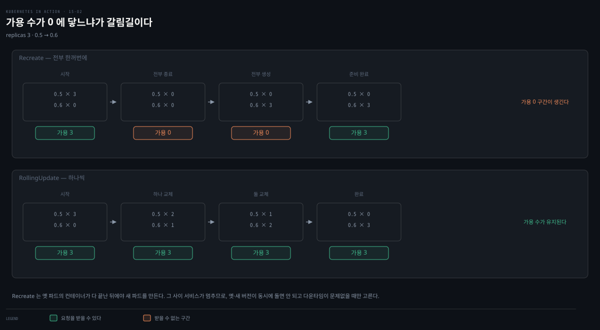
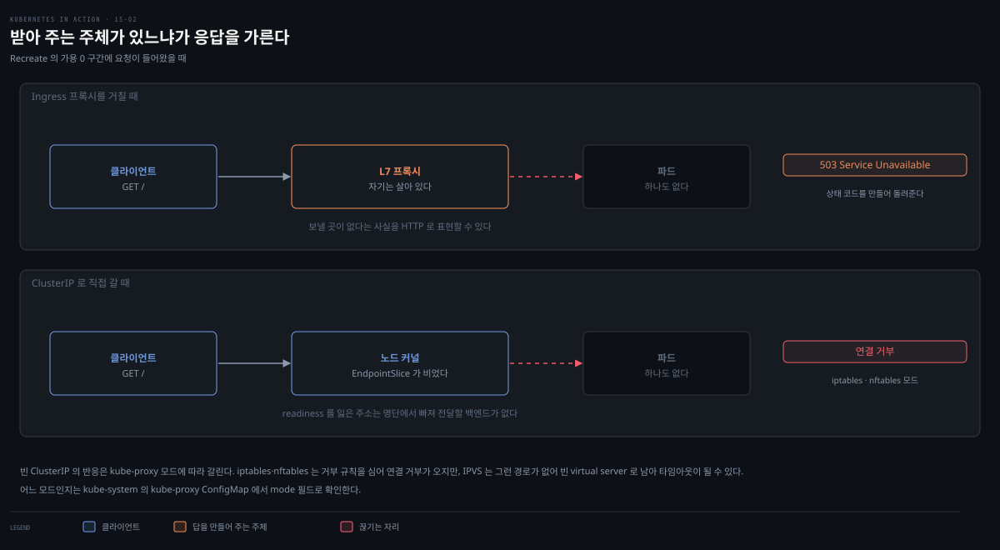
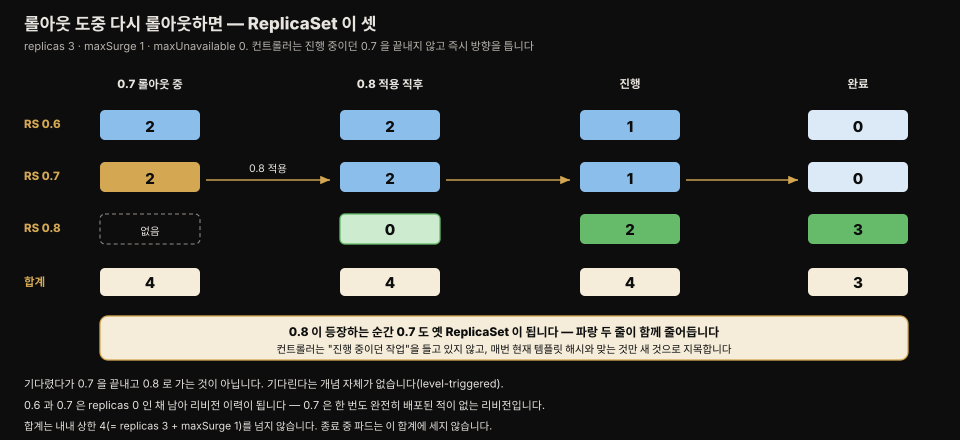

# Deployment 업데이트 — Recreate·RollingUpdate·maxSurge
---
> Deployment의 진짜 이점은 업데이트에서 드러납니다. Pod 템플릿을 바꾸면 파드가 즉시 교체됩니다. Recreate는 전부 한꺼번에(다운타임), RollingUpdate는 점진적으로(무중단) 바꾸며, maxSurge·maxUnavailable가 한 번에 몇 개를 교체할지 정합니다.


> 이 문서를 읽고 나면 Recreate와 RollingUpdate의 차이를 서비스 가용성 관점에서 설명하고, 새 ReplicaSet으로 파드가 전환되는 과정을 근거로 대며, maxSurge·maxUnavailable 조합이 교체 속도를 어떻게 바꾸는지 계산할 수 있습니다.


## 진입 — 왜 Deployment인가

> [15-01](./15-01.Deployment%20%EA%B8%B0%EC%B4%88%20%E2%80%94%20%EC%83%9D%EC%84%B1%C2%B7pod-template-hash%C2%B7%EC%8A%A4%EC%BC%80%EC%9D%BC%EB%A7%81.md)까지는 ReplicaSet 대비 이점이 안 보였습니다. 이점은 Pod 템플릿을 업데이트할 때 드러납니다 — ReplicaSet은 기존 파드에 반영 안 되지만, Deployment는 즉시 교체합니다.


ReplicaSet에서 Pod 템플릿 수정은 기존 파드에 즉시 반영되지 않습니다. ReplicaSet 컨트롤러가 새 파드를 만들 때만 쓰입니다. 책이 쿠키 커터라 부른 그 성질입니다. Deployment에서 Pod 템플릿을 수정하면 **파드가 즉시 교체됩니다** — 이것이 Deployment를 쓰는 이유입니다.

Kiada 파드는 지금 0.5 버전이고, 0.6으로 업데이트합니다.

위 지도가 이 편 전체를 한 장으로 이은 것입니다. 네 칸이 세로로 이어지며, 위에서 아래로 갈수록 **"무엇이 교체 속도를 정하는가"의 답이 좁혀집니다** — 전략에서 두 파라미터로, 다시 그 파라미터만으로는 부족한 지점으로. 각 상자 오른쪽의 절 번호가 본문에서 그 부분을 다루는 곳입니다.

- §1 시작 조건 — Pod 템플릿을 바꾸면 교체가 시작되고, 방식은 strategy가 정합니다
- §2·§3 두 전략 — Recreate는 동시에 전부, RollingUpdate는 하나씩 바꿉니다
- §4 두 파라미터 — maxSurge와 maxUnavailable이 한 번에 움직일 보폭을 정합니다
- §5·§6 한계 — 설정이 옳아도 준비 판정이 틀리면 끊기고, 롤아웃 중 재롤아웃은 방향만 틉니다

색이 붙은 곳은 두 군데뿐이고 둘 다 다운타임에 관한 경고입니다. 나머지 상자는 전부 같은 회색이라 색을 해석할 일이 없습니다. 앰버 띠는 Recreate가 가용 파드 0인 구간을 만든다는 뜻이고, 붉은 띠는 `maxUnavailable: 0`이어도 readiness 판정이 부정확하면 요청이 끊긴다는 뜻입니다.


## 1. 두 업데이트 전략

> Pod 템플릿을 바꾸면 Deployment 컨트롤러가 옛 파드를 멈추고 새 파드로 교체합니다. 교체 방식은 strategy에 달렸습니다 — Recreate(전부 한꺼번에)와 RollingUpdate(점진적)입니다.



| 전략 | 동작 |
|------|------|
| Recreate | 모든 파드를 동시에 삭제하고, 컨테이너가 다 끝나면 새 파드를 동시에 생성. 옛 파드 종료~새 파드 준비 사이 **서비스 불가**. 옛/새 버전 동시 실행이 안 되고 다운타임이 문제없을 때 |
| RollingUpdate | 옛 파드를 점진적으로 제거·교체. 새 파드가 준비된 뒤 다음 옛 파드를 제거해 **서비스 유지**. **기본 전략** |

Recreate는 설정 옵션이 없고, RollingUpdate는 한 번에 몇 개를 교체할지 설정합니다.


## 2. Recreate 전략

> Recreate는 모든 파드를 동시에 삭제·재생성해 짧은 다운타임(503)이 생깁니다. strategy에 명시하지 않으면 기본이 RollingUpdate이므로, Recreate를 쓰려면 명시합니다.

```yaml
spec:
  strategy:
    type: Recreate     # 기본 RollingUpdate에서 변경
  replicas: 3
```

이 변경은 Pod 템플릿을 건드리지 않아 업데이트를 트리거하지 않습니다. label·annotation·복제본 수 변경도 트리거하지 않습니다 — **Pod 템플릿 변경만** 업데이트를 일으킵니다. 공식 문서가 "if and only if"라는 표현으로 이 조건을 못 박고, 스케일을 트리거하지 않는 변경의 예로 명시합니다.[^rollout-trigger]

여기서 말하는 label 은 **Deployment 오브젝트 자체의** label 입니다. `template.metadata.labels` 를 바꾸는 것은 Pod 템플릿을 바꾸는 일이라 업데이트를 일으킵니다 — 아래 `kubectl patch` 예제가 이미지와 함께 `ver` label 을 바꾸는 것이 그래서 한 번의 롤아웃으로 처리됩니다.

### 이미지 업데이트 — set image / patch

컨테이너 이미지만 바꾸려면 `kubectl set image`를 씁니다(Deployment·ReplicaSet·pod 모두 가능).

```bash
kubectl set image deployment kiada kiada=luksa/kiada:0.6
```

하지만 template의 pod label에도 버전을 적어 뒀다면, 이미지만 바꾸면 label과 어긋납니다. 이미지와 label을 **동시에** 바꾸려면 `kubectl patch`를 씁니다.

```bash
kubectl patch deploy kiada --patch '
spec:
  template:
    metadata:
      labels:
        ver: "0.6"
    spec:
      containers:
      - name: kiada
        image: luksa/kiada:0.6'
```

부분 매니페스트(바꿀 필드만)를 넘깁니다. 파일로 두고 `--patch-file`을 써도 됩니다.

### 업데이트 관찰과 서비스 영향

업데이트 직후 파드를 반복 조회하면, 모든 파드가 **동시에** Terminating이 됐다가 새 버전 파드로 교체됩니다.

```bash
kubectl get po -l app=kiada -L ver
# kiada-7bffb9bf96-7w92k   0/2   Terminating   ...   0.5   # 전부 동시 종료
# ... 곧 ...
# kiada-5d5c5f9d76-5pghx   0/2   ContainerCreating   ...   0.6   # 새 버전
```

이 사이 웹으로 접근하면 Ingress 프록시가 잠깐 `503 Service Temporarily Unavailable`을 반환하고, 클러스터 IP로 직접 접근하면 연결이 거부됩니다.



같은 순간인데 응답이 다른 이유는 **요청을 받아 주는 주체가 있느냐**입니다. Ingress 프록시는 자기가 살아 있으니 뒤에 보낼 곳이 없다는 사실을 HTTP 상태 코드로 만들어 돌려줄 수 있습니다. ClusterIP는 다릅니다. readiness를 잃은 파드의 주소는 EndpointSlice에서 빠지므로, 전달할 백엔드가 하나도 없는 상태가 됩니다.[^readiness-endpoint]

> **주의.** 엔드포인트가 빈 ClusterIP의 반응은 **kube-proxy 모드에 따라 갈립니다.**
>
> iptables·nftables 모드는 엔드포인트가 없는 서비스에 대해 명시적으로 거부 규칙을 심으므로 연결 거부가 돌아옵니다. IPVS 모드에는 그런 경로가 없어 빈 virtual server로 남고, 요청이 응답 없이 매달려 **타임아웃**이 될 수 있습니다.[^proxy-reject] 어느 모드를 쓰는지는 `kubectl -n kube-system get configmap kube-proxy -o yaml`의 `mode` 필드로 확인합니다.

이 차이는 장애를 진단할 때 씁니다. 다만 **증상만으로 단정하지 말고 모드를 먼저 확인해야 합니다.** iptables·nftables 모드라면 연결 거부가 "보낼 곳이 없다"를 뜻해 엔드포인트가 빈 구간을 가리키지만, IPVS 모드에서는 같은 상황이 타임아웃으로 보여 앱이 느린 것과 구분되지 않습니다.

### Deployment와 ReplicaSet의 관계

옛 파드 이름(`kiada-7bffb9bf96-`)과 새 파드 이름(`kiada-5d5c5f9d76-`)의 접두사가 다릅니다 — 새 파드가 **다른 ReplicaSet**에 속한다는 뜻입니다.

```bash
kubectl get rs -L ver
# kiada-5d5c5f9d76   3   3   3   ...   0.6   # 새 버전 관리
# kiada-7bffb9bf96   0   0   0   ...   0.5   # 옛 버전 — 이제 파드 0
```

Deployment를 처음 만들 때 ReplicaSet 하나가 생겼고, 업데이트하자 **새 ReplicaSet**이 생겼습니다. 전환은 두 ReplicaSet의 숫자를 반대로 움직여 일어납니다.

- Deployment 컨트롤러가 옛 ReplicaSet을 0으로 스케일 → ReplicaSet 컨트롤러가 옛 파드를 삭제
- Deployment 컨트롤러가 새 ReplicaSet을 3으로 스케일 → ReplicaSet 컨트롤러가 새 파드를 생성

파드를 실제로 만들고 지우는 주체는 어느 쪽이든 ReplicaSet 컨트롤러입니다. Deployment 컨트롤러는 숫자만 옮깁니다. Pod 템플릿의 label이 ReplicaSet에도 적용되므로 버전 label로 둘을 구분할 수 있습니다. 이름만으로는 구분되지 않습니다.


## 3. RollingUpdate 전략

> Recreate의 다운타임은 대개 허용되지 않아 RollingUpdate가 기본입니다. 옛 ReplicaSet을 줄이며 새 ReplicaSet을 같은 수만큼 늘려, 서비스가 파드 없이 남는 순간이 없습니다.

```yaml
spec:
  strategy:
    type: RollingUpdate
    rollingUpdate:
      maxSurge: 0
      maxUnavailable: 1
  minReadySeconds: 10
  replicas: 3
```

`minReadySeconds`는 업데이트 진행 속도에 영향을 줍니다. 10으로 두면 각 단계가 그만큼 늦춰져 진행을 관찰하기 쉽습니다. 이 값이 결함 버전을 막는 장치가 되는 원리는 [15-03](./15-03.rollout%20%EC%A0%9C%EC%96%B4%EC%99%80%20%EB%B0%B0%ED%8F%AC%20%EC%A0%84%EB%9E%B5%20%E2%80%94%20pause%C2%B7faulty%C2%B7rollback%C2%B7%EC%A0%84%EB%9E%B5%205%EC%A2%85.md)에서 다룹니다.

이 값이 롤아웃을 늦추는 경로는 14장에서 구분한 ready와 available의 차이를 지납니다. 롤링 업데이트는 새 파드가 **available**해져야 다음 옛 파드를 지우는데, `minReadySeconds`는 ready가 된 뒤 그 상태를 이만큼 유지해야 available로 인정합니다. 10초면 파드당 10초씩, `replicas: 3`이면 전체가 대략 30초 늘어납니다.

느려지는 대가로 얻는 것은 **기동 직후 죽는 파드를 걸러 내는 일**입니다. 이 값이 0이면 ready가 뜨는 순간 available로 세고 곧바로 다음 옛 파드를 지우므로, 새 파드가 3초 뒤 크래시하면 옛 파드는 이미 사라진 뒤입니다. 10초를 버티게 하면 그 사이 크래시한 파드는 available에 들어가지 못하고 롤아웃이 그 자리에서 멈춥니다. 결함 버전이 전체로 퍼지기 전에 앞단에서 걸립니다.

그렇다고 300초처럼 크게 두면 안전이 계속 좋아지지는 않습니다. 배포가 그만큼 길어지는 것에 더해 **롤백도 같이 느려집니다.** 되돌리는 것 역시 역방향 롤아웃이라 같은 대기가 걸리므로, 결함을 늦게 잡는 만큼 복구도 늦어집니다. 실무에서 수십 초 단위를 쓰고 분 단위로 잘 가지 않는 이유입니다.

전략 변경과 업데이트는 한 번의 apply로 함께 트리거할 수 있습니다. 전략을 미리 바꿔 둘 필요가 없습니다.

### ReplicaSet 상태 진행 (0.6 → 0.7, maxSurge 0·maxUnavailable 1)

`kubectl rollout status`는 요약만 보여주니, 밑의 두 ReplicaSet 상태를 보는 게 정확합니다.

| 단계 | 0.7 RS (new) | 0.6 RS (old) | 설명 |
|------|-------------|-------------|------|
| 시작 | 없음 | 3/3/3 | 옛 RS가 3개 |
| 1 | 1/1/0 | 2/2/2 | 옛 RS -1, 새 RS +1(준비 전) |
| 2 | 1/1/1 | 2/2/2 | 새 파드 준비 → 트래픽 받음 |
| 3 | 2/2/1 | 1/1/1 | minReadySeconds 뒤 옛 -1·새 +1 |
| 완료 | 3/3/2→3 | 0/0/0 | 옛 RS 0, 새 RS 3 |

각 열은 DESIRED/CURRENT/READY입니다. 업데이트 내내 **항상 최소 2개**가 트래픽을 받아 서비스가 끊기지 않습니다. 새 파드가 준비될 때까지 다음 옛 파드를 지우지 않고 기다립니다.

### 클라이언트 관점

업데이트 중 클라이언트로 계속 요청을 보내면, 처음엔 전부 0.6이, 점점 0.7 비율이 늘다가, 완료 후엔 전부 0.7이 응답합니다.

```bash
kubectl run -it --rm --restart=Never kiada-client --image curlimages/curl -- sh -c \
  'while true; do curl -s http://kiada | grep "Request processed by"; done'
# Request processed by Kiada 0.6 running in pod "..."   # 처음
# Request processed by Kiada 0.7 running in pod "..."   # 점점 늘어남
# Request processed by Kiada 0.7 running in pod "..."   # 완료 후 전부 0.7
```


## 4. maxSurge와 maxUnavailable

> 두 파라미터가 한 번에 교체되는 파드 수를 정합니다. 값은 원하는 복제본 수에 **상대적**입니다 — 절대 수 또는 %(surge는 올림, unavailable은 내림)입니다.


### 숫자로 확인하기

교체 중 실제로 어떤 숫자가 흔들리는지 먼저 봅니다. 아래는 `replicas: 4`인 Deployment의 이미지를 바꾸고 두 번 조회한 화면입니다.

```bash
kubectl set image deploy/kiada app=busybox:1.37
kubectl get deploy kiada        # 교체 도중
kubectl get deploy kiada        # 교체 완료 후
```


교체 도중 `AVAILABLE`이 `3`으로 내려간 것이 이 절의 주제입니다. 목표는 4인데 한 개가 비었습니다. 그 폭을 정하는 값이 `maxUnavailable`입니다.

`UP-TO-DATE`는 새 템플릿으로 만들어진 파드 수라 `2`에서 `4`로 오릅니다. 그 초과 여유를 정하는 값이 `maxSurge`입니다.

| 파라미터 | 뜻 |
|----------|-----|
| maxSurge | 업데이트 중 원하는 복제본 수를 **초과**할 수 있는 최대 파드 수 |
| maxUnavailable | 업데이트 중 **불가용**할 수 있는 최대 파드 수 (원하는 수 기준) |

핵심은 값이 원하는 복제본 수에 상대적이라는 것입니다 — replicas 3·maxUnavailable 1·현재 5개면, 가용해야 할 수는 2개(=3−1)이지 4개가 아닙니다.

### 조합별 동작

**maxSurge=0, maxUnavailable=1** (앞의 예): 원하는 수를 초과 못 하니 항상 3개 이하. 가용은 2개 이상 유지해야 하니 한 번에 옛 파드 1개만 삭제 → 그 자리 새 파드가 가용해질 때까지 다음을 못 지움.

**maxSurge=1, maxUnavailable=0**: 항상 3개 가용, 총 4개 이하. 옛 RS를 못 줄이니 새 RS를 먼저 +1(surge 허용) → 4개일 때 옛 -1 → 반복. 업데이트 내내 원하는 수만큼 가용, 총합은 원하는 수+1을 안 넘음.

**maxSurge=1, maxUnavailable=1**: 총 최대 4, 항상 2 이상 가용. 새 RS +1·옛 RS −1 동시 → 옛 파드 삭제 마킹되면 새 RS를 또 +1. 각 RS가 2개씩. 가장 빠름.

### 순서는 고르는 것이 아니라 강제됩니다

앞 두 조합의 진행 순서가 반대인데, 이것은 컨트롤러의 취향이 아니라 **가진 여유가 하나뿐이라 그 길밖에 없는** 것입니다.

| 설정 | 가진 여유 | 그래서 순서 | 지키는 것 | 대가 |
|---|---|---|---|---|
| `maxSurge 1`·`maxUnavailable 0` | 초과 여유만 | 만들고 → 지운다 | 가용 3개 유지 | 노드 자원을 파드 1개분 더 씀 |
| `maxSurge 0`·`maxUnavailable 1` | 빈자리 여유만 | 지우고 → 만든다 | 총 3개 유지 | 업데이트 중 용량이 2/3로 떨어짐 |

`maxUnavailable: 0`은 가용 수를 못 줄이니 새 파드를 먼저 띄우는 것 외에 움직일 방법이 없고, `maxSurge: 0`은 총수를 못 늘리니 빈자리를 먼저 내는 것 외에 방법이 없습니다. 두 값을 모두 0으로 두면 어느 쪽 여유도 없어 롤아웃이 멈추는 것도 같은 이치입니다.

아래쪽 설정의 대가를 "자원을 아낀다"는 장점으로만 읽기 쉬운데, 뒤집으면 트래픽을 받는 파드가 줄어 **남은 파드의 부하가 올라갑니다.** 평소 사용률이 높은 서비스라면 업데이트 중 응답 지연이 생길 수 있습니다.

> **주의.** maxSurge·maxUnavailable을 둘 다 0으로 둘 수 없습니다.
>
> 초과도 못 하고 파드 제거도 못 해 업데이트가 불가능합니다. 이것은 관례가 아니라 API 필드 정의에 박혀 있는 제약으로, maxSurge 설명에는 "This can not be 0 if MaxUnavailable is 0", maxUnavailable 설명에는 "This can not be 0 if MaxSurge is 0"이 서로를 가리키며 적혀 있습니다.[^rolling-params]
>
> 다만 막는 방식이 두 갈래입니다. 
>
> - **직접 0을 적는 것**은 API 검증이 거부하지만, 퍼센트가 **내림 때문에 0이 되는 경우**는 거부할 수 없습니다(예: replicas 3에 `maxUnavailable: 10%` → 0.3 → 0). 
> - 이때는 컨트롤러가 두 값이 모두 0으로 계산된 것을 보고 `maxUnavailable`을 1로 되돌려 롤아웃이 멈추지 않게 합니다.[^fenceposts]

> **주의.** Deployment 컨트롤러는 파드를 직접 세지 않고 ReplicaSet status에서 얻는데, ReplicaSet은 종료 중인 파드를 안 셉니다. 그래서 종료 중 파드까지 세면 총 수가 4를 넘을 수 있습니다.

이 셈의 차이는 자원 계산에서 실제 문제가 됩니다. `maxSurge: 1`이면 노드에 파드 1개분 여유만 있으면 된다고 보기 쉬운데, 종료 중인 파드도 컨테이너가 실제로 끝날 때까지 메모리와 CPU를 계속 점유합니다. 공식 문서도 종료 중 파드가 그 기간 동안 추가 자원을 소비할 수 있고, 그 결과 전체 파드 수가 `.spec.replicas`를 일시적으로 초과할 수 있다고 명시합니다.[^terminating-pods]

graceful shutdown이 30초라면 그 30초 동안 실제 사용량은 상한보다 큽니다. 빠듯한 클러스터에서 새 파드가 `Pending`으로 멈추는 일이 여기서 생깁니다. 컨트롤러의 셈으로는 4를 안 넘겼는데 스케줄러가 자리를 못 찾습니다. 종료 중 파드 수는 Deployment의 `.status.terminatingReplicas` 필드로 따로 볼 수 있습니다.[^terminating-pods]

### 더 큰 값과 %

maxSurge를 1보다 크게 하면 한 번에 더 많이 추가하고, maxUnavailable을 크게 하면 더 많이 제거합니다. %로 주면 maxSurge는 **올림**, maxUnavailable은 **내림**으로 계산합니다.[^rolling-params] 기본값은 둘 다 **25%**입니다.[^rolling-params]

replicas 10에 둘 다 25%를 주면 이렇게 됩니다.

- maxSurge = 10 × 0.25 = 2.5 → 올림 **3** → 총 파드는 최대 13개
- maxUnavailable = 10 × 0.25 = 2.5 → 내림 **2** → 가용은 최소 8개

공식 문서는 반올림 방향만 규정하고 **그 이유는 밝히지 않습니다.** 다만 결과를 놓고 보면 두 방향 모두 가용성에 유리한 쪽으로 굴린 것으로 읽힙니다. 두 필드에서 "값이 크다"가 뜻하는 바가 서로 반대이기 때문에, 같은 기준을 적용해도 반올림 방향이 갈립니다.

| 필드 | 값이 크면 | 그래서 소수점은 |
|---|---|---|
| `maxSurge` | 띄울 수 있는 여유가 늘어남 | **올려서** 넉넉하게 |
| `maxUnavailable` | 없어도 되는 파드가 늘어남 | **내려서** 인색하게 |

반대로 정했다고 가정하면 이 설계가 분명해집니다.

| | maxSurge | maxUnavailable | 총 최대 | 가용 최소 |
|---|---|---|---|---|
| 현재 (surge 올림) | 3 | 2 | 13 | **8** |
| 반대 (surge 내림) | 2 | 3 | 12 | **7** |

반대로 하면 두 가지가 동시에 나빠집니다. 총 최대가 12로 줄어 한 번에 밀어 넣을 새 파드가 적어지니 **업데이트가 느려지고**, 가용 최소가 7로 내려가 트래픽을 받는 파드가 하나 더 적어도 되게 허용하니 **덜 안전해집니다.** 어느 쪽으로도 이득이 없습니다. 현재 방향이라면 `25%`라고 적었을 때 의도한 가용 수준이 반올림 때문에 깎이지 않습니다.

> **Spring 관점.** Boot 앱의 무중단 배포에는 RollingUpdate 기본값(25%)이 무난하지만, 리소스가 빠듯하면 maxSurge 0(총 파드 안 늘림), 응답 지연을 못 견디면 maxUnavailable 0(가용 수 안 줄임)을 씁니다. 
>
> - readiness probe(Actuator `/health`)가 정확해야 "준비됐다"는 판단이 맞아 무중단이 실제로 성립합니다 — probe가 부실하면 아직 못 받는 파드로 트래픽이 가 롤링 업데이트가 무중단이 아니게 됩니다.


## 5. maxUnavailable 0 인데 왜 끊기는가

> `maxUnavailable: 0`은 "새 파드가 준비되기 전엔 옛 파드를 지우지 않는다"까지만 보장합니다. 준비 판정이 정확한지, 지워지는 파드에서 트래픽이 제때 빠지는지는 별개의 문제라 설정만으로는 무중단이 완성되지 않습니다.

무중단으로 설정했는데 배포 중 502·504가 관측되는 일이 흔합니다. 원인은 대개 컨트롤러의 판단과 실제 상태 사이의 간극인데, 들어오는 쪽과 나가는 쪽 두 군데에서 생깁니다.

### 들어오는 쪽 — 무엇을 근거로 "준비됐다"고 하는가

readinessProbe가 없으면 **컨테이너가 실행됐다는 사실 자체**가 곧 ready입니다. 프로세스는 떴지만 Spring 컨텍스트가 아직 올라오는 중이어도 컨트롤러 눈에는 준비된 파드라, 그 근거로 옛 파드를 지웁니다. 그 순간 트래픽이 아직 응답 못 하는 파드로 갑니다.

probe를 넣을 때 종류를 헷갈리면 더 나빠집니다. 둘은 실패했을 때 하는 일이 다릅니다.[^probe-types]

| Probe | 무엇을 정하는가 | 실패하면 |
|---|---|---|
| `readinessProbe` | 컨테이너가 트래픽을 받을 준비가 됐는지 | 엔드포인트에서 **뺀다**. 파드는 살려 둠 |
| `livenessProbe` | 컨테이너를 재시작할 때인지 | 컨테이너를 **죽이고 재시작**한다 |

기동이 느린 것은 고장이 아닙니다. 아직 준비가 안 된 상태일 뿐입니다. 여기에 liveness를 걸면 "느리다"를 "죽었다"로 판정해 재시작합니다. 재시작한 컨테이너도 똑같이 느리게 뜨므로 다시 죽습니다. 이 루프가 반복됩니다.

기동 대기는 readiness의 일입니다. 기동이 아주 느린 앱에는 `startupProbe`를 따로 둡니다.

검사 대상도 중요합니다. 포트가 열렸는지만 보는 TCP 검사로는 부족하고, **실제로 요청을 처리할 수 있는 상태**를 봐야 합니다. Spring Boot라면 `/actuator/health/readiness`가 DB 커넥션 풀 같은 의존성까지 반영합니다.

### 나가는 쪽 — 지워지는 파드에서 트래픽이 빠지는가

파드를 지울 때 두 가지가 **동시에** 시작됩니다. 공식 문서의 표현대로 kubelet이 graceful shutdown을 시작하는 것과 같은 시점에, 컨트롤 플레인이 그 파드를 EndpointSlice에서 뺄지 판단합니다.[^pod-termination]

```bash
# 파드 삭제 지시
   ├─ kubelet: 컨테이너에 TERM 신호 전송 → 앱이 종료 시작
   └─ 컨트롤 플레인: EndpointSlice 에서 이 파드를 정리
              → 각 노드의 전달 규칙이 갱신되기까지 시간이 걸림
```

두 경로는 서로를 기다리지 않습니다. 앱이 TERM을 받자마자 커넥션을 끊어 버리면, 전달 규칙이 아직 갱신 중인 노드에서 온 요청이 갈 곳을 잃습니다. `maxUnavailable: 0`은 이 구간을 보장하지 않습니다 — 그 설정은 "옛 파드를 언제 지우기 시작할지"를 정할 뿐, "지우기로 한 파드에서 트래픽이 언제 빠지는지"는 다른 층의 일입니다.

쿠버네티스도 이 문제를 알고 있어, 종료 중인 엔드포인트를 즉시 지우지 않고 `ready: false`로 표시해 로드밸런서가 새 트래픽을 보내지 않게 합니다.[^pod-termination] 그래도 이미 전달 중인 요청과 규칙 전파 시차는 남습니다.

여기서부터는 **공식 권고가 아니라 실무 관행**입니다. 공식 문서가 `preStop`을 소개하는 맥락은 종료 순서 동기화이고, 전파 대기용 `sleep`을 권고하지는 않습니다. 다만 시차를 흡수할 다른 수단이 마땅치 않아 널리 쓰입니다.

```yaml
lifecycle:
  preStop:
    exec:
      command: ["sh", "-c", "sleep 5"]     # 이 동안 앱은 계속 응답, 그 사이 규칙 전파
```

앱은 5초 뒤에 TERM을 받고, 그동안 정상 응답을 이어갑니다. Spring Boot라면 `server.shutdown=graceful`로 처리 중인 요청을 마저 끝내는 설정을 함께 씁니다.

### 무중단은 세 가지가 맞물려야 성립합니다

| 축 | 없으면 | 담당 |
|---|---|---|
| `maxUnavailable: 0` | 옛 파드가 먼저 사라져 용량이 준다 | Deployment 설정 |
| 정확한 readinessProbe | 준비 안 된 파드로 트래픽이 간다 | 파드 스펙 |
| `preStop` + graceful shutdown | 지워지는 파드로 간 요청이 끊긴다 | 파드 스펙 + 앱 |

15-01에서 정리한 간접 구조의 대가가 여기서 드러납니다. Deployment 컨트롤러는 파드를 만나지 않고 ReplicaSet의 숫자만 보므로, **숫자가 맞다는 것과 서비스가 끊기지 않는다는 것이 같지 않습니다.** 그 간극을 메우는 일은 사용자 몫으로 남습니다.


## 6. 롤아웃 도중 다시 롤아웃하면

> 진행 중이던 롤아웃은 끝까지 가지 않고 즉시 방향을 틉니다. 컨트롤러가 "진행 중인 작업"을 들고 있지 않고 매번 현재 상태만 보기 때문입니다.



0.6에서 0.7로 가던 중 절반쯤 진행됐을 때 마음이 바뀌어 0.8을 적용했다고 합시다.

ReplicaSet은 셋이 됩니다. 여기서 눈여겨볼 것은 **0.7의 신분이 바뀐다**는 점입니다. 0.8이 등장하는 순간 0.7은 더 이상 "만들어 가는 중인 새 버전"이 아니라 0.6과 나란히 "줄여야 할 옛 버전"이 됩니다. 컨트롤러는 옛 ReplicaSet들을 합쳐서 줄입니다.

기다렸다가 0.7을 완성한 뒤 0.8로 넘어가지 않습니다. **기다린다는 개념 자체가 없습니다.** 컨트롤러가 매 조정마다 하는 일은 현재 `spec.template`의 해시와 맞는 ReplicaSet을 새 것으로 지목하고 나머지를 줄이는 것뿐입니다. 0.8을 적는 순간 지목 대상이 바뀝니다.

14-02에서 이름을 붙인 [level-triggered](./14-02.ReplicaSet%20%EC%BB%A8%ED%8A%B8%EB%A1%A4%EB%9F%AC%20%E2%80%94%20reconciliation%C2%B7%EC%9E%A5%EC%95%A0%EB%B3%B5%EA%B5%AC%C2%B7%EC%82%AD%EC%A0%9C.md) 성질이 그대로 나타나는 자리입니다. 중간값 0.7을 거쳐 갈 의무가 없습니다.

이 성질에는 좋은 면도 있습니다. 롤아웃 도중 Deployment 컨트롤러가 죽어도 **파드는 아무 일도 없습니다.** 이미 떠 있는 파드는 각자의 ReplicaSet 컨트롤러가 계속 관리하니 수가 유지되고, 멈추는 것은 숫자를 더 옮기는 일뿐입니다. 컨트롤러가 돌아오면 진행률을 복원할 필요 없이 지금 상태를 다시 보고 이어갑니다.

> **주의.** 롤아웃 중 재롤아웃을 반복하면 **끝까지 못 간 리비전이 쌓입니다.**
>
> 위 예의 0.7은 replicas 0인 채 리비전 이력에 남지만, 한 번도 완전히 배포된 적이 없는 버전입니다. `rollout undo`로 되돌아갈 수 있는 목록에 검증되지 않은 리비전이 섞이므로, 되돌릴 대상을 고를 때 `kubectl rollout history`의 revision 번호만 믿지 말고 그 리비전이 실제로 완주했는지 확인해야 합니다.


## 면접에서 받을 만한 질문

> 아래 질문에 먼저 스스로 답해 본 뒤, 챕터 끝의 정답과 맞춰 봅니다.

1. ReplicaSet과 Deployment는 Pod 템플릿 수정에 어떻게 다르게 반응하나요?
2. Recreate와 RollingUpdate는 서비스 가용성 면에서 어떻게 다른가요? Recreate 중 클라이언트는 무엇을 겪나요?
3. Deployment를 업데이트하면 왜 새 ReplicaSet이 생기나요? 옛 파드는 어떻게 되나요?
4. maxSurge와 maxUnavailable의 값은 무엇에 상대적인가요? 둘 다 0으로 두면 왜 안 되나요?
5. maxSurge·maxUnavailable을 %로 줄 때 각각 어떻게 반올림되나요? 방향이 서로 반대인 이유는 무엇인가요? 기본값은요?
6. `maxUnavailable: 0`으로 뒀는데 배포 중 502가 관측됩니다. 원인으로 무엇을 의심해야 하나요? readinessProbe와 livenessProbe 중 어느 쪽을 넣어야 하며, 왜 그런가요?
7. 파드가 삭제될 때 TERM 신호 전달과 EndpointSlice 정리는 어떤 순서로 일어나나요? `preStop` 훅이 필요한 이유는 무엇인가요?
8. 롤아웃이 절반 진행된 상태에서 또 다른 버전을 적용하면 어떻게 되나요? 진행 중이던 롤아웃은 완료된 뒤에 넘어가나요?
9. `minReadySeconds`를 크게 두면 무엇이 좋아지고 무엇이 나빠지나요?


## 정답 (자답 후 펼치기)

> 위 질문에 답해 본 다음 아래와 맞춰 봅니다. 순서는 질문과 1:1로 대응합니다.

### 정답 1 — 템플릿 수정 반응

ReplicaSet은 Pod 템플릿을 수정해도 기존 파드에 즉시 반영하지 않습니다. 컨트롤러가 새 파드를 만들 때만 새 템플릿을 씁니다 — 쿠키 커터입니다. Deployment는 Pod 템플릿을 수정하면 **파드를 즉시 교체**합니다. strategy에 따라 옛 파드를 멈추고 새 파드로 바꿉니다. 이 즉시 교체가 Deployment를 ReplicaSet 대신 쓰는 이유입니다.

### 정답 2 — Recreate vs RollingUpdate

Recreate는 모든 파드를 동시에 삭제합니다. 컨테이너가 다 끝난 뒤 새 파드를 동시에 만듭니다. 그 사이 **서비스가 불가**합니다. 클라이언트는 Ingress에서 `503 Service Temporarily Unavailable`을 받습니다. 클러스터 IP 로 직접 접근하면 연결 거부를 겪습니다. RollingUpdate는 옛 파드를 점진적으로 교체하되 새 파드가 준비된 뒤 다음 옛 파드를 지웁니다. 그래서 서비스가 파드 없이 남는 순간이 없습니다. 그래서 RollingUpdate가 기본입니다.

### 정답 3 — 새 ReplicaSet 생성

Pod 템플릿이 바뀌면 pod-template-hash가 달라져 이름이 다른 **새 ReplicaSet**이 생깁니다. Deployment 컨트롤러는 옛 ReplicaSet을 줄이고 새 ReplicaSet을 늘리기만 합니다. 파드를 실제로 지우고 만드는 것은 각 ReplicaSet의 컨트롤러입니다.

옛 ReplicaSet은 파드 0인 채로 남아 revision 히스토리가 됩니다(15-03). 파드 이름 접두사가 달라지는 것으로 다른 ReplicaSet 소속임을 알 수 있습니다.

### 정답 4 — 상대성과 둘 다 0 불가

두 값은 **원하는 복제본 수에 상대적**입니다. replicas 3에 maxUnavailable 1이면 가용해야 할 수는 2개이며, 현재 파드가 몇 개든 상관없습니다.

둘 다 0으로 두면 안 되는 이유는 업데이트가 움직일 여지가 사라지기 때문입니다. maxSurge 0은 원하는 수를 초과하지 못하게 하고, maxUnavailable 0은 가용 수를 줄이지 못하게 합니다. 그러면 새 파드를 추가할 수도 옛 파드를 지울 수도 없어 롤아웃이 한 걸음도 나아가지 못합니다.

막는 방식은 두 갈래입니다. 직접 0을 적으면 API 검증이 거부하고, 퍼센트가 내림 때문에 0이 되는 경우는 컨트롤러가 `maxUnavailable`을 1로 보정해 롤아웃이 멈추지 않게 합니다.

### 정답 5 — % 반올림과 기본값

%로 줄 때 maxSurge는 **올림**, maxUnavailable은 **내림**으로 절대 수를 계산합니다. 기본값은 둘 다 **25%**입니다.

replicas 10에 둘 다 25%를 준 경우로 보면 이렇습니다.

- maxSurge: 2.5를 올려 **3** → 업데이트 중 최대 13개
- maxUnavailable: 2.5를 내려 **2** → 항상 최소 8개 가용

공식 문서는 이유를 밝히지 않지만, 결과를 보면 **둘 다 가용성에 유리한 쪽으로 굴린** 것으로 읽힙니다. maxSurge는 크면 여유가 늘고 maxUnavailable은 크면 가용 파드가 줄어, 같은 기준이 반대 방향으로 나타납니다. 반대로 정했다면 총 최대가 12로 줄어 업데이트가 느려지는 동시에 가용 최소가 7로 내려가 덜 안전해집니다. 어느 쪽으로도 이득이 없습니다.

### 정답 6 — maxUnavailable 0 인데 끊기는 이유

이 설정은 "새 파드가 준비되기 전엔 옛 파드를 지우지 않는다"까지만 보장합니다. **무엇을 준비로 볼 것인가**는 별개입니다. readinessProbe가 없으면 컨테이너가 실행됐다는 사실 자체가 ready라, 앱이 아직 기동 중인 파드를 근거로 옛 파드를 지웁니다.

넣어야 할 것은 **readinessProbe**입니다. readiness는 실패해도 파드를 살려 둔 채 엔드포인트에서만 뺍니다. liveness는 컨테이너를 죽이고 재시작합니다. 기동이 느린 것은 고장이 아니므로 liveness를 걸면 "느리다"를 "죽었다"로 판정해 재시작 루프에 빠집니다. 기동이 아주 느리면 `startupProbe`를 따로 둡니다.

검사 대상도 포트 열림이 아니라 실제 처리 가능 상태여야 합니다. Spring Boot는 `/actuator/health/readiness`가 의존성까지 반영합니다.

### 정답 7 — 종료 시 두 경로와 preStop

**동시에** 시작됩니다. kubelet이 컨테이너에 TERM을 보내는 것과 같은 시점에 컨트롤 플레인이 그 파드를 EndpointSlice에서 뺄지 판단하며, 두 경로는 서로를 기다리지 않습니다. 앱이 TERM을 받자마자 커넥션을 끊으면 전달 규칙이 아직 갱신 중인 노드에서 온 요청이 갈 곳을 잃습니다.

쿠버네티스는 종료 중 엔드포인트를 즉시 지우지 않고 `ready: false`로 표시해 로드밸런서가 새 트래픽을 보내지 않게 하지만, 전파 시차는 남습니다. `preStop`으로 몇 초를 벌면 그동안 앱이 계속 응답하면서 규칙 전파가 끝납니다. 이것은 공식 권고가 아니라 실무 관행입니다. `server.shutdown=graceful`을 함께 써 처리 중인 요청을 마저 끝냅니다.

### 정답 8 — 롤아웃 중 재롤아웃

즉시 방향을 틉니다. 진행 중이던 버전을 완료한 뒤 넘어가지 않습니다. ReplicaSet은 셋이 되고, 새로 적용한 것만 새 ReplicaSet으로 지목되며 **앞의 두 개가 함께 옛 것으로 줄어듭니다.**

컨트롤러가 "진행 중인 작업"을 들고 있지 않기 때문입니다. 매 조정마다 현재 템플릿 해시와 맞는 ReplicaSet을 새 것으로 지목하고 나머지를 줄일 뿐입니다. 중간 버전을 거쳐 갈 의무가 없습니다 — level-triggered 입니다. 같은 이유로 롤아웃 중 컨트롤러가 죽어도 파드는 무사하고, 돌아오면 진행률 복원 없이 이어갑니다.

주의할 점은 끝까지 못 간 리비전이 이력에 쌓인다는 것입니다. `rollout undo` 대상 목록에 한 번도 완주하지 않은 버전이 섞입니다.

### 정답 9 — minReadySeconds 트레이드오프

크게 두면 **기동 직후 죽는 파드를 걸러 냅니다.** ready가 된 뒤 그 상태를 이만큼 유지해야 available로 인정되므로, 그 사이 크래시한 파드는 available에 못 들어가고 롤아웃이 멈춥니다. 결함 버전이 전체로 퍼지기 전에 걸립니다.

나빠지는 것은 속도입니다. 파드당 그만큼씩 누적돼 배포가 길어지고, **롤백도 같은 대기를 겪어 복구가 늦어집니다.** 결함을 늦게 잡는 만큼 늦게 복구하는 교환이라, 실무에서는 수십 초 단위를 씁니다.


## 관련 문서

> 이 편은 15-01의 Deployment 기초를 이어받아 업데이트 전략(Recreate·RollingUpdate)과 교체 속도(maxSurge·maxUnavailable)를 다루고, rollout 제어·롤백·배포 전략(15-03)으로 이어집니다.

- [15-01. Deployment 기초 — 생성·pod-template-hash·스케일링](./15-01.Deployment%20%EA%B8%B0%EC%B4%88%20%E2%80%94%20%EC%83%9D%EC%84%B1%C2%B7pod-template-hash%C2%B7%EC%8A%A4%EC%BC%80%EC%9D%BC%EB%A7%81.md) — Deploy↔RS↔pod·pod-template-hash(앞 편)
- [15-03. rollout 제어와 배포 전략 — pause·faulty·rollback·전략 5종](./15-03.rollout%20%EC%A0%9C%EC%96%B4%EC%99%80%20%EB%B0%B0%ED%8F%AC%20%EC%A0%84%EB%9E%B5%20%E2%80%94%20pause%C2%B7faulty%C2%B7rollback%C2%B7%EC%A0%84%EB%9E%B5%205%EC%A2%85.md) — minReadySeconds·rollback·Canary/Blue-Green(다음 편)
- [핵심 워크로드](../../kubernetes/01_workloads/01-01.%ED%95%B5%EC%8B%AC%20%EC%9B%8C%ED%81%AC%EB%A1%9C%EB%93%9C.md) — RollingUpdate·무중단 배포 통합 개념본
- 원서: 《Kubernetes in Action, 2nd Ed.》 Ch15 §15.2.1~15.2.3 — [Manning](https://www.manning.com/books/kubernetes-in-action-second-edition), [예제 코드](https://github.com/luksa/kubernetes-in-action-2nd-edition/tree/master/Chapter15)
- 공식 문서: [Deployment strategy](https://kubernetes.io/docs/concepts/workloads/controllers/deployment/#strategy)
- 공식 API 레퍼런스: [Deployment v1 — RollingUpdateDeployment](https://kubernetes.io/docs/reference/kubernetes-api/workload-resources/deployment-v1/) — maxSurge·maxUnavailable 반올림·기본값·상호 제약

[^rolling-params]: Kubernetes 공식 API 레퍼런스, [Deployment v1 — RollingUpdateDeployment](https://kubernetes.io/docs/reference/kubernetes-api/workload-resources/deployment-v1/) (2026-08-10 조회, `kubectl explain deployment.spec.strategy.rollingUpdate` 로 대조). 개념 문서 [Deployment — Max Surge](https://kubernetes.io/docs/concepts/workloads/controllers/deployment/#max-surge) (문서 소스 `deployment.md` L1214~1216) 의 maxSurge 서술은 "The value cannot be 0 if `maxUnavailable` is 0. **The absolute number is calculated from the percentage by rounding up.** The default value is 25%." 순서로 이어지고, maxUnavailable 쪽은 같은 자리에서 "rounding **down**" 입니다. API 레퍼런스의 축약형 표현은 "Absolute number is calculated from percentage by rounding up"·"...rounding down" 이며, 상호 제약은 양쪽에 "This can not be 0 if MaxUnavailable is 0"·"This can not be 0 if MaxSurge is 0" 으로 적혀 있습니다.

[^proxy-reject]: 엔드포인트가 없는 서비스의 처리는 kube-proxy 구현마다 다릅니다(2026-08-10 조회, `master`). iptables 모드는 [`pkg/proxy/iptables/proxier.go`](https://github.com/kubernetes/kubernetes/blob/master/pkg/proxy/iptables/proxier.go) 에서 `if !hasEndpoints` 일 때 `internalTrafficFilterTarget = "REJECT"` 와 주석 `"%s has no endpoints"` 를 심습니다. nftables 모드도 [`pkg/proxy/nftables/proxier.go`](https://github.com/kubernetes/kubernetes/blob/master/pkg/proxy/nftables/proxier.go) 에 `rejectChain` 과 "vmap to drop or reject packets to services with no endpoints" 주석이 있습니다. 반면 [`pkg/proxy/ipvs/proxier.go`](https://github.com/kubernetes/kubernetes/blob/master/pkg/proxy/ipvs/proxier.go) 에는 엔드포인트 부재에 대응하는 REJECT 경로가 없습니다 — 유일한 `REJECT` 는 `kubeIPVSSet` 목적지 필터용이라 이 상황과 무관합니다.

[^terminating-pods]: Kubernetes 공식 문서, [Deployment](https://kubernetes.io/docs/concepts/workloads/controllers/deployment/) (2026-08-10 조회, 문서 소스 `deployment.md` L1348~1350). 원문은 "Pods that become terminating due to deletion or scale down may take a long time to terminate, and **may consume additional resources during that period**. As a result, **the total number of all pods can temporarily exceed `.spec.replicas`**. Terminating pods can be tracked using the `.status.terminatingReplicas` field of the Deployment." 입니다.

[^fenceposts]: [`deployment_util.go` 의 `ResolveFenceposts`](https://github.com/kubernetes/kubernetes/blob/master/pkg/controller/deployment/util/deployment_util.go) (2026-08-10 조회, `master`). 두 값이 모두 0 으로 계산되면 `unavailable = 1` 로 보정하며, 주석이 그 이유를 구분해 적습니다 — "Validation should never allow the user to explicitly use zero values for both maxSurge maxUnavailable. **Due to rounding down maxUnavailable though, it may resolve to zero.** If both fenceposts resolve to zero, then we should set maxUnavailable to 1 on the theory that surge might not work due to quota." 퍼센트 환산은 같은 함수가 `GetScaledValueFromIntOrPercent` 의 마지막 인자로 surge 에 `true`(올림), unavailable 에 `false`(내림)를 넘겨 처리합니다.

[^rollout-trigger]: Kubernetes 공식 문서, [Deployment — Updating a Deployment](https://kubernetes.io/docs/concepts/workloads/controllers/deployment/#updating-a-deployment) (2026-08-10 조회, 문서 소스 `deployment.md` L167~168). 원문은 "A Deployment's rollout is triggered **if and only if** the Deployment's Pod template (that is, `.spec.template`) is changed, for example if the labels or container images of the template are updated. **Other updates, such as scaling the Deployment, do not trigger a rollout.**"입니다. 같은 문서가 기본 전략(`.spec.strategy.type` 은 "RollingUpdate" 가 기본, L1177)과 Recreate 동작("All existing Pods are killed before new ones are created", L1182)도 정의합니다.

[^probe-types]: Kubernetes 공식 문서, [Pod Lifecycle — Container probes](https://kubernetes.io/docs/concepts/workloads/pods/pod-lifecycle/#container-probes) (2026-08-10 조회, 문서 소스 `pod-lifecycle.md` L816~835). 원문은 liveness 가 "Liveness probes **determine when to restart a container**... the kubelet restarts that container.", readiness 가 "Readiness probes **determine when a container is ready to accept traffic**." 입니다. 같은 절이 "Liveness probes do not wait for readiness probes to succeed" 라며 느린 기동에는 `initialDelaySeconds` 나 startup probe 를 쓰라고 안내하고, readiness 실패 시 "the EndpointSlice controller **removes the Pod's IP address from the EndpointSlices** of all Services that match the Pod" 라고 적습니다.

[^readiness-endpoint]: 위 [Pod Lifecycle — Readiness probe](https://kubernetes.io/docs/concepts/workloads/pods/pod-lifecycle/#readiness-probe) 절의 EndpointSlice 제거 서술과 같습니다(2026-08-10 조회). 파드가 트래픽을 받을 수 없게 되면 Service 의 EndpointSlice 에서 주소가 빠지므로, 모든 파드가 그 상태가 되면 전달할 백엔드가 남지 않습니다.

[^pod-termination]: Kubernetes 공식 문서, [Pod Lifecycle — Termination of Pods](https://kubernetes.io/docs/concepts/workloads/pods/pod-lifecycle/#pod-termination) (2026-08-10 조회, 문서 소스 `pod-lifecycle.md` L939~955). 원문은 "**At the same time as** the kubelet is starting graceful shutdown of the Pod, the control plane evaluates whether to remove that shutting-down Pod from EndpointSlice objects" 로 두 경로가 동시에 진행됨을 명시합니다. 이어서 "Any endpoints that represent the terminating Pods are **not immediately removed** from EndpointSlices, and a status indicating terminating state is exposed... Terminating endpoints always have their `ready` status as `false`... so **load balancers will not use it for regular traffic**." 라고 적습니다. 커넥션 드레이닝 구현은 같은 문서가 가리키는 [Pods And Endpoints Termination Flow](https://kubernetes.io/docs/tutorials/services/pods-and-endpoint-termination-flow/) 튜토리얼이 다룹니다.
