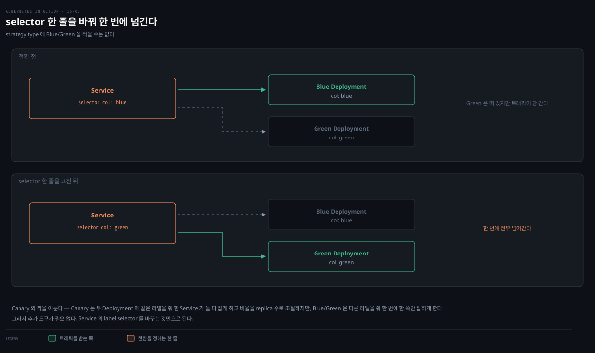

# rollout 제어와 배포 전략 — pause·faulty·rollback·전략 5종
---
> 롤링 업데이트는 완전 자동이지만, pause로 멈춰 새 버전을 확인하고, minReadySeconds+readiness probe로 결함 버전을 자동 차단하며, rollout undo로 되돌릴 수 있습니다. Deployment가 직접 지원하지 않는 Canary·Blue/Green·Shadowing은 Deployment·Service·Ingress를 조합해 구현합니다.


> 이 문서를 읽고 나면 rollout을 멈추고 되돌리는 명령을 구분해 쓰고, minReadySeconds가 결함 버전을 어떻게 막는지 근거를 대며, 다섯 배포 전략이 쿠버네티스에서 어떻게 구현되는지 설명할 수 있습니다.


## 진입 — 자동 업데이트를 제어하기

> [15-02](./15-02.Deployment%20%EC%97%85%EB%8D%B0%EC%9D%B4%ED%8A%B8%20%E2%80%94%20Recreate%C2%B7RollingUpdate%C2%B7maxSurge.md)의 롤링 업데이트는 시작하면 끝까지 자동으로 진행됩니다. 이 편은 그 과정을 멈추고·검증하고·되돌리는 제어와, 네이티브가 아닌 배포 전략의 구현을 다룹니다.

롤링 업데이트는 Pod 템플릿을 바꾸면 시작해 모든 파드가 교체될 때까지 멈추지 않습니다. 하지만 언제든 멈출 수 있습니다 — 두 버전이 동시에 도는 동안 동작을 확인하거나, 첫 새 파드가 기대대로인지 보고 나서 나머지를 교체하려 할 때입니다.


## 1. rollout 일시정지 — pause / resume

> pause는 spec의 paused를 true로 만들어, 컨트롤러가 ReplicaSet을 바꾸기 전에 이 필드를 확인해 멈춥니다. 웹 앱은 두 버전이 섞여 리소스별로 버전이 갈릴 수 있습니다.

```bash
kubectl rollout pause deployment kiada    # 중간에 멈춤
kubectl rollout resume deployment kiada   # 재개
```

pause는 Deployment spec의 `paused` 필드를 true로 만들고, 컨트롤러는 ReplicaSet을 바꾸기 전 이 필드를 확인합니다.

### 웹 앱에서 주의할 점

첫 파드가 교체된 시점에 pause하고 웹으로 접근하면, 브라우저가 리소스마다 다른 버전을 받습니다 — HTML은 0.7, CSS는 0.6처럼 요청이 옛/새 파드로 나뉘기 때문입니다. Kiada는 CSS·JS·이미지에 큰 변화가 없어 문제없지만, 그렇지 않으면 HTML이 잘못 렌더될 수 있습니다.

막으려면 session affinity를 쓰거나 **2단계로 업데이트**합니다 — 먼저 하위 호환을 지키며 CSS 등 리소스를 배포하고, 완전히 롤아웃한 뒤 HTML 변경 버전을 배포합니다. 또는 Blue/Green 전략을 씁니다(아래).

### 업데이트 차단 용도

pause는 Deployment 변경이 곧바로 업데이트를 트리거하는 것도 막습니다 — 여러 변경을 모아 두었다가, 준비되면 resume해 한 번에 시작할 수 있습니다.


## 2. 결함 버전 자동 차단 — minReadySeconds

> pause로 수동 확인하는 대신, minReadySeconds와 readiness probe를 조합하면 결함 버전을 자동으로 막습니다. 파드가 일정 시간 ready를 유지해야 available로 쳐, 롤아웃이 멈춥니다.

### 파드 available의 의미

`kubectl get deploy`는 ready와 available을 따로 보여줍니다. ready여도 available은 아닐 수 있습니다 — 파드가 available로 쳐지려면 **일정 시간 동안 ready를 유지**해야 하고, 그 시간이 `minReadySeconds`입니다.

```bash
kubectl get deploy kiada
# NAME    READY   UP-TO-DATE   AVAILABLE   AGE
# kiada   3/3     1            2           50m     # 3개 ready, 2개만 available
```

> **주의.** ready지만 아직 available이 아닌 파드도 서비스에 포함되어 클라이언트 요청을 받습니다.

### minReadySeconds가 에어백이 되는 원리

롤링 업데이트에서 컨트롤러는 새 파드가 available이 될 때까지 다음 단계를 기다립니다. 기본은 ready면 곧 available이지만, `minReadySeconds`를 주면 ready 후 그 시간이 지나야 available입니다. 이 시간 동안 컨테이너가 크래시하거나 readiness probe에 실패하면 **타이머가 리셋**됩니다.

결함 버전(0.8, 시작 후 일정 시간 뒤 500을 반환)으로 시험합니다.

```yaml
spec:
  strategy:
    type: RollingUpdate
    rollingUpdate:
      maxSurge: 0
      maxUnavailable: 1
  minReadySeconds: 60          # ready 후 60초 유지해야 available
  template:
    spec:
      containers:
      - name: kiada
        image: luksa/kiada:0.8
        env:
        - name: FAIL_AFTER_SECONDS
          value: "30"          # 시작 30초 뒤 실패
        readinessProbe:
          periodSeconds: 10    # 10초마다 검사
          failureThreshold: 1
          httpGet: { port: 8080, path: /healthz/ready }
```

`minReadySeconds` 60, `FAIL_AFTER_SECONDS` 30, probe 10초입니다. 첫 파드는 30초간 잘 돌아 ready·트래픽을 받지만, 30초 뒤 요청과 probe가 실패합니다. 파드는 not ready가 되고 minReadySeconds 때문에 available이 된 적이 없어, **롤아웃이 멈춥니다**. 옛 버전이 계속 트래픽을 처리해 피해가 최소화됩니다.

minReadySeconds가 없었다면 새 파드가 즉시 available로 쳐져 모든 옛 파드가 교체되고, 곧 전부 실패해 **완전한 서비스 중단**이 됐을 것입니다. minReadySeconds는 테스트를 통과한 결함이 프로덕션에 새어 들어와도 막아 주는 **에어백**입니다 — 단점은 롤아웃 전체가 느려진다는 것입니다.

### 롤아웃 진행 여부 — ProgressDeadlineExceeded

Deployment는 `Progressing` condition으로 진행 여부를 알립니다. **10분간 진행이 없으면** 이 condition이 false·reason `ProgressDeadlineExceeded`가 됩니다.

```bash
kubectl describe deploy kiada
# Available      True    MinimumReplicasAvailable
# Progressing    False   ProgressDeadlineExceeded    # 진행 멈춤
```

`kubectl rollout status`도 이 시점에 에러를 내고 종료합니다. 쿠버네티스는 이를 보고만 하고 별도 조치는 하지 않습니다 — 파드가 다시 ready가 되어 minReadySeconds를 채우면 롤아웃이 이어지고, 아니면 그냥 멈춰 있습니다.

> **주의.** `spec.progressDeadlineSeconds`로 기한을 바꿉니다. minReadySeconds를 600 이상으로 올리면 progressDeadlineSeconds도 그에 맞춰 올려야 합니다.


## 3. 롤백 — rollout undo

> 업데이트가 실패하면 이전 매니페스트를 재적용하거나 rollout undo로 되돌립니다. revision은 ReplicaSet으로 저장되며, undo는 Pod 템플릿만 되돌리고 apply는 전략·replicas까지 덮어씁니다.

```bash
kubectl rollout undo deployment kiada                 # 직전 버전으로
kubectl rollout undo deployment kiada --to-revision=1 # 특정 revision으로
```

undo는 일반 업데이트와 같은 단계를 따르며, Deployment의 전략을 존중합니다(RollingUpdate면 점진적 롤백). 롤아웃 진행 중엔 취소, 완료 후엔 되돌리기로 씁니다. pause 상태에서는 resume하기 전까지 undo가 아무 일도 하지 않습니다.

### revision은 ReplicaSet에 저장된다


revision 히스토리는 Deployment 오브젝트가 아니라 **연관된 ReplicaSet들**로 표현됩니다. 각 ReplicaSet이 한 revision입니다 — 업데이트 후에도 옛 ReplicaSet을 지우지 않는 이유입니다.

```bash
kubectl rollout history deploy kiada              # REVISION 목록(CHANGE-CAUSE는 비어 있음)
kubectl rollout history deploy kiada --revision 2 # 특정 revision 상세
```

`history`의 CHANGE-CAUSE는 `--record` 옵션(deprecated)이 없으면 비어 있어 거의 쓸모없습니다. 이미지 태그를 보려면 `kubectl get rs -o wide`가 **더 낫습니다** — revision 번호는 ReplicaSet annotation에 있습니다.

> **주의.** 유지되는 revision(ReplicaSet) 수는 `revisionHistoryLimit`으로 정하며 기본 10입니다.

### undo와 apply의 차이

`rollout undo`가 이전 매니페스트를 apply하는 것과 같다고 생각하기 쉽지만 다릅니다. **undo는 Pod 템플릿만 되돌리고** 전략·replicas 등 다른 변경은 보존합니다. **apply는 그 변경까지 덮어씁니다.**

### restart

`kubectl rollout restart deployment kiada`는 Deployment의 모든 파드를 전략에 따라 삭제·재생성합니다(RollingUpdate면 무중단, Recreate면 동시).


## 4. 다섯 배포 전략

> Recreate·RollingUpdate만 Deployment 컨트롤러가 직접 지원하고, Canary는 부분 지원입니다. A/B·Blue/Green·Shadowing은 Deployment·Service·Ingress를 조합하거나 Flagger·Argo Rollouts로 자동화합니다.

| 전략 | 설명 | 네이티브 |
|------|------|---------|
| Recreate | 옛 버전 전부 중지 후 새 버전 전부 생성 | 예 |
| RollingUpdate | 옛 파드를 점진 교체(ramped/incremental) | 예 |
| Canary | 소수 새 파드에 소량 트래픽을 보내 검증 후 전체 교체 | 부분 |
| A/B testing | 조건(위치·언어·쿠키 등)으로 일부 사용자만 새 버전에. 한 사용자는 항상 같은 버전 | 아니오 |
| Blue/Green | 새 버전을 병렬 배포, 준비되면 트래픽을 한 번에 전환, 옛 버전 삭제 | 아니오 |
| Shadowing | 새 버전에 요청을 복제해 보내되 응답은 버림(traffic mirroring/dark launch) | 아니오 |

### Canary — 부분 지원

minReadySeconds를 충분히 크게 두면 첫 새 파드가 검증될 때까지 멈춰 Canary와 비슷해집니다(차이: 모든 단계에 적용). 또는 첫 파드 생성 직후 `rollout pause`로 수동 확인 후 `resume`합니다. 또는 **Canary용 별도 Deployment**를 replica 적게 두고 같은 Service로 트래픽을 받게 하면, Service가 고르게 분산하므로 소수 파드에만 소량이 갑니다.

### A/B — 2 Deployment + Ingress 조건

조건(위치·언어·user agent·쿠키·헤더)으로 특정 사용자만 새 버전에 보내려면, Deployment·Service를 둘씩 만들고 Ingress가 조건에 따라 한 Service로 라우팅하게 합니다. 쿠버네티스 네이티브는 없지만 일부 Ingress 구현이 지원합니다.

### Blue/Green — Service selector 전환



Green Deployment를 Blue 옆에 만들고, Service가 Blue만 가리키다가 전환 시점에 **Service의 label selector**를 Green으로 바꿉니다. 두 그룹이 다른 label을 쓰고 selector가 한 번에 한 그룹만 매칭합니다. [Service label selector](./11-01.Service%20%EA%B8%B0%EC%B4%88%20%E2%80%94%20%ED%8C%8C%EB%93%9C%20%ED%86%B5%EC%8B%A0%C2%B7ClusterIP%C2%B7%EC%84%B8%EC%85%98%20%EC%96%B4%ED%94%BC%EB%8B%88%ED%8B%B0.md)만으로 구현되어 추가 도구가 필요 없습니다.

### Shadowing — mirror

새 버전을 옛 버전 옆에 배포하되 label을 Service selector와 안 맞게 두고, Ingress/프록시가 옛 파드로 트래픽을 보내면서 새 파드로도 **미러링**합니다. 프록시는 옛 파드 응답만 클라이언트에 주고 새 파드 응답은 버립니다. [13-02 HTTPRoute의 RequestMirror](./13-02.HTTPRoute%20%E2%80%94%20%EB%9D%BC%EC%9A%B0%ED%8C%85%EA%B3%BC%20%ED%95%84%ED%84%B0.md)가 이 미러링을 Gateway API로 구현한 예입니다.

### 자동화 도구

A/B·Blue/Green·Shadowing은 상위 컨트롤러로 자동화할 수 있습니다 — 쿠버네티스는 제공하지 않지만 [Flagger](https://github.com/fluxcd/flagger)·[Argo Rollouts](https://argoproj.github.io/argo-rollouts)가 있습니다. Istio 같은 service mesh로 트래픽 분할을 세밀하게 제어하는 방법은 [Istio 트래픽 관리](../../service-mesh/03_istio/04-01.Istio%20%ED%8A%B8%EB%9E%98%ED%94%BD%20%EA%B4%80%EB%A6%AC.md)를 참고합니다.

> **Spring 관점.** Boot 앱의 Canary는 minReadySeconds+Actuator readiness probe로 "새 버전이 1시간 무사고면 계속"을 자동화하고, Blue/Green은 Service selector 전환으로 즉시 롤백 가능한 무중단 전환을 얻습니다. 결함 버전 자동 차단은 probe 정확도에 달렸으니, `/actuator/health/readiness`가 DB·외부 의존까지 정확히 반영하게 구성해야 에어백이 실제로 작동합니다.


## 면접에서 받을 만한 질문

> 아래 질문에 먼저 스스로 답해 본 뒤, 챕터 끝의 정답과 맞춰 봅니다.

1. rollout pause는 무엇을 하나요? 웹 앱을 롤링 업데이트할 때 주의할 점은 무엇인가요?
2. 파드가 ready인 것과 available인 것은 어떻게 다른가요? minReadySeconds가 결함 버전을 어떻게 막나요?
3. ProgressDeadlineExceeded는 언제 발생하나요? 이때 쿠버네티스는 무엇을 하나요?
4. rollout undo와 이전 매니페스트를 apply하는 것은 어떻게 다른가요? revision은 어디에 저장되나요?
5. Blue/Green과 Shadowing은 각각 어떻게 구현하나요? 쿠버네티스가 직접 지원하나요?


## 정답 (자답 후 펼치기)

> 위 질문에 답해 본 다음 아래와 맞춰 봅니다. 순서는 질문과 1:1로 대응합니다.

### 정답 1 — pause와 웹 앱 주의점

`rollout pause`는 Deployment spec의 `paused` 필드를 true로 만들어, 컨트롤러가 ReplicaSet을 바꾸기 전 이를 확인해 롤아웃을 멈춥니다. 웹 앱에서 두 버전이 도는 동안 pause하면, 브라우저가 리소스마다 다른 버전을 받아(HTML은 새 버전, CSS는 옛 버전) 렌더가 깨질 수 있습니다. 막으려면 session affinity를 쓰거나, 하위 호환 리소스를 먼저 배포하고 HTML을 나중에 배포하는 2단계 업데이트, 또는 Blue/Green을 씁니다.

### 정답 2 — ready vs available과 결함 차단

ready는 파드가 요청을 받을 준비가 된 상태이고, available은 그 ready를 **minReadySeconds만큼 유지**한 상태입니다. minReadySeconds가 결함 버전을 막는 원리는, 새 파드가 ready가 되어도 그 시간 동안 크래시하거나 probe에 실패하면 타이머가 리셋되어 available이 되지 못하고, 컨트롤러는 available을 기다리므로 롤아웃이 멈추기 때문입니다. 결함 버전(예: 30초 뒤 실패)이 60초 minReadySeconds를 못 채워 첫 파드에서 롤아웃이 정지해 피해가 최소화됩니다.

### 정답 3 — ProgressDeadlineExceeded

Deployment의 `Progressing` condition이 **10분간 진행이 없으면** false·reason `ProgressDeadlineExceeded`가 됩니다(`spec.progressDeadlineSeconds`로 조정, minReadySeconds가 600 이상이면 함께 올려야 함). 이때 쿠버네티스는 롤아웃이 멈췄다고 보고만 하고 별도 조치는 하지 않습니다 — 파드가 다시 ready가 되어 minReadySeconds를 채우면 롤아웃이 이어지고, 아니면 그냥 멈춰 있습니다. 취소하려면 rollout undo를 씁니다.

### 정답 4 — undo vs apply, revision 저장 위치

`rollout undo`는 **Pod 템플릿만** 되돌리고 전략·replicas 등 다른 변경은 보존합니다. 반면 이전 매니페스트를 `apply`하면 그 변경까지 모두 덮어씁니다. revision은 Deployment 오브젝트가 아니라 **연관된 ReplicaSet들**에 저장됩니다 — 각 ReplicaSet이 하나의 revision이라, 업데이트 후에도 옛 ReplicaSet을 지우지 않습니다(유지 수는 revisionHistoryLimit, 기본 10).

### 정답 5 — Blue/Green과 Shadowing 구현

Blue/Green은 Green Deployment를 Blue 옆에 만들고 **Service의 label selector**를 Blue에서 Green으로 바꿔 트래픽을 한 번에 전환합니다 — Service label selector만으로 구현되어 쿠버네티스가 **직접 지원**(추가 도구 불필요)합니다. Shadowing은 새 버전을 배포하되 Service selector와 안 맞는 label을 주고, Ingress/프록시가 옛 파드로 보내면서 새 파드로 **미러링**(응답은 버림)합니다 — 쿠버네티스 네이티브가 아니라 일부 Ingress 구현이나 Gateway API RequestMirror로 구현합니다.


## 관련 문서

> 이 편은 15장 Deployment를 rollout 제어·롤백·배포 전략으로 마무리하고, 상태 있는 워크로드를 위한 16장 StatefulSet으로 이어집니다.

- [15-01. Deployment 기초 — 생성·pod-template-hash·스케일링](./15-01.Deployment%20%EA%B8%B0%EC%B4%88%20%E2%80%94%20%EC%83%9D%EC%84%B1%C2%B7pod-template-hash%C2%B7%EC%8A%A4%EC%BC%80%EC%9D%BC%EB%A7%81.md) — Deploy↔RS↔pod·pod-template-hash
- [15-02. Deployment 업데이트 — Recreate·RollingUpdate·maxSurge](./15-02.Deployment%20%EC%97%85%EB%8D%B0%EC%9D%B4%ED%8A%B8%20%E2%80%94%20Recreate%C2%B7RollingUpdate%C2%B7maxSurge.md) — 업데이트 전략·교체 속도(앞 편)
- [16-01. StatefulSet 기초 — Pets vs Cattle·ordinal·headless Service](./16-01.StatefulSet%20%EA%B8%B0%EC%B4%88%20%E2%80%94%20Pets%20vs%20Cattle%C2%B7ordinal%C2%B7headless%20Service.md) — 상태 있는 워크로드(다음 장)
- [13-02. HTTPRoute — 라우팅과 필터](./13-02.HTTPRoute%20%E2%80%94%20%EB%9D%BC%EC%9A%B0%ED%8C%85%EA%B3%BC%20%ED%95%84%ED%84%B0.md) — RequestMirror(Shadowing 구현)
- [11-01. Service 기초 — 파드 통신·ClusterIP·세션 어피니티](./11-01.Service%20%EA%B8%B0%EC%B4%88%20%E2%80%94%20%ED%8C%8C%EB%93%9C%20%ED%86%B5%EC%8B%A0%C2%B7ClusterIP%C2%B7%EC%84%B8%EC%85%98%20%EC%96%B4%ED%94%BC%EB%8B%88%ED%8B%B0.md) — label selector(Blue/Green 전환)
- [Istio 트래픽 관리](../../service-mesh/03_istio/04-01.Istio%20%ED%8A%B8%EB%9E%98%ED%94%BD%20%EA%B4%80%EB%A6%AC.md) — service mesh로 Canary·트래픽 분할 세밀 제어
- [핵심 워크로드](../../kubernetes/01_workloads/01-01.%ED%95%B5%EC%8B%AC%20%EC%9B%8C%ED%81%AC%EB%A1%9C%EB%93%9C.md) — Deployment·rollback·배포 전략 통합 개념본
- 원서: 《Kubernetes in Action, 2nd Ed.》 Ch15 §15.2.4~15.3 — [Manning](https://www.manning.com/books/kubernetes-in-action-second-edition), [예제 코드](https://github.com/luksa/kubernetes-in-action-2nd-edition/tree/master/Chapter15)
- 공식 문서: [Rolling back a Deployment](https://kubernetes.io/docs/concepts/workloads/controllers/deployment/#rolling-back-a-deployment)
