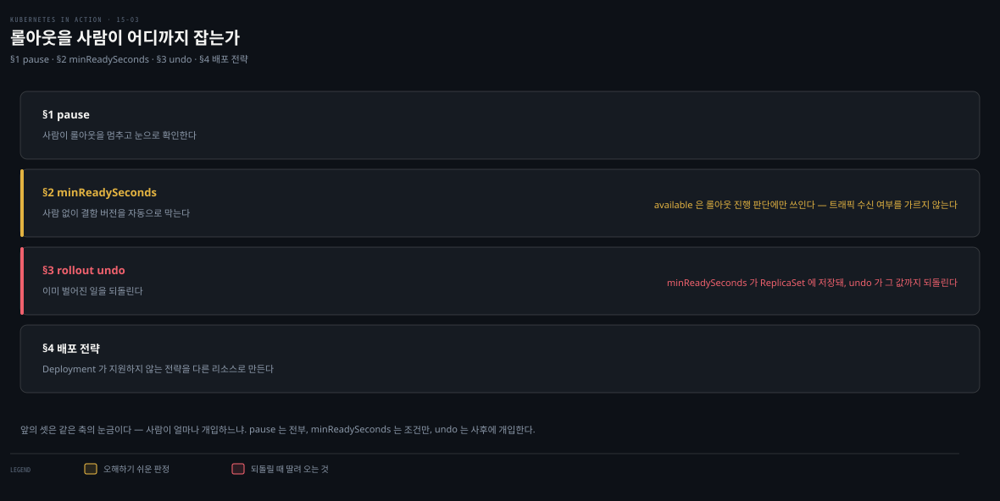

# rollout 제어와 배포 전략 — pause·faulty·rollback·전략 5종
---
> 롤링 업데이트는 완전 자동이지만, pause로 멈춰 새 버전을 확인하고, minReadySeconds+readiness probe로 결함 버전을 자동 차단하며, rollout undo로 되돌릴 수 있습니다. Deployment가 직접 지원하지 않는 Canary·Blue/Green·Shadowing은 Deployment·Service·Ingress를 조합해 구현합니다.


> 이 문서를 읽고 나면 rollout을 멈추고 되돌리는 명령을 구분해 쓰고, minReadySeconds가 결함 버전을 어떻게 막는지 근거를 대며, 다섯 배포 전략이 쿠버네티스에서 어떻게 구현되는지 설명할 수 있습니다.


## 진입 — 자동 업데이트를 제어하기

> [15-02](./15-02.Deployment%20%EC%97%85%EB%8D%B0%EC%9D%B4%ED%8A%B8%20%E2%80%94%20Recreate%C2%B7RollingUpdate%C2%B7maxSurge.md)의 롤링 업데이트는 시작하면 끝까지 자동으로 진행됩니다. 이 편은 그 과정을 멈추고·검증하고·되돌리는 제어와, 네이티브가 아닌 배포 전략의 구현을 다룹니다.

롤링 업데이트는 Pod 템플릿을 바꾸면 시작해 모든 파드가 교체될 때까지 멈추지 않습니다. 하지만 언제든 멈출 수 있습니다 — 두 버전이 동시에 도는 동안 동작을 확인하거나, 첫 새 파드가 기대대로인지 보고 나서 나머지를 교체하려 할 때입니다.

아래는 이 편 전체를 한 장으로 이은 지도입니다. 네 단계가 세로로 이어지지만 파이프라인은 아닙니다. 자동으로 흐르는 롤아웃에 개입하는 방법을 **수동에서 자동으로, 진행 중 개입에서 사후 복구로** 옮겨 가며 늘어놓은 것입니다. 각 상자 오른쪽의 절 번호가 본문에서 그 부분을 다루는 곳입니다.

- §1 pause — 사람이 롤아웃을 멈추고 눈으로 확인합니다
- §2 minReadySeconds — 사람 없이 결함 버전을 자동으로 막습니다
- §3 rollout undo — 이미 벌어진 일을 되돌립니다
- §4 배포 전략 — Deployment가 지원하지 않는 전략을 다른 리소스로 만듭니다

색이 붙은 곳은 두 군데뿐이고 둘 다 이 편에서 오해하기 쉬운 지점입니다. 나머지 상자는 전부 같은 회색이라 색을 해석할 일이 없습니다. 앰버 띠는 available이 롤아웃 진행 판단에만 쓰일 뿐 트래픽을 받느냐를 가르지 않는다는 뜻이고, 붉은 띠는 `minReadySeconds`가 ReplicaSet에 저장되는 탓에 undo가 그 값까지 되돌린다는 뜻입니다.




## 1. rollout 일시정지 — pause / resume

> pause는 spec의 paused를 true로 만들어, 컨트롤러가 ReplicaSet을 바꾸기 전에 이 필드를 확인해 멈춥니다. 웹 앱은 두 버전이 섞여 리소스별로 버전이 갈릴 수 있습니다.

```bash
kubectl rollout pause deployment kiada    # 중간에 멈춤
kubectl rollout resume deployment kiada   # 재개
```

pause는 Deployment spec의 `paused` 필드를 true로 만들고, 컨트롤러는 ReplicaSet을 바꾸기 전 이 필드를 확인합니다.

### 웹 앱에서 주의할 점

첫 파드가 교체된 시점에 pause하고 웹으로 접근하면, 브라우저가 리소스마다 다른 버전을 받습니다 — HTML은 0.7, CSS는 0.6처럼 요청이 옛/새 파드로 나뉘기 때문입니다. Kiada는 CSS·JS·이미지에 큰 변화가 없어 문제없지만, 그렇지 않으면 HTML이 잘못 렌더될 수 있습니다.

막으려면 session affinity를 쓰거나 **2단계로 업데이트**합니다 — 먼저 하위 호환을 지키며 CSS 등 리소스를 배포하고, 완전히 롤아웃한 뒤 HTML 변경 버전을 배포합니다. 또는 Blue/Green 전략을 씁니다(아래).

### 업데이트 차단 용도

pause는 Deployment 변경이 곧바로 업데이트를 트리거하는 것도 막습니다 — 여러 변경을 모아 두었다가, 준비되면 resume해 한 번에 시작할 수 있습니다.


## 2. 결함 버전 자동 차단 — minReadySeconds

> pause로 수동 확인하는 대신, minReadySeconds와 readiness probe를 조합하면 결함 버전을 자동으로 막습니다. 파드가 일정 시간 ready를 유지해야 available로 쳐, 롤아웃이 멈춥니다.

### 파드 available의 의미

`kubectl get deploy`는 ready와 available을 따로 보여줍니다. ready여도 available은 아닐 수 있습니다 — 파드가 available로 쳐지려면 **일정 시간 동안 ready를 유지**해야 하고, 그 시간이 `minReadySeconds`입니다.

```bash
kubectl get deploy kiada
# NAME    READY   UP-TO-DATE   AVAILABLE   AGE
# kiada   3/3     1            2           50m     # 3개 ready, 2개만 available
```

> **잠깐 — 답을 보기 전에.** 위 출력에서 ready지만 아직 available이 아닌 파드가 하나 있습니다. 이 파드는 Service를 통해 클라이언트 요청을 **받고 있을까요, 안 받고 있을까요?** 근거까지 스스로 정한 뒤 아래를 읽습니다.

> **주의.** ready지만 아직 available이 아닌 파드도 서비스에 포함되어 클라이언트 요청을 받습니다. 
>
> EndpointSlice 컨트롤러가 엔드포인트를 serving 으로 표시하는 기준이 파드의 **Ready condition** 이라서 그렇습니다 — `minReadySeconds` 나 available 여부는 여기에 관여하지 않습니다.[^endpoint-ready] 즉 available 은 *롤아웃 진행 판단* 에만 쓰이는 개념이지, 트래픽을 받느냐를 가르는 기준이 아닙니다.
>
> 두 개념은 보는 주체가 다릅니다. **ready 는 EndpointSlice 컨트롤러가 보고 트래픽 여부를 정하며, available 은 Deployment 컨트롤러가 보고 롤아웃 진행 여부를 정합니다.**

### minReadySeconds가 에어백이 되는 원리

롤링 업데이트에서 컨트롤러는 새 파드가 available이 될 때까지 다음 단계를 기다립니다. 기본은 ready면 곧 available이지만, `minReadySeconds`를 주면 ready 후 그 시간이 지나야 available입니다. 이 시간 동안 컨테이너가 크래시하거나 readiness probe에 실패하면 **타이머가 리셋**됩니다.

결함 버전(0.8, 시작 후 일정 시간 뒤 500을 반환)으로 시험합니다.

```yaml
spec:
  strategy:
    type: RollingUpdate
    rollingUpdate:
      maxSurge: 0
      maxUnavailable: 1
  minReadySeconds: 60          # ready 후 60초 유지해야 available
  template:
    spec:
      containers:
      - name: kiada
        image: luksa/kiada:0.8
        env:
        - name: FAIL_AFTER_SECONDS
          value: "30"          # 시작 30초 뒤 실패
        readinessProbe:
          periodSeconds: 10    # 10초마다 검사
          failureThreshold: 1
          httpGet: { port: 8080, path: /healthz/ready }
```

- `minReadySeconds` 60, `FAIL_AFTER_SECONDS` 30, probe 10초입니다. 첫 파드는 30초간 잘 돌아 ready·트래픽을 받지만, 30초 뒤 요청과 probe가 실패합니다. 
- 파드는 not ready가 되고 minReadySeconds 때문에 available이 된 적이 없어, **롤아웃이 멈춥니다**. 옛 버전이 계속 트래픽을 처리해 피해가 최소화됩니다.

minReadySeconds가 없었다면 새 파드가 즉시 available로 쳐져 모든 옛 파드가 교체되고, 곧 전부 실패해 **완전한 서비스 중단**이 됐을 것입니다. minReadySeconds는 테스트를 통과한 결함이 프로덕션에 새어 들어와도 막아 주는 **에어백**입니다 — 단점은 롤아웃 전체가 느려진다는 것입니다.

다만 피해가 0이 되지는 않습니다. 첫 파드는 이미 교체됐습니다. 앞의 주의에서 본 것처럼 이 파드는 ready인 동안 실제 요청을 받습니다. 결함이 드러나는 30초부터 readiness probe가 실패를 감지하기까지의 구간에서는 클라이언트가 500을 받습니다.

그래서 두 장치의 역할이 갈립니다.

- **readiness probe** — 감지 지연을 줄여 피해가 지속되는 *시간*을 깎습니다
- **minReadySeconds** — 결함 파드가 늘어나는 것을 막아 피해를 입는 *비율*을 고정합니다

에어백이 사고 자체가 아니라 사고의 확산을 막는 것과 같습니다.

### 롤아웃 진행 여부 — ProgressDeadlineExceeded

Deployment는 `Progressing` condition으로 진행 여부를 알립니다. **10분간 진행이 없으면** 이 condition이 false·reason `ProgressDeadlineExceeded`가 됩니다. 이 10분은 `spec.progressDeadlineSeconds`의 기본값 600초입니다.[^progress-deadline]

```bash
kubectl describe deploy kiada
# Available      True    MinimumReplicasAvailable
# Progressing    False   ProgressDeadlineExceeded    # 진행 멈춤
```

`kubectl rollout status`도 이 시점에 에러를 내고 종료합니다. 쿠버네티스는 이를 보고만 하고 별도 조치는 하지 않습니다 — 파드가 다시 ready가 되어 minReadySeconds를 채우면 롤아웃이 이어지고, 아니면 그냥 멈춰 있습니다.

> **주의.** `spec.progressDeadlineSeconds`로 기한을 바꿉니다. minReadySeconds를 600 이상으로 올리면 progressDeadlineSeconds도 그에 맞춰 올려야 합니다.


## 3. 롤백 — rollout undo

> 업데이트가 실패하면 이전 매니페스트를 재적용하거나 rollout undo로 되돌립니다. revision은 ReplicaSet으로 저장되며, undo가 되돌리는 범위도 딱 거기까지입니다 — apply는 매니페스트의 모든 필드를 덮어씁니다.

```bash
kubectl rollout undo deployment kiada                 # 직전 버전으로
kubectl rollout undo deployment kiada --to-revision=1 # 특정 revision으로
```

- undo는 일반 업데이트와 같은 단계를 따르며, Deployment의 전략을 존중합니다(RollingUpdate면 점진적 롤백). 롤아웃 진행 중엔 취소, 완료 후엔 되돌리기로 씁니다. 
- pause 상태에서는 resume하기 전까지 undo가 아무 일도 하지 않습니다 — 공식 문서의 표현으로는 "resume 하기 전까지 paused Deployment 를 롤백할 수 없다"입니다.[^undo-template-only]

### revision은 ReplicaSet에 저장된다


revision 히스토리는 Deployment 오브젝트가 아니라 **연관된 ReplicaSet들**로 표현됩니다. 각 ReplicaSet이 한 revision입니다 — 업데이트 후에도 옛 ReplicaSet을 지우지 않는 이유입니다.

```bash
kubectl rollout history deploy kiada              # REVISION 목록(CHANGE-CAUSE는 비어 있음)
kubectl rollout history deploy kiada --revision 2 # 특정 revision 상세
```

- `history`의 CHANGE-CAUSE는 `--record` 옵션(deprecated)이 없으면 비어 있어 거의 쓸모없습니다. 
- 이미지 태그를 보려면 `kubectl get rs -o wide`가 **더 낫습니다** — revision 번호는 ReplicaSet annotation에 있습니다.

> **주의.** 유지되는 revision(ReplicaSet) 수는 `revisionHistoryLimit`으로 정하며 기본 10입니다.[^revision-limit]

### undo와 apply의 차이

`rollout undo`가 이전 매니페스트를 apply하는 것과 같다고 생각하기 쉽지만 다릅니다. **undo는 Pod 템플릿만 되돌리고** 전략·replicas 등 다른 변경은 보존합니다. **apply는 그 변경까지 덮어씁니다.**

이 차이는 revision 이 저장되는 방식에서 그대로 따라 나옵니다. revision 은 ReplicaSet 이고, **undo 가 되돌릴 수 있는 범위는 ReplicaSet 에 저장된 것까지**입니다. `strategy`·`paused`·`progressDeadlineSeconds`·`revisionHistoryLimit` 은 ReplicaSet 에 필드 자체가 없어 revision 에 남지 않습니다.[^undo-template-only]

그래서 "보존된다"는 말은 undo 가 배려해 주는 기능이 아니라, **옛 값이 어디에도 저장돼 있지 않은 데서 오는 귀결**입니다. 되돌릴 자료가 없으니 건드릴 수도 없는 것입니다.

> **주의 — "Pod 템플릿만"은 조금 좁은 표현입니다.** `minReadySeconds` 는 Deployment 뿐 아니라 **ReplicaSet 에도 있는 필드**라 revision 에 함께 스냅샷됩니다.[^undo-template-only] 즉 undo 대상에 포함됩니다. 
>
> - 공식 문서가 "only the Deployment's Pod template part is rolled back" 이라고 적는 것은 *새 revision 을 만드는 트리거가 Pod 템플릿 변경뿐* 이라는 맥락에서의 서술이고, ReplicaSet 이 실제로 들고 있는 필드는 그보다 조금 넓습니다. 
> - §2 에서 `minReadySeconds` 로 결함 버전을 막아 두었다면, undo 후 그 값이 그대로 남아 있으리라 가정하지 않는 편이 안전합니다.

같은 이유로 스케일은 revision 을 만들지 않습니다. 복제본 수를 바꿔도 Pod 템플릿이 그대로라 새 revision 이 생기지 않고, 덕분에 수동 스케일이나 오토스케일러가 롤아웃 이력을 오염시키지 않습니다.[^undo-template-only]

> **회상 — undo 후에도 안전한가.** `minReadySeconds` 가 revision 에 스냅샷된다는 사실에서 함정 하나가 따라 나옵니다. 
>
> revision 1(`0.7`)을 만들 당시에는 `minReadySeconds` 가 없었고, 그 뒤에 운영자가 60을 추가했으며, revision 2(`0.8`) 배포가 실패해 `rollout undo` 로 되돌렸다고 합시다. 이때 `minReadySeconds` 는 어떤 값이 되며, 그것이 왜 위험한가요? §면접 6번에서 다시 묻습니다.

### restart

`kubectl rollout restart deployment kiada`는 Deployment의 모든 파드를 전략에 따라 삭제·재생성합니다(RollingUpdate면 무중단, Recreate면 동시).


## 4. 다섯 배포 전략

> Recreate·RollingUpdate만 Deployment 컨트롤러가 직접 지원하고, Canary는 부분 지원입니다. A/B·Blue/Green·Shadowing은 Deployment·Service·Ingress를 조합하거나 Flagger·Argo Rollouts로 자동화합니다.

| 전략 | 설명 | 네이티브 |
|------|------|---------|
| Recreate | 옛 버전 전부 중지 후 새 버전 전부 생성 | 예 |
| RollingUpdate | 옛 파드를 점진 교체(ramped/incremental) | 예 |
| Canary | 소수 새 파드에 소량 트래픽을 보내 검증 후 전체 교체 | 부분 |
| A/B testing | 조건(위치·언어·쿠키 등)으로 일부 사용자만 새 버전에. 한 사용자는 항상 같은 버전 | 아니오 |
| Blue/Green | 새 버전을 병렬 배포, 준비되면 트래픽을 한 번에 전환, 옛 버전 삭제 | 아니오 |
| Shadowing | 새 버전에 요청을 복제해 보내되 응답은 버림(traffic mirroring/dark launch) | 아니오 |

> **회상 — 첫 파드만 오래 검증하려면.** `minReadySeconds` 는 모든 단계에 균일하게 적용돼, 파드가 10개면 10번 다 기다립니다. 실무에서 원하는 것은 보통 "첫 파드만 오래 검증하고 통과하면 나머지는 빠르게"입니다. 이 요구를 만족시킬 방법을 이 문서에서 **세 가지** 꺼내 보고, 각각이 자동인지 수동인지 구분해 봅니다. 하나는 §1 에, 둘은 아래에 있습니다.

### Canary — 부분 지원

minReadySeconds를 충분히 크게 두면 첫 새 파드가 검증될 때까지 멈춰 Canary와 비슷해집니다(차이: 모든 단계에 적용). 또는 첫 파드 생성 직후 `rollout pause`로 수동 확인 후 `resume`합니다. 또는 **Canary용 별도 Deployment**를 replica 적게 두고 같은 Service로 트래픽을 받게 하면, Service가 고르게 분산하므로 소수 파드에만 소량이 갑니다.

세 방법은 자동인지 수동인지에서 갈리고, 그 차이가 곧 제약이 됩니다.

| 방법 | 자동·수동 | 제약 |
|------|----------|------|
| `minReadySeconds` 크게 | 자동 | 모든 단계에 균일 적용 — 첫 파드만 오래 볼 수 없습니다 |
| `rollout pause` → 확인 → `resume` | 수동 | 사람이 그 시각에 붙어 있어야 합니다 |
| Canary용 별도 Deployment | 반자동 | replica 비율이 곧 트래픽 비율입니다 |

- 세 번째의 "replica 비율이 곧 트래픽 비율"은 **Service 만 썼을 때**의 한계입니다. 
- Service 는 엔드포인트를 고르게 분산할 뿐 비율을 지정받지 않으므로, 파드 10 개로는 10% 단위밖에 못 만듭니다. 1% 를 보내려면 파드가 100 개 있어야 합니다.

트래픽을 나누는 주체를 Service 위쪽으로 올리면 이 제약이 풀립니다. 다만 무엇을 올리느냐에 따라 표준인지 벤더 확장인지가 갈립니다.

| 분할 주체 | 비율 제어 | 표준 여부 |
|----------|----------|----------|
| Service (replica 수) | replica 단위 | 표준 리소스만으로 됩니다 |
| Ingress | 세밀 | 표준 스펙에 없습니다 — 컨트롤러별 어노테이션[^ingress-no-split] |
| Gateway API HTTPRoute | 세밀 | `backendRefs` 의 `weight` 가 **Core** 필드[^httproute-weight] |

Ingress 표준 스펙이 정하는 것은 호스트·경로 기반 라우팅까지입니다. 가중 분할은 구현체가 어노테이션으로 얹는 확장이라, 컨트롤러를 바꾸면 설정이 통째로 달라집니다.

Gateway API 는 이 확장을 스펙 안으로 들여왔습니다. `weight` 는 자기 값을 전체 weight 합으로 나눈 비율만큼 요청을 받으므로, `9` 와 `1` 을 주면 90% 대 10% 가 됩니다. [13-02 의 HTTPRoute](./13-02.HTTPRoute%20%E2%80%94%20%EB%9D%BC%EC%9A%B0%ED%8C%85%EA%B3%BC%20%ED%95%84%ED%84%B0.md) 가 이 `weight` 로 카나리를 나누는 예를 다룹니다.

정리하면 Canary 의 "부분 지원"은 두 층으로 갈립니다. **Deployment 컨트롤러가 지원하지 않는다는 뜻이지, 세밀한 카나리가 불가능하다는 뜻은 아닙니다.**

다만 그 순간부터 Deployment·Service 만으로는 안 되고 Gateway API 나 service mesh 가 필요합니다.
자동 쪽은 사람 없이 돌지만 판단 기준이 readiness probe 하나뿐이라, probe를 통과하는 결함(응답은 200인데 값이 틀리거나 지연이 늘어나는 경우)은 잡지 못합니다. 아래 자동화 도구들이 존재하는 이유가 여기에 있습니다 — 판단 기준을 probe의 이분법에서 에러율·지연 같은 메트릭으로 옮깁니다.

같은 label selector 를 정반대로 쓴다는 점에서 Canary 와 Blue/Green 은 짝을 이룹니다. **Canary 는 두 Deployment 에 같은 라벨을 줘 한 Service 가 둘 다 잡게 하고(비율은 replica 수로 조절), Blue/Green 은 다른 라벨을 줘 한 번에 한 쪽만 잡히게 합니다(전환은 selector 변경).**

### A/B — 2 Deployment + Ingress 조건

조건(위치·언어·user agent·쿠키·헤더)으로 특정 사용자만 새 버전에 보내려면, Deployment·Service를 둘씩 만들고 Ingress가 조건에 따라 한 Service로 라우팅하게 합니다. 쿠버네티스 네이티브는 없지만 일부 Ingress 구현이 지원합니다.

### Blue/Green — Service selector 전환


Green Deployment를 Blue 옆에 만듭니다. Service는 처음에 Blue만 가리키다가, 전환 시점에 **label selector**를 Green으로 바꿉니다. 두 그룹이 서로 다른 label을 쓰므로 selector는 한 번에 한 그룹만 매칭합니다.

`strategy.type`에 Blue/Green을 적을 수는 없으니 Deployment 컨트롤러의 네이티브 전략은 아닙니다. 그래도 [Service label selector](./11-01.Service%20%EA%B8%B0%EC%B4%88%20%E2%80%94%20%ED%8C%8C%EB%93%9C%20%ED%86%B5%EC%8B%A0%C2%B7ClusterIP%C2%B7%EC%84%B8%EC%85%98%20%EC%96%B4%ED%94%BC%EB%8B%88%ED%8B%B0.md)를 바꾸는 것만으로 되어 추가 도구는 필요 없습니다.

### Shadowing — mirror

새 버전을 옛 버전 옆에 배포하되 label을 Service selector와 안 맞게 두고, Ingress/프록시가 옛 파드로 트래픽을 보내면서 새 파드로도 **미러링**합니다. 프록시는 옛 파드 응답만 클라이언트에 주고 새 파드 응답은 버립니다. [13-02 HTTPRoute의 RequestMirror](./13-02.HTTPRoute%20%E2%80%94%20%EB%9D%BC%EC%9A%B0%ED%8C%85%EA%B3%BC%20%ED%95%84%ED%84%B0.md)가 이 미러링을 Gateway API로 구현한 예입니다.

### 자동화 도구

A/B·Blue/Green·Shadowing은 상위 컨트롤러로 자동화할 수 있습니다 — 쿠버네티스는 제공하지 않지만 [Flagger](https://github.com/fluxcd/flagger)·[Argo Rollouts](https://argoproj.github.io/argo-rollouts)가 있습니다. Istio 같은 service mesh로 트래픽 분할을 세밀하게 제어하는 방법은 [Istio 트래픽 관리](../../service-mesh/03_istio/04-01.Istio%20%ED%8A%B8%EB%9E%98%ED%94%BD%20%EA%B4%80%EB%A6%AC.md)를 참고합니다.

> **Spring 관점.** Boot 앱의 Canary는 minReadySeconds+Actuator readiness probe로 "새 버전이 1시간 무사고면 계속"을 자동화하고, Blue/Green은 Service selector 전환으로 즉시 롤백 가능한 무중단 전환을 얻습니다. 결함 버전 자동 차단은 probe 정확도에 달렸으니, `/actuator/health/readiness`가 DB·외부 의존까지 정확히 반영하게 구성해야 에어백이 실제로 작동합니다.


## 면접에서 받을 만한 질문

> 아래 질문에 먼저 스스로 답해 본 뒤, 챕터 끝의 정답과 맞춰 봅니다.

1. rollout pause는 무엇을 하나요? 웹 앱을 롤링 업데이트할 때 주의할 점은 무엇인가요?
2. 파드가 ready인 것과 available인 것은 어떻게 다른가요? minReadySeconds가 결함 버전을 어떻게 막나요?
3. ProgressDeadlineExceeded는 언제 발생하나요? 이때 쿠버네티스는 무엇을 하나요?
4. rollout undo와 이전 매니페스트를 apply하는 것은 어떻게 다른가요? revision은 어디에 저장되나요?
5. Blue/Green과 Shadowing은 각각 어떻게 구현하나요? 쿠버네티스가 직접 지원하나요?
6. `minReadySeconds: 60`으로 운영하던 Deployment를 `rollout undo`로 되돌렸습니다. 이 Deployment는 여전히 안전한가요? 무엇을 확인해야 하나요?


## 정답 (자답 후 펼치기)

> 위 질문에 답해 본 다음 아래와 맞춰 봅니다. 순서는 질문과 1:1로 대응합니다.

### 정답 1 — pause와 웹 앱 주의점

`rollout pause`는 Deployment spec의 `paused` 필드를 true로 만들어, 컨트롤러가 ReplicaSet을 바꾸기 전 이를 확인해 롤아웃을 멈춥니다. 웹 앱에서 두 버전이 도는 동안 pause하면, 브라우저가 리소스마다 다른 버전을 받아(HTML은 새 버전, CSS는 옛 버전) 렌더가 깨질 수 있습니다. 막으려면 session affinity를 쓰거나, 하위 호환 리소스를 먼저 배포하고 HTML을 나중에 배포하는 2단계 업데이트, 또는 Blue/Green을 씁니다.

### 정답 2 — ready vs available과 결함 차단

ready는 파드가 요청을 받을 준비가 된 상태입니다. available은 그 ready를 **minReadySeconds만큼 유지**한 상태입니다.

minReadySeconds가 결함 버전을 막는 원리는 타이머 리셋에 있습니다. 새 파드가 ready가 되어도 그 시간 안에 크래시하거나 probe에 실패하면 타이머가 처음으로 돌아갑니다. 그러면 파드는 available이 되지 못합니다. 컨트롤러는 available을 기다리므로 롤아웃이 그 자리에서 멈춥니다. 결함 버전이 30초 뒤 실패하면 60초 minReadySeconds를 영영 못 채워, 첫 파드에서 롤아웃이 정지하고 피해가 최소화됩니다.

### 정답 3 — ProgressDeadlineExceeded

Deployment의 `Progressing` condition이 **10분간 진행이 없으면** false·reason `ProgressDeadlineExceeded`가 됩니다. 기한은 `spec.progressDeadlineSeconds`로 조정하며, minReadySeconds가 600 이상이면 함께 올려야 합니다.

이때 쿠버네티스는 롤아웃이 멈췄다고 보고만 하고 별도 조치는 하지 않습니다. 파드가 다시 ready가 되어 minReadySeconds를 채우면 롤아웃이 이어지고, 아니면 그냥 멈춰 있습니다. 취소하려면 rollout undo를 씁니다.

### 정답 4 — undo vs apply, revision 저장 위치

`rollout undo`가 되돌리는 범위는 **revision, 곧 ReplicaSet에 저장된 것까지**입니다. Pod 템플릿과 `minReadySeconds`가 여기 들어갑니다. `strategy`·`progressDeadlineSeconds`처럼 ReplicaSet에 필드가 없는 값은 되돌릴 자료가 없어 현재 값이 그대로 남습니다. 보존은 undo가 배려해 주는 기능이 아니라 저장 범위의 귀결입니다.

반면 이전 매니페스트를 `apply`하면 매니페스트에 적힌 모든 필드가 현재 값을 덮어씁니다.

revision은 Deployment 오브젝트가 아니라 **연관된 ReplicaSet들**에 저장됩니다. 각 ReplicaSet이 하나의 revision이라, 업데이트 후에도 옛 ReplicaSet을 지우지 않습니다. 유지되는 수는 `revisionHistoryLimit`이며 기본 10입니다.

### 정답 5 — Blue/Green과 Shadowing 구현

Blue/Green은 Green Deployment를 Blue 옆에 만들고 **Service의 label selector**를 Blue에서 Green으로 바꿔 트래픽을 한 번에 전환합니다. 둘 다 Deployment 컨트롤러의 **네이티브 전략은 아닙니다** — `strategy.type`에 적을 수 있는 값은 Recreate와 RollingUpdate 둘뿐입니다. 다만 구현 난이도는 갈립니다. Blue/Green은 Service label selector 전환만으로 되어 **추가 도구가 필요 없고**, Shadowing은 그렇지 않습니다.

Shadowing은 새 버전을 배포하되 Service selector와 안 맞는 label을 주고, Ingress/프록시가 옛 파드로 보내면서 새 파드로 **미러링**(응답은 버림)합니다. 트래픽 복제를 해 주는 주체가 따로 있어야 하므로 일부 Ingress 구현이나 Gateway API RequestMirror가 필요합니다.

### 정답 6 — undo 후 안전 장치 점검

여전히 안전하다고 가정하면 안 됩니다. `minReadySeconds` 는 ReplicaSet 에 있는 필드라 revision 마다 스냅샷되고, 따라서 undo 로 **되돌아가는 대상**입니다. 되돌아간 revision 이 `minReadySeconds` 를 추가하기 *전* 의 것이었다면 그 값은 기본값 0 으로 돌아가, 결함 차단 장치가 조용히 풀린 상태로 운영이 이어집니다.

이 함정이 위험한 이유는 확률이 높아서가 아니라 **드러나지 않아서**입니다. `kubectl get deploy` 출력에는 나타나지 않고 롤아웃도 정상 완료되므로, 다음 배포에서 결함이 새어 나갈 때까지 아무도 모릅니다. 게다가 그 다음 배포는 방금 사고를 수습한 직후라 급하게 진행되기 쉽습니다 — 에어백이 필요한 바로 그 시점에 없는 셈입니다.

그래서 `undo` 는 응급 조치로만 쓰고, 상황이 안정되면 매니페스트를 재적용해 선언 상태와 맞춥니다. 확인은 `kubectl get deploy kiada -o yaml` 에서 `minReadySeconds` 값을 보는 것으로 끝납니다. 근본 원인은 §3 의 통찰과 같습니다 — undo 의 동작은 설계된 배려가 아니라 **저장 구조의 귀결**이므로, ReplicaSet 이 어떤 필드를 들고 있는지 알면 이런 경우는 추론으로 나옵니다.


## 관련 문서

> 이 편은 15장 Deployment를 rollout 제어·롤백·배포 전략으로 마무리하고, 상태 있는 워크로드를 위한 16장 StatefulSet으로 이어집니다.

- [15-01. Deployment 기초 — 생성·pod-template-hash·스케일링](./15-01.Deployment%20%EA%B8%B0%EC%B4%88%20%E2%80%94%20%EC%83%9D%EC%84%B1%C2%B7pod-template-hash%C2%B7%EC%8A%A4%EC%BC%80%EC%9D%BC%EB%A7%81.md) — Deploy↔RS↔pod·pod-template-hash
- [15-02. Deployment 업데이트 — Recreate·RollingUpdate·maxSurge](./15-02.Deployment%20%EC%97%85%EB%8D%B0%EC%9D%B4%ED%8A%B8%20%E2%80%94%20Recreate%C2%B7RollingUpdate%C2%B7maxSurge.md) — 업데이트 전략·교체 속도(앞 편)
- [16-01. StatefulSet 기초 — Pets vs Cattle·ordinal·headless Service](./16-01.StatefulSet%20%EA%B8%B0%EC%B4%88%20%E2%80%94%20Pets%20vs%20Cattle%C2%B7ordinal%C2%B7headless%20Service.md) — 상태 있는 워크로드(다음 장)
- [13-02. HTTPRoute — 라우팅과 필터](./13-02.HTTPRoute%20%E2%80%94%20%EB%9D%BC%EC%9A%B0%ED%8C%85%EA%B3%BC%20%ED%95%84%ED%84%B0.md) — RequestMirror(Shadowing 구현)
- [11-01. Service 기초 — 파드 통신·ClusterIP·세션 어피니티](./11-01.Service%20%EA%B8%B0%EC%B4%88%20%E2%80%94%20%ED%8C%8C%EB%93%9C%20%ED%86%B5%EC%8B%A0%C2%B7ClusterIP%C2%B7%EC%84%B8%EC%85%98%20%EC%96%B4%ED%94%BC%EB%8B%88%ED%8B%B0.md) — label selector(Blue/Green 전환)
- [Istio 트래픽 관리](../../service-mesh/03_istio/04-01.Istio%20%ED%8A%B8%EB%9E%98%ED%94%BD%20%EA%B4%80%EB%A6%AC.md) — service mesh로 Canary·트래픽 분할 세밀 제어
- [핵심 워크로드](../../kubernetes/01_workloads/01-01.%ED%95%B5%EC%8B%AC%20%EC%9B%8C%ED%81%AC%EB%A1%9C%EB%93%9C.md) — Deployment·rollback·배포 전략 통합 개념본
- 원서: 《Kubernetes in Action, 2nd Ed.》 Ch15 §15.2.4~15.3 — [Manning](https://www.manning.com/books/kubernetes-in-action-second-edition), [예제 코드](https://github.com/luksa/kubernetes-in-action-2nd-edition/tree/master/Chapter15)
- 공식 문서: [Rolling back a Deployment](https://kubernetes.io/docs/concepts/workloads/controllers/deployment/#rolling-back-a-deployment)
- 공식 API 레퍼런스: [Deployment v1 — DeploymentSpec](https://kubernetes.io/docs/reference/kubernetes-api/workload-resources/deployment-v1/) — progressDeadlineSeconds·revisionHistoryLimit 기본값
- 공식 API 레퍼런스: [EndpointSlice v1 — EndpointConditions](https://kubernetes.io/docs/reference/kubernetes-api/service-resources/endpoint-slice-v1/) — serving 판정 기준이 파드 Ready condition

[^progress-deadline]: Kubernetes 공식 API 레퍼런스, [Deployment v1 — DeploymentSpec](https://kubernetes.io/docs/reference/kubernetes-api/workload-resources/deployment-v1/) (2026-08-10 조회, `kubectl explain deployment.spec.progressDeadlineSeconds` 로 대조). 원문은 "Note that progress will not be estimated during the time a deployment is paused. **Defaults to 600s**."입니다. pause 중에는 진행이 평가되지 않는다는 단서가 같은 문단에 붙어 있습니다.

[^revision-limit]: Kubernetes 공식 API 레퍼런스, [Deployment v1 — DeploymentSpec](https://kubernetes.io/docs/reference/kubernetes-api/workload-resources/deployment-v1/) (2026-08-10 조회). 원문은 "The number of old ReplicaSets to retain to allow rollback. ... **Defaults to 10**."입니다.

[^endpoint-ready]: Kubernetes 공식 API 레퍼런스, [EndpointSlice v1 — EndpointConditions](https://kubernetes.io/docs/reference/kubernetes-api/service-resources/endpoint-slice-v1/) (2026-08-10 조회, `kubectl explain endpointslice.endpoints.conditions.serving` 로 대조). 원문은 "For endpoints backed by pods, the EndpointSlice controller will mark the endpoint as serving if the **pod's Ready condition is True**."입니다. `minReadySeconds` 나 available 은 이 판정에 등장하지 않습니다.

[^undo-template-only]: Kubernetes 공식 문서, [Deployment — Rolling Back a Deployment](https://kubernetes.io/docs/concepts/workloads/controllers/deployment/#rolling-back-a-deployment) (2026-08-10 조회, 문서 소스 `deployment.md` L386~390). 원문은 "a new revision is created if and only if the Deployment's Pod template (`.spec.template`) is changed" 이며, 이어 "**only the Deployment's Pod template part is rolled back**" 이라고 적습니다. 스케일이 revision 을 만들지 않는다는 서술도 같은 문단에 있습니다. 다만 ReplicaSet 이 실제로 보유한 필드는 넷입니다. `kubectl explain replicaset.spec` 기준 `minReadySeconds`·`replicas`·`selector`·`template` 이라 `minReadySeconds` 도 revision 에 남습니다. `strategy` 는 `kubectl explain replicaset.spec.strategy` 가 `error: field "strategy" does not exist` 로 답합니다(2026-08-10 실측). pause 중 롤백 불가는 같은 문서의 "You cannot rollback a paused Deployment until you resume it."(L861)입니다. `--record` deprecated 는 "This flag is deprecated and will be removed in a future release."(L525)입니다.

[^ingress-no-split]: Kubernetes 공식 문서, [Ingress](https://kubernetes.io/docs/concepts/services-networking/ingress/) (2026-08-11 조회). Ingress 규칙이 정하는 것은 호스트와 경로까지이며, 가중 분할에 해당하는 필드가 스펙에 없습니다. 그런 기능이 구현체별 어노테이션 영역이라는 것은 같은 문서의 "Ingress controllers frequently use annotations to configure behavior."에서 확인됩니다.

[^httproute-weight]: Gateway API 소스, [`apis/v1/httproute_types.go`](https://github.com/kubernetes-sigs/gateway-api/blob/main/apis/v1/httproute_types.go) 의 `BackendRef.Weight` (2026-08-11 조회). 지원 수준은 **Core**, 기본값은 1, 범위는 0 이상 4294967295 이하입니다. 원문은 "This is computed as **weight divided by the sum of all weights in this BackendRefs list**."입니다.
