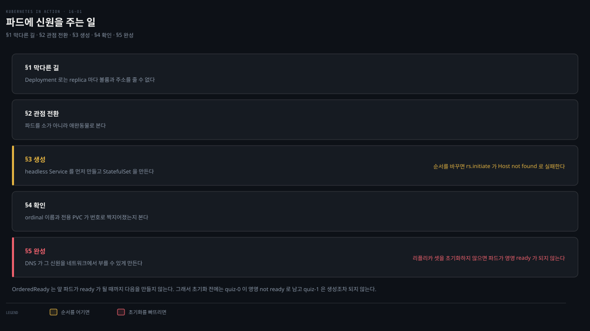
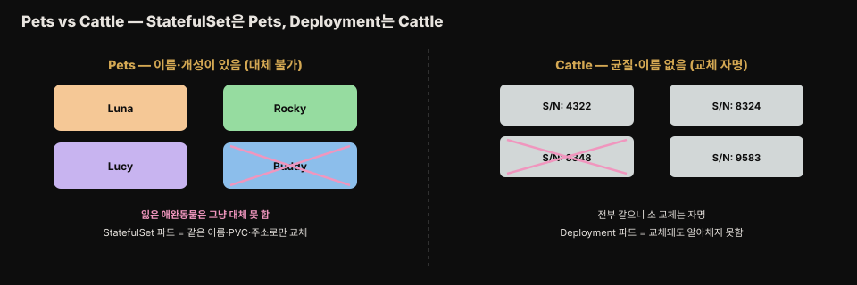
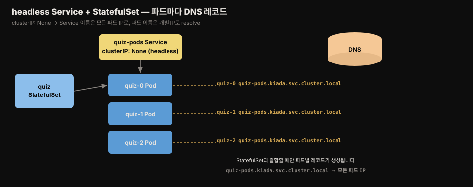

# StatefulSet 기초 — Pets vs Cattle·ordinal·headless Service
---
> StatefulSet은 상태 있는 워크로드를 위한 Deployment입니다. 각 replica에 안정된 이름(ordinal)·전용 PersistentVolumeClaim·안정된 네트워크 신원을 주어, 파드가 재생성돼도 같은 상태와 주소를 유지하게 합니다. headless Service가 파드마다 DNS 레코드를 붙여 이 신원을 완성합니다.


> 이 문서를 읽고 나면 상태 있는 워크로드가 왜 Deployment로 다루기 어려운지 설명하고, Pets vs Cattle 비유로 StatefulSet과 Deployment의 차이를 말하며, headless Service·ordinal·PVC 템플릿이 어떻게 안정된 신원을 만드는지 근거를 댈 수 있습니다.


## 진입 — 왜 Deployment로는 부족한가

> Kiada suite의 세 서비스는 모두 Deployment로 배포됩니다. 하지만 Quiz 서비스는 데이터 때문에 쉽게 스케일되지 않아 replica가 하나뿐입니다. 이 편은 그런 상태 있는 워크로드를 StatefulSet으로 제대로 배포하는 법을 다룹니다.

상태 있는(stateful) 워크로드는 동작하려면 상태를 저장·유지해야 하는 소프트웨어입니다. 이 상태는 워크로드가 재시작되거나 다른 노드로 옮겨질 때도 유지되어야 해서, 운영이 훨씬 까다롭습니다. 스케일도 어렵습니다 — replica를 그냥 늘리고 줄일 수 없고, 각자의 상태를 고려해야 하기 때문입니다.

아래는 이 편 전체를 한 장으로 이은 지도입니다. 다섯 단계가 세로로 이어지는 파이프라인이고, 앞 단계의 결과가 다음 단계의 재료가 됩니다. 각 상자 오른쪽의 절 번호가 본문에서 그 부분을 다루는 곳입니다.

- §1 막다른 길 — Deployment로는 replica마다 볼륨과 주소를 줄 수 없습니다
- §2 관점 전환 — 파드를 소가 아니라 애완동물로 봅니다
- §3 생성 — headless Service를 먼저 만들고 StatefulSet을 만듭니다
- §4 확인 — ordinal 이름과 전용 PVC가 번호로 짝지어졌는지 봅니다
- §5 완성 — DNS가 그 신원을 네트워크에서 부를 수 있게 만듭니다

색이 붙은 곳은 두 군데뿐이고 둘 다 경고입니다. 나머지 상자는 전부 같은 회색이라 색을 해석할 일이 없습니다. 앰버 띠는 headless Service를 먼저 만들지 않으면 `rs.initiate`가 `Host not found`로 실패한다는 뜻이고, 붉은 띠는 MongoDB 리플리카 셋을 초기화하지 않으면 파드가 영영 ready가 되지 않는다는 뜻입니다.




## 1. 상태 있는 워크로드의 요구사항

> replica가 상태를 공유하려면 스토리지가 ReadWriteMany를 지원해야 하는데 대부분의 클라우드는 안 됩니다. 각 replica가 자기 파일에 저장하면 replica마다 별도 볼륨이 필요한데, 지금까지의 리소스로는 복잡합니다.

### 상태 공유의 벽 — ReadWriteMany

여러 파드가 데이터를 공유하려면 ReadWriteMany 접근 모드의 PersistentVolume이 필요합니다. 하지만 대부분의 클라우드 환경에서 밑단 스토리지는 ReadWriteOnce·ReadOnlyMany만 지원하고 ReadWriteMany는 지원하지 않습니다. 즉 볼륨을 여러 노드에 읽기/쓰기로 마운트할 수 없어, 다른 노드의 파드가 같은 PersistentVolume에 읽고 쓸 수 없습니다.

Quiz Deployment를 3 replica로 스케일하면 이 문제가 드러납니다.

```bash
kubectl scale deploy quiz --replicas 3
kubectl get pods -l app=quiz
# quiz-6f4968457-2c8ws   2/2   Running            0   10m    # 기존 파드만 정상
# quiz-6f4968457-cdw97   0/2   CrashLoopBackOff   ...        # 새 파드 크래시
# quiz-6f4968457-qdn29   0/2   Error              ...        # 새 파드 크래시
```

GKE에서는 ReadWriteOnce 볼륨이 여러 노드에 붙지 못해 컨테이너가 아예 안 뜨고, kind에서는 컨테이너는 뜨지만 mongo가 실패합니다.

```bash
kubectl logs quiz-6f4968457-cdw97 -c mongo
# DBPathInUse: Unable to lock the lock file: /data/db/mongod.lock ...
# Another mongod instance is already running on the /data/db directory
```

세 파드가 같은 PersistentVolumeClaim → 같은 PersistentVolume → 같은 데이터 디렉토리를 써서 충돌합니다. MongoDB는 여러 인스턴스가 같은 데이터 디렉토리를 쓸 수 없습니다.

### replica마다 전용 PV — Deployment로는 daunting

공유가 안 되니 대안은 replica마다 별도 PersistentVolume입니다. MongoDB로 여러 인스턴스에 같은 데이터를 두려면 데이터를 인스턴스 간 복제하는 **MongoDB 리플리카 셋**을 만들어야 합니다(여기서 "리플리카 셋"은 MongoDB 용어이지 쿠버네티스 ReplicaSet이 아닙니다). 각 인스턴스는 자기 스토리지 볼륨과, 다른 replica·클라이언트가 접속할 안정된 주소가 필요합니다. 즉 세 가지를 보장해야 합니다.

- 각 파드가 자기 PersistentVolume을 가진다
- 각 파드가 자기 고유 주소로 접근 가능하다
- 파드가 삭제·교체되면 새 파드가 같은 주소와 PersistentVolume을 받는다


이것을 단일 Deployment·Service로는 할 수 없고, replica마다 Deployment·Service·PVC를 따로 만들어야 합니다. replica를 늘리려면 `kubectl scale`도 못 쓰고 오브젝트 3종을 더 만들어야 해서 복잡도가 커집니다. 가능은 하지만 운영이 daunting합니다. 다행히 쿠버네티스는 단일 Service와 단일 StatefulSet으로 이를 해결합니다.


## 2. StatefulSet과 Deployment 비교 — Pets vs Cattle

> StatefulSet은 Deployment와 비슷하되 상태 워크로드에 맞춰졌습니다. 차이는 Pets vs Cattle 비유로 설명됩니다 — Deployment 파드는 소(대체 가능), StatefulSet 파드는 애완동물(같은 신원·상태로만 대체 가능)입니다.

### Pets vs Cattle

예전에는 하드웨어·워크로드를 애완동물처럼 다뤘습니다 — 서버마다 이름을 붙이고 인스턴스를 하나씩 돌봤습니다. 그런데 소 떼처럼 구별 없는 개체로 취급하면 관리가 훨씬 쉬워집니다. 농부가 소를 다루듯, 교체된 개체가 이전과 정확히 같지 않아도 걱정 없이 교체할 수 있기 때문입니다.



Deployment로 배포한 stateless 워크로드는 소와 같습니다. 파드가 교체돼도 알아채지 못합니다. stateful 워크로드는 애완동물 쪽입니다. 잃어버린 애완동물은 새것으로 그냥 대체할 수 없고, 같은 이름을 줘도 원래처럼 행동하지 않습니다.

소프트웨어 세계에서는 이야기가 조금 다릅니다. 교체 인스턴스에 같은 네트워크 신원과 같은 상태를 줄 수 있다면 대체가 성립하기 때문입니다. StatefulSet으로 배포하면 정확히 이 일이 일어납니다.

> StatefulSet은 원래 PetSet이라 불렸습니다. 이름이 이 Pets vs Cattle 비유에서 왔습니다.

### StatefulSet이 파드를 배포하는 방식

Deployment처럼 Pod 템플릿·원하는 replica 수·label selector를 지정하되, **PersistentVolumeClaim 템플릿**도 지정할 수 있습니다. 컨트롤러가 새 replica를 만들 때마다 Pod 오브젝트뿐 아니라 PersistentVolumeClaim 오브젝트도 함께 만듭니다.

StatefulSet의 파드는 서로 완전한 복제본이 아닙니다. 각 파드가 다른 PersistentVolumeClaim을 가리키기 때문입니다. 이름도 랜덤이 아닙니다. 각 파드에 고유한 **ordinal 번호**가 붙고, 각 PVC도 마찬가지입니다. ordinal은 기본적으로 0부터 replica 수 − 1까지 매겨집니다[^ordinal].

파드가 삭제·재생성되면 교체한 파드와 같은 이름을 받습니다. 그리고 특정 ordinal의 파드는 항상 같은 번호의 PVC와 짝지어집니다. 즉 특정 replica의 상태는 파드가 몇 번 재생성돼도 항상 같습니다.

또 하나 다른 점은, 기본적으로 StatefulSet 파드는 동시에 만들어지지 않는다는 것입니다. 롤링 업데이트처럼 한 번에 하나씩 만들어집니다 — 첫 파드가 ready가 될 때까지 기다린 뒤 다음을 만듭니다. 스케일다운 시 파드는 삭제되지만 PVC는 설정한 정책에 따라 보존되거나 삭제됩니다.


## 3. StatefulSet 생성 — governing headless Service 먼저

> StatefulSet마다 파드를 개별 노출하는 headless Service가 필요합니다. 이 Service가 파드에 네트워크 신원을 줍니다 — clusterIP가 없고, DNS가 Service 이름을 모든 파드 IP로, 그리고 파드 이름을 개별 IP로 해석하게 합니다.

### governing Service 생성

headless Service는 clusterIP가 없지만 label selector에 맞는 파드와 통신할 수 있습니다. 일반 Service처럼 A/AAAA 레코드 하나가 Service IP를 가리키는 대신, headless Service의 DNS 레코드는 소속 파드 전부의 IP를 가리킵니다.



StatefulSet과 결합하면 파드마다 추가 DNS 레코드가 생겨 파드 이름으로 IP를 조회할 수 있습니다. 이 레코드는 headless Service가 StatefulSet과 연결되지 않으면 존재하지 않습니다. 이 Service는 컨트롤러가 대신 만들어 주지 않고 **사용자가 직접 만들어야 합니다**[^governing-svc]. 개별 파드를 resolve하도록 `quiz-pods`라는 Service를 새로 만듭니다.

```yaml
apiVersion: v1
kind: Service
metadata:
  name: quiz-pods
spec:
  clusterIP: None                  # 이 필드가 Service를 headless로 만듦
  publishNotReadyAddresses: true   # ready 전에도 파드 DNS 레코드 생성
  selector:
    app: quiz
  ports:
  - name: mongodb    # 포트 이름을 mongodb로 → SRV 레코드가 _mongodb로 시작
    port: 27017
```

`clusterIP: None`이 headless로 만들고, `publishNotReadyAddresses: true`는 파드가 ready가 되기 전 생성 즉시 DNS 레코드를 만들어, ready 상태와 무관하게 모든 quiz 파드를 포함시킵니다.

### StatefulSet 생성

```yaml
apiVersion: apps/v1
kind: StatefulSet
metadata:
  name: quiz
spec:
  serviceName: quiz-pods          # 이 StatefulSet을 governing하는 headless Service 이름
  podManagementPolicy: Parallel   # 파드를 동시에 생성(기본은 한 번에 하나씩)
  replicas: 3
  selector:
    matchLabels:
      app: quiz                   # Pod 템플릿 label과 일치해야 함
  template:
    metadata:
      labels:
        app: quiz
        ver: "0.1"
    spec:
      volumes:
      - name: db-data
        persistentVolumeClaim:
          claimName: db-data      # PVC 이름 — volumeClaimTemplates의 name과 일치
      containers:
      - name: quiz-api
        # ...
      - name: mongo
        image: mongo:5
        command:                  # 복제 활성화 옵션
        - mongod
        - --bind_ip
        - 0.0.0.0
        - --replSet
        - quiz
        volumeMounts:
        - name: db-data
          mountPath: /data/db
  volumeClaimTemplates:           # 각 replica용 PVC를 만드는 템플릿
  - metadata:
      name: db-data               # Pod 템플릿 대신 name을 반드시 지정
      labels:
        app: quiz
    spec:
      resources:
        requests:
          storage: 1Gi
      accessModes:
      - ReadWriteOnce
```

`serviceName`에 headless Service 이름을 지정합니다. `podManagementPolicy: Parallel`은 파드를 동시에 만듭니다 — 일부 분산 앱은 동시 기동을 못 견뎌 기본은 하나씩이지만, 이 예제는 Parallel이 초기 스케일업을 단순하게 합니다. `volumeClaimTemplates`에는 replica마다 만들 PVC 템플릿을 지정합니다. Pod 템플릿과 달리 **name을 반드시 지정**해야 하고, 이 이름이 Pod 템플릿 volumes의 이름과 일치해야 합니다.


## 4. StatefulSet·파드·PVC 검사

> ordinal 이름(quiz-0·quiz-1·quiz-2), replica마다 별도 PVC(db-data-quiz-N), 파드는 StatefulSet이 직접 소유합니다. MongoDB 리플리카 셋은 rs.initiate로 한 번 초기화해야 파드가 ready가 됩니다.

### rollout status와 ready

```bash
kubectl rollout status sts quiz     # sts는 StatefulSet 약어
# Waiting for 3 pods to be ready...  ← 멈춤. Ctrl-C
kubectl get sts
# NAME   READY   AGE
# quiz   0/3     22s
kubectl get pods -l app=quiz
# quiz-0   1/2   Running   0   56s   ← ordinal 이름(hash·랜덤 아님)
# quiz-1   1/2   Running   0   56s
# quiz-2   1/2   Running   0   56s
```

각 파드 이름은 StatefulSet 이름 + ordinal 인덱스입니다. ordinal은 기본 0부터 시작하며, `spec.ordinals.start`로 커스텀 시작값을 줄 수 있습니다[^ordinal].

두 컨테이너 중 mongo는 ready지만 quiz-api는 아닙니다 — readiness probe(`/healthz/ready`)가 MongoDB에 ping을 못 해 실패하기 때문입니다. `--replSet` 옵션으로 복제를 켰지만 MongoDB 리플리카 셋을 아직 initiate하지 않아서입니다.

```bash
kubectl exec -it quiz-0 -c mongo -- mongosh --quiet --eval 'rs.initiate({
  _id: "quiz",
  members: [
    {_id: 0, host: "quiz-0.quiz-pods.kiada.svc.cluster.local:27017"},
    {_id: 1, host: "quiz-1.quiz-pods.kiada.svc.cluster.local:27017"},
    {_id: 2, host: "quiz-2.quiz-pods.kiada.svc.cluster.local:27017"}]})'
# { ok: 1 }
```

initiate가 성공하면 곧 세 파드가 모두 ready가 됩니다. `Host not found` 에러가 나면 quiz-pods Service를 미리 안 만든 것입니다.

### describe와 파드 매니페스트

`kubectl describe sts quiz`의 출력은 ReplicaSet·Deployment와 비슷하되, 가장 눈에 띄는 차이는 **PersistentVolumeClaim 템플릿**(Volume Claims 섹션)이 있다는 점입니다. 이벤트는 컨트롤러가 파드·PVC를 만들 때마다 무엇을 했는지 보여줍니다.

파드 매니페스트를 보면 StatefulSet 컨트롤러가 label 두 개를 추가합니다.

- `controller-revision-hash` — ReplicaSet의 `pod-template-hash`와 같은 역할. 파드가 어느 StatefulSet revision에 속하는지 판별
- `statefulset.kubernetes.io/pod-name` — 파드 이름. 이 label을 Service selector에 써서 특정 파드용 Service를 만들 수 있음

책이 다루는 둘 외에 `apps.kubernetes.io/pod-index`도 붙습니다. 값은 파드의 ordinal 인덱스이며, 특정 인덱스로 트래픽을 보내거나 로그·메트릭을 인덱스로 걸러 볼 때 씁니다[^pod-index].

Deployment는 파드를 ReplicaSet이 소유하고 그 ReplicaSet을 Deployment가 소유합니다. 반면 **StatefulSet은 파드를 직접 소유**합니다(ownerReferences가 StatefulSet). 복제와 업데이트를 StatefulSet이 직접 맡기 때문입니다.

파드의 volumes를 보면 템플릿의 `claimName: db-data`가 파드에서는 `db-data-quiz-0`으로 바뀌어 있습니다. 각 파드가 자기 PVC를 받기 때문입니다. 그 이름은 `volumeClaimTemplates`의 name과 파드 이름을 합친 `<템플릿명>-<파드명>` 형태입니다[^pvc-name]. 이 예제에서는 Pod 템플릿의 `claimName`과 볼륨 클레임 템플릿의 name이 둘 다 `db-data`입니다. 그래서 같아 보이지만, 이름을 만드는 쪽은 후자입니다.

### PVC 검사

```bash
kubectl get pvc -l app=quiz
# db-data-quiz-0   Bound   pvc...1bf8ccaf   1Gi   RWO   standard   10m
# db-data-quiz-1   Bound   pvc...c8f860c2   1Gi   RWO   standard   10m
# db-data-quiz-2   Bound   pvc...2cc494d6   1Gi   RWO   standard   10m
```

각 클레임은 동적 프로비저닝된 PersistentVolume에 바인딩됩니다. 이 볼륨들은 아직 비어 있습니다.


## 5. headless Service의 역할 — peer discovery

> 분산 앱은 서로를 찾는 peer discovery가 필요합니다. Kubernetes API 대신 DNS를 쓰는 편이 낫습니다 — headless Service가 파드마다 A/AAAA 레코드와 SRV 레코드를 만들어, MongoDB 클라이언트가 mongodb+srv 스킴으로 replica를 자동 조회하게 합니다.

### 개별 파드를 DNS로 노출

MongoDB 리플리카 셋에 접속하는 클라이언트는 모든 replica 주소를 알아야 primary를 찾아 쓸 수 있습니다. headless Service를 StatefulSet과 결합하면 각 파드가 자기 A/AAAA 레코드를 받아 개별 IP로 resolve됩니다.

```pseudocode
quiz-0.quiz-pods.kiada.svc.cluster.local   →   quiz-0 파드 IP
```

클러스터의 DNS 구성에 따라, 파드를 만들자마자 이 이름을 조회하면 실패할 수 있습니다. 다른 클라이언트가 파드 생성 전에 같은 이름을 물어봤다면 DNS의 negative caching이 그 실패 결과를 몇 초간 기억하기 때문입니다. 생성 직후 곧바로 파드를 찾아야 한다면 DNS 대신 API를 watch하거나, CoreDNS의 캐시 시간(공식 문서 작성 시점 기준 30초)을 줄입니다[^dns-cache].

### SRV 레코드로 주소·포트 자동 조회

각 stateful 파드는 A/AAAA 외에 SRV 레코드도 받습니다. MongoDB 클라이언트가 이것으로 각 파드의 주소·포트를 조회해 수동 지정을 피합니다. MongoDB는 SRV 레코드가 `_mongodb`로 시작하길 기대하므로, Service 정의의 포트 이름을 `mongodb`로 둬야 합니다.

```pseudocode
_mongodb._tcp.quiz-pods.kiada.svc.cluster.local
```

이 덕에 연결 문자열이 replica 수와 무관하게 단순해집니다 — `mongodb+srv` 스킴이 클라이언트에게 SRV 조회로 주소를 찾으라고 지시합니다.

```pseudocode
mongodb+srv://quiz-pods.kiada.svc.cluster.local
```

### 데이터 임포트 — 전용 파드로

이전에는 init 컨테이너로 데이터를 임포트했습니다. 데이터가 복제되는 지금은 그 방식이 무효입니다. replica마다 init 컨테이너가 돌아 같은 데이터가 여러 번 임포트될 수 있기 때문입니다. 대신 전용 파드로 옮깁니다. `restartPolicy: OnFailure`로 한 번만 실행하고, 실패하면 성공할 때까지 재시작합니다.

```yaml
containers:
- name: mongoimport
  image: mongo:5
  command:
  - mongoimport
  - mongodb+srv://quiz-pods.kiada.svc.cluster.local/kiada?tls=false  # SRV 조회로 replica 찾음
  - --collection
  - questions
  - --file
  - /questions.json
  - --drop
```

STATUS가 `Completed`면 오류 없이 끝난 것입니다. 이제 Quiz 서비스가 임포트한 문제를 반환합니다. 답을 몇 개 제출한 뒤 MongoDB에 저장됐는지 확인할 수 있습니다.

```bash
kubectl exec quiz-0 -c mongo -- mongosh kiada --quiet --eval 'db.responses.find()'
```

> **Spring 관점.** Spring Boot로 MongoDB·Kafka·Elasticsearch 클러스터를 배포할 때 StatefulSet이 정답입니다. 각 broker/node에 안정된 이름·PVC가 필요하고, 클라이언트는 headless Service의 SRV/개별 DNS로 노드를 찾습니다. Boot 앱 자체(stateless)는 Deployment로 두고, 그 앱이 접속하는 상태 저장 미들웨어를 StatefulSet으로 두는 조합이 일반적입니다.


## 면접에서 받을 만한 질문

> 아래 질문에 먼저 스스로 답해 본 뒤, 챕터 끝의 정답과 맞춰 봅니다.

1. 상태 있는 워크로드를 Deployment로 스케일하면 왜 문제가 생기나요? 두 가지 접근(공유 볼륨·전용 볼륨)이 각각 왜 어려운가요?
2. Pets vs Cattle 비유로 StatefulSet과 Deployment의 차이를 설명해 보세요.
3. StatefulSet이 Deployment와 다르게 지정할 수 있는 것은 무엇이고, 그것이 파드에 어떤 영향을 주나요?
4. headless Service란 무엇이고, StatefulSet과 결합하면 DNS에 무엇이 추가되나요?
5. StatefulSet 파드는 왜 ReplicaSet과 달리 파드를 직접 소유하나요? PVC 이름은 어떻게 정해지나요?


## 정답 (자답 후 펼치기)

> 위 질문에 답해 본 다음 아래와 맞춰 봅니다. 순서는 질문과 1:1로 대응합니다.

### 정답 1 — Deployment 스케일의 벽

공유 볼륨 접근은 여러 파드가 같은 PVC·PV를 써서, ReadWriteMany를 지원하지 않는 대부분의 클라우드 스토리지(ReadWriteOnce·ReadOnlyMany만)에서 다른 노드의 파드가 같은 볼륨에 읽고 쓸 수 없어 막힙니다. MongoDB는 같은 데이터 디렉토리를 여러 인스턴스가 못 써 크래시합니다. 전용 볼륨 접근은 replica마다 Deployment·Service·PVC를 따로 만들어야 해서(단일 Deployment로는 불가), 스케일에 kubectl scale도 못 쓰고 오브젝트를 계속 늘려야 해 복잡합니다.

### 정답 2 — Pets vs Cattle

두 비유가 가리키는 것은 각각 이렇습니다.

- **Cattle(소)** — 균질해서 이름이 없고 개체 차이가 무의미하므로 교체가 자명합니다. Deployment의 stateless 파드가 여기 해당하며, 교체돼도 아무도 알아채지 못합니다.
- **Pets(애완동물)** — 이름과 개성이 있어 잃으면 그냥 대체할 수 없습니다. StatefulSet의 stateful 파드가 여기 해당합니다.

다만 소프트웨어는 교체 인스턴스에 같은 네트워크 신원과 같은 상태를 줄 수 있습니다. StatefulSet이 정확히 이 일을 합니다. 같은 이름·PVC·주소로 재생성하는 것입니다.

### 정답 3 — PVC 템플릿과 ordinal

StatefulSet은 Deployment와 달리 **PersistentVolumeClaim 템플릿**(`volumeClaimTemplates`)을 지정할 수 있습니다. 그 결과가 파드에 미치는 영향은 셋입니다.

- 컨트롤러가 replica마다 Pod뿐 아니라 PVC도 함께 만듭니다. 그래서 파드가 서로 완전한 복제본이 아니라 각자 다른 PVC를 가리킵니다.
- 이름이 랜덤이 아니라 고유 ordinal 번호로 붙습니다. 특정 ordinal 파드는 항상 같은 번호 PVC와 짝지어지므로, 재생성돼도 상태가 동일합니다.
- 기본적으로 파드가 동시에 만들어지지 않고 하나씩 만들어집니다. 각 파드가 ready가 될 때까지 기다린 뒤 다음으로 넘어갑니다.

### 정답 4 — headless Service와 DNS

headless Service는 clusterIP가 None인 Service로, IP가 없고 이름이 소속 파드 전부의 IP로 resolve됩니다. StatefulSet과 결합하면 파드마다 **추가 A/AAAA 레코드**가 생겨 `quiz-0.quiz-pods...`처럼 파드 이름으로 개별 IP를 조회할 수 있고, **SRV 레코드**도 생겨(`_mongodb._tcp...`) 주소·포트를 자동 조회할 수 있습니다. 이 파드별 레코드는 headless Service가 StatefulSet과 연결되지 않으면 존재하지 않습니다. 이것이 파드의 안정된 네트워크 신원을 만듭니다.

### 정답 5 — 직접 소유와 PVC 이름

Deployment는 파드를 ReplicaSet이, 그 ReplicaSet을 Deployment가 소유하는 2단계 구조지만, StatefulSet은 복제와 업데이트를 직접 맡아 **파드를 직접 소유**합니다(ownerReferences.kind가 StatefulSet). PVC 이름은 `volumeClaimTemplates`의 name과 파드 이름을 합친 `<템플릿명>-<파드명>` 형태입니다 — 템플릿의 `db-data`가 quiz-0 파드에서는 `db-data-quiz-0`이 됩니다. 각 파드가 자기 PVC를 받기 때문입니다.


## 관련 문서

> 이 편은 StatefulSet의 기초(신원·PVC·headless Service)를 다룹니다. 이어지는 [16-02](./16-02.StatefulSet%20%EB%8F%99%EC%9E%91%20%E2%80%94%20%EB%AF%B8%EC%8B%B1%20%ED%8C%8C%EB%93%9C%C2%B7%EB%85%B8%EB%93%9C%20%EC%9E%A5%EC%95%A0%C2%B7%EC%8A%A4%EC%BC%80%EC%9D%BC%C2%B7retention.md)는 파드 교체·노드 장애·스케일·retention 정책을 다룹니다.

- [스토리지와 상태](../../kubernetes/03_storage/03-01.%EC%8A%A4%ED%86%A0%EB%A6%AC%EC%A7%80%EC%99%80%20%EC%83%81%ED%83%9C.md) — StatefulSet 3보장·headless·volumeClaimTemplates 통합 개념본(개념 위임)
- [16-02. StatefulSet 동작 — 미싱 파드·노드 장애·스케일·retention](./16-02.StatefulSet%20%EB%8F%99%EC%9E%91%20%E2%80%94%20%EB%AF%B8%EC%8B%B1%20%ED%8C%8C%EB%93%9C%C2%B7%EB%85%B8%EB%93%9C%20%EC%9E%A5%EC%95%A0%C2%B7%EC%8A%A4%EC%BC%80%EC%9D%BC%C2%B7retention.md) — 다음 편
- [15-03. rollout 제어와 배포 전략](./15-03.rollout%20%EC%A0%9C%EC%96%B4%EC%99%80%20%EB%B0%B0%ED%8F%AC%20%EC%A0%84%EB%9E%B5%20%E2%80%94%20pause%C2%B7faulty%C2%B7rollback%C2%B7%EC%A0%84%EB%9E%B5%205%EC%A2%85.md) — Deployment 마무리(앞 장)
- [10-01. PV·PVC·StorageClass와 동적 프로비저닝](./10-01.PV%C2%B7PVC%C2%B7StorageClass%EC%99%80%20%EB%8F%99%EC%A0%81%20%ED%94%84%EB%A1%9C%EB%B9%84%EC%A0%80%EB%8B%9D.md) — accessMode·동적 프로비저닝(PVC 템플릿 토대)
- [11-01. Service 기초 — 파드 통신·ClusterIP·세션 어피니티](./11-01.Service%20%EA%B8%B0%EC%B4%88%20%E2%80%94%20%ED%8C%8C%EB%93%9C%20%ED%86%B5%EC%8B%A0%C2%B7ClusterIP%C2%B7%EC%84%B8%EC%85%98%20%EC%96%B4%ED%94%BC%EB%8B%88%ED%8B%B0.md) — headless Service·publishNotReadyAddresses
- 원서: 《Kubernetes in Action, 2nd Ed.》 Ch16 §16.1 — [Manning](https://www.manning.com/books/kubernetes-in-action-second-edition), [예제 코드](https://github.com/luksa/kubernetes-in-action-2nd-edition/tree/master/Chapter16)
- 공식 문서: [StatefulSets](https://kubernetes.io/docs/concepts/workloads/controllers/statefulset/)

[^ordinal]: `.spec.ordinals`는 선택 필드이며 기본값은 nil입니다. 이때 파드는 0부터 N−1까지 ordinal을 받습니다. `.spec.ordinals.start`를 지정하면 그 값부터 `start + replicas − 1`까지 매겨집니다. 공식 문서 [StatefulSets — Ordinal Index / Start ordinal](https://kubernetes.io/docs/concepts/workloads/controllers/statefulset/#ordinal-index) 참조. 이 기능은 `StatefulSetStartOrdinal` feature gate가 관장하는데, 개념 문서는 gate 이름만 표시하고 버전·단계를 본문에 적지 않습니다 — 현재 상태는 [Feature gates](https://kubernetes.io/docs/reference/command-line-tools-reference/feature-gates/) 표에서 확인해야 합니다.
[^pvc-name]: 공식 문서 [StatefulSets — Stable Storage](https://kubernetes.io/docs/concepts/workloads/controllers/statefulset/#stable-storage). "For each VolumeClaimTemplate entry defined in a StatefulSet, each Pod receives one PersistentVolumeClaim." 다만 이 개념 문서는 PVC 이름 규칙을 문장으로 진술하지 않습니다. `<템플릿명>-<파드명>` 형태는 nginx 예제(템플릿 `www`, 파드 `web-0` → `www-web-0`)에서 유추한 것이며, 규칙 자체를 확정하려면 API 레퍼런스나 실제 클러스터의 `kubectl get pvc` 출력이 필요합니다.
[^governing-svc]: 공식 문서 [StatefulSets — Stable Network ID](https://kubernetes.io/docs/concepts/workloads/controllers/statefulset/#stable-network-id). 이 문서는 Limitations 절과 Stable Network ID 절 양쪽에서 headless Service 생성 책임이 사용자에게 있다고 밝힙니다. Limitations 절의 문장은 "You are responsible for creating this Service."입니다(Stable Network ID 절의 같은 취지 문장에는 마크다운 링크가 섞여 있어 축자 인용하지 않습니다). 파드 DNS 이름은 `$(podname).$(governing service domain)` 형태이며, governing service는 StatefulSet의 `serviceName` 필드로 정해집니다.
[^pod-index]: 공식 문서 [StatefulSets — Pod index label](https://kubernetes.io/docs/concepts/workloads/controllers/statefulset/#pod-index-label). `PodIndexLabel` feature gate는 기본 활성이며 잠겨 있어, 끄려면 server emulated version을 v1.31로 낮춰야 합니다.
[^dns-cache]: 공식 문서 [StatefulSets — Stable Network ID](https://kubernetes.io/docs/concepts/workloads/controllers/statefulset/#stable-network-id). "Negative caching (normal in DNS) means that the results of previous failed lookups are remembered and reused, even after the Pod is running, for at least a few seconds." 권고 대안은 API watch 또는 CoreDNS 캐시 시간 단축입니다.
