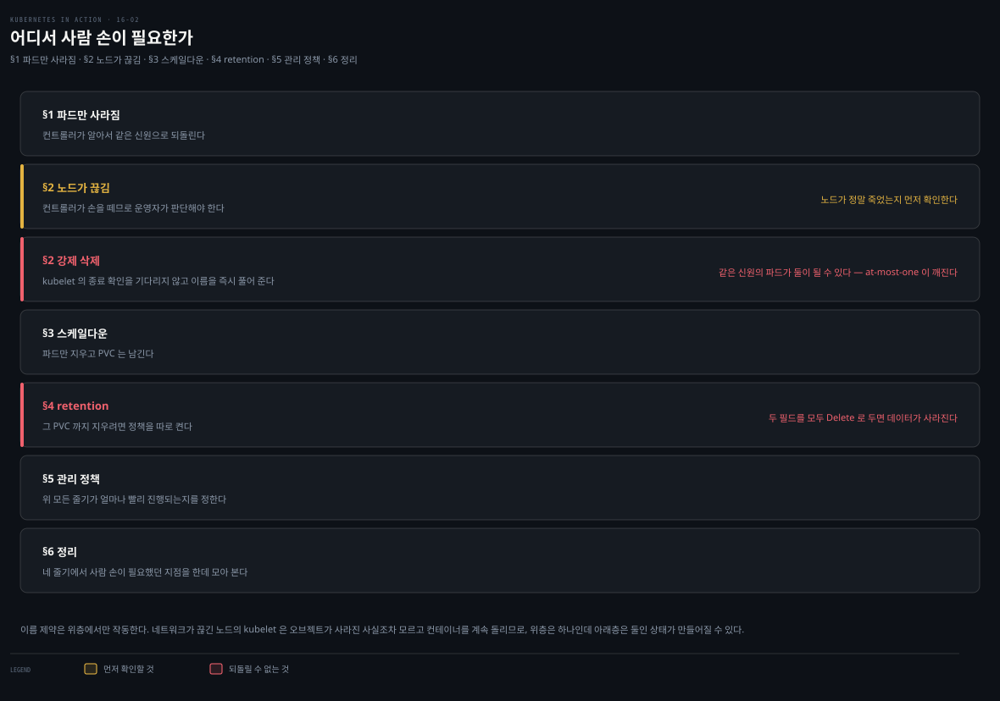
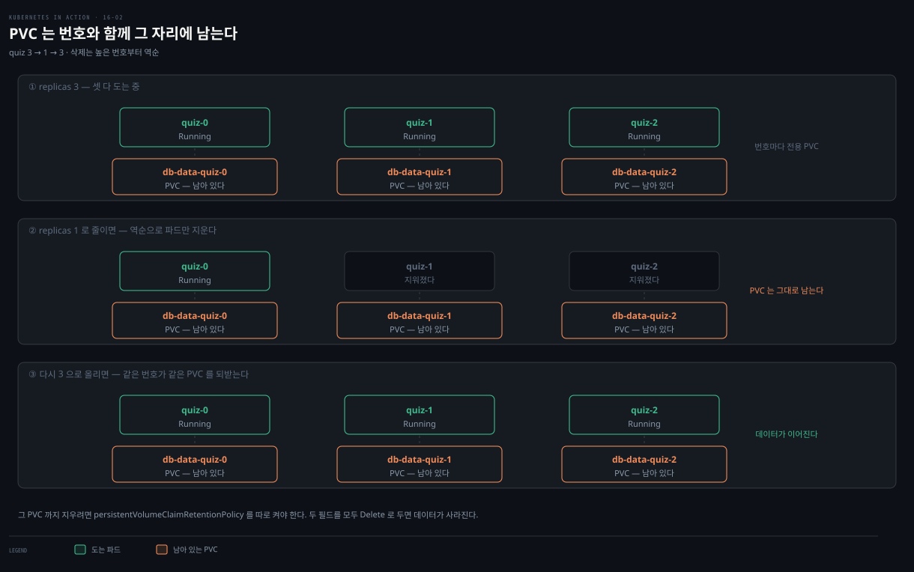
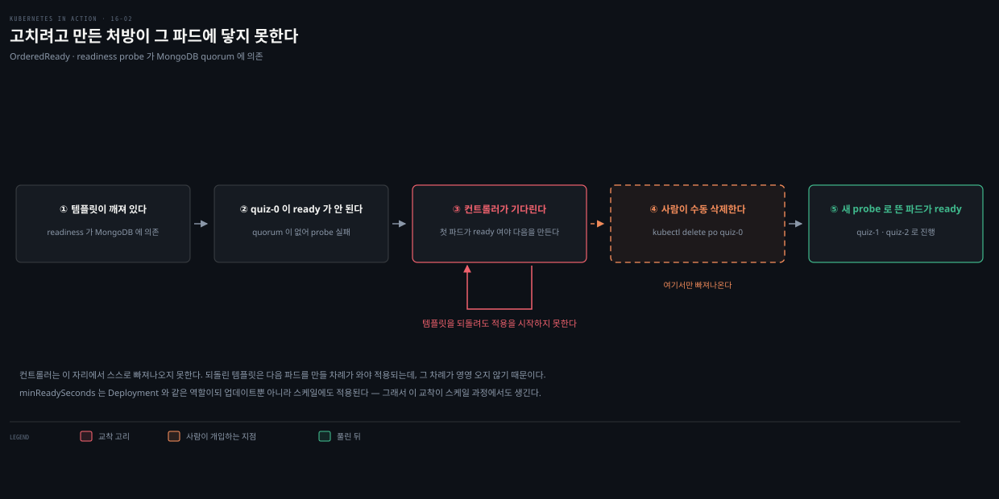

# StatefulSet 동작 — 미싱 파드·노드 장애·스케일·retention
---
> StatefulSet은 파드에 at-most-one 보장을 줍니다 — 같은 신원의 파드가 둘 동시에 돌지 않습니다. 그래서 노드 장애 시 컨트롤러가 파드를 자동 교체하지 않고, 운영자가 노드 장애를 확인한 뒤 수동 삭제해야 합니다. 스케일다운 시 PVC는 기본 보존되며, retention 정책으로 이를 바꿉니다.


> 이 문서를 읽고 나면 StatefulSet이 미싱 파드를 어떻게 같은 신원으로 교체하는지, 노드 장애 시 왜 자동 교체하지 않는지 at-most-one 보장으로 설명하고, 스케일다운 시 PVC가 보존되는 이유와 retention 정책을 말할 수 있습니다.


## 진입 — StatefulSet을 시험대에 올리기

> [16-01](./16-01.StatefulSet%20%EA%B8%B0%EC%B4%88%20%E2%80%94%20Pets%20vs%20Cattle%C2%B7ordinal%C2%B7headless%20Service.md)에서 StatefulSet을 만들고 헤드리스 Service로 데이터를 임포트했습니다. 이 편은 StatefulSet이 미싱 파드·노드 장애·스케일을 어떻게 다루는지 시험합니다.



위 지도가 이 편 전체를 한 장으로 이은 것입니다. 앞 편과 달리 단계가 순서대로 이어지지 않습니다. 네 상황은 각각 독립해서 갈라지고, 갈리는 기준은 하나입니다 — **무엇이 사라졌는가.**

- §1 파드만 사라짐 — 컨트롤러가 알아서 같은 신원으로 되돌립니다
- §2 노드가 끊김 — 컨트롤러가 손을 떼므로 운영자가 판단해야 합니다
- §3 스케일다운 — 파드만 지우고 PVC는 남깁니다
- §4 retention — 그 PVC까지 지우려면 정책을 따로 켭니다
- §5 관리 정책 — 위 모든 줄기가 얼마나 빨리 진행되는지를 정합니다
- §6 정리 — 네 줄기에서 사람 손이 필요했던 지점을 한데 모아 봅니다

§3에서 §4로만 화살표가 있는 것은 그 둘만 이어지기 때문입니다. 나머지 줄기 사이에는 화살표가 없으므로 위에서 아래로 읽어야 할 순서가 아닙니다.

색이 붙은 곳은 세 군데이며 전부 경고입니다. 앰버 띠는 노드가 정말 죽었는지 먼저 확인하라는 뜻이고, 붉은 띠 둘은 각각 강제 삭제가 같은 신원의 파드를 둘로 만들 수 있다는 것과 retention 두 필드를 모두 Delete로 두면 데이터가 사라진다는 것을 가리킵니다.


## 1. 미싱 파드를 같은 신원으로 교체

> StatefulSet 파드는 삭제·교체돼도 같은 이름과 같은 PVC를 유지합니다. IP는 달라질 수 있지만 DNS가 갱신되어, 파드 이름으로 통신하는 클라이언트는 차이를 못 느낍니다.

ReplicaSet 파드와 달리 StatefulSet 파드는 이름이 다르고 각자 PVC를 가집니다. 파드가 삭제·교체되면 replica는 같은 신원을 유지하고 같은 PVC와 연결됩니다.

```bash
kubectl delete po quiz-1
kubectl get po -l app=quiz
# quiz-0   2/2   Running   0   94m
# quiz-1   2/2   Running   0   5s     ← 같은 이름, AGE만 새 파드
# quiz-2   2/2   Running   0   94m
```

새 파드의 IP는 다를 수 있지만 DNS 레코드가 새 주소로 갱신되어 상관없습니다. 이 새 파드는 PVC에 바인딩된 PersistentVolume이 network-attached면 어느 노드에나 스케줄될 수 있지만, local 볼륨이면 항상 그 노드에 스케줄됩니다. ReplicaSet 컨트롤러처럼 항상 원하는 replica 수를 유지하되, 보장의 성격이 중요하게 다릅니다.


## 2. 노드 장애 처리 — at-most-one 보장

> StatefulSet은 ReplicaSet보다 엄격한 동시 실행 보장(at-most-one)을 줍니다. 노드가 끊겨도 컨트롤러가 파드를 자동 교체하지 않습니다 — 그러면 같은 신원의 파드가 둘 돌 수 있기 때문입니다.

### at-most-one 시맨틱

StatefulSet은 파드에 at-most-one 시맨틱을 보장합니다. 어느 시점에도 같은 신원을 가진 파드가 클러스터에 하나를 넘지 않는다는 뜻입니다[^at-most-one]. 1차 방어는 이름입니다. 같은 이름의 Pod 오브젝트 둘은 같은 네임스페이스에 공존할 수 없습니다. 그래서 ordinal 기반 이름 규칙이 같은 신원의 파드가 둘 생기는 것을 API 서버 수준에서 막습니다.

다만 이 제약이 걸리는 곳은 **API 오브젝트**입니다. 실제로 도는 **컨테이너**까지 묶지는 못합니다. 두 층을 나눠 보면 구멍이 어디인지 분명해집니다.

| 층 | 무엇이 있나 | 관리 주체 | 이름 제약 |
|---|---|---|---|
| API 오브젝트 | Pod 오브젝트 | API 서버 | 걸림 — 같은 이름 둘 불가 |
| 런타임 컨테이너 | 실제 도는 프로세스 | 그 노드의 kubelet | 걸리지 않음 |

이름 제약은 위층에서만 작동합니다. 아래층의 컨테이너는 그 노드의 kubelet이 관리하는데, 네트워크가 끊기면 그 kubelet은 API 서버를 보지 못합니다. 위층에서 오브젝트가 사라진 사실조차 모르므로 컨테이너를 계속 돌립니다. 그래서 위층은 하나인데 아래층은 둘인 상태가 만들어질 수 있고, 정작 데이터를 건드리는 쪽은 아래층입니다. 이 편의 §2가 다루는 것이 정확히 그 상황이고, 강제 삭제가 위험한 이유도 여기에 있습니다.

ReplicaSet은 노드가 control plane에 보고를 멈추면 몇 분 뒤 노드·파드가 사라졌다고 판단하고 남은 노드에 대체 파드를 만듭니다 — 원래 노드의 파드가 아직 돌고 있을 수도 있는데 말입니다. StatefulSet 컨트롤러가 이렇게 하면 같은 신원의 replica 둘이 동시에 돌게 됩니다. 그래서 하지 않습니다.

### 노드를 네트워크에서 분리

kind 클러스터에서 노드의 네트워크 인터페이스를 끕니다(14장과 동일).

```bash
docker exec kind-worker2 ip link set eth0 down
```

Kubelet이 API 서버에 연락하지 못해 control plane이 곧 노드를 NotReady로 표시합니다. 몇 분 뒤 그 노드의 quiz-1 파드 상태가 Terminating으로 바뀝니다.

```bash
kubectl get pods -l app=quiz
# quiz-1   2/2   Terminating   0   7m39s   ← 노드가 down이라 종료 중
kubectl describe po quiz-1
# Warning  NodeNotReady   ...   node-controller   Node is not ready
```

### 왜 컨트롤러가 파드를 교체하지 않는가

여기서 중요한 점은 파드의 컨테이너가 **아직 돌고 있을 수 있다**는 것입니다. 노드가 죽은 게 아니라 네트워크 연결만 잃었을 수 있고, Kubelet 프로세스가 죽어도 컨테이너는 계속 돕니다.

더 정확히 말하면 control plane은 **어느 쪽인지 판별할 수단이 없습니다**. 노드에서 오는 보고가 끊겼으므로 "죽어서 조용한 것"과 "살아 있는데 보고만 못 하는 것"이 구분되지 않습니다. 그래서 컨트롤러의 선택은 확실한 사실 위에서가 아니라 **불확실할 때 어느 쪽으로 틀릴 것인가**의 문제가 됩니다.

컨트롤러가 이때 파드를 삭제·재생성하면 새 파드가 다른 노드에 스케줄되어 컨테이너가 시작됩니다. 저쪽이 살아 있었다면 같은 신원의 워크로드 두 인스턴스가 동시에 돌게 됩니다. 반대로 만들지 않으면 저쪽이 죽었더라도 replica 하나가 놀고 있을 뿐입니다. 상태를 가진 워크로드에서는 중복이 결원보다 훨씬 비싸므로, StatefulSet 컨트롤러는 만들지 않는 쪽을 고릅니다.

### 수동 삭제 — --force --grace-period 0

파드를 다른 곳에 재생성하려면 수동 개입이 필요합니다. 운영자가 노드가 정말 장애임을 확인하고 Pod 오브젝트를 수동 삭제해야 합니다. 파드는 이미 Terminating으로 삭제 마킹돼 있어 보통의 `kubectl delete pod`는 효과가 없습니다 — control plane이 Kubelet의 컨테이너 종료 보고를 기다리는데, 그 Kubelet이 안 돌기 때문입니다.

```bash
kubectl delete pod quiz-1 --force --grace-period 0
# warning: Immediate deletion does not wait for confirmation ...
# The resource may continue to run on the cluster indefinitely.
```

경고대로 파드의 컨테이너가 계속 돌 수 있습니다. 노드가 정말 장애인지 확인한 뒤에만 이렇게 삭제합니다. 강제 삭제가 위험한 이유는 순서에 있습니다. 공식 문서의 표현으로 강제 삭제는 kubelet의 종료 확인을 기다리지 않습니다. API 서버에서 그 이름을 즉시 풀어 줍니다. 그러면 StatefulSet 컨트롤러가 같은 신원의 교체 파드를 만들 수 있게 됩니다. 원래 파드가 아직 살아 있다면 이 시점에 at-most-one 보장이 깨집니다[^force-delete].

> **공식 문서의 권고 순서.** unreachable 노드의 파드를 API 서버에서 없애는 길은 셋입니다 — Node 오브젝트 삭제, kubelet이 다시 응답해 스스로 파드를 정리하는 것, 그리고 사용자의 강제 삭제입니다. 공식 문서는 이 중 **앞의 둘**을 권합니다. 노드가 죽은 것이 확실하면(영구 단절·전원 차단 등) **Node 오브젝트를 삭제**하고, 네트워크 분단이면 그것이 해소되기를 기다리거나 해결합니다. 분단이 낫는 순간 kubelet이 삭제를 마무리합니다. 강제 삭제는 마지막 수단입니다. 파드 강제 삭제는 "이 파드가 다시는 다른 파드와 통신하지 않는다"고 운영자가 단언하는 행위입니다[^force-delete]. 같은 맥락에서 StatefulSet의 Pod 템플릿에 `terminationGracePeriodSeconds: 0`을 두는 것은 안전하지 않아 강하게 비권장됩니다[^grace-zero].

### 재생성 — 볼륨 유형에 따라

삭제 후 파드는 교체되지만 시작 못 할 수 있습니다. replica의 PersistentVolume이 local(kind)인지 network-attached(GKE)인지에 따라 두 시나리오가 있습니다.

**local 볼륨**이면 파드가 스케줄되지 못하고 STATUS가 Pending으로 남습니다.

```bash
kubectl describe pod quiz-1
# Warning  FailedScheduling  ...  0/3 nodes are available:
#   1 node had taint {node-role.kubernetes.io/master}, ...     ← control plane 노드
#   1 node had taint {node.kubernetes.io/unreachable}, ...     ← 방금 끊은 노드
#   1 node had volume node affinity conflict.                  ← 볼륨이 그 노드에 있음
```

새 quiz-1은 이전 파드와 같은 노드(볼륨이 있는 곳)에만 스케줄될 수 있는데, 그 노드가 unreachable이라 스케줄 못 됩니다.

**network-attached 볼륨**(GKE)이면 다른 노드에 스케줄되지만, 볼륨이 장애 노드에서 detach되지 못하면 실행 못 합니다.

```bash
kubectl describe pod quiz-1
# Warning  FailedAttachVolume  ...  Multi-Attach error for volume ...
#   Volume is already exclusively attached to one node and can't be attached to another
```

### PVC를 삭제해 새 파드를 띄우기

같은 볼륨에 붙을 수 없을 때, 워크로드가 데이터를 처음부터 재구축할 수 있으면(다른 replica에서 복제) PVC를 삭제해 새 PVC·새 PV를 바인딩합니다. 단 StatefulSet 컨트롤러는 파드를 만들 때만 PVC를 만드므로, Pod 오브젝트도 함께 삭제해야 합니다.

```bash
kubectl delete pvc/db-data-quiz-1 pod/quiz-1
```

새 PVC·파드가 만들어지고, 바인딩된 PV는 비어 있지만 MongoDB가 자동으로 데이터를 복제합니다.

### 노드 복구

노드를 고칠 수 있으면 이 모든 수고를 던 셈입니다. GKE는 몇 분 뒤 노드를 자동 재시작합니다. kind는 다음으로 복구합니다.

```bash
docker exec kind-worker2 ip link set eth0 up
docker exec kind-worker2 ip route add default via 172.18.0.1   # 게이트웨이는 다를 수 있음
```

노드가 온라인이 되면 파드 삭제가 완료되고 새 quiz-1이 만들어집니다. kind에서는 볼륨이 local이라 같은 노드에 스케줄됩니다.


## 3. StatefulSet 스케일 — PVC 보존·역순 삭제

> 스케일업은 파드와 PVC를 함께 만들고, 스케일다운은 파드를 삭제하되 PVC는 기본 보존합니다. 삭제는 ordinal 높은 순(역순)이라 번호가 항상 0부터 연속입니다.

### 스케일다운 — PVC는 보존

```bash
kubectl scale sts quiz --replicas 1
kubectl get pods -l app=quiz
# quiz-0   2/2   Running       0   1h
# quiz-1   2/2   Terminating   0   14m   ← 삭제 중
# quiz-2   2/2   Terminating   0   1h    ← 삭제 중
```

ReplicaSet과 달리 StatefulSet은 **ordinal 번호가 가장 높은 파드부터** 삭제합니다. 3→1로 줄이면 quiz-2·quiz-1이 삭제되어, ordinal이 항상 0부터 시작해 replica 수보다 작은 번호로 끝납니다.

```bash
kubectl get pvc -l app=quiz
# db-data-quiz-0   Bound   ...   1Gi   RWO   standard   1h
# db-data-quiz-1   Bound   ...   1Gi   RWO   standard   1h   ← 파드는 삭제됐지만 PVC 보존
# db-data-quiz-2   Bound   ...   1Gi   RWO   standard   1h   ← 보존
```

파드와 달리 **PVC는 보존**됩니다 — 클레임을 지우면 바인딩된 PV가 recycle/삭제되어 데이터가 사라지기 때문입니다. 보존이 기본이고, `persistentVolumeClaimRetentionPolicy`로 삭제하도록 바꿀 수 있습니다.

quiz를 1 replica로 줄이면 quiz Service가 사용 불가가 되는데, 이건 쿠버네티스와 무관합니다 — MongoDB 리플리카 셋을 3 replica로 구성해 quorum에 최소 2가 필요한데, 1개는 quorum이 없어 읽기·쓰기를 모두 거부합니다. 그러면 readiness probe가 실패해 파드가 Service에서 빠지고 Endpoints가 비어버립니다.

```bash
kubectl get endpoints -l app=quiz
# quiz                          1h   ← quiz Service는 Endpoints 없음
# quiz-pods   10.244.1.9:27017  1h   ← quiz-pods는 ready 무관하게 quiz-0 포함
```

### 스케일업 — PVC 재부착



PVC가 보존되므로 스케일업 시 재부착됩니다. 각 파드가 ordinal 번호 기준으로 이전과 같은 PVC와 연결됩니다.

```bash
kubectl scale sts quiz --replicas 3   # quorum 회복, 모두 ready
kubectl scale sts quiz --replicas 5   # 파드·PVC 2개 추가되지만 ready 안 됨
kubectl get pods quiz-3 quiz-4
# quiz-3   1/2   Running   0   4m55s   ← 컨테이너 하나만 ready
# quiz-4   1/2   Running   0   4m55s
```

quiz-3·quiz-4는 잘못된 게 아니라 MongoDB 리플리카 셋에 추가되지 않았을 뿐입니다. 리플리카 셋 재구성은 책 범위 밖입니다. 이는 상태 있는 앱을 관리하려면 StatefulSet 오브젝트 생성 이상이 필요하다는 것을 보여줍니다. 그래서 보통 Operator를 씁니다([16-03](./16-03.StatefulSet%20%EC%97%85%EB%8D%B0%EC%9D%B4%ED%8A%B8%EC%99%80%20Operator%20%E2%80%94%20partition%C2%B7OnDelete%C2%B7CRD.md)).

quiz 파드는 두 Service로 노출됩니다. ready 파드만 다루는 일반 quiz Service와, ready 무관하게 모든 파드를 포함하는 headless quiz-pods Service입니다. 두 Service가 필요한 이유는 요구가 정반대이기 때문입니다.

- **클라이언트 관점** — not-ready 파드는 Service에서 빠져야 합니다. 준비 안 된 파드로 요청이 가면 실패합니다.
- **MongoDB 관점** — replica끼리 서로를 찾아야 하므로 ready 여부와 무관하게 모든 파드가 보여야 합니다.

한 Service로는 둘을 동시에 만족시킬 수 없습니다. StatefulSet이 일반 Service와 headless Service를 함께 두는 게 흔한 이유입니다.


## 4. PVC retention 정책

> persistentVolumeClaimRetentionPolicy의 whenScaled·whenDeleted로 스케일다운·삭제 시 PVC를 Retain(기본)할지 Delete할지 정합니다. 데이터 유실을 막으려면 둘 다 Delete로 두지 않는 게 안전합니다.

워크로드가 데이터 보존을 요구하지 않으면 `persistentVolumeClaimRetentionPolicy`로 PVC를 자동 삭제하도록 설정할 수 있습니다.

```yaml
spec:
  persistentVolumeClaimRetentionPolicy:
    whenScaled: Delete    # 스케일다운 시 PVC 삭제
    whenDeleted: Retain   # StatefulSet 삭제 시 PVC 보존
```

각 필드는 `Retain`(기본) 또는 `Delete` 값을 가집니다[^pvc-retention].

`--cascade=orphan`으로 StatefulSet을 삭제하면 정책이 Delete여도 PVC가 보존됩니다(원서 §16.2 — 공식 문서에는 이 상호작용을 다루는 대목이 없습니다).

이 정책이 **언제 발동하지 않는지**가 중요합니다. 정책은 StatefulSet이 삭제되거나 스케일다운되어 파드가 제거될 때만 적용됩니다. 노드 장애는 여기 해당하지 않습니다. 파드가 죽고 control plane이 교체 파드를 만드는 경우에는 정책과 무관하게 기존 PVC가 그대로 유지됩니다. 볼륨은 새 파드가 뜰 노드에 다시 붙습니다[^pvc-retention]. 앞 절에서 장애 노드의 PVC를 지우려면 `kubectl delete pvc`를 직접 쳐야 했던 이유가 여기 있습니다. retention 정책은 그 상황을 대신 처리해 주지 않습니다.

구현은 ownerReference와 가비지 컬렉터로 이뤄집니다. 컨트롤러가 PVC에 소유자 참조를 달아 두면, 파드가 종료된 뒤 GC가 그 PVC를 지웁니다. 파드가 볼륨을 깨끗이 unmount한 다음에 PVC가 삭제되도록 순서를 맞추기 위해서입니다[^pvc-retention].

> **데이터 유실 주의.** 어느 정책도 Delete로 두는 것을 경계합니다. whenDeleted를 Retain으로 둬 실수 삭제 시 데이터를 지켜도, whenScaled가 Delete면 StatefulSet을 삭제 전 0으로 스케일했을 때 여전히 데이터가 사라집니다. PV의 데이터가 다른 곳에 보존되거나 보존이 불필요할 때만 Delete를 씁니다. StorageClass의 reclaimPolicy를 Retain으로 두는 것도 방법입니다.


## 5. Pod 관리 정책 — OrderedReady vs Parallel

> podManagementPolicy가 OrderedReady(기본)면 파드를 하나씩 ready 대기하며 만들고 역순으로 지웁니다. Parallel이면 동시에 만들고 지웁니다. OrderedReady는 순서 보장이 필요한 워크로드에 편하지만, 첫 파드가 ready 안 되면 교착에 빠지는 단점이 있습니다.

### 두 정책

StatefulSet 도입 시엔 정책이 설정 불가로 항상 순차 배포였습니다. 하위 호환을 위해 기본 `podManagementPolicy`는 OrderedReady이고, Parallel로 완화할 수 있습니다.

| 값 | 설명 |
|----|------|
| OrderedReady | 오름차순으로 하나씩 생성. 각 파드가 ready가 될 때까지 기다린 뒤 다음 생성. 스케일업·파드 교체·노드 장애 시 동일. 스케일다운 시 역순 삭제, 각 파드 종료를 기다린 뒤 다음 삭제 |
| Parallel | 모든 파드를 동시에 생성·삭제. 개별 파드 ready를 기다리지 않음 |

Parallel이 완화하는 것은 **순서 보장뿐**입니다. 유일성과 신원 보장은 그대로 유지됩니다[^pod-mgmt]. 파드가 동시에 뜬다고 해서 같은 ordinal의 파드가 둘 생기지는 않는다는 뜻입니다. 즉 Parallel로 바꿔도 §2에서 본 at-most-one 보장이 약해지지는 않습니다.

### OrderedReady의 함정 — 교착

`podManagementPolicy: OrderedReady`, `minReadySeconds: 10`으로 재생성하면, replicas가 3인데도 파드 하나만 만들어집니다. quiz-0의 quiz-api가 영영 ready가 안 되기 때문입니다 — MongoDB가 quorum(최소 2 파드)이 없어 readiness probe가 실패하고, 컨트롤러는 첫 파드가 ready가 되기 전엔 다음을 못 만들어 **교착**에 빠집니다.

`minReadySeconds`는 Deployment와 같은 역할이되, 업데이트뿐 아니라 스케일에도 적용됩니다. readiness probe가 MongoDB에 의존하지 않게 root URI(`/`)를 호출하도록 바꾸면 HTTP 서버 생존만 확인해 교착을 풀 수 있습니다.

그런데 여기에 함정이 하나 더 있습니다. **템플릿을 고쳐도 교착 상태의 파드는 자동 교체되지 않습니다.** 컨트롤러가 깨진 파드의 Ready를 계속 기다리느라, 되돌린 템플릿을 적용하는 일 자체를 시작하지 못하기 때문입니다. 고치려고 만든 처방이 정작 고쳐야 할 파드에 닿지 못합니다.

공식 문서는 이것을 정책의 설계가 아니라 **알려진 이슈**로 규정하고, "Forced rollback"이라는 별도 절에서 다룹니다. 원문은 템플릿을 되돌리는 것만으로는 부족하다고 못 박습니다[^forced-rollback]. 따라서 이 상태에 빠지면 **불건전 파드를 수동 삭제**해야 합니다.



도식에서 3번 상자로 돌아오는 붉은 화살표가 교착 고리입니다. 컨트롤러는 이 자리에서 스스로 빠져나오지 못합니다. 점선으로 표시한 4번이 사람이 개입하는 지점이며, 그 개입 뒤에야 5번으로 넘어갑니다.

```bash
kubectl delete po quiz-0   # 수동 삭제 후 --watch로 관찰
kubectl get pods -l app=quiz --watch
# quiz-0 ... Running   (새 probe로 ready) → quiz-1 생성 → ready → quiz-2 생성
```

파드가 오름차순으로 하나씩, quiz-1은 quiz-0의 두 컨테이너가 ready가 된 뒤에야(그리고 minReadySeconds 10초 더 기다린 뒤) 만들어집니다. 이 동안 최대 하나의 파드만 시작 중입니다 — 일부 워크로드는 race condition을 피하려 이것이 필요합니다.

### 스케일·차단·삭제

OrderedReady로 스케일하면 파드가 하나씩 생성·삭제됩니다. 스케일다운은 minReadySeconds를 쓰지 않아 추가 지연이 없습니다.

또 하나의 특징이 있습니다. 모든 replica가 ready가 아니면 컨트롤러가 **스케일다운을 차단**합니다. 그런데 그 이유를 Event나 status로 알려주지 않아, 겉으로는 멈춘 것처럼만 보입니다. 파드가 다시 ready가 되면 스케일이 완료됩니다. 공식 문서의 보장으로 옮기면 "스케일 작업이 적용되기 전에 선행 파드가 모두 Running·Ready여야 하고, `minReadySeconds`가 설정돼 있으면 available이어야 한다"는 규칙이 이 차단의 근거입니다[^scaling-guarantee].

OrderedReady 정책은 초기 롤아웃·스케일·노드 장애 시 파드 교체에는 적용되지만, **StatefulSet 삭제에는 적용되지 않습니다**. 파드를 순서대로 종료하려면 먼저 StatefulSet을 0으로 스케일하고 마지막 파드가 끝난 뒤 삭제합니다.

> **Spring 관점.** Kafka·Zookeeper처럼 순차 기동이 중요한 미들웨어는 OrderedReady가 맞지만, 첫 파드의 readiness probe가 클러스터 quorum에 의존하면 교착에 빠집니다. probe를 "프로세스 생존"과 "클러스터 정상"으로 분리하거나(startup probe로 생존만·별도 지표로 quorum), quorum 의존이 없는 앱은 Parallel로 두는 판단이 필요합니다.


## 6. 왜 사람 손이 자주 필요한가

> 이 편에는 운영자가 직접 개입해야 하는 지점이 세 번 나옵니다. 공통점은 컨트롤러에게 판단 근거가 없다는 것이고, 상태를 가진 워크로드에서는 잘못된 자동 판단을 되돌릴 수 없기 때문입니다.

앞의 다섯 절을 지나며 사람이 손으로 해야 하는 일이 세 번 등장했습니다. Deployment였다면 셋 다 자동으로 처리됐을 일입니다.

| 상황 | 컨트롤러가 모르는 것 | 사람만 아는 것 |
|---|---|---|
| 노드 장애 시 파드 삭제 (§2) | 저쪽 컨테이너가 도는지 죽었는지 | 노드 상태를 직접 확인한 결과 |
| 장애 노드의 PVC 삭제 (§2) | 그 데이터를 버려도 되는지 | 다른 replica에서 복제 가능한지 |
| 교착 파드 삭제 (§5) | 새 템플릿이 정상인지 | 방금 자신이 고친 내용 |

세 경우 모두 컨트롤러가 게을러서가 아니라 **판단할 정보가 없어서** 멈춥니다. Deployment에서는 이런 판단이 틀려도 쌉니다. 파드 하나가 더 떠도 무해하고 볼륨이 없으니 버릴 데이터도 없어서, 일단 시도하고 아니면 다시 하는 방식이 성립합니다.

상태를 가지면 그 전제가 깨집니다. 틀린 판단의 결과가 데이터 손상이고, 손상은 되돌릴 수 없습니다. 자동화가 성립하는 조건이 "틀렸을 때 값싸게 되돌릴 수 있는가"라면, 상태를 갖는 순간 그 조건이 사라지는 것입니다. StatefulSet이 포기한 것은 편의가 아니라 **잘못 판단할 권한**입니다.

이 공백을 메우는 것이 Operator입니다. "이 앱은 이럴 때 이렇게 하면 된다"는 도메인 지식을 코드로 넣는 방식입니다. 쿠버네티스가 일반 규칙만으로는 내리지 못하던 판단을 대신하게 됩니다([16-03](./16-03.StatefulSet%20%EC%97%85%EB%8D%B0%EC%9D%B4%ED%8A%B8%EC%99%80%20Operator%20%E2%80%94%20partition%C2%B7OnDelete%C2%B7CRD.md)).


## 면접에서 받을 만한 질문

> 아래 질문에 먼저 스스로 답해 본 뒤, 챕터 끝의 정답과 맞춰 봅니다.

1. StatefulSet 파드가 삭제·교체되면 무엇이 유지되나요? 클라이언트가 차이를 못 느끼는 이유는요?
2. at-most-one 보장이란 무엇이고, 노드 장애 시 StatefulSet 컨트롤러가 파드를 자동 교체하지 않는 이유는요?
3. 장애 노드의 파드를 재생성하려면 왜 `--force --grace-period 0`이 필요하고, 무엇을 먼저 확인해야 하나요?
4. StatefulSet을 스케일다운하면 PVC는 어떻게 되나요? 삭제 순서는요?
5. persistentVolumeClaimRetentionPolicy를 둘 다 Delete로 두면 왜 위험한가요?
6. retention 정책이 **적용되지 않는** 상황은 언제인가요?
7. at-most-one 보장에 구멍이 생기는 지점은 어디인가요? 두 층으로 나눠 설명해 보세요.
8. OrderedReady에서 교착에 빠진 뒤 Pod 템플릿을 고치면 파드가 자동으로 교체되나요? 그 동작은 정책의 설계인가요, 결함인가요?
9. 이 편에서 사람이 직접 개입해야 하는 세 지점의 공통점은 무엇인가요?


## 정답 (자답 후 펼치기)

> 위 질문에 답해 본 다음 아래와 맞춰 봅니다. 순서는 질문과 1:1로 대응합니다.

### 정답 1 — 미싱 파드 교체

StatefulSet 파드가 삭제·교체되면 **같은 이름(ordinal)과 같은 PVC**가 유지됩니다. IP는 달라질 수 있지만 DNS 레코드가 새 주소로 갱신되어, 파드 이름(`quiz-1.quiz-pods...`)으로 통신하는 클라이언트는 차이를 못 느낍니다. 새 파드는 network-attached 볼륨이면 어느 노드에나, local 볼륨이면 항상 볼륨이 있는 노드에 스케줄됩니다.

### 정답 2 — at-most-one과 자동 교체 안 함

at-most-one은 같은 신원의 파드가 둘 동시에 돌지 않는다는 보장입니다. ordinal 이름 규칙이 1차 방어인데, 같은 이름 Pod 오브젝트 둘이 한 네임스페이스에 공존할 수 없기 때문입니다. 단 이 제약은 API 오브젝트에만 걸리고 실행 중인 컨테이너까지 묶지 못합니다. 노드가 네트워크만 잃은 경우 파드 컨테이너는 여전히 돌고 있는데, 컨트롤러가 자동으로 삭제·재생성하면 새 파드가 다른 노드에 떠 같은 신원 인스턴스가 둘 돌게 됩니다. 이를 막으려 StatefulSet은 자동 교체하지 않습니다(ReplicaSet은 자동 교체함).

### 정답 3 — 강제 삭제와 사전 확인

장애 노드의 파드는 이미 Terminating으로 마킹돼, control plane이 Kubelet의 컨테이너 종료 보고를 기다리는데 그 Kubelet이 안 돌아 보통 삭제가 완료되지 않습니다. 그래서 `--force --grace-period 0`으로 확인을 기다리지 않고 즉시 삭제해야 합니다. 단 이 옵션은 "컨테이너가 계속 돌 수 있다"는 경고가 있으므로, **노드가 정말 장애임을 먼저 확인**해야 합니다 — 아니면 같은 신원 파드가 둘 돌게 됩니다.

### 정답 4 — 스케일다운과 PVC

스케일다운 시 파드는 삭제되지만 **PVC는 기본 보존**됩니다. 클레임을 지우면 바인딩된 PV가 recycle·삭제되어 데이터가 사라지기 때문입니다. 삭제 순서는 ReplicaSet과 달리 **ordinal 번호가 가장 높은 파드부터**인 역순입니다. 그래서 남는 파드의 번호가 항상 0부터 연속입니다. 3에서 1로 줄이면 quiz-2와 quiz-1이 삭제됩니다. PVC 자동 삭제를 원하면 persistentVolumeClaimRetentionPolicy를 씁니다.

### 정답 5 — retention 둘 다 Delete의 위험

whenScaled·whenDeleted를 둘 다 Delete로 두면 데이터가 쉽게 사라집니다. whenDeleted만 Retain으로 둬 실수 삭제 시 데이터를 지켜도, whenScaled가 Delete면 StatefulSet을 삭제하기 전 0으로 스케일하는 순간 PVC가 삭제되어 데이터가 유실됩니다. 그래서 PV 데이터가 다른 곳에 보존되거나 보존이 불필요할 때만 Delete를 쓰고, StorageClass reclaimPolicy를 Retain으로 두는 방어도 병행합니다.

### 정답 6 — retention 정책의 적용 범위

정책은 **StatefulSet이 삭제되거나 스케일다운되어 파드가 제거될 때만** 적용됩니다. 판단 기준을 한 줄로 줄이면 `spec.replicas` 값이 줄었는가입니다.

| 상황 | replicas | 정책 발동 |
|---|---|---|
| 롤링 업데이트 (이미지 교체) | 불변 | 안 함 |
| 노드 장애로 파드 소실 | 불변 | 안 함 |
| `kubectl scale`로 축소 | 감소 | `whenScaled` |
| StatefulSet 삭제 | — | `whenDeleted` |

가운데 두 줄이 같은 이유로 묶입니다. 파드가 사라져도 replica 수가 줄지 않으면 정책은 조용합니다. 특히 롤링 업데이트는 파드를 하나씩 지웠다 다시 만들지만 그것은 교체이지 스케일다운이 아니므로, 이미지를 바꿔도 PVC는 그대로 재부착됩니다. 컨테이너는 갈아도 데이터는 남는다는 StatefulSet의 요점이 여기서 드러납니다.

노드 장애로 파드가 죽고 control plane이 교체 파드를 만드는 경우에도 정책과 무관하게 기존 PVC가 유지되며, 볼륨은 새 파드가 뜰 노드에 다시 붙습니다. 그래서 장애 노드의 PVC를 정리하려면 `kubectl delete pvc`로 직접 지워야 합니다(§2). 또 이 필드를 쓰려면 feature gate `StatefulSetAutoDeletePVC`가 필요합니다. API 서버와 controller manager 양쪽에 켜져 있어야 합니다.

### 정답 7 — at-most-one의 두 층

이름 제약은 **API 오브젝트** 층에만 걸립니다. 같은 이름의 Pod 오브젝트 둘은 한 네임스페이스에 공존할 수 없으므로 API 서버가 중복을 막습니다. 그러나 실제로 데이터를 건드리는 것은 **런타임 컨테이너** 층이고, 이쪽은 그 노드의 kubelet이 관리합니다.

네트워크가 끊기면 그 kubelet은 API 서버를 보지 못해, 위층에서 오브젝트가 사라진 사실조차 모른 채 컨테이너를 계속 돌립니다. 그래서 위층은 하나인데 아래층은 둘인 상태가 가능합니다. 강제 삭제가 위험한 이유가 이것이며, 공식 문서가 강제 삭제를 "이 파드가 다시는 다른 파드와 통신하지 않는다"는 운영자의 단언으로 정의하는 것도 같은 맥락입니다.

### 정답 8 — 교착 뒤 템플릿 수정

자동으로 교체되지 **않습니다**. 컨트롤러가 깨진 파드의 Ready를 계속 기다리느라 되돌린 템플릿을 적용하는 일 자체를 시작하지 못하기 때문입니다. 운영자가 그 파드를 직접 삭제해야 새 템플릿으로 재생성됩니다.

이 동작은 정책의 설계가 아니라 **결함**입니다. 공식 문서가 "Forced rollback" 절에서 known issue로 분류하고, Limitations 절도 수동 개입이 필요한 broken state라고 적습니다[^forced-rollback]. 설계와 결함을 구분해야 하는 이유는 무게가 달라지기 때문입니다. 결함이라면 향후 고쳐질 수 있으므로 정책 선택의 근거로 삼기에는 약합니다.

### 정답 9 — 사람 손이 필요한 세 지점

노드 장애 시 파드 삭제, 장애 노드의 PVC 삭제, 교착 파드 삭제입니다. 공통점은 컨트롤러에게 **판단할 정보가 없다**는 것입니다. 컨테이너가 살았는지, 데이터를 버려도 되는지, 새 템플릿이 정상인지는 모두 클러스터 밖의 사실이라 사람만 압니다.

Deployment에서는 이런 판단이 틀려도 값싸게 되돌릴 수 있어 자동화가 성립합니다. 상태를 가지면 틀린 결과가 데이터 손상이고 되돌릴 수 없으므로, StatefulSet은 잘못 판단할 권한 자체를 포기하고 사람에게 넘깁니다(§6).


## 관련 문서

> 이 편은 StatefulSet의 런타임 동작(교체·장애·스케일·retention)을 다룹니다. 이어지는 [16-03](./16-03.StatefulSet%20%EC%97%85%EB%8D%B0%EC%9D%B4%ED%8A%B8%EC%99%80%20Operator%20%E2%80%94%20partition%C2%B7OnDelete%C2%B7CRD.md)는 업데이트 전략과 Operator를 다룹니다.

- [스토리지와 상태](../../kubernetes/03_storage/03-01.%EC%8A%A4%ED%86%A0%EB%A6%AC%EC%A7%80%EC%99%80%20%EC%83%81%ED%83%9C.md) — StatefulSet 3보장·PVC 통합 개념본(개념 위임)
- [16-01. StatefulSet 기초 — Pets vs Cattle·ordinal·headless Service](./16-01.StatefulSet%20%EA%B8%B0%EC%B4%88%20%E2%80%94%20Pets%20vs%20Cattle%C2%B7ordinal%C2%B7headless%20Service.md) — 앞 편
- [16-03. StatefulSet 업데이트와 Operator — partition·OnDelete·CRD](./16-03.StatefulSet%20%EC%97%85%EB%8D%B0%EC%9D%B4%ED%8A%B8%EC%99%80%20Operator%20%E2%80%94%20partition%C2%B7OnDelete%C2%B7CRD.md) — 다음 편
- [14-02. ReplicaSet 컨트롤러 — reconciliation·장애복구·삭제](./14-02.ReplicaSet%20%EC%BB%A8%ED%8A%B8%EB%A1%A4%EB%9F%AC%20%E2%80%94%20reconciliation%C2%B7%EC%9E%A5%EC%95%A0%EB%B3%B5%EA%B5%AC%C2%B7%EC%82%AD%EC%A0%9C.md) — 노드 장애·--cascade=orphan 대비(ReplicaSet은 자동 교체)
- [10-03. PV 관리 — 리사이즈·스냅샷·ephemeral](./10-03.PV%20%EA%B4%80%EB%A6%AC%20%E2%80%94%20%EB%A6%AC%EC%82%AC%EC%9D%B4%EC%A6%88%C2%B7%EC%8A%A4%EB%83%85%EC%83%B7%C2%B7ephemeral.md) — reclaimPolicy·PVC 생애주기
- 원서: 《Kubernetes in Action, 2nd Ed.》 Ch16 §16.2 — [Manning](https://www.manning.com/books/kubernetes-in-action-second-edition), [예제 코드](https://github.com/luksa/kubernetes-in-action-2nd-edition/tree/master/Chapter16)
- 공식 문서: [PersistentVolumeClaim retention](https://kubernetes.io/docs/concepts/workloads/controllers/statefulset/#persistentvolumeclaim-retention)

[^at-most-one]: 공식 문서 [Force Delete StatefulSet Pods](https://kubernetes.io/docs/tasks/run-application/force-delete-stateful-set-pod/). "StatefulSet ensures that, at any time, there is at most one Pod with a given identity running in a cluster. This is referred to as *at most one* semantics provided by a StatefulSet."

[^force-delete]: 같은 문서. 강제 삭제에 관한 원문은 "Force deletions **do not** wait for confirmation from the kubelet that the Pod has been terminated."이며, 이어서 "it will immediately free up the name from the apiserver. This would let the StatefulSet controller create a replacement Pod with that same identity; this can lead to the duplication of a still-running Pod"라고 적습니다. 노드 처리 권고는 "If a Node is confirmed to be dead ... then delete the Node object. If the Node is suffering from a network partition, then try to resolve this or wait for it to resolve." 그리고 강제 삭제의 전제는 "you are asserting that the Pod in question will never again make contact with other Pods in the StatefulSet".

[^grace-zero]: 공식 문서 [StatefulSets — Deployment and Scaling Guarantees](https://kubernetes.io/docs/concepts/workloads/controllers/statefulset/#deployment-and-scaling-guarantees). "The StatefulSet should not specify a `pod.Spec.TerminationGracePeriodSeconds` of 0. This practice is unsafe and strongly discouraged."

[^pvc-retention]: 공식 문서 [StatefulSets — PersistentVolumeClaim retention](https://kubernetes.io/docs/concepts/workloads/controllers/statefulset/#persistentvolumeclaim-retention). 기본값은 "`Retain` (default)"이며 "The default for policies is `Retain`, matching the StatefulSet behavior before this new feature." 적용 범위는 "these policies **only** apply when Pods are being removed due to the StatefulSet being deleted or scaled down. For example, if a Pod associated with a StatefulSet fails due to node failure, and the control plane creates a replacement Pod, the StatefulSet retains the existing PVC." 이 필드를 쓰려면 API 서버와 controller manager에 `StatefulSetAutoDeletePVC` feature gate가 켜져 있어야 합니다. 구현은 ownerReference + 가비지 컬렉터입니다.

[^pod-mgmt]: 공식 문서 [StatefulSets — Pod Management Policies](https://kubernetes.io/docs/concepts/workloads/controllers/statefulset/#pod-management-policies). "StatefulSet allows you to relax its ordering guarantees while preserving its uniqueness and identity guarantees via its `.spec.podManagementPolicy` field."

[^scaling-guarantee]: 공식 문서 [StatefulSets — Deployment and Scaling Guarantees](https://kubernetes.io/docs/concepts/workloads/controllers/statefulset/#deployment-and-scaling-guarantees). 원문은 "Before a scaling operation is applied to a Pod, all of its predecessors must be Running and Ready."로 시작해, `.spec.minReadySeconds`가 설정돼 있으면 선행 파드가 available(최소 `minReadySeconds`만큼 Ready)이어야 한다고 잇습니다(원문의 이 대목에는 마크다운 링크가 섞여 있어 축자 인용하지 않습니다). 종료 쪽 문장은 "Before a Pod is terminated, all of its successors must be completely shutdown."입니다.

[^forced-rollback]: 공식 문서 [StatefulSets — Forced rollback](https://kubernetes.io/docs/concepts/workloads/controllers/statefulset/#forced-rollback), 2026-08-11 조회. 원문 세 문장을 그대로 옮깁니다.
  - 상태: "In this state, it's not enough to revert the Pod template to a good configuration."
  - 이유: "Due to a known issue, StatefulSet will continue to wait for the broken Pod to become Ready (which never happens) before it will attempt to revert it back to the working configuration."
  - 조치: "After reverting the template, you must also delete any Pods that StatefulSet had already attempted to run with the bad configuration."

  여기서 말하는 known issue는 [kubernetes#67250](https://github.com/kubernetes/kubernetes/issues/67250)입니다. 같은 취지가 Limitations 절에도 "it's possible to get into a broken state that requires manual intervention to repair"로 적혀 있습니다. 즉 이 동작은 OrderedReady의 의도된 설계가 아니라 미해결 결함으로 분류됩니다.
