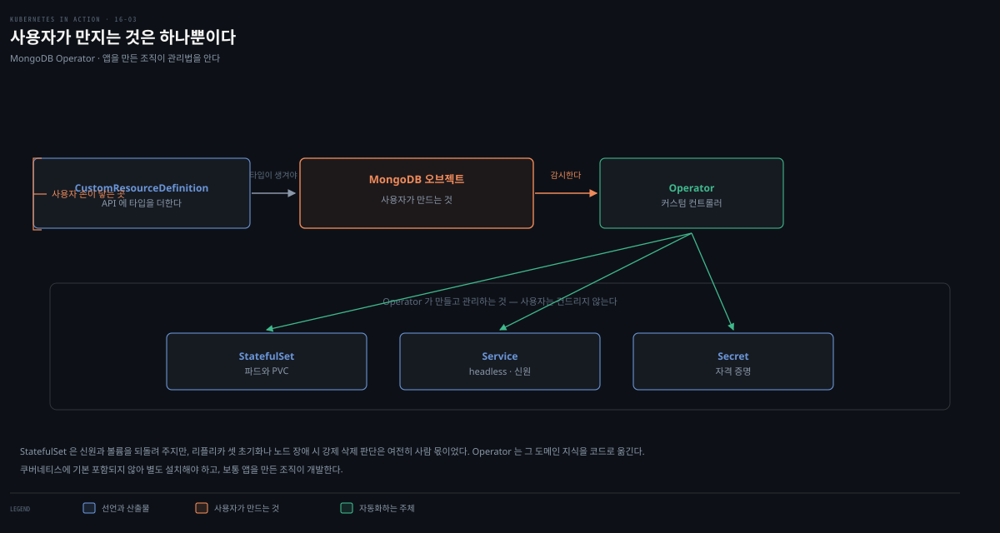

# StatefulSet 업데이트와 Operator — partition·OnDelete·CRD
---
> StatefulSet은 RollingUpdate(ordinal 높은 순 1개씩)와 OnDelete(수동 삭제 시 교체) 전략으로 업데이트합니다. partition 파라미터로 canary·staging을 구현하고, revision은 ControllerRevision에 저장됩니다. StatefulSet만으로 부족한 상태 앱 관리는 Operator(CRD + 커스텀 컨트롤러)가 자동화합니다.


> 이 문서를 읽고 나면 StatefulSet의 두 업데이트 전략을 Deployment와 비교해 구분하고, partition으로 canary를 구현하며, Operator가 CRD·커스텀 오브젝트로 상태 앱 관리를 어떻게 자동화하는지 설명할 수 있습니다.


## 진입 — 선언적 업데이트, 그러나 다른 전략

> StatefulSet도 선언적 업데이트를 제공합니다. Pod 템플릿을 바꾸면 컨트롤러가 파드를 재생성하되, Deployment와 다른 전략(RollingUpdate·OnDelete)을 씁니다.

Pod 템플릿을 바꾸면 컨트롤러가 새 템플릿으로 파드를 재생성합니다. Deployment처럼 `updateStrategy` 필드로 전략을 지정하지만, 사용 가능한 전략이 다릅니다.

| 값 | 설명 |
|----|------|
| RollingUpdate | 파드를 하나씩 교체. ordinal 번호가 가장 높은 파드부터 삭제·새 템플릿으로 교체, ready가 되면 다음으로. 모든 파드 교체까지 반복. **기본** |
| OnDelete | 각 파드를 수동 삭제할 때까지 대기. 삭제하면 새 템플릿으로 교체. 임의 순서·속도로 교체 가능 |

RollingUpdate는 Deployment의 것과 비슷하되 파라미터가 다르고, OnDelete는 Deployment의 Recreate와 다릅니다 — Recreate는 모든 파드를 한 번에 삭제·교체하지만 OnDelete는 원하는 속도·순서로 교체합니다.

아래는 이 편 전체를 한 장으로 이은 지도입니다. 세 전략을 나란히 놓는 대신 **통제권이 누구에게 있는가**를 축으로 세웠습니다. 아래로 갈수록 자동화가 줄고 통제가 늘어납니다.

- §1 RollingUpdate — 컨트롤러가 순서와 시점을 전부 정합니다
- §2 partition — 어디까지 교체할지를 사용자가 정합니다
- §3 OnDelete — 언제 교체할지까지 사용자가 가져옵니다

점선 아래의 §4는 층위가 다릅니다. 앞의 셋이 StatefulSet 안에서 손잡이를 고르는 이야기라면, Operator는 그 통제권을 사람이 아니라 앱 전용 컨트롤러에게 넘기는 이야기입니다. 그래서 같은 축에 이어 붙이지 않고 선을 그어 갈랐습니다.

색이 붙은 곳은 두 군데뿐입니다. 앰버 띠는 maxSurge가 StatefulSet에 없다는 뜻이고, 붉은 띠는 OnDelete에서 파드가 ready인지 판단할 책임이 컨트롤러가 아니라 사용자에게 있다는 뜻입니다.




## 1. RollingUpdate 전략

> Deployment의 RollingUpdate와 비슷하되 한 번에 파드 하나만 교체합니다. maxSurge는 없고, maxUnavailable은 현행 API에 있으나 기본 비활성입니다. ordinal 높은 순으로 교체되며 minReadySeconds로 속도를 늦춥니다.

Deployment는 maxSurge·maxUnavailable로 여러 파드를 동시에 교체할 수 있습니다. 책은 StatefulSet의 RollingUpdate에 이런 파라미터가 없다고 설명합니다(한 번에 하나). minReadySeconds로 롤아웃을 늦출 수 있는데, 이 필드는 업데이트뿐 아니라 스케일에도 적용됩니다.

> **현행 API와 다른 점.** 책의 이 서술은 maxUnavailable에 관해서는 현행 공식 문서와 어긋납니다. `.spec.updateStrategy.rollingUpdate.maxUnavailable`은 지금 존재하며 **v1.35 beta·기본 비활성**입니다. 기본값은 1이고 0은 쓸 수 없습니다[^max-unavailable]. 켜지 않으면 **관측되는 동작은 책 설명과 같지만**, "파라미터가 없다"는 서술 자체는 현행 API 기준으로 더 이상 맞지 않습니다. 다만 feature-state의 `v1.35`는 **beta 진입 버전**이지 필드가 처음 도입된 버전이 아니므로, 책 집필 시점에 alpha로 이미 있었는지는 확인하지 않았습니다 — "책 이후에 생겼다"고 단정할 근거는 없습니다. 반면 **maxSurge는 개념 문서에 등장하지 않습니다**. 즉 두 파라미터의 사정이 서로 다릅니다.

```bash
kubectl rollout status sts quiz
# Waiting for partitioned roll out to finish: 0 out of 3 new pods have been updated...

kubectl get pods -l app=quiz -L controller-revision-hash,ver
# quiz-0   2/2   Running       0   50m   quiz-6c48bdd8df   0.1   ← 마지막에 업데이트
# quiz-1   2/2   Terminating   0   10m   quiz-6c48bdd8df   0.1   ← 지금 업데이트 중
# quiz-2   2/2   Running       0   20s   quiz-6945968d9    0.2   ← 가장 먼저 업데이트
```

파드를 하나씩 교체하고 각 replica가 ready가 될 때까지 기다리므로, quiz Service는 과정 내내 접근 가능합니다. ordinal이 가장 높은 quiz-2가 먼저, quiz-0이 마지막입니다.

not-ready 파드가 있으면 롤아웃이 보류되고, 업데이트 중 새 파드가 ready가 안 되면 Deployment처럼 일시정지됩니다 — readiness probe가 영영 실패하는 결함 버전을 배포하면 첫 파드 교체 후 막힙니다. replica 수가 충분하면 서비스는 영향받지 않습니다.

### revision 히스토리 — ControllerRevision

StatefulSet도 revision 히스토리를 유지합니다. `kubectl rollout history sts quiz`로 조회합니다. Deployment는 각 revision을 ReplicaSet으로 표현하지만, StatefulSet은 파드를 직접 관리합니다. revision 히스토리는 **ControllerRevision** 오브젝트에 저장됩니다 — 특정 시점 오브젝트 상태의 불변 스냅샷을 나타내는 범용 오브젝트입니다(다음 장의 DaemonSet도 동일)[^book-only].

```bash
kubectl get controllerrevisions
# quiz-6945968d9    statefulset.apps/quiz   2   1m
# quiz-6c48bdd8df   statefulset.apps/quiz   1   50m
```

보관 개수는 `spec.revisionHistoryLimit`으로 정하며 기본값은 10입니다. 한도를 넘으면 가장 오래된 revision부터 가비지 컬렉션됩니다[^revision-limit].

### 롤백

`kubectl rollout undo sts quiz [--to-revision=N]`로 되돌립니다. 롤백도 설정된 업데이트 전략을 따릅니다 — RollingUpdate면 파드를 하나씩 되돌립니다.


## 2. RollingUpdate with partition — canary·staging

> StatefulSet에는 pause 필드가 없지만, RollingUpdate의 partition 파라미터로 그 이상을 할 수 있습니다. partition 값보다 ordinal이 낮은 파드는 업데이트되지 않아, canary·수동 제어·staging을 구현합니다.

StatefulSet은 `kubectl rollout pause`를 지원하지 않습니다(에러)[^book-only]. 대신 partition 파라미터가 같은 효과와 그 이상을 줍니다. 이 값은 StatefulSet을 분할하는 ordinal 번호를 지정하며, 이보다 낮은 ordinal의 파드는 업데이트되지 않습니다.


### staging — 롤아웃 미발동

업데이트를 준비만 하고 발동하지 않으려면 partition을 replica 수 이상으로 둡니다.

```yaml
spec:
  updateStrategy:
    type: RollingUpdate
    rollingUpdate:
      partition: 3     # replica 수와 같음 → 아무 파드도 업데이트 안 됨
  replicas: 3
```

이렇게 두면 Pod 템플릿을 여러 번 바꿔도 롤아웃이 시작되지 않습니다.

### canary — 파드 하나만 업데이트

canary를 배포하려면 partition을 replica 수 − 1로 둡니다. replica가 3이면 partition을 2로 설정해 ordinal이 2 이상인 quiz-2만 업데이트합니다.

```bash
kubectl patch sts quiz -p '{"spec": {"updateStrategy": {"rollingUpdate": {"partition": 2 }}}}'
kubectl get pods -l app=quiz -L controller-revision-hash,ver
# quiz-0   ...   0.1
# quiz-1   ...   0.1
# quiz-2   ...   0.2   ← ordinal이 partition 이상이라 이것만 업데이트
```

quiz-2가 canary입니다. 나머지에 롤아웃하기 전 새 버전이 기대대로인지 확인하는 역할입니다. 이 상태에서 파드를 삭제하면 컨트롤러가 그 파드의 ordinal에 맞는 템플릿으로 재생성합니다. 0.1 파드를 지우면 0.1로, 0.2 파드를 지우면 0.2로 돌아옵니다. partition보다 낮은 ordinal의 파드는 삭제되더라도 이전 버전으로 재생성된다는 것이 공식 문서에 명시된 동작입니다[^partition].

StatefulSet status도 둘로 나뉘어 이 분할을 드러냅니다.

| 필드 쌍 | 가리키는 것 |
|---------|------------|
| `currentReplicas` / `currentRevision` | 아직 옛 revision에 머문 파드 |
| `updatedReplicas` / `updateRevision` | 새 revision으로 교체된 파드 |

이 status 필드 설명은 원서와 API 정의에 근거하며, 위 각주들이 인용한 개념 문서에는 나오지 않습니다[^book-only].

### 완료

canary가 정상이면 partition을 0으로 두어 나머지를 업데이트합니다. quiz-1, 그다음 quiz-0 순입니다. 파드가 더 많으면 partition으로 단계별 업데이트도 가능합니다 — 각 단계에서 몇 개를 업데이트할지 정해 partition 값을 맞춥니다.


## 3. OnDelete 전략

> 롤아웃을 완전히 통제하려면 OnDelete를 씁니다. 파드를 수동 삭제하면 컨트롤러가 새 템플릿으로 교체합니다 — 어느 파드를 언제 업데이트할지 직접 정하고, ready 상태와 무관합니다.

```yaml
spec:
  updateStrategy:
    type: OnDelete   # 파라미터 없음
```

이 전략으로 매니페스트를 적용해도 아무 일도 일어나지 않습니다. 롤아웃이 반자동이라 파드를 수동 삭제하면 컨트롤러가 새 템플릿으로 교체합니다. ordinal이 가장 높은 파드부터 지울 필요도 없습니다.

```bash
kubectl delete po quiz-0
kubectl get pods -l app=quiz -L controller-revision-hash,ver
# quiz-0   2/2   Running   0   53s   quiz-6945968d9   0.2   ← 삭제한 것만 새 템플릿으로 교체
# quiz-1   ...   0.1
# quiz-2   ...   0.1
```

롤백도 반자동입니다. `kubectl rollout undo`도 업데이트 전략을 따르므로, 되돌리려면 각 파드를 직접 삭제해야 합니다.

파드의 ready 상태도 롤아웃을 막지 않습니다[^book-only]. not-ready 파드를 지워도 컨트롤러가 업데이트하고, 새 파드가 아직 not-ready인데 다음 파드를 지우면 그것도 업데이트합니다. 언제 다음으로 넘어갈지 판단하는 책임이 컨트롤러에서 사용자로 넘어온 것입니다.

OnDelete는 클러스터 중요 파드를 더 통제된 방식으로(노력은 더 들지만) 업데이트합니다. RollingUpdate는 첫 노드 업데이트가 그 노드의 다른 파드를 망가뜨려도 minReadySeconds만 지나면 다음으로 진행해 연쇄 장애를 낼 수 있지만, OnDelete는 각 파드 업데이트 후 다른 파드의 정상 동작을 확인하고 다음을 지울 수 있습니다.


## 4. Operator로 상태 앱 관리 자동화

> StatefulSet만으로는 부족합니다 — MongoDB는 스케일할 때마다 리플리카 셋 재구성이, 노드 장애 시 수동 개입이 필요합니다. Operator는 앱 전용 컨트롤러로, CRD로 API를 확장하고 커스텀 오브젝트를 만들면 StatefulSet·Service를 자동으로 만들고 관리합니다.

### Operator란

상태 앱 관리는 어렵습니다. StatefulSet이 기본 작업을 자동화하지만 많은 부분이 여전히 수동으로 남습니다. 앞의 두 편에서 본 것만 꼽아도 이렇습니다.

- MongoDB는 StatefulSet을 스케일할 때마다 리플리카 셋을 재구성해야 하고, 안 하면 quorum을 잃습니다.
- 노드 장애로 파드를 옮기려면 운영자가 강제 삭제를 직접 판단해야 합니다.

완전 자동화된 상태 앱을 배포하려면 StatefulSet 이상이 필요합니다. 여기서 Operator가 등장합니다.

Kubernetes Operator는 앱 전용 컨트롤러로, 쿠버네티스 위에서 도는 앱의 배포·관리를 자동화합니다. 보통 앱을 만든 조직이 개발합니다(관리법을 가장 잘 알기 때문). 쿠버네티스에 기본 포함되지 않아 별도 설치해야 합니다.



각 Operator는 자기 커스텀 오브젝트 타입으로 Kubernetes API를 확장합니다. 이 커스텀 오브젝트의 인스턴스를 만들면, Operator가 앱이 도는 파드를 만드는 Deployment·StatefulSet을 만듭니다.

### CRD와 커스텀 오브젝트 — MongoDB Operator 예시

먼저 CustomResourceDefinition으로 클러스터 API에 오브젝트 타입을 추가합니다.

```bash
kubectl apply -f config/crd/bases/mongodbcommunity.mongodb.com_mongodbcommunity.yaml
# customresourcedefinition/mongodbcommunity.mongodbcommunity.mongodb.com created
```

이제 MongoDBCommunity 종류의 오브젝트를 만들 수 있습니다. 이어 RBAC 오브젝트(ServiceAccount·Role·RoleBinding)를 만들고, Operator 자체를 Deployment로 설치합니다.

```bash
kubectl apply -k config/rbac/ -n mongodb
kubectl create -f config/manager/manager.yaml -n mongodb
kubectl get pods -n mongodb
# mongodb-kubernetes-operator-648bf8cc59-wzvhx   1/1   Running   0   9s
```

MongoDB를 배포하려면 StatefulSet이 아니라 MongoDBCommunity 인스턴스를 만듭니다.

```yaml
apiVersion: mongodbcommunity.mongodb.com/v1   # CRD로 추가된 커스텀 종류
kind: MongoDBCommunity
metadata:
  name: example-mongodb
spec:
  members: 3          # 리플리카 셋 3 replica
  type: ReplicaSet
  version: "4.2.6"
  # security·users 등 다양한 설정
```

이 커스텀 오브젝트는 코어 API와 구조가 같습니다(apiVersion·kind·metadata·spec). 적용하면 Operator의 reconciliation loop가 처리해 **StatefulSet·Service 2개·Secret 몇 개**를 만듭니다 — 모두 example-mongodb 오브젝트가 소유합니다. 이 하위 오브젝트를 직접 바꾸면(예: StatefulSet 스케일) Operator가 즉시 되돌립니다. Operator는 MongoDB 리플리카 셋 initiate까지 자동으로 해, 추가 수동 설정이 필요 없습니다.

```bash
kubectl get mongodbcommunity
# example-mongodb   Running   4.2.6
kubectl get pods -l app=example-mongodb-svc
# example-mongodb-0   2/2   Running   0   3m   ← StatefulSet 컨트롤러가 만든 파드
```

MongoDB 배포는 MongoDBCommunity 오브젝트로 제어합니다 — `members` 값을 바꾸면 Operator가 StatefulSet을 스케일하고 리플리카 셋을 재구성합니다. 앞서 수동으로 하던 일을 Operator가 자동화합니다.

### 정리

삭제는 커스텀 오브젝트를 지우면 됩니다 — 하위 StatefulSet·Service가 orphan이 되고 GC가 지웁니다. Operator를 없애려면 namespace를, 커스텀 타입을 없애려면 CRD를 지웁니다.

```bash
kubectl delete mongodbcommunity example-mongodb
kubectl delete ns mongodb
kubectl delete crd mongodbcommunity.mongodbcommunity.mongodb.com
```

> **Spring 관점.** 운영 환경에서 Kafka·MongoDB·PostgreSQL을 직접 StatefulSet으로 짜기보다 Strimzi(Kafka)·MongoDB Operator·Zalando Postgres Operator 같은 Operator를 씁니다. `kind: Kafka` 한 오브젝트로 broker·zookeeper·topic·user를 선언하면, Operator가 StatefulSet·Service·Secret·리밸런싱까지 관리합니다. Boot 앱은 그 커스텀 오브젝트가 만든 Service 주소로 접속하기만 하면 됩니다 — 상태 미들웨어 운영 복잡도를 Operator에 위임하는 것이 핵심입니다.


## 면접에서 받을 만한 질문

> 아래 질문에 먼저 스스로 답해 본 뒤, 챕터 끝의 정답과 맞춰 봅니다.

1. StatefulSet의 RollingUpdate는 Deployment의 것과 무엇이 다른가요?
2. StatefulSet에는 pause가 없는데 어떻게 canary를 구현하나요? partition 값은 어떻게 정하나요?
3. StatefulSet의 revision 히스토리는 어디에 저장되나요? Deployment와 왜 다른가요?
4. OnDelete 전략은 언제 쓰고, RollingUpdate 대비 무엇이 안전한가요?
5. Kubernetes Operator란 무엇이고, CRD·커스텀 오브젝트와 어떻게 함께 동작하나요?


## 정답 (자답 후 펼치기)

> 위 질문에 답해 본 다음 아래와 맞춰 봅니다. 순서는 질문과 1:1로 대응합니다.

### 정답 1 — StatefulSet RollingUpdate의 차이

StatefulSet의 RollingUpdate는 **한 번에 파드 하나만** 교체합니다. Deployment에 있는 maxSurge가 없고 maxUnavailable도 기본 비활성이기 때문입니다[^max-unavailable]. 교체는 ordinal 번호가 가장 높은 파드부터 시작합니다. 그 파드가 ready가 되면 다음으로 내려갑니다. minReadySeconds는 두 컨트롤러가 공유합니다. 다만 StatefulSet에서는 업데이트와 스케일 양쪽에 적용됩니다.

책은 두 파라미터가 모두 없다고 설명하지만, maxUnavailable은 현행 API에 존재합니다(v1.35 beta). 켜면 여러 파드를 동시에 교체할 수 있으므로 "한 번에 하나"는 기본 설정에서의 동작입니다.

### 정답 2 — partition으로 canary

StatefulSet은 `rollout pause`를 지원하지 않습니다. 대신 RollingUpdate의 partition 파라미터로 canary를 구현합니다. partition은 분할 ordinal을 지정하며, 그보다 낮은 ordinal 파드는 업데이트되지 않습니다. 목적에 따라 값을 이렇게 잡습니다.

| 목적 | partition 값 | 결과 |
|------|-------------|------|
| staging (발동 없이 준비) | replica 수 **이상** | 템플릿을 바꿔도 롤아웃이 시작되지 않음 |
| canary (하나만) | replica 수 **− 1** | ordinal이 가장 높은 파드 하나만 업데이트 |
| 완료 | **0** | 나머지 전부를 낮은 ordinal 방향으로 업데이트 |

### 정답 3 — ControllerRevision

StatefulSet의 revision 히스토리는 **ControllerRevision** 오브젝트에 저장됩니다. Deployment는 각 revision을 그 시점의 ReplicaSet으로 표현하지만, StatefulSet은 파드를 직접 관리해 중간 ReplicaSet이 없기 때문입니다. ControllerRevision은 특정 시점 오브젝트 상태의 불변 스냅샷을 나타내는 범용 오브젝트로, DaemonSet도 같은 방식으로 revision을 저장합니다.

### 정답 4 — OnDelete의 안전성

OnDelete는 롤아웃을 완전히 통제하려 할 때 씁니다 — 파드를 수동 삭제해야 컨트롤러가 새 템플릿으로 교체하므로, 어느 파드를 언제 업데이트할지 직접 정합니다. RollingUpdate는 첫 파드 업데이트가 그 노드의 다른 파드를 망가뜨려도 minReadySeconds만 지나면 다음으로 진행해 연쇄 장애를 낼 수 있지만, OnDelete는 각 파드 업데이트 후 다른 파드의 정상 동작을 확인하고 다음을 지울 수 있어 클러스터 중요 파드에 더 안전합니다.

### 정답 5 — Operator와 CRD

Kubernetes Operator는 앱 전용 컨트롤러로, 상태 앱의 배포·관리를 자동화합니다. 스케일 시 리플리카 셋 재구성이나 장애 복구처럼 앞서 수동으로 하던 일이 대상입니다. 동작은 두 단계로 나뉩니다.

- **CRD**(CustomResourceDefinition)로 Kubernetes API에 커스텀 오브젝트 타입을 추가합니다. 예제에서는 MongoDBCommunity였습니다.
- 사용자가 그 **커스텀 오브젝트** 인스턴스를 만들면, Operator의 reconciliation loop가 이를 처리해 StatefulSet·Service·Secret을 생성·관리합니다.

사용자는 하위 오브젝트를 직접 다루지 않고 커스텀 오브젝트만 수정하며, Operator가 나머지를 반영합니다. 하위 오브젝트를 직접 바꾸면 Operator가 되돌립니다.


## 관련 문서

> 이 편은 16장 StatefulSet을 업데이트 전략과 Operator로 마무리하고, 노드마다 하나씩 파드를 띄우는 17장 DaemonSet으로 이어집니다.

- [스토리지와 상태](../../kubernetes/03_storage/03-01.%EC%8A%A4%ED%86%A0%EB%A6%AC%EC%A7%80%EC%99%80%20%EC%83%81%ED%83%9C.md) — StatefulSet·Operator 통합 개념본(개념 위임)
- [16-02. StatefulSet 동작 — 미싱 파드·노드 장애·스케일·retention](./16-02.StatefulSet%20%EB%8F%99%EC%9E%91%20%E2%80%94%20%EB%AF%B8%EC%8B%B1%20%ED%8C%8C%EB%93%9C%C2%B7%EB%85%B8%EB%93%9C%20%EC%9E%A5%EC%95%A0%C2%B7%EC%8A%A4%EC%BC%80%EC%9D%BC%C2%B7retention.md) — 앞 편
- [17-01. DaemonSet 기초 — 노드마다 하나·node selector·업데이트](./17-01.DaemonSet%20%EA%B8%B0%EC%B4%88%20%E2%80%94%20%EB%85%B8%EB%93%9C%EB%A7%88%EB%8B%A4%20%ED%95%98%EB%82%98%C2%B7node%20selector%C2%B7%EC%97%85%EB%8D%B0%EC%9D%B4%ED%8A%B8.md) — 노드마다 하나(다음 장·ControllerRevision 공유)
- [15-02. Deployment 업데이트 — Recreate·RollingUpdate·maxSurge](./15-02.Deployment%20%EC%97%85%EB%8D%B0%EC%9D%B4%ED%8A%B8%20%E2%80%94%20Recreate%C2%B7RollingUpdate%C2%B7maxSurge.md) — Deployment RollingUpdate·maxSurge(비교)
- [15-03. rollout 제어와 배포 전략](./15-03.rollout%20%EC%A0%9C%EC%96%B4%EC%99%80%20%EB%B0%B0%ED%8F%AC%20%EC%A0%84%EB%9E%B5%20%E2%80%94%20pause%C2%B7faulty%C2%B7rollback%C2%B7%EC%A0%84%EB%9E%B5%205%EC%A2%85.md) — pause·rollout undo·revision(비교)
- 원서: 《Kubernetes in Action, 2nd Ed.》 Ch16 §16.3~16.4 — [Manning](https://www.manning.com/books/kubernetes-in-action-second-edition), [예제 코드](https://github.com/luksa/kubernetes-in-action-2nd-edition/tree/master/Chapter16)
- 공식 문서: [Operator pattern](https://kubernetes.io/docs/concepts/extend-kubernetes/operator/)

[^max-unavailable]: 공식 문서 [StatefulSets — Maximum unavailable Pods](https://kubernetes.io/docs/concepts/workloads/controllers/statefulset/#maximum-unavailable-pods) (2026-08-10 조회). `.spec.updateStrategy.rollingUpdate.maxUnavailable`은 절대값 또는 백분율을 받고 "This field cannot be 0. The default setting is 1." 문서는 v1.35 beta로 표시하며 "The `maxUnavailable` field is in Beta stage and it is disabled by default"라고 명시합니다. 주의할 점은 `for_k8s_version`이 **그 단계(beta)에 진입한 버전**을 가리킨다는 것입니다. 필드가 처음 도입된 버전과 같다는 보장이 없으므로, 이 태그만으로 "언제 생겼는가"를 말할 수 없습니다. 도입 시점을 알아야 한다면 Kubernetes CHANGELOG나 해당 KEP를 따로 확인해야 합니다. maxSurge 쪽은 이 개념 문서에 아예 등장하지 않습니다(문서 전문에서 `maxSurge` 0회). 다만 개념 문서는 필드 레퍼런스가 아니라 모든 필드를 열거하지는 않으므로, 부재의 확정은 `apps/v1` StatefulSet API 레퍼런스나 `kubectl explain sts.spec.updateStrategy.rollingUpdate`로 해야 합니다 — 이 세션에서는 클러스터가 없어 확인하지 못했습니다. `podManagementPolicy: Parallel`과 `maxUnavailable > 1`을 함께 쓰면 컨트롤러가 그만큼의 파드를 동시에 종료·생성하는 bursting이 일어납니다.
[^partition]: 공식 문서 [StatefulSets — Partitioned rolling updates](https://kubernetes.io/docs/concepts/workloads/controllers/statefulset/#partitions). "All Pods with an ordinal that is less than the partition will not be updated, and, even if they are deleted, they will be recreated at the previous version. If a StatefulSet's `.spec.updateStrategy.rollingUpdate.partition` is greater than its `.spec.replicas`, updates to its `.spec.template` will not be propagated to its Pods."
[^revision-limit]: 공식 문서 [StatefulSets — Managing Revision History](https://kubernetes.io/docs/concepts/workloads/controllers/statefulset/#managing-revision-history). "**Default**: 10 revisions retained if unspecified", "**Cleanup**: Oldest revisions are garbage-collected when exceeding the limit"
[^book-only]: 이 서술의 근거는 원서 §16.3이며, 다른 각주들이 인용한 공식 개념 문서에는 해당 대목이 없습니다. `rollout pause` 미지원과 OnDelete의 ready 무관 진행은 원서의 실습 관찰이고, ControllerRevision을 DaemonSet도 쓴다는 점은 공식 문서가 "controllers, such as the StatefulSet controller"라고만 적어 StatefulSet 외의 컨트롤러를 명시하지 않습니다. status 필드 쌍은 `apps/v1` StatefulSetStatus API 정의에 해당합니다. 확정이 필요하면 API 레퍼런스나 실제 클러스터로 확인해야 합니다.
