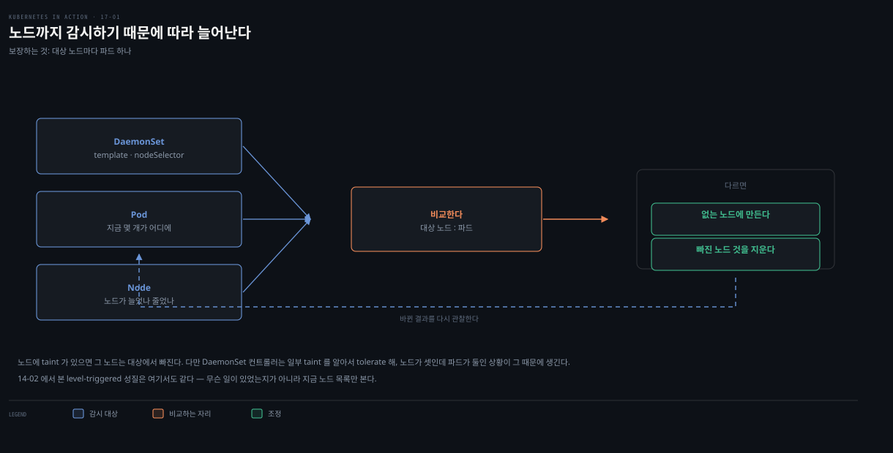
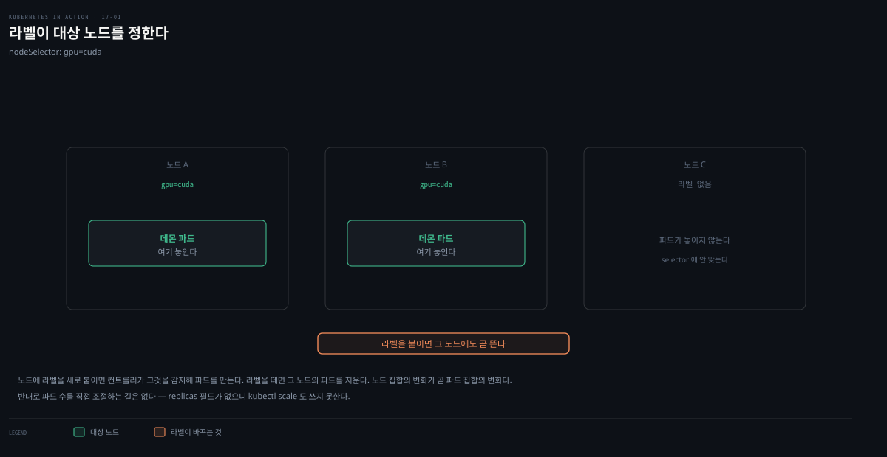

# DaemonSet 기초 — 노드마다 하나·node selector·업데이트
---
> DaemonSet은 클러스터의 각 노드에 파드 replica를 정확히 하나씩 띄웁니다. replica 수를 지정하지 않고, 컨트롤러가 노드 수만큼 파드를 만들어 각기 다른 노드에 스케줄합니다. node selector로 일부 노드에만 배포하고, control plane 노드에는 taint를 tolerate해야 배포됩니다.


> 이 문서를 읽고 나면 DaemonSet이 ReplicaSet과 무엇이 다른지 설명하고, 왜 노드 수보다 파드가 적을 수 있는지 taint로 근거를 대며, node selector와 업데이트 전략(RollingUpdate·OnDelete)을 말할 수 있습니다.


## 진입 — 노드마다 정확히 하나

> 앞 장들에서 Deployment·StatefulSet으로 여러 replica를 노드에 분산했습니다. 하지만 노드마다 정확히 하나를 돌리고 싶을 때 — 메트릭 수집·로그 집계 같은 노드별 시스템 서비스 — 는 DaemonSet을 씁니다.

DaemonSet은 각 클러스터 노드에 파드 replica가 정확히 하나 돌도록 보장하는 API 오브젝트입니다. 기본적으로 모든 노드에 배포되지만, node selector로 일부 노드로 제한할 수 있습니다.


## 1. DaemonSet 오브젝트

> DaemonSet은 Pod 템플릿·label selector를 갖지만 replica 수는 지정하지 않습니다 — 컨트롤러가 노드 수만큼 파드를 만들어 각기 다른 노드에 하나씩 스케줄합니다. ReplicaSet은 여러 파드를 한 노드에 몰 수 있지만 DaemonSet은 노드당 하나입니다.


### 어떤 워크로드인가

DaemonSet은 각 노드에 시스템 수준 서비스를 제공하는 인프라 파드를 배포합니다 — 노드 시스템 프로세스·파드의 로그 수집, 프로세스 모니터링 데몬, 클러스터 네트워크·스토리지 제공, 소프트웨어 패키지 설치·업데이트, 노드 장치 인터페이스 등입니다. Service 트래픽을 라우팅하는 **Kube Proxy**, 파드 통신 네트워크를 제공하는 **CNI 플러그인**이 대표적으로 DaemonSet(kube-system 네임스페이스)으로 배포됩니다.

init 스크립트나 systemd로도 노드에 시스템 소프트웨어를 돌릴 수 있지만, DaemonSet을 쓰면 클러스터의 모든 워크로드를 같은 방식으로 관리하게 됩니다.

### reconciliation loop

DaemonSet은 Pod 템플릿과 label selector를 갖습니다. 컨트롤러는 reconciliation 루프마다 selector에 맞는 파드를 찾아, **각 노드에 정확히 하나**가 있는지 확인하고 부족하면 만들고 남으면 지웁니다.



노드를 추가하면 컨트롤러가 그 노드용 파드를 만들고, 노드를 제거하면 연결된 Pod 오브젝트를 지웁니다. daemon 파드가 사라지면(수동 삭제 등) 즉시 재생성하고, selector에 맞는 파드가 추가로 나타나면(사용자가 만든 경우) 즉시 삭제합니다.


## 2. DaemonSet으로 파드 배포

> DaemonSet 매니페스트는 ReplicaSet과 비슷하되 replicas가 없습니다. status는 파드 수가 아니라 노드 수를 나타내는 정수 필드로 구성됩니다.

```yaml
apiVersion: apps/v1
kind: DaemonSet
metadata:
  name: demo
spec:
  selector:          # 이 DaemonSet에 속하는 파드를 정하는 label selector
    matchLabels:
      app: demo
  template:          # 파드를 만드는 템플릿(selector와 label 일치 필수)
    metadata:
      labels:
        app: demo
    spec:
      containers:
      - name: demo
        image: busybox
        command:
        - sleep
        - infinity
```

selector는 불변이지만, selector에 계속 맞는 한 label은 바꿀 수 있습니다. selector를 바꾸려면 DaemonSet을 삭제·재생성해야 합니다(`--cascade=orphan`으로 파드 보존 가능).

```bash
kubectl get ds           # ds는 DaemonSet 약어
# NAME  DESIRED  CURRENT  READY  UP-TO-DATE  AVAILABLE  NODE SELECTOR  AGE
# demo  2        2        2      2           2          <none>         7s
kubectl get ds -o wide   # 컨테이너·이미지·selector 추가 표시
kubectl describe ds demo # Node-Selector·status·template·events
```

### status는 노드 수

```yaml
status:
  currentNumberScheduled: 2   # DaemonSet 파드가 하나 이상 도는 노드 수
  desiredNumberScheduled: 2   # daemon 파드가 돌아야 하는 노드 수
  numberAvailable: 2          # available daemon 파드가 도는 노드 수
  numberMisscheduled: 0       # 돌면 안 되는데 도는 노드 수
  numberReady: 2              # ready daemon 파드가 도는 노드 수
  updatedNumberScheduled: 2   # 최신 템플릿 파드가 도는 노드 수
```

모든 status 필드가 파드 수가 아니라 **노드 수**입니다. 일부 설명이 노드에 파드가 둘 이상일 수 있음을 암시하는데, 업데이트 시 새 파드가 available이 될 때까지 옛 파드 옆에서 잠시 돌기 때문입니다. DaemonSet status는 클러스터 전체 파드 수가 아니라 DaemonSet이 서비스하는 노드 수에 관심을 둡니다.

### 왜 노드 수보다 파드가 적은가 — control plane taint

3 노드 클러스터인데 파드가 2개만 생기는 경우가 있습니다. node selector가 없어도 그렇습니다.

```bash
kubectl get pods -l app=demo -o wide   # kind-worker·kind-worker2에만
kubectl get nodes                       # control-plane·worker·worker2 (3개)
```

컨트롤러가 worker 노드에만 배포하고 **control plane 노드(kind-control-plane)에는 배포하지 않습니다**. control plane 노드는 클러스터를 제어하는 쿠버네티스 컴포넌트만 돌리기 위한 것입니다 — 컨테이너 격리는 별도 VM/머신만큼 강하지 않아, control plane에서 오작동하는 워크로드가 클러스터 전체 운영에 악영향을 줄 수 있습니다. 그래서 쿠버네티스는 명시적으로 허용할 때만 control plane에 워크로드를 스케줄하며, DaemonSet도 마찬가지입니다.

### control plane에 배포 — tolerations

일반 파드가 control plane에 스케줄되지 못하게 막는 메커니즘이 **taints and tolerations**입니다. daemon 파드가 모든 노드에 필요한 중요 서비스면(Kube Proxy 등) 배포해야 합니다.

```bash
kubectl get ds -n kube-system
# kindnet     3  3  3  3  3  <none>            # CNI 네트워크
# kube-proxy  3  3  3  3  3  kubernetes.io...  # 모든 노드(3)
```

kube-proxy·kindnet은 3 노드 전부에 배포됩니다. 매니페스트를 보면 방법이 드러납니다.

```yaml
spec:
  template:
    spec:
      tolerations:
      - operator: Exists   # 이 파드는 모든 노드 taint를 tolerate
```

`operator: Exists`는 모든 taint를 tolerate해, 파드를 절대적으로 모든 노드에 배포합니다. 이 줄은 Pod 템플릿의 일부이지 DaemonSet 직접 속성이 아니지만, 노드가 거부할 파드를 만들 이유가 없어 DaemonSet 컨트롤러가 고려합니다. taint·toleration 자세한 규칙은 [스케줄링과 노드 선택](../../kubernetes/05_operations/05-05.%EC%8A%A4%EC%BC%80%EC%A4%84%EB%A7%81%EA%B3%BC%20%EB%85%B8%EB%93%9C%20%EC%84%A0%ED%83%9D.md) 개념본을 참고합니다.

### daemon 파드 검사 — nodeAffinity

daemon 파드 매니페스트를 보면 Pod 템플릿 label 외에 컨트롤러가 추가한 label이 있습니다 — `controller-revision-hash`(StatefulSet과 같은 역할, 업데이트 시 옛/새 템플릿 파드 구분)와 obsolete한 `pod-template-generation`입니다. ownerReferences는 daemon 파드가 **DaemonSet에 직접 속함**을 나타냅니다(Deployment처럼 중간 오브젝트 없음).

```yaml
spec:
  affinity:
    nodeAffinity:
      requiredDuringSchedulingIgnoredDuringExecution:
        nodeSelectorTerms:
        - matchFields:
          - key: metadata.name
            operator: In
            values:
            - kind-worker   # 이 파드는 특정 노드에 스케줄
```

각 파드에 `spec.affinity.nodeAffinity`가 다르게 설정되어 특정 노드에 스케줄됩니다. 이 부분은 템플릿에 없고 컨트롤러가 파드마다 추가합니다. 옛 버전은 `spec.nodeName`을 직접 설정해 Scheduler 없이 스케줄했지만, 지금은 nodeAffinity를 설정하고 nodeName은 비워 **Scheduler에 스케줄을 맡깁니다**(리소스 요구사항 등도 고려).


## 3. node selector로 노드 서브셋에 배포

> DaemonSet은 taint를 tolerate하지 않는 노드를 제외한 모든 노드에 배포하지만, node selector로 특정 노드 서브셋에만 배포할 수 있습니다. node selector와 pod selector는 다릅니다 — 전자는 노드를, 후자는 파드를 필터링합니다.



특수 하드웨어가 일부 노드에만 있으면 관련 소프트웨어를 그 노드에만 돌리고 싶습니다. `spec.template.spec.nodeSelector`로 지정합니다.

```yaml
spec:
  template:
    spec:
      nodeSelector:
        gpu: cuda    # 이 label을 가진 노드에만 배포
```

```bash
kubectl get ds
# demo  0  0  0  0  0  gpu=cuda  46m   ← 맞는 노드 없어 파드 0
kubectl get nodes -l gpu=cuda
# No resources found
```

### label로 노드를 범위에 넣고 빼기

DaemonSet 컨트롤러는 DaemonSet·Pod뿐 아니라 **Node 오브젝트도 감시**합니다. 노드 label을 바꾸면 reconciliation을 돌립니다.

```bash
kubectl label node kind-worker2 gpu=cuda   # label 추가 → 파드 생성
kubectl label node kind-worker2 gpu-       # label 제거 → 파드 삭제
```

### 표준 노드 label 활용

쿠버네티스가 자동으로 붙이는 표준 label(`kubernetes.io/arch`·`kubernetes.io/os`·`kubernetes.io/hostname`)을 node selector에 쓸 수 있습니다. AMD·ARM 노드가 섞인 클러스터면 아키텍처별 이미지를 배포하도록 DaemonSet 두 개를 만듭니다.

```yaml
      nodeSelector:
        kubernetes.io/arch: amd64   # 다른 DaemonSet은 arm
```

이미지뿐 아니라 컴퓨트 리소스도 다르게 주려면 이 다중 DaemonSet 방식이 이상적입니다. 단 이미지만 다르고 나머지가 같다면 multiarch 이미지 하나로 단일 DaemonSet이 낫습니다.

### node selector 변경 — 가변

pod label selector와 달리 node selector는 **가변**입니다. JSON patch 형식으로 바꿀 수 있습니다.

```bash
kubectl patch ds demo --type='json' -p='[{"op": "remove", "path": "/spec/template/spec/nodeSelector"}]'
```


## 4. DaemonSet 업데이트

> Pod 템플릿을 바꾸면 컨트롤러가 파드를 교체합니다. RollingUpdate(기본·maxSurge 0)와 OnDelete를 지원합니다. daemon은 노드당 하나만 돌아야 해 maxSurge 기본이 0입니다.

| 값 | 설명 |
|----|------|
| RollingUpdate | 파드를 하나씩 교체. 새 파드가 ready가 되고 minReadySeconds가 지난 뒤 다음 노드로. **기본** |
| OnDelete | 반자동. 각 파드를 수동 삭제하면 새 템플릿으로 교체. 원하는 속도로 |

RollingUpdate는 Deployment의 것과, OnDelete는 StatefulSet의 것과 비슷합니다. Deployment처럼 maxSurge·maxUnavailable를 설정하지만 **기본값이 다릅니다**.

### RollingUpdate — maxSurge 0

```yaml
spec:
  minReadySeconds: 30
  updateStrategy:
    type: RollingUpdate
    rollingUpdate:
      maxSurge: 0          # 기본값
      maxUnavailable: 1    # 기본값
```

`maxSurge`가 0이라 컨트롤러가 기존 daemon 파드를 **먼저 중지**한 뒤 새것을 만듭니다. 0이 기본이자 가장 합리적인데, daemon 워크로드는 보통 노드 에이전트라 한 번에 한 인스턴스만 돌아야 하기 때문입니다. maxSurge를 0보다 크게 하면 업데이트 중 한 노드에 인스턴스 둘이 도는데, 대부분의 데몬은 lock으로 다중 인스턴스를 막아 새 파드가 lock을 못 얻어 ready가 안 되고 업데이트가 실패합니다.

`maxUnavailable` 1은 한 번에 노드 하나만 업데이트합니다 — 이전 노드 파드가 ready·available이 되기 전엔 다음으로 안 넘어갑니다. 더 빠르게 하려면 maxUnavailable을 올리고, 노드 수보다 크게 하면 모든 노드가 동시 업데이트(Deployment의 Recreate처럼)됩니다.

> **주의.** DaemonSet에 Recreate를 구현하려면 maxSurge 0·maxUnavailable을 10000 이상(항상 노드 수보다 큼)으로 둡니다. 또 기존 daemon 파드의 readiness probe가 실패하면 컨트롤러가 즉시 삭제·교체하며, 이때 maxSurge·maxUnavailable은 무시됩니다.

### OnDelete — 반자동

```yaml
spec:
  updateStrategy:
    type: OnDelete   # 파라미터 없음
```

수동 삭제한 파드만 교체합니다. `kubectl delete po demo-k2d6k --wait=false`로 삭제하면(삭제 완료를 안 기다리고 종료) 새 v3 파드로 교체되고 다른 파드는 v2로 남습니다. 클러스터 중요 파드를 더 통제된 방식으로 업데이트할 때 유용합니다 — RollingUpdate는 첫 노드 업데이트가 그 노드의 다른 파드를 망가뜨려도 minReadySeconds만 지나면 다음으로 진행해 연쇄 장애를 낼 수 있지만, OnDelete는 각 daemon 파드 업데이트 후 다른 파드의 정상 동작을 확인하고 다음을 지울 수 있습니다.


## 5. DaemonSet 삭제

> DaemonSet을 삭제하면 모든 daemon 파드가 함께 삭제됩니다.

```bash
kubectl delete ds demo   # demo 파드 전부 Terminating
```

daemon 파드는 Deployment·StatefulSet 파드와 달리 노드 파일시스템·네트워크 인터페이스·기타 하드웨어에 접근하는 경우가 많습니다. 다음 편에서 다룹니다.

> **Spring 관점.** Spring Boot 앱은 보통 Deployment로 배포하지 DaemonSet으로 하지 않습니다. DaemonSet은 그 아래 인프라 — 노드마다 도는 Fluent Bit(로그)·node-exporter(메트릭)·Datadog agent 같은 관측 에이전트 — 를 배포합니다. Boot 앱은 이 에이전트가 수집한 데이터를 소비하는 쪽이고, 에이전트 자체를 DaemonSet으로 노드마다 하나씩 띄우는 것이 노드별 완전 커버리지를 보장합니다.


## 면접에서 받을 만한 질문

> 아래 질문에 먼저 스스로 답해 본 뒤, 챕터 끝의 정답과 맞춰 봅니다.

1. DaemonSet은 ReplicaSet과 무엇이 다른가요? replicas를 왜 지정하지 않나요?
2. 3 노드 클러스터인데 DaemonSet 파드가 2개만 생겼습니다. node selector도 없는데 왜인가요?
3. DaemonSet의 status 필드는 무엇을 세나요(파드? 노드?)? node selector와 pod selector는 어떻게 다른가요?
4. DaemonSet의 RollingUpdate에서 maxSurge 기본이 왜 0인가요?
5. OnDelete 전략은 클러스터 중요 daemon에 대해 RollingUpdate보다 무엇이 안전한가요?


## 정답 (자답 후 펼치기)

> 위 질문에 답해 본 다음 아래와 맞춰 봅니다. 순서는 질문과 1:1로 대응합니다.

### 정답 1 — DaemonSet vs ReplicaSet

DaemonSet은 Pod 템플릿·label selector를 갖는 점은 ReplicaSet과 같지만, **replica 수를 지정하지 않습니다** — 컨트롤러가 클러스터 노드 수만큼 파드를 만들고 각기 다른 노드에 정확히 하나씩 스케줄합니다. ReplicaSet은 파드를 클러스터에 흩뿌려 한 노드에 여러 개가 갈 수 있지만, DaemonSet은 노드당 하나입니다. 목적이 "몇 개를 돌릴까"가 아니라 "모든 노드에 하나씩"이라 replicas가 의미 없습니다.

### 정답 2 — control plane taint

DaemonSet이 node selector 없이도 control plane 노드(kind-control-plane)에는 배포하지 않기 때문입니다. control plane 노드는 클러스터 제어 컴포넌트만 돌리기 위한 것이라 **taint**가 걸려 있고, 쿠버네티스는 명시적으로 허용(toleration)할 때만 워크로드를 스케줄합니다 — 오작동 워크로드가 클러스터 전체에 악영향을 줄 위험 때문입니다. worker 2개에만 배포되어 파드가 2개입니다. 모든 노드에 배포하려면 Pod 템플릿에 `tolerations: [{operator: Exists}]`를 둡니다.

### 정답 3 — status는 노드 수, selector 구분

DaemonSet의 status 필드(currentNumberScheduled·numberReady 등)는 모두 **파드 수가 아니라 노드 수**를 셉니다 — 관심사가 클러스터 전체 파드 수가 아니라 DaemonSet이 서비스하는 노드 수이기 때문입니다(업데이트 시 노드에 파드가 잠시 둘일 수 있음). node selector는 파드를 스케줄할 **노드**를 필터링하고, pod(label) selector는 **어느 파드가 DaemonSet에 속하는지**를 정합니다 — 전자는 노드, 후자는 파드가 대상입니다.

### 정답 4 — maxSurge 0 기본

daemon 워크로드는 보통 노드 에이전트·데몬이라 한 노드에 **한 인스턴스만 돌아야** 하기 때문입니다. maxSurge가 0이면 컨트롤러가 기존 파드를 먼저 중지한 뒤 새것을 만들어, 노드에 인스턴스가 하나만 유지됩니다. maxSurge를 0보다 크게 하면 업데이트 중 한 노드에 둘이 도는데, 대부분의 데몬은 lock으로 다중 인스턴스를 막아 새 파드가 lock을 못 얻어 ready가 안 되고 업데이트가 실패합니다.

### 정답 5 — OnDelete의 안전성

RollingUpdate는 첫 노드의 daemon 파드 업데이트가 그 노드의 **다른 파드들을 망가뜨려도** minReadySeconds만 지나면 다음 노드로 진행합니다 — daemon의 readiness probe가 같은 노드의 다른 파드 상태까지 확인하지는 않으므로, 연쇄 장애가 클러스터 전체를 무너뜨릴 수 있습니다. OnDelete는 각 daemon 파드를 수동 삭제해야 교체되므로, 한 파드 업데이트 후 그 노드의 다른 파드가 정상인지 확인하고 다음을 지울 수 있어 클러스터 중요 daemon에 더 안전합니다.


## 관련 문서

> 이 편은 DaemonSet의 기초(노드당 하나·node selector·업데이트)를 다룹니다. 이어지는 [17-02](./17-02.%EB%85%B8%EB%93%9C%20%EC%97%90%EC%9D%B4%EC%A0%84%ED%8A%B8%20%ED%8A%B9%EC%88%98%20%EA%B8%B0%EB%8A%A5%20%E2%80%94%20privileged%C2%B7hostPath%C2%B7hostNetwork%C2%B7PriorityClass.md)는 노드 에이전트가 노드 자원에 접근하는 특수 기능을 다룹니다.

- [핵심 워크로드](../../kubernetes/01_foundation/01-02.%ED%95%B5%EC%8B%AC%20%EC%9B%8C%ED%81%AC%EB%A1%9C%EB%93%9C.md) — DaemonSet·워크로드 종류 통합 개념본(개념 위임)
- [스케줄링과 노드 선택](../../kubernetes/05_operations/05-05.%EC%8A%A4%EC%BC%80%EC%A4%84%EB%A7%81%EA%B3%BC%20%EB%85%B8%EB%93%9C%20%EC%84%A0%ED%83%9D.md) — taint·toleration·nodeSelector·nodeAffinity 개념본
- [17-02. 노드 에이전트 특수 기능 — privileged·hostPath·hostNetwork·PriorityClass](./17-02.%EB%85%B8%EB%93%9C%20%EC%97%90%EC%9D%B4%EC%A0%84%ED%8A%B8%20%ED%8A%B9%EC%88%98%20%EA%B8%B0%EB%8A%A5%20%E2%80%94%20privileged%C2%B7hostPath%C2%B7hostNetwork%C2%B7PriorityClass.md) — 다음 편
- [16-03. StatefulSet 업데이트와 Operator](./16-03.StatefulSet%20%EC%97%85%EB%8D%B0%EC%9D%B4%ED%8A%B8%EC%99%80%20Operator%20%E2%80%94%20partition%C2%B7OnDelete%C2%B7CRD.md) — ControllerRevision·OnDelete(앞 장)
- [14-02. ReplicaSet 컨트롤러 — reconciliation·장애복구·삭제](./14-02.ReplicaSet%20%EC%BB%A8%ED%8A%B8%EB%A1%A4%EB%9F%AC%20%E2%80%94%20reconciliation%C2%B7%EC%9E%A5%EC%95%A0%EB%B3%B5%EA%B5%AC%C2%B7%EC%82%AD%EC%A0%9C.md) — reconciliation loop(공통 패턴)
- 원서: 《Kubernetes in Action, 2nd Ed.》 Ch17 §17.1 — [Manning](https://www.manning.com/books/kubernetes-in-action-second-edition), [예제 코드](https://github.com/luksa/kubernetes-in-action-2nd-edition/tree/master/Chapter17)
- 공식 문서: [DaemonSet](https://kubernetes.io/docs/concepts/workloads/controllers/daemonset/)
