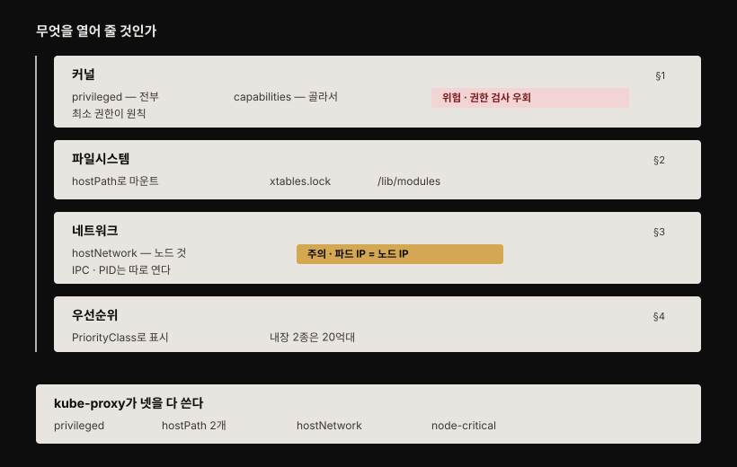

# 노드 에이전트 특수 기능 — privileged·hostPath·hostNetwork·PriorityClass
---
> 노드 에이전트·데몬은 일반 워크로드와 달리 노드에 더 넓은 접근이 필요합니다. securityContext로 커널 접근(privileged 또는 capabilities), hostPath로 노드 파일시스템, hostNetwork로 노드 네트워크를 열고, PriorityClass로 시스템 파드를 중요하게 표시합니다.


> 이 문서를 읽고 나면 privileged와 capabilities의 차이를 설명하고, hostPath·hostNetwork가 daemon 파드에서 어떻게 쓰이는지 근거를 대며, PriorityClass로 노드 중요 파드를 어떻게 보호하는지 말할 수 있습니다.


## 진입 — 노드로부터 격리를 풀어야 할 때

> 일반 워크로드는 노드에서 격리됩니다 — 컨테이너는 자기 Linux 네임스페이스에 살아 노드의 장치·파일·커널 시스템 콜에 접근하지 못합니다. 노드 에이전트·데몬이 이 제약을 벗어나려면 Pod 매니페스트에 명시해야 합니다.

kube-system 네임스페이스의 DaemonSet(kube-proxy·kindnet)이 이 특수 기능의 좋은 예입니다. 이 편은 kube-proxy를 중심으로 각 기능을 봅니다.

아래는 이 편 전체를 한 장으로 이은 지도입니다. 앞 편과 달리 단계가 순서대로 이어지지 않습니다. 네 축은 각각 독립해서 갈라지고, 갈리는 기준은 **무엇을 열어 줄 것인가**입니다.

- §1 커널 — privileged로 전부 열거나 capabilities로 골라 엽니다
- §2 파일시스템 — hostPath로 노드의 경로를 마운트합니다
- §3 네트워크 — hostNetwork로 노드의 네트워크를 그대로 씁니다
- §4 우선순위 — 앞의 셋과 달리 격리를 여는 게 아니라 스케줄 자리를 지킵니다

맨 아래 상자는 kube-proxy 하나가 네 기능을 모두 쓴다는 것을 보입니다. 색이 붙은 곳은 두 군데입니다. 붉은 띠는 privileged가 커널 권한 검사를 통째로 우회한다는 뜻이고, 앰버 띠는 hostNetwork를 켜면 파드가 자기 IP 없이 노드 IP를 쓴다는 뜻입니다.




## 1. 커널 접근 — privileged와 capabilities

> 커널 시스템 콜 일부는 노드나 다른 컨테이너에 악영향을 줄 수 있어 기본적으로 막힙니다. 컨테이너에 커널 전체 접근을 주려면 privileged, 필요한 시스템 콜 그룹만 주려면 capabilities를 씁니다.

### privileged 컨테이너

컨테이너 프로세스에 OS 커널 전체 접근을 주려면 privileged로 표시합니다.

```yaml
spec:
  template:
    spec:
      containers:
      - name: kube-proxy
        securityContext:
          privileged: true   # 커널 전체 접근
```

kube-proxy 컨테이너의 `securityContext.privileged`가 true입니다. 프로세스에 호스트 커널 root 접근을 줘, 노드의 네트워크 패킷 필터링 규칙을 수정할 수 있게 합니다 — 쿠버네티스 Service가 이렇게 구현됩니다.

### capabilities — 최소 권한

privileged 컨테이너는 모든 커널 권한 검사를 우회해 커널 전체 접근을 갖습니다. 그런데 노드 에이전트는 보통 시스템 콜의 일부만 필요합니다. 그래서 보안상 privileged는 이상적이지 않습니다. 필요한 **최소 시스템 콜만** 주는 편이 낫고, 그 지정을 capabilities로 합니다[^capabilities].

```yaml
spec:
  template:
    spec:
      containers:
      - name: kindnet-cni
        securityContext:
          capabilities:
            add:
            - NET_RAW      # 특수 소켓·임의 주소 바인딩
            - NET_ADMIN    # 인터페이스 설정·방화벽·라우팅 테이블
          privileged: false
```

kindnet은 privileged 대신 NET_RAW·NET_ADMIN만 추가합니다. NET_RAW는 특수 소켓 타입 사용과 임의 주소 바인딩을, NET_ADMIN은 인터페이스 설정·방화벽 관리·라우팅 테이블 변경 같은 특권 네트워크 작업을 허용합니다 — 노드의 모든 파드 네트워크를 설정하는 컨테이너에 필요한 것들입니다.


## 2. 노드 파일시스템 접근 — hostPath

> 노드 에이전트가 호스트 파일시스템에 접근하려면 hostPath 볼륨을 씁니다. kube-proxy는 노드의 xtables.lock과 커널 모듈 디렉토리에 접근합니다.

노드 에이전트는 호스트 노드 파일시스템 접근이 필요할 수 있습니다 — 예를 들어 모든 노드에 소프트웨어 패키지를 설치하는 에이전트입니다. hostPath 볼륨으로 접근하며(8장에서 학습), daemon 파드 맥락에서 쓰임을 봅니다.

```yaml
spec:
  template:
    spec:
      volumes:
      - hostPath:
          path: /run/xtables.lock   # iptables/nftables lock 파일
          type: FileOrCreate
        name: xtables-lock
      - hostPath:
          path: /lib/modules        # 노드에 설치된 커널 모듈
          type: ""
        name: lib-modules
```

첫 볼륨은 kube-proxy 프로세스가 노드의 xtables.lock 파일에 접근하게 합니다 — IP 패킷 필터링을 조작하는 iptables/nftables 도구가 쓰는 파일입니다. 둘째 볼륨은 노드에 설치된 커널 모듈에 접근하게 합니다.


## 3. 노드 네트워크·네임스페이스 — hostNetwork

> 각 파드는 보통 자기 네트워크 인터페이스를 갖지만, daemon 파드는 hostNetwork로 노드의 인터페이스를 직접 쓸 수 있습니다. 그러면 파드가 노드 IP를 쓰고 자기 IP를 안 받습니다. hostIPC·hostPID로 IPC·PID 네임스페이스도 공유할 수 있습니다.

```yaml
spec:
  template:
    spec:
      dnsPolicy: ClusterFirst
      hostNetwork: true   # 자기 네트워크 대신 노드 네트워크 사용
```

`hostNetwork: true`면 파드가 자기 것 대신 호스트 노드의 네트워크 환경(장치·스택·포트)을 씁니다 — 컨테이너가 아니라 노드에서 직접 도는 프로세스처럼요. 파드는 자기 IP도 안 받고 노드 주소를 씁니다.

```bash
kubectl -n kube-system get po -o wide
# kube-proxy-gj9pd   ...   172.18.0.4   ← 파드 IP = 노드 IP
# kube-proxy-rhjqr   ...   172.18.0.2
# kube-proxy-vq5g8   ...   172.18.0.3
```

각 kube-proxy 파드 IP가 자기 노드 IP와 일치합니다. 프로세스가 노드 IP의 네트워크 포트로 접근 가능해야 할 때 유용합니다.

> **주의.** 다른 방법은 파드가 자기 네트워크를 쓰되 컨테이너 포트 목록의 `hostPort` 필드로 하나 이상의 호스트 포트를 컨테이너로 포워딩하는 것입니다([17-03](./17-03.%EB%A1%9C%EC%BB%AC%20daemon%20%ED%8C%8C%EB%93%9C%20%ED%86%B5%EC%8B%A0%20%E2%80%94%20hostPort%C2%B7hostNetwork%C2%B7internalTrafficPolicy.md)).

`hostNetwork: true` 파드도 다른 네임스페이스 타입은 계속 자기 것을 써서 다른 면에서는 노드로부터 격리됩니다 — 자기 IPC·PID 네임스페이스를 써 다른 프로세스를 보거나 IPC로 통신하지 못합니다. 노드의 IPC·PID 네임스페이스를 쓰려면 Pod spec의 `hostIPC`·`hostPID`를 설정합니다.


## 4. daemon 파드를 중요하게 표시 — PriorityClass

> 노드는 소수의 시스템 파드와 다수의 일반 파드를 돌립니다. 시스템 파드가 더 중요하므로, PriorityClass로 우선순위를 매겨 노드가 꽉 찼을 때 일반 파드를 밀어내고 시스템 파드를 스케줄하게 합니다.

기본적으로 DaemonSet 파드는 Deployment·StatefulSet 파드보다 더 중요하지 않습니다. daemon 파드를 더(또는 덜) 중요하게 표시하려면 **PriorityClass** 오브젝트를 씁니다.

```bash
kubectl get priorityclasses
# system-cluster-critical   2000000000   false   9h
# system-node-critical      2000001000   false   9h
```

쿠버네티스는 이 두 PriorityClass를 기본으로 내장합니다[^priority-range]. system-cluster-critical 파드는 클러스터 운영에, system-node-critical 파드는 개별 노드 운영에 중요합니다. 후자는 다른 노드로 옮길 수 없습니다.

직접 만들 수도 있지만 제약이 있습니다. 값은 **10억 이하**여야 하고, 이름은 유효한 DNS subdomain이어야 하며 `system-` 접두사를 붙일 수 없습니다[^priority-range]. 10억을 넘는 값은 위 두 내장 클래스처럼 시스템 파드용으로 예약돼 있습니다.

```pseudocode
system-cluster-critical: 2000000000  — 클러스터에 도는 시스템 파드(필요 시 다른 노드로 이동 가능)
system-node-critical:    2000001000  — 현재 노드에서 이동 불가한 시스템 파드
```

값이 높을수록 우선순위가 높습니다. 위 출력의 세 번째 열(`false`)은 `globalDefault`로, `priorityClassName`을 안 쓴 파드에 이 클래스를 기본 적용할지를 나타냅니다. 기본 클래스가 하나도 없으면 그런 파드의 우선순위는 0입니다[^priority-range].

축출 여부는 별도 필드가 정합니다. `preemptionPolicy`의 기본값은 `PreemptLowerPriority`라 초과 예약된 노드에 스케줄될 때 낮은 우선순위 파드를 밀어냅니다. `Never`로 두면 줄에서는 앞서되 축출은 하지 않습니다[^priority-range]. Pod spec의 `priorityClassName`으로 클래스를 지정합니다.

```yaml
spec:
  template:
    spec:
      priorityClassName: system-node-critical
```

kube-proxy는 system-node-critical입니다 — 노드는 kube-proxy 파드 없이 제대로 동작할 수 없기(그 노드 파드가 쿠버네티스 Service를 못 씀) 때문에 다른 파드보다 우선순위가 높아야 합니다. 노드 운영에 중요한 노드 에이전트용 DaemonSet을 만들 때 priorityClassName을 적절히 설정합니다.

> **Spring 관점.** 관측 에이전트(로그·메트릭 수집)를 DaemonSet으로 배포할 때, 노드가 꽉 차면 에이전트가 일반 앱 파드에 밀려 스케줄 안 될 수 있습니다. 에이전트가 노드 관측에 필수라면 커스텀 PriorityClass(또는 system-node-critical)를 줘, 리소스 압박 시에도 에이전트가 살아남게 합니다. 반대로 애플리케이션 파드가 리소스 경쟁에서 밀리지 않게 하려면, 중요 앱에도 높은 PriorityClass를 부여하는 판단이 필요합니다.


## 면접에서 받을 만한 질문

> 아래 질문에 먼저 스스로 답해 본 뒤, 챕터 끝의 정답과 맞춰 봅니다.

1. privileged 컨테이너와 capabilities는 무엇이 다르고, 보안 관점에서 어느 쪽이 나은가요?
2. daemon 파드가 노드 파일시스템에 접근하려면 무엇을 쓰나요? kube-proxy는 무엇에 접근하나요?
3. hostNetwork: true면 파드에 무슨 일이 생기나요? IPC·PID는 어떻게 되나요?
4. 왜 daemon 파드를 일반 파드와 다르게 취급해야 하나요? 어떻게 하나요?
5. system-node-critical과 system-cluster-critical의 차이는 무엇인가요?


## 정답 (자답 후 펼치기)

> 위 질문에 답해 본 다음 아래와 맞춰 봅니다. 순서는 질문과 1:1로 대응합니다.

### 정답 1 — privileged vs capabilities

privileged 컨테이너는 모든 커널 권한 검사를 우회해 **커널 전체 접근**을 갖습니다(root 수준). capabilities는 필요한 **시스템 콜 그룹만** 선별해 주는 방식으로, 예를 들어 NET_RAW·NET_ADMIN만 추가합니다. 보안 관점에서는 capabilities가 낫습니다 — 노드 에이전트는 보통 커널 기능 일부만 필요한데 privileged로 돌리면 전체 접근을 줘 공격면이 커지기 때문입니다. 최소 권한 원칙에 따라 필요한 capability만 주는 것이 권장됩니다.

### 정답 2 — hostPath와 kube-proxy

daemon 파드가 노드 파일시스템에 접근하려면 **hostPath 볼륨**을 씁니다. 노드의 경로를 컨테이너에 마운트하는 방식입니다. kube-proxy가 쓰는 두 볼륨은 이렇습니다.

- `/run/xtables.lock` — iptables/nftables가 IP 패킷 필터링을 조작할 때 쓰는 lock 파일
- `/lib/modules` — 노드에 설치된 커널 모듈

둘 다 노드의 패킷 필터링 규칙을 조작해 Service를 구현하는 데 필요합니다.

### 정답 3 — hostNetwork의 효과

`hostNetwork: true`면 파드가 자기 네트워크 대신 **호스트 노드의 네트워크 환경**(장치·스택·포트)을 씁니다 — 노드에서 직접 도는 프로세스처럼요. 파드는 자기 IP를 받지 않고 **노드 IP를 씁니다**(kube-proxy 파드 IP = 노드 IP). 하지만 다른 네임스페이스 타입은 계속 자기 것을 써, IPC·PID 네임스페이스는 여전히 격리됩니다(다른 프로세스를 못 봄). 노드의 IPC·PID를 쓰려면 `hostIPC`·`hostPID`를 별도로 설정해야 합니다.

### 정답 4 — daemon 파드를 다르게 취급

시스템 파드는 일반 워크로드 파드보다 중요하기 때문입니다 — 노드가 꽉 차 시스템 파드를 스케줄 못 하면, 쿠버네티스가 일부 일반 파드를 축출해 자리를 만들어야 합니다. **PriorityClass** 오브젝트로 우선순위를 매깁니다(값이 높을수록 우선). Pod spec의 `priorityClassName`으로 지정하며, 노드 운영에 필수인 daemon(kube-proxy 등)에는 system-node-critical 같은 높은 클래스를 줍니다.

### 정답 5 — node-critical vs cluster-critical

둘의 차이는 "그 파드가 이 노드에 반드시 있어야 하는가"입니다.

- **system-node-critical**(값 2000001000) — 개별 노드 운영에 중요한 파드입니다. 현재 노드에서 **다른 노드로 이동할 수 없습니다**. kube-proxy처럼 그 노드에 반드시 있어야 하는 것들입니다.
- **system-cluster-critical**(값 2000000000) — 클러스터 운영에 중요하지만 필요하면 **다른 노드로 이동 가능**한 파드입니다.

node-critical 값이 더 높아 우선순위도 더 높습니다. 노드 없이 못 도는 파드가 클러스터 전역 파드보다 그 노드에서 우선한다는 뜻입니다. 두 값이 20억대인 것도 우연이 아닙니다. 사용자가 만드는 PriorityClass는 값이 **10억을 넘을 수 없으므로**[^priority-range], 값 기준으로는 20억대인 내장 두 클래스보다 낮은 것만 만들 수 있습니다.


## 관련 문서

> 이 편은 daemon 파드의 노드 접근 특수 기능을 다룹니다. 이어지는 [17-03](./17-03.%EB%A1%9C%EC%BB%AC%20daemon%20%ED%8C%8C%EB%93%9C%20%ED%86%B5%EC%8B%A0%20%E2%80%94%20hostPort%C2%B7hostNetwork%C2%B7internalTrafficPolicy.md)는 로컬 daemon 파드와 통신하는 세 방법을 다룹니다.

- [스케줄링과 노드 선택](../../kubernetes/05_scheduling/05-01.%EC%8A%A4%EC%BC%80%EC%A4%84%EB%A7%81%EA%B3%BC%20%EB%85%B8%EB%93%9C%20%EC%84%A0%ED%83%9D.md) — PriorityClass·preemption·taint 통합 개념본(개념 위임)
- [17-01. DaemonSet 기초 — 노드마다 하나·node selector·업데이트](./17-01.DaemonSet%20%EA%B8%B0%EC%B4%88%20%E2%80%94%20%EB%85%B8%EB%93%9C%EB%A7%88%EB%8B%A4%20%ED%95%98%EB%82%98%C2%B7node%20selector%C2%B7%EC%97%85%EB%8D%B0%EC%9D%B4%ED%8A%B8.md) — 앞 편
- [17-03. 로컬 daemon 파드 통신 — hostPort·hostNetwork·internalTrafficPolicy](./17-03.%EB%A1%9C%EC%BB%AC%20daemon%20%ED%8C%8C%EB%93%9C%20%ED%86%B5%EC%8B%A0%20%E2%80%94%20hostPort%C2%B7hostNetwork%C2%B7internalTrafficPolicy.md) — 다음 편
- [08-03. Secret과 Downward API](./08-03.Secret%EA%B3%BC%20Downward%20API.md) — hostPath 볼륨 타입(§17.2 참조)
- [11-02. 외부 노출 — NodePort·LoadBalancer·트래픽 정책](./11-02.%EC%99%B8%EB%B6%80%20%EB%85%B8%EC%B6%9C%20%E2%80%94%20NodePort%C2%B7LoadBalancer%C2%B7%ED%8A%B8%EB%9E%98%ED%94%BD%20%EC%A0%95%EC%B1%85.md) — hostNetwork와 노드 포트 비교
- 원서: 《Kubernetes in Action, 2nd Ed.》 Ch17 §17.2 — [Manning](https://www.manning.com/books/kubernetes-in-action-second-edition), [예제 코드](https://github.com/luksa/kubernetes-in-action-2nd-edition/tree/master/Chapter17)
- 공식 문서: [Configure a Security Context](https://kubernetes.io/docs/tasks/configure-pod-container/security-context/)

[^capabilities]: 공식 문서 [Configure a Security Context — Set capabilities for a Container](https://kubernetes.io/docs/tasks/configure-pod-container/security-context/#set-capabilities-for-a-container)가 컨테이너의 `securityContext`에 `capabilities` 필드를 넣어 개별 capability를 부여하는 방법을 설명합니다. 다만 `NET_RAW`·`NET_ADMIN` 각각이 정확히 어떤 연산을 허용하는지는 쿠버네티스 문서가 아니라 Linux의 [capabilities(7)](https://man7.org/linux/man-pages/man7/capabilities.7.html) man page가 1차 자료입니다 — 본문의 두 capability 설명은 원서 §17.2를 따랐습니다.
[^priority-range]: 공식 문서 [Pod Priority and Preemption](https://kubernetes.io/docs/concepts/scheduling-eviction/pod-priority-preemption/). "Kubernetes already ships with two PriorityClasses: `system-cluster-critical` and `system-node-critical`." 사용자 생성 클래스의 제약은 "it cannot be prefixed with `system-`"과 "A PriorityClass object can have any 32-bit integer value smaller than or equal to 1 billion ... Larger numbers are reserved for built-in PriorityClasses that represent critical system Pods."입니다. 본문의 두 수치(2000000000·2000001000)는 이 문서에 나오지 않으며, 실제 클러스터의 `kubectl get priorityclasses` 출력(원서 §17.2)이 근거입니다. `priorityClassName`을 지정하지 않고 `globalDefault` 클래스도 없으면 우선순위는 0입니다. DaemonSet에 이 필드를 두라는 권고는 [DaemonSet — How Daemon Pods are scheduled](https://kubernetes.io/docs/concepts/workloads/controllers/daemonset/#how-daemon-pods-are-scheduled)의 note에 있습니다.
