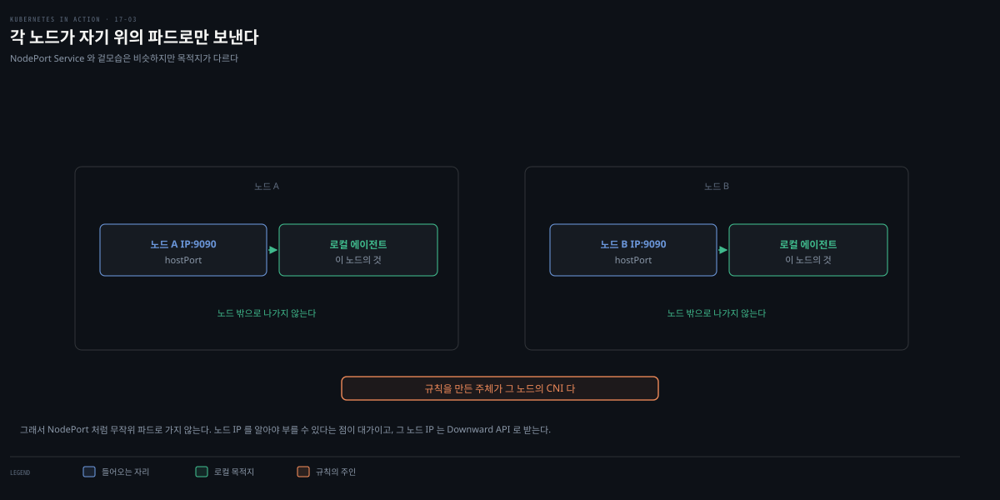
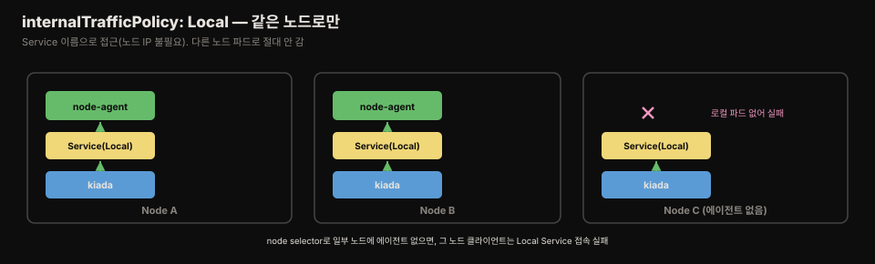

# 로컬 daemon 파드 통신 — hostPort·hostNetwork·internalTrafficPolicy
---
> daemon 파드는 같은 노드의 다른 파드에 서비스를 제공하는 경우가 많은데, 클라이언트는 로컬 daemon에 접속해야 합니다. 일반 Service는 무작위 파드로 포워딩하므로 안 됩니다. hostPort·hostNetwork로 노드 IP를 통해 접속하거나, internalTrafficPolicy Local Service로 같은 노드에만 포워딩합니다.


> 이 문서를 읽고 나면 클라이언트 파드를 로컬 daemon 파드에 연결하는 세 방법(hostPort·hostNetwork·Local Service)을 구분하고, 각각의 트레이드오프와 언제 무엇을 쓸지 근거를 대며 말할 수 있습니다.


## 진입 — 로컬 daemon에 연결하기

> daemon 파드가 같은 노드 파드에 서비스를 제공할 때, 클라이언트는 다른 노드가 아닌 로컬 daemon에 접속해야 합니다. 11장에서 파드는 Service로 통신한다고 배웠지만, Service는 트래픽을 무작위 파드(다른 노드일 수도)로 포워딩합니다.


예제로 시스템 정보(uptime·평균 사용률)를 HTTP로 제공하는 노드 에이전트를 씁니다. Kiada 앱이 노드에서 직접 조회하는 대신 이 에이전트에서 정보를 가져옵니다. 문제는 "각 Kiada 파드가 어떻게 자기 노드의 에이전트를 찾는가"입니다.

아래는 이 편 전체를 한 장으로 이은 지도입니다. 맨 위가 풀어야 할 문제입니다. 점선 아래 세 방법은 순서가 아니라 **병렬 대안**입니다. 어느 것을 골라도 목적지는 같고, 노드 IP를 거치느냐 Service 이름으로 닿느냐가 갈립니다.

- §1 hostPort — 노드 포트를 컨테이너로 포워딩합니다
- §2 hostNetwork — 에이전트가 노드 포트에 직접 바인딩합니다
- §3 Local Service — Service 이름만으로 같은 노드에 닿습니다
- §4 판정 — 셋 중 무엇을 언제 쓸지 정합니다

색이 붙은 곳은 두 군데입니다. 붉은 띠는 hostNetwork 파드가 노드의 임의 포트에 바인딩할 수 있어 노출면이 넓다는 뜻이고, 앰버 띠는 에이전트가 없는 노드에서 Local Service가 엔드포인트 0개처럼 동작한다는 뜻입니다.


## 1. hostPort — 노드 포트를 컨테이너로 포워딩

> hostPort는 노드의 네트워크 포트를 파드 포트로 포워딩합니다. NodePort Service와 달리, 각 노드는 트래픽을 로컬 에이전트 파드로만 보냅니다 — 에이전트가 없는 노드면 접속이 실패합니다.

```yaml
spec:
  template:
    spec:
      containers:
      - name: node-agent
        image: luksa/node-agent:0.1
        args:
        - --listen-address
        - :80              # 프로세스는 파드의 80 포트에 바인딩
        ports:
        - name: http
          containerPort: 80
          hostPort: 11559  # 노드의 11559로도 접근 가능
```

프로세스는 컨테이너 80 포트에만 바인딩하지만, 쿠버네티스가 노드의 11559로 받은 트래픽을 컨테이너 80으로 포워딩합니다.



각 노드는 hostPort 트래픽을 **로컬 에이전트 파드로만** 보냅니다. 11장의 NodePort Service는 노드 포트 접속을 클러스터의 무작위 파드(다른 노드일 수도)로 포워딩했지만, hostPort는 다릅니다. 에이전트 파드가 없는 노드면 hostPort 접속이 실패합니다.

```bash
kubectl get node kind-worker -o wide   # INTERNAL-IP 172.18.0.2
curl 172.18.0.2:11559
# kind-worker uptime: 5h58m10s, load average: 1.62, 1.83, 2.25, ...
```

### Kiada를 로컬 에이전트에 연결 — Downward API

Kiada는 `NODE_AGENT_URL` 환경변수로 에이전트를 찾습니다. 로컬 에이전트에 연결하려면 호스트 노드 IP와 11559를 넘겨야 하는데, 노드 IP는 Kiada 파드가 스케줄된 노드에 따라 달라 고정할 수 없습니다. **Downward API**로 노드 IP를 얻습니다(7장).

```yaml
env:
- name: NODE_IP
  valueFrom:
    fieldRef:
      fieldPath: status.hostIP     # Downward API로 노드 IP
- name: NODE_AGENT_URL
  value: http://$(NODE_IP):11559   # 노드 IP + 하드코딩 포트
```

새로고침할 때마다 "Request processed by ... node kind-worker2"의 노드 이름과 "Node info: kind-worker2 ..."의 노드 이름이 항상 일치합니다 — 각 Kiada 파드가 로컬 에이전트에서만 정보를 가져온다는 증거입니다.


## 2. hostNetwork — 노드 네트워크 직접 사용

> 에이전트 파드가 노드 네트워크 환경을 직접 쓰면, 바인딩한 포트로 노드 IP를 통해 접근 가능합니다. 클라이언트 관점에선 hostPort와 같지만, 에이전트가 노드 포트에 직접 바인딩한다는 점이 다릅니다.

```yaml
spec:
  template:
    spec:
      hostNetwork: true   # 노드 네트워크 사용
      containers:
      - name: node-agent
        args:
        - --listen-address
        - :11559           # 에이전트가 11559에 직접 바인딩
        ports:
        - name: http
          containerPort: 11559   # hostPort 불필요(컨테이너·호스트 포트 동일)
```

에이전트가 `--listen-address :11559`로 바인딩하므로 노드 인터페이스의 11559로 접근 가능합니다. 클라이언트 관점에선 hostPort와 정확히 같지만, 에이전트 관점에선 다릅니다 — 이전엔 80에 바인딩하고 노드 11559→컨테이너 80 포워딩이었는데, 지금은 11559에 직접 바인딩합니다. 클라이언트 쪽은 바뀐 게 없어 Kiada 앱은 그대로 동작합니다.


## 3. Local Service — internalTrafficPolicy

> 앞 두 방법은 노드 인터페이스로 에이전트가 노출되어 클라이언트가 노드 IP를 찾아야 하고 외부 접근도 막지 못합니다. daemon을 일반 파드처럼 Service로 접근하되 같은 노드로만 포워딩하려면 internalTrafficPolicy를 Local로 둡니다.

daemon을 외부에 노출하지 않거나 클라이언트가 다른 파드처럼 접근하게 하려면 Service를 씁니다. 하지만 Service는 연결을 무작위 daemon 파드(다른 노드일 수도)로 포워딩합니다. 11장에서 배운 대로 Service의 `internalTrafficPolicy`를 **Local**로 두면 같은 노드 안에서만 포워딩합니다.



internalTrafficPolicy가 Local인 Service는 노드별 Service처럼 동작해, 그 노드의 파드로만 백업됩니다 — 노드 A의 클라이언트는 노드 A의 파드로만, 노드 B는 노드 B로만 갑니다. node-agent Service는 노드마다 그런 파드가 하나입니다.

구현은 kube-proxy가 맡습니다. `Local`이면 kube-proxy가 **노드 로컬 엔드포인트만** 후보로 삼고, 기본값인 `Cluster`이면 모든 엔드포인트를 봅니다[^internal-traffic]. 이 필드는 v1.26에서 stable이 됐습니다[^internal-traffic].

```yaml
apiVersion: v1
kind: Service
metadata:
  name: node-agent
spec:
  internalTrafficPolicy: Local   # 같은 노드 파드로만 포워딩
  selector:
    app: node-agent
  ports:
  - name: http
    port: 80
```

selector가 DaemonSet의 `app: node-agent` 파드와 일치하고, internalTrafficPolicy가 Local이라 같은 노드 파드로만 포워딩합니다. 다른 노드 파드는 label이 맞아도 무시됩니다.

```yaml
# Kiada 설정
env:
- name: NODE_AGENT_URL
  value: http://node-agent   # 노드 IP 불필요, Service 이름만
```

Kiada가 `http://node-agent`(Service 이름)만 쓰면 되어 노드 IP 조회가 필요 없습니다.

> **주의.** DaemonSet이 node selector를 쓰면 일부 노드에 에이전트가 없을 수 있습니다. Local Service로 로컬 에이전트를 노출하면, 에이전트 없는 노드의 클라이언트가 Service에 접속할 때 **실패**합니다. 공식 문서는 이 상황을 "그 노드의 파드에게는 **엔드포인트가 0개인 것처럼** 동작한다 — 다른 노드에 엔드포인트가 있더라도"라고 설명합니다[^internal-traffic]. 즉 다른 노드로 넘어가는 대신 아예 갈 곳이 없는 상태가 됩니다.


## 4. 어느 방법을 쓸까

> Local Service가 가장 깨끗합니다 — 노드 네트워크를 건드리지 않고 특수 권한도 필요 없습니다. hostPort·hostNetwork는 클러스터 밖에서 에이전트에 접근해야 할 때만 씁니다.

| 방법 | 클라이언트가 노드 IP 필요 | 외부 노출 | 특수 권한 |
|------|:---:|:---:|:---:|
| Local Service | 아니오(Service 이름) | 아니오 | 불필요 |
| hostPort | 예(Downward API) | 예 | 불필요 |
| hostNetwork | 예(Downward API) | 예 | 노드 네트워크 |

Local Service가 가장 깨끗하고 침습이 적습니다 — 노드 네트워크에 영향을 주지 않고 특수 권한도 필요 없습니다. hostPort·hostNetwork는 **클러스터 밖 접근**이 필요할 때만 씁니다.

에이전트가 포트를 여럿 노출하면 hostPort는 각 포트를 개별 포워딩해야 해 hostNetwork가 편해 보입니다. 다만 원서는 보안상 이상적이지 않다고 지적합니다(§17.3). hostNetwork 파드는 공격자가 노드의 임의 포트에 바인딩해 man-in-the-middle 공격을 할 수 있기 때문입니다.

### 클라이언트가 없는 경우 — Push

지금까지는 클라이언트가 daemon을 *찾아가는* 구도였습니다. 공식 문서는 여기에 두 패턴을 더 둡니다[^daemon-comm].

- **Push** — daemon 파드가 통계 데이터베이스 같은 다른 서비스로 **자기가 보냅니다**. 클라이언트가 아예 없습니다.
- **DNS** — 같은 selector로 headless Service를 만들어, 엔드포인트 리소스나 DNS의 여러 A 레코드로 daemon을 발견합니다.

Push는 이 편이 푸는 문제 자체를 없앤다는 점에서 눈여겨볼 만합니다. 노드별 메트릭을 수집해 중앙으로 올리기만 하면 되는 에이전트라면, 로컬 연결을 보장할 방법을 고민할 필요가 없습니다. "어떻게 로컬 daemon을 찾을까"를 묻기 전에 "애초에 클라이언트가 찾아가야 하는가"를 먼저 확인하는 편이 낫습니다.

> **Spring 관점.** Boot 앱이 노드 로컬 에이전트(예: 노드별 캐시·사이드카 프록시·로컬 메트릭 수집기)에 접속할 때, internalTrafficPolicy Local Service가 가장 안전하고 편합니다 — 앱은 `http://node-agent` 같은 Service 이름만 알면 되고, 노드 IP를 Downward API로 주입할 필요도, 노드 네트워크 권한도 필요 없습니다. hostPort/hostNetwork는 외부 모니터링 시스템이 노드 IP로 직접 스크레이핑해야 하는 경우로 한정합니다.


## 면접에서 받을 만한 질문

> 아래 질문에 먼저 스스로 답해 본 뒤, 챕터 끝의 정답과 맞춰 봅니다.

1. 왜 일반 Service로는 로컬 daemon 파드에 연결할 수 없나요?
2. hostPort는 NodePort Service와 어떻게 다른가요?
3. Kiada가 로컬 에이전트의 노드 IP를 어떻게 알아내나요?
4. internalTrafficPolicy Local Service는 어떻게 동작하나요? DaemonSet이 node selector를 쓰면 무슨 문제가 생기나요?
5. 세 방법 중 무엇을 언제 쓰나요? hostNetwork가 hostPort보다 보안상 나쁜 이유는요?


## 정답 (자답 후 펼치기)

> 위 질문에 답해 본 다음 아래와 맞춰 봅니다. 순서는 질문과 1:1로 대응합니다.

### 정답 1 — 일반 Service의 한계

일반 Service는 클라이언트 요청을 받으면 **무작위 파드로 포워딩**하는데, 그 파드가 같은 노드에 있을 수도 다른 노드에 있을 수도 있기 때문입니다. daemon 파드는 같은 노드의 다른 파드에 서비스를 제공하므로, 클라이언트는 반드시 로컬 daemon에 접속해야 하는데 일반 Service는 이를 보장하지 못합니다.

### 정답 2 — hostPort vs NodePort

hostPort는 노드의 포트를 그 노드의 **로컬 파드로만** 포워딩합니다 — 에이전트가 없는 노드면 접속이 실패합니다. NodePort Service는 노드 포트 접속을 클러스터의 **무작위 파드**(다른 노드에 있을 수도)로 포워딩합니다. 즉 hostPort는 "이 노드의 이 파드"로 고정되지만, NodePort는 클러스터 전역 로드밸런싱입니다.

### 정답 3 — Downward API

Kiada 파드가 스케줄된 노드에 따라 노드 IP가 달라 매니페스트에 고정할 수 없으므로, **Downward API**로 얻습니다 — `fieldRef.fieldPath: status.hostIP`로 노드 IP를 `NODE_IP` 환경변수에 주입하고, `NODE_AGENT_URL`을 `http://$(NODE_IP):11559`로 참조합니다(포트는 하드코딩). 그러면 각 Kiada 파드가 자기 노드 IP로 로컬 에이전트에 접속합니다.

### 정답 4 — Local Service와 node selector 문제

internalTrafficPolicy가 Local인 Service는 **노드별 Service처럼** 동작해, 각 노드의 클라이언트를 그 노드의 파드로만 포워딩합니다(다른 노드 파드는 label이 맞아도 무시). node-agent는 노드마다 그런 파드가 하나이므로 로컬 에이전트로 연결됩니다. 문제는 DaemonSet이 **node selector를 쓰면** 일부 노드에 에이전트가 없을 수 있다는 것입니다 — 그런 노드의 클라이언트가 Local Service에 접속하면 로컬 파드가 없어 **접속이 실패**합니다.

### 정답 5 — 방법 선택과 hostNetwork 위험

**Local Service**가 기본 선택입니다. 가장 깨끗하고 침습이 적으며, 클라이언트가 Service 이름만 알면 됩니다. 노드 네트워크에 영향을 주지 않고 특수 권한도 필요 없습니다. **hostPort·hostNetwork**는 클러스터 밖에서 에이전트에 접근해야 할 때만 씁니다.

원서가 hostNetwork를 hostPort보다 나쁘게 보는 이유는 노출면의 크기입니다(§17.3). hostNetwork 파드는 노드 네트워크 전체를 쓸 수 있어, **공격자가 노드의 임의 포트에 바인딩**해 man-in-the-middle 공격을 할 수 있습니다. hostPort는 지정한 포트만 포워딩해 노출면이 좁습니다.


## 관련 문서

> 이 편은 17장 DaemonSet을 로컬 daemon 통신 세 방법으로 마무리하고, 배치 워크로드를 다루는 18장 Job·CronJob으로 이어집니다.

- [Service와 EndpointSlice](../../kubernetes/04_networking/04-04.Service%EC%99%80%20EndpointSlice.md) — internalTrafficPolicy·Service 통합 개념본(개념 위임)
- [17-02. 노드 에이전트 특수 기능 — privileged·hostPath·hostNetwork·PriorityClass](./17-02.%EB%85%B8%EB%93%9C%20%EC%97%90%EC%9D%B4%EC%A0%84%ED%8A%B8%20%ED%8A%B9%EC%88%98%20%EA%B8%B0%EB%8A%A5%20%E2%80%94%20privileged%C2%B7hostPath%C2%B7hostNetwork%C2%B7PriorityClass.md) — 앞 편(hostNetwork)
- [18-01. Job 기초 — 실행·상태·suspend·자동삭제](./18-01.Job%20%EA%B8%B0%EC%B4%88%20%E2%80%94%20%EC%8B%A4%ED%96%89%C2%B7%EC%83%81%ED%83%9C%C2%B7suspend%C2%B7%EC%9E%90%EB%8F%99%EC%82%AD%EC%A0%9C.md) — 다음 장(항상 실행 DaemonSet ↔ 끝나는 배치 워크로드)
- [11-03. 엔드포인트·DNS·토폴로지·readiness](./11-03.%EC%97%94%EB%93%9C%ED%8F%AC%EC%9D%B8%ED%8A%B8%C2%B7DNS%C2%B7%ED%86%A0%ED%8F%B4%EB%A1%9C%EC%A7%80%C2%B7readiness.md) — internalTrafficPolicy Local(§17.3 토대)
- [08-03. Secret과 Downward API](./08-03.Secret%EA%B3%BC%20Downward%20API.md) — status.hostIP 노드 IP 주입
- 원서: 《Kubernetes in Action, 2nd Ed.》 Ch17 §17.3 — [Manning](https://www.manning.com/books/kubernetes-in-action-second-edition), [예제 코드](https://github.com/luksa/kubernetes-in-action-2nd-edition/tree/master/Chapter17)
- 공식 문서: [Service Internal Traffic Policy](https://kubernetes.io/docs/concepts/services-networking/service-traffic-policy/)

[^internal-traffic]: 공식 문서 [Service Internal Traffic Policy](https://kubernetes.io/docs/concepts/services-networking/service-traffic-policy/). `.spec.internalTrafficPolicy`를 `Local`로 두면 "This tells kube-proxy to only use node local endpoints for cluster internal traffic"이고, 동작은 "When it's set to `Local`, only node local endpoints are considered. When it's `Cluster` (the default), or is not set, Kubernetes considers all endpoints."입니다. 로컬 엔드포인트가 없는 노드에 대해서는 "For pods on nodes with no endpoints for a given Service, the Service behaves as if it has zero endpoints (for Pods on this node) even if the service does have endpoints on other nodes."라고 명시합니다. 문서는 이 기능을 `for_k8s_version="v1.26" state="stable"`로 표시합니다.
[^daemon-comm]: 공식 문서 [DaemonSet — Communicating with Daemon Pods](https://kubernetes.io/docs/concepts/workloads/controllers/daemonset/#communicating-with-daemon-pods)는 네 패턴을 나열합니다 — **Push**("Pods in the DaemonSet are configured to send updates to another service, such as a stats database. They do not have clients."), **NodeIP and Known Port**(hostPort로 노드 IP를 통해 접근), **DNS**(같은 selector의 headless Service로 발견), **Service**(같은 selector의 Service를 쓰되 "Use Service Internal Traffic Policy to limit to pods on the same node"). 이 편의 hostPort는 **NodeIP and Known Port**에, Local Service는 **Service**에 대응합니다. hostNetwork는 공식 문서의 이 목록에는 없고 원서가 더한 변형이며, Push·DNS는 이 절(§17.3)이 다루지 않습니다.
