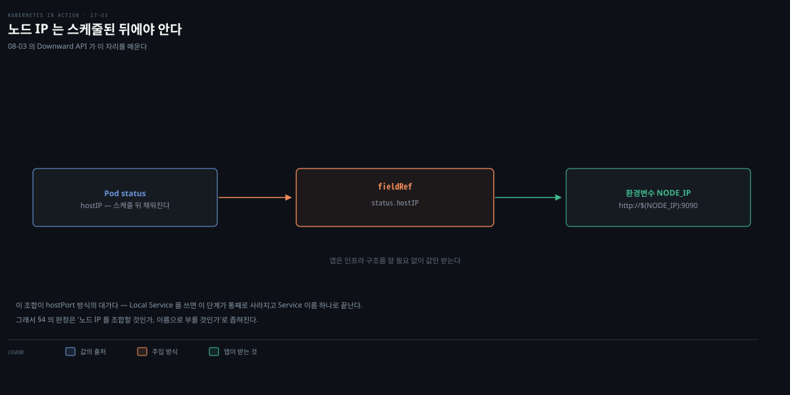
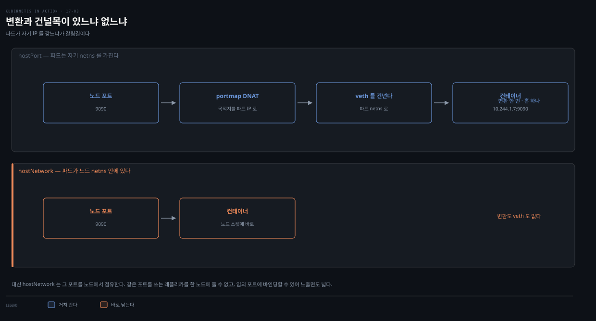

# 로컬 daemon 파드 통신 — hostPort·hostNetwork·internalTrafficPolicy
---
> daemon 파드는 같은 노드의 다른 파드에 서비스를 제공하는 경우가 많은데, 클라이언트는 로컬 daemon에 접속해야 합니다. 일반 Service는 무작위 파드로 포워딩하므로 안 됩니다. hostPort·hostNetwork로 노드 IP를 통해 접속하거나, internalTrafficPolicy Local Service로 같은 노드에만 포워딩합니다.


> 이 문서를 읽고 나면 클라이언트 파드를 로컬 daemon 파드에 연결하는 세 방법(hostPort·hostNetwork·Local Service)을 구분하고, 각각의 트레이드오프와 언제 무엇을 쓸지 근거를 대며 말할 수 있습니다.


## 진입 — 로컬 daemon에 연결하기

> daemon 파드가 같은 노드 파드에 서비스를 제공할 때, 클라이언트는 다른 노드가 아닌 로컬 daemon에 접속해야 합니다. 11장에서 파드는 Service로 통신한다고 배웠지만, Service는 트래픽을 무작위 파드(다른 노드일 수도)로 포워딩합니다.


예제로 시스템 정보(uptime·평균 사용률)를 HTTP로 제공하는 노드 에이전트를 씁니다. Kiada 앱이 노드에서 직접 조회하는 대신 이 에이전트에서 정보를 가져옵니다. 문제는 "각 Kiada 파드가 어떻게 자기 노드의 에이전트를 찾는가"입니다.

에이전트 앞에 Service를 하나 두면 될 것 같지만 그렇지 않습니다. 셀렉터가 모든 노드의 에이전트를 잡으므로, 노드가 N개면 EndpointSlice에 엔드포인트가 N개 들어갑니다. 그중 로컬에 닿을 확률은 **1/N**입니다. 노드 3개면 33%, 10개면 10%로, 클러스터를 키울수록 더 자주 빗나갑니다.

Service API에는 이 확률을 조정할 가중치 필드가 없습니다. 무엇을 고를지는 kube-proxy 구현이 정하고, 기본 iptables 모드는 균등 분배입니다[^kube-proxy-mode]. 그래서 뒤에 나오는 세 방법은 확률을 손보는 대신 **후보 목록 자체를 줄이거나 Service를 건너뜁니다**.

더 성가신 것은 실패 방식입니다. 노드 B의 에이전트에 닿아도 에러가 나지 않습니다. 200 OK로 노드 B의 uptime이 돌아오죠. 요청은 성공했는데 값이 남의 노드 것이라 조용히 틀립니다.

아래는 이 편 전체를 한 장으로 이은 지도입니다. 맨 위가 풀어야 할 문제입니다. 점선 아래 세 방법은 순서가 아니라 **병렬 대안**입니다. 어느 것을 골라도 목적지는 같고, 노드 IP를 거치느냐 Service 이름으로 닿느냐가 갈립니다.

- §1 hostPort — 노드 포트를 컨테이너로 포워딩합니다
- §2 hostNetwork — 에이전트가 노드 포트에 직접 바인딩합니다
- §3 Local Service — Service 이름만으로 같은 노드에 닿습니다
- §4 판정 — 셋 중 무엇을 언제 쓸지 정합니다

색이 붙은 곳은 두 군데입니다. 붉은 띠는 hostNetwork 파드가 노드의 임의 포트에 바인딩할 수 있어 노출면이 넓다는 뜻이고, 앰버 띠는 에이전트가 없는 노드에서 Local Service가 엔드포인트 0개처럼 동작한다는 뜻입니다.


## 1. hostPort — 노드 포트를 컨테이너로 포워딩

> **hostPort**는 노드의 네트워크 포트를 파드 포트로 포워딩합니다. NodePort Service와 달리, 각 노드는 트래픽을 로컬 에이전트 파드로만 보냅니다 — 에이전트가 없는 노드면 접속이 실패합니다.

```yaml
spec:
  template:
    spec:
      containers:
      - name: node-agent
        image: luksa/node-agent:0.1
        args:
        - --listen-address
        - :80              # 프로세스는 파드의 80 포트에 바인딩
        ports:
        - name: http
          containerPort: 80
          hostPort: 11559  # 노드의 11559로도 접근 가능
```

프로세스는 컨테이너 80 포트에만 바인딩하지만, 쿠버네티스가 노드의 11559로 받은 트래픽을 컨테이너 80으로 포워딩합니다.

`containerPort`와 `hostPort`가 나란히 있어 같은 급으로 보이지만 무게가 다릅니다. `containerPort`는 사실상 문서화 목적이라, 적지 않아도 컨테이너는 그 포트로 통신합니다. 반면 `hostPort`는 노드의 실제 포트를 잡습니다.

### hostPort는 스케줄 제약이 된다

노드에 11559 포트는 하나뿐입니다. 같은 노드에서 두 파드가 같은 hostPort를 요구하면 나눠 가질 방법이 없습니다.

그래서 스케줄러가 hostPort를 **자원처럼 취급합니다**. CPU·메모리를 계산하듯 포트 점유 여부를 보고, 이미 그 포트를 쓰는 파드가 있는 노드는 후보에서 제외합니다[^hostport-sched]. 자리를 못 찾으면 파드는 `Pending`으로 남습니다.

DaemonSet에서는 이 제약이 걸리적거리지 않습니다. 노드마다 하나씩만 뜨니 애초에 충돌할 상대가 없습니다. 문제가 되는 쪽은 일반 앱입니다. hostPort를 붙이면 레플리카를 노드 수 이상으로 늘리지 못합니다. 


각 노드는 hostPort 트래픽을 **로컬 에이전트 파드로만** 보냅니다. 11장의 NodePort Service는 노드 포트 접속을 클러스터의 무작위 파드(다른 노드일 수도)로 포워딩했지만, hostPort는 다릅니다. 에이전트 파드가 없는 노드면 hostPort 접속이 실패합니다.

두 경로를 나란히 놓으면 어디서 갈리는지 보입니다.


클라이언트가 노드 IP를 찌른다는 점까지는 같고, 갈리는 곳은 세 번째 칸입니다. 그런데 이 칸의 차이는 정책 설정이 아니라 **규칙을 누가 언제 만들었는가**에서 나옵니다.

NodePort 쪽 규칙은 kube-proxy가 만듭니다. kube-proxy는 Service와 Endpoints 오브젝트를 감시하다가 변경이 생기면 노드마다 규칙을 다시 씁니다. 감시 대상이 클러스터 전체 엔드포인트이므로, 후보 목록에 다른 노드의 파드가 함께 들어갑니다.

hostPort 쪽에는 **Service 오브젝트 자체가 없습니다.** 파드 스펙의 필드일 뿐이라 kube-proxy가 감시할 대상이 없고, 따라서 kube-proxy는 이 경로에 관여하지 않습니다. 대신 kubelet이 파드를 만들 때 CNI를 호출하고, `portmap` 플러그인이 그 노드에 DNAT 규칙을 박습니다[^cni-portmap]. 규칙의 수명이 그 노드의 그 파드에 묶이는 셈입니다. 목적지가 로컬로 고정되는 이유가 여기 있습니다 — "로컬만 보내라"고 정해서가 아니라, 규칙을 만든 주체가 그 노드의 파드 하나밖에 모르기 때문입니다.

둘 다 최종적으로는 iptables DNAT 규칙으로 내려갑니다. 다른 것은 규칙을 **누가 언제 쓰느냐**이고, 그 차이가 그대로 도착지 범위가 됩니다.

```bash
kubectl get node kind-worker -o wide   # INTERNAL-IP 172.18.0.2
 
curl 172.18.0.2:11559
# kind-worker uptime: 5h58m10s, load average: 1.62, 1.83, 2.25, ...
```

### Kiada를 로컬 에이전트에 연결 — Downward API

Kiada는 `NODE_AGENT_URL` 환경변수로 에이전트를 찾습니다. 로컬 에이전트에 연결하려면 호스트 노드 IP와 11559를 넘겨야 하는데, 노드 IP는 Kiada 파드가 스케줄된 노드에 따라 달라 고정할 수 없습니다. **Downward API**로 노드 IP를 얻습니다(7장).

아래는 그 흐름입니다. 위아래 두 줄은 같은 매니페스트가 서로 다른 노드에 뜬 경우이고, 갈리는 지점은 `스케줄러` 단계입니다.



핵심은 매니페스트에 IP가 아니라 **필드 경로**만 둔다는 것입니다. `status.hostIP`는 값이 아니라 "노드 IP를 달라"는 선언입니다. 어느 노드에 뜰지는 스케줄러가 정하므로 작성 시점에는 알 수 없습니다.

노드가 정해지면 그 노드의 **kubelet**이 파드를 만들면서 값을 채웁니다. 노드 A의 kubelet은 172.18.0.2를, 노드 B의 kubelet은 172.18.0.3을 넣습니다. 같은 매니페스트가 파드마다 다른 값을 받는 이유입니다.

여기서 짚을 것은 앱이 **API 서버에 묻지 않는다**는 점입니다. 물어보려면 ServiceAccount 권한과 쿠버네티스 클라이언트, 네트워크 왕복이 필요합니다. 

- Downward API는 kubelet이 파드 생성 시점에 미리 채워 주므로 앱은 평범한 환경변수를 읽을 뿐입니다. 
- 이름의 "Downward"도 이 방향에서 왔습니다 — 클러스터가 파드에게 내려주는 정보이지, 파드가 위로 물어보는 것이 아닙니다[^downward].

```yaml
env:
- name: NODE_IP
  valueFrom:
    fieldRef:
      fieldPath: status.hostIP     # Downward API로 노드 IP
- name: NODE_AGENT_URL
  value: http://$(NODE_IP):11559   # 노드 IP + 하드코딩 포트
```

검증은 화면에서 바로 됩니다. 새로고침할 때마다 요청을 처리한 노드 이름과 조회된 노드 정보의 노드 이름이 항상 일치합니다. 각 Kiada 파드가 로컬 에이전트에서만 정보를 가져온다는 증거입니다.


## 2. hostNetwork — 노드 네트워크 직접 사용

> 에이전트 파드가 노드 네트워크 환경을 직접 쓰면, 바인딩한 포트로 노드 IP를 통해 접근 가능합니다. 클라이언트 관점에선 hostPort와 같지만, 에이전트가 노드 포트에 직접 바인딩한다는 점이 다릅니다.

```yaml
spec:
  template:
    spec:
      hostNetwork: true   # 노드 네트워크 사용
      containers:
      - name: node-agent
        args:
        - --listen-address
        - :11559           # 에이전트가 11559에 직접 바인딩
        ports:
        - name: http
          containerPort: 11559   # hostPort 불필요(컨테이너·호스트 포트 동일)
```

에이전트가 `--listen-address :11559`로 바인딩하므로 노드 인터페이스의 11559로 접근 가능합니다. 클라이언트 관점에선 hostPort와 정확히 같지만, 에이전트 관점에선 다릅니다 — 이전엔 80에 바인딩하고 노드 11559→컨테이너 80 포워딩이었는데, 지금은 11559에 직접 바인딩합니다. 클라이언트 쪽은 바뀐 게 없어 Kiada 앱은 그대로 동작합니다.

### hostPort와 무엇이 다른가

두 방식의 차이는 한 문장으로 줄어듭니다. **hostPort는 포워딩이고 hostNetwork는 네임스페이스 공유입니다.** 패킷이 컨테이너에 닿기까지의 경로를 나란히 놓으면 드러납니다.



hostPort 파드는 **자기 네트워크 네임스페이스와 자기 IP를 그대로 가진 채** 노드의 포트 하나만 빌립니다. 그래서 노드 11559로 온 패킷을 컨테이너 80으로 바꿔 주는 변환이 필요하고, 그 일을 CNI `portmap`이 합니다. 바뀐 패킷은 veth 쌍을 건너 파드 전용 netns로 들어갑니다.

hostNetwork 파드는 **자기 네임스페이스를 아예 받지 않습니다.** 프로세스가 노드 인터페이스에 직접 앉아 있으니 바꿀 목적지가 없고, 건널 경계도 없습니다. 앞 절에서 `hostPort` 필드가 사라진 이유가 이것입니다 — 컨테이너 포트와 호스트 포트가 같은 값이라 포워딩할 것이 없습니다.

정확히 말하면 *쓰면 안 되는* 것이 아니라 *적더라도 같아야* 합니다. API 스펙은 "When `hostNetwork` is true, specified `hostPort` fields in port definitions must match `containerPort`, and unspecified `hostPort` fields in port definitions are defaulted to match `containerPort`"라고 정합니다[^hostnetwork-port]. 생략하면 `containerPort` 값이 자동으로 들어갑니다.

이 차이가 나머지를 결정합니다.

| | hostPort | hostNetwork |
|---|---|---|
| 파드 IP | 자기 IP 있음 | 노드 IP |
| 네트워크 네임스페이스 | 파드 전용 | 노드와 공유 |
| 주소 변환 | DNAT 있음 | 없음 |
| 열리는 포트 | 명시한 것 하나 | 프로세스가 바인딩하는 전부 |
| EndpointSlice 기록 | 파드 IP | 노드 IP |
| 포트 충돌 시점 | 스케줄 단계(`Pending`) | 런타임 바인딩 실패 |

노출면의 크기가 특히 다릅니다. hostPort는 `hostPort: 11559`라고 **적은 포트 하나만** 열리지만, hostNetwork는 그 파드의 프로세스가 바인딩하는 **모든 포트**가 노드에 열립니다 — 스펙에 안 적혀 있어도요. §4에서 다룰 보안 지적이 여기서 나옵니다.

충돌이 드러나는 시점도 갈립니다. hostPort는 스케줄러가 포트 점유를 미리 검사해 자리가 없으면 `Pending`으로 막습니다(§1). hostNetwork에는 그 검사가 없어서, API 스펙도 "When using HostNetwork you should specify ports so the scheduler is aware"라고 권합니다[^hostnetwork-port]. 포트를 선언하지 않으면 스케줄러가 알 방법이 없고, 파드가 뜬 **뒤에** 바인딩이 실패합니다.

여기서 오해하기 쉬운 것이 하나 있습니다. **DaemonSet이라고 해서 hostNetwork가 켜지지는 않습니다.** 둘은 별개 축입니다. DaemonSet은 어느 노드에 파드를 몇 개 띄울지 정하는 워크로드 컨트롤러이고, hostNetwork는 그 파드가 누구의 네트워크 네임스페이스를 쓸지 정하는 Pod spec 필드입니다.

`hostNetwork: true`를 적지 않으면 daemon 파드도 자기 네트워크 네임스페이스와 자기 IP를 받습니다. 실제로 §1의 hostPort 예제와 §3의 Local Service 예제는 같은 DaemonSet인데 이 필드가 없습니다. 앞 편에서 kube-proxy가 노드 IP를 쓴 것도 그 매니페스트에 이 필드가 명시돼 있었기 때문입니다.

이 차이가 EndpointSlice에 적히는 주소를 가릅니다. hostNetwork를 켜지 않은 에이전트는 파드 IP로 기록되고, 켠 에이전트는 노드 IP로 기록됩니다.


## 3. Local Service — internalTrafficPolicy

> 앞 두 방법은 노드 인터페이스로 에이전트가 노출되어 클라이언트가 노드 IP를 찾아야 하고 외부 접근도 막지 못합니다. daemon을 일반 파드처럼 Service로 접근하되 같은 노드로만 포워딩하려면 internalTrafficPolicy를 Local로 둡니다.

daemon을 외부에 노출하지 않거나 클라이언트가 다른 파드처럼 접근하게 하려면 Service를 씁니다. 하지만 Service는 연결을 무작위 daemon 파드(다른 노드일 수도)로 포워딩합니다. 11장에서 배운 대로 Service의 `internalTrafficPolicy`를 **Local**로 두면 같은 노드 안에서만 포워딩합니다.


internalTrafficPolicy가 Local인 Service는 노드별 Service처럼 동작해, 그 노드의 파드로만 백업됩니다 — 노드 A의 클라이언트는 노드 A의 파드로만, 노드 B는 노드 B로만 갑니다. node-agent Service는 노드마다 그런 파드가 하나입니다.

구현은 kube-proxy가 맡습니다. `Local`이면 kube-proxy가 **노드 로컬 엔드포인트만** 후보로 삼고, 기본값인 `Cluster`이면 모든 엔드포인트를 봅니다[^internal-traffic]. 이 필드는 v1.26에서 stable이 됐습니다[^internal-traffic].

```yaml
apiVersion: v1
kind: Service
metadata:
  name: node-agent
spec:
  internalTrafficPolicy: Local   # 같은 노드 파드로만 포워딩
  selector:
    app: node-agent
  ports:
  - name: http
    port: 80
```

selector가 DaemonSet의 `app: node-agent` 파드와 일치하고, internalTrafficPolicy가 Local이라 같은 노드 파드로만 포워딩합니다. 다른 노드 파드는 label이 맞아도 무시됩니다.

```yaml
# Kiada 설정
env:
- name: NODE_AGENT_URL
  value: http://node-agent   # 노드 IP 불필요, Service 이름만
```

Kiada가 `http://node-agent`(Service 이름)만 쓰면 되어 노드 IP 조회가 필요 없습니다.

> **주의.** DaemonSet이 node selector를 쓰면 일부 노드에 에이전트가 없을 수 있습니다. 
>
> Local Service로 로컬 에이전트를 노출하면, 에이전트 없는 노드의 클라이언트가 Service에 접속할 때 **실패**합니다. 공식 문서는 이 상황을 "그 노드의 파드에게는 **엔드포인트가 0개인 것처럼** 동작한다 — 다른 노드에 엔드포인트가 있더라도"라고 설명합니다[^internal-traffic]. 즉 다른 노드로 넘어가는 대신 아예 갈 곳이 없는 상태가 됩니다.


## 4. 어느 방법을 쓸까

> Local Service가 가장 깨끗합니다 — 노드 네트워크를 건드리지 않고 특수 권한도 필요 없습니다. hostPort·hostNetwork는 클러스터 밖에서 에이전트에 접근해야 할 때만 씁니다.

| 방법 | 클라이언트가 노드 IP 필요 | 외부 노출 | 특수 권한 |
|------|:---:|:---:|:---:|
| Local Service | 아니오(Service 이름) | 아니오 | 불필요 |
| hostPort | 예(Downward API) | 예 | 불필요 |
| hostNetwork | 예(Downward API) | 예 | 노드 네트워크 |

Local Service가 가장 깨끗하고 침습이 적습니다 — 노드 네트워크에 영향을 주지 않고 특수 권한도 필요 없습니다. hostPort·hostNetwork는 **클러스터 밖 접근**이 필요할 때만 씁니다.

이 경계는 필드 이름에 이미 들어 있습니다. `internalTrafficPolicy`의 **internal**이 가리키듯, 이 필드는 클러스터 내부에서 출발한 트래픽만 다룹니다[^internal-traffic]. Local Service로 노출한 에이전트는 클러스터 안에서만 닿을 수 있습니다.

**hostPort·hostNetwork**는 노드 인터페이스에 포트를 열기 때문에 사정이 다릅니다. 클러스터 밖에서 노드 IP로 직접 찌를 수 있습니다. 클러스터 외부의 모니터링 시스템이 각 노드를 스크레이핑해야 한다면 Service 이름은 소용이 없고 노드 IP와 포트가 필요합니다. 세 방법이 공존하는 이유가 여기 있습니다

- Local Service의 장점인 "노드에 아무것도 열지 않는다"가 그대로 한계가 됩니다.

에이전트가 포트를 여럿 노출하면 hostPort는 각 포트를 개별 포워딩해야 해 hostNetwork가 편해 보입니다. 다만 원서는 보안상 이상적이지 않다고 지적합니다(§17.3). hostNetwork 파드는 공격자가 노드의 임의 포트에 바인딩해 man-in-the-middle 공격을 할 수 있기 때문입니다.

### 클라이언트가 없는 경우 — Push

지금까지는 클라이언트가 daemon을 *찾아가는* 구도였습니다. 공식 문서는 여기에 두 패턴을 더 둡니다[^daemon-comm].

- **Push** — daemon 파드가 통계 데이터베이스 같은 다른 서비스로 **자기가 보냅니다**. 클라이언트가 아예 없습니다.
- **DNS** — 같은 selector로 headless Service를 만들어, 엔드포인트 리소스나 DNS의 여러 A 레코드로 daemon을 발견합니다.

Push는 이 편이 푸는 문제 자체를 없앤다는 점에서 눈여겨볼 만합니다. 노드별 메트릭을 수집해 중앙으로 올리기만 하면 되는 에이전트라면, 로컬 연결을 보장할 방법을 고민할 필요가 없습니다. "어떻게 로컬 daemon을 찾을까"를 묻기 전에 "애초에 클라이언트가 찾아가야 하는가"를 먼저 확인하는 편이 낫습니다.

> **Spring 관점.** Boot 앱이 노드 로컬 에이전트(예: 노드별 캐시·사이드카 프록시·로컬 메트릭 수집기)에 접속할 때, internalTrafficPolicy Local Service가 안전하고 편합니다. 
>
> - 앱은 `http://node-agent` 같은 Service 이름만 알면 되고, 노드 IP를 Downward API로 주입할 필요도, 노드 네트워크 권한도 필요 없습니다. 
> - hostPort/hostNetwork는 외부 모니터링 시스템이 노드 IP로 직접 스크레이핑해야 하는 경우로 한정합니다.


## 면접에서 받을 만한 질문

> 아래 질문에 먼저 스스로 답해 본 뒤, 챕터 끝의 정답과 맞춰 봅니다.

1. 왜 일반 Service로는 로컬 daemon 파드에 연결할 수 없나요? 노드가 N개일 때 로컬에 닿을 확률은 얼마인가요?
2. hostPort는 NodePort Service와 어떻게 다른가요?
3. 같은 노드에서 두 파드가 같은 hostPort를 요구하면 어떻게 되나요? 일반 앱에 hostPort를 쓰면 무엇이 제약되나요?
4. Kiada가 로컬 에이전트의 노드 IP를 어떻게 알아내나요? 그 값은 언제, 누가 채우나요?
5. DaemonSet으로 띄우면 hostNetwork가 켜지나요? 두 개념은 어떤 관계인가요?
6. internalTrafficPolicy Local Service는 어떻게 동작하나요? DaemonSet이 node selector를 쓰면 무슨 문제가 생기나요?
7. Local Service가 가장 깨끗한데도 hostPort·hostNetwork가 남아 있는 이유는 무엇인가요?
8. 세 방법 중 무엇을 언제 쓰나요? hostNetwork가 hostPort보다 보안상 나쁜 이유는요?


## 정답 (자답 후 펼치기)

> 위 질문에 답해 본 다음 아래와 맞춰 봅니다. 순서는 질문과 1:1로 대응합니다.

### 정답 1 — 일반 Service의 한계

일반 Service는 클라이언트 요청을 받으면 **무작위 파드로 포워딩**하는데, 그 파드가 같은 노드에 있을 수도 다른 노드에 있을 수도 있기 때문입니다. daemon 파드는 같은 노드의 다른 파드에 서비스를 제공하므로, 클라이언트는 반드시 로컬 daemon에 접속해야 하는데 일반 Service는 이를 보장하지 못합니다.

노드가 N개면 엔드포인트도 N개라 로컬에 닿을 확률은 **1/N**입니다. 노드 3개면 33%, 10개면 10%로 클러스터를 키울수록 더 자주 빗나갑니다. Service API에는 이 확률을 조정할 가중치 필드가 없고, 기본 iptables 모드는 백엔드를 무작위로 고릅니다[^kube-proxy-mode].

실패 방식도 성가십니다. 다른 노드 에이전트에 닿아도 에러가 아니라 200 OK로 남의 노드 값이 돌아옵니다. 요청은 성공했는데 값만 틀린, 조용한 오류입니다.

### 정답 2 — hostPort vs NodePort

hostPort는 노드의 포트를 그 노드의 **로컬 파드로만** 포워딩합니다 — 에이전트가 없는 노드면 접속이 실패합니다. NodePort Service는 노드 포트 접속을 클러스터의 **무작위 파드**(다른 노드에 있을 수도)로 포워딩합니다. 즉 hostPort는 "이 노드의 이 파드"로 고정되지만, NodePort는 클러스터 전역 로드밸런싱입니다.

### 정답 3 — hostPort 충돌과 스케줄 제약

라우팅으로 나눠 갖는 것이 아니라 **애초에 두 파드가 뜨지 못합니다**. 노드에 그 포트는 하나뿐이기 때문입니다.

스케줄러가 hostPort를 자원처럼 취급해, 이미 그 포트를 쓰는 파드가 있는 노드를 후보에서 제외합니다[^hostport-sched]. 자리를 못 찾으면 파드는 `Pending`으로 남습니다.

DaemonSet은 노드마다 하나씩만 뜨니 충돌할 상대가 없습니다. 문제가 되는 쪽은 일반 앱이고, hostPort를 붙이면 **레플리카를 노드 수 이상으로 늘리지 못합니다**. 스케일 아웃하려고 파드를 늘려도 노드 수에 묶입니다.

### 정답 4 — Downward API

Kiada 파드가 스케줄된 노드에 따라 노드 IP가 달라 매니페스트에 고정할 수 없습니다. 그래서 **Downward API**로 얻습니다. `fieldRef.fieldPath: status.hostIP`로 노드 IP를 `NODE_IP` 환경변수에 주입하고, `NODE_AGENT_URL`을 `http://$(NODE_IP):11559`로 참조합니다. 포트는 하드코딩입니다. 그러면 각 Kiada 파드가 자기 노드 IP로 로컬 에이전트에 접속합니다.

값을 채우는 주체와 시점이 핵심입니다. 매니페스트에는 IP가 아니라 필드 경로만 있고, 노드가 정해진 뒤 그 노드의 **kubelet**이 파드를 만들면서 값을 넣습니다[^downward]. 앱이 API 서버에 묻는 것이 아니라서 ServiceAccount 권한도 쿠버네티스 클라이언트도 필요 없습니다.

### 정답 5 — DaemonSet과 hostNetwork의 관계

**켜지지 않습니다.** 둘은 별개 축입니다. DaemonSet은 어느 노드에 파드를 몇 개 띄울지 정하는 워크로드 컨트롤러이고, hostNetwork는 그 파드가 누구의 네트워크 네임스페이스를 쓸지 정하는 Pod spec 필드입니다.

`hostNetwork: true`를 적지 않으면 daemon 파드도 자기 IP를 받습니다. 이 편의 hostPort 예제와 Local Service 예제가 그렇게 동작하고, hostNetwork를 켜는 것은 §2뿐입니다. 앞 편의 kube-proxy가 노드 IP를 쓴 것도 그 매니페스트에 이 필드가 명시돼 있었기 때문입니다.

### 정답 6 — Local Service와 node selector 문제

internalTrafficPolicy가 Local인 Service는 **노드별 Service처럼** 동작합니다. 각 노드의 클라이언트를 그 노드의 파드로만 포워딩하고, 다른 노드 파드는 label이 맞아도 무시합니다. node-agent는 노드마다 그런 파드가 하나이므로 로컬 에이전트로 연결됩니다.

문제는 DaemonSet이 **node selector를 쓰면** 일부 노드에 에이전트가 없을 수 있다는 것입니다. 그런 노드의 클라이언트가 Local Service에 접속하면 로컬 파드가 없어 **접속이 실패**합니다. 다른 노드로 넘어가는 폴백은 없습니다. 폴백이 있으면 남의 노드 정보를 받게 되어 목적이 깨지기 때문입니다.

### 정답 7 — Local Service의 한계

`internalTrafficPolicy`의 **internal**이 경계를 말해 줍니다. 이 필드는 클러스터 내부에서 출발한 트래픽만 다루므로[^internal-traffic], Local Service로 노출한 에이전트는 클러스터 안에서만 닿습니다.

hostPort·hostNetwork는 노드 인터페이스에 포트를 열어 클러스터 밖에서도 노드 IP로 찌를 수 있습니다. 클러스터 외부 모니터링 시스템이 각 노드를 스크레이핑하는 경우가 대표적입니다. Local Service의 장점인 "노드에 아무것도 열지 않는다"가 그대로 한계가 되는 셈입니다.

### 정답 8 — 방법 선택과 hostNetwork 위험

**Local Service**가 기본 선택입니다. 가장 깨끗하고 침습이 적으며, 클라이언트가 Service 이름만 알면 됩니다. 노드 네트워크에 영향을 주지 않고 특수 권한도 필요 없습니다. **hostPort·hostNetwork**는 클러스터 밖에서 에이전트에 접근해야 할 때만 씁니다.

원서가 hostNetwork를 hostPort보다 나쁘게 보는 이유는 노출면의 크기입니다(§17.3). hostNetwork 파드는 노드 네트워크 전체를 쓸 수 있어, **공격자가 노드의 임의 포트에 바인딩**해 man-in-the-middle 공격을 할 수 있습니다. hostPort는 지정한 포트만 포워딩해 노출면이 좁습니다.


## 관련 문서

> 이 편은 17장 DaemonSet을 로컬 daemon 통신 세 방법으로 마무리하고, 배치 워크로드를 다루는 18장 Job·CronJob으로 이어집니다.

- [Service와 EndpointSlice](../../kubernetes/04_networking/04-04.Service%EC%99%80%20EndpointSlice.md) — internalTrafficPolicy·Service 통합 개념본(개념 위임)
- [17-02. 노드 에이전트 특수 기능 — privileged·hostPath·hostNetwork·PriorityClass](./17-02.%EB%85%B8%EB%93%9C%20%EC%97%90%EC%9D%B4%EC%A0%84%ED%8A%B8%20%ED%8A%B9%EC%88%98%20%EA%B8%B0%EB%8A%A5%20%E2%80%94%20privileged%C2%B7hostPath%C2%B7hostNetwork%C2%B7PriorityClass.md) — 앞 편(hostNetwork)
- [18-01. Job 기초 — 실행·상태·suspend·자동삭제](./18-01.Job%20%EA%B8%B0%EC%B4%88%20%E2%80%94%20%EC%8B%A4%ED%96%89%C2%B7%EC%83%81%ED%83%9C%C2%B7suspend%C2%B7%EC%9E%90%EB%8F%99%EC%82%AD%EC%A0%9C.md) — 다음 장(항상 실행 DaemonSet ↔ 끝나는 배치 워크로드)
- [11-03. 엔드포인트·DNS·토폴로지·readiness](./11-03.%EC%97%94%EB%93%9C%ED%8F%AC%EC%9D%B8%ED%8A%B8%C2%B7DNS%C2%B7%ED%86%A0%ED%8F%B4%EB%A1%9C%EC%A7%80%C2%B7readiness.md) — internalTrafficPolicy Local(§17.3 토대)
- [08-03. Secret과 Downward API](./08-03.Secret%EA%B3%BC%20Downward%20API.md) — status.hostIP 노드 IP 주입
- 원서: 《Kubernetes in Action, 2nd Ed.》 Ch17 §17.3 — [Manning](https://www.manning.com/books/kubernetes-in-action-second-edition), [예제 코드](https://github.com/luksa/kubernetes-in-action-2nd-edition/tree/master/Chapter17)
- 공식 문서: [Service Internal Traffic Policy](https://kubernetes.io/docs/concepts/services-networking/service-traffic-policy/)

[^kube-proxy-mode]: 공식 문서 [Virtual IPs and Service Proxies — iptables proxy mode](https://kubernetes.io/docs/reference/networking/virtual-ips/#proxy-mode-iptables). 기본 동작은 "select a backend Pod at random"입니다.

[^cni-portmap]: 공식 문서 [Network Plugins](https://kubernetes.io/docs/concepts/extend-kubernetes/compute-storage-net/network-plugins/)는 "The CNI networking plugin supports `hostPort`"라고 적고, 활성화하려면 `cni-conf-dir`에 `portMappings capability`를 명시하라고 안내합니다. CNI 측 문서 [portmap plugin](https://www.cni.dev/plugins/current/meta/portmap/)은 이 플러그인이 "forward traffic from one or more ports on the host to the container"하며 "The DNAT rule rewrites the destination port and address of new connections"라고 설명합니다. 규칙은 `CNI-HOSTPORT-DNAT` 체인에 들어갑니다. 즉 hostPort 경로에는 Service 오브젝트가 없어 kube-proxy가 관여하지 않고, 파드 생성 시 CNI가 그 노드에 규칙을 만듭니다.

[^hostnetwork-port]: 쿠버네티스 API 소스 [`core/v1/types.go`](https://github.com/kubernetes/kubernetes/blob/master/staging/src/k8s.io/api/core/v1/types.go)의 `PodSpec.HostNetwork` 주석입니다. "Use the host's network namespace. When using HostNetwork you should specify ports so the scheduler is aware. When `hostNetwork` is true, specified `hostPort` fields in port definitions must match `containerPort`, and unspecified `hostPort` fields in port definitions are defaulted to match `containerPort`." 같은 파일의 `ContainerPort.HostPort`에도 "If HostNetwork is specified, this must match ContainerPort"가 적혀 있습니다.

[^hostport-sched]: 스케줄러의 `NodePorts` 플러그인이 "Checks if a node has free ports for the requested Pod ports"를 `filter` 단계에서 수행합니다. [Scheduler Configuration](https://kubernetes.io/docs/reference/scheduling/config/).

[^downward]: 공식 문서 [Downward API](https://kubernetes.io/docs/concepts/workloads/pods/downward-api/), 노드 IP 필드는 [Expose Pod Information to Containers](https://kubernetes.io/docs/tasks/inject-data-application/environment-variable-expose-pod-information/).

[^internal-traffic]: 공식 문서 [Service Internal Traffic Policy](https://kubernetes.io/docs/concepts/services-networking/service-traffic-policy/). `Local`이면 "only node local endpoints are considered"이고, 기본값 `Cluster`면 "Kubernetes considers all endpoints"입니다. 로컬 엔드포인트가 없는 노드에서는 "the Service behaves as if it has zero endpoints"로 동작합니다. 문서는 이 기능을 v1.26 stable로 표시합니다.

[^daemon-comm]: 공식 문서 [DaemonSet — Communicating with Daemon Pods](https://kubernetes.io/docs/concepts/workloads/controllers/daemonset/#communicating-with-daemon-pods). Push, NodeIP and Known Port, DNS, Service 네 패턴을 나열합니다. 이 편의 hostPort는 NodeIP and Known Port에, Local Service는 Service에 대응합니다. hostNetwork는 이 목록에 없는 원서의 변형이며, Push와 DNS는 §17.3이 다루지 않습니다.
