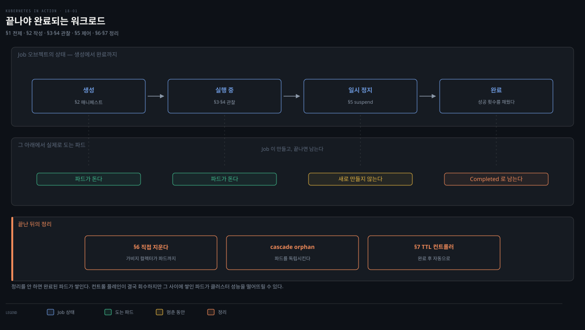
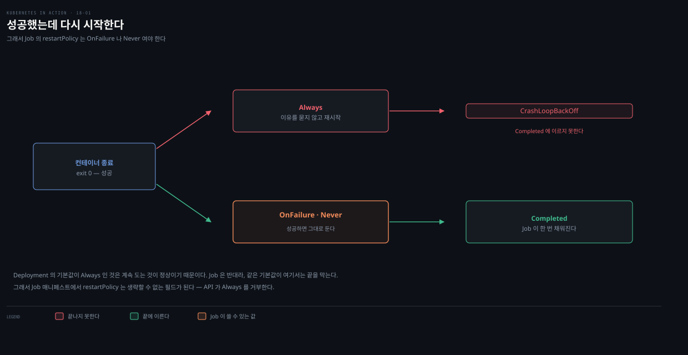
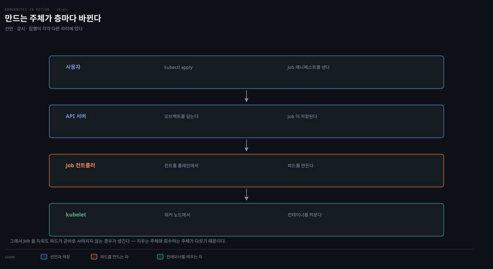
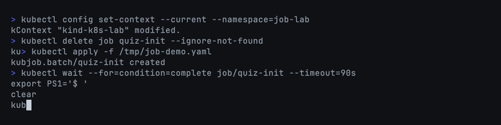

# Job 기초 — 실행·상태·suspend·자동삭제

> Deployment·StatefulSet·DaemonSet은 파드를 계속 살려 둡니다. Job은 반대로, 파드가 **한 번 끝까지 성공하면 끝내는** 워크로드입니다.

읽고 나면 다음을 할 수 있습니다.

- Job 매니페스트를 작성하고 Deployment와 무엇이 다른지 설명합니다.
- `kubectl get/describe jobs`로 상태를 읽습니다.
- Job을 일시 중단(suspend)했다가 재개합니다.
- 다 끝난 Job을 자동으로 지우도록 설정합니다.


## 진입 — 왜 Job이 필요한가
> 지금까지의 워크로드는 전부 "계속 돈다"를 전제했습니다. 한 번 하고 끝나야 하는 작업은 그 전제에 맞지 않습니다.

Deployment·StatefulSet·DaemonSet으로 만든 파드는 프로세스가 끝나면 Kubelet이 컨테이너를 다시 시작합니다. 파드는 스스로 멈추지 않고, 사용자가 Pod 오브젝트를 지워야 사라집니다. 웹 서버·데이터베이스·시스템 서비스처럼 계속 떠 있어야 하는 워크로드에는 이 동작이 알맞습니다. 하지만 한 번만 수행하면 되는 유한한 작업에는 맞지 않습니다.

**유한한 워크로드는 계속 도는 대신 작업을 끝까지 실행합니다. Kubernetes에서는 이런 작업을 Job 리소스로 실행합니다.** 다만 Job은 파드를 생성한 즉시 실행하므로, 예약 실행에는 쓸 수 없습니다. 특정 시각이나 주기로 돌리려면 Job을 `CronJob`으로 감싸야 합니다([18-03](./18-03.work%20queue%C2%B7pod%20%ED%86%B5%EC%8B%A0%C2%B7sidecar%C2%B7CronJob.md)에서 다룹니다).

MongoDB 데이터베이스를 초기화하는 파드를 생각해 보겠습니다. 이 파드는 계속 돌 필요가 없고, 초기화 작업 한 번을 수행한 뒤 종료해야 합니다. 실패하면 컨테이너를 재시작하되, 성공적으로 끝났을 때는 재시작하지 않기를 바랍니다. 완료된 파드를 지운 뒤 새 파드가 다시 뜨는 일도 원치 않습니다.

아래는 이 편 전체를 한 장으로 이은 지도입니다. Job 하나의 생애주기를 세 층으로 나눠 놓았습니다. 위층은 Job 오브젝트의 상태가 생성에서 완료까지 가로로 흐르고, 가운데는 그 아래에서 실제로 도는 파드, 아래층은 끝난 뒤의 정리입니다.

- §1 전제 — Deployment와 달리 성공하면 끝납니다
- §2 작성 — 매니페스트에서 무엇을 반드시 정해야 하는지 봅니다
- §3·§4 관찰 — 완료 횟수와 로그를 읽습니다
- §5 제어 — 멈췄다가 재개합니다
- §6·§7 정리 — 지우거나 자동으로 지워지게 둡니다

상자의 색은 상태의 성격을 나타냅니다. 초록은 진행 중, 보라는 성공으로 끝난 상태, 붉은색은 실패, 노란색은 무언가를 기다리는 상태입니다. 실선 화살표는 정상 경로이고 점선은 조건부 경로라, `if:`가 붙은 전이는 그 조건이 맞을 때만 일어납니다.

지도에서 눈여겨볼 곳은 두 군데입니다. 가운데 층의 `실패`는 `restartPolicy`가 가르는 자리로, Job의 Pod 템플릿에는 `Always`를 쓸 수 없습니다. 아래층 오른쪽의 `TTL 삭제`는 자동 삭제를 켜면 실패 원인을 볼 로그까지 함께 사라진다는 뜻입니다.




## 1. Job vs Deployment — "끝까지 성공"이라는 의도
> Job은 파드가 무한히 돌기를 보장하는 대신, 정해진 수만큼 성공적으로 완료되기를 보장합니다.

15장에서 만든 `quiz-data-importer` 파드가 바로 이런 성격이었습니다. 이 파드는 `restartPolicy: OnFailure`로 설정되어 실패할 때만 컨테이너를 재시작했고, 성공하면 재시작하지 않았습니다.

그런데 이 파드는 Deployment가 아니라 직접 만든 파드였습니다. 실수로 지우거나 노드가 죽으면 Kubernetes가 자동으로 되살리지 않습니다. 직접 되살려야 하고 완료될 때까지 지켜봐야 합니다. 초 단위로 끝나는 작업이면 괜찮지만, 몇 시간 걸리는 작업을 붙잡고 있고 싶지는 않습니다. 그래서 Job 오브젝트를 만들고 Kubernetes에 맡깁니다.

Job 리소스는 Deployment를 닮았습니다. 하나 이상의 파드를 생성한다는 점이 같습니다. 차이는 목적입니다. Deployment는 파드가 무한히 실행되도록 보장하고, Job은 정해진 수의 파드가 **성공적으로 완료**되도록 보장합니다.

완료 판정은 두 단계로 올라갑니다. 파드 안 모든 컨테이너가 성공(exit code 0)으로 종료하면 그 파드가 완료된 것으로 간주됩니다. 그렇게 완료된 파드가 목표 수만큼 쌓이면 Job도 완료됩니다.


- 가장 단순한 Job은 파드 하나를 완료까지 실행합니다. 더 복잡한 Job은 여러 파드를 순차(sequential) 또는 병렬(parallel)로 실행합니다. 여러 번 실행하는 방식과 병렬 처리는 [18-02](./18-02.Job%20%EB%B3%91%EB%A0%AC%C2%B7%EC%8B%A4%ED%8C%A8%C2%B7%EC%99%84%EB%A3%8C%20%EB%AA%A8%EB%93%9C.md)에서 다룹니다.


## 2. Job 매니페스트 작성
> Job의 Pod 템플릿은 `restartPolicy`를 반드시 명시해야 하고, 한 번 만든 뒤에는 템플릿을 수정할 수 없습니다.

15장의 `quiz-data-importer` 파드를 Job으로 바꿔 보겠습니다. 이 파드는 두 컨테이너를 순서대로 실행합니다. init 컨테이너가 MongoDB replica set을 초기화하고, 메인 컨테이너가 퀴즈 데이터를 MongoDB로 import 합니다.

```yaml
apiVersion: batch/v1        # Job은 batch API 그룹, 버전 v1
kind: Job
metadata:
  name: quiz-init
  labels:
    app: quiz
    task: init
spec:
  template:                 # Pod 템플릿이 여기서 시작
    metadata:
      labels:               # 파드에 붙일 레이블 (선택)
        app: quiz
        task: init
    spec:
      restartPolicy: OnFailure   # Job은 기본값 Always를 못 씀 → OnFailure 또는 Never
      initContainers:
        - name: init
          image: mongo:5
          command: [...]         # MongoDB replica set 초기화 (생략)
      containers:
        - name: import
          image: mongo:5
          command:
            - mongoimport
            - mongodb+srv://quiz-pods.kiada.svc.cluster.local/kiada?tls=false
            - --collection
            - questions
            - --file
            - /questions.json
            - --drop
          volumeMounts:
            - name: quiz-data
              mountPath: /questions.json
              subPath: questions.json
              readOnly: true
      volumes:
        - name: quiz-data
          configMap:
            name: quiz-data
```

Pod의 `restartPolicy`를 `OnFailure`로 설정합니다. Job에 속한 파드는 기본값인 `Always`를 쓸 수 없습니다[^restart-policy]. 

- `Always`는 컨테이너가 성공으로 끝나도 재시작하므로, 파드가 완료 상태에 도달하지 못하게 막습니다. 그래서 Job의 Pod 템플릿에서는 `restartPolicy`를 `OnFailure`나 `Never`로 **명시적으로** 설정해야 합니다.`Always`가 왜 완료를 막는지는 상태 이름을 따라가면 분명해집니다. 

- `Completed`는 파드가 `Succeeded` phase에 들어갔을 때 kubectl이 보여 주는 표시입니다. `Succeeded`의 정의는 "성공으로 끝났고 **다시 시작되지 않을**" 컨테이너입니다. 반면 `Always`의 정의는 "**어떤 이유로 종료되든** 재시작"입니다. 두 정의가 겹칠 자리가 없어 `Always`인 파드는 `Succeeded`에 이르지 못합니다[^pod-phase][^restart-backoff].
- 실제로 관찰되는 것은 `Completed`가 아니라 `CrashLoopBackOff`입니다. 이름에 "Crash"가 들어 있지만 성공으로 끝나도 이 상태에 빠집니다.

### 왜 성공인데 CrashLoopBackOff 인가?

계속해서 성공하면 컨테이너는 매번 exit 0으로 끝나고 `RESTARTS` 숫자만 올라갑니다. 다만 kubelet이 곧바로 다시 띄우지 않습니다. 종료 뒤 재시작까지 10초, 20초, 40초로 간격을 두 배씩 늘리고 300초에서 멈춥니다[^restart-backoff].

`CrashLoopBackOff`는 그 **기다리는 구간의 이름**입니다. 죽었다는 판정이 아니라 다음 재시작까지 대기 중이라는 뜻이고, 이 이름을 붙일 때 종료 코드를 보지 않습니다. 

- 컨테이너는 1초 만에 끝나는데 대기는 수십 초로 늘어나니, 들여다보는 시점의 대부분이 대기 구간입니다. 그래서 화면에는 계속 이 상태로 보입니다. 
- 백오프는 컨테이너가 10분을 무사히 돌아야 초기화되는데[^restart-backoff], 금방 끝나는 컨테이너는 그 조건을 채울 수 없어 간격이 5분까지 커진 채로 남습니다.

phase 자체는 `Running`입니다. `Running`의 정의가 "컨테이너가 시작 중이거나 **재시작 중**"인 경우를 포함하기 때문입니다. 

- `CrashLoopBackOff`는 phase가 아니라 kubectl `STATUS` 열의 표시입니다. 공식 문서도 표시용 `Status`와 실제 `phase`를 혼동하지 말라고 적습니다[^pod-phase]. 
- 그래서 이 파드는 `Succeeded`도 `Failed`도 아닌 채로 계속 돌고, Job이라면 완료 조건을 영영 못 채웁니다.

세 정책이 갈리는 자리를 한 장으로 보면 이렇습니다. 컨테이너가 성공으로 끝난 뒤 kubelet이 무엇을 하느냐에 따라 도달하는 상태가 달라집니다.



### OnFailure와 Never는 실패 시 다른 것을 다시 만든다

둘 다 허용되지만 실패했을 때 벌어지는 일이 다릅니다. 갈리는 자리는 **kubelet**입니다.

| | `OnFailure` | `Never` |
|---|---|---|
| kubelet | 같은 파드에서 컨테이너 재시작 | 아무것도 하지 않음 |
| 파드 상태 | `Running` 유지 | `Failed`로 확정 |
| Job 컨트롤러 | 개입하지 않음 | 완료 수 부족을 보고 **새 파드 생성** |
| 관찰되는 모습 | 파드 1개, `RESTARTS` 증가 | 파드가 여러 개 쌓임 |
| 실패 로그 | 덮임(`--previous`로 직전 하나만) | 파드마다 남음 |

- `Never`가 "재시작하지 않는다"는 것은 kubelet 이야기이지 Job이 포기한다는 뜻이 아닙니다. 파드가 `Failed`로 확정되면 Job 컨트롤러가 완료 목표에 미달한 것을 보고 **새 파드를 만듭니다**. 이름이 다른 파드가 하나 더 생기고, 실패한 파드는 지워지지 않고 남습니다.
- 실무에서 갈리는 기준은 **실패 로그를 남길 것이냐**입니다. `Never`는 시도마다 파드가 남아 원인을 추적하기 좋지만 파드가 쌓입니다. `OnFailure`는 파드 하나로 끝나지만 이전 시도의 로그가 덮입니다. 무한히 재시도하지는 않으며, 한계는 `backoffLimit`이 정합니다([18-02](./18-02.Job%20%EB%B3%91%EB%A0%AC%C2%B7%EC%8B%A4%ED%8C%A8%C2%B7%EC%99%84%EB%A3%8C%20%EB%AA%A8%EB%93%9C.md)).

`selector`를 정의하지 않습니다. Deployment와 달리 Job은 셀렉터를 자동으로 설정합니다. 직접 지정할 수도 있지만 그럴 필요가 없습니다.

Pod 템플릿에 넣은 두 레이블(`app`·`task`)은 편의를 위한 것일 뿐 필수가 아닙니다.

> **템플릿은 불변입니다.** Deployment 같은 다른 리소스와 달리, Job 오브젝트를 만든 뒤에는 템플릿을 수정할 수 없습니다. 바꾸려면 Job을 지우고 다시 만들어야 합니다.
>
> 다만 공식 문서 기준으로 예외가 있습니다[^template-mutable]. Pod 템플릿에서 다음 항목은 수정할 수 있습니다.
>
> - node affinity
> - node selector
> - toleration
> - label
> - annotation
> - scheduling gate
>
> 중단(suspend)된 Job에 한해 리소스 요구량도 바꿀 수 있습니다. "불변"은 컨테이너 이미지·명령처럼 작업 내용을 이루는 부분에 대한 이야기로 읽는 편이 정확합니다.


## 3. Job 실행과 상태 조회
> `kubectl get jobs`는 완료 횟수와 소요 시간을, `describe`는 자동 생성된 셀렉터·파드 상태·이벤트를 보여 줍니다.

### Job은 파드가 아니라 지시서다

본문이 "Job 컨트롤러"라는 말을 계속 쓰므로 세 층을 먼저 갈라 둡니다. Job은 실행 단위가 아니라 **API 서버에 저장되는 오브젝트**, 즉 "이런 작업을 완료해 달라"는 지시서입니다. 실제로 도는 것은 그 지시서를 보고 만들어진 파드입니다.

| 층 | 무엇인가 | 누가 만드나 | 무엇을 보나 |
|---|---|---|---|
| Job | 지시서(오브젝트) | 사용자 | — |
| Pod | 실행 단위 | Job 컨트롤러 | 완료된 파드 수 |
| Container | 실제 프로세스 | kubelet | 컨테이너 종료 코드 |

**컨트롤러**는 원하는 상태와 실제 상태를 계속 비교해 그 차이를 메우는 조정 루프입니다. 무엇을 세는지만 컨트롤러마다 다릅니다.

- **Deployment 컨트롤러**: 살아 있는 파드 수
- **DaemonSet 컨트롤러**: 노드별 파드 존재 여부
- **Job 컨트롤러**: 성공적으로 완료된 파드 수

보는 대상만 다를 뿐 루프의 모양은 같습니다. 셋 다 컨트롤 플레인의 controller manager 안에서 돕니다[^controller]. 루프의 구조와 커스텀 컨트롤러 작성은 [Controller 패턴](../kubernetes-patterns/27-01.Controller%20%E2%80%94%20Observe-Analyze-Act%EB%A1%9C%20%EC%83%81%ED%83%9C%EB%A5%BC%20%EC%A1%B0%EC%A0%95%ED%95%98%EA%B8%B0.md)이 정본입니다.

kubelet과 층이 갈린다는 점이 중요합니다. Job 컨트롤러는 **파드** 단위로 완료 수를 세고, kubelet은 각 노드에서 **컨테이너**가 어떻게 끝났는지만 봅니다. §2에서 본 `restartPolicy`는 kubelet의 판단 기준이라, 두 층이 각각 무엇을 하는지가 실패 처리 결과를 가릅니다.

세 층이 클러스터 어디에 있는지까지 함께 보면 분담이 분명해집니다. Job 컨트롤러는 컨트롤 플레인의 controller manager 안에서 돌고, kubelet은 파드가 실제로 뜨는 워커 노드마다 하나씩 있습니다.



Job 컨트롤러는 Job 오브젝트를 만드는 즉시 파드를 생성합니다. 매니페스트를 적용하면 실행됩니다.

```bash
kubectl apply -f job.quiz-init.yaml
```

### 3.1 간략한 상태 — get jobs

현재 네임스페이스의 Job을 나열해 간략한 상태를 봅니다.

```bash
kubectl get jobs
```

```bash
# NAME        STATUS    COMPLETIONS   DURATION   AGE
  quiz-init   Running   0/1           3s         3s
```

`STATUS`는 Job이 실행 중인지·실패했는지·완료됐는지를 나타냅니다. `COMPLETIONS`는 몇 번 실행됐고 몇 번 완료하도록 설정됐는지(현재/목표)를, `DURATION`은 얼마나 오래 실행 중인지를 보여 줍니다. `quiz-init` 작업은 짧으므로 몇 초 뒤 다시 조회하면 상태가 바뀝니다.

```bash
kubectl get jobs
```

```pseudocode
# NAME        STATUS     COMPLETIONS   DURATION   AGE
  quiz-init   Complete   1/1           6s         42s
```

출력은 Job이 완료됐고 6초가 걸렸음을 보여 줍니다.

몇 초 사이에 값이 바뀌는 장면이라 정적 출력만으로는 전환이 잘 안 보입니다. 아래는 같은 순서를 실제로 실행한 화면입니다. 두 번째 조회 전에 `kubectl wait`로 완료를 기다렸는데, 이 명령은 조건이 충족될 때까지 블로킹하므로 스크립트에서 다음 단계를 걸 때 유용합니다.

```bash
kubectl apply -f job.quiz-init.yaml
kubectl get jobs                                                   # Running 0/1
kubectl wait --for=condition=complete job/quiz-init --timeout=60s  # 완료까지 대기
kubectl get jobs                                                   # Complete 1/1
```


`COMPLETIONS`가 `0/1`에서 `1/1`로 올라가고 `STATUS`가 `Complete`로 바뀌는 지점이 Job이 목표를 채운 순간입니다. `DURATION`은 그때까지 걸린 시간이며, 이 화면에서는 16초짜리 작업이라 그 값이 찍혔습니다.

### 3.2 상세 상태 — describe job

더 자세히 보려면 `kubectl describe`를 씁니다.

```bash
kubectl describe job quiz-init
```

```bash
Name:           quiz-init
Namespace:      kiada
Selector:       controller-uid=98f0fe52-12ec-...   # 자동 생성된 셀렉터
Labels:         app=quiz
                task=init
Annotations:    batch.kubernetes.io/job-tracking:
Parallelism:    1
Completions:    1
Completion Mode: NonIndexed
Start Time:     Sun, 02 Oct 2022 12:17:59 +0200
Completed At:   Sun, 02 Oct 2022 12:18:05 +0200
Duration:       6s
Pods Statuses:  0 Active / 1 Succeeded / 0 Failed   # 이 Job 파드들의 상태
Pod Template:
  Labels:  app=quiz
           batch.kubernetes.io/controller-uid=98f0fe52-...
           batch.kubernetes.io/job-name=quiz-init
           controller-uid=98f0fe52-...
           job-name=quiz-init
           task=init
  ...
Events:
  Type    Reason            Age    From           Message
  ----    ------            ----   ----           -------
  Normal  SuccessfulCreate  7m33s  job-controller  Created pod: quiz-init-xpl8d
  Normal  Completed         7m27s  job-controller  Job completed
```

Job 이름·네임스페이스·레이블 같은 속성 외에, 자동으로 할당된 `selector`가 보입니다. 셀렉터에 쓰인 `controller-uid` 레이블은 Pod 템플릿에도 자동으로 추가됩니다. 함께 추가된 `job-name` 레이블은 특정 Job에 속한 파드를 나열할 때 유용합니다.

셀렉터가 이름이 아니라 **UID**를 쓰는 데는 이유가 있습니다. 

- Job 컨트롤러는 완료된 파드 수를 세야 하므로 "이 파드가 내 것인가"를 정확히 판별해야 합니다. 그런데 이름은 지웠다가 다시 쓸 수 있습니다. 
- `quiz-init`을 지우고 같은 이름으로 다시 만들었을 때 이전 Job의 파드가 아직 정리되지 않았다면, 이름 기준 셀렉터는 **옛 파드까지 자기 것으로 셉니다**. 완료 판정이 틀어지죠.

UID는 오브젝트를 만들 때마다 새로 발급되고 재사용되지 않습니다. 

- 같은 이름으로 다시 만들어도 UID가 다르므로 옛 파드와 새 Job이 섞이지 않습니다. §2에서 셀렉터를 직접 쓰지 않는다고 한 것이 이 때문입니다. 
- 사용자가 이름으로 잡는 것보다 시스템이 UID로 잡는 편이 안전해서 아예 자동화했습니다[^selector]. `Pods Statuses`는 이 Job이 만든 파드들의 상태(Active/Succeeded/Failed)를 요약합니다. 맨 아래 `Events`에는 파드 생성과 Job 완료, 두 이벤트만 기록됩니다.


## 4. Job에 속한 파드와 로그
> `job-name` 레이블로 파드를 찾고, Job 이름을 `kubectl logs`에 넘겨 파드 로그를 봅니다.

Job이 만든 파드는 `job-name` 레이블이 자동으로 붙으므로, 이 레이블로 나열합니다. 현행 공식 표기는 접두사가 붙은 `batch.kubernetes.io/job-name`이며, 접두사 없는 `job-name`은 구버전 호환 별칭입니다[^label-prefix]. 아래 예제와 책의 출력은 후자를 씁니다.

```bash
kubectl get pods -l job-name=quiz-init
```

```pseudocode
NAME              READY   STATUS      RESTARTS   AGE
quiz-init-xpl8d   0/1     Completed   0          25m
```

파드는 작업을 마쳤습니다. Job 컨트롤러는 이 파드를 지우지 않으므로 상태와 로그를 볼 수 있습니다. 파드 이름 대신 Job 이름을 `kubectl logs`에 넘기면 로그를 가장 빠르게 볼 수 있습니다.

```bash
kubectl logs job/quiz-init --all-containers --prefix
```

```pseudocode
[pod/quiz-init-xpl8d/init] Replica set initialized successfully!
[pod/quiz-init-xpl8d/import] ... connected to: ...
[pod/quiz-init-xpl8d/import] ... dropping: kiada.questions
[pod/quiz-init-xpl8d/import] ... 6 document(s) imported ...
```

`--all-containers`는 파드 안 모든 컨테이너의 로그를 출력하고, `--prefix`는 각 줄 앞에 출처(파드·컨테이너 이름)를 붙입니다. 출력에는 init 컨테이너와 import 컨테이너의 로그가 모두 담기고, MongoDB replica set이 초기화되고 질문 데이터베이스가 채워졌음을 확인할 수 있습니다.

아래는 두 명령을 이어서 실행한 화면입니다.

```bash
# 1. Job이 만든 파드를 레이블로 찾는다
kubectl get pods -l job-name=quiz-init

# 2. 파드 이름 대신 Job 이름으로 로그를 본다
kubectl logs job/quiz-init --all-containers --prefix
```



`STATUS`가 `Completed`이고 `READY`가 `0/1`인 것을 함께 봅니다. 컨테이너가 이미 끝나 준비된 컨테이너는 0개지만, 파드는 지워지지 않고 남아 있어 로그를 볼 수 있습니다. 로그 각 줄 앞의 `[pod/quiz-init-.../import]`가 `--prefix`가 붙인 출처입니다.

> 화면의 파드 이름 접미사(`quiz-init-wqzzh`)와 `AGE`는 실행할 때마다 달라집니다. 위 본문 예시의 `quiz-init-xpl8d`는 원서 값이며, 두 컨테이너(init·import)를 쓰는 원서 예제와 달리 이 화면은 컨테이너 하나로 같은 메시지를 냅니다.


## 5. Job suspend와 재개
> Job은 `suspend: true`로 일시 중단한 상태로 만들거나, 실행 중인 Job을 패치로 중단했다가 다시 재개할 수 있습니다.

`quiz-init` Job은 만들자마자 파드를 생성했습니다. 하지만 Job을 일시 중단된 상태로 만들 수도 있습니다. `suspend` 필드를 `true`로 두면 됩니다.

```yaml
apiVersion: batch/v1
kind: Job
metadata:
  name: demo-suspend
spec:
  suspend: true            # 이 Job은 중단 상태로 생성됨 → 파드가 안 만들어짐
  template:
    spec:
      restartPolicy: OnFailure
      containers:
        - name: demo
          image: busybox
          command:
            - sleep
            - "60"
```

이 매니페스트를 적용한 뒤 파드를 나열하면 아무 파드도 생성되지 않았음을 확인할 수 있습니다.

```bash
kubectl get po -l job-name=demo-suspend
```

```pseudocode
No resources found in kiada namespace.
```

Job 컨트롤러는 중단을 알리는 이벤트(`Suspended`)를 생성하므로 `kubectl get events`나 `describe`로 볼 수 있습니다.

실행할 준비가 되면 Job을 패치해 재개합니다.

```bash
kubectl patch job demo-suspend -p '{"spec":{"suspend": false}}'
```

Job 컨트롤러는 파드를 만들고 재개를 알리는 이벤트를 생성합니다.

중단과 재개는 파드 목록이 비었다가 채워지는 것으로 확인합니다. 아래는 그 세 단계를 실제로 실행한 화면입니다.


첫 조회에서 `No resources found`가 나오는 것이 핵심입니다. Job 오브젝트는 있는데 파드가 없는 상태이고, 패치 뒤 다시 조회하면 `demo-suspend-` 접두사를 가진 파드가 `Running`으로 떠 있습니다.

> 화면의 패치 명령은 `--patch-file`을 씁니다. 위 본문의 `-p '{"spec":...}'`와 결과는 같으며, 녹화 도구가 명령 안의 따옴표를 그대로 전달하지 못해 파일로 나눈 것뿐입니다.

반대로 실행 중인 Job을 중단할 수도 있습니다. 처음부터 중단 상태로 만들었든 아니든, `suspend`를 `true`로 패치하면 됩니다.

```bash
kubectl patch job demo-suspend -p '{"spec":{"suspend": true}}'
```

이때 Job 컨트롤러는 해당 Job의 파드를 **즉시 삭제**합니다. 파드를 지울 때 컨테이너는 언제나 그렇듯 우아하게 종료됩니다. `suspend`를 다시 `false`로 두면 언제든 재개됩니다.


## 6. Job과 파드 삭제
> Job을 지우면 파드도 함께 지워지지만, `--cascade=orphan`을 쓰면 파드를 남길 수 있습니다.

Job은 언제든 지울 수 있습니다. 파드가 아직 실행 중이라도 Deployment·StatefulSet·DaemonSet을 지울 때와 같은 방식으로 함께 지워집니다.

```bash
kubectl delete job quiz-init
```

```pseudocode
job.batch "quiz-init" deleted
```

파드도 함께 지워졌는지 확인합니다.

```bash
kubectl get po -l job-name=quiz-init
```

```pseudocode
No resources found in kiada namespace.
```

두 명령을 이어서 실행하면 Job을 지운 직후 파드도 사라져 있는 것을 볼 수 있습니다.

```bash
# 1. Job을 지운다 — 파드도 함께 지워진다
kubectl delete job quiz-init

# 2. 파드가 남았는지 확인한다
kubectl get po -l job-name=quiz-init
```


두 번째 조회가 바로 `No resources found`인 것이 요점입니다. 파드를 따로 지우지 않았는데도 사라졌습니다.

> 위 본문 출력의 `kiada`는 원서 네임스페이스이고, 화면은 실습용 `job-lab`에서 녹화해 그 이름이 찍힙니다.

파드는 소유자(여기서는 `quiz-init` Job)가 사라져 고아가 되면 가비지 컬렉터가 지웁니다. Job만 지우고 파드는 남기려면 `--cascade=orphan`을 씁니다.

치우는 주체가 셋이라 경로도 셋입니다. 사용자가 직접 지우는 길, `--cascade=orphan`으로 파드만 남기는 길, TTL 컨트롤러가 시간이 지나 지우는 길입니다.


```bash
kubectl delete job demo-suspend --cascade=orphan
```

이제 파드를 나열하면 파드가 그대로 남아 있습니다. 독립 파드가 됐으므로, 더 필요 없어지면 직접 지워야 합니다.


## 7. Job 자동 삭제
> `ttlSecondsAfterFinished`로 끝난 Job과 파드를 자동으로 지울 수 있지만, 로그를 확인하기 전에 지워질 위험이 있습니다.

기본적으로 Job은 수동으로 지워야 합니다. `ttlSecondsAfterFinished` 필드를 설정하면 Job이 끝난 뒤 자동 삭제되도록 표시할 수 있습니다. 이름 그대로, Job이 끝난 뒤 Job과 파드를 얼마나(초) 유지할지 지정합니다.

```yaml
apiVersion: batch/v1
kind: Job
metadata:
  name: demo-ttl
spec:
  ttlSecondsAfterFinished: 10   # 끝나고 10초 뒤 Job과 파드 자동 삭제
  template:
    spec:
      restartPolicy: OnFailure
      containers:
        - name: demo
          image: busybox
          command: [sleep, "20"]
```

이 Job은 파드 하나를 20초 뒤 성공으로 끝내고, 10초 뒤 Job과 파드가 지워집니다.

> `ttlSecondsAfterFinished`를 설정하면 Job이 성공하든 실패하든 Job과 파드가 지워집니다. 실패한 파드의 로그를 확인하기 전에 지워지면, Job이 왜 실패했는지 파악하기 어렵습니다. 실패 진단이 필요한 Job에는 이 필드를 조심해서 씁니다.

공식 문서는 반대 방향을 강조합니다 — 이 필드를 **설정하라고 권장**합니다. 이유가 구체적입니다. 

- CronJob 같은 다른 워크로드 API를 거치지 않고 직접 만든 Job은 삭제 정책 기본값이 `orphanDependents`라, Job을 지워도 파드가 한동안 남습니다. 
- §6에서 본 대로 컨트롤 플레인이 결국 회수하지만, 공식 문서가 경계하는 것은 **그 사이에 쌓이는 파드**입니다. 남은 파드가 클러스터 성능을 떨어뜨리고 최악의 경우 클러스터를 멈추게 할 수도 있다는 것입니다[^ttl].

두 조언은 서로 다른 위험을 봅니다. 책은 로그 유실을, 공식 문서는 파드 누적으로 인한 클러스터 부담을 경계합니다. 실패 진단이 필요한 Job에서는 실제로 권고가 갈리므로, 어느 위험이 더 큰지 상황에 맞춰 직접 판단해야 합니다.


## 8. Spring 관점 — Spring Batch 잡과의 접점
> Spring Batch 잡을 컨테이너로 감싸 Job으로 돌리면, 재시도·완료 판정을 Kubernetes에 위임할 수 있습니다.

Spring Batch로 작성한 배치 잡(예: 야간 정산·데이터 마이그레이션)을 컨테이너 이미지로 만들면, 이 Job 리소스가 자연스러운 실행 단위가 됩니다. 잡이 성공하면 프로세스를 exit code 0으로 끝내도록 하고 `restartPolicy: OnFailure`를 두면, 일시적 실패에는 Kubernetes가 파드를 재시작하고 성공 시에는 재시작하지 않습니다. 완료 판정과 재시도 제어를 애플리케이션 밖으로 밀어내는 셈입니다.

Spring Batch 자체의 재시작 가능성(JobRepository 기반 체크포인트)과 Kubernetes의 파드 재시작은 계층이 다릅니다. 전자는 스텝 단위로 마지막 성공 지점부터 이어 가고, 후자는 컨테이너를 처음부터 다시 띄웁니다.

그래서 컨테이너가 재시작될 때 무엇을 기대할지 먼저 정해야 합니다. 잡이 처음부터 안전하게 다시 돌 수 있는지(멱등성), 아니면 체크포인트를 외부 저장소에 두고 이어 가야 하는지의 선택입니다. 이 판단은 [18-02](./18-02.Job%20%EB%B3%91%EB%A0%AC%C2%B7%EC%8B%A4%ED%8C%A8%C2%B7%EC%99%84%EB%A3%8C%20%EB%AA%A8%EB%93%9C.md)의 실패 처리와 이어집니다.


## 면접에서 받을 만한 질문
> 아래 질문에 스스로 답해 본 뒤, 챕터 끝 `## 정답`과 맞춰 봅니다.

1. Job의 Pod 템플릿에서 `restartPolicy`를 반드시 명시해야 하는 이유는 무엇이고, `Always`를 못 쓰는 까닭은 무엇입니까?
2. 마이그레이션 스크립트를 Deployment로 띄우면 무슨 일이 벌어집니까? 그 일을 하는 주체는 누구입니까?
3. Job·Pod·Container는 각각 무엇이고 누가 만듭니까? Job 컨트롤러와 kubelet은 각각 무엇을 봅니까?
4. `restartPolicy`가 `OnFailure`일 때와 `Never`일 때, 컨테이너가 실패하면 각각 무엇이 다시 만들어집니까?
5. Deployment와 Job은 둘 다 파드를 만듭니다. 두 리소스가 보장하는 것의 차이를 한 문장으로 설명해 보십시오.
6. Job의 셀렉터는 왜 이름이 아니라 UID를 씁니까? 이름을 쓰면 어떤 사고가 납니까?
7. Job을 만든 뒤 Pod 템플릿을 수정하려면 어떻게 해야 합니까?
8. `ttlSecondsAfterFinished`를 실패 진단이 필요한 Job에 설정하면 어떤 위험이 있습니까?
9. `kubectl delete job X`와 `kubectl delete job X --cascade=orphan`의 파드 처리 차이는 무엇입니까?


## 정답 (자답 후 펼치기)
> 위 질문을 스스로 답한 뒤 여기서 확인합니다. 질문 번호와 1:1로 대응합니다.

### 정답 1 — restartPolicy 명시와 Always 금지
Job에 속한 파드는 기본값 `Always`를 쓸 수 없습니다. `Always`는 컨테이너가 성공(exit 0)으로 끝나도 재시작하므로, 파드가 완료 상태에 도달하지 못하고 Job이 영원히 끝나지 않습니다. 그래서 Job의 Pod 템플릿에서는 `restartPolicy`를 `OnFailure`(같은 파드에서 실패 컨테이너만 재시작)나 `Never`(재시작 없이 새 파드)로 명시적으로 설정해야 합니다.

### 정답 2 — Deployment로 띄웠을 때
컨테이너가 성공(exit 0)으로 끝나도 **다시 시작되고, 또 끝나기를 반복**합니다. 재시작이 잦아지면 kubelet이 간격을 늘려 가며 재시도하고, 상태는 `CrashLoopBackOff`로 표시됩니다. 이름과 달리 성공으로 끝나도 이 상태에 빠집니다.

주체는 Deployment 컨트롤러가 아니라 **노드의 kubelet**입니다. 판단 근거는 Pod spec의 `restartPolicy`이고 기본값이 `Always`라 종료 코드와 무관하게 재시작합니다. 파드가 새로 만들어지는 것이 아니라 같은 파드 안에서 컨테이너만 다시 뜨므로, 파드 이름은 그대로고 `RESTARTS` 숫자만 올라갑니다. Deployment 컨트롤러는 레플리카 수가 유지되고 있으니 개입할 일이 없습니다.

### 정답 3 — 세 층과 각 층이 보는 것
**Job**은 API 서버에 저장되는 지시서(오브젝트)로 사용자가 만듭니다. **Pod**는 실행 단위로 Job 컨트롤러가 만듭니다. **Container**는 실제 프로세스로 kubelet이 띄웁니다.

보는 대상이 다릅니다. Job 컨트롤러는 컨트롤 플레인에서 돌며 **성공적으로 완료된 파드 수**를 세고 모자라면 파드를 만듭니다. kubelet은 각 워커 노드에서 돌며 **컨테이너가 어떻게 끝났는지**만 보고 `restartPolicy`에 따라 재시작을 판단합니다.

### 정답 4 — OnFailure와 Never의 차이
`OnFailure`면 **kubelet이 같은 파드 안에서 컨테이너를 다시 시작**합니다. 파드는 `Running`을 유지하므로 Job 컨트롤러가 개입하지 않고, 파드 하나에 `RESTARTS`만 올라갑니다.

`Never`면 kubelet이 아무것도 하지 않아 파드가 `Failed`로 확정됩니다. 그러면 **Job 컨트롤러가 완료 수 부족을 보고 새 파드를 만듭니다**. 실패한 파드는 지워지지 않고 남아 로그를 볼 수 있지만, 시도할수록 파드가 쌓입니다. `Never`가 재시작하지 않는다는 것은 kubelet 이야기이지 Job이 포기한다는 뜻이 아닙니다.

### 정답 5 — Deployment vs Job 보장의 차이
Deployment는 정해진 수의 파드가 **무한히 실행**되도록 보장하고, Job은 정해진 수의 파드가 **성공적으로 완료**되도록 보장합니다. 전자는 상태 유지, 후자는 작업 완료가 목적입니다.

### 정답 6 — 셀렉터가 UID를 쓰는 이유
이름은 지웠다가 다시 쓸 수 있기 때문입니다. 같은 이름으로 Job을 다시 만들었는데 이전 Job의 파드가 아직 남아 있다고 해 보죠. 이름 기준 셀렉터는 **옛 파드까지 자기 것으로 셉니다**. 완료 판정이 틀어집니다. 공식 문서도 고유하지 않은 셀렉터를 쓰면 "this Job may count other Pods as completing it"이라고 경고합니다[^selector].

UID는 오브젝트를 만들 때마다 새로 발급되고 재사용되지 않아 이 혼동이 없습니다. 그래서 사용자가 `selector`를 쓰지 않고 시스템이 자동으로 넣습니다.

### 정답 7 — 템플릿 수정
Job 오브젝트의 Pod 템플릿은 생성 후 불변입니다. 수정하려면 Job을 지우고 새로 만들어야 합니다. Deployment는 템플릿을 수정할 수 있지만 Job은 다릅니다.

### 정답 8 — ttlSecondsAfterFinished의 위험
이 필드는 Job이 성공하든 실패하든 지정 시간 뒤 Job과 파드를 지웁니다. 실패한 파드의 로그를 확인하기 전에 지워지면 실패 원인을 파악하기 어렵습니다. 실패 진단이 필요한 Job에는 신중하게 설정합니다.

### 정답 9 — 삭제 시 파드 처리 차이
`kubectl delete job X`는 Job과 함께 파드도 지웁니다(소유자가 사라진 파드를 가비지 컬렉터가 정리). `--cascade=orphan`을 붙이면 Job만 지우고 파드는 독립 파드로 남깁니다. 이 파드는 더 필요 없으면 직접 지워야 합니다.


## 관련 문서

> 이 편은 18장 Job의 기초(실행·상태·suspend·삭제·자동삭제)를 다룹니다. 병렬·실패 처리·완료 모드는 다음 편으로, Job/CronJob 개념 전반은 통합 개념본으로 이어집니다.

- [배치 워크로드](../../kubernetes/01_workloads/01-02.%EB%B0%B0%EC%B9%98%20%EC%9B%8C%ED%81%AC%EB%A1%9C%EB%93%9C.md) — Job·CronJob·DaemonSet·Init/Sidecar 통합 개념본(개념 위임)
- [Controller — Observe-Analyze-Act로 상태를 조정하기](../kubernetes-patterns/27-01.Controller%20%E2%80%94%20Observe-Analyze-Act%EB%A1%9C%20%EC%83%81%ED%83%9C%EB%A5%BC%20%EC%A1%B0%EC%A0%95%ED%95%98%EA%B8%B0.md) — 조정 루프·내장 컨트롤러·Operator 진화 개념본(개념 위임)
- [17-03. 로컬 daemon 파드 통신](./17-03.%EB%A1%9C%EC%BB%AC%20daemon%20%ED%8C%8C%EB%93%9C%20%ED%86%B5%EC%8B%A0%20%E2%80%94%20hostPort%C2%B7hostNetwork%C2%B7internalTrafficPolicy.md) — 앞 편(항상 실행되는 DaemonSet과 대비)
- [18-02. Job 병렬·실패·완료 모드](./18-02.Job%20%EB%B3%91%EB%A0%AC%C2%B7%EC%8B%A4%ED%8C%A8%C2%B7%EC%99%84%EB%A3%8C%20%EB%AA%A8%EB%93%9C.md) — 다음 편(completions·parallelism·backoffLimit)
- [06-02. liveness·startup probe](./06-02.liveness%C2%B7startup%20probe%EB%A1%9C%20%EC%BB%A8%ED%85%8C%EC%9D%B4%EB%84%88%20%EA%B1%B4%EA%B0%95%20%EC%9C%A0%EC%A7%80.md) — restartPolicy 3종·컨테이너 재시작
- 원서: 《Kubernetes in Action, 2nd Ed.》 Ch18 §18.1.1 — [Manning](https://www.manning.com/books/kubernetes-in-action-second-edition), [예제 코드](https://github.com/luksa/kubernetes-in-action-2nd-edition/tree/master/Chapter18)
- 공식 문서: [Job](https://kubernetes.io/docs/concepts/workloads/controllers/job/)

[^controller]: 공식 문서 [Controllers](https://kubernetes.io/docs/concepts/architecture/controller/), 실행 위치는 [kube-controller-manager](https://kubernetes.io/docs/reference/command-line-tools-reference/kube-controller-manager/).

[^pod-phase]: 공식 문서 [Pod Lifecycle — Pod phase](https://kubernetes.io/docs/concepts/workloads/pods/pod-lifecycle/#pod-phase). `Succeeded` 정의는 "All containers in the Pod have terminated in success, and will not be restarted", `Running` 정의는 "At least one container is still running, or is in the process of starting or restarting"입니다. 같은 문서가 "Make sure not to confuse *Status*, a kubectl display field for user intuition, with the pod's `phase`"라고 덧붙입니다.

[^restart-backoff]: 공식 문서 [Pod Lifecycle — Container restarts](https://kubernetes.io/docs/concepts/workloads/pods/pod-lifecycle/#restart-policy). `Always`는 "Automatically restarts the container after any termination"이고, 재시작 간격은 "an exponential backoff delay (10s, 20s, 40s, …), that is capped at 300 seconds (5 minutes)"입니다. 초기화 조건은 "Once a container has executed for 10 minutes without any problems, the kubelet resets the restart backoff timer for that container"입니다.

[^selector]: 공식 문서 [Job — Specifying your own Pod selector](https://kubernetes.io/docs/concepts/workloads/controllers/job/#specifying-your-own-pod-selector). 기본 셀렉터는 "a selector value that will not overlap with any other jobs"입니다. 고유하지 않은 셀렉터를 직접 지정하면 "this Job may count other Pods as completing it"이라고 경고합니다.

[^restart-policy]: 공식 문서 [Job — Pod template](https://kubernetes.io/docs/concepts/workloads/controllers/job/#pod-template). "Only a `RestartPolicy` equal to `Never` or `OnFailure` is allowed." 지정하지 않으면 기본값은 `Always`입니다. 그래서 Job에서는 반드시 명시해야 합니다.

[^template-mutable]: 공식 문서 [Job — Mutable Scheduling Directives](https://kubernetes.io/docs/concepts/workloads/controllers/job/#mutable-scheduling-directives). "node affinity, node selector, tolerations, labels, annotations and scheduling gates" 리소스 요구량은 [Mutable Pod resources](https://kubernetes.io/docs/concepts/workloads/controllers/job/#mutable-pod-resources).

[^label-prefix]: 공식 문서 [Job](https://kubernetes.io/docs/concepts/workloads/controllers/job/). "Job labels will have `batch.kubernetes.io/` prefix for `job-name` and `controller-uid`"

[^ttl]: 공식 문서 [Job — TTL mechanism for finished Jobs](https://kubernetes.io/docs/concepts/workloads/controllers/job/#ttl-mechanism-for-finished-jobs). "It is recommended to set `ttlSecondsAfterFinished` field because unmanaged jobs ... have a default deletion policy of `orphanDependents`" "those lingering pods may cause cluster performance degradation or in worst case cause the cluster to go offline"
