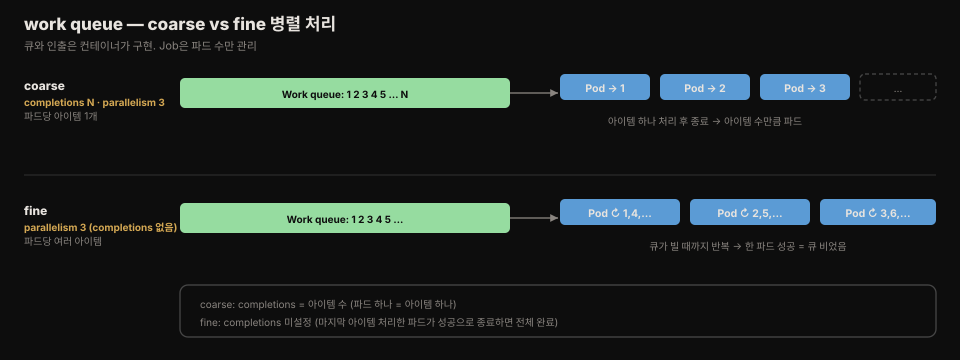
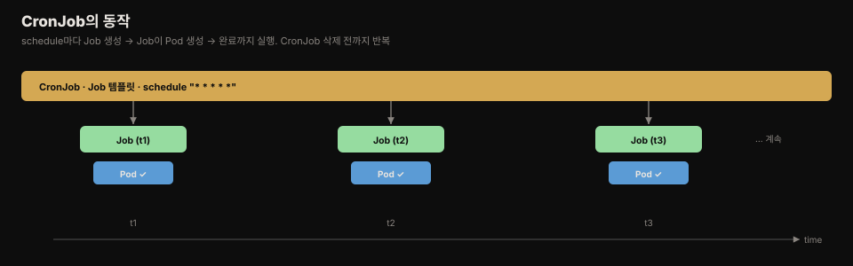
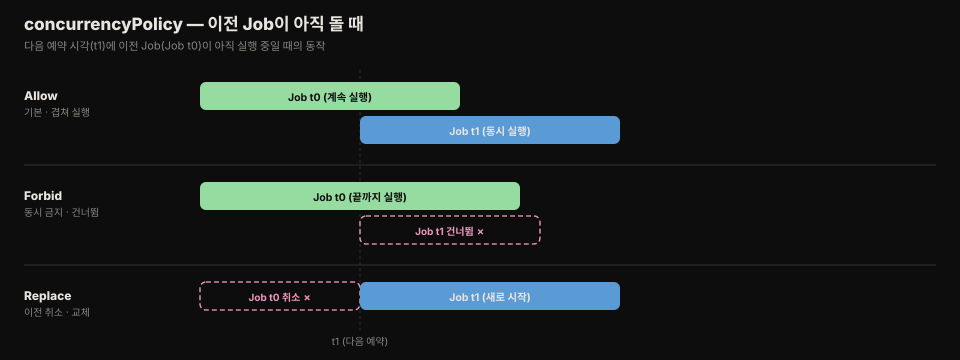

# work queue·pod 통신·sidecar·CronJob

> Job은 정적으로 나눈 일뿐 아니라 큐에서 동적으로 일을 꺼내 처리하고, 파드끼리 통신하며, 사이드카를 담을 수 있습니다. 그리고 이 모든 Job을 시간표에 따라 돌리는 것이 CronJob입니다.

읽고 나면 work queue를 coarse·fine 방식으로 처리하는 Job을 구분하고, 인덱스 Job의 파드가 어떻게 서로를 찾는지 설명하고, Job에 사이드카를 올바르게 넣는 법을 말하고, CronJob의 schedule·동시성 정책·자동 삭제를 설정할 수 있습니다.


## 진입 — 정적 분할에서 동적 큐로, 그리고 예약 실행으로
> 앞 편의 Job은 일을 미리 정해 나눴습니다. 실제로는 큐에서 일을 꺼내 쓰거나, 정해진 시각에 반복 실행해야 할 때가 많습니다.

앞 편([18-02](./18-02.Job%20%EB%B3%91%EB%A0%AC%C2%B7%EC%8B%A4%ED%8C%A8%C2%B7%EC%99%84%EB%A3%8C%20%EB%AA%A8%EB%93%9C.md))의 Job은 정적인 일(월별 집계)을 파드에 나눴습니다. 하지만 처리할 일이 동적으로 정해지는 경우도 많습니다. 이때는 입력을 Job에 박아 넣는 대신, 파드가 큐에서 일을 꺼내 처리합니다.


## 1. work queue로 일 처리
> 큐와 아이템 인출은 Kubernetes가 아니라 컨테이너가 구현합니다. Job은 파드 수만 관리합니다.

Kubernetes 자체가 큐 기능을 제공하는 것은 아닙니다. 큐와, 큐에서 아이템을 꺼내는 컴포넌트를 컨테이너 안에 직접 구현해야 합니다. 그런 다음 그 컨테이너를 파드로 돌리는 Job을 만듭니다. 큐 처리에는 두 방식이 있습니다.



### 1.1 coarse — 파드당 아이템 하나

coarse(굵은) 병렬 처리에서 각 파드는 큐에서 아이템 하나를 꺼내 처리하고 종료합니다. 따라서 work 아이템당 파드 하나가 나옵니다.

```yaml
apiVersion: batch/v1
kind: Job
metadata:
  name: aggregate-responses-queue-coarse
spec:
  completions: 6      # 여섯 개 아이템 처리 (파드당 하나)
  parallelism: 3      # 세 파드 동시 실행
  template:
    spec:
      restartPolicy: OnFailure
      containers:
        - name: processor
          image: mongo:5
          command: [...]   # 큐에서 하나 꺼내 처리하는 스크립트
```

스크립트는 큐에서 아이템 하나(`findOneAndDelete`)를 꺼내 처리합니다. 큐가 비면 exit code 0으로 종료해 처리 완료를 알립니다.

```javascript
var workItem = db.monthsToProcess.findOneAndDelete({});
if (workItem == null) {
    print("No work item found. Processing is complete.");
    quit(0);            // 큐가 비면 성공으로 종료
}
// ... 아이템 처리 ...
quit(0);
```

`completions=6`이므로 파드 여섯 개가 각각 아이템 하나씩 처리합니다.

### 1.2 fine — 파드당 여러 아이템

fine(가는) 병렬 처리에서 각 파드는 큐가 빌 때까지 여러 아이템을 처리합니다. 아이템을 꺼내 처리하고, 다음 아이템을 꺼내 반복합니다.

```yaml
apiVersion: batch/v1
kind: Job
metadata:
  name: aggregate-responses-queue-fine
spec:
  parallelism: 3      # completions는 설정하지 않음
  template:
    spec:
      ...
```

fine 방식은 `completions`를 설정하지 않습니다. 파드 하나가 성공적으로 완료됐다는 것은 큐의 모든 아이템이 처리됐음을 뜻하기 때문입니다(마지막 아이템을 처리한 파드가 성공으로 종료). 스크립트는 큐가 빌 때까지 루프를 돕니다.

```javascript
while (true) {
    var workItem = db.monthsToProcess.findOneAndDelete({});
    if (workItem == null) {
        print("No work item found. Processing is complete.");
        quit(0);        // 큐가 비면 루프 종료
    }
    // ... 아이템 처리 ...
}
```

한 파드가 성공을 보고했을 때 다른 파드가 아직 아이템을 처리 중이면, Job 컨트롤러는 다른 파드들이 일을 마치도록 놔둡니다. 죽이지 않습니다.

### 1.3 Job은 지속 감시가 아니다

Job이 완료된 뒤 큐에 새 아이템을 넣으면 어떻게 될까요? Kubernetes는 큐를 모릅니다. 파드 안 컨테이너만 큐의 존재를 압니다. 그래서 Job이 끝난 뒤 새 아이템을 추가해도, Job을 다시 만들지 않는 한 처리되지 않습니다.

Job은 작업을 완료까지 실행하도록 설계됐지, 지속적으로 감시하도록 설계되지 않았습니다. 큐를 계속 감시하는 워커 파드가 필요하면 Deployment로 돌려야 합니다. 정해진 주기로 Job을 돌리려면 CronJob을 씁니다(아래 4절).


## 2. Job 파드 간 통신
> 인덱스 Job 파드는 headless Service와 `subdomain`을 쓰면, peer의 이름을 DNS로 계산해 서로 통신할 수 있습니다.

대부분 Job 파드는 서로 독립적으로 돌지만, 일부 작업은 파드끼리 통신해야 합니다. 파드가 특정 peer(임의의 파드가 아니라)와 통신하려면 세 가지를 하면 됩니다.

1. Job의 `completionMode`를 `Indexed`로 설정합니다.
2. headless Service를 만듭니다.
3. Pod 템플릿의 `subdomain`을 그 Service로 설정합니다.

### 2.1 headless Service와 subdomain

```yaml
apiVersion: v1
kind: Service
metadata:
  name: demo-service
spec:
  clusterIP: none         # headless Service (11장 참조)
  selector:
    job-name: comm-demo   # Job이 만든 파드에 자동으로 붙는 레이블
  ports:
    - name: http
      port: 80
```

셀렉터는 Job이 만든 파드와 일치해야 하는데, 가장 쉬운 방법은 자동으로 붙는 `job-name` 레이블을 쓰는 것입니다. 이 값은 Job 이름과 같으므로, 셀렉터의 값이 Job 이름과 일치해야 합니다.

```yaml
apiVersion: batch/v1
kind: Job
metadata:
  name: comm-demo         # 위 Service 셀렉터의 값과 일치
spec:
  completionMode: Indexed
  completions: 2
  parallelism: 2          # 두 파드가 병렬로 돌며 서로 통신
  template:
    spec:
      subdomain: demo-service   # headless Service 이름
      restartPolicy: Never
      containers:
        - name: comm-demo
          image: busybox
          command: [sleep, "600"]
```

`completionMode`를 `Indexed`로 두고 `subdomain`을 headless Service 이름으로 설정하면, 파드들은 DNS로 서로를 찾을 수 있습니다.

### 2.2 peer 이름 계산

첫 파드의 hostname을 확인하면 다음과 같습니다.

```bash
$ kubectl exec comm-demo-0-mrvlp -- hostname -f
comm-demo-0.demo-service.kiada.svc.cluster.local
```

두 번째 파드는 이 주소로 첫 파드와 통신할 수 있습니다. 파드 이름은 임의(random)임에도, Job 안 파드는 다음 패턴으로 peer 이름을 계산할 수 있습니다.

```
comm-demo-0.demo-service.kiada.svc.cluster.local
└── Job 이름 + 인덱스 ┘ └ Service ┘ └ NS ┘ └ 클러스터 도메인 ┘
```

같은 네임스페이스라면 FQDN이 아니라 짧은 이름(`comm-demo-0.demo-service`)으로도 접속할 수 있습니다. 파드는 `completions` 값으로 몇 개의 파드가 같은 Job에 속하는지 알기에, DNS로 모든 peer 이름을 계산할 수 있습니다. Kubernetes API 서버에 물을 필요가 없습니다. 이 방식은 16장 StatefulSet의 per-pod DNS(`<pod>-<ordinal>.<service>`)와 같은 패턴입니다.


## 3. Job 파드의 사이드카
> Job 파드에서 사이드카는 반드시 `restartPolicy: Always`인 init 컨테이너로 정의해야 합니다. 일반 컨테이너에 두면 Job이 영원히 완료되지 않습니다.

Job 파드도 일반 파드처럼 사이드카를 담을 수 있습니다. 단 한 가지 주의점이 있습니다. Job 파드는 **모든 컨테이너가 멈춰야** 완료로 간주됩니다. 메인 컨테이너는 작업이 끝나면 종료하지만, 사이드카는 보통 무한히 돕니다. 사이드카를 Pod 템플릿의 `spec.containers`에 두면 파드가 완료되지 못합니다.

### 3.1 잘못된 방법 — 일반 컨테이너

메인과 사이드카를 둘 다 `spec.containers`에 정의하면, 사이드카가 절대 멈추지 않아 파드가 완료되지 않습니다.

```bash
$ kubectl get jobs
NAME              STATUS    COMPLETIONS   DURATION   AGE
demo-bad-sidecar  Running   0/1           2m46s      2m46s
```

메인 컨테이너가 완료돼도 파드는 계속 돌고 `NotReady`(2/2 → 1/2)로 표시됩니다. 메인 컨테이너가 더 이상 ready가 아니기 때문입니다. Job은 무한히 실행 중으로 남습니다. 이 상태를 해결할 방법은 Job을 지우는 것뿐입니다.

### 3.2 올바른 방법 — 네이티브 사이드카

Job 파드에 사이드카를 넣는 올바른 방법은 5장에서 배운 대로 `initContainers`에 `restartPolicy: Always`로 정의하는 것입니다.

```yaml
apiVersion: batch/v1
kind: Job
metadata:
  name: demo-good-sidecar
spec:
  completions: 1
  template:
    spec:
      restartPolicy: OnFailure
      initContainers:
        - name: sidecar
          restartPolicy: Always    # 네이티브 사이드카 = restartPolicy Always인 init 컨테이너
          image: busybox
          command:
            - sh
            - -c
            - "while true; do echo 'Sidecar still running...'; sleep 5; done"
      containers:
        - name: demo             # 메인 컨테이너는 평범하게 정의
          image: busybox
          command: [sleep, "20"]
```

이렇게 하면 메인 컨테이너가 끝났을 때 파드가 `Completed`로 표시되고, 사이드카는 그 뒤 종료됩니다. 파드가 완료됐으므로 Job도 완료됩니다.


## 4. CronJob — Job을 예약 실행
> CronJob은 Job 템플릿과 schedule을 감싸, 정해진 시각·주기마다 Job을 자동으로 만듭니다.

Job 오브젝트를 만들면 즉시 실행됩니다. suspend로 만든 뒤 나중에 재개할 수는 있어도, 특정 시각에 실행하도록 설정할 수는 없습니다. 이를 위해 Job을 `CronJob`으로 감쌉니다.

CronJob에는 Job 템플릿과 schedule을 지정합니다. CronJob 컨트롤러는 이 schedule에 따라 템플릿에서 새 Job 오브젝트를 만듭니다. 하루 여러 번, 특정 시각, 특정 요일 등으로 설정할 수 있습니다. CronJob 오브젝트를 지울 때까지 컨트롤러는 계속 Job을 만듭니다.



### 4.1 CronJob 생성

매분 Job을 도는 CronJob입니다.

```yaml
apiVersion: batch/v1
kind: CronJob            # CronJob도 batch/v1
metadata:
  name: aggregate-responses-every-minute
spec:
  schedule: "* * * * *"  # crontab 형식. 이 값은 매분 실행
  jobTemplate:           # CronJob은 Job 템플릿을 지정해야 함
    metadata:
      labels:
        app: aggregate-responses-today
    spec:
      template:
        spec:
          restartPolicy: OnFailure
          containers:
            - name: updater
              image: mongo:5
              command: [...]
```

CronJob은 Job을 감싼 얇은 래퍼입니다. `spec`의 핵심은 `schedule`과 `jobTemplate` 둘뿐입니다. 조회는 `kubectl get cj`(cj는 CronJob의 약어)로 합니다.

```bash
$ kubectl get cj
NAME                               SCHEDULE    ...  ACTIVE  LAST SCHEDULE  AGE
aggregate-responses-every-minute   * * * * *   ...  0       <none>         2s
```

CronJob 컨트롤러는 Job 컨트롤러와 달리 Job에 레이블을 자동으로 붙이지 않습니다. 특정 CronJob이 만든 Job을 나열하려면 Job 템플릿에 직접 레이블을 넣어야 합니다(위 예의 `app: aggregate-responses-today`).

> 언제든 CronJob에서 Job을 수동으로 만들 수 있습니다. `kubectl create job my-job --from=cronjob/my-cronjob`은 예약 시각을 기다리지 않고 CronJob을 테스트할 때 유용합니다.

### 4.2 상세 상태

`kubectl get cj`는 현재 활성 Job 수와 마지막 예약 시각만 보여 줄 뿐, 마지막 Job이 성공했는지는 알려 주지 않습니다. Job을 직접 나열하거나 CronJob의 `status`를 YAML로 봅니다.

```bash
$ kubectl get cj aggregate-responses-every-minute -o yaml
...
status:
  active:                # 현재 실행 중인 Job 목록
    - apiVersion: batch/v1
      kind: Job
      name: aggregate-responses-every-minute-27755221
      ...
  lastScheduleTime: "2022-10-09T11:01:00Z"    # 마지막 예약 시각
  lastSuccessfulTime: "2022-10-09T11:00:41Z"  # 마지막 성공 시각
```

`lastScheduleTime`과 `lastSuccessfulTime`을 비교하면 마지막 실행이 성공했는지 추론할 수 있습니다.


## 5. crontab schedule 형식
> schedule은 다섯 필드(분·시·일·월·요일)로 이뤄지며, 각 필드에 단일 값·범위·목록·간격을 쓸 수 있습니다.

`schedule`은 crontab 형식으로 씁니다. 다섯 필드가 왼쪽부터 분·시·일(월중)·월·요일입니다.

```
schedule: "* * * * *"
           │ │ │ │ └── 요일 (0-6 또는 SUN-SAT)
           │ │ │ └──── 월 (1-12 또는 JAN-DEC)
           │ │ └────── 일 (1-31)
           │ └──────── 시 (0-23)
           └────────── 분 (0-59)
```

별표(`*`)는 해당 필드의 모든 값과 일치합니다. 각 필드에 별표만 있으면 매분 실행됩니다.

| 값 | 의미 |
|----|------|
| `5` | 단일 값. 월 필드에 `5`면 5월에만 |
| `MAY` | 월·요일 필드는 세 글자 이름 사용 가능 |
| `1-5` | 범위(양끝 포함). 월 필드에 `1-5`면 1~5월 |
| `1,2,5-8` | 목록·범위 조합. 월 필드면 1·2·5·6·7·8월 |
| `*/3` | 첫 값부터 N칸마다. 월 필드에 `*/3`면 1·4·7·10월 |
| `5/2` | 지정 값부터 N칸마다. 월 필드에 `5/2`면 5·7·9·11월 |
| `3-10/2` | 범위 안에서 N칸마다. 월 필드에 `3-10/2`면 3·5·7·9월 |

몇 가지 예입니다.

| schedule | 설명 |
|----------|------|
| `* * * * *` | 매분 |
| `15 * * * *` | 매시 15분 |
| `0 0 * 1-3 *` | 1~3월 매일 자정 |
| `*/5 18 * * *` | 매일 18:00~18:59 사이 5분마다 |
| `0 0 * * 1-5` | 평일(월~금) 매일 0시 |

> **일(월중)과 요일 필드의 함정.** CronJob은 모든 필드가 현재 시각과 일치할 때 Job을 만들지만, 일과 요일 필드는 예외입니다. 둘 중 **하나라도** 일치하면 실행합니다(AND가 아니라 OR). 예컨대 `* * 13 * 5`는 "13일이면서 금요일"이 아니라 "매월 13일 또는 매주 금요일"에 실행됩니다.

단순한 스케줄에는 특수 값을 쓸 수 있습니다. `@hourly`(매시 정각)·`@daily`(매일 자정)·`@weekly`(매주 일요일 0시)·`@monthly`(매월 1일 0시)·`@yearly`(또는 `@annually`, 매년 1월 1일 0시)입니다.

### 5.1 시간대 설정

CronJob 컨트롤러는 기본적으로 Controller Manager의 시간대로 스케줄을 계산합니다. Control Plane이 의도와 다른 지역에서 돌면 예상치 못한 시각에 실행될 수 있습니다. `spec.timeZone`으로 시간대를 지정합니다.

```yaml
apiVersion: batch/v1
kind: CronJob
metadata:
  name: runs-at-3am-cet
spec:
  schedule: "0 3 * * *"
  timeZone: CET          # 이 CronJob은 CET 03:00에 실행
  jobTemplate:
    ...
```


## 6. CronJob 운영 — suspend·자동삭제·deadline·동시성
> CronJob은 일시 중단, 완료된 Job 자동 삭제, 시작 마감 시각, 동시 실행 정책을 설정할 수 있습니다.

### 6.1 suspend와 재개

Job처럼 CronJob도 중단할 수 있습니다. 전용 명령이 없어 `kubectl patch`를 씁니다.

```bash
$ kubectl patch cj aggregate-responses-every-minute -p '{"spec":{"suspend": true}}'
```

중단된 동안 컨트롤러는 새 Job을 시작하지 않지만, 이미 도는 Job은 끝까지 놔둡니다. `suspend`를 `false`로 되돌리면 재개됩니다.

### 6.2 완료된 Job 자동 삭제

CronJob 컨트롤러는 완료된 Job을 자동으로 지웁니다. 기본으로 성공 Job 세 개와 실패 Job 한 개를 남깁니다. `spec.successfulJobsHistoryLimit`과 `spec.failedJobsHistoryLimit`으로 조정합니다. 남긴 Job의 파드도 함께 보존되므로 로그를 볼 수 있습니다.

```bash
$ kubectl get job -l app=aggregate-responses-today
NAME                                     STATUS     COMPLETIONS   ...
aggregate-responses-every-minute-...408  Complete   1/1
aggregate-responses-every-minute-...409  Complete   1/1
aggregate-responses-every-minute-...410  Complete   1/1           # 성공 3개만 남음
aggregate-responses-every-minute-...411  Running    0/1
```

### 6.3 시작 마감 — startingDeadlineSeconds

CronJob 컨트롤러는 예약 시각 즈음에 Job을 만들지만, 클러스터가 바쁘거나 컨트롤러가 오프라인이면 지연될 수 있습니다. Job이 예약 시각에서 너무 늦게 시작되면 안 될 때 `startingDeadlineSeconds`를 씁니다.

```yaml
spec:
  schedule: "* * * * *"
  startingDeadlineSeconds: 30    # 예약 시각 30초 안에 시작 못 하면 그 Job은 실패로 간주
```

컨트롤러가 30초 안에 Job을 만들지 못하면 만들지 않고 `MissSchedule` 이벤트를 냅니다. 이 필드를 설정하지 않고 컨트롤러가 오래 오프라인이었다가 복귀하면, 그동안 놓친 Job을 한꺼번에 모두 만드는 바람직하지 않은 동작이 생길 수 있습니다. 놓친 Job이 100개를 넘으면 컨트롤러는 Job을 만들지 않고 `TooManyMissedTimes` 이벤트를 냅니다. 시작 마감을 설정하면 이 사태를 막을 수 있습니다.

### 6.4 동시성 정책 — concurrencyPolicy

매분 도는 CronJob에서 Job이 1분 넘게 걸리면, 이전 Job이 아직 도는데 새 Job이 뜰까요? 기본적으로 그렇습니다. `spec.concurrencyPolicy`로 이 동작을 바꿉니다.



| 값 | 동작 |
|----|------|
| `Allow`(기본) | 여러 Job이 동시에 실행될 수 있음 |
| `Forbid` | 동시 실행 금지. 이전 실행이 아직 활성이면 새 Job을 만들지 않고 `JobAlreadyActive` 이벤트를 냄 (건너뜀) |
| `Replace` | 활성 Job을 취소하고 새 Job으로 교체. CronJob이 이전 Job을 지우면 Job 컨트롤러가 파드를 우아하게 종료. 잠시 두 Job이 공존(하나는 종료 중) |

### 6.5 CronJob 삭제

CronJob을 지우면 그 CronJob이 만든 모든 Job도 함께 지워지고, 파드도 우아하게 종료됩니다.

```bash
$ kubectl delete cj aggregate-responses-every-minute
```

Job과 파드는 남기고 CronJob만 지우려면 `--cascade=orphan`을 씁니다. 활성 Job이 있을 때 이 옵션으로 CronJob을 지우면, 그 Job은 보존되어 작업을 마칠 수 있습니다.


## 7. Spring 관점 — @Scheduled를 CronJob으로 옮기기
> 앱 안 `@Scheduled` 대신 CronJob을 쓰면, 스케줄이 인스턴스 수와 무관해지고 중복 실행을 정책으로 막을 수 있습니다.

Spring의 `@Scheduled`(또는 Quartz)로 앱 안에서 주기 작업을 돌리면, 애플리케이션 인스턴스를 여러 개 띄웠을 때 같은 작업이 인스턴스마다 중복 실행되는 문제가 생깁니다. 이를 막으려면 ShedLock 같은 분산 락을 붙여야 합니다. CronJob으로 옮기면 스케줄이 앱 인스턴스 수와 분리되고, `concurrencyPolicy: Forbid`로 중복 실행을 컨트롤러 레벨에서 막을 수 있습니다.

트레이드오프는 실행 단위입니다. `@Scheduled`는 이미 떠 있는 프로세스 안에서 도니 JVM warm-up·커넥션 풀을 재활용하지만, CronJob은 매번 새 파드를 띄워 그 비용을 매번 치릅니다. 초 단위로 자주 도는 가벼운 작업은 앱 안 스케줄러가, 분·시 단위로 도는 무거운 배치는 CronJob이 더 맞습니다. 후자는 실패·재시도·타임아웃을 Job의 `backoffLimit`·`activeDeadlineSeconds`로 위임할 수 있다는 이점도 있습니다.


## 면접에서 받을 만한 질문
> 아래 질문에 스스로 답해 본 뒤, 챕터 끝 `## 정답`과 맞춰 봅니다.

1. work queue의 coarse 방식과 fine 방식은 파드와 `completions` 설정에서 어떻게 다릅니까?
2. Job이 완료된 뒤 큐에 새 아이템을 넣으면 왜 처리되지 않습니까? 계속 감시가 필요하면 무엇을 씁니까?
3. Job 파드에 사이드카를 넣는 올바른 방법은 무엇이고, 일반 컨테이너에 넣으면 왜 안 됩니까?
4. CronJob의 crontab에서 일(월중)과 요일 필드를 둘 다 설정하면 어떻게 동작합니까?
5. `concurrencyPolicy`의 `Allow`·`Forbid`·`Replace`는 각각 어떻게 동작합니까?


## 정답 (자답 후 펼치기)
> 위 질문을 스스로 답한 뒤 여기서 확인합니다. 질문 번호와 1:1로 대응합니다.

### 정답 1 — coarse vs fine
coarse는 파드마다 큐 아이템 하나를 처리하고 종료하므로, `completions`를 아이템 수(N)로 설정합니다. fine은 파드마다 큐가 빌 때까지 여러 아이템을 처리하므로, `completions`를 설정하지 않습니다(파드 하나의 성공이 곧 큐가 비었음을 뜻하기 때문). 둘 다 `parallelism`으로 동시 파드 수를 조절합니다.

### 정답 2 — Job은 지속 감시가 아님
Kubernetes는 큐를 모릅니다. 큐의 존재를 아는 것은 파드 안 컨테이너뿐입니다. Job이 끝난 뒤 아이템을 추가해도 Job을 다시 만들지 않는 한 처리되지 않습니다. 큐를 계속 감시해야 하면 Deployment로 워커를 돌리고, 정해진 주기로 돌리려면 CronJob을 씁니다.

### 정답 3 — Job 파드 사이드카
올바른 방법은 사이드카를 `restartPolicy: Always`인 init 컨테이너(네이티브 사이드카)로 정의하는 것입니다. 일반 `spec.containers`에 두면 사이드카가 절대 멈추지 않아 파드가 완료되지 못하고, Job이 영원히 실행 중으로 남습니다(해결책은 Job 삭제뿐).

### 정답 4 — 일·요일 필드 함정
CronJob은 다른 필드는 모두 일치해야(AND) 하지만, 일(월중)과 요일 필드는 **둘 중 하나라도** 일치하면(OR) 실행합니다. `* * 13 * 5`는 "13일이면서 금요일"이 아니라 "매월 13일 또는 매주 금요일"에 실행됩니다.

### 정답 5 — concurrencyPolicy 3종
`Allow`(기본)는 여러 Job이 동시에 실행되도록 허용합니다. `Forbid`는 동시 실행을 금지해, 이전 실행이 활성이면 새 Job을 만들지 않고 건너뜁니다(`JobAlreadyActive`). `Replace`는 활성 Job을 취소(삭제)하고 새 Job으로 교체하며, 이전 Job의 파드는 우아하게 종료됩니다.


## 관련 문서

> 이 편으로 18장(Job·CronJob)과 《Kubernetes in Action, 2nd Ed.》 정독을 마칩니다. work queue·파드 통신·사이드카·CronJob을 다뤘습니다.

- [배치 워크로드](../../kubernetes/01_workloads/01-02.%EB%B0%B0%EC%B9%98%20%EC%9B%8C%ED%81%AC%EB%A1%9C%EB%93%9C.md) — CronJob `concurrencyPolicy`·`startingDeadlineSeconds`·Init/Sidecar 개념본(개념 위임)
- [18-02. Job 병렬·실패·완료 모드](./18-02.Job%20%EB%B3%91%EB%A0%AC%C2%B7%EC%8B%A4%ED%8C%A8%C2%B7%EC%99%84%EB%A3%8C%20%EB%AA%A8%EB%93%9C.md) — 앞 편(Indexed 완료 모드·인덱스)
- [16-01. StatefulSet 기초](./16-01.StatefulSet%20%EA%B8%B0%EC%B4%88%20%E2%80%94%20Pets%20vs%20Cattle%C2%B7ordinal%C2%B7headless%20Service.md) — headless Service·per-pod DNS(`<pod>-<index>` 통신과 동일 패턴)
- [17-03. 로컬 daemon 파드 통신](./17-03.%EB%A1%9C%EC%BB%AC%20daemon%20%ED%8C%8C%EB%93%9C%20%ED%86%B5%EC%8B%A0%20%E2%80%94%20hostPort%C2%B7hostNetwork%C2%B7internalTrafficPolicy.md) — DaemonSet(항상 실행)과 배치(끝나는) 워크로드 대비
- 원서: 《Kubernetes in Action, 2nd Ed.》 Ch18 §18.1.5~18.2 — [Manning](https://www.manning.com/books/kubernetes-in-action-second-edition), [예제 코드](https://github.com/luksa/kubernetes-in-action-2nd-edition/tree/master/Chapter18)
- 공식 문서: [CronJob](https://kubernetes.io/docs/concepts/workloads/controllers/cron-jobs/)
