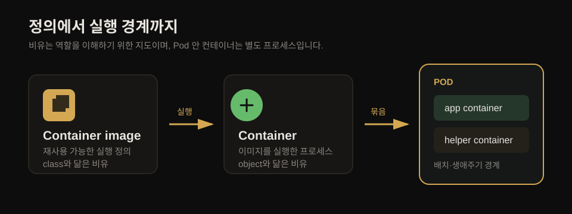
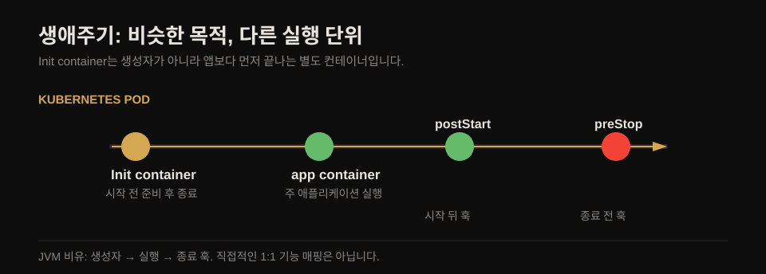
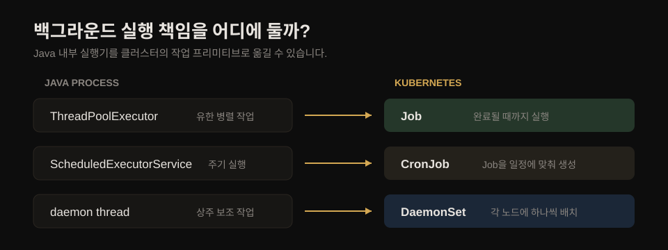
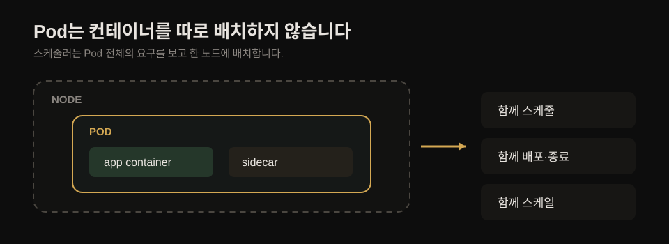
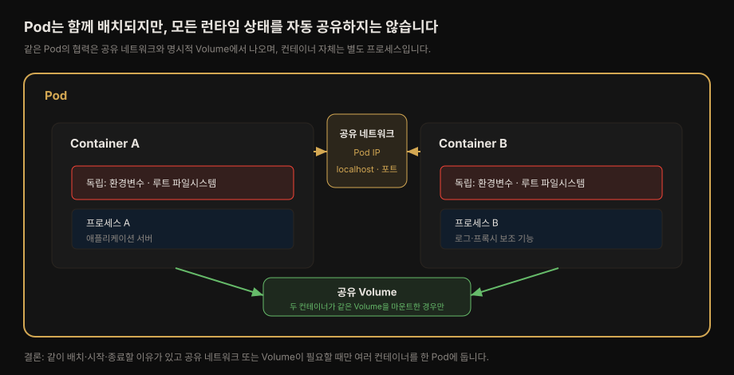
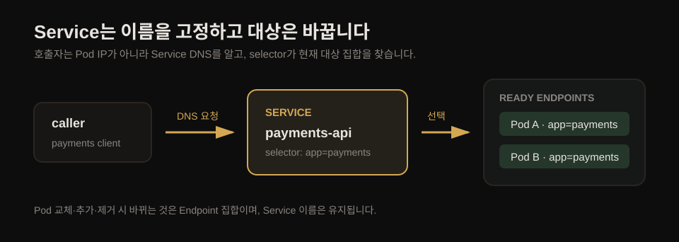
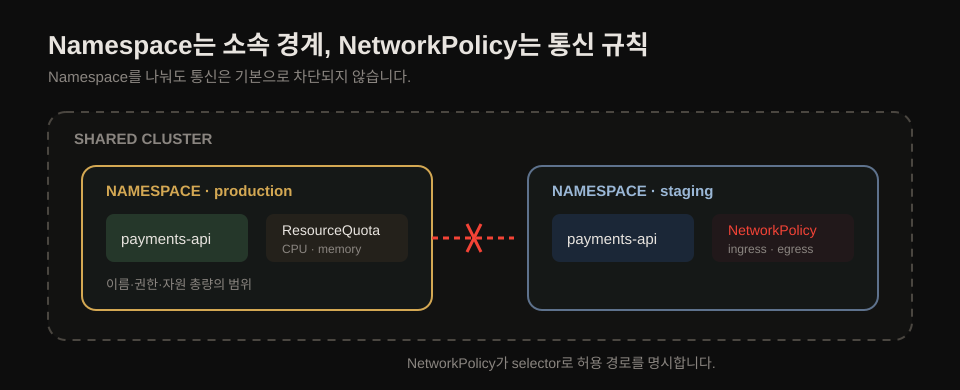

# 분산 프리미티브 — OOP·Java 개념을 Kubernetes로

> Kubernetes는 Java 애플리케이션 바깥에서 동작하는 분산 런타임입니다. class·object 같은 JVM 내부 빌딩 블록을 대체하지 않고, 컨테이너·Pod·Service 같은 분산 프리미티브로 배치·발견·격리의 책임을 맡깁니다.

## 핵심 요약

> 이 장의 핵심은 컨테이너 안의 설계와 컨테이너 바깥의 오케스트레이션을 분리하는 데 있습니다. 좋은 앱을 이미지에 담고, Kubernetes는 그 앱을 여러 노드에서 안정적으로 조합·실행합니다.

JVM은 프로세스 안에서 class·object·thread 같은 로컬 프리미티브를 제공합니다. Kubernetes는 여러 노드에 걸쳐 컨테이너 이미지·Pod·Service·Label·Namespace를 제공해 분산 시스템의 실행 경계를 만듭니다.

두 층위는 같은 문제를 다른 곳에서 풉니다. 이미지와 class, 컨테이너와 object는 함께 쓰는 비유입니다. 반면 여러 replica가 떠 있는 환경의 주기 실행처럼, 일부 로컬 책임은 Kubernetes Job·CronJob으로 옮길 수 있습니다.

## 학습 목표

> 이 문서를 읽고 나면 다섯 프리미티브의 역할을 연결해 설명하고, Pod·Service·Namespace의 경계를 혼동하지 않고 판단할 수 있습니다.

1. 컨테이너 안 설계와 Kubernetes 오케스트레이션이 각각 무엇을 책임지는지 설명할 수 있습니다.
2. 이미지·컨테이너·Pod, 생애주기 훅, 백그라운드 작업의 JVM/Kubernetes 대응을 구분할 수 있습니다.
3. Pod·Service·Label·Namespace가 해결하는 문제와 서로 다른 경계를 설명할 수 있습니다.
4. Namespace만으로 네트워크 격리가 되지 않는 이유와 NetworkPolicy가 필요한 조건을 판단할 수 있습니다.

## 클라우드 네이티브는 컨테이너 안에서 시작합니다

> Kubernetes는 잘 설계된 애플리케이션을 운영하는 플랫폼이지, 내부 설계의 문제를 자동으로 해결하는 도구는 아닙니다.

마이크로서비스는 비즈니스 복잡도를 작은 서비스로 나누지만 운영 복잡도를 늘립니다. Kubernetes는 그 운영을 자동화합니다. 그러나 모듈 경계와 도메인 모델이 흐린 애플리케이션을 컨테이너화해도, 문제는 여러 노드로 퍼질 뿐입니다.

| 설계 기법 | 책임 |
|-----------|------|
| Clean Code·Software Craftsmanship | 변수·메서드·클래스 수준의 유지보수성 |
| Domain-Driven Design | 비즈니스 경계·트랜잭션·소비하기 쉬운 인터페이스 |
| Hexagonal·Onion·Clean 아키텍처 | 핵심 비즈니스 로직과 인프라의 분리 |
| Microservices·12-Factor App | 분산 환경의 확장성·회복력·변경 속도 |
| Containers | 앱과 런타임 의존성을 패키징하는 실행 단위 |
| Cloud Native·Kubernetes | 컨테이너화한 앱을 규모 있게 자동화하는 패턴과 플랫폼 |

이 책은 마지막 두 층위, 특히 컨테이너 오케스트레이션 패턴에 집중합니다. 앞선 설계 기법은 범위 밖이지만, 이후 패턴이 효과를 내려면 여전히 필요합니다.

## 로컬 프리미티브와 분산 프리미티브

> 대응표는 1:1 번역표가 아니라, 같은 개발 관심사를 JVM 내부와 Kubernetes 클러스터가 각각 어떻게 실현하는지 보여 주는 지도입니다.

### 이미지·컨테이너·Pod

컨테이너 이미지는 재사용 가능한 실행 정의이므로 class와 닮았습니다. 이미지를 실행한 컨테이너는 object와 닮았고, Pod는 이 실행 프로세스들을 같은 배치·생애주기 경계로 묶습니다.

이 비유는 생애주기와 합성을 이해하는 데만 씁니다. Pod 안 컨테이너는 같은 JVM 힙의 객체가 아니라 별도 프로세스입니다.

### 초기화와 종료 훅

Init container는 앱 컨테이너가 시작되기 전에 준비 작업을 끝낸다는 점에서 생성자와 닮았습니다. `postStart`와 `preStop`은 각각 시작 뒤와 종료 전의 생애주기 훅에 가깝습니다.

비유의 한계도 남습니다. Init container는 생성자처럼 객체 상태를 만드는 코드가 아니라, 별도 컨테이너 프로세스로 선행 조건을 준비하고 종료합니다.

### 백그라운드와 주기 작업

유한한 병렬 작업은 Job, 주기 실행은 CronJob, 노드마다 항상 살아야 하는 작업은 DaemonSet이 맡습니다. 이들은 Java의 thread pool·`ScheduledExecutorService`·daemon thread와 비슷한 목적을 클러스터 수준으로 옮깁니다.

CronJob이 업무의 정확히 한 번 실행을 자동 보장하는 것은 아닙니다. 여기서는 스케줄 실행 책임을 앱 replica에서 클러스터로 옮길 수 있다는 경계만 잡고, 동시성·멱등성은 [08-01 Periodic Job](./08-01.Periodic%20Job%20%E2%80%94%20CronJob%EC%9C%BC%EB%A1%9C%20%EC%8B%9C%EA%B0%84%20%EC%B6%95%EC%9D%84%20%EB%8D%94%ED%95%98%EB%8B%A4.md)에서 다룹니다.

## Container는 단일 관심사의 실행 단위입니다

> 컨테이너는 이미지를 실행한 프로세스 단위이며, 좋은 이미지는 한 팀이 독립적으로 빌드·릴리스·교체할 수 있는 경계를 만듭니다.

이미지는 불변으로 빌드하고 설정으로만 조정하는 편이 안전합니다. 같은 이미지를 환경마다 다시 만들지 않아도 되고, 실행 시점의 차이는 설정·Secret·ConfigMap 같은 외부 입력으로 분리할 수 있습니다.

좋은 컨테이너 이미지는 다음 성격을 가집니다.

1. 하나의 관심사를 다루고 명확한 API를 노출합니다.
2. 런타임 의존성과 자원 요구를 스스로 선언합니다.
3. 한 팀이 소유하며 독립된 릴리스 주기를 가집니다.
4. 처분 가능하므로 언제든 교체·확장·축소할 수 있습니다.

## Pod는 스케줄링·배포·격리의 원자입니다

> Pod는 컨테이너 하나 또는 밀착 협력하는 여러 컨테이너를 같은 노드에 배치·시작·종료하는 최소 단위입니다.

스케줄러는 개별 컨테이너가 아니라 Pod 전체의 자원 요구를 보고 노드를 고릅니다. 그래서 Pod 안 컨테이너는 함께 배포·스케일되며, 서로 독립 배포해야 하는 기능을 한 Pod에 넣으면 그 독립성을 잃습니다.

Pod 안 컨테이너는 하나의 Pod IP·포트 범위와 `localhost`를 공유합니다. 반대로 환경변수와 루트 파일시스템은 컨테이너별로 독립적이며, 파일을 공유하려면 같은 Volume을 명시적으로 마운트해야 합니다.

같은 Pod는 localhost 통신이나 공동 로그 Volume처럼 같은 생애주기의 협력이 필요할 때만 선택합니다. 프로세스 네임스페이스도 기본으로 공유되지 않으므로, 별도 설정 없이는 한 컨테이너가 다른 컨테이너의 프로세스를 직접 보지 못합니다.

## Service는 변하는 Pod 앞의 안정적인 진입점입니다

> Pod IP는 교체될 수 있으므로 소비자는 Pod가 아니라 Service 이름으로 통신합니다. Service는 selector로 현재 준비된 Pod 집합을 계속 발견합니다.

Service는 자신의 DNS 이름과 가상 IP를 통해 안정적인 접속점을 제공합니다. Pod가 스케일되거나 교체돼도 소비자는 같은 Service를 호출하고, Endpoint 집합만 바뀝니다.

Service가 여러 Pod 가운데 하나를 영구적으로 고정하는 것은 아닙니다. Label은 Service가 Pod를 연결하는 선이 아니라, 현재의 대상 집합을 선택하는 기준입니다.

## Label은 검색·선택을 위한 메타데이터입니다

> Label은 리소스에 의미를 붙이고 selector가 대상 집합을 찾게 하는 검색용 메타데이터입니다. Namespace처럼 소속을 정하거나 Annotation처럼 설명을 보관하는 용도가 아닙니다.

`app=payments-api`처럼 Label을 붙이면 Service·ReplicaSet·NetworkPolicy·스케줄링 규칙이 같은 대상 집합을 선택할 수 있습니다. 따라서 Label을 제거하거나 값의 의미를 바꾸기 전에는 어떤 selector가 그것을 쓰는지 확인해야 합니다.

| 목적 | 사용할 메타데이터 | 예 |
|------|------------------|----|
| 대상 선택·질의 | Label | `app=payments-api`, `tier=backend` |
| 도구용 설명·추적 | Annotation | 빌드 ID, Git commit, 배포 도구 정보 |
| 이름·권한·쿼터 스코프 | Namespace | `production`, `staging` |

처음부터 모든 가능성을 Label로 모델링하지는 않습니다. 실제로 selector가 소비할 정보만 Label로 두고, 검색하지 않을 빌드·작성자·도구 정보는 Annotation으로 분리합니다.

## Namespace는 소속·권한·쿼터의 경계입니다

> Namespace는 한 클러스터를 논리적 자원 풀로 나누지만, 기본으로 네트워크 패킷을 차단하지는 않습니다. 실제 통신 격리는 NetworkPolicy가 맡습니다.

Namespace 안에서는 Pod·Service·ConfigMap 같은 namespaced 리소스의 이름이 고유해야 합니다. 그래서 `production`과 `staging`에는 같은 이름의 `payments-api` Service를 각각 둘 수 있습니다.

**ResourceQuota**는 Namespace 전체가 쓸 수 있는 CPU·메모리·오브젝트 수의 상한을 정합니다. 반면 **NetworkPolicy**는 Label selector를 사용해 어떤 Pod의 ingress·egress를 허용할지 정합니다.

강한 보안·장애 격리가 필요하면 별도 클러스터를 검토할 수 있습니다. 그러나 Namespace와 ResourceQuota·NetworkPolicy를 함께 쓰는 것은 공유 클러스터에서 팀·환경을 나누는 일반적인 패턴입니다.

## 심화 학습

> Spring `ApplicationContext` 비유와 cloud native의 범위를 보강합니다. 둘 다 Kubernetes 오브젝트의 정확한 동작을 대체하는 정의는 아닙니다.

### Pod와 Spring ApplicationContext의 유효 범위

Pod와 Spring `ApplicationContext`는 여러 실행 단위의 생애주기를 관리한다는 점에서 닮았습니다. Spring은 Bean을 생성하고 의존성을 주입하지만, Pod의 컨테이너는 네트워크·Volume·IPC로 통신하는 별도 프로세스입니다.

이 비유는 같은 생애주기라는 구조를 설명할 때만 유효합니다. Spring Bean처럼 직접 메서드를 호출하거나 JVM 힙을 공유한다고 생각하면, Pod에 여러 컨테이너를 넣는 기준을 잘못 잡게 됩니다.

### cloud native와 Kubernetes는 같은 말이 아닙니다

이 책은 설명의 편의를 위해 cloud native를 Kubernetes와 가깝게 사용합니다. 더 넓게 보면 cloud native는 컨테이너·마이크로서비스·불변 인프라·선언적 API를 포괄하고, Kubernetes는 이를 구현하는 대표 플랫폼입니다.

- 출처: [CNCF Cloud Native Definition v1.0](https://github.com/cncf/toc/blob/main/DEFINITION.md) (2026-07-16 조회)
- 출처: [The Twelve-Factor App](https://12factor.net/) (2026-07-16 조회)

## 결정 치트시트

> 비슷해 보이는 Kubernetes 프리미티브는 해결하는 문제가 다릅니다. 아래 표는 설계할 때 먼저 물어볼 질문과 선택 기준을 압축합니다.

| 질문 | 선택 | 이유 |
|------|------|------|
| 실행 단위를 불변으로 패키징해야 하는가? | Container image | 앱과 런타임 의존성을 재사용 가능한 정의로 만듭니다. |
| 함께 배치·종료해야 하는 프로세스인가? | Pod | 같은 노드와 생애주기 경계를 보장합니다. |
| 교체되는 Pod를 안정적으로 호출해야 하는가? | Service + Label | 고정 이름과 동적 Endpoint 선택을 분리합니다. |
| 리소스를 검색·매칭해야 하는가? | Label | selector가 논리적 대상 집합을 찾습니다. |
| 이름·권한·자원 총량을 나눠야 하는가? | Namespace + ResourceQuota | 클러스터 안에 논리적 운영 경계를 만듭니다. |
| Pod 간 통신을 허용 목록으로 제한해야 하는가? | NetworkPolicy | Namespace만으로 없는 네트워크 격리를 추가합니다. |

## 실무 적용

> 이 장의 실무 적용은 새 매니페스트를 외우는 일이 아니라, 기존 설계에서 책임을 어느 층위에 둘지 점검하는 일입니다.

### 한 가지 실행

다음 Deployment 리뷰에서 Pod 안 컨테이너마다 이 질문을 던집니다. "이 기능은 앱과 같은 노드·배포·스케일·종료 경계를 반드시 공유하는가?" 답이 아니오라면 Sidecar가 아니라 별도 Pod 또는 별도 Service를 먼저 검토합니다.

### 자주 생기는 오해

1. Namespace를 나누면 네트워크도 나뉜다고 생각합니다. 실제 통신 차단에는 NetworkPolicy와 이를 지원하는 CNI가 필요합니다.
2. Pod 안 컨테이너가 모든 설정과 파일을 공유한다고 생각합니다. 공유되는 것은 네트워크와 명시적으로 마운트한 Volume이며, 환경변수와 루트 파일시스템은 독립적입니다.
3. CronJob을 쓰면 업무 중복이 사라진다고 생각합니다. CronJob은 실행 책임을 옮기지만, 재시도와 장애 시 중복을 견디는 멱등성은 업무 로직이 설계해야 합니다.

## Spring 앱 개발 관점

> Spring Boot 컨테이너 하나를 기본 배포 단위로 두고, 같은 생애주기와 로컬 협력이 꼭 필요할 때만 Sidecar를 같은 Pod에 둡니다.

여러 replica가 실행되는 Spring 앱의 `@Scheduled` 작업은 중복될 수 있습니다. 이 장에서는 이를 로컬 책임에서 분산 책임으로 옮길지 판단하고, 구체적인 CronJob 실행 정책은 후속 Periodic Job 장에서 다룹니다.

## 관련 실습

> 이 장은 분산 프리미티브의 역할과 경계를 세우는 이론 중심 장입니다. 이번 학습 세션에서는 별도 실습을 진행하지 않으며, Phase 3은 사용자 요청으로 생략합니다.

## 핵심 개념 체크리스트

> 그림 없이 다음 문항을 설명할 수 있으면, 이 장의 분산 프리미티브 경계를 자기 말로 재구성할 수 있습니다.

- [ ] 컨테이너 안 설계와 Kubernetes 오케스트레이션의 책임을 구분할 수 있습니다.
- [ ] 이미지·컨테이너·Pod의 비유가 어디까지 유효한지 설명할 수 있습니다.
- [ ] Pod 안에서 공유되는 것과 독립적인 것을 구분할 수 있습니다.
- [ ] Service와 Label selector가 변하는 Pod를 어떻게 숨기는지 설명할 수 있습니다.
- [ ] Label·Annotation·Namespace의 목적 차이를 설명할 수 있습니다.
- [ ] Namespace와 NetworkPolicy가 각각 무엇을 격리하는지 설명할 수 있습니다.

## 면접 대비

> 객체지향 비유를 출발점으로 쓰되, 답변은 실제 Kubernetes 경계와 트레이드오프로 끝냅니다.

### 한 줄 정의

Kubernetes 분산 프리미티브는 컨테이너화된 애플리케이션을 여러 노드에서 배치·발견·격리·운영하기 위한 기본 실행 단위입니다.

### 핵심 포인트

1. 이미지와 컨테이너는 class와 object에 대응하지만, Pod는 별도 프로세스를 같은 생애주기에 묶는 경계입니다.
2. Service는 안정적인 이름을 제공하고, Label selector는 현재 준비된 Pod 집합을 선택합니다.
3. Namespace는 스코프·권한·쿼터를 제공하며, NetworkPolicy가 실제 네트워크 격리를 제공합니다.

### 자주 묻는 질문

**Q. Pod가 스케줄링의 원자라는 말은 무엇입니까?**

스케줄러가 컨테이너마다 다른 노드를 고르지 않고, Pod 안 모든 컨테이너의 자원 요구를 합쳐 한 노드에 배치한다는 뜻입니다. 따라서 Pod 안 컨테이너는 함께 배포·스케일되며, 독립 배포가 필요한 기능을 같은 Pod에 넣으면 안 됩니다.

**Q. Label과 Namespace는 둘 다 리소스를 묶는데 무엇이 다릅니까?**

Label은 selector로 대상 집합을 검색·매칭하는 메타데이터입니다. Namespace는 리소스 이름·권한·쿼터를 적용하는 소속 경계이며, 기본으로 네트워크 접근을 차단하지는 않습니다.

**Q. Pod 안 컨테이너는 무엇을 공유합니까?**

Pod IP·포트 범위·localhost 네트워크를 공유하고, 같은 Volume을 마운트했을 때 그 파일을 공유합니다. 환경변수와 루트 파일시스템은 컨테이너별로 독립적입니다.

## 관련 문서

> 이 장은 Pod·Service의 기초 경계를 세웁니다. 아래 문서는 실제 워크로드와 네트워킹 오브젝트를 더 구체적으로 연결합니다.

- [Kubernetes Patterns 정독 인덱스](./README.md): 책 전체의 학습 순서와 장별 노트입니다.
- [핵심 워크로드](../../kubernetes/01_workloads/01-01.%ED%95%B5%EC%8B%AC%20%EC%9B%8C%ED%81%AC%EB%A1%9C%EB%93%9C.md): Deployment·StatefulSet 등 Pod를 관리하는 워크로드 오브젝트입니다.
- [Service와 EndpointSlice](../../kubernetes/04_networking/04-04.Service%EC%99%80%20EndpointSlice.md): Service가 선택한 Endpoint가 어떻게 유지되는지 다룹니다.

## 참고 자료

> 원서의 1장과 공식 문서는 JVM/Kubernetes의 개념 대응, Pod 경계, Service 선택, Namespace·NetworkPolicy 보강의 근거입니다.

- 원서: 《Kubernetes Patterns, Second Edition》(Bilgin Ibryam·Roland Huß, O'Reilly) Ch1. Introduction
- 이 책의 MOC: [Kubernetes Patterns 정독 인덱스](./README.md)
- 개념 노트: [핵심 워크로드](../../kubernetes/01_workloads/01-01.%ED%95%B5%EC%8B%AC%20%EC%9B%8C%ED%81%AC%EB%A1%9C%EB%93%9C.md) · [Service와 EndpointSlice](../../kubernetes/04_networking/04-04.Service%EC%99%80%20EndpointSlice.md)
- [Kubernetes Pods](https://kubernetes.io/docs/concepts/workloads/pods/) · [Services](https://kubernetes.io/docs/concepts/services-networking/service/) · [Network Policies](https://kubernetes.io/docs/concepts/services-networking/network-policies/) · [Resource Quotas](https://kubernetes.io/docs/concepts/policy/resource-quotas/) (2026-07-16 조회)
- 저자 예제 코드: [k8spatterns/examples](https://github.com/k8spatterns/examples)
