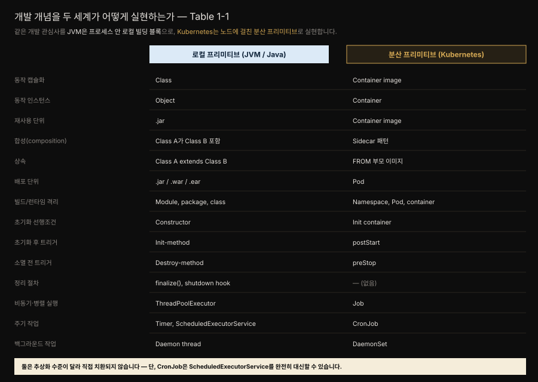
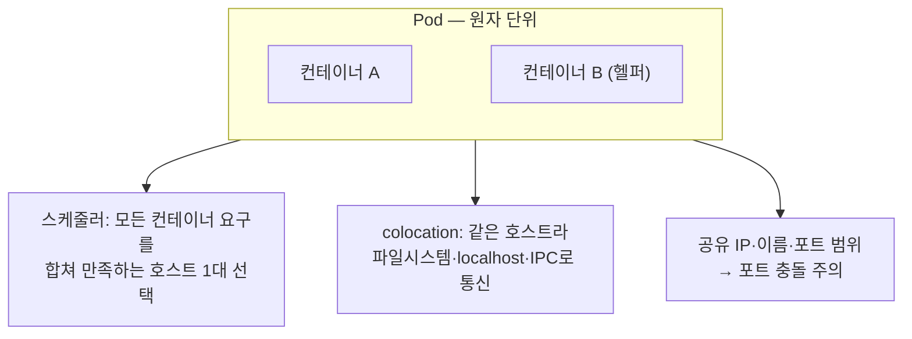

# 분산 프리미티브 — OOP·Java 개념을 Kubernetes로
---
> 『Kubernetes Patterns』 1장 정독. 저자는 이 장을 "패턴을 이해하기 위한 전제가 아니니 익숙하면 건너뛰어도 좋다"고 밝힙니다. 그래도 이 장은 책 전체를 관통하는 한 가지 관점 — **Kubernetes를 JVM에 빗대어, 컨테이너·Pod를 class·object처럼 다루는 분산 프리미티브로 본다** — 을 세워 두므로, Java 개발자에게는 오히려 이 책을 읽는 렌즈를 맞추는 장입니다.

## 핵심 요약

> Kubernetes는 클라우드 네이티브 앱을 위한 **분산 프리미티브**의 집합입니다. JVM이 프로세스 안에서 class·object·jar·스레드 풀 같은 로컬 빌딩 블록을 제공하듯, Kubernetes는 여러 노드에 걸쳐 컨테이너 이미지·Pod·Init container·Job 같은 분산 빌딩 블록을 제공합니다. 이 둘은 추상화 수준이 달라 직접 치환되지는 않지만 개발 개념 단위로 나란히 대응시킬 수 있습니다.

이 장이 세우는 뼈대는 셋입니다. 첫째, 좋은 클라우드 네이티브 앱은 컨테이너 바깥의 오케스트레이션만으로 되지 않고 **컨테이너 안의 설계**(clean code·DDD·hexagonal·microservices)가 받쳐 줘야 합니다 — "쓰레기를 컨테이너에 담으면 분산된 쓰레기를 얻습니다." 둘째, Kubernetes의 오브젝트들은 JVM의 로컬 프리미티브에 **개념적으로 대응**합니다(Table 1-1). 셋째, 앱 개발자가 매일 만지는 핵심 프리미티브는 다섯 — **Container·Pod·Service·Label·Namespace** — 이고 이후 모든 패턴이 이 다섯을 조합해 만들어집니다.

이 책은 clean code·DDD·hexagonal·microservices 자체는 다루지 않습니다. 그것들은 컨테이너 **안쪽**을 잘 설계하는 기법이고 이 책이 다루는 패턴은 컨테이너 **바깥**의 오케스트레이션 관심사이기 때문입니다. 다만 바깥의 패턴이 효과를 내려면 안쪽이 잘 설계돼 있어야 한다는 전제를 분명히 합니다.

## 학습 목표

> 이 편을 읽고 나면 다음을 설명할 수 있습니다.

- 클라우드 네이티브 앱을 만드는 데 필요한 설계 기법 여섯 가지가 무엇이고 그중 이 책이 다루는 범위가 어디까지인지 말한다.
- JVM 로컬 프리미티브와 Kubernetes 분산 프리미티브를 개념 단위로 대응시키고(Table 1-1), 어떤 쌍이 함께 쓰이고 어떤 쌍이 서로를 대체하는지 구분한다.
- Container·Pod·Service·Label·Namespace 다섯 프리미티브의 역할과 경계를 각각 한 문장으로 요약한다.
- Pod가 왜 스케줄링·배포·격리의 원자 단위인지, Label과 Namespace가 왜 서로 다른 목적의 프리미티브인지 설명한다.

## 본문 정리

### 클라우드 네이티브로 가는 길 — 컨테이너 안이 먼저다

마이크로서비스는 클라우드 네이티브 앱을 만드는 대표적 스타일입니다. 비즈니스 역량을 모듈로 쪼개 소프트웨어 복잡도를 다루지만 그 대가로 개발 복잡도를 운영 복잡도로 바꿉니다. 그래서 마이크로서비스를 성공시키는 전제가 **규모 있게 운영할 수 있는 앱**을 만드는 것이고 그 운영을 맡는 것이 Kubernetes입니다.

저자는 컨테이너를 블랙박스로 다루는 이 책에서 굳이 "컨테이너 안에 무엇을 넣는가"를 강조합니다. 이유는 분명합니다. 컨테이너와 플랫폼이 아무리 좋아도, 담긴 것이 엉망이면 규모만 커진 엉망을 얻습니다. 좋은 클라우드 네이티브 앱에는 여러 설계 기법이 함께 필요합니다.

| 설계 기법 | 무엇을 책임지나 |
|-----------|----------------|
| Clean Code·Software Craftsmanship | 변수·메서드·클래스 수준의 장기 유지보수성. 어떤 컨테이너 기술을 쓰든 결국 팀과 산출물이 영향이 가장 큼 |
| Domain-Driven Design | 비즈니스 관점의 설계. 올바른 트랜잭션 경계·소비하기 쉬운 인터페이스·풍부한 API가 컨테이너화·자동화의 토대 |
| Hexagonal·Onion·Clean 아키텍처 | 핵심 비즈니스 로직을 주변 인프라에서 분리. 표준 인터페이스로 이식성·유지보수성을 높임 |
| Microservices + 12-Factor App | 분산 앱 설계의 규범. 확장성·회복력·변경 속도에 최적화된 구현 |
| Containers | 분산 앱을 패키징·실행하는 표준. 모듈화·재사용 가능한 이미지가 전제 |
| Cloud Native | 컨테이너화된 앱을 규모 있게 자동화하는 원칙·패턴·도구. 저자는 이를 Kubernetes와 사실상 동의어로 씀 |

이 책은 이 중 **컨테이너 오케스트레이션 관심사에 해당하는 패턴만** 다룹니다. 나머지 다섯은 컨테이너 안을 잘 설계하는 기법이라 범위 밖이지만 패턴이 효과를 내려면 그 안쪽이 이 기법들로 잘 설계돼 있어야 합니다.

### 분산 프리미티브 — JVM에 빗대어 보기

새 추상화가 무엇인지 설명하려고 저자는 이미 잘 아는 객체지향 프로그래밍(OOP)과 Java에 빗댑니다. OOP에는 class·object·package·상속·캡슐화·다형성이 있고 JVM은 이 객체들의 생애주기를 관리하는 구체적 보장을 제공합니다. 다만 JVM이 주는 것은 **프로세스 안(local, in-process)** 의 빌딩 블록입니다.

Kubernetes는 여기에 완전히 새로운 차원을 더합니다. 여러 노드와 프로세스에 걸쳐 분산 시스템을 짓는 **분산 프리미티브와 런타임**을 제공하는 것입니다. 그래서 앱 동작 전체를 로컬 프리미티브에만 기대지 않아도 됩니다. 여전히 객체지향 빌딩 블록으로 컴포넌트를 만들되, 일부 동작은 Kubernetes 프리미티브로 실현합니다.

여기서 중요한 것은 두 세계가 **직접 치환되지 않는다**는 점입니다. 추상화 수준이 다르고 전제와 보장이 다릅니다. 어떤 쌍은 함께 써야 합니다 — 여전히 class로 object를 만들어 컨테이너 이미지에 담습니다. 반면 어떤 쌍은 서로를 대신합니다 — Kubernetes의 CronJob은 Java의 `ScheduledExecutorService` 동작을 완전히 대체할 수 있습니다. 대응표를 "1:1 대치"가 아니라 "같은 개발 개념을 두 층위에서 어떻게 실현하는가"의 지도로 읽어야 합니다.

### Container — class와 object에 대응하는 단위

컨테이너는 Kubernetes 기반 앱의 빌딩 블록입니다. OOP에 빗대면 **컨테이너 이미지는 class**, **컨테이너는 object**입니다. class를 확장해 동작을 재사용·변경하듯 이미지도 다른 이미지를 확장(FROM)해 재사용·변경하고 object 합성으로 기능을 쓰듯 컨테이너들을 Pod에 담아 협력시킵니다. 이 비유를 더 밀면, Kubernetes는 여러 호스트에 퍼진 JVM이고 Init container는 생성자, DaemonSet은 백그라운드에서 도는 데몬 스레드(예: Java GC)에 해당합니다. Pod는 여러 실행 객체가 관리되는 생애주기를 공유하고 서로 직접 접근하는 **IoC 컨테이너**(예: Spring Framework)와 닮았습니다.

비유는 여기까지지만 요점은 좋은 컨테이너 이미지의 성격입니다. 저자는 컨테이너를 이렇게 보라고 제안합니다.

- 하나의 관심사(single concern)를 다루는 기능 단위다.
- 한 팀이 소유하고 자체 릴리스 주기를 가진다.
- 자기완결적이며 런타임 의존성을 스스로 정의·운반한다.
- 불변이다. 한번 빌드되면 바뀌지 않고 설정으로 조정된다.
- 자원 요구와 외부 의존성을 스스로 정의한다.
- 기능을 노출하는 잘 정의된 API를 가진다.
- 보통 단일 Unix 프로세스로 실행된다.
- 처분 가능(disposable)하며 언제든 스케일 업·다운해도 안전하다.

여기에 더해 좋은 이미지는 **모듈화**돼 있어, 파라미터로 조정되고 여러 환경에서 재사용되도록 만들어집니다. 작고 모듈화된 재사용 가능한 이미지는 프로그래밍 세계의 좋은 재사용 라이브러리처럼, 시간이 지날수록 더 전문화되고 안정된 이미지를 낳습니다.

### Pod — 스케줄링·배포·격리의 원자 단위

컨테이너 하나가 마이크로서비스 하나에 대응하는 경우가 대부분입니다. 이미지는 단일 기능 단위이고 한 팀이 소유하며 독립 릴리스 주기와 격리를 제공하기 때문입니다. 그런데 Kubernetes는 컨테이너 **그룹**의 생애주기를 관리하는 또 하나의 프리미티브를 둡니다 — **Pod**입니다.

Pod는 컨테이너 그룹의 **스케줄링·배포·런타임 격리의 원자 단위**입니다. 한 Pod의 모든 컨테이너는 항상 같은 호스트에 스케줄되고 함께 배포·스케일되며 파일시스템·네트워크·프로세스 네임스페이스를 공유할 수 있습니다. 덕분에 같은 Pod 안 컨테이너들은 파일시스템이나 localhost 네트워크, 호스트 IPC로 서로 통신합니다(성능이 필요할 때 유용합니다). Pod는 앱의 **보안 경계**이기도 합니다 — 원칙적으로 컨테이너마다 보안 파라미터를 달리할 수 있지만 보통 한 Pod 안 컨테이너는 같은 접근 수준·네트워크 분할·아이덴티티를 갖습니다.

빌드 시점의 마이크로서비스가 한 팀이 개발·릴리스하는 컨테이너 이미지라면, **런타임의 마이크로서비스는 Pod**입니다. 컨테이너를 스케일이든 마이그레이션이든 실행하는 유일한 길은 Pod 추상화를 거치는 것입니다. 때로는 한 Pod가 여러 컨테이너를 담습니다 — 컨테이너화된 마이크로서비스가 런타임에 헬퍼 컨테이너를 함께 쓰는 경우로, 16장 Sidecar가 그 예입니다.

Pod의 성격을 세 가지로 정리합니다.

- **스케줄링의 원자**: 스케줄러는 Pod의 모든 컨테이너 요구를 **합쳐서** 만족하는 호스트를 찾습니다. 컨테이너가 많으면 그만큼 자원이 넉넉한 호스트가 필요합니다(이 과정은 6장 Automated Placement에서 다룹니다).
- **colocation 보장**: 같은 호스트에 놓이므로 공유 파일시스템·localhost·호스트 IPC로 고성능 통신이 가능합니다.
- **공유 네트워크 아이덴티티**: Pod는 IP·이름·포트 범위를 하나 갖고 모든 컨테이너가 공유합니다. 그래서 한 호스트에서 병렬 실행되는 Unix 프로세스가 포트를 나눠 쓰듯, 같은 Pod 안 컨테이너도 포트 충돌을 피하도록 신중히 설정해야 합니다.

Pod는 앱이 사는 Kubernetes의 원자지만 Pod에 직접 접근하지는 않습니다 — 그 자리에 Service가 들어옵니다.

### Service — 사라지는 Pod 앞의 영구 진입점

Pod는 임시적(ephemeral)입니다. 스케일 조정·헬스 체크 실패·노드 마이그레이션 같은 온갖 이유로 언제든 생겼다 사라집니다. Pod IP는 노드에 스케줄돼 시작된 뒤에야 정해지고 노드가 건강하지 않으면 다른 노드로 재스케줄되며 바뀝니다. 즉 Pod의 주소는 앱의 생애 동안 변할 수 있어, 디스커버리와 로드 밸런싱을 위한 또 하나의 프리미티브가 필요합니다.

그것이 **Service**입니다. Service는 이름을 IP·포트에 **영구적으로** 묶어, 앱에 접근하는 이름 붙은 진입점을 제공합니다. 가장 흔한 시나리오에서 Service는 Pod 집합의 진입점이 되지만 늘 그런 것은 아닙니다 — 클러스터 바깥의 기능을 가리킬 수도 있는 일반 프리미티브입니다. 이렇게 Service는 디스커버리와 로드 밸런싱을 맡고 소비자에게 영향을 주지 않으면서 구현을 바꾸거나 스케일하게 해 줍니다. 자세한 내용은 13장 Service Discovery에서 다룹니다.

### Label — 조각들을 하나의 앱으로 묶는 검색용 메타데이터

마이크로서비스는 빌드 시점엔 이미지, 런타임엔 Pod입니다. 그렇다면 여러 마이크로서비스로 이뤄진 "애플리케이션"은 무엇일까요. 마이크로서비스 이전에는 앱이 하나의 배포 단위(.war·.ear)에 단일 버전·릴리스 주기로 대응했습니다. 하지만 앱을 독립적으로 개발·릴리스·재시작·스케일되는 마이크로서비스로 쪼개면, "애플리케이션"이라는 개념 자체가 흐려집니다.

그래도 어떤 독립 서비스들이 한 앱에 속한다고 표시해야 할 때가 있습니다 — 여기서 **Label**을 씁니다. 모놀리스 하나를 세 마이크로서비스로, 다른 하나를 두 마이크로서비스로 쪼갰다고 합시다. 이제 다섯 Pod 정의가 생겼고 앞의 셋이 한 앱, 뒤의 둘이 다른 앱임을 나타내야 할 수 있습니다. Label selector로 Pod 집합을 질의·식별해 **하나의 논리 단위**로 다룰 수 있습니다.

Label이 유용한 지점입니다.

- ReplicaSet은 특정 Pod의 인스턴스 수를 유지하는 데 Label을 씁니다 — 그래서 모든 Pod 정의는 스케줄링에 쓰일 **고유한 Label 조합**을 가져야 합니다.
- 스케줄러도 Label을 적극 씁니다 — Pod를 요구에 맞는 노드에 붙이거나(colocate) 흩뜨릴 때(spread).
- Label은 Pod 집합의 논리적 그룹을 나타내 앱 아이덴티티를 부여합니다.
- 앱의 논리 그룹·비즈니스 중요도·하드웨어 아키텍처·위치 선호 같은 메타데이터를 담습니다.

다만 미리 너무 많은 Label을 달지는 말라고 저자는 경고합니다. 필요하면 나중에 추가할 수 있지만 **제거는 훨씬 위험**합니다 — 어떤 Label이 어디에 쓰이는지 알아낼 뚜렷한 방법이 없어, 지웠을 때의 의도치 않은 영향을 예측하기 어렵기 때문입니다.

> **Annotation — 기계용 메타데이터.** Label과 비슷하지만 목적이 다른 프리미티브가 Annotation입니다. Label처럼 맵으로 구성되지만 **검색·질의 대상이 아닌** 비검색 메타데이터를 기계가 쓰도록 담습니다. 빌드 ID·릴리스 ID·이미지 정보·타임스탬프·Git 브랜치명·PR 번호·이미지 해시·레지스트리 주소·작성자·툴링 정보 같은 것입니다. 정리하면 **Label은 질의·매칭으로 대상에 액션을 걸 때, Annotation은 도구·라이브러리가 소비할 메타데이터를 붙일 때** 씁니다.

### Namespace — 클러스터를 논리 풀로 나누기

또 하나의 그룹 관리 프리미티브가 Namespace입니다. Label과 비슷해 보이지만 성격과 목적이 아주 다릅니다. Namespace는 (보통 여러 호스트에 퍼진) 클러스터를 **논리적 자원 풀**로 나눕니다. 자원에 스코프를 주고 클러스터의 일부에 인가·정책을 적용하는 메커니즘을 제공합니다. 가장 흔한 쓰임은 development·testing·integration·production 같은 **서로 다른 소프트웨어 환경**을 나타내는 것이고 멀티테넌시나 팀·프로젝트 워크스페이스 격리에도 씁니다. 다만 강한 환경 격리에는 Namespace로 부족해, 별도 클러스터를 두는 것이 흔합니다.

Namespace의 성격입니다.

- Namespace 자체가 Kubernetes 리소스로 관리됩니다.
- 컨테이너·Pod·Service·ReplicaSet 같은 리소스에 스코프를 줍니다. 리소스 이름은 **한 Namespace 안에서는 고유**해야 하지만 Namespace를 넘어서는 그럴 필요가 없습니다.
- 기본적으로 스코프만 줄 뿐, 리소스 간 접근을 **격리하지는 않습니다**. development Namespace의 Pod가 production Namespace의 Pod IP를 알면 접근할 수 있습니다(Namespace 간 네트워크 격리는 24장 Network Segmentation에서 다룹니다).
- Namespace·Node·PersistentVolume처럼 Namespace에 속하지 않고 **클러스터 전역 고유 이름**을 갖는 리소스도 있습니다.
- 각 Service는 Namespace에 속하고 `<service-name>.<namespace-name>.svc.cluster.local` 형태의 DNS 레코드를 받습니다. Namespace 이름이 모든 Service URL에 들어가므로 이름을 신중히 지어야 합니다.
- **ResourceQuota**로 Namespace별 자원 소비 총량을 제한합니다. 타입별 오브젝트 개수(예: ConfigMap 5개·Secret 5개·Pod 10개)뿐 아니라, 요청 가능한 컴퓨팅 자원 총량(예: production에 16GB RAM·8코어)도 제한합니다. 기반 인프라의 모양·한계와 분리해 자원 제약을 걸 수 있다는 점이 값집니다.

### 정리 — 다섯 프리미티브 위에서 패턴이 자란다

이 장이 다룬 것은 이 책이 쓰는 핵심 개념 몇 가지뿐입니다. 앱 개발자가 매일 쓰는 프리미티브는 더 많고 클러스터 관리자가 주로 쓰는 개념은 따로 있습니다. 요점은, 이 새 프리미티브들이 문제를 푸는 새로운 방식을 낳고 그중 반복되는 해법이 **패턴**이 된다는 것입니다. 이 책은 각 Kubernetes 리소스를 낱낱이 설명하는 대신, 패턴으로 검증된 개념에 집중합니다.

## 심화 학습

> 본문(원서 1장) 밖에서 보강한 내용입니다. 출처를 링크로 남깁니다.

### Pod = IoC 컨테이너 비유를 Spring으로 당겨 보기

저자가 Pod를 "여러 실행 객체가 관리되는 생애주기를 공유하고 서로 직접 접근하는 IoC 컨텍스트(예: Spring Framework)"에 빗댄 대목은, Spring 개발자에게 특히 잘 붙습니다. Spring `ApplicationContext`가 빈들을 한 생애주기 안에서 생성·초기화·소멸시키고 서로 주입해 협력시키듯, Pod는 그 안의 컨테이너들을 함께 스케줄·시작·종료하고 localhost·공유 볼륨으로 협력하게 합니다. 초기화 순서를 강제하는 Init container는 빈 생성 이전에 도는 준비 작업에, `postStart`/`preStop` 훅은 `@PostConstruct`/`@PreDestroy` 콜백에 각각 견줄 수 있습니다.

이 비유의 한계도 분명합니다. Spring 빈은 같은 JVM 힙을 공유하며 메서드를 직접 호출하지만 Pod 안 컨테이너는 프로세스가 분리돼 네트워크·파일시스템·IPC로만 통신합니다. 즉 "같은 생애주기·상호 접근"은 닮았어도 **결합 강도**가 다릅니다. 그래서 Pod 안에 여러 컨테이너를 넣는 결정은 빈을 한 컨텍스트에 두는 것보다 훨씬 신중해야 하고 그 신중함을 정리한 것이 16장 Sidecar를 비롯한 구조 패턴입니다.

> 관련 개념은 개념 노트로 위임합니다 — 워크로드·Pod 자체는 [핵심 워크로드](../../kubernetes/01_workloads/01-01.%ED%95%B5%EC%8B%AC%20%EC%9B%8C%ED%81%AC%EB%A1%9C%EB%93%9C.md), Service·디스커버리는 [Service와 EndpointSlice](../../kubernetes/04_networking/04-04.Service%EC%99%80%20EndpointSlice.md)를 참조하세요.

### "cloud native = Kubernetes"라는 등치의 조심할 점

저자는 이 책에서 cloud native를 Kubernetes와 사실상 동의어로 씁니다. 편의상의 선택이라고 밝히지만 정확히는 cloud native가 더 넓은 개념입니다. CNCF의 정의(v1.0)는 컨테이너·서비스 메시·마이크로서비스·불변 인프라·선언적 API를 아우르는 접근으로 cloud native를 규정하고 Kubernetes는 그 정의를 구현하는 가장 인기 있는 오픈소스 플랫폼일 뿐입니다. 이 책의 패턴을 다른 오케스트레이터로 옮길 때 이 구분이 의미를 갖습니다 — 패턴의 **의도**는 플랫폼 독립적이지만 이 책이 드는 **구현**은 Kubernetes 오브젝트에 묶여 있습니다.

- 출처: [CNCF Cloud Native Definition v1.0](https://github.com/cncf/toc/blob/main/DEFINITION.md) (2026-07-12 조회)
- 출처: [The Twelve-Factor App](https://12factor.net/) — 저자가 1장 More Information에서 든 참고 자료

## 실무 적용

이 장은 실행 코드가 없는 개념 장이지만 현장에서 바로 쓰는 판단 기준을 남깁니다.

- **"이 동작을 로컬 프리미티브로 짤까, 분산 프리미티브로 넘길까"를 Table 1-1로 판단합니다.** 예를 들어 Spring 앱에 `@Scheduled` 주기 작업이 있다면, 그것을 앱 안에 둘지 Kubernetes CronJob으로 밀어낼지 결정할 때 이 표가 출발점입니다. 앱 인스턴스가 여러 벌 뜨는 환경에서 `@Scheduled`는 중복 실행 위험이 있어, CronJob으로 옮기면 스케줄 실행을 클러스터가 단일하게 보장합니다.
- **컨테이너 이미지 8원칙을 이미지 리뷰 체크리스트로 씁니다.** "단일 관심사인가, 불변인가, 자원 요구를 스스로 정의하는가" 같은 질문은 Dockerfile 리뷰에서 그대로 던질 수 있습니다.
- **Label과 Annotation을 목적으로 구분해 답니다.** 셀렉터·스케줄링에 쓸 것만 Label로, 빌드 ID·Git 커밋·툴링 정보처럼 질의하지 않고 기계가 소비할 것은 Annotation으로 나눕니다. 처음부터 Label을 남발하지 않는 것이 뒤탈이 적습니다.
- **Namespace를 환경·테넌트 경계로 잡되, 강한 격리는 별도 클러스터를 검토합니다.** ResourceQuota로 Namespace별 자원 상한을 인프라 모양과 분리해 거는 습관을 들입니다.

## 체크리스트

- [ ] 좋은 클라우드 네이티브 앱에 필요한 설계 기법 여섯 가지를 대고 이 책이 다루는 범위(오케스트레이션 패턴)와 다루지 않는 범위(컨테이너 안 설계)를 구분할 수 있다.
- [ ] Table 1-1에서 class→컨테이너 이미지, object→컨테이너, 생성자→Init container, ScheduledExecutorService→CronJob 대응을 설명하고 함께 쓰는 쌍과 대체하는 쌍을 구분할 수 있다.
- [ ] 컨테이너 이미지의 성격(단일 관심사·불변·자기완결 등)을 근거로 좋은 이미지를 판별할 수 있다.
- [ ] Pod가 스케줄링·배포·격리의 원자이자 보안 경계인 이유를 세 가지 성격으로 설명할 수 있다.
- [ ] Service가 왜 필요한지(임시적 Pod IP)와 무엇을 보장하는지(영구 진입점·디스커버리·LB)를 말할 수 있다.
- [ ] Label과 Annotation의 목적 차이, Label과 Namespace의 목적 차이를 각각 한 문장으로 구분할 수 있다.

## 면접 관점

**Q. Kubernetes를 JVM에 빗대면 컨테이너 이미지·Pod는 각각 무엇에 대응합니까?**
컨테이너 이미지는 class, 컨테이너는 object에 대응합니다. 이미지를 FROM으로 확장하는 것이 class 상속에, 컨테이너를 Pod에 담아 협력시키는 것이 object 합성에 견줍니다. Pod는 여러 객체가 관리되는 생애주기를 공유하는 IoC 컨테이너(Spring `ApplicationContext`)에 가깝습니다. 다만 프로세스가 분리돼 통신이 네트워크·파일시스템으로만 이뤄져, 결합 강도는 JVM 힙 공유보다 훨씬 약합니다.

**Q. Pod가 "스케줄링의 원자 단위"라는 말의 의미는 무엇입니까?**
스케줄러가 Pod 안 개별 컨테이너를 따로 배치하지 않고 모든 컨테이너의 자원 요구를 합쳐서 그 총합을 만족하는 호스트 한 대를 찾는다는 뜻입니다. 그래서 Pod의 컨테이너는 항상 같은 노드에 함께 놓여 localhost·공유 볼륨으로 통신할 수 있고 함께 배포·스케일됩니다.

**Q. Label과 Namespace는 둘 다 리소스를 묶는데 무엇이 다릅니까?**
Label은 셀렉터로 **질의·매칭**해 Pod 집합을 하나의 논리 단위로 다루는 검색용 메타데이터입니다. Namespace는 클러스터를 논리적 자원 풀로 나눠 **스코프·인가·쿼터**를 적용하는 경계입니다. Label은 여러 Namespace를 가로질러 붙을 수 있고 리소스 이름의 고유성은 Namespace 안에서만 요구됩니다. 또 Namespace는 기본적으로 스코프만 줄 뿐 네트워크 격리를 보장하지 않아, 격리하려면 별도 정책(NetworkPolicy)이 필요합니다.

**Q. `@Scheduled` 주기 작업을 Kubernetes CronJob으로 옮기면 무엇이 좋아집니까?**
앱이 여러 인스턴스로 뜨는 환경에서 `@Scheduled`는 인스턴스마다 실행돼 중복이 생길 수 있습니다. CronJob으로 옮기면 스케줄에 따라 클러스터가 잡을 단일하게 실행하므로 중복이 사라지고 실행 이력·재시도·동시성 정책을 플랫폼이 관리합니다. Table 1-1에서 `ScheduledExecutorService`를 CronJob이 완전히 대체할 수 있다고 본 것이 이 지점입니다.

## 참고 자료

- 원서: 《Kubernetes Patterns, Second Edition》(Bilgin Ibryam·Roland Huß, O'Reilly) Ch1. Introduction
- 이 책의 MOC: [Kubernetes Patterns 정독 인덱스](./README.md)
- 개념 노트: [핵심 워크로드](../../kubernetes/01_workloads/01-01.%ED%95%B5%EC%8B%AC%20%EC%9B%8C%ED%81%AC%EB%A1%9C%EB%93%9C.md) · [Service와 EndpointSlice](../../kubernetes/04_networking/04-04.Service%EC%99%80%20EndpointSlice.md)
- [CNCF Cloud Native Definition v1.0](https://github.com/cncf/toc/blob/main/DEFINITION.md)
- [The Twelve-Factor App](https://12factor.net/) · [Hexagonal Architecture (Alistair Cockburn)](https://alistair.cockburn.us/hexagonal-architecture/)
- 저자 예제 코드: [k8spatterns/examples](https://github.com/k8spatterns/examples)
