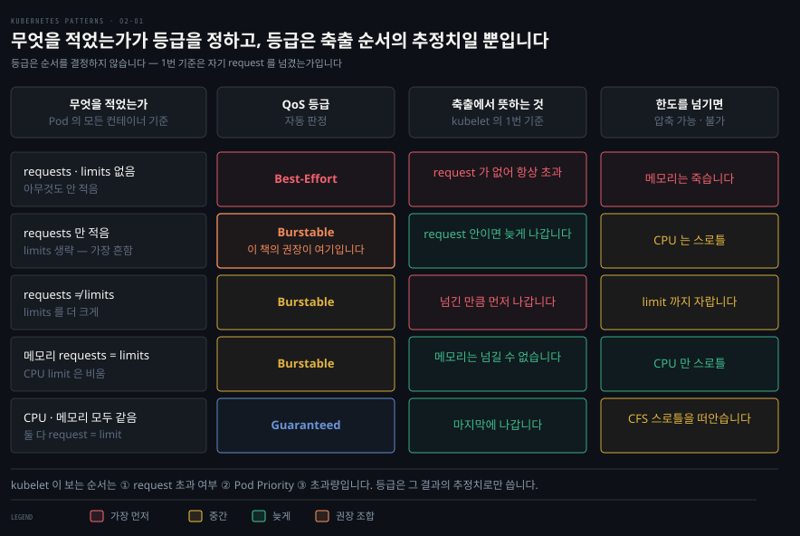

# Predictable Demands — 자원 요구를 선언해 스케줄러에 알리기
---
> 『Kubernetes Patterns』 2장 정독. **Predictable Demands**는 이 책의 첫 실전 패턴입니다. 핵심 한 줄은 "앱이 필요로 하는 자원과 런타임 의존성을 **미리 선언**해야, Kubernetes가 클러스터 안에서 그 앱을 놓을 올바른 자리를 찾는다"입니다. 선언하지 않으면 스케줄러는 컨테이너를 속이 안 보이는 상자로 취급해, 클러스터가 꽉 차면 그냥 버립니다.


## 핵심 요약

> 성공적인 배포·관리·공존의 토대는 앱의 **자원 요구와 런타임 의존성을 식별해 선언하는 것**입니다. 선언이 있어야 스케줄러가 어느 노드에 놓을지 지능적으로 판단하고 운영자가 용량 계획을 세울 수 있습니다. 자원은 `requests`(최소 보장)와 `limits`(상한)로 나눠 선언하며 이 둘의 조합이 Pod의 QoS 등급을 정하고 QoS 등급이 자원 부족 때 죽는 순서를 정합니다.

이 패턴이 푸는 문제는 이렇습니다. Kubernetes는 컨테이너로 실행되기만 하면 어떤 언어의 앱이든 관리하지만 언어마다 자원 요구가 다릅니다. 그런데 자원 소비 관점에서 더 중요한 것은 언어 자체보다 **앱의 도메인·비즈니스 로직·구현 세부**입니다. 그래서 저자는 "언어를 보고 자원을 추정하지 말고 실제로 측정해 선언하라"고 말합니다.

선언에는 두 갈래가 있습니다. 하나는 **런타임 의존성** — 볼륨·hostPort·ConfigMap·Secret처럼 앱이 돌기 위해 플랫폼이 갖춰 줘야 하는 것들입니다. 다른 하나는 **자원 프로파일** — CPU·메모리를 얼마나 요청하고 얼마까지 허용하는지입니다. 이 두 선언이 스케줄러의 배치 결정과 kubelet의 생사 결정에 직접 입력됩니다.


## 학습 목표

> 이 편을 읽고 나면 다음을 설명할 수 있습니다.

- 런타임 의존성 네 가지(볼륨·hostPort·ConfigMap·Secret)가 각각 스케줄링·기동에 어떤 제약을 거는지 구분한다.
- 압축 가능(compressible) 자원과 압축 불가(incompressible) 자원의 차이, 그리고 그 차이가 초과 시 동작(스로틀 vs 죽음)을 어떻게 가르는지 설명한다.
- `requests`·`limits` 조합이 QoS 3등급(Best-Effort·Burstable·Guaranteed)을 어떻게 결정하고 그것이 축출 순서와 어떻게 이어지는지 말한다.
- QoS와 Pod Priority가 왜 별개의 직교 축인지, 각각 kubelet과 스케줄러가 언제 쓰는지 구분한다.
- ResourceQuota·LimitRange로 네임스페이스 자원을 통제하는 방법과 용량 계획의 출발점을 안다.


## 본문 정리

### 문제 — 왜 미리 선언해야 하는가

컨테이너의 런타임 요구를 아는 것이 중요한 이유는 둘입니다. 첫째, 모든 런타임 의존성과 자원 수요가 정의돼 있으면 Kubernetes가 **가장 효율적인 하드웨어 활용**을 위해 컨테이너를 어디에 놓을지 지능적으로 결정합니다. 우선순위가 제각각인 프로세스들이 자원을 공유하는 환경에서, 성공적 공존의 유일한 길은 각 프로세스의 수요를 **미리** 아는 것입니다. 둘째, 자원 프로파일은 **용량 계획**의 토대입니다. 서비스별 수요와 서비스 총수를 알면, 클러스터 전체 수요를 만족하는 가장 비용 효율적인 호스트 프로파일을 산정할 수 있습니다.

### 런타임 의존성 — 어디에 놓일 수 있는지를 제약한다

가장 흔한 런타임 의존성은 **파일 저장소**입니다. 컨테이너 파일시스템은 임시적이라 컨테이너가 꺼지면 사라집니다. Kubernetes는 컨테이너 재시작을 견디는 Pod 수준 저장소로 볼륨을 제공합니다. 가장 단순한 볼륨은 `emptyDir`로, Pod가 사는 동안만 살아 있고 Pod가 사라지면 내용도 사라집니다. Pod 재시작을 넘어 살아남으려면 다른 저장 메커니즘(PersistentVolume 등)으로 뒷받침돼야 하고 그럴 때는 컨테이너 정의에 그 의존성을 명시적으로 선언해야 합니다.

```yaml
apiVersion: v1
kind: Pod
metadata:
  name: random-generator
spec:
  containers:
  - image: k8spatterns/random-generator:1.0
    name: random-generator
    volumeMounts:
    - mountPath: "/logs"
      name: log-volume
  volumes:
  - name: log-volume
    persistentVolumeClaim:
      claimName: random-generator-log   # 이 PVC가 존재하고 bound돼 있어야 함
```

스케줄러는 Pod가 요구하는 볼륨 종류를 평가해 배치를 정합니다. **어느 노드도 제공하지 못하는 볼륨이 필요하면 그 Pod는 아예 스케줄되지 않습니다.** 볼륨은 "어떤 인프라에서 돌 수 있는가, 스케줄될 수는 있는가"에 영향을 주는 런타임 의존성의 예입니다.

비슷한 의존성이 **hostPort**에서도 생깁니다. hostPort로 컨테이너 포트를 호스트의 특정 포트에 노출하면, 노드에 대한 또 하나의 런타임 의존성이 생기고 Pod가 놓일 수 있는 자리가 제한됩니다. hostPort는 클러스터의 각 노드에서 그 포트를 예약하므로, **노드당 최대 한 Pod**로 제한됩니다. 포트 충돌 때문에 클러스터의 노드 수만큼만 Pod를 스케일할 수 있습니다.

**ConfigMap**도 또 다른 의존성입니다. 거의 모든 앱이 설정 정보를 필요로 하고 Kubernetes 권장 방식이 ConfigMap입니다. 서비스는 환경변수든 파일시스템이든 설정을 소비할 전략을 가져야 하는데, 어느 쪽이든 컨테이너가 이름 붙은 ConfigMap에 의존하게 됩니다. **기대한 ConfigMap이 다 만들어져 있지 않으면, 컨테이너는 노드에 스케줄되지만 기동하지 못합니다.** **Secret**은 환경별 설정을 조금 더 안전하게 나눠 주는 방식으로, 소비 방식은 ConfigMap과 같고 컨테이너를 네임스페이스에 의존시킵니다.

정리하면 이 의존성들은 성격이 갈립니다 — **볼륨·hostPort는 어디에 스케줄될지를 제약**하고 **ConfigMap·Secret은 (스케줄은 되지만) 기동을 막을 수** 있습니다.

### 자원 프로파일 — requests와 limits

컨테이너 의존성 선언은 단순하지만 자원 요구를 알아내는 데는 더 많은 고민과 실험이 필요합니다. Kubernetes에서 컴퓨트 자원은 컨테이너가 **요청·할당·소비**하는 무언가로 정의되고 두 부류로 나뉩니다.

- **압축 가능(compressible)**: CPU·네트워크 대역폭처럼 **스로틀할 수 있는** 자원. 초과하면 느려질 뿐입니다.
- **압축 불가(incompressible)**: 메모리처럼 **스로틀할 수 없는** 자원. 초과하면 컨테이너가 **죽습니다** — 앱에게 할당된 메모리를 내놓으라고 할 방법이 없기 때문입니다.

이 구분이 중요합니다. CPU를 너무 많이 쓰면 스로틀되지만 메모리를 너무 많이 쓰면 죽습니다(evicted → 삭제 후 다른 노드에서 재생성될 수 있음).

앱의 성격과 구현에 따라 필요한 최소량(`requests`)과 자랄 수 있는 최대량(`limits`)을 지정합니다. 고수준에서 `requests`/`limits`는 **soft/hard limit**과 비슷하고 저자는 이를 **Java의 `-Xms`(초기 힙)·`-Xmx`(최대 힙)** 에 견줍니다. 중요한 규칙 하나 — **스케줄러는 `requests`만 보고 `limits`는 보지 않습니다.** 주어진 Pod를 놓을 때 스케줄러는 모든 컨테이너의 `requests`를 합산해, 그만큼을 아직 수용할 여유가 있는 노드만 후보로 봅니다.

```yaml
resources:
  requests:
    cpu: 100m
    memory: 200Mi
  limits:
    memory: 200Mi        # CPU limits는 의도적으로 비움
```

`requests`·`limits`의 키로 쓸 수 있는 자원 타입은 넷입니다.

| 타입 | 성격 | 초과 시 |
|------|------|---------|
| `memory` | 압축 불가 | limit 초과 시 Pod 축출(evict) — 삭제 후 재생성 |
| `cpu` | 압축 가능 | 오버커밋 시 requests에 비례해 스로틀. **requests만 걸고 limits는 비우길 강력 권장** (남는 CPU를 낭비 없이 쓰게) |
| `ephemeral-storage` | 압축 불가 | 로그·쓰기 가능 레이어·비메모리 `emptyDir`용. limit 초과 시 노드에서 축출 |
| `hugepage-<size>` | — | 미리 할당된 큰 연속 메모리 페이지(2MB·1GB 등). 오버커밋 불가라 **request = limit 필수** |

### QoS 3등급 — 조합이 생사 순서를 정한다

`requests`·`limits`를 어떻게 지정하느냐에 따라 플랫폼이 세 QoS 등급 중 하나를 자동으로 매깁니다.



- **Best-Effort**: 컨테이너에 `requests`·`limits`가 전혀 없는 Pod. 최저 우선순위이고 Pod가 놓인 노드가 압축 불가 자원이 바닥나면 **가장 먼저** 죽습니다.
- **Burstable**: `requests`와 `limits`가 다른(그리고 예상대로 limits > requests) Pod. 최소 자원 보장은 있고 여유가 있으면 limit까지 더 씁니다. 압축 불가 자원 압박 때, Best-Effort가 남아 있지 않으면 그다음으로 죽습니다.
- **Guaranteed**: `request`와 `limit`이 같은 Pod. 최고 우선순위이고 Best-Effort·Burstable보다 먼저 죽지 않습니다. **메모리 자원에는 이 등급이 최선** — 놀랄 일이 가장 적고 OOM 축출을 피합니다.

즉 컨테이너에 정의하거나 생략한 자원 특성이 그 Pod의 QoS와 자원 기근 시 상대적 중요도를 직접 정합니다. 이 결과를 염두에 두고 자원 요구를 정의해야 합니다.

> **CPU·메모리 자원 권장 규칙 (저자·업계 공통).** 메모리는 `requests = limits`로 항상 같게, CPU는 `requests`만 걸고 `limits`는 걸지 마세요. 저자는 근거로 블로그 글 두 편을 듭니다 — "For the Love of God, Stop Using CPU Limits on Kubernetes"(왜 CPU limit을 쓰지 말아야 하는가)와 "What Everyone Should Know About Kubernetes Memory Limits"(메모리 설정 권장).

### Pod Priority — QoS와는 다른 축

컨테이너 자원 선언이 QoS를 정하고 자원 기근 때 kubelet이 컨테이너를 죽이는 순서에 영향을 준다면, **Pod Priority**와 **preemption**은 이와 관련되지만 별개인 개념입니다. Pod Priority는 어떤 Pod가 다른 Pod에 비해 얼마나 중요한지를 나타내, **스케줄되는 순서**에 영향을 줍니다.

```yaml
apiVersion: scheduling.k8s.io/v1
kind: PriorityClass
metadata:
  name: high-priority
value: 1000
globalDefault: false       # true는 priorityClassName 없는 Pod의 기본값. 단 하나만 true 가능
description: This is a very high-priority Pod class
---
apiVersion: v1
kind: Pod
metadata:
  name: random-generator
spec:
  containers:
  - image: k8spatterns/random-generator:1.0
    name: random-generator
  priorityClassName: high-priority
```

`PriorityClass`는 네임스페이스에 속하지 않는 오브젝트로, 정수 기반 우선순위를 정의합니다. 높은 값일수록 더 중요한 Pod입니다. 동작은 이렇습니다. priority admission controller가 `priorityClassName`으로 새 Pod의 우선순위 값을 채우고 여러 Pod가 배치를 기다리면 스케줄러가 대기 큐를 **높은 우선순위 순으로 정렬**해 먼저 뽑습니다.

여기서 결정적인 부분 — **용량이 부족하면 스케줄러는 낮은 우선순위 Pod를 노드에서 preempt(제거)해** 자리를 비우고 높은 우선순위 Pod를 놓을 수 있습니다. 기존 Pod를 쫓아내고 싶지 않다면 `PriorityClass`에 `preemptionPolicy: Never`를 걸어, 이 등급의 Pod가 축출을 유발하지 않으면서도 우선순위 값에 따라 스케줄되게 할 수 있습니다.

**QoS와 Pod Priority는 직교하는 두 기능으로, 서로 연결돼 있지 않고 겹침도 거의 없습니다.** QoS는 주로 **kubelet**이 컴퓨트 자원이 낮을 때 **노드 안정성**을 지키려 씁니다(축출 전에 QoS를 먼저, 그다음 PriorityClass를 봅니다). 반대로 **스케줄러**의 preemption 로직은 preemption 대상을 고를 때 **QoS를 완전히 무시**하고 대기 중인 높은 우선순위 Pod의 요구를 만족하는 가장 낮은 우선순위 Pod 집합을 고릅니다.

Pod Priority는 주의해서 써야 합니다. preempt로 쫓겨나는 Pod에 원치 않는 영향이 갈 수 있습니다 — graceful termination은 존중되지만 **PodDisruptionBudget은 보장되지 않아**, 정족수에 기대는 낮은 우선순위 클러스터 앱이 깨질 수 있습니다(10장 Singleton Service 참조). 또 악의적·무지한 사용자가 최고 우선순위 Pod를 만들어 나머지를 다 쫓아낼 수 있어, 이를 막으려 ResourceQuota가 PriorityClass를 지원하도록 확장됐고 높은 우선순위 번호는 시스템 Pod용으로 예약됩니다.

### Project Resources — ResourceQuota와 LimitRange

Kubernetes는 개발자가 격리된 환경에서 앱을 자유롭게 굴리는 셀프서비스 플랫폼이지만 공유 멀티테넌트 환경에서는 일부 사용자가 자원을 독차지하지 못하게 하는 경계·통제가 필요합니다.

**ResourceQuota**는 네임스페이스의 집계 자원 소비에 제약을 겁니다. 컴퓨트 자원(CPU·메모리)·저장소 총합뿐 아니라, 오브젝트 개수(ConfigMap·Secret·Pod·Service 등)도 제한할 수 있습니다.

```yaml
apiVersion: v1
kind: ResourceQuota
metadata:
  name: object-counts
  namespace: default
spec:
  hard:
    pods: 4                # 이 네임스페이스에 활성 Pod 4개까지
    limits.memory: 5Gi     # 모든 Pod의 memory limit 합이 5GB를 넘을 수 없음
```

**LimitRange**는 자원 타입별로 사용 한계를 정합니다. 최소·최대 허용량과 기본값을 지정하는 데 더해, `requests`와 `limits`의 비율(**오버커밋 수준**)까지 통제합니다.

```yaml
apiVersion: v1
kind: LimitRange
metadata:
  name: limits
  namespace: default
spec:
  limits:
  - min:            { memory: 250Mi, cpu: 500m }   # requests·limits 최소
    max:            { memory: 2Gi,   cpu: 2 }      # requests·limits 최대
    default:        { memory: 500Mi, cpu: 500m }   # limits 미지정 시 기본
    defaultRequest: { memory: 250Mi, cpu: 250m }   # requests 미지정 시 기본
    maxLimitRequestRatio: { memory: 2, cpu: 4 }    # limit/request 최대 비율
    type: Container   # Container, Pod, PersistentVolumeClaim 중 하나
```

`maxLimitRequestRatio`는 예컨대 메모리 limit이 request의 2배를 못 넘고 CPU limit이 request의 4배까지 가능하도록 오버커밋을 제한합니다. 스케줄러가 배치에 쓰는 것은 `requests`이므로, request와 limit의 큰 격차는 노드 오버커밋 가능성을 키우고 여러 컨테이너가 동시에 요청 이상을 쓸 때 성능을 떨어뜨립니다.

한 가지 더 — 프로세스 ID(PID) 같은 다른 노드 수준 공유 자원은 어떤 자원 한계에 닿기 전에 고갈될 수 있습니다. Kubernetes는 시스템용 노드 PID를 예약하고 Pod당 PID 수를 제한하는 기능을 제공하지만 이는 클러스터 관리자가 kubelet 설정으로 다루는 것이라 앱 개발자의 범위는 아닙니다.

### Capacity Planning — 프로파일을 모아 용량으로

환경마다 컨테이너 자원 프로파일과 인스턴스 수가 달라, 다목적 환경의 용량 계획은 단순하지 않습니다. 비프로덕션 클러스터는 하드웨어 활용을 위해 주로 Best-Effort·Burstable 컨테이너를 두고(죽어도 치명적이지 않음), 프로덕션 클러스터는 안정·예측을 위해 주로 Guaranteed와 일부 Burstable을 둡니다(컨테이너가 죽으면 용량을 늘려야 한다는 신호).

| Pod | CPU request | Memory request | Memory limit | Instances |
|-----|-------------|----------------|--------------|-----------|
| A | 500m | 500Mi | 500Mi | 4 |
| B | 250m | 250Mi | 1000Mi | 2 |
| C | 500m | 1000Mi | 2000Mi | 2 |
| D | 500m | 500Mi | 500Mi | 1 |
| **Total** | **4000m** | **5000Mi** | **8500Mi** | **9** |

이렇게 서비스별 프로파일을 합산해 환경별 총 필요 자원을 계산합니다. 오토스케일·빌드 잡·인프라 컨테이너를 위한 여유도 남겨야 하며 이 정보와 인프라 제공자를 바탕으로 가장 비용 효율적인 컴퓨트 인스턴스를 고릅니다.


## 심화 학습

> 본문(원서 2장) 밖에서 보강한 내용입니다. 출처를 링크로 남깁니다.

### `-Xms`/`-Xmx` ↔ requests/limits 비유의 함정 — Spring Boot on K8s

저자가 든 `-Xms`/`-Xmx` ↔ requests/limits 비유는 직관적이지만 Spring Boot 앱을 컨테이너에 올릴 때 **비유를 문자 그대로 믿으면 OOMKill을 자초**합니다. 컨테이너 메모리 limit은 JVM 힙(`-Xmx`)만이 아니라 **힙 + 메타스페이스 + 스레드 스택 + 네이티브 버퍼(Netty·DirectByteBuffer 등) + 코드 캐시** 전부의 합에 걸립니다. `-Xmx`를 컨테이너 memory limit과 같게 잡으면, 힙 밖 영역이 얹히는 순간 limit을 넘겨 컨테이너가 죽습니다.

그래서 실무 규칙은 두 가지입니다. 첫째, 힙을 컨테이너 limit의 일부(대략 75% 안팎)로만 잡습니다. 최신 JVM은 `-XX:MaxRAMPercentage`로 컨테이너 인지 자동 계산을 지원해, 고정 `-Xmx` 대신 이 플래그를 쓰면 limit이 바뀌어도 비율이 유지됩니다. 둘째, 이 책의 권장대로 **메모리는 requests = limits(Guaranteed)** 로 고정해 예측성을 확보하되, 그 limit 안에 힙 밖 몫을 반드시 남깁니다. CPU는 이 책 권장대로 requests만 걸어, JVM이 워밍업·GC 스파이크 때 남는 CPU를 쓰게 둡니다.

> 자원 관리의 개념 메커니즘(QoS 결정 규칙·CPU throttling·LimitRange/ResourceQuota 상세·워크로드별 전략)은 개념 노트 [자원 관리](../../kubernetes/02_configuration/02-02.%EC%9E%90%EC%9B%90%20%EA%B4%80%EB%A6%AC.md)에 정리돼 있습니다. 이 편은 그것을 다시 설명하지 않고 **패턴의 의도와 Spring 렌즈**만 남깁니다.

### CPU limit을 걸지 말라는 권장의 근거

저자가 "CPU limit을 쓰지 말라"고 단언하는 배경은 CFS(Completely Fair Scheduler) 쿼터의 동작입니다. CPU limit은 100ms 단위 시간창마다 쿼터를 배분하는데, 버스트성 워크로드(예: 요청을 받을 때만 잠깐 CPU를 몰아 쓰는 앱)는 이 시간창 안에서 쿼터를 빨리 소진해, 노드에 CPU가 남아도는데도 스로틀되는 현상이 생깁니다. requests만 걸면 최소 몫은 보장받으면서 유휴 CPU를 자유롭게 당겨 쓸 수 있어, 특히 지연에 민감한 서비스에서 응답 시간이 안정됩니다. 다만 이는 "멀티테넌트에서 한 앱이 노드 CPU를 독점할 수 있다"는 트레이드오프를 동반하므로, 강한 격리가 필요한 환경에서는 LimitRange로 상한을 거는 절충을 씁니다.

- 출처: [For the Love of God, Stop Using CPU Limits on Kubernetes (Robusta.dev)](https://home.robusta.dev/blog/stop-using-cpu-limits) — 저자가 2장 More Information에서 든 참고 (2026-07-12 조회)
- 출처: [Resource Management for Pods and Containers (Kubernetes 공식)](https://kubernetes.io/docs/concepts/configuration/manage-resources-containers/)


## 실무 적용

- **모든 컨테이너에 최소한 requests는 건다.** 이 책의 결론대로, requests·limits가 없으면 스케줄러가 컨테이너를 "꽉 차면 버리는 불투명한 상자"로 다룹니다. 자원 선언은 사실상 필수입니다.
- **메모리는 requests = limits, CPU는 requests만.** Spring Boot 앱이라면 memory limit 안에 힙 밖 영역 몫을 남기고 `-Xmx` 고정 대신 `-XX:MaxRAMPercentage`로 컨테이너 인지 힙을 잡습니다.
- **런타임 의존성의 "실패 방식"을 구분해 진단한다.** Pod가 아예 안 스케줄되면 볼륨·hostPort 의존성을, 스케줄은 됐는데 기동을 못 하면 ConfigMap·Secret 누락을 먼저 의심합니다.
- **hostPort는 노드당 1 Pod 제약을 부른다.** 스케일이 필요한 워크로드에는 hostPort 대신 Service를 씁니다.
- **네임스페이스에 ResourceQuota + LimitRange를 짝지어 건다.** ResourceQuota로 팀별 총량을, LimitRange로 컨테이너별 기본값·오버커밋 비율을 통제해, 값을 빼먹은 Pod도 안전한 기본값을 받게 합니다.
- **Pod Priority는 아껴 쓴다.** preemption이 PodDisruptionBudget을 보장하지 않아 정족수 기반 앱(예: 브로커 클러스터)을 깰 수 있습니다.


## 체크리스트

- [ ] 런타임 의존성 네 가지(볼륨·hostPort·ConfigMap·Secret)와 각각이 스케줄링 vs 기동 중 무엇을 막는지 구분할 수 있다.
- [ ] 압축 가능(CPU)과 압축 불가(메모리)의 차이, 초과 시 스로틀 vs 죽음을 설명할 수 있다.
- [ ] requests·limits 조합으로 Best-Effort·Burstable·Guaranteed가 어떻게 결정되고 축출 순서가 어떻게 갈리는지 말할 수 있다.
- [ ] 스케줄러가 배치에 requests만 쓰고 limits는 안 쓴다는 점을 안다.
- [ ] QoS(kubelet·노드 안정성·eviction)와 Pod Priority(스케줄러·preemption)가 직교하는 별개 축임을 설명할 수 있다.
- [ ] ResourceQuota(네임스페이스 총량)와 LimitRange(컨테이너별 기본·오버커밋 비율)의 역할 차이를 안다.
- [ ] Spring Boot 컨테이너에서 memory limit을 `-Xmx`와 같게 잡으면 왜 위험한지 설명할 수 있다.


## 면접 관점

**Q. QoS 등급은 어떻게 결정되고 왜 메모리에는 Guaranteed가 권장됩니까?**
등급은 컨테이너의 requests·limits 조합으로 자동 결정됩니다. 둘 다 없으면 Best-Effort, 다르면 Burstable, 같으면 Guaranteed입니다. 자원 부족 때 kubelet은 Best-Effort → Burstable → Guaranteed 순으로 죽입니다. 메모리는 압축 불가 자원이라 limit을 넘기면 회수가 불가능해 컨테이너가 죽는데, memory requests = limits(Guaranteed)로 고정하면 예약량과 상한이 같아 예측 가능하고 OOM 축출 위험이 가장 낮습니다.

**Q. CPU limit을 걸지 말라는 권장의 근거는 무엇입니까?**
CPU는 압축 가능 자원이라 초과해도 스로틀될 뿐 죽지 않습니다. requests만 걸면 최소 몫은 보장받으면서 노드에 남는 CPU를 낭비 없이 당겨 쓸 수 있습니다. limit을 걸면 CFS 쿼터가 시간창마다 배분돼, 버스트성 워크로드가 노드에 CPU가 남아도는데도 스로틀되는 손해를 봅니다. 그래서 특히 지연에 민감한 서비스는 CPU limit을 비웁니다.

**Q. QoS와 Pod Priority는 무엇이 다릅니까?**
둘은 직교하는 별개 축입니다. QoS는 kubelet이 노드 자원이 낮을 때 노드 안정성을 지키려 컨테이너를 죽이는(eviction) 순서로, requests·limits로 정해집니다. Pod Priority는 스케줄러가 배치할 자리가 없을 때 낮은 우선순위 Pod를 밀어내는(preemption) 순서로, PriorityClass로 정해집니다. 스케줄러의 preemption은 QoS를 완전히 무시하고 가장 낮은 우선순위 Pod를 고릅니다.

**Q. Spring Boot 앱의 컨테이너 memory limit을 `-Xmx`와 같게 잡으면 무엇이 문제입니까?**
컨테이너 memory limit은 힙만이 아니라 메타스페이스·스레드 스택·네이티브 버퍼까지 전부의 합에 걸립니다. `-Xmx`를 limit과 같게 잡으면 힙 밖 영역이 얹히는 순간 limit을 초과해 컨테이너가 OOMKill됩니다. 그래서 힙을 limit의 일부(대략 75%)로 잡거나 `-XX:MaxRAMPercentage`로 컨테이너 인지 힙을 쓰고 limit 안에 힙 밖 몫을 남깁니다.


## 참고 자료

- 원서: 《Kubernetes Patterns, Second Edition》(Bilgin Ibryam·Roland Huß, O'Reilly) Ch2. Predictable Demands
- 이 책의 MOC: [Kubernetes Patterns 정독 인덱스](./README.md) · 앞 편: [분산 프리미티브](./01-01.%EB%B6%84%EC%82%B0%20%ED%94%84%EB%A6%AC%EB%AF%B8%ED%8B%B0%EB%B8%8C%20%E2%80%94%20OOP%C2%B7Java%20%EA%B0%9C%EB%85%90%EC%9D%84%20Kubernetes%EB%A1%9C.md)
- 개념 노트: [자원 관리](../../kubernetes/02_configuration/02-02.%EC%9E%90%EC%9B%90%20%EA%B4%80%EB%A6%AC.md) — QoS·throttling·LimitRange·ResourceQuota 개념 메커니즘
- [Resource Management for Pods and Containers (Kubernetes 공식)](https://kubernetes.io/docs/concepts/configuration/manage-resources-containers/) · [Pod Priority and Preemption](https://kubernetes.io/docs/concepts/scheduling-eviction/pod-priority-preemption/)
- [For the Love of God, Stop Using CPU Limits on Kubernetes](https://home.robusta.dev/blog/stop-using-cpu-limits)
- 저자 예제 코드: [k8spatterns/examples](https://github.com/k8spatterns/examples)
