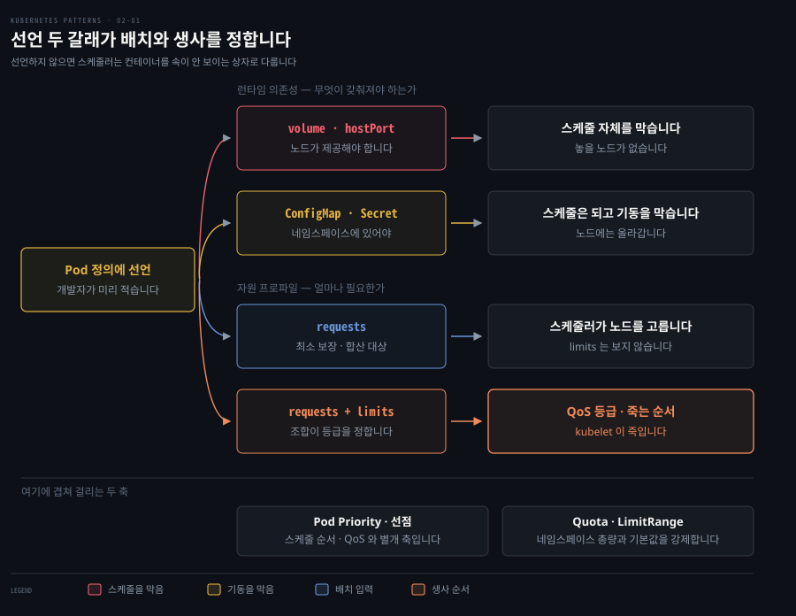

# Predictable Demands — 자원 요구를 선언해 스케줄러에 알리기

> 『Kubernetes Patterns』 2장 정독. **Predictable Demands**는 이 책의 첫 실전 패턴입니다. 핵심 한 줄은 "앱이 필요로 하는 자원과 런타임 의존성을 **미리 선언**해야, Kubernetes가 클러스터 안에서 그 앱을 놓을 올바른 자리를 찾는다"입니다. 선언하지 않으면 스케줄러는 컨테이너를 속이 안 보이는 상자로 취급해, 클러스터가 꽉 차면 그냥 버립니다.



이 장 전체가 이 그림 한 장에 들어갑니다. 왼쪽 노란 상자가 출발점입니다. 개발자가 Pod 정의에 적는 선언이 두 갈래로 갈라지고 각 갈래가 오른쪽에서 서로 다른 결과를 만듭니다.

위 갈래인 런타임 의존성은 다시 둘로 나뉩니다. 이 구분이 이 장에서 가장 헷갈리는 지점입니다. 볼륨과 hostPort는 **스케줄 자체를 막고** ConfigMap과 Secret은 스케줄은 통과시킨 뒤 **기동을 막습니다**. 아래 갈래인 자원 프로파일에서는 `requests`가 스케줄러의 노드 선택에 쓰이고 `requests`와 `limits`의 조합이 QoS 등급을 정해 kubelet이 죽이는 순서를 결정합니다.

가로줄 아래 두 상자는 이 흐름에 겹쳐 걸리는 별개 축입니다. Pod Priority는 QoS와 직교하고 Quota와 LimitRange는 네임스페이스 바깥에서 총량을 강제합니다.


## 핵심 요약

> 성공적인 배포·관리·공존의 토대는 앱의 **자원 요구와 런타임 의존성을 식별해 선언하는 것**입니다. 선언이 있어야 스케줄러가 어느 노드에 놓을지 지능적으로 판단하고 운영자가 용량 계획을 세울 수 있습니다. 자원은 `requests`(최소 보장)와 `limits`(상한)로 나눠 선언하며 이 둘의 조합이 Pod의 QoS 등급을 정하고 QoS 등급이 자원 부족 때 죽는 순서를 정합니다.

이 패턴이 푸는 문제는 이렇습니다. Kubernetes는 컨테이너로 실행되기만 하면 어떤 언어의 앱이든 관리하지만 언어마다 자원 요구가 다릅니다. 그런데 자원 소비 관점에서 더 중요한 것은 언어 자체보다 **앱의 도메인·비즈니스 로직·구현 세부**입니다. 그래서 저자는 "언어를 보고 자원을 추정하지 말고 실제로 측정해 선언하라"고 말합니다.

선언에는 두 갈래가 있습니다. 하나는 **런타임 의존성**입니다. 볼륨·hostPort·ConfigMap·Secret처럼 앱이 돌기 위해 플랫폼이 갖춰 줘야 하는 것들입니다. 다른 하나는 **자원 프로파일**로, CPU·메모리를 얼마나 요청하고 얼마까지 허용하는지입니다. 이 두 선언이 스케줄러의 배치 결정과 kubelet의 생사 결정에 직접 입력됩니다.


## 학습 목표

> 이 편을 읽고 나면 다음을 설명할 수 있습니다.

- 런타임 의존성 네 가지(볼륨·hostPort·ConfigMap·Secret)가 각각 스케줄링·기동에 어떤 제약을 거는지 구분합니다.
- 압축 가능(compressible) 자원과 압축 불가(incompressible) 자원의 차이, 그리고 그 차이가 초과 시 동작(스로틀 vs 죽음)을 어떻게 가르는지 설명합니다.
- `requests`·`limits` 조합이 QoS 3등급을 어떻게 결정하는지, 그리고 축출 순서가 등급이 아니라 무엇으로 정해지는지 구분합니다.
- QoS와 Pod Priority가 왜 별개의 직교 축인지, 각각 kubelet과 스케줄러가 언제 쓰는지 구분합니다.
- ResourceQuota·LimitRange로 네임스페이스 자원을 통제하는 방법과 용량 계획의 출발점을 압니다.


## 본문 정리

### 문제 — 왜 미리 선언해야 하는가

컨테이너의 런타임 요구를 아는 것이 중요한 이유는 둘입니다. 첫째, 모든 런타임 의존성과 자원 수요가 정의돼 있으면 Kubernetes가 **가장 효율적인 하드웨어 활용**을 위해 컨테이너를 어디에 놓을지 지능적으로 결정합니다. 우선순위가 제각각인 프로세스들이 자원을 공유하는 환경에서, 성공적 공존의 유일한 길은 각 프로세스의 수요를 **미리** 아는 것입니다. 둘째, 자원 프로파일은 **용량 계획**의 토대입니다. 서비스별 수요와 서비스 총수를 알면, 클러스터 전체 수요를 만족하는 가장 비용 효율적인 호스트 프로파일을 산정할 수 있습니다.

### 런타임 의존성 — 어디에 놓일 수 있는지를 제약한다

가장 흔한 런타임 의존성은 **파일 저장소**입니다. 컨테이너 파일시스템은 임시적이라 컨테이너가 꺼지면 사라집니다. Kubernetes는 컨테이너 재시작을 견디는 Pod 수준 저장소로 볼륨을 제공합니다. 가장 단순한 볼륨은 `emptyDir`로, Pod가 사는 동안만 살아 있고 Pod가 사라지면 내용도 사라집니다. Pod 재시작을 넘어 살아남으려면 다른 저장 메커니즘(PersistentVolume 등)으로 뒷받침돼야 하고 그럴 때는 컨테이너 정의에 그 의존성을 명시적으로 선언해야 합니다.

```yaml
apiVersion: v1
kind: Pod
metadata:
  name: random-generator
spec:
  containers:
  - image: k8spatterns/random-generator:1.0
    name: random-generator
    volumeMounts:
    - mountPath: "/logs"
      name: log-volume
  volumes:
  - name: log-volume
    persistentVolumeClaim:
      claimName: random-generator-log   # 이 PVC가 존재하고 bound돼 있어야 함
```

스케줄러는 Pod가 요구하는 볼륨 종류를 평가해 배치를 정합니다. **어느 노드도 제공하지 못하는 볼륨이 필요하면 그 Pod는 아예 스케줄되지 않습니다.** 볼륨은 "어떤 인프라에서 돌 수 있는가, 스케줄될 수는 있는가"에 영향을 주는 런타임 의존성의 예입니다.

비슷한 의존성이 **hostPort**에서도 생깁니다. hostPort로 컨테이너 포트를 호스트의 특정 포트에 노출하면, 노드에 대한 또 하나의 런타임 의존성이 생기고 Pod가 놓일 수 있는 자리가 제한됩니다. hostPort는 클러스터의 각 노드에서 그 포트를 예약하므로, **노드당 최대 한 Pod**로 제한됩니다. 포트 충돌 때문에 클러스터의 노드 수만큼만 Pod를 스케일할 수 있습니다.

**ConfigMap**도 또 다른 의존성입니다. 거의 모든 앱이 설정 정보를 필요로 하고 Kubernetes 권장 방식이 ConfigMap입니다. 서비스는 환경변수든 파일시스템이든 설정을 소비할 전략을 가져야 하는데, 어느 쪽이든 컨테이너가 이름 붙은 ConfigMap에 의존하게 됩니다. **기대한 ConfigMap이 다 만들어져 있지 않으면, 컨테이너는 노드에 스케줄되지만 기동하지 못합니다.**

```yaml
apiVersion: v1
kind: Pod
metadata:
  name: random-generator
spec:
  containers:
  - image: k8spatterns/random-generator:1.0
    name: random-generator
    env:
    - name: PATTERN
      valueFrom:
        configMapKeyRef:
          name: random-generator-config   # 이 ConfigMap 에 대한 필수 의존입니다
          key: pattern
```

**Secret**은 환경별 설정을 조금 더 안전하게 나눠 주는 방식으로, 소비 방식은 ConfigMap과 같고 컨테이너를 네임스페이스에 의존시킵니다. ConfigMap과 Secret의 상세는 20장 Configuration Resource에서 다룹니다.

ConfigMap과 Secret 오브젝트를 만드는 것은 우리가 수행하는 단순한 배포 작업입니다. 반면 저장소와 포트 번호는 **클러스터 노드가 제공**합니다. 이 의존성 중 일부는 Pod가 어디에 스케줄될지를 제약합니다. 다른 일부는 Pod의 기동 자체를 막습니다.

| 의존성 | 무엇을 막는가 |
|--------|-------------|
| 볼륨 · hostPort | 어디에 **스케줄될지**를 제약합니다. 제공할 노드가 없으면 아예 스케줄되지 않습니다 |
| ConfigMap · Secret | 스케줄은 되지만 **기동**을 막습니다 |

이런 의존성을 가진 컨테이너 앱을 설계할 때는 그것이 나중에 만들어 낼 런타임 제약을 늘 함께 고려해야 합니다.

### 자원 프로파일 — requests와 limits

컨테이너 의존성 선언은 단순하지만 자원 요구를 알아내는 데는 더 많은 고민과 실험이 필요합니다. Kubernetes에서 컴퓨트 자원은 컨테이너가 **요청·할당·소비**하는 무언가로 정의되고 두 부류로 나뉩니다.

- **압축 가능(compressible)**: CPU·네트워크 대역폭처럼 **스로틀할 수 있는** 자원. 초과하면 느려질 뿐입니다.
- **압축 불가(incompressible)**: 메모리처럼 **스로틀할 수 없는** 자원. 초과하면 컨테이너가 **죽습니다** — 앱에게 할당된 메모리를 내놓으라고 할 방법이 없기 때문입니다.

이 구분이 중요합니다. CPU를 너무 많이 쓰면 스로틀될 뿐이지만 메모리를 너무 많이 쓰면 죽습니다.

여기서 "죽는다"가 두 가지로 갈리는데, 이 둘을 섞으면 장애 진단이 어긋납니다.

| 무엇을 넘겼나 | 누가 죽이나 | 결과 |
|-------------|-----------|------|
| **컨테이너의 memory limit** | 커널 OOM killer | 컨테이너가 **그 자리에서** `OOMKilled` 되고 `restartPolicy`에 따라 재시작됩니다. 반복되면 `CrashLoopBackOff`입니다 |
| **노드 전체의 가용 메모리** | kubelet (축출) | Pod가 노드에서 **축출**돼 삭제되고, 컨트롤러가 관리하는 Pod라면 다른 노드에 새로 스케줄됩니다 |

앞의 것은 **내 컨테이너가 자기 상한을 넘긴** 경우이고, 뒤의 것은 **노드가 압박받아** kubelet이 누군가를 골라 내보내는 경우입니다. Spring 앱이 힙을 과하게 잡아 죽는 흔한 사고는 앞쪽이라 `kubectl describe pod`에 `OOMKilled`로 찍히지, 다른 노드로 옮겨 가지 않습니다.

앱의 성격과 구현에 따라 필요한 최소량(`requests`)과 자랄 수 있는 최대량(`limits`)을 지정합니다. 고수준에서 `requests`/`limits`는 **soft/hard limit**과 비슷하고 저자는 이를 **Java의 `-Xms`(초기 힙)·`-Xmx`(최대 힙)** 에 견줍니다. 중요한 규칙 하나 — **스케줄러는 `requests`만 보고 `limits`는 보지 않습니다.** 주어진 Pod를 놓을 때 스케줄러는 모든 컨테이너의 `requests`를 합산해, 그만큼을 아직 수용할 여유가 있는 노드만 후보로 봅니다.

```yaml
resources:
  requests:
    cpu: 100m
    memory: 200Mi
  limits:
    memory: 200Mi        # CPU limits는 의도적으로 비움
```

`requests`·`limits`의 키로 쓸 수 있는 자원 타입은 넷입니다.

| 타입 | 성격 | 초과 시 |
|------|------|---------|
| `memory` | 압축 불가 | 앱의 힙 메모리 수요 + `medium: Memory`로 설정한 `emptyDir` 볼륨. limit 초과 시 컨테이너가 `OOMKilled` 되고 제자리에서 재시작 |
| `cpu` | 압축 가능 | 오버커밋 시 requests에 비례해 스로틀. **requests만 걸고 limits는 비우길 강력 권장** (남는 CPU를 낭비 없이 쓰게) |
| `ephemeral-storage` | 압축 불가 | 로그·쓰기 가능 레이어 + 메모리 파일시스템에 *없는* `emptyDir`. limit 초과 시 노드에서 축출 |
| `hugepages-<size>` | — | 미리 할당된 큰 연속 메모리 페이지(2MB·1GB 등, 예: `hugepages-1Gi: 2Gi`로 1GB 페이지 2개 요청). 오버커밋 불가라 **request = limit 필수** |

`emptyDir` 하나가 `medium` 설정에 따라 두 자원으로 갈리는 점을 놓치기 쉽습니다. `medium: Memory`(tmpfs)로 두면 그 볼륨에 쓴 데이터가 **컨테이너 메모리 한도를 잡아먹고**, 설정을 비워 두면 노드 디스크의 `ephemeral-storage`를 씁니다. 캐시·임시 파일을 tmpfs에 넉넉히 쓰다가 memory limit에 걸려 컨테이너가 `OOMKilled` 되는 사고가 여기서 나옵니다.

### QoS 3등급 — 조합이 생사 순서를 정한다

`requests`·`limits`를 어떻게 지정하느냐에 따라 플랫폼이 세 QoS 등급 중 하나를 자동으로 매깁니다.


- **Best-Effort**: Pod의 **어느 컨테이너에도** `requests`·`limits`가 전혀 없는 경우입니다. 최저 우선순위이고, Pod가 놓인 노드에서 압축 불가 자원이 바닥나면 **가장 먼저** 죽습니다.
- **Burstable**: Guaranteed 조건을 만족하지 못하면서, **최소 한 컨테이너에 CPU나 메모리의 request 또는 limit이 하나라도 있는** 경우입니다. 최소 자원 보장은 있고 여유가 있으면 limit까지 더 씁니다. 압박이 오면 Best-Effort가 남아 있지 않을 때 그다음으로 죽습니다.
- **Guaranteed**: **모든 컨테이너가 CPU와 메모리 둘 다** limit을 지정했고, 각각 request와 limit이 같아야 합니다(값은 0보다 커야 합니다). 최고 우선순위이고 앞의 두 등급보다 먼저 죽지 않습니다.

원서는 Burstable을 "requests와 limits가 다른 Pod", Guaranteed를 "request와 limit이 같은 Pod"로 짧게 씁니다. 이 요약은 **실무에서 가장 흔한 경우를 놓칩니다.** `requests`만 적고 `limits`를 아예 생략한 Pod가 그렇습니다. "다른"에도 해당하지 않지만 이 Pod는 Burstable입니다. 등급 판정의 1차 자료는 [Pod Quality of Service Classes](https://kubernetes.io/docs/concepts/workloads/pods/pod-qos/) 이고, 위 세 줄은 그 정의를 옮긴 것입니다.

즉 컨테이너에 정의하거나 생략한 자원 특성이 그 Pod의 QoS와 자원 기근 시 상대적 중요도를 직접 정합니다. 이 결과를 염두에 두고 자원 요구를 정의해야 합니다.

다만 **"Best-Effort → Burstable → Guaranteed 순으로 죽는다"는 확정 규칙이 아닙니다.** 공식 문서는 이 점을 명시적으로 부정합니다 — *"The kubelet does not use the pod's QoS class to determine the eviction order."* kubelet이 실제로 보는 것은 셋입니다.

1. Pod의 자원 사용량이 **request를 넘겼는가**
2. Pod Priority
3. request 대비 사용량이 **얼마나** 넘겼는가

그래서 실제 순서는 "request를 넘긴 Best-Effort·Burstable"이 먼저 나가고(그 안에서 Priority와 초과량으로 정렬), "Guaranteed와 request 미만인 Burstable"이 마지막에 Priority 순으로 나갑니다. **request 안에서 얌전히 도는 Burstable Pod는 request를 넘긴 다른 Burstable보다 늦게 죽습니다.** 등급 이름이 아니라 "자기가 약속한 몫을 지켰는가"가 기준입니다.

QoS 등급을 축출 순서의 **추정치**로 쓰는 것은 여전히 유효하고, 원서의 서술도 그 수준에서는 맞습니다. 다만 등급이 순서를 *결정*한다고 외우면 위 1번 조건을 놓칩니다.

> **CPU·메모리 자원 권장 규칙 (저자·업계 공통).** 메모리는 `requests = limits`로 항상 같게, CPU는 `requests`만 걸고 `limits`는 걸지 마세요. 저자는 근거로 블로그 글 두 편을 듭니다 — "For the Love of God, Stop Using CPU Limits on Kubernetes"(왜 CPU limit을 쓰지 말아야 하는가)와 "What Everyone Should Know About Kubernetes Memory Limits"(메모리 설정 권장).

⛔ **이 권장을 따르면 등급은 Guaranteed가 아니라 Burstable입니다.** Guaranteed는 CPU limit까지 있어야 하는데 이 권장은 CPU limit을 걸지 말라고 하기 때문입니다. 둘은 충돌하는 조언이고, 저자와 업계는 등급 이름보다 실질을 택한 것입니다.

메모리를 `requests = limits`로 고정하면 그 컨테이너의 메모리 몫은 등급과 무관하게 예약량과 상한이 같아집니다. 그래서 노드가 메모리로 압박받아도 이 컨테이너가 자기 request를 넘길 일이 없습니다. 뒤에서 보겠지만 축출 판정에서 실제로 중요한 것이 바로 그 "request를 넘겼는가"입니다.

그러니 "메모리는 같게"를 따르되 **그 결과를 Guaranteed라고 부르지는 마세요.** CPU limit까지 걸어 Guaranteed를 받으면 이번에는 CFS 스로틀 문제를 떠안습니다(뒤 심화 학습 참조).

### Pod Priority — QoS와는 다른 축

컨테이너 자원 선언이 QoS를 정하고 자원 기근 때 kubelet이 컨테이너를 죽이는 순서에 영향을 준다면, **Pod Priority**와 **preemption**은 이와 관련되지만 별개인 개념입니다. Pod Priority는 어떤 Pod가 다른 Pod에 비해 얼마나 중요한지를 나타내, **스케줄되는 순서**에 영향을 줍니다.

```yaml
apiVersion: scheduling.k8s.io/v1
kind: PriorityClass
metadata:
  name: high-priority
value: 1000
globalDefault: false       # true는 priorityClassName 없는 Pod의 기본값. 단 하나만 true 가능
description: This is a very high-priority Pod class
---
apiVersion: v1
kind: Pod
metadata:
  name: random-generator
spec:
  containers:
  - image: k8spatterns/random-generator:1.0
    name: random-generator
  priorityClassName: high-priority
```

`PriorityClass`는 네임스페이스에 속하지 않는 오브젝트로, 정수 기반 우선순위를 정의합니다. 높은 값일수록 더 중요한 Pod입니다. 동작은 이렇습니다. priority admission controller가 `priorityClassName`으로 새 Pod의 우선순위 값을 채우고 여러 Pod가 배치를 기다리면 스케줄러가 대기 큐를 **높은 우선순위 순으로 정렬**해 먼저 뽑습니다.

여기서 결정적인 부분 — **용량이 부족하면 스케줄러는 낮은 우선순위 Pod를 노드에서 preempt(제거)해** 자리를 비우고 높은 우선순위 Pod를 놓을 수 있습니다. 기존 Pod를 쫓아내고 싶지 않다면 `PriorityClass`에 `preemptionPolicy: Never`를 걸어, 이 등급의 Pod가 축출을 유발하지 않으면서도 우선순위 값에 따라 스케줄되게 할 수 있습니다.

**QoS와 Pod Priority는 직교하는 두 기능으로, 서로 연결돼 있지 않고 겹침도 거의 없습니다.** QoS는 주로 **kubelet**이 컴퓨트 자원이 낮을 때 **노드 안정성**을 지키려 씁니다(축출 전에 QoS를 먼저, 그다음 PriorityClass를 봅니다). 반대로 **스케줄러**의 preemption 로직은 preemption 대상을 고를 때 **QoS를 완전히 무시**하고 대기 중인 높은 우선순위 Pod의 요구를 만족하는 가장 낮은 우선순위 Pod 집합을 고릅니다.

Pod Priority는 주의해서 써야 합니다. preempt로 쫓겨나는 Pod에 원치 않는 영향이 갈 수 있습니다. graceful termination은 존중되지만 **PodDisruptionBudget은 보장되지 않아**, 정족수에 기대는 낮은 우선순위 클러스터 앱이 깨질 수 있습니다(10장 Singleton Service 참조).

또 악의적·무지한 사용자가 최고 우선순위 Pod를 만들어 나머지를 다 쫓아낼 수 있습니다. 이를 막으려 ResourceQuota가 PriorityClass를 지원하도록 확장됐고 높은 우선순위 번호는 시스템 Pod용으로 예약됩니다.

저자가 이 절을 닫는 결론은 이렇습니다. **사용자가 지정하는 숫자 우선순위는 본질적으로 게임(gaming)의 대상**입니다. 스케줄러와 kubelet에게 "무엇을 놓고 무엇을 죽일지" 지시하는 값이 사용자 손에 있다는 뜻입니다. 한 번의 변경이 많은 Pod에 파급되어, 결국 플랫폼이 **예측 가능한 SLA를 제공하지 못하게** 만들 수 있습니다.

Predictable Demands라는 이 장의 제목과 정면으로 충돌하는 지점입니다. 우선순위는 조직 차원의 규칙 없이 개별 팀이 자유롭게 올리도록 두면 안 됩니다.

### Project Resources — ResourceQuota와 LimitRange

Kubernetes는 개발자가 격리된 환경에서 앱을 자유롭게 굴리는 셀프서비스 플랫폼이지만 공유 멀티테넌트 환경에서는 일부 사용자가 자원을 독차지하지 못하게 하는 경계·통제가 필요합니다.

**ResourceQuota**는 네임스페이스의 집계 자원 소비에 제약을 겁니다. 컴퓨트 자원(CPU·메모리)·저장소 총합뿐 아니라, 오브젝트 개수(ConfigMap·Secret·Pod·Service 등)도 제한할 수 있습니다.

```yaml
apiVersion: v1
kind: ResourceQuota
metadata:
  name: object-counts
  namespace: default
spec:
  hard:
    pods: 4                # 이 네임스페이스에 활성 Pod 4개까지
    limits.memory: 5Gi     # 모든 Pod의 memory limit 합이 5GB를 넘을 수 없음
```

**LimitRange**는 자원 타입별로 사용 한계를 정합니다. 최소·최대 허용량과 기본값을 지정하는 데 더해, `requests`와 `limits`의 비율(**오버커밋 수준**)까지 통제합니다.

```yaml
apiVersion: v1
kind: LimitRange
metadata:
  name: limits
  namespace: default
spec:
  limits:
  - min:            { memory: 250Mi, cpu: 500m }   # requests·limits 최소
    max:            { memory: 2Gi,   cpu: 2 }      # requests·limits 최대
    default:        { memory: 500Mi, cpu: 500m }   # limits 미지정 시 기본
    defaultRequest: { memory: 250Mi, cpu: 250m }   # requests 미지정 시 기본
    maxLimitRequestRatio: { memory: 2, cpu: 4 }    # limit/request 최대 비율
    type: Container   # Container, Pod, PersistentVolumeClaim 중 하나
```

`maxLimitRequestRatio`는 예컨대 메모리 limit이 request의 2배를 못 넘고 CPU limit이 request의 4배까지 가능하도록 오버커밋을 제한합니다. 스케줄러가 배치에 쓰는 것은 `requests`이므로, request와 limit의 큰 격차는 노드 오버커밋 가능성을 키우고 여러 컨테이너가 동시에 요청 이상을 쓸 때 성능을 떨어뜨립니다.

한 가지 더 — 프로세스 ID(PID) 같은 다른 노드 수준 공유 자원은 어떤 자원 한계에 닿기 전에 고갈될 수 있습니다. Kubernetes는 시스템용 노드 PID를 예약하고 Pod당 PID 수를 제한하는 기능을 제공하지만 이는 클러스터 관리자가 kubelet 설정으로 다루는 것이라 앱 개발자의 범위는 아닙니다.

### Capacity Planning — 프로파일을 모아 용량으로

환경마다 컨테이너 자원 프로파일과 인스턴스 수가 달라, 다목적 환경의 용량 계획은 단순하지 않습니다. 비프로덕션 클러스터는 하드웨어 활용을 위해 주로 Best-Effort·Burstable 컨테이너를 두고(죽어도 치명적이지 않음), 프로덕션 클러스터는 안정·예측을 위해 주로 Guaranteed와 일부 Burstable을 둡니다(컨테이너가 죽으면 용량을 늘려야 한다는 신호).

| Pod | CPU request | Memory request | Memory limit | Instances |
|-----|-------------|----------------|--------------|-----------|
| A | 500m | 500Mi | 500Mi | 4 |
| B | 250m | 250Mi | 1000Mi | 2 |
| C | 500m | 1000Mi | 2000Mi | 2 |
| D | 500m | 500Mi | 500Mi | 1 |
| **Total** | **4000m** | **5000Mi** | **8500Mi** | **9** |

이렇게 서비스별 프로파일을 합산해 환경별 총 필요 자원을 계산합니다. 오토스케일·빌드 잡·인프라 컨테이너를 위한 여유도 남겨야 하며 이 정보와 인프라 제공자를 바탕으로 가장 비용 효율적인 컴퓨트 인스턴스를 고릅니다.

이렇게 초기 requests·limits를 손으로 잡아도, 실제 운영 중 사용량은 예측과 다르기 마련입니다. **Vertical Pod Autoscaler(VPA)**는 Pod의 실제 자원 소비를 관찰해 requests·limits 값 자체를 추천하거나 자동 조정하는 오토스케일러입니다. 이 장에서 손으로 추정한 프로파일을 운영 데이터로 검증·보정하는 다음 단계에 해당합니다.

VPA의 동작 모드는 개념 노트 [오토스케일링](../../kubernetes/05_scheduling/05-03.%EC%98%A4%ED%86%A0%EC%8A%A4%EC%BC%80%EC%9D%BC%EB%A7%81.md)에서 다룹니다.

HPA와의 충돌 문제는 이 책의 [Elastic Scale](./29-01.Elastic%20Scale%20%E2%80%94%20%EB%B6%80%ED%95%98%EC%97%90%20%EB%A7%9E%EC%B6%B0%20%EC%84%B8%20%EC%B0%A8%EC%9B%90%EC%9C%BC%EB%A1%9C%20%EC%9E%90%EB%8F%99%20%ED%99%95%EC%9E%A5.md) 장에서 다룹니다.


## 심화 학습

> 본문(원서 2장) 밖에서 보강한 내용입니다. 출처를 링크로 남깁니다.

### `-Xms`/`-Xmx` ↔ requests/limits 비유의 함정 — Spring Boot on K8s

저자가 든 `-Xms`/`-Xmx` ↔ requests/limits 비유는 직관적이지만 Spring Boot 앱을 컨테이너에 올릴 때 **비유를 문자 그대로 믿으면 OOMKill을 자초**합니다. 컨테이너 메모리 limit은 JVM 힙(`-Xmx`)만이 아니라 **힙 + 메타스페이스 + 스레드 스택 + 네이티브 버퍼(Netty·DirectByteBuffer 등) + 코드 캐시** 전부의 합에 걸립니다. `-Xmx`를 컨테이너 memory limit과 같게 잡으면, 힙 밖 영역이 얹히는 순간 limit을 넘겨 컨테이너가 죽습니다.

그래서 실무 규칙은 두 가지입니다.

첫째, 힙을 컨테이너 limit의 일부(대략 75% 안팎)로만 잡습니다. 최신 JVM은 `-XX:MaxRAMPercentage`로 컨테이너 인지 자동 계산을 지원해, 고정 `-Xmx` 대신 이 플래그를 쓰면 limit이 바뀌어도 비율이 유지됩니다. 다만 **이 플래그의 기본값은 25%라 반드시 값을 명시해야 합니다.** 플래그만 걸고 값을 주지 않으면 힙이 limit의 4분의 1로 잡혀 오히려 좁아집니다.

둘째, 이 책의 권장대로 메모리는 `requests = limits`로 고정해 예측성을 확보하되 그 limit 안에 힙 밖 몫을 반드시 남깁니다. 앞서 봤듯 CPU limit을 걸지 않는 한 등급은 Burstable이지만 그래도 무방합니다. CPU는 이 책 권장대로 requests만 걸어, JVM이 워밍업·GC 스파이크 때 남는 CPU를 쓰게 둡니다.

> 자원 관리의 개념 메커니즘(QoS 결정 규칙·CPU throttling·LimitRange/ResourceQuota 상세·워크로드별 전략)은 개념 노트 [자원 관리](../../kubernetes/02_configuration/02-02.%EC%9E%90%EC%9B%90%20%EA%B4%80%EB%A6%AC.md)에 정리돼 있습니다. 이 편은 그것을 다시 설명하지 않고 **패턴의 의도와 Spring 렌즈**만 남깁니다.

### CPU limit을 걸지 말라는 권장의 근거

저자가 "CPU limit을 쓰지 말라"고 단언하는 배경은 CFS(Completely Fair Scheduler) 쿼터의 동작입니다. CPU limit은 100ms 단위 시간창마다 쿼터를 배분합니다. 버스트성 워크로드(예: 요청을 받을 때만 잠깐 CPU를 몰아 쓰는 앱)는 이 시간창 안에서 쿼터를 빨리 소진해, 노드에 CPU가 남아도는데도 스로틀되는 현상이 생깁니다.

requests만 걸면 최소 몫은 보장받으면서 유휴 CPU를 자유롭게 당겨 쓸 수 있습니다. 특히 지연에 민감한 서비스에서 응답 시간이 안정됩니다. 다만 이는 "멀티테넌트에서 한 앱이 노드 CPU를 독점할 수 있다"는 트레이드오프를 동반합니다. 강한 격리가 필요한 환경에서는 LimitRange로 상한을 거는 절충을 씁니다.

- 출처: [For the Love of God, Stop Using CPU Limits on Kubernetes (Robusta.dev)](https://home.robusta.dev/blog/stop-using-cpu-limits) — 저자가 2장 More Information에서 든 참고 (2026-07-12 조회)
- 출처: [Resource Management for Pods and Containers (Kubernetes 공식)](https://kubernetes.io/docs/concepts/configuration/manage-resources-containers/)


## 능동 회상

> 먼저 스스로 답해 본 뒤 아래 정답 절에서 맞춰 봅니다. 정답은 이 절 다음에 번호 순서대로 있습니다.

1. 컨테이너의 런타임 요구를 미리 아는 것이 중요한 이유 두 가지는 무엇인가요?
2. 자원 소비 관점에서 프로그래밍 언어보다 더 중요한 것은 무엇이라고 저자는 말하나요?
3. `emptyDir` 볼륨은 언제까지 살아 있나요? Pod 재시작을 넘어 살아남으려면 무엇이 필요한가요?
4. 어떤 노드도 제공하지 못하는 볼륨을 Pod 가 요구하면 어떻게 되나요?
5. `hostPort` 를 쓰면 왜 노드당 Pod 하나로 제한되나요? 스케일에 어떤 영향이 있나요?
6. 기대한 ConfigMap 이 없으면 Pod 는 어떤 상태가 되나요? 볼륨 의존성과 무엇이 다른가요?
7. 압축 가능 자원과 압축 불가 자원의 차이는 무엇이며, 한도를 넘겼을 때 각각 어떻게 되나요?
8. 메모리가 압축 불가인 근본 이유는 무엇인가요?
9. 스케줄러가 Pod 배치에 쓰는 것은 `requests` 인가요 `limits` 인가요? 구체적으로 무엇을 계산하나요?
10. `requests`·`limits` 의 키로 쓸 수 있는 자원 타입 넷은 무엇인가요?
11. `emptyDir` 이 `medium` 설정에 따라 두 자원으로 갈리는데, 각각 무엇을 소비하나요?
12. hugepages 는 왜 request 와 limit 을 반드시 같게 해야 하나요?
13. QoS 세 등급은 각각 어떤 선언에서 나오며 축출 순서는 어떻게 되나요?
14. 메모리에 Guaranteed 가 최선인 이유는 무엇인가요?
15. `globalDefault: true` 는 무엇을 하며 제약은 무엇인가요?
16. 우선순위가 높은 Pod 를 놓을 자리가 없으면 스케줄러는 무엇을 하나요? 그것을 막으려면 어떻게 하나요?
17. QoS 와 Pod Priority 가 직교한다는 말은 무슨 뜻인가요? kubelet 과 스케줄러는 각각 무엇을 보나요?
18. Pod Priority 를 주의해서 써야 하는 이유 세 가지는 무엇인가요?
19. ResourceQuota 와 LimitRange 는 각각 무엇을 통제하나요?
20. `maxLimitRequestRatio` 가 통제하는 것은 무엇이며 왜 필요한가요?


## 정답

> 위 회상 질문의 답입니다. 번호가 대응합니다.

**1.** 첫째, 모든 런타임 의존성과 자원 수요가 정의돼 있으면 Kubernetes 가 가장 효율적인 하드웨어 활용을 위해 컨테이너를 어디에 놓을지 지능적으로 결정할 수 있습니다. 우선순위가 제각각인 프로세스들이 자원을 공유하는 환경에서 성공적 공존의 유일한 길은 각 프로세스의 수요를 **미리** 아는 것입니다. 둘째, 자원 프로파일은 **용량 계획**의 토대입니다. 서비스별 수요와 총수를 알면 클러스터 전체 수요를 만족하는 가장 비용 효율적인 호스트 프로파일을 산정할 수 있습니다.

**2.** 앱의 **도메인·비즈니스 로직·실제 구현 세부**입니다. 컴파일 언어가 JIT 런타임이나 인터프리터 언어보다 대체로 빠르고 메모리를 덜 쓰지만, 같은 범주의 현대 언어들은 자원 요구가 비슷하기 때문입니다.

**3.** Pod 가 사는 동안만 살아 있고 Pod 가 제거되면 내용도 사라집니다. Pod 재시작을 넘어 살아남으려면 PersistentVolume 같은 **다른 저장 메커니즘이 뒷받침**해야 하며, 그 의존성을 컨테이너 정의에 명시적으로 선언해야 합니다.

**4.** **아예 스케줄되지 않습니다.** 스케줄러가 Pod 가 요구하는 볼륨 종류를 평가해 배치를 정하기 때문입니다. 볼륨은 어떤 인프라에서 돌 수 있는지, 스케줄될 수는 있는지에 영향을 주는 런타임 의존성의 예입니다.

**5.** `hostPort` 가 클러스터의 **각 노드에서 그 포트를 예약**하기 때문입니다. 포트 충돌 때문에 클러스터의 노드 수만큼만 Pod 를 스케일할 수 있습니다.

**6.** 컨테이너가 노드에 **스케줄은 되지만 기동하지 못합니다.** 볼륨·hostPort 는 어디에 스케줄될지를 제약하는 반면, ConfigMap·Secret 은 스케줄을 막지 않고 기동을 막는다는 점이 다릅니다.

**7.** 압축 가능 자원은 CPU 나 네트워크 대역폭처럼 **스로틀할 수 있는** 자원이라 한도를 넘기면 느려질 뿐입니다. 압축 불가 자원은 메모리처럼 스로틀할 수 없어 한도를 넘기면 **컨테이너가 죽습니다.**

**8.** 앱에게 이미 할당된 메모리를 내놓으라고 요청할 방법이 없기 때문입니다.

**9.** `requests` 만 쓰고 `limits` 는 쓰지 않습니다. 주어진 Pod 를 놓을 때 스케줄러는 그 Pod 의 **모든 컨테이너의 requests 를 합산**해, 그만큼을 아직 수용할 여유가 있는 노드만 후보로 봅니다.

**10.** `memory`, `cpu`, `ephemeral-storage`, `hugepages-<size>` 입니다. 원서 본문은 `hugepage-` 로 적지만 실제 필드명은 복수형 `hugepages-2Mi`·`hugepages-1Gi` 입니다.

**11.** `medium: Memory`(tmpfs) 로 두면 그 볼륨에 쓴 데이터가 **컨테이너의 memory 한도**를 잡아먹습니다. 설정을 비워 두면 노드 디스크의 **ephemeral-storage** 를 씁니다.

**12.** hugepages 는 **오버커밋이 불가능**하기 때문입니다. 미리 할당된 큰 연속 메모리 페이지라 요청한 만큼이 곧 상한이어야 합니다.

**13.** 어느 컨테이너에도 requests·limits 가 없으면 **Best-Effort** 입니다. **모든 컨테이너가 CPU·메모리 둘 다** limit 을 지정하고 각각 request 와 값이 같으면 **Guaranteed** 입니다. 그 밖에 최소 한 컨테이너에 request 나 limit 이 하나라도 있으면 **Burstable** 입니다. 그래서 `requests` 만 적고 `limits` 를 생략한 흔한 경우도 Burstable 입니다.

축출 순서는 등급이 *결정*하지 않습니다. 공식 문서가 "kubelet does not use the pod's QoS class to determine the eviction order" 라고 명시합니다. kubelet 은 request 초과 여부와 Pod Priority 와 request 대비 초과량, 이 셋을 봅니다. 결과적으로 request 를 넘긴 Best-Effort·Burstable 이 먼저 나가고, Guaranteed 와 request 미만인 Burstable 이 마지막에 나갑니다. 등급은 그 순서의 **추정치**로만 씁니다.

**14.** 질문 자체를 한 번 비틀어야 합니다. 원서와 업계가 권하는 "메모리는 `requests = limits`" 를 따르되 CPU limit 을 걸지 않으면 등급은 **Guaranteed 가 아니라 Burstable** 입니다. Guaranteed 는 CPU limit 까지 요구하기 때문입니다.

그럼에도 메모리를 같게 두는 것이 최선인 이유는 등급 이름이 아니라 실질에 있습니다. 예약량과 상한이 같으면 그 컨테이너는 **자기 memory request 를 넘길 일이 없고**, 축출 판정에서 실제로 중요한 것이 바로 그 "request 를 넘겼는가" 이기 때문입니다. 덤으로 상한이 예측 가능해져 용량 계획이 쉬워집니다.

**15.** `priorityClassName` 을 지정하지 않은 Pod 에 적용될 기본 PriorityClass 로 만듭니다. 제약은 **오직 하나의 PriorityClass 만** `globalDefault: true` 를 가질 수 있다는 것입니다.

**16.** 낮은 우선순위 Pod 를 노드에서 **preempt(제거)** 해 자원을 확보하고 높은 우선순위 Pod 를 놓습니다. 기존 Pod 를 쫓아내고 싶지 않다면 PriorityClass 에 `preemptionPolicy: Never` 를 걸어, 그 등급의 Pod 가 축출을 유발하지 않으면서도 우선순위 값에 따라 스케줄되게 합니다.

**17.** 서로 연결돼 있지 않고 겹침도 거의 없다는 뜻입니다. **kubelet** 은 컴퓨트 자원이 낮을 때 노드 안정성을 지키려 QoS 를 먼저 보고 그다음 PriorityClass 를 봅니다. 반대로 **스케줄러**의 preemption 로직은 대상을 고를 때 **QoS 를 완전히 무시**하고, 대기 중인 높은 우선순위 Pod 의 요구를 만족하는 가장 낮은 우선순위 Pod 집합을 고릅니다.

**18.** 첫째, preempt 로 쫓겨나는 Pod 에 원치 않는 영향이 갑니다. graceful termination 은 존중되지만 **PodDisruptionBudget 은 보장되지 않아** 정족수에 기대는 낮은 우선순위 클러스터 앱이 깨질 수 있습니다. 둘째, 악의적이거나 무지한 사용자가 최고 우선순위 Pod 를 만들어 나머지를 다 쫓아낼 수 있습니다. 셋째, 사용자가 지정하는 숫자 우선순위는 본질적으로 **게이밍의 대상**이라 한 번의 변경이 많은 Pod 에 파급되어 플랫폼이 예측 가능한 SLA 를 제공하지 못하게 만들 수 있습니다.

**19.** ResourceQuota 는 **네임스페이스의 집계 자원 소비**를 제약합니다. CPU·메모리·저장소 총합뿐 아니라 ConfigMap·Secret·Pod·Service 같은 오브젝트 개수도 제한합니다. LimitRange 는 **자원 타입별 사용 한계**를 정합니다. 최소·최대 허용량과 기본값에 더해 requests 와 limits 의 비율까지 통제합니다.

**20.** requests 와 limits 의 비율, 곧 **오버커밋 수준**을 통제합니다. 스케줄러가 배치에 쓰는 것은 requests 이므로, requests 와 limits 의 큰 격차는 노드 오버커밋 가능성을 키우고 여러 컨테이너가 동시에 요청 이상을 쓸 때 성능을 떨어뜨리기 때문입니다.


## 실무 적용

- **값을 추측하지 말고 초기 테스트로 발견한다.** 저자는 컨테이너별 자원 수요를 초기 테스트(early tests)로 실측해, 그 결과를 이후 용량 계획과 예측의 기준선으로 쓰라고 말합니다. 프로덕션 투입 전 부하를 걸어 실제 CPU·메모리 사용량을 관측하는 단계가 이 패턴의 출발점입니다.
- **모든 컨테이너에 최소한 requests는 건다.** 이 책의 결론대로, requests·limits가 없으면 스케줄러가 컨테이너를 "꽉 차면 버리는 불투명한 상자"로 다룹니다. 자원 선언은 사실상 필수입니다.
- **메모리는 requests = limits, CPU는 requests만.** Spring Boot 앱이라면 memory limit 안에 힙 밖 영역 몫을 남기고 `-Xmx` 고정 대신 `-XX:MaxRAMPercentage`로 컨테이너 인지 힙을 잡습니다.
- **런타임 의존성의 "실패 방식"을 구분해 진단한다.** Pod가 아예 안 스케줄되면 볼륨·hostPort 의존성을, 스케줄은 됐는데 기동을 못 하면 ConfigMap·Secret 누락을 먼저 의심합니다.
- **hostPort는 노드당 1 Pod 제약을 부른다.** 스케일이 필요한 워크로드에는 hostPort 대신 Service를 씁니다.
- **네임스페이스에 ResourceQuota + LimitRange를 짝지어 건다.** ResourceQuota로 팀별 총량을, LimitRange로 컨테이너별 기본값·오버커밋 비율을 통제해, 값을 빼먹은 Pod도 안전한 기본값을 받게 합니다.
- **Pod Priority는 아껴 쓴다.** preemption이 PodDisruptionBudget을 보장하지 않아 정족수 기반 앱(예: 브로커 클러스터)을 깰 수 있습니다.


## 체크리스트

- [ ] 런타임 의존성 네 가지(볼륨·hostPort·ConfigMap·Secret)와 각각이 스케줄링 vs 기동 중 무엇을 막는지 구분할 수 있습니다.
- [ ] 압축 가능(CPU)과 압축 불가(메모리)의 차이, 초과 시 스로틀 vs 죽음을 설명할 수 있습니다.
- [ ] Best-Effort·Burstable·Guaranteed의 판정 조건을 정확히 말할 수 있고, 축출 순서를 kubelet이 QoS가 아니라 request 초과 여부로 정한다는 점을 압니다.
- [ ] 스케줄러가 배치에 requests만 쓰고 limits는 안 쓴다는 점을 압니다.
- [ ] QoS(kubelet·노드 안정성·eviction)와 Pod Priority(스케줄러·preemption)가 직교하는 별개 축임을 설명할 수 있습니다.
- [ ] ResourceQuota(네임스페이스 총량)와 LimitRange(컨테이너별 기본·오버커밋 비율)의 역할 차이를 압니다.
- [ ] Spring Boot 컨테이너에서 memory limit을 `-Xmx`와 같게 잡으면 왜 위험한지 설명할 수 있습니다.


## 면접 관점

**Q. QoS 등급은 어떻게 결정되고 축출 순서와 어떻게 이어집니까?**
등급은 컨테이너의 requests·limits 조합으로 자동 결정됩니다. 어느 컨테이너에도 아무것도 없으면 Best-Effort, 모든 컨테이너가 CPU·메모리 둘 다 limit을 걸고 request와 같게 하면 Guaranteed, 그 밖에 하나라도 걸려 있으면 Burstable입니다.

주의할 것이 둘 있습니다. 첫째, 축출 순서를 등급이 결정하지 않습니다. 공식 문서는 kubelet이 QoS 등급으로 순서를 정하지 않는다고 명시하고, 실제로는 request 초과 여부와 Pod Priority와 초과량을 봅니다. 등급은 추정치입니다. 둘째, 흔히 권장되는 "메모리는 requests = limits, CPU는 requests만"을 따르면 CPU limit이 없어 등급은 Burstable입니다. 그래도 이 설정이 옳은 이유는 등급 이름이 아니라, 메모리 예약량과 상한이 같아지면 그 컨테이너가 자기 request를 넘길 일이 없어지기 때문입니다. 축출 판정의 1번 기준이 바로 그것입니다.

**Q. CPU limit을 걸지 말라는 권장의 근거는 무엇입니까?**
CPU는 압축 가능 자원이라 초과해도 스로틀될 뿐 죽지 않습니다. requests만 걸면 최소 몫은 보장받으면서 노드에 남는 CPU를 낭비 없이 당겨 쓸 수 있습니다. limit을 걸면 CFS 쿼터가 시간창마다 배분돼, 버스트성 워크로드가 노드에 CPU가 남아도는데도 스로틀되는 손해를 봅니다. 그래서 특히 지연에 민감한 서비스는 CPU limit을 비웁니다.

**Q. QoS와 Pod Priority는 무엇이 다릅니까?**
둘은 직교하는 별개 축입니다. QoS는 kubelet이 노드 자원이 낮을 때 노드 안정성을 지키려 컨테이너를 죽이는(eviction) 순서로, requests·limits로 정해집니다. Pod Priority는 스케줄러가 배치할 자리가 없을 때 낮은 우선순위 Pod를 밀어내는(preemption) 순서로, PriorityClass로 정해집니다. 스케줄러의 preemption은 QoS를 완전히 무시하고 가장 낮은 우선순위 Pod를 고릅니다.

**Q. Spring Boot 앱의 컨테이너 memory limit을 `-Xmx`와 같게 잡으면 무엇이 문제입니까?**
컨테이너 memory limit은 힙만이 아니라 메타스페이스·스레드 스택·네이티브 버퍼까지 전부의 합에 걸립니다. `-Xmx`를 limit과 같게 잡으면 힙 밖 영역이 얹히는 순간 limit을 초과해 컨테이너가 OOMKill됩니다. 그래서 힙을 limit의 일부(대략 75%)로 잡거나 `-XX:MaxRAMPercentage`로 컨테이너 인지 힙을 쓰고 limit 안에 힙 밖 몫을 남깁니다.


## 참고 자료

- 원서: 《Kubernetes Patterns, Second Edition》(Bilgin Ibryam·Roland Huß, O'Reilly) Ch2. Predictable Demands
- 이 책의 MOC: [Kubernetes Patterns 정독 인덱스](./README.md) · 앞 편: [분산 프리미티브](./01-01.%EB%B6%84%EC%82%B0%20%ED%94%84%EB%A6%AC%EB%AF%B8%ED%8B%B0%EB%B8%8C%20%E2%80%94%20OOP%C2%B7Java%20%EA%B0%9C%EB%85%90%EC%9D%84%20Kubernetes%EB%A1%9C.md)
- 다음 편: [Declarative Deployment](./03-01.Declarative%20Deployment%20%E2%80%94%20%EC%97%85%EA%B7%B8%EB%A0%88%EC%9D%B4%EB%93%9C%C2%B7%EB%A1%A4%EB%B0%B1%EC%9D%84%20%EC%84%A0%EC%96%B8%EC%9C%BC%EB%A1%9C.md) — 자원 크기를 정한 다음 단계로, 앱을 설치·업데이트하는 전략을 다룹니다
- 개념 노트: [자원 관리](../../kubernetes/02_configuration/02-02.%EC%9E%90%EC%9B%90%20%EA%B4%80%EB%A6%AC.md) — QoS·throttling·LimitRange·ResourceQuota 개념 메커니즘
- [Resource Management for Pods and Containers (Kubernetes 공식)](https://kubernetes.io/docs/concepts/configuration/manage-resources-containers/) · [Pod Priority and Preemption](https://kubernetes.io/docs/concepts/scheduling-eviction/pod-priority-preemption/)
- [For the Love of God, Stop Using CPU Limits on Kubernetes](https://home.robusta.dev/blog/stop-using-cpu-limits)
- 저자 예제 코드: [k8spatterns/examples](https://github.com/k8spatterns/examples)
