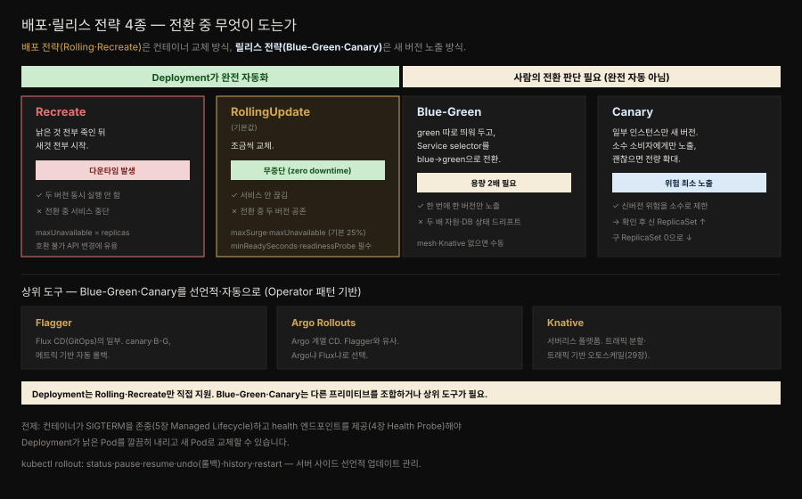

# Declarative Deployment — 업그레이드·롤백을 선언으로
---
> 『Kubernetes Patterns』 3장 정독. **Declarative Deployment**의 심장은 Deployment 리소스입니다. 이 추상화가 컨테이너 그룹의 업그레이드·롤백 과정을 감싸, 그 실행을 **반복 가능하고 자동화된 활동**으로 만듭니다. 핵심은 "어떤 단계를 밟을지"가 아니라 "배포된 상태가 어떤 모습이어야 하는지"를 선언하는 것입니다.


## 핵심 요약

> 마이크로서비스가 늘수록 새 버전으로 갈아 끼우는 일이 부담이 됩니다. 수동으로 하면 사람 실수가, 스크립트로 하면 상당한 노력이 들어 릴리스가 병목이 됩니다. Deployment는 이 과정을 선언적으로 정의해, 서버 사이드에서 하나의 원자적 활동으로 실행합니다. 기본 전략은 무중단 **RollingUpdate**와 다운타임을 감수하는 **Recreate**이고 그 위에 사람 판단이 개입하는 **Blue-Green·Canary** 릴리스 전략이 있습니다.

두 층을 나눠 봐야 합니다. **배포 전략**(Rolling·Recreate)은 *낡은 컨테이너를 새것으로 교체하는 방식*을 다루고 Kubernetes가 완전 자동화합니다. **릴리스 전략**(Blue-Green·Canary)은 *새 버전이 소비자에게 노출되는 방식*을 다루는데, 전환 트리거가 사람의 판단이라 완전 자동은 아니고 다른 프리미티브를 조합하거나 상위 도구가 필요합니다.

Deployment가 제대로 일하려면 전제가 있습니다. 컨테이너가 좋은 클라우드 네이티브 시민이어야 합니다 — SIGTERM 같은 생애주기 이벤트를 존중하고(5장 Managed Lifecycle), 기동 성공을 알리는 health 엔드포인트를 제공해야(4장 Health Probe) 플랫폼이 낡은 컨테이너를 깔끔히 내리고 새 인스턴스로 교체할 수 있습니다.


## 학습 목표

> 이 편을 읽고 나면 다음을 설명할 수 있습니다.

- 명령형(imperative) 업데이트의 문제와, Deployment의 선언적(declarative) 접근이 주는 이점 네 가지를 말한다.
- RollingUpdate의 `maxSurge`·`maxUnavailable`·`minReadySeconds`가 각각 무엇을 조절하는지 설명한다.
- RollingUpdate와 Recreate를 언제 쓰는지, 각각의 트레이드오프(무중단 vs 두 버전 공존, 다운타임 vs 단일 버전)를 구분한다.
- Blue-Green과 Canary가 왜 Deployment만으로 안 되고 사람 판단·상위 도구가 필요한지 설명한다.
- `kubectl rollout` 서브커맨드와 higher-level 도구(Flagger·Argo Rollouts·Knative)의 자리를 안다.


## 본문 정리

### 문제 — 수동 업그레이드는 병목이 된다

버전을 올리는 일에는 여러 활동이 얽힙니다 — 새 버전 Pod 시작, 낡은 Pod graceful 종료, 성공 기동 대기·확인, 실패 시 이전 버전으로 롤백. 이를 다운타임을 감수하며 두 버전을 동시에 안 돌리는 방식으로 하거나, 다운타임 없이 하되 업데이트 동안 두 버전이 다 돌아 자원을 더 쓰는 방식으로 합니다. 어느 쪽이든 수동으로 하면 사람 실수를 부르고 제대로 스크립팅하려면 상당한 노력이 들어 릴리스가 병목이 됩니다.

### kubectl rollout — 서버 사이드 선언적 관리

과거 `kubectl rolling-update`는 **클라이언트 사이드 명령형**이었습니다 — kubectl이 각 단계마다 서버에 무엇을 할지 지시했습니다. Kubernetes 1.18에서 이것이 제거되고 `kubectl rollout`으로 대체됐습니다. 차이는 rollout이 Deployment 선언을 갱신하고 실제 업데이트는 Kubernetes에 맡기는 **서버 사이드** 방식이라는 점입니다.

| 서브커맨드 | 하는 일 |
|-----------|---------|
| `rollout status` | 현재 rollout 상태 표시 |
| `rollout pause` | rolling update를 멈춤 — 여러 변경을 재트리거 없이 한 번에 적용 |
| `rollout resume` | 멈춘 rollout 재개 |
| `rollout undo` | 이전 리비전으로 롤백 (업데이트 중 오류 시 유용) |
| `rollout history` | Deployment의 가용 리비전 표시 |
| `rollout restart` | 업데이트 없이 현재 Pod 집합을 설정된 전략으로 재시작 |

### Rolling Deployment — 무중단 교체

선언적 업데이트는 Deployment로 합니다. 뒤에서 Deployment는 set-based 라벨 셀렉터를 지원하는 ReplicaSet을 만들고 `RollingUpdate`(기본)·`Recreate` 전략으로 업데이트 동작을 빚습니다.

```yaml
apiVersion: apps/v1
kind: Deployment
metadata:
  name: random-generator
spec:
  replicas: 3                    # rolling update가 의미 있으려면 replica > 1
  strategy:
    type: RollingUpdate
    rollingUpdate:
      maxSurge: 1                 # replicas 외에 임시로 더 띄울 수 있는 Pod 수 (여기선 최대 4개)
      maxUnavailable: 1          # 업데이트 중 사용 불가할 수 있는 Pod 수 (여기선 한 번에 최소 2개 가용)
  minReadySeconds: 60            # rollout 계속 전, readiness가 이만큼 건강해야 함
  selector:
    matchLabels:
      app: random-generator
  template:
    metadata:
      labels:
        app: random-generator
    spec:
      containers:
      - image: k8spatterns/random-generator:1.0
        name: random-generator
        readinessProbe:           # 무중단 rolling에 꼭 필요 — 빠뜨리지 말 것
          exec:
            command: [ "stat", "/tmp/random-generator-ready" ]
```

RollingUpdate는 업데이트 중 다운타임이 없게 합니다. 뒤에서 새 ReplicaSet을 만들고 낡은 컨테이너를 새것으로 바꿉니다. 여기서 향상된 점은 **새 컨테이너 rollout 속도를 제어**할 수 있다는 것으로, `maxSurge`(가용을 초과해 더 띄울 Pod)와 `maxUnavailable`(가용에서 뺄 Pod)로 조절합니다.

두 필드는 절대 개수이거나 replica 수에 적용되는 상대 퍼센트일 수 있고 `maxSurge`는 올림·`maxUnavailable`은 내림으로 정수화됩니다. **기본값은 둘 다 25%**입니다.

또 하나 중요한 파라미터가 `minReadySeconds`입니다. Pod의 readiness가 성공한 뒤 그 Pod가 rollout에서 "가용"으로 간주되기까지 기다리는 초입니다. 이 값을 키우면 rollout을 계속하기 전에 앱 Pod가 얼마간 성공적으로 돌고 있음을 보장하고 새 버전을 디버깅·탐색할 여유를 줍니다(간격이 크면 `kubectl rollout pause`를 쓰기도 쉬워집니다).

선언적 업데이트를 트리거하는 세 가지 방법이 있습니다 — `kubectl replace`로 Deployment 전체 교체, `kubectl patch`/`kubectl edit`로 새 이미지 지정, `kubectl set image`로 새 이미지 설정.

Deployment의 이점은 넷입니다 — ① 상태가 Kubernetes 내부에서 전적으로 관리되고 업데이트가 서버 사이드에서 수행됨, ② 목표 상태를 선언(어떻게가 아니라 무엇을), ③ 실행 가능한 오브젝트라 프로덕션 전에 여러 환경에서 시험 가능, ④ 업데이트 과정이 기록·버전 관리돼 pause·continue·rollback 가능.

### Fixed Deployment — Recreate 전략

RollingUpdate의 부작용은 업데이트 동안 두 버전이 동시에 돈다는 것입니다. 서비스 API에 하위 호환 안 되는 변경이 들어갔고 클라이언트가 그것을 감당 못 하면 문제가 됩니다. 이럴 때 **Recreate** 전략을 씁니다.

Recreate는 `maxUnavailable`을 선언된 replica 수로 설정하는 효과입니다. 즉 현재 버전 컨테이너를 **전부 죽인 뒤**, 낡은 것이 축출되면 새 컨테이너를 **전부 동시에** 시작합니다. 결과적으로 낡은 컨테이너가 다 멈추고 새것이 아직 요청을 못 받는 동안 **다운타임**이 생깁니다. 대신 두 버전이 동시에 돌지 않아, 소비자는 한 번에 한 버전에만 연결됩니다.

### Blue-Green Release — 두 배 용량으로 위험 최소화

Blue-Green은 다운타임과 위험을 줄이며 프로덕션에 배포하는 릴리스 전략입니다. Deployment 프리미티브를 다른 프리미티브와 함께 빌딩 블록으로 써서 구현합니다. **service mesh나 Knative 같은 확장이 없으면 수동으로 해야** 합니다.

동작은 이렇습니다. 두 번째 Deployment(green)를 최신 버전으로 만들되 아직 요청을 안 받게 둡니다. 이때 원래 Deployment(blue)의 낡은 Pod가 여전히 실서비스 요청을 처리합니다. 새 버전이 건강하고 준비됐다는 확신이 서면, **Service 셀렉터를 green과 매칭되게 바꿔** 트래픽을 전환합니다. green이 모든 트래픽을 처리하면 blue를 삭제하고 자원을 회수합니다.

이점은 한 번에 한 버전만 요청을 처리해 소비자의 다중 버전 처리 복잡도가 준다는 것입니다. 단점은 blue·green이 다 떠 있는 동안 **앱 용량이 두 배** 필요하고 장기 실행 프로세스·DB 상태 드리프트에서 상당한 복잡성이 생길 수 있다는 점입니다.

### Canary Release — 소수에게 먼저

Canary는 낡은 인스턴스의 작은 일부만 새것으로 바꿔 프로덕션에 부드럽게 배포합니다. 일부 소비자만 새 버전에 닿게 해 위험을 줄이고 소수 사용자에게서 만족스러우면 그다음 단계에서 낡은 인스턴스를 전부 새 버전으로 바꿉니다.

Kubernetes에서는 작은 replica 수의 새 Deployment를 canary로 만들고 Service가 일부 소비자를 새 Pod로 보냅니다. canary 이후 새 ReplicaSet이 기대대로 동작한다는 확신이 서면, 새 ReplicaSet을 올리고 낡은 ReplicaSet을 0으로 내립니다. 통제되고 사용자 검증된 점진적 rollout인 셈입니다.



### Discussion — 자동화 경계와 상위 도구

기본 배포 전략(rolling·recreate)은 낡은 컨테이너의 교체를 제어하고 고급 릴리스 전략(Blue-Green·canary)은 새 버전이 소비자에게 노출되는 방식을 제어합니다. 뒤 둘은 전환 트리거가 사람 판단이라 완전 자동이 아닙니다. 또 이 장의 기법은 Pod 업데이트만 다루지, ConfigMap·Secret·의존 서비스 같은 다른 의존성의 업데이트·롤백은 포함하지 않습니다.

> **Pre/Post 배포 훅 — 정체된 제안.** 배포 전략 실행 전후에 커스텀 명령을 돌려 abort·retry·continue하게 하자는 제안이 과거 있었지만 이 노력은 (2023년 기준) 수년째 정체돼 Kubernetes에 올지 불투명합니다. 오늘 동작하는 방법은 Deployment와 다른 프리미티브로 업데이트를 관리하는 스크립트를 짜는 것이지만 이 명령형 접근은 Kubernetes의 선언적 성질과 맞지 않습니다.

그 대안으로 상위 선언적 접근이 Kubernetes 위에 등장했습니다. 이들은 **Operator 패턴**(28장)으로 작동해, rollout 과정의 선언적 기술을 받아 서버 사이드에서 필요한 조치를 수행하고 일부는 업데이트 오류 시 자동 롤백도 합니다.

| 도구 | 성격 |
|------|------|
| **Flagger** | Flux CD(GitOps)의 일부. canary·Blue-Green 지원, 여러 ingress·mesh와 통합해 트래픽 분할. 커스텀 메트릭 기반 rollout 감시·자동 롤백 |
| **Argo Rollouts** | Argo 계열 CD. Flagger와 거의 같은 능력. Argo냐 Flux냐 선호로 선택 |
| **Knative** | Kubernetes 위 서버리스 플랫폼. 트래픽 기반 오토스케일(29장)·트래픽 분할. rollout/rollback은 Flagger·Argo만큼 고급은 아니나 Deployment보다 나음 |

이들 모두 Kubernetes처럼 CNCF 프로젝트입니다. 어떤 배포 전략을 쓰든, Kubernetes가 앱 Pod의 기동·준비를 알아야 목표 배포 상태에 이르는 단계를 밟을 수 있습니다 — 그것이 다음 4장 Health Probe입니다.


## 심화 학습

> 본문(원서 3장) 밖에서 보강한 내용입니다. 출처를 링크로 남깁니다.

### Spring Boot 앱을 무중단으로 rolling update 하려면

이 장이 "readinessProbe를 빠뜨리지 말라"고 강조하는 이유가 Spring Boot 앱에서 특히 살아납니다. RollingUpdate는 새 Pod가 readiness를 통과해야 낡은 Pod를 내리는데, Spring Boot 앱은 컨텍스트 초기화·커넥션 풀 워밍업·첫 JIT 컴파일 때문에 프로세스가 떠도 한동안 요청을 제대로 못 받습니다. readiness 없이 rolling하면 아직 안 데워진 새 Pod로 트래픽이 흘러 첫 요청들이 느리거나 실패합니다.

Spring Boot 2.3+는 이를 위해 Actuator에 `/actuator/health/liveness`·`/actuator/health/readiness` 그룹을 내장했습니다. `management.endpoint.health.probes.enabled=true`로 켜면 Kubernetes 프로브에 바로 매핑됩니다. 여기에 **graceful shutdown**(`server.shutdown=graceful`)을 켜면, SIGTERM을 받은 Pod가 진행 중 요청을 마치고 내려가 rolling update 중 요청 유실을 막습니다 — 이 장이 전제로 든 "SIGTERM 존중"(5장)과 정확히 맞물립니다.

> Deployment 업데이트 메커니즘(pod-template-hash·리비전·maxSurge 계산·전략 5종)은 형제 정독본 [Deployment 업데이트](../kubernetes-in-action/15-02.Deployment%20%EC%97%85%EB%8D%B0%EC%9D%B4%ED%8A%B8%20%E2%80%94%20Recreate%C2%B7RollingUpdate%C2%B7maxSurge.md)·[rollout 제어와 배포 전략](../kubernetes-in-action/15-03.rollout%20%EC%A0%9C%EC%96%B4%EC%99%80%20%EB%B0%B0%ED%8F%AC%20%EC%A0%84%EB%9E%B5%20%E2%80%94%20pause%C2%B7faulty%C2%B7rollback%C2%B7%EC%A0%84%EB%9E%B5%205%EC%A2%85.md)에 상세합니다. 이 편은 그것을 다시 설명하지 않고 **패턴의 의도**만 남깁니다.

### Deployment가 canary를 "직접" 지원한다는 오해

Deployment의 replica 수를 조절해 흉내 내는 "poor man's canary"는 이 장이 설명하는 방식이지만 정밀한 트래픽 비율(예: 5%만 새 버전) 제어는 Deployment만으로 불가능합니다. Deployment는 Pod 개수 비율로만 나누므로, "새 버전 3 replica + 구 버전 97 replica"처럼 개수로 근사할 뿐입니다. 실제 트래픽 가중치·헤더 기반 라우팅·자동 승격은 Flagger·Argo Rollouts가 service mesh(Istio·Linkerd)나 ingress의 트래픽 분할 기능을 얹어야 됩니다. 그래서 이 장은 "advanced, production-ready 시나리오에는 이 확장들을 보라"고 권합니다.

- 출처: [Spring Boot — Kubernetes Probes (공식 문서)](https://docs.spring.io/spring-boot/reference/actuator/endpoints.html#actuator.endpoints.kubernetes-probes) (2026-07-12 조회)
- 출처: [Kubernetes — Deployments (공식)](https://kubernetes.io/docs/concepts/workloads/controllers/deployment/)


## 실무 적용

- **기본은 RollingUpdate, 호환 안 되는 변경엔 Recreate.** 두 버전이 동시에 돌면 깨지는 API 변경(예: DB 스키마 파괴적 변경)에는 다운타임을 감수하고 Recreate를 씁니다.
- **RollingUpdate에는 readinessProbe와 minReadySeconds를 반드시 짝짓는다.** readiness 없이는 무중단이 보장되지 않습니다. Spring Boot면 `/actuator/health/readiness`를 씁니다.
- **`maxSurge`/`maxUnavailable`로 교체 속도를 조율한다.** 자원 여유가 있으면 maxSurge를 키워 빠르게, 여유가 없으면 maxUnavailable을 0으로 두고 천천히.
- **롤백은 `kubectl rollout undo`.** 업데이트 오류 시 즉시 이전 리비전으로 되돌립니다. `rollout history`로 리비전을 확인합니다.
- **정밀 canary·자동 롤백이 필요하면 Deployment를 넘어선다.** Argo Rollouts·Flagger를 GitOps(Argo/Flux)와 짝지어, 메트릭 기반 자동 승격·롤백을 씁니다.
- **Blue-Green은 용량 2배와 DB 드리프트를 계산에 넣는다.** 무상태 서비스에 적합하고 장기 실행·상태 있는 워크로드에서는 전환 중 데이터 정합성을 별도로 설계합니다.


## 체크리스트

- [ ] 명령형 `rolling-update`와 선언적 `rollout`의 차이(클라이언트 vs 서버 사이드)를 설명할 수 있다.
- [ ] `maxSurge`·`maxUnavailable`(기본 25%)·`minReadySeconds`가 각각 무엇을 조절하는지 안다.
- [ ] RollingUpdate(무중단·두 버전 공존)와 Recreate(다운타임·단일 버전)의 트레이드오프를 구분할 수 있다.
- [ ] Recreate가 `maxUnavailable`을 replica 수로 설정하는 효과임을 안다.
- [ ] Blue-Green(용량 2배·Service 셀렉터 전환)과 Canary(소수 노출·점진 확대)의 동작과 한계를 설명할 수 있다.
- [ ] Blue-Green·Canary가 왜 사람 판단·상위 도구(Flagger·Argo Rollouts·Knative)를 필요로 하는지 안다.
- [ ] Spring Boot 앱을 무중단 rolling하려면 readiness 프로브와 graceful shutdown이 왜 필요한지 설명할 수 있다.


## 면접 관점

**Q. RollingUpdate와 Recreate는 언제 각각 씁니까?**
RollingUpdate는 무중단이 필요할 때 기본으로 쓰지만 업데이트 중 두 버전이 동시에 돕니다. Recreate는 두 버전이 공존하면 깨지는 경우 — 하위 호환 안 되는 API·스키마 변경 — 에 씁니다. 낡은 컨테이너를 전부 죽인 뒤 새것을 전부 띄우므로 다운타임이 생기지만 소비자는 한 번에 한 버전에만 연결됩니다.

**Q. `maxSurge`와 `maxUnavailable`은 무엇을 조절합니까?**
maxSurge는 replica 수를 초과해 임시로 더 띄울 수 있는 Pod 수(올림), maxUnavailable은 업데이트 중 사용 불가할 수 있는 Pod 수(내림)입니다. 둘 다 절대 개수나 퍼센트로 지정하고 기본값은 25%입니다. maxSurge를 키우면 자원을 더 써서 빠르게, maxUnavailable을 0으로 두면 가용성을 지키며 천천히 교체합니다.

**Q. Blue-Green과 Canary가 Deployment만으로 완전 자동화되지 않는 이유는?**
둘은 배포 전략이 아니라 릴리스 전략으로, 전환 트리거가 사람의 판단입니다. Deployment는 Rolling·Recreate만 직접 지원하고 Blue-Green은 Service 셀렉터 전환을, Canary는 트래픽 비율 제어를 다른 프리미티브로 조합해야 합니다. 정밀한 트래픽 분할·자동 롤백은 Operator 패턴 기반의 Flagger·Argo Rollouts나 Knative가 service mesh를 얹어야 됩니다.

**Q. Spring Boot 앱의 무중단 rolling update에 readiness 프로브가 왜 중요합니까?**
RollingUpdate는 새 Pod가 readiness를 통과해야 낡은 Pod를 내립니다. Spring Boot 앱은 컨텍스트 초기화·커넥션 풀 워밍업 때문에 프로세스가 떠도 한동안 요청을 제대로 못 받는데, readiness 없이 rolling하면 안 데워진 Pod로 트래픽이 흘러 첫 요청이 느리거나 실패합니다. `/actuator/health/readiness`와 graceful shutdown을 함께 걸어 요청 유실을 막습니다.


## 참고 자료

- 원서: 《Kubernetes Patterns, Second Edition》(Bilgin Ibryam·Roland Huß, O'Reilly) Ch3. Declarative Deployment
- 이 책의 MOC: [Kubernetes Patterns 정독 인덱스](./README.md) · 앞 편: [Predictable Demands](./02-01.Predictable%20Demands%20%E2%80%94%20%EC%9E%90%EC%9B%90%20%EC%9A%94%EA%B5%AC%EB%A5%BC%20%EC%84%A0%EC%96%B8%ED%95%B4%20%EC%8A%A4%EC%BC%80%EC%A4%84%EB%9F%AC%EC%97%90%20%EC%95%8C%EB%A6%AC%EA%B8%B0.md)
- 형제 정독본: [Deployment 업데이트](../kubernetes-in-action/15-02.Deployment%20%EC%97%85%EB%8D%B0%EC%9D%B4%ED%8A%B8%20%E2%80%94%20Recreate%C2%B7RollingUpdate%C2%B7maxSurge.md) · [rollout 제어와 배포 전략](../kubernetes-in-action/15-03.rollout%20%EC%A0%9C%EC%96%B4%EC%99%80%20%EB%B0%B0%ED%8F%AC%20%EC%A0%84%EB%9E%B5%20%E2%80%94%20pause%C2%B7faulty%C2%B7rollback%C2%B7%EC%A0%84%EB%9E%B5%205%EC%A2%85.md)
- 개념 노트: [핵심 워크로드](../../kubernetes/01_workloads/01-01.%ED%95%B5%EC%8B%AC%20%EC%9B%8C%ED%81%AC%EB%A1%9C%EB%93%9C.md)
- [Kubernetes — Deployments (공식)](https://kubernetes.io/docs/concepts/workloads/controllers/deployment/) · [Spring Boot Kubernetes Probes](https://docs.spring.io/spring-boot/reference/actuator/endpoints.html#actuator.endpoints.kubernetes-probes)
- 저자 예제 코드: [k8spatterns/examples](https://github.com/k8spatterns/examples)
