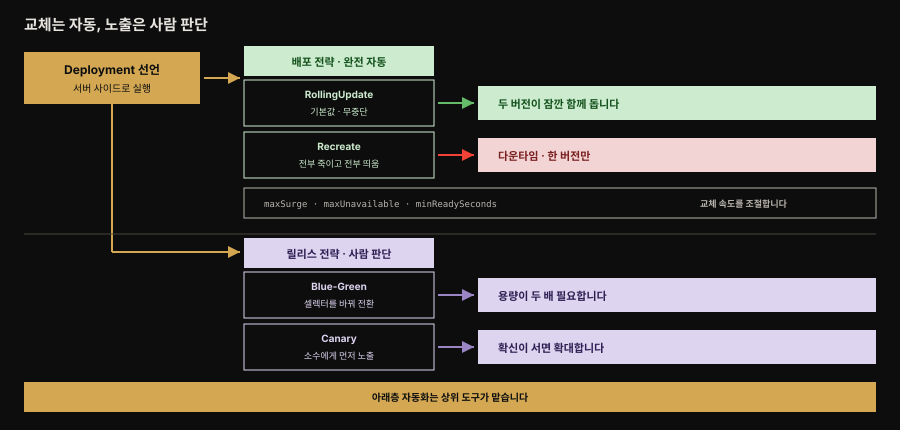

# Declarative Deployment — 업그레이드·롤백을 선언으로

> 『Kubernetes Patterns』 3장 정독. **Declarative Deployment**의 심장은 Deployment 리소스입니다. 이 추상화가 컨테이너 그룹의 업그레이드·롤백 과정을 감싸, 그 실행을 **반복 가능하고 자동화된 활동**으로 만듭니다. 핵심은 "어떤 단계를 밟을지"가 아니라 "배포된 상태가 어떤 모습이어야 하는지"를 선언하는 것입니다.



이 장 전체가 이 그림 한 장에 들어갑니다. 왼쪽 노란 상자에서 출발한 선언이 두 층으로 갈라지고, 가로줄이 그 사이를 가릅니다. 이 가로줄이 이 장에서 가장 중요한 경계입니다.

위층 **배포 전략**은 낡은 컨테이너를 새것으로 바꾸는 방식이고 Kubernetes가 끝까지 자동으로 처리합니다. 아래층 **릴리스 전략**은 새 버전을 소비자에게 노출하는 방식인데, 전환을 언제 당길지가 사람의 판단이라 Deployment 하나로는 완결되지 않습니다. 맨 아래 띠가 그 빈자리를 상위 도구가 채운다는 뜻입니다.


## 핵심 요약

> 마이크로서비스가 늘수록 새 버전으로 갈아 끼우는 일이 부담이 됩니다. 수동으로 하면 사람 실수가, 스크립트로 하면 상당한 노력이 들어 릴리스가 병목이 됩니다. Deployment는 이 과정을 선언적으로 정의해, 서버 사이드에서 하나의 원자적 활동으로 실행합니다. 기본 전략은 무중단 **RollingUpdate**와 다운타임을 감수하는 **Recreate**이고 그 위에 사람 판단이 개입하는 **Blue-Green·Canary** 릴리스 전략이 있습니다.

자동화의 값이 얼마나 큰지는 횟수로 따져 보면 드러납니다. 릴리스 주기 한 번마다 마이크로서비스 인스턴스별로 여러 번의 Deployment가 일어나고, 그 주기는 팀과 프로젝트에 따라 **몇 분에서 몇 개월까지** 걸칩니다. 주기가 짧을수록 같은 절차가 반복되므로, 이 과정을 선언으로 옮기는 것 자체가 상당한 노력 절감입니다.

두 층을 나눠 봐야 합니다. **배포 전략**(Rolling·Recreate)은 *낡은 컨테이너를 새것으로 교체하는 방식*을 다루고 Kubernetes가 완전 자동화합니다. **릴리스 전략**(Blue-Green·Canary)은 *새 버전이 소비자에게 노출되는 방식*을 다루는데, 전환 트리거가 사람의 판단이라 완전 자동은 아니고 다른 프리미티브를 조합하거나 상위 도구가 필요합니다.

Deployment가 제대로 일하려면 전제가 있습니다. 컨테이너가 좋은 클라우드 네이티브 시민이어야 합니다 — SIGTERM 같은 생애주기 이벤트를 존중하고(5장 Managed Lifecycle), 기동 성공을 알리는 health 엔드포인트를 제공해야(4장 Health Probe) 플랫폼이 낡은 컨테이너를 깔끔히 내리고 새 인스턴스로 교체할 수 있습니다.


## 학습 목표

> 이 편을 읽고 나면 다음을 설명할 수 있습니다.

- 명령형(imperative) 업데이트의 문제와, Deployment의 선언적(declarative) 접근이 주는 이점 네 가지를 말합니다.
- RollingUpdate의 `maxSurge`·`maxUnavailable`·`minReadySeconds`가 각각 무엇을 조절하는지 설명합니다.
- RollingUpdate와 Recreate를 언제 쓰는지, 각각의 트레이드오프(무중단 vs 두 버전 공존, 다운타임 vs 단일 버전)를 구분합니다.
- Blue-Green과 Canary가 왜 Deployment만으로 안 되고 사람 판단·상위 도구가 필요한지 설명합니다.
- `kubectl rollout` 서브커맨드와 higher-level 도구(Flagger·Argo Rollouts·Knative)의 자리를 압니다.


## 본문 정리

### 문제 — 수동 업그레이드는 병목이 된다

앞 장까지 온 지점을 짚으면 이 장의 문제가 선명해집니다. 네임스페이스로 격리 환경을 셀프서비스로 확보하고, 스케줄러가 최소한의 사람 개입으로 앱을 그 환경에 배치하는 일까지는 이미 자동화됐습니다. **그런데 마이크로서비스 수가 늘면 그것들을 계속 새 버전으로 갱신·교체하는 일이 또 하나의 부담으로 남습니다.** 배치는 풀렸지만 갱신은 아직 안 풀린 상태입니다.

버전을 올리는 일에는 다음 활동이 얽힙니다.

1. 새 버전 Pod를 시작합니다.
2. 낡은 버전 Pod를 graceful하게 종료합니다.
3. 새 Pod가 성공적으로 기동했는지 기다려 확인합니다.
4. 실패한 경우 이전 버전으로 전부 되돌립니다.

이를 수행하는 방식은 둘 중 하나입니다. 다운타임을 감수하며 두 버전을 동시에 안 돌리거나, 다운타임 없이 하되 업데이트 동안 두 버전이 다 돌아 자원을 더 씁니다. 어느 쪽이든 수동으로 하면 사람 실수를 부르고, 제대로 스크립팅하려면 상당한 노력이 들어 릴리스가 병목이 됩니다.

### kubectl rollout — 서버 사이드 선언적 관리

과거 `kubectl rolling-update`는 **클라이언트 사이드 명령형**이었습니다 — kubectl이 각 단계마다 서버에 무엇을 할지 지시했습니다. Kubernetes 1.18에서 이것이 제거되고 `kubectl rollout`으로 대체됐습니다. 차이는 rollout이 Deployment 선언을 갱신하고 실제 업데이트는 Kubernetes에 맡기는 **서버 사이드** 방식이라는 점입니다.

| 서브커맨드 | 하는 일 |
|-----------|---------|
| `rollout status` | 현재 rollout 상태 표시 |
| `rollout pause` | rolling update를 멈춤 — 여러 변경을 재트리거 없이 한 번에 적용 |
| `rollout resume` | 멈춘 rollout 재개 |
| `rollout undo` | 이전 리비전으로 롤백 (업데이트 중 오류 시 유용) |
| `rollout history` | Deployment의 가용 리비전 표시 |
| `rollout restart` | 업데이트 없이 현재 Pod 집합을 설정된 전략으로 재시작 |

### Rolling Deployment — 무중단 교체

선언적 업데이트는 Deployment로 합니다. 뒤에서 Deployment는 set-based 라벨 셀렉터를 지원하는 ReplicaSet을 만들고 `RollingUpdate`(기본)·`Recreate` 전략으로 업데이트 동작을 빚습니다.

```yaml
apiVersion: apps/v1
kind: Deployment
metadata:
  name: random-generator
spec:
  replicas: 3                    # rolling update가 의미 있으려면 replica > 1
  strategy:
    type: RollingUpdate
    rollingUpdate:
      maxSurge: 1                 # replicas 외에 임시로 더 띄울 수 있는 Pod 수 (여기선 최대 4개)
      maxUnavailable: 1          # 업데이트 중 사용 불가할 수 있는 Pod 수 (여기선 한 번에 최소 2개 가용)
  minReadySeconds: 60            # rollout 계속 전, readiness가 이만큼 건강해야 함
  selector:
    matchLabels:
      app: random-generator
  template:
    metadata:
      labels:
        app: random-generator
    spec:
      containers:
      - image: k8spatterns/random-generator:1.0
        name: random-generator
        readinessProbe:           # 무중단 rolling에 꼭 필요 — 빠뜨리지 말 것
          exec:
            command: [ "stat", "/tmp/random-generator-ready" ]
```

RollingUpdate는 업데이트 중 다운타임이 없게 합니다. 뒤에서 새 ReplicaSet을 만들고 낡은 컨테이너를 새것으로 바꿉니다. 여기서 향상된 점은 **새 컨테이너 rollout 속도를 제어**할 수 있다는 것으로, `maxSurge`(가용을 초과해 더 띄울 Pod)와 `maxUnavailable`(가용에서 뺄 Pod)로 조절합니다.

두 필드는 절대 개수이거나 replica 수에 적용되는 상대 퍼센트일 수 있고 `maxSurge`는 올림·`maxUnavailable`은 내림으로 정수화됩니다. **기본값은 둘 다 25%**입니다.

또 하나 중요한 파라미터가 `minReadySeconds`입니다. Pod의 readiness가 성공한 뒤 그 Pod가 rollout에서 "가용"으로 간주되기까지 기다리는 초입니다. 이 값을 키우면 rollout을 계속하기 전에 앱 Pod가 얼마간 성공적으로 돌고 있음을 보장하고 새 버전을 디버깅·탐색할 여유를 줍니다(간격이 크면 `kubectl rollout pause`를 쓰기도 쉬워집니다).

선언적 업데이트를 트리거하는 방법은 세 가지입니다.

- `kubectl replace`로 Deployment 전체를 새 버전 것으로 교체합니다.
- `kubectl patch`나 `kubectl edit`로 새 버전의 컨테이너 이미지를 지정합니다.
- `kubectl set image`로 새 이미지를 설정합니다.

명령형 배포의 단점을 해소하는 것 외에, Deployment 자체가 주는 이점이 넷 있습니다.

- **상태를 Kubernetes가 전적으로 관리합니다.** Deployment는 상태가 내부에서 관리되는 리소스 오브젝트이고 업데이트 전 과정이 클라이언트 개입 없이 서버 사이드에서 수행됩니다.
- **목표 상태를 선언합니다.** 거기에 이르는 단계가 아니라 배포된 상태가 어떤 모습이어야 하는지를 적습니다.
- **실행 가능한 오브젝트입니다.** 문서 이상이라 프로덕션에 닿기 전 여러 환경에서 시험하고 검증할 수 있습니다.
- **과정이 기록·버전 관리됩니다.** 업데이트를 멈추고 이어가고 이전 버전으로 되돌릴 수 있습니다.

### Fixed Deployment — Recreate 전략

RollingUpdate의 부작용은 업데이트 동안 두 버전이 동시에 돈다는 것입니다. 서비스 API에 하위 호환 안 되는 변경이 들어갔고 클라이언트가 그것을 감당 못 하면 문제가 됩니다. 이럴 때 **Recreate** 전략을 씁니다.

Recreate는 `maxUnavailable`을 선언된 replica 수로 설정하는 효과입니다. 즉 현재 버전 컨테이너를 **전부 죽인 뒤**, 낡은 것이 축출되면 새 컨테이너를 **전부 동시에** 시작합니다. 결과적으로 낡은 컨테이너가 다 멈추고 새것이 아직 요청을 못 받는 동안 **다운타임**이 생깁니다. 대신 두 버전이 동시에 돌지 않아, 소비자는 한 번에 한 버전에만 연결됩니다.

### Blue-Green Release — 두 배 용량으로 위험 최소화

Blue-Green은 다운타임과 위험을 줄이며 프로덕션에 배포하는 릴리스 전략입니다. Deployment 프리미티브를 다른 프리미티브와 함께 빌딩 블록으로 써서 구현합니다. **service mesh나 Knative 같은 확장이 없으면 수동으로 해야** 합니다.

동작은 이렇습니다. 두 번째 Deployment(green)를 최신 버전으로 만들되 아직 요청을 안 받게 둡니다. 이때 원래 Deployment(blue)의 낡은 Pod가 여전히 실서비스 요청을 처리합니다. 새 버전이 건강하고 준비됐다는 확신이 서면, **Service 셀렉터를 green과 매칭되게 바꿔** 트래픽을 전환합니다. green이 모든 트래픽을 처리하면 blue를 삭제하고 자원을 회수합니다.

이점은 한 번에 한 버전만 요청을 처리해 소비자의 다중 버전 처리 복잡도가 준다는 것입니다. 단점은 blue·green이 다 떠 있는 동안 **앱 용량이 두 배** 필요하고 장기 실행 프로세스·DB 상태 드리프트에서 상당한 복잡성이 생길 수 있다는 점입니다.

### Canary Release — 소수에게 먼저

Canary는 낡은 인스턴스의 작은 일부만 새것으로 바꿔 프로덕션에 부드럽게 배포합니다. 일부 소비자만 새 버전에 닿게 해 위험을 줄이고 소수 사용자에게서 만족스러우면 그다음 단계에서 낡은 인스턴스를 전부 새 버전으로 바꿉니다.

Kubernetes에서는 작은 replica 수의 새 Deployment를 canary로 만들고 Service가 일부 소비자를 새 Pod로 보냅니다. canary 이후 새 ReplicaSet이 기대대로 동작한다는 확신이 서면, 새 ReplicaSet을 올리고 낡은 ReplicaSet을 0으로 내립니다. 통제되고 사용자 검증된 점진적 rollout인 셈입니다.


책의 Figure 3-5가 보이는 비교입니다. 네 행을 세로로 훑으면 각 전략이 전환 중에 무엇을 대가로 치르는지가 드러납니다. RollingUpdate는 인스턴스가 넷으로 늘어나고(`maxSurge`의 효과) 서비스가 끊기지 않는 대신 두 버전이 잠깐 공존합니다. Recreate는 가운데가 아예 비어 그 구간이 다운타임이 되지만 두 버전이 겹치지 않습니다. Blue-Green은 여섯 개가 동시에 존재해 용량이 두 배 들고, Canary는 총수를 유지한 채 하나만 바꿔 위험 노출을 소수로 제한합니다.

### Discussion — 자동화 경계와 상위 도구

기본 배포 전략(rolling·recreate)은 낡은 컨테이너의 교체를 제어하고 고급 릴리스 전략(Blue-Green·canary)은 새 버전이 소비자에게 노출되는 방식을 제어합니다. 뒤 둘은 전환 트리거가 사람 판단이라 완전 자동이 아닙니다. 또 이 장의 기법은 Pod 업데이트만 다루지, ConfigMap·Secret·의존 서비스 같은 다른 의존성의 업데이트·롤백은 포함하지 않습니다.

> **Pre/Post 배포 훅 — 정체된 제안.** 배포 전략 실행 전후에 커스텀 명령을 돌려 abort·retry·continue하게 하자는 제안이 과거 있었지만 이 노력은 (2023년 기준) 수년째 정체돼 Kubernetes에 올지 불투명합니다. 오늘 동작하는 방법은 Deployment와 다른 프리미티브로 업데이트를 관리하는 스크립트를 짜는 것이지만 이 명령형 접근은 Kubernetes의 선언적 성질과 맞지 않습니다.

그 대안으로 상위 선언적 접근이 Kubernetes 위에 등장했습니다. 이들은 **Operator 패턴**(28장)으로 작동해, rollout 과정의 선언적 기술을 받아 서버 사이드에서 필요한 조치를 수행하고 일부는 업데이트 오류 시 자동 롤백도 합니다.

이 확장들이 필요한 이유를 저자는 Deployment의 성격 자체에서 찾습니다. Deployment는 ReplicaSet과 Pod 위에 놓인 **좋은 추상화**이지만, 그 목적은 어디까지나 **소수의 파라미터로 튜닝하는 단순한 선언적 rollout**입니다. 그 설계 범위 안에 canary나 Blue-Green 같은 정교한 전략은 처음부터 들어 있지 않습니다. 상위 도구들은 새 리소스 타입을 도입해 더 유연한 배포 전략을 선언할 수 있게 만들어, Deployment가 비운 자리를 채웁니다.

| 도구 | 성격 |
|------|------|
| **Flagger** | Flux CD(GitOps)의 일부. canary·Blue-Green 지원, 여러 ingress·mesh와 통합해 트래픽 분할. 커스텀 메트릭 기반 rollout 감시·자동 롤백 |
| **Argo Rollouts** | Argo 계열 CD. Flagger와 거의 같은 능력. Argo냐 Flux냐 선호로 선택 |
| **Knative** | Kubernetes 위 서버리스 플랫폼. 트래픽 기반 오토스케일(29장)·트래픽 분할. rollout/rollback은 Flagger·Argo만큼 고급은 아니나 Deployment보다 나음 |

이들 모두 Kubernetes처럼 CNCF 프로젝트입니다. 어떤 배포 전략을 쓰든, Kubernetes가 앱 Pod의 기동·준비를 알아야 목표 배포 상태에 이르는 단계를 밟을 수 있습니다 — 그것이 다음 4장 Health Probe입니다.


## 심화 학습

> 본문(원서 3장) 밖에서 보강한 내용입니다. 출처를 링크로 남깁니다.

### Spring Boot 앱을 무중단으로 rolling update 하려면

이 장이 "readinessProbe를 빠뜨리지 말라"고 강조하는 이유가 Spring Boot 앱에서 특히 살아납니다. RollingUpdate는 새 Pod가 readiness를 통과해야 낡은 Pod를 내리는데, Spring Boot 앱은 컨텍스트 초기화·커넥션 풀 워밍업·첫 JIT 컴파일 때문에 프로세스가 떠도 한동안 요청을 제대로 못 받습니다. readiness 없이 rolling하면 아직 안 데워진 새 Pod로 트래픽이 흘러 첫 요청들이 느리거나 실패합니다.

Spring Boot 2.3+는 이를 위해 Actuator에 `/actuator/health/liveness`·`/actuator/health/readiness` 그룹을 내장했습니다. `management.endpoint.health.probes.enabled=true`로 켜면 Kubernetes 프로브에 바로 매핑됩니다. 여기에 **graceful shutdown**(`server.shutdown=graceful`)을 켜면, SIGTERM을 받은 Pod가 진행 중 요청을 마치고 내려가 rolling update 중 요청 유실을 막습니다 — 이 장이 전제로 든 "SIGTERM 존중"(5장)과 정확히 맞물립니다.

> Deployment 업데이트 메커니즘(pod-template-hash·리비전·maxSurge 계산·전략 5종)은 형제 정독본 [Deployment 업데이트](../kubernetes-in-action/15-02.Deployment%20%EC%97%85%EB%8D%B0%EC%9D%B4%ED%8A%B8%20%E2%80%94%20Recreate%C2%B7RollingUpdate%C2%B7maxSurge.md)·[rollout 제어와 배포 전략](../kubernetes-in-action/15-03.rollout%20%EC%A0%9C%EC%96%B4%EC%99%80%20%EB%B0%B0%ED%8F%AC%20%EC%A0%84%EB%9E%B5%20%E2%80%94%20pause%C2%B7faulty%C2%B7rollback%C2%B7%EC%A0%84%EB%9E%B5%205%EC%A2%85.md)에 상세합니다. 이 편은 그것을 다시 설명하지 않고 **패턴의 의도**만 남깁니다.

### Deployment가 canary를 "직접" 지원한다는 오해

Deployment의 replica 수를 조절해 흉내 내는 "poor man's canary"는 이 장이 설명하는 방식입니다. 다만 정밀한 트래픽 비율(예: 5%만 새 버전) 제어는 Deployment만으로 불가능합니다. Deployment는 Pod 개수 비율로만 나누므로, "새 버전 3 replica + 구 버전 97 replica"처럼 개수로 근사할 뿐입니다.

실제 트래픽 가중치·헤더 기반 라우팅·자동 승격에는 L7 트래픽 분할이 필요합니다. Flagger·Argo Rollouts는 service mesh(Istio·Linkerd)나 ingress 컨트롤러의 그 기능을 얹어 씁니다. Flagger 문서는 Blue-Green의 경우에는 mesh도 ingress도 필요 없다고 덧붙입니다. Knative는 자체 네트워킹 레이어로 분할하므로 별도 mesh를 얹지 않습니다. 그래서 이 장은 "advanced, production-ready 시나리오에는 이 확장들을 보라"고 권합니다.

- 출처: [Spring Boot — Kubernetes Probes (공식 문서)](https://docs.spring.io/spring-boot/reference/actuator/endpoints.html#actuator.endpoints.kubernetes-probes) (2026-07-12 조회)
- 출처: [Kubernetes — Deployments (공식)](https://kubernetes.io/docs/concepts/workloads/controllers/deployment/)


## 능동 회상

> 먼저 스스로 답해 본 뒤 아래 정답 절에서 맞춰 봅니다. 정답은 이 절 다음에 번호 순서대로 있습니다.

1. 이 장이 푸는 문제는 무엇인가요? 앞 장까지 이미 자동화된 것과 아직 남은 것을 나눠 말해 보세요.
2. 버전을 올리는 일에 얽히는 활동 네 가지는 무엇인가요?
3. 업그레이드를 수행하는 두 방식은 무엇이며 각각 무엇을 대가로 치르나요?
4. Deployment 가 제대로 일하기 위해 컨테이너에 요구하는 전제 두 가지는 무엇인가요? 각각 몇 장에서 다루나요?
5. `kubectl rolling-update` 와 `kubectl rollout` 의 차이는 무엇인가요?
6. `kubectl rollout` 의 여섯 서브커맨드는 각각 무엇을 하나요?
7. `rollout restart` 는 다른 서브커맨드와 무엇이 다른가요?
8. Deployment 는 뒤에서 무엇을 만들며, 그것은 어떤 셀렉터를 지원하나요?
9. `maxSurge` 와 `maxUnavailable` 은 각각 무엇을 정하나요? 기본값은 얼마인가요?
10. 두 필드를 퍼센트로 줄 때 정수화 방향은 각각 어떻게 되나요? 왜 그 방향인가요?
11. `minReadySeconds` 는 무엇을 정하나요? 이 값을 키우면 무엇이 좋아지나요?
12. 예제에서 `replicas: 3` 인 이유는 무엇인가요?
13. 선언적 업데이트를 트리거하는 세 가지 방법은 무엇인가요?
14. Deployment 자체가 주는 이점 네 가지를 들어 보세요.
15. Recreate 는 어떤 필드를 어떻게 설정한 효과인가요? 그 결과 어떤 순서로 일이 벌어지나요?
16. Recreate 를 선택하는 상황은 어떤 경우인가요?
17. Blue-Green 의 동작 순서를 말해 보세요. 트래픽 전환은 무엇을 바꿔서 하나요?
18. Blue-Green 의 이점과 단점은 각각 무엇인가요?
19. Canary 를 Kubernetes 에서 구현하는 방법과 이후 확대 절차는 어떻게 되나요?
20. 배포 전략과 릴리스 전략은 무엇으로 갈리나요? 뒤 둘이 완전 자동이 아닌 이유는 무엇인가요?
21. 이 장의 기법이 다루지 *않는* 범위는 무엇인가요?
22. Pre/Post 배포 훅 제안은 어떻게 됐나요? 오늘 쓸 수 있는 대안과 그 한계는 무엇인가요?
23. 상위 도구 셋은 각각 어떤 성격인가요? 이들이 공통으로 기반하는 패턴은 무엇인가요?
24. 저자가 Deployment 로 canary 를 "직접" 지원하지 못한다고 보는 근거는 무엇인가요?


## 정답

> 위 회상 질문의 답입니다. 번호가 대응합니다.

**1.** 네임스페이스로 격리 환경을 셀프서비스로 확보하는 일과, 스케줄러가 최소한의 사람 개입으로 앱을 그 환경에 배치하는 일까지는 이미 자동화됐습니다. 아직 남은 것은 **갱신**입니다. 마이크로서비스 수가 늘수록 그것들을 계속 새 버전으로 갱신·교체하는 일이 또 하나의 부담이 됩니다.

**2.** 새 버전 Pod 시작 → 낡은 버전 Pod 의 graceful 종료 → 기동 성공 여부 대기·확인 → 실패 시 이전 버전으로 롤백입니다.

**3.** 다운타임을 감수하되 두 버전을 동시에 안 돌리거나, 다운타임 없이 하되 업데이트 동안 두 버전이 다 돌아 **자원을 더 쓰거나** 둘 중 하나입니다. 어느 쪽이든 수동으로 하면 사람 실수를 부르고 제대로 스크립팅하려면 상당한 노력이 들어 릴리스가 병목이 됩니다.

**4.** 컨테이너가 좋은 클라우드 네이티브 시민이어야 합니다. **SIGTERM 같은 생애주기 이벤트를 듣고 존중**해야 하고(5장 Managed Lifecycle), **기동 성공을 알리는 health 엔드포인트를 제공**해야 합니다(4장 Health Probe). 이 둘이 정확히 갖춰져야 플랫폼이 낡은 컨테이너를 깔끔히 내리고 새 인스턴스로 교체할 수 있습니다.

**5.** `rolling-update` 는 **클라이언트 사이드 명령형**으로, kubectl 이 각 업데이트 단계마다 서버에 무엇을 할지 지시했습니다. Kubernetes 1.18 에서 제거되고 `rollout` 으로 대체됐습니다. `rollout` 은 Deployment 선언을 갱신하고 실제 업데이트 수행은 Kubernetes 에 맡기는 **서버 사이드** 방식입니다.

**6.** 여섯 가지입니다.

- `status` — 현재 rollout 상태를 표시합니다.
- `pause` — rolling update 를 멈춰, 여러 변경을 재트리거 없이 한 번에 적용하게 합니다.
- `resume` — 멈춘 rollout 을 재개합니다.
- `undo` — 이전 리비전으로 롤백합니다.
- `history` — 가용 리비전을 표시합니다.
- `restart` — 현재 Pod 집합을 재시작합니다.

**7.** `restart` 는 **업데이트를 수행하지 않습니다.** Deployment 에 속한 현재 Pod 집합을 설정된 rollout 전략을 써서 재시작할 뿐입니다.

**8.** **ReplicaSet** 을 만들며, 그것은 **set-based 라벨 셀렉터**를 지원합니다.

**9.** `maxSurge` 는 선언된 replicas 를 **초과해 임시로 더 띄울 수 있는 Pod 수**입니다(예제에서는 최대 4개). `maxUnavailable` 은 업데이트 중 **사용 불가할 수 있는 Pod 수**입니다(예제에서는 한 번에 최소 2개 가용). 둘 다 기본값은 **25%** 입니다.

**10.** `maxSurge` 는 **올림**, `maxUnavailable` 은 **내림**입니다. 공식 API 레퍼런스가 각각 "rounding up" · "rounding down" 으로 명시합니다.

*방향이 왜 반대인지는 원서도 공식 문서도 설명하지 않습니다.* 굳이 읽자면 두 필드가 서로 다른 것을 지킵니다. `maxUnavailable` 내림은 "동시에 빠질 수 있는 수"를 줄여 **가용성**을 지키는 쪽이고, `maxSurge` 올림은 "임시로 더 띄울 수 있는 수"를 늘려 **롤아웃이 멈추지 않게** 하는 쪽입니다. 결과적으로 둘 다 롤아웃을 안전하게 굴리는 방향이지만 목적은 같지 않습니다. 이 해석은 근거가 없는 추론이니 면접에서는 "올림·내림"이라는 사실까지만 말하는 편이 안전합니다.

**11.** 롤아웃된 Pod 의 readiness 프로브가 성공한 뒤, 그 Pod 가 rollout 에서 **"가용"으로 간주되기까지 기다리는 초**입니다. 값을 키우면 rollout 을 계속하기 전에 앱 Pod 가 얼마간 성공적으로 돌고 있음을 보장하고, 새 버전을 디버깅·탐색할 여유가 생깁니다. 간격이 크면 `kubectl rollout pause` 를 활용하기도 쉬워집니다.

**12.** rolling update 가 **의미를 가지려면 replica 가 하나보다 많아야** 하기 때문입니다. 하나뿐이면 교체할 여분이 없어 무중단이 성립하지 않습니다.

**13.** `kubectl replace` 로 Deployment 전체를 새 버전 것으로 교체하거나, `kubectl patch`·`kubectl edit` 로 새 버전의 컨테이너 이미지를 지정하거나, `kubectl set image` 로 새 이미지를 설정합니다.

**14.** 상태가 Kubernetes 내부에서 전적으로 관리되고 업데이트 전 과정이 클라이언트 개입 없이 서버 사이드에서 수행된다는 점, 거기에 이르는 단계가 아니라 목표 상태를 선언한다는 점, 문서 이상의 **실행 가능한 오브젝트**라 프로덕션 전에 여러 환경에서 시험·검증할 수 있다는 점, 과정이 **기록·버전 관리**되어 멈추고 이어가고 되돌릴 수 있다는 점입니다.

**15.** `maxUnavailable` 을 **선언된 replica 수로 설정**하는 효과입니다. 그 결과 현재 버전 컨테이너를 **전부 죽인 뒤**, 낡은 것이 축출되면 새 컨테이너를 **전부 동시에** 시작합니다. 낡은 것이 다 멈추고 새것이 아직 요청을 못 받는 동안 다운타임이 생깁니다.

**16.** 업데이트 과정에 **하위 호환이 안 되는 변경**이 들어갔고 클라이언트가 그것을 감당하지 못하는 경우입니다. 두 버전이 동시에 돌면 소비자에게 문제가 생기므로, 다운타임을 감수하고 한 번에 한 버전만 노출합니다.

**17.** 두 번째 Deployment(green)를 최신 버전으로 만들되 아직 요청을 안 받게 둡니다. 이때 원래 Deployment(blue)의 낡은 Pod 가 여전히 실서비스 요청을 처리합니다. 새 버전이 건강하고 준비됐다는 확신이 서면 **Service 셀렉터를 green 과 매칭되게 바꿔** 트래픽을 전환하고, green 이 모든 트래픽을 처리하면 blue 를 삭제해 자원을 회수합니다.

**18.** 이점은 **한 번에 한 버전만 요청을 처리**해 소비자의 다중 버전 처리 복잡도가 준다는 것입니다. 단점은 blue·green 이 다 떠 있는 동안 **앱 용량이 두 배** 필요하고, 장기 실행 프로세스와 DB 상태 드리프트에서 상당한 복잡성이 생길 수 있다는 점입니다.

**19.** 작은 replica 수의 새 Deployment 를 canary 인스턴스로 만들고, Service 가 일부 소비자를 그 새 Pod 로 보냅니다. canary 이후 새 ReplicaSet 이 기대대로 동작한다는 확신이 서면 **새 ReplicaSet 을 올리고 낡은 ReplicaSet 을 0 으로 내립니다.** 통제되고 사용자 검증된 점진적 rollout 입니다.

**20.** **배포 전략**(Rolling·Recreate)은 낡은 컨테이너가 새것으로 **교체되는 방식**을 제어하고, **릴리스 전략**(Blue-Green·Canary)은 새 버전이 **소비자에게 노출되는 방식**을 제어합니다. 뒤 둘은 전환 트리거가 **사람의 판단**에 기반하므로 Kubernetes 가 완전히 자동화하지 않고 사람의 개입을 요구합니다.

**21.** 이 장의 기법은 **Pod 업데이트 과정**만 다룹니다. ConfigMap·Secret·의존 서비스 같은 **다른 Pod 의존성의 업데이트·롤백은 포함하지 않습니다.**

**22.** 배포 전략 실행 전후에 커스텀 명령을 돌려 abort·retry·continue 하게 하자는 제안이 과거 있었습니다. 이 노력은 2023년 기준 수년째 **정체돼** Kubernetes 에 올지 불투명합니다.

오늘 동작하는 대안은 Deployment 와 다른 프리미티브로 업데이트를 관리하는 **스크립트**를 짜는 것입니다. 다만 개별 업데이트 단계를 기술하는 이 명령형 접근은 **Kubernetes 의 선언적 성질과 맞지 않습니다.**

**23.** 셋의 성격은 이렇게 갈립니다.

- **Flagger** — Flux CD 계열 GitOps 도구의 일부입니다. canary·Blue-Green 을 지원하고 여러 ingress·service mesh 와 통합해 트래픽을 분할하며, 커스텀 메트릭으로 rollout 을 감시해 자동 롤백을 트리거합니다.
- **Argo Rollouts** — Argo 계열 CD 도구입니다. Flagger 와 능력이 거의 같아, Argo 냐 Flux 냐 하는 선호로 고르면 됩니다.
- **Knative** — Kubernetes 위 서버리스 플랫폼입니다. 트래픽 기반 오토스케일과 트래픽 분할을 제공하며 오토스케일은 29장에서 다룹니다.

셋 모두 **Operator 패턴**(28장)에 기반하며 CNCF 프로젝트입니다.

**24.** *저자의 근거* — Deployment 는 ReplicaSet 과 Pod 위에 놓인 좋은 추상화이지만 그 목적이 **소수의 파라미터로 튜닝하는 단순한 선언적 rollout** 이기 때문입니다. canary 나 Blue-Green 같은 정교한 전략은 애초에 설계 범위 밖입니다.

*여기서부터는 본문 심화 절의 보강* — Deployment 는 Pod 개수 비율로만 나누므로 "새 버전 3 replica + 구 버전 97 replica" 처럼 개수로 근사할 뿐입니다. 정밀한 트래픽 가중치·헤더 기반 라우팅·자동 승격을 하려면 L7 트래픽 분할이 필요하고, Flagger·Argo Rollouts 는 service mesh 나 ingress 컨트롤러의 그 기능을 얹어 씁니다. Knative 는 자체 네트워킹 레이어로 트래픽 분할을 제공합니다.


## 실무 적용

- **기본은 RollingUpdate, 호환 안 되는 변경엔 Recreate.** 두 버전이 동시에 돌면 깨지는 API 변경(예: DB 스키마 파괴적 변경)에는 다운타임을 감수하고 Recreate를 씁니다.
- **RollingUpdate에는 readinessProbe와 minReadySeconds를 반드시 짝짓는다.** readiness 없이는 무중단이 보장되지 않습니다. Spring Boot면 `/actuator/health/readiness`를 씁니다.
- **`maxSurge`/`maxUnavailable`로 교체 속도를 조율한다.** 자원 여유가 있으면 maxSurge를 키워 빠르게, 여유가 없으면 maxUnavailable을 0으로 두고 천천히.
- **롤백은 `kubectl rollout undo`.** 업데이트 오류 시 즉시 이전 리비전으로 되돌립니다. `rollout history`로 리비전을 확인합니다.
- **정밀 canary·자동 롤백이 필요하면 Deployment를 넘어선다.** Argo Rollouts·Flagger를 GitOps(Argo/Flux)와 짝지어, 메트릭 기반 자동 승격·롤백을 씁니다.
- **Blue-Green은 용량 2배와 DB 드리프트를 계산에 넣는다.** 무상태 서비스에 적합하고 장기 실행·상태 있는 워크로드에서는 전환 중 데이터 정합성을 별도로 설계합니다.


## 체크리스트

- [ ] 명령형 `rolling-update`와 선언적 `rollout`의 차이(클라이언트 vs 서버 사이드)를 설명할 수 있습니다.
- [ ] `maxSurge`·`maxUnavailable`(기본 25%)·`minReadySeconds`가 각각 무엇을 조절하는지 압니다.
- [ ] RollingUpdate(무중단·두 버전 공존)와 Recreate(다운타임·단일 버전)의 트레이드오프를 구분할 수 있습니다.
- [ ] Recreate가 `maxUnavailable`을 replica 수로 설정하는 효과임을 압니다.
- [ ] Blue-Green(용량 2배·Service 셀렉터 전환)과 Canary(소수 노출·점진 확대)의 동작과 한계를 설명할 수 있습니다.
- [ ] Blue-Green·Canary가 왜 사람 판단·상위 도구(Flagger·Argo Rollouts·Knative)를 필요로 하는지 압니다.
- [ ] Spring Boot 앱을 무중단 rolling하려면 readiness 프로브와 graceful shutdown이 왜 필요한지 설명할 수 있습니다.


## 면접 관점

**Q. RollingUpdate와 Recreate는 언제 각각 씁니까?**
RollingUpdate는 무중단이 필요할 때 기본으로 쓰지만 업데이트 중 두 버전이 동시에 돕니다. Recreate는 두 버전이 공존하면 깨지는 경우, 즉 하위 호환이 안 되는 API·스키마 변경에 씁니다. 낡은 컨테이너를 전부 죽인 뒤 새것을 전부 띄우므로 다운타임이 생기지만 소비자는 한 번에 한 버전에만 연결됩니다.

**Q. `maxSurge`와 `maxUnavailable`은 무엇을 조절합니까?**
maxSurge는 replica 수를 초과해 임시로 더 띄울 수 있는 Pod 수(올림), maxUnavailable은 업데이트 중 사용 불가할 수 있는 Pod 수(내림)입니다. 둘 다 절대 개수나 퍼센트로 지정하고 기본값은 25%입니다. maxSurge를 키우면 자원을 더 써서 빠르게, maxUnavailable을 0으로 두면 가용성을 지키며 천천히 교체합니다.

**Q. Blue-Green과 Canary가 Deployment만으로 완전 자동화되지 않는 이유는?**
둘은 배포 전략이 아니라 릴리스 전략으로, 전환 트리거가 사람의 판단이기 때문입니다. Deployment는 Rolling·Recreate만 직접 지원합니다. Blue-Green은 Service 셀렉터 전환을, Canary는 트래픽 비율 제어를 다른 프리미티브로 조합해야 합니다.

정밀한 트래픽 분할과 자동 롤백에는 상위 도구가 필요합니다. Flagger·Argo Rollouts는 service mesh나 ingress 컨트롤러의 L7 트래픽 분할 기능을 얹어 쓰고, Knative는 자체 네트워킹 레이어로 분할하므로 별도 mesh를 얹지 않아도 됩니다.

**Q. Spring Boot 앱의 무중단 rolling update에 readiness 프로브가 왜 중요합니까?**
RollingUpdate는 새 Pod가 readiness를 통과해야 낡은 Pod를 내립니다. Spring Boot 앱은 컨텍스트 초기화·커넥션 풀 워밍업 때문에 프로세스가 떠도 한동안 요청을 제대로 못 받는데, readiness 없이 rolling하면 안 데워진 Pod로 트래픽이 흘러 첫 요청이 느리거나 실패합니다. `/actuator/health/readiness`와 graceful shutdown을 함께 걸어 요청 유실을 막습니다.


## 참고 자료

- 원서: 《Kubernetes Patterns, Second Edition》(Bilgin Ibryam·Roland Huß, O'Reilly) Ch3. Declarative Deployment
- 이 책의 MOC: [Kubernetes Patterns 정독 인덱스](./README.md) · 앞 편: [Predictable Demands](./02-01.Predictable%20Demands%20%E2%80%94%20%EC%9E%90%EC%9B%90%20%EC%9A%94%EA%B5%AC%EB%A5%BC%20%EC%84%A0%EC%96%B8%ED%95%B4%20%EC%8A%A4%EC%BC%80%EC%A4%84%EB%9F%AC%EC%97%90%20%EC%95%8C%EB%A6%AC%EA%B8%B0.md)
- 다음 편: [Health Probe](./04-01.Health%20Probe%20%E2%80%94%20%EC%95%B1%EC%9D%B4%20%EC%9E%90%EA%B8%B0%20%EA%B1%B4%EA%B0%95%EC%9D%84%20%ED%94%8C%EB%9E%AB%ED%8F%BC%EC%97%90%20%EC%95%8C%EB%A6%AC%EA%B8%B0.md) — 이 장이 전제로 둔 "기동·준비 상태를 플랫폼에 알리는 법"
- 형제 정독본: [Deployment 업데이트](../kubernetes-in-action/15-02.Deployment%20%EC%97%85%EB%8D%B0%EC%9D%B4%ED%8A%B8%20%E2%80%94%20Recreate%C2%B7RollingUpdate%C2%B7maxSurge.md) · [rollout 제어와 배포 전략](../kubernetes-in-action/15-03.rollout%20%EC%A0%9C%EC%96%B4%EC%99%80%20%EB%B0%B0%ED%8F%AC%20%EC%A0%84%EB%9E%B5%20%E2%80%94%20pause%C2%B7faulty%C2%B7rollback%C2%B7%EC%A0%84%EB%9E%B5%205%EC%A2%85.md)
- 개념 노트: [핵심 워크로드](../../kubernetes/01_workloads/01-01.%ED%95%B5%EC%8B%AC%20%EC%9B%8C%ED%81%AC%EB%A1%9C%EB%93%9C.md)
- [Kubernetes — Deployments (공식)](https://kubernetes.io/docs/concepts/workloads/controllers/deployment/) · [Spring Boot Kubernetes Probes](https://docs.spring.io/spring-boot/reference/actuator/endpoints.html#actuator.endpoints.kubernetes-probes)
- 저자 예제 코드: [k8spatterns/examples](https://github.com/k8spatterns/examples)
