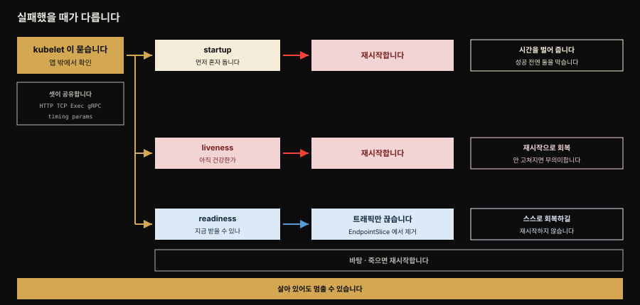
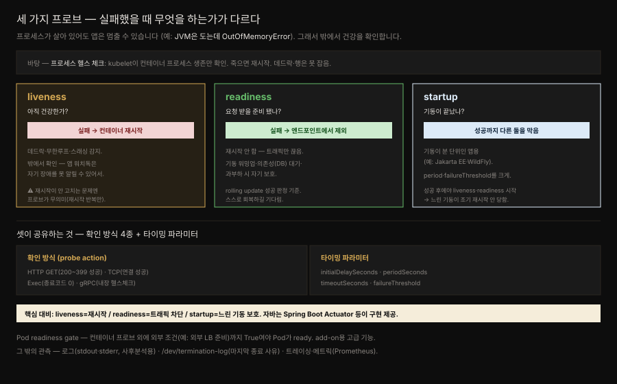

# Health Probe — 앱이 자기 건강을 플랫폼에 알리기

> 『Kubernetes Patterns』 4장 정독. **Health Probe**는 앱이 자기 건강 상태를 Kubernetes에 알리는 방법입니다. 완전 자동화되려면 클라우드 네이티브 앱은 **관측 가능(observable)** 해야 합니다. 플랫폼이 앱이 떠 있는지, 요청을 받을 준비가 됐는지 추론할 수 있어야 한다는 뜻입니다. 이 관측이 Pod 생애주기 관리와 트래픽 라우팅을 좌우합니다.



이 장 전체가 이 그림 한 장에 들어갑니다. 맨 아래 띠가 출발점입니다. 프로세스가 죽으면 재시작한다는 바탕 체크는 늘 깔려 있지만, 프로세스가 살아 있어도 앱은 멈출 수 있어서 그 위에 세 프로브가 필요합니다.

가운데 세 줄이 이 장의 핵심입니다. 세 프로브는 **확인 방식과 타이밍 파라미터를 똑같이 공유**하고, 오직 **실패했을 때 무엇을 하느냐**로 갈립니다. startup과 liveness는 컨테이너를 재시작하지만 readiness는 재시작하지 않고 트래픽만 끊습니다. 오른쪽 열이 각각의 의도로, 같은 실패에 왜 다른 조치를 붙였는지를 설명합니다.


## 핵심 요약

> 프로세스가 살아 있다고 앱이 건강한 것은 아닙니다 — Java 앱이 `OutOfMemoryError`를 던져도 JVM 프로세스는 돌 수 있고 무한 루프·데드락·스래싱에 빠져도 프로세스는 살아 있습니다. 그래서 Kubernetes는 앱 내부를 이해하려는 게 아니라, 앱이 **기대대로 기능하고 소비자에게 서비스할 수 있는지**를 밖에서 확인합니다. 그 수단이 세 프로브 — liveness·readiness·startup — 이고 셋의 결정적 차이는 **실패했을 때 무엇을 하느냐**입니다.

실패 실행이 갈립니다. **liveness** 실패는 컨테이너를 **재시작**하고 **readiness** 실패는 재시작 대신 **Service 엔드포인트에서 빼** 트래픽을 끊습니다. **startup**은 기동이 오래 걸리는 앱을 위해 먼저 돌아, 성공할 때까지 liveness·readiness를 막아 조기 재시작을 방지합니다. 세 프로브 모두 HTTP·TCP·Exec·gRPC 네 방식과 같은 타이밍 파라미터를 공유합니다.

장애 대응의 초점은 "장애를 피하는 것"에서 "장애를 감지하고 회복하는 것"으로 옮겨졌습니다. 버그 없는 코드는 불가능하고 분산 환경에서 실패 확률은 더 커지기 때문입니다. 프로브는 그 감지·회복 자동화의 근본 빌딩 블록입니다.


## 학습 목표

> 이 편을 읽고 나면 다음을 설명할 수 있습니다.

- 프로세스 헬스 체크의 한계와, 그 위에 liveness·readiness·startup 프로브가 필요한 이유를 설명합니다.
- 세 프로브의 실패 시 대응이 재시작·트래픽 차단·조기 재시작 방지로 어떻게 갈리는지 구분합니다.
- 프로브의 확인 방식 네 가지와 타이밍 파라미터 다섯 가지의 역할, 그리고 각 기본값을 압니다.
- liveness가 앱 밖에서 수행돼야 하는 이유와, readiness가 rolling update 성공 판정 기준인 이유를 설명합니다.
- Pod readiness gate와 그 밖의 관측 수단이 각각 어느 자리에 놓이는지 압니다.


## 본문 정리

### 문제 — 프로세스가 살아도 앱은 멈출 수 있다

Kubernetes는 컨테이너 프로세스 상태를 정기 확인하고 문제가 있으면 재시작합니다. 하지만 프로세스 상태 확인만으로는 앱 건강을 판단하기에 부족합니다. 많은 경우 앱은 행(hang)에 빠졌는데 프로세스는 멀쩡히 돕니다 — Java 앱이 `OutOfMemoryError`를 던지고도 JVM이 도는 경우, 무한 루프·데드락·스래싱(캐시·힙·프로세스)으로 얼어붙는 경우입니다. 이런 상황을 잡으려면 앱 내부 동작을 이해하는 게 아니라, 앱이 기대대로 기능하는지를 밖에서 확인할 신뢰할 방법이 필요합니다.

### Process Health Check — 바탕

프로세스 헬스 체크는 kubelet이 컨테이너 프로세스에 계속 수행하는 가장 단순한 체크입니다. 프로세스가 안 돌면 컨테이너를 재시작합니다. 다른 체크가 없어도 이 일반 체크로 앱이 조금 더 견고해집니다. 앱이 모든 종류의 장애를 감지해 스스로 종료할 수 있다면 프로세스 헬스 체크만으로 충분하지만 대부분은 그렇지 않아 다른 체크가 필요합니다.

### Liveness Probe — 실패하면 재시작

앱이 데드락에 빠지면 프로세스 헬스 체크 관점에서는 여전히 건강합니다. 프로세스가 죽은 것은 아니기 때문입니다. 이런 상황과 그 밖에 앱의 비즈니스 로직이 정의하는 장애를 잡으려고 Kubernetes는 **liveness 프로브**를 둡니다. kubelet 에이전트가 컨테이너에 "아직 건강하냐"고 정기적으로 묻는 체크입니다.

**이 체크는 앱 안이 아니라 밖에서 수행돼야** 합니다. 어떤 장애는 앱의 워치독이 자기 장애를 보고하는 것 자체를 막아 버리기 때문입니다. 스스로 신고하게 두면 정작 신고가 필요한 순간에 신고가 오지 않습니다.

교정 조치는 프로세스 헬스 체크와 같아서, 실패가 감지되면 컨테이너를 재시작합니다. 다만 무엇으로 건강을 확인할지는 훨씬 유연합니다.

| 확인 방식 | 성공 기준 |
|-----------|----------|
| HTTP probe | 컨테이너 IP로 HTTP GET을 보내 **200 이상 400 미만** 응답 코드를 받습니다 |
| TCP Socket probe | TCP 연결이 성립하면 성공으로 봅니다 |
| Exec probe | 컨테이너의 사용자·커널 네임스페이스에서 임의 명령을 실행해 종료 코드 0을 받습니다 |
| gRPC probe | gRPC에 내장된 헬스 체크 지원을 활용합니다 |

프로브 액션과 별개로, 다음 파라미터가 체크 동작을 조율합니다. 기본값은 Kubernetes 공식 문서 기준입니다.

| 파라미터 | 무엇을 정하는가 | 기본값 |
|---------|--------------|-------|
| `initialDelaySeconds` | 컨테이너 기동 후 첫 프로브까지 기다리는 초 | 0 |
| `periodSeconds` | 체크와 체크 사이의 간격 | 10 |
| `timeoutSeconds` | 프로브가 실패로 간주되기 전 응답을 기다리는 최대 시간 | 1 |
| `failureThreshold` | 연속 몇 번 실패해야 unhealthy로 판정할지 | 3 |
| `successThreshold` | 실패 후 성공으로 되돌리는 데 필요한 연속 성공 횟수 | 1 |

원서는 앞의 네 가지만 듭니다. `successThreshold`를 함께 적은 이유는 readiness에서 이 값이 실제로 의미를 갖기 때문입니다. liveness·startup 프로브에서는 이 값이 반드시 1이어야 하지만, readiness에서는 값을 올려 "몇 번 연속 성공해야 트래픽을 다시 받을지"를 정할 수 있습니다.

`timeoutSeconds` 기본값이 **1초**라는 점은 실무에서 자주 발목을 잡습니다. 워밍업 중인 JVM 앱이나 GC가 도는 순간에는 1초 안에 응답하지 못하는 일이 흔해, 기본값 그대로 두면 건강한 컨테이너가 실패 판정을 받습니다.

```yaml
livenessProbe:
  httpGet:
    path: /actuator/health      # health-check 엔드포인트로 HTTP 프로브
    port: 8080
  initialDelaySeconds: 30       # 워밍업 위해 첫 체크까지 30초 대기
```

앱 성격에 맞는 방식을 고르되 명심할 것 — 헬스 체크 실패의 결과는 컨테이너 재시작입니다. **재시작이 안 고치는 문제라면 실패하는 헬스 체크는 무의미**합니다. Kubernetes가 근본 문제를 못 고친 채 재시작만 반복하기 때문입니다.

### Readiness Probe — 실패하면 트래픽 차단

liveness는 unhealthy 컨테이너를 죽이고 새것으로 바꿔 앱을 건강하게 유지합니다. 그런데 컨테이너가 건강하지 않을 때 재시작이 도움이 되지 않는 경우가 있습니다. 대표적인 셋은 이렇습니다.

- 아직 기동 중이라 어떤 요청도 처리할 준비가 안 된 컨테이너
- DB 같은 의존성이 가용해지기를 기다리는 앱
- 과부하로 지연이 커져, 부하가 줄 때까지 잠시 자신을 추가 부하로부터 보호하고 싶은 컨테이너

셋 다 재시작한다고 나아지지 않습니다. 오히려 기동 중이던 컨테이너를 죽이면 처음부터 다시 시작해야 하므로 더 나빠집니다.

이럴 때 **readiness 프로브**를 씁니다. 확인 방식과 타이밍 옵션은 liveness와 똑같지만 **교정 조치가 다릅니다.** 컨테이너를 재시작하는 대신, 실패한 readiness는 그 Pod의 IP를 **Service의 EndpointSlice에서 제거해** 새 트래픽이 흘러오지 않게 합니다.

readiness는 컨테이너가 준비됐음을 신호하는 수단이라, Service 요청을 맞기 전에 워밍업할 시간을 벌어 줍니다. liveness와 마찬가지로 정기적으로 수행되므로 기동 이후 단계에서도 컨테이너를 트래픽으로부터 보호하는 데 쓸 수 있습니다.

```yaml
readinessProbe:
  exec:
    command: [ "stat", "/var/run/random-generator-ready" ]
    # 앱이 준비되면 만드는 파일의 존재를 확인. 없으면 stat이 에러 → readiness 실패
```

프로세스·liveness 체크가 재시작으로 회복을 노린다면, readiness 체크는 앱에 **시간을 벌어 주고 스스로 회복하길** 기대합니다. Kubernetes는 컨테이너가 종료 중일 때(SIGTERM을 받은 뒤) readiness가 여전히 통과해도 새 요청을 안 보내려 합니다.

> **Custom Pod Readiness Gate.** readiness 프로브는 컨테이너 단위로 동작하고 모든 컨테이너가 프로브를 통과하면 Pod가 ready로 간주됩니다. 그런데 외부 로드밸런서(예: AWS LoadBalancer)까지 재설정·준비돼야 하는 경우처럼 이걸로 부족할 때가 있습니다. 이때 Pod 스펙의 `readinessGates`로 추가 조건(예: `k8spatterns.io/load-balancer-ready`)을 걸 수 있습니다. 이 조건은 기본 False이고 컨트롤러(27장) 같은 외부가 True로 바꿉니다. 모든 컨테이너 프로브 통과 **그리고** readiness gate 조건이 True여야 Pod가 ready입니다. 이는 엔드유저가 아니라 add-on이 쓰는 고급 기능입니다.

liveness와 readiness가 같은 체크를 하는 경우도 많지만 readiness의 존재가 컨테이너에 기동 시간을 줍니다. **readiness를 통과해야만 Deployment가 성공으로 간주**돼, 예컨대 rolling update에서 낡은 버전 Pod를 종료할 수 있습니다.

### Startup Probe — 느린 기동을 보호

초기화가 아주 오래 걸리는 앱은 startup이 끝나기 전에 liveness 실패로 재시작될 수 있습니다. liveness의 간격·재시도·초기 지연을 늘려 대응할 수도 있지만 그 타이밍이 **기동 후 단계에도 적용**돼 치명적 오류 시 빠른 재시작을 막는 부작용이 있습니다.



위아래 두 줄이 같은 문제에 대한 두 가지 답입니다. 위쪽은 startup 프로브를 둔 경우로, 점선 경계 왼쪽에서는 startup만 홀로 돌고 나머지 둘은 아예 시작하지 않습니다. 경계를 넘는 순간 liveness와 readiness가 촘촘한 간격으로 돌기 시작합니다. 아래쪽은 startup 없이 liveness 타이밍만 늘린 경우인데, 느슨함이 오른쪽 끝까지 이어지는 것이 문제입니다. 기동 구간은 넘겼지만 그 대가로 기동 후 반응 속도를 잃었습니다.

기동이 분 단위인 앱(예: Jakarta EE 애플리케이션 서버)을 위해 Kubernetes는 **startup 프로브**를 제공합니다. liveness와 같은 형식이지만 프로브 액션·타이밍에 다른 값을 허용합니다. `periodSeconds`·`failureThreshold`를 훨씬 크게 잡아 긴 기동을 반영합니다. **liveness·readiness는 startup이 성공을 보고한 뒤에만 호출**되고 startup이 설정된 실패 임계 안에 성공 못 하면 컨테이너가 재시작됩니다.

```yaml
containers:
- image: quay.io/wildfly/wildfly       # 기동에 시간이 걸리는 JBoss WildFly Jakarta EE 서버
  name: wildfly
  startupProbe:
    exec:
      command: [ "stat", "/opt/jboss/wildfly/standalone/tmp/startup-marker" ]
    initialDelaySeconds: 60
    periodSeconds: 60
    failureThreshold: 15              # 15분(첫 60초 대기 + 60초 간격 최대 15회) 안에 기동 못 하면 재시작
  livenessProbe:
    httpGet:
      path: /health
      port: 9990
    periodSeconds: 10
    failureThreshold: 3              # 훨씬 작게 — 20초 안(10초×3) 연속 실패면 재시작
```

> **프로브 단위 종료 유예.** 원서에는 없지만 공식 문서가 제공하는 필드가 하나 더 있습니다. 프로브 안에 `terminationGracePeriodSeconds`를 두면 **그 프로브 실패로 컨테이너가 죽을 때만** 적용되는 유예 시간을 Pod 수준 값과 다르게 줄 수 있습니다. 평소 종료에는 긴 유예가 필요하지만 liveness 실패처럼 이미 앱이 굳은 상황에서는 빨리 죽여야 할 때 쓰입니다.
>
> 두 가지 단서가 붙습니다. 이 필드는 **liveness·startup 프로브에만** 둘 수 있고 readiness에는 두지 못합니다(readiness 실패는 애초에 컨테이너를 죽이지 않으니 당연합니다). 그리고 `ProbeTerminationGracePeriod` 피처 게이트에 걸린 beta 기능이라, 클러스터에 따라 무시될 수 있습니다. 종료 유예 자체는 다음 5장 Managed Lifecycle의 주제입니다.

liveness·readiness·startup 프로브는 클라우드 네이티브 앱 자동화의 근본 빌딩 블록입니다. Java 진영에서는 **Quarkus SmallRye Health, Spring Boot Actuator, WildFly Swarm health check, Apache Karaf health check, MicroProfile 스펙**이 헬스 프로브 구현을 제공합니다.

### Discussion — 프로브 너머의 관측 수단

완전 자동화되려면 앱은 플랫폼이 건강을 읽고 해석해 필요하면 교정 조치를 할 수 있도록 **관측 가능**해야 합니다. 헬스 체크는 배포·자가치유·스케일링 자동화의 근본 역할을 하지만 앱이 건강 가시성을 주는 다른 수단도 있습니다.

- **로그**: 중요한 이벤트를 stdout·stderr로 남겨 중앙에 수집합니다. 자동 조치보다는 알림·조사에 쓰이고 특히 사후분석(postmortem)에 유용합니다.
- **`/dev/termination-log`**: 컨테이너가 영구히 사라지기 전 마지막 종료 사유를 남기는 곳입니다. (또는 `terminationMessagePolicy`를 `FallbackToLogsOnError`로 바꿔 종료 시 로그 마지막 줄을 Pod 상태 메시지로 쓸 수 있습니다.)
- **트레이싱·메트릭**: OpenTracing·Prometheus 같은 라이브러리와 통합해 상태를 더 드러냅니다.

컨테이너를 불투명한 시스템으로 다루되, 플랫폼이 최선으로 관측·관리하도록 필요한 API는 다 구현하라 — 최소한 liveness·readiness는 반드시. 다음 5장 Managed Lifecycle은 반대 방향의 소통, 즉 앱이 중요한 Pod 생애주기 이벤트를 어떻게 통보받는지를 다룹니다.


## 심화 학습

> 본문(원서 4장) 밖에서 보강한 내용입니다. 출처를 링크로 남깁니다.

### Spring Boot Actuator를 세 프로브에 매핑하기

이 장의 liveness 예제가 `/actuator/health`를 때리는 것은 우연이 아닙니다. 원서가 헬스 프로브 구현을 제공하는 프레임워크로 Spring Boot Actuator를 직접 지목하기 때문입니다.

다만 `/actuator/health` 하나를 liveness와 readiness에 같이 걸면 문제가 생깁니다. 이 통합 엔드포인트는 DB나 메시지 브로커 같은 외부 의존성 상태까지 집계합니다. 그것을 liveness에 걸면 DB가 잠깐 끊겼을 때 앱 자체는 멀쩡한데도 liveness가 실패해 **컨테이너가 재시작**됩니다. 재시작은 DB를 고치지 못하므로 무의미한 재시작이 반복됩니다. 이 장이 "재시작이 안 고치는 문제라면 실패하는 헬스 체크는 무의미하다"고 경고한 바로 그 상황입니다.

Spring Boot 2.3부터는 이를 위해 프로브가 분리돼 `/actuator/health/liveness`와 `/actuator/health/readiness`가 생겼습니다. 쿠버네티스 환경이 감지되면 이 두 그룹은 **자동으로 켜집니다.** 공식 문서 표현은 *"These health groups are automatically enabled"* 이고, `management.endpoint.health.probes.enabled` 는 켜는 스위치가 아니라 **끄는** 스위치입니다.

여기서 흔한 오해를 하나 짚어야 합니다. **두 그룹 모두 기본적으로는 외부 의존성을 보지 않습니다.** 공식 문서가 못박습니다 — *"By default, Spring Boot does not add other health indicators to these groups."* liveness 그룹에는 `LivenessState`, readiness 그룹에는 `ReadinessState`만 들어 있고 둘 다 `ApplicationAvailability` 기반의 **앱 내부 상태**입니다. DB 상태는 어느 쪽에도 자동으로 들어가지 않습니다.

그래서 DB 장애 때 트래픽을 끊고 싶다면 **직접 넣어야** 합니다.

```properties
management.endpoint.health.group.readiness.include=readinessState,db
```

규칙은 이렇게 정리됩니다. **외부 의존성은 readiness에만 넣고 liveness에는 절대 넣지 않습니다.** DB 장애 때 옳은 대응은 트래픽을 끊는 것이지 프로세스를 죽이는 것이 아니기 때문입니다. 다만 무엇을 넣을지는 공식 문서도 *"a judgement call"* 이라고 표현합니다. 그 의존성이 끊겼을 때 **이 인스턴스를 로드밸런서에서 빼는 것이 옳은가**를 기준으로 고르면 됩니다. 앱이 없이는 아무 일도 못 하는 주 DB라면 넣을 만하고, 없어도 기능 일부만 저하되는 외부 API라면 넣지 않는 편이 낫습니다.

startup 프로브는 Spring Boot에서 늘 필요하지는 않습니다. 공식 문서는 *"the startupProbe is not necessarily needed here as the readinessProbe fails until all startup tasks are done"* 이라고 안내합니다. readiness가 기동이 끝날 때까지 실패하므로 그동안 트래픽이 오지 않기 때문입니다. 기동이 오래 걸리는 앱이라면 문서 권고대로 **liveness HTTP 프로브를 그대로 가리키는 startup 프로브**를 두어, 기동 중에 Kubernetes가 앱을 죽이지 않게 합니다.

### liveness 프로브를 남용하면 장애가 증폭된다

이 장의 "재시작이 안 고치는 문제엔 프로브가 무의미하다"는 경고에는 더 위험한 이면이 있습니다. liveness 프로브를 공격적으로 거는 경우입니다. 짧은 `timeoutSeconds`와 낮은 `failureThreshold`를 걸면, GC 스톱더월드나 순간 부하 스파이크로 응답이 잠깐 늦어질 때 kubelet이 멀쩡한 컨테이너를 죽입니다.

앞서 본 `timeoutSeconds` 기본값 1초가 여기서 특히 위험합니다. 부하가 몰린 상황에서 이런 재시작이 한 번 시작되면 연쇄로 번질 수 있는데, 그 경로를 정확히 짚어 둘 필요가 있습니다.

liveness 실패는 **컨테이너만 그 자리에서 재시작**합니다. Pod는 살아 있고 IP도 그대로라 EndpointSlice에서 자동으로 빠지지 않습니다. 그래서 재시작 중인 그 Pod로 트래픽이 계속 흘러 실패하거나, readiness도 함께 걸려 있어야 비로소 빠집니다. 어느 쪽이든 남은 Pod가 더 많은 부하를 떠안고, 그것들마저 짧은 timeout을 놓쳐 재시작되는 **cascading restart**로 번집니다. 장애를 고치려던 장치가 장애를 키우는 셈입니다.

그래서 실무 권장은 두 가지입니다. liveness는 넉넉한 timeout과 높은 threshold로 **보수적으로** 걸고, "지금 요청을 받을 수 없는 상태"는 liveness가 아니라 readiness로 다룹니다.

> 프로브 개념 메커니즘(probe 종류별 동작·타이밍 상호작용·실습)은 형제 정독본 [liveness·startup probe로 컨테이너 건강 유지](../kubernetes-in-action/06-02.liveness%C2%B7startup%20probe%EB%A1%9C%20%EC%BB%A8%ED%85%8C%EC%9D%B4%EB%84%88%20%EA%B1%B4%EA%B0%95%20%EC%9C%A0%EC%A7%80.md)에 상세합니다.

- 출처: [Spring Boot — Kubernetes Probes (공식 문서)](https://docs.spring.io/spring-boot/reference/actuator/endpoints.html#actuator.endpoints.kubernetes-probes) (2026-07-12 조회)
- 출처: [Configure Liveness, Readiness and Startup Probes (Kubernetes 공식)](https://kubernetes.io/docs/tasks/configure-pod-container/configure-liveness-readiness-startup-probes/)


## 능동 회상

> 먼저 스스로 답해 본 뒤 아래 정답 절에서 맞춰 봅니다. 정답은 이 절 다음에 번호 순서대로 있습니다.

1. 프로세스 상태 확인만으로 앱 건강을 판단할 수 없는 이유는 무엇인가요? 원서가 든 사례를 들어 보세요.
2. Kubernetes 가 프로브로 확인하려는 것은 무엇인가요? 확인하려 하지 *않는* 것은 무엇인가요?
3. 장애 대응의 초점이 어떻게 바뀌었나요? 그 배경은 무엇인가요?
4. 프로세스 헬스 체크는 누가 무엇을 확인하며 실패하면 어떻게 되나요?
5. 프로세스 헬스 체크만으로 충분한 경우는 언제인가요?
6. liveness 프로브가 앱 안이 아니라 밖에서 수행돼야 하는 이유는 무엇인가요?
7. 프로브의 확인 방식 네 가지와 각각의 성공 기준을 말해 보세요.
8. 타이밍 파라미터 다섯 가지는 각각 무엇을 정하며 기본값은 얼마인가요?
9. `successThreshold` 는 어떤 프로브에서만 1보다 크게 둘 수 있나요? 왜 그런가요?
10. `timeoutSeconds` 기본값이 실무에서 문제가 되는 이유는 무엇인가요?
11. 헬스 체크가 실패하면 벌어지는 일은 무엇이며, 그래서 어떤 경우에 프로브가 무의미해지나요?
12. 재시작이 도움이 되지 않는 상황 세 가지는 무엇인가요?
13. readiness 프로브의 교정 조치는 liveness 와 어떻게 다른가요? 구체적으로 무엇이 제거되나요?
14. liveness 와 readiness 는 각각 무엇으로 회복을 기대하나요?
15. 컨테이너가 SIGTERM 을 받은 뒤 readiness 가 여전히 통과하면 어떻게 되나요?
16. Pod readiness gate 는 무엇을 해결하나요? Pod 가 ready 가 되는 조건은 무엇인가요?
17. readiness 프로브의 존재가 rolling update 에서 어떤 역할을 하나요?
18. 기동이 오래 걸리는 앱에서 liveness 타이밍만 늘리는 대응의 부작용은 무엇인가요?
19. startup 프로브의 타이밍은 liveness 와 비교해 어떻게 잡나요? 성공·실패하면 각각 어떻게 되나요?
20. 프로브 밖에서 앱이 건강 가시성을 주는 수단 세 가지는 무엇인가요?
21. `/dev/termination-log` 는 무엇을 위한 곳인가요? 대안 설정은 무엇인가요?
22. Spring Boot 에서 `/actuator/health` 하나를 두 프로브에 같이 걸면 왜 안 되나요?
23. cascading restart 는 어떻게 일어나나요? 이를 막는 실무 권장 두 가지는 무엇인가요?


## 정답

> 위 회상 질문의 답입니다. 번호가 대응합니다.

**1.** 앱이 행(hang)에 빠졌는데도 프로세스는 멀쩡히 도는 경우가 많기 때문입니다. 원서는 Java 앱이 `OutOfMemoryError`를 던지고도 JVM 프로세스가 계속 도는 경우를 듭니다. 그 밖에 무한 루프, 데드락, 캐시·힙·프로세스 스래싱으로 얼어붙는 경우도 마찬가지입니다.

**2.** **앱이 기대대로 기능하며 소비자에게 서비스할 수 있는지**를 확인합니다. 반대로 **앱이 내부적으로 어떻게 동작하는지를 이해하려 하지는 않습니다.** 컨테이너를 불투명한 시스템으로 두되 밖에서 관측 가능하게 만드는 것이 이 패턴의 태도입니다.

**3.** 장애를 **피하는 것**에서 장애를 **감지하고 회복하는 것**으로 옮겨졌습니다. 버그 없는 코드를 쓰는 것이 불가능하다는 사실을 업계가 받아들였고, 분산 환경에서는 실패 확률이 더 커지기 때문입니다.

**4.** kubelet 이 컨테이너 프로세스에 대해 계속 수행하는 가장 단순한 체크입니다. 컨테이너 프로세스가 돌지 않으면 Pod 가 배정된 노드에서 컨테이너가 재시작됩니다.

**5.** 앱이 **모든 종류의 장애를 스스로 감지해 자신을 종료할 수 있는** 경우입니다. 다만 대부분은 그렇지 못해 다른 체크가 필요합니다.

**6.** 어떤 장애는 **앱의 워치독이 자기 장애를 보고하는 것 자체를 막기** 때문입니다. 스스로 신고하게 두면 정작 신고가 필요한 순간에 신고가 오지 않습니다.

**7.** HTTP probe 는 컨테이너 IP 로 HTTP GET 을 보내 **200 이상 400 미만** 응답 코드를 기대합니다. TCP Socket probe 는 TCP 연결 성립을 성공으로 봅니다. Exec probe 는 컨테이너의 사용자·커널 네임스페이스에서 임의 명령을 실행해 종료 코드 0 을 기대합니다. gRPC probe 는 gRPC 에 내장된 헬스 체크 지원을 활용합니다.

**8.** `initialDelaySeconds` 는 기동 후 첫 프로브까지의 대기이고 기본 0 입니다. `periodSeconds` 는 체크 간격으로 기본 10 초입니다. `timeoutSeconds` 는 응답 대기 최대 시간으로 기본 1 초입니다. `failureThreshold` 는 unhealthy 판정에 필요한 연속 실패 횟수로 기본 3 입니다. `successThreshold` 는 실패 후 성공 복귀에 필요한 연속 성공 횟수로 기본 1 입니다.

**9.** **readiness 프로브에서만** 1보다 크게 둘 수 있습니다. 공식 API 레퍼런스가 "Must be 1 for liveness and startup Probes" 로 못박고 있습니다. liveness·startup 의 결과는 재시작이라 "여러 번 연속 성공해야 살아난 것으로 친다"는 개념이 성립하지 않지만, readiness 는 트래픽을 다시 받을지 말지의 판단이라 신중하게 여러 번 확인할 여지가 있습니다.

**10.** 기본값이 **1초**로 짧기 때문입니다. 워밍업 중인 JVM 앱이나 GC 가 도는 순간에는 1초 안에 응답하지 못하는 일이 흔해, 기본값을 그대로 두면 건강한 컨테이너가 실패 판정을 받습니다.

**11.** 컨테이너가 **재시작**됩니다. 따라서 **재시작으로 고쳐지지 않는 문제**라면 실패하는 헬스 체크는 무의미합니다. Kubernetes 가 근본 원인을 고치지 못한 채 재시작만 반복하기 때문입니다.

**12.** 아직 기동 중이라 요청을 처리할 준비가 안 된 컨테이너, DB 같은 의존성이 가용해지기를 기다리는 앱, 과부하로 지연이 커져 잠시 자신을 추가 부하로부터 보호하고 싶은 컨테이너입니다.

**13.** 컨테이너를 재시작하지 않습니다. 대신 그 Pod 의 IP 가 **Service 의 EndpointSlice 에서 제거**되어 새 트래픽이 흘러오지 않습니다.

**14.** 프로세스 헬스 체크와 liveness 는 **재시작으로** 장애에서 회복하려 합니다. readiness 는 앱에 **시간을 벌어 주고 스스로 회복하기를** 기대합니다.

**15.** readiness 통과 여부와 **무관하게** Kubernetes 는 종료 중인 컨테이너에 새 요청이 가지 않도록 막으려 합니다.

**16.** readiness 프로브는 컨테이너 단위로만 동작하는데, 외부 로드밸런서(예: AWS LoadBalancer)까지 재설정·준비돼야 하는 경우에는 그것만으로 부족합니다. Pod 스펙의 `readinessGates` 로 추가 조건을 겁니다. 조건은 기본 False 이고 컨트롤러(27장) 같은 외부가 True 로 바꿉니다. **모든 컨테이너의 readiness 프로브 통과 그리고 readiness gate 조건이 모두 True** 여야 Pod 가 ready 입니다. 엔드유저가 아니라 add-on 이 쓰는 고급 기능입니다.

**17.** **readiness 를 통과해야만 Deployment 가 성공으로 간주**됩니다. 그래야 rolling update 에서 낡은 버전 Pod 를 종료할 수 있습니다. 3장 무중단 배포가 이 전제 위에 서 있습니다.

**18.** liveness 의 간격·재시도·초기 지연을 늘려 대응할 수는 있지만, 그 느슨한 타이밍이 **기동 후 단계에도 그대로 적용**됩니다. 그래서 치명적 오류가 났을 때 빠르게 재시작하지 못합니다.

**19.** `periodSeconds` 와 `failureThreshold` 를 liveness 보다 **훨씬 크게** 잡아 긴 기동을 반영합니다. **liveness·readiness 는 startup 이 성공을 보고한 뒤에만 호출**됩니다. startup 이 설정된 실패 임계 안에 성공하지 못하면 컨테이너가 재시작됩니다.

**20.** 셋입니다.

- **로그** — 중요한 이벤트를 stdout·stderr 로 남기고 중앙에 모읍니다. 자동 조치보다는 알림과 사후분석(postmortem)에 쓰입니다.
- **`/dev/termination-log`** — 컨테이너가 사라지기 전 종료 사유를 남깁니다.
- **트레이싱·메트릭** — OpenTracing·Prometheus 같은 라이브러리와 통합해 상태를 더 드러냅니다.

**21.** 컨테이너가 영구히 사라지기 전 **마지막 종료 사유를 남기는** 곳입니다. 대안으로 Pod 의 `terminationMessagePolicy` 를 `FallbackToLogsOnError` 로 바꾸면 종료 시 로그의 마지막 줄이 Pod 상태 메시지로 쓰입니다.

**22.** 통합 엔드포인트인 `/actuator/health` 는 DB·메시지 브로커 같은 **외부 의존성 상태까지 집계**하기 때문입니다. 이것을 liveness 에 걸면 DB 가 잠깐 끊겼을 때 앱 자체는 멀쩡한데도 liveness 가 실패해 컨테이너가 재시작되고, 재시작은 DB 를 고치지 못하므로 무의미한 재시작이 반복됩니다.

그래서 `/actuator/health/liveness` 와 `/actuator/health/readiness` 를 나눠 씁니다. 주의할 점은 이 두 그룹이 **기본적으로는 외부 의존성을 전혀 보지 않는다**는 것입니다. DB 를 readiness 에 반영하려면 `management.endpoint.health.group.readiness.include` 로 직접 넣어야 하고, liveness 에는 넣지 않습니다.

**23.** liveness 를 공격적으로(짧은 timeout·낮은 failureThreshold) 걸면 GC 스톱더월드나 부하 스파이크로 응답이 잠깐 늦어질 때 멀쩡한 컨테이너가 죽습니다. 죽은 Pod 의 몫이 남은 Pod 로 쏠리면 그것들마저 프로브를 놓쳐 연쇄적으로 재시작됩니다. 막는 방법은 liveness 를 **넉넉한 timeout·높은 threshold 로 보수적으로** 거는 것과, "지금 요청을 받을 수 없는 상태"를 liveness 가 아니라 **readiness 로** 다루는 것입니다.


## 실무 적용

- **프로브를 실패 대응으로 골라 건다.** "재시작하면 낫는 문제"는 liveness, "잠깐 트래픽만 끊으면 되는 문제"는 readiness, "기동이 오래 걸리는 앱"은 startup입니다.
- **외부 의존성은 readiness에만 건다.** DB·브로커 상태를 liveness에 걸면 의존성 장애가 무의미한 재시작 루프를 부릅니다. Spring Boot의 liveness·readiness 그룹은 기본적으로 외부 의존성을 보지 않으므로, 필요한 것만 `management.endpoint.health.group.readiness.include`로 직접 넣습니다.
- **liveness는 보수적으로.** 넉넉한 `timeoutSeconds`·높은 `failureThreshold`로 걸어 GC·부하 스파이크에 건강한 컨테이너가 죽지 않게 합니다.
- **느린 기동 앱엔 startup 프로브.** liveness 타이밍을 늘려 우회하지 말고 startup 프로브로 기동 구간만 별도 보호해 기동 후 빠른 재시작 능력을 지킵니다.
- **rolling update 전에 readiness를 확인한다.** readiness 통과가 Deployment 성공 판정 기준이므로, 3장 무중단 배포의 전제입니다.
- **프로브 밖의 관측도 갖춘다.** stdout/stderr 로그 중앙 수집, `/dev/termination-log`로 종료 사유, Prometheus 메트릭으로 가시성을 보강합니다.


## 체크리스트

- [ ] 프로세스 헬스 체크만으로 왜 부족한지를 JVM 사례를 들어 설명할 수 있습니다.
- [ ] liveness·readiness·startup의 실패 대응 차이를 구분할 수 있습니다.
- [ ] 프로브 확인 방식 네 가지와 타이밍 파라미터 다섯 가지, 그리고 각 기본값을 압니다.
- [ ] liveness가 왜 앱 밖에서 수행돼야 하는지 설명할 수 있습니다.
- [ ] readiness 통과가 왜 rolling update 성공 판정 기준인지 압니다.
- [ ] Spring Boot에서 외부 의존성을 liveness에 걸면 왜 안 되는지 설명할 수 있습니다.
- [ ] startup 프로브가 liveness 타이밍 조정보다 나은 이유를 압니다.


## 면접 관점

**Q. liveness와 readiness 프로브는 무엇이 다릅니까?**
확인 방식과 타이밍 옵션은 같지만 실패 대응이 다릅니다. liveness 실패는 컨테이너를 재시작하고 readiness 실패는 재시작하지 않고 Service 엔드포인트에서 빼 새 트래픽을 안 받게 합니다. liveness는 재시작으로 회복을 노리고 readiness는 앱에 시간을 벌어 주며 스스로 회복하길 기다립니다.

**Q. 프로세스가 살아 있는데도 헬스 체크가 필요한 이유는?**
프로세스 생존이 앱 건강을 뜻하지 않기 때문입니다. Java 앱이 OutOfMemoryError를 던져도 JVM은 돌고 데드락·무한 루프·스래싱에 빠져도 프로세스는 살아 있습니다. Kubernetes는 앱 내부를 이해하지 않고 밖에서 "기대대로 기능하며 요청을 처리할 수 있는가"를 프로브로 확인합니다.

**Q. Spring Boot에서 `/actuator/health` 하나를 liveness·readiness에 같이 걸면 무엇이 문제입니까?**
통합 엔드포인트인 `/actuator/health`는 DB·브로커 같은 외부 의존성 상태까지 집계합니다. 이걸 liveness에 걸면 DB가 잠깐 끊겼을 때 앱은 멀쩡한데도 liveness가 실패해 컨테이너가 재시작되고, 재시작은 DB를 못 고치므로 무의미한 재시작이 반복됩니다.

그래서 `/actuator/health/liveness`와 `/actuator/health/readiness`를 나눠 씁니다. 다만 이 두 그룹은 기본적으로 외부 의존성을 보지 않으므로, DB를 readiness에 반영하려면 `management.endpoint.health.group.readiness.include`로 직접 넣어야 합니다.

**Q. startup 프로브는 왜 필요하고 liveness 타이밍을 늘리는 것과 무엇이 다릅니까?**
기동이 분 단위인 앱은 startup 완료 전에 liveness 실패로 재시작될 수 있습니다. liveness 타이밍을 늘려 우회하면 그 느슨한 값이 기동 후에도 적용돼 치명적 오류 시 빠른 재시작을 막습니다. startup 프로브는 큰 failureThreshold로 기동 구간만 별도로 보호하고 성공한 뒤에야 liveness·readiness가 시작되므로 기동 후에는 촘촘한 재시작 능력을 유지합니다.


## 참고 자료

- 원서: 《Kubernetes Patterns, Second Edition》(Bilgin Ibryam·Roland Huß, O'Reilly) Ch4. Health Probe
- 이 책의 MOC: [Kubernetes Patterns 정독 인덱스](./README.md) · 앞 편: [Declarative Deployment](./03-01.Declarative%20Deployment%20%E2%80%94%20%EC%97%85%EA%B7%B8%EB%A0%88%EC%9D%B4%EB%93%9C%C2%B7%EB%A1%A4%EB%B0%B1%EC%9D%84%20%EC%84%A0%EC%96%B8%EC%9C%BC%EB%A1%9C.md)
- 형제 정독본: [liveness·startup probe로 컨테이너 건강 유지](../kubernetes-in-action/06-02.liveness%C2%B7startup%20probe%EB%A1%9C%20%EC%BB%A8%ED%85%8C%EC%9D%B4%EB%84%88%20%EA%B1%B4%EA%B0%95%20%EC%9C%A0%EC%A7%80.md)
- 개념 노트: [핵심 워크로드](../../kubernetes/01_workloads/01-01.%ED%95%B5%EC%8B%AC%20%EC%9B%8C%ED%81%AC%EB%A1%9C%EB%93%9C.md)
- [Configure Liveness, Readiness and Startup Probes (Kubernetes 공식)](https://kubernetes.io/docs/tasks/configure-pod-container/configure-liveness-readiness-startup-probes/) · [Spring Boot Kubernetes Probes](https://docs.spring.io/spring-boot/reference/actuator/endpoints.html#actuator.endpoints.kubernetes-probes)
- 저자 예제 코드: [k8spatterns/examples](https://github.com/k8spatterns/examples)
