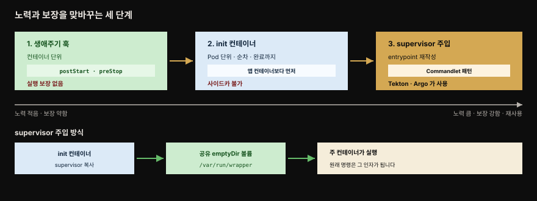

# Managed Lifecycle — 플랫폼의 생애주기 이벤트에 반응하기

> 『Kubernetes Patterns』 5장 정독. 4장 Health Probe가 "플랫폼이 앱에서 정보를 *읽는*" 읽기 전용 방향이었다면, **Managed Lifecycle**은 반대 방향입니다. 플랫폼이 앱에 **명령을 보내고** 앱이 거기에 반응합니다. 컨테이너는 자기 생애주기를 통제하지 못하므로, 좋은 클라우드 네이티브 시민이 되려면 플랫폼이 내는 이벤트를 듣고 생애주기를 맞춰야 합니다.


위쪽이 기동, 아래쪽이 종료 구간입니다. 종료 쪽 화살표를 왼쪽에서 오른쪽으로 따라가면 preStop → SIGTERM → 유예 → SIGKILL 순서가 이 장의 핵심 계약입니다. 붉은 화살표가 유예를 넘겼을 때 벌어지는 일입니다.


## 핵심 요약

> 프로세스 모델만으로 앱을 켜고 끄는 것은 부족합니다. 어떤 앱은 워밍업이, 어떤 앱은 깔끔한 종료 절차가 필요합니다.

프로세스 상태 확인만으로 앱의 건강을 판단하기에 충분하지 않았던 것과 같습니다. 실제 앱은 더 세밀한 상호작용과 생애주기 관리 능력을 요구합니다. 그래서 플랫폼이 몇 가지 이벤트를 내고, 컨테이너는 원한다면 그것을 듣고 반응할 수 있습니다.

핵심 계약은 종료 쪽에 있습니다. Kubernetes가 컨테이너를 내리기로 하면 먼저 **SIGTERM**을 보냅니다. 더 급작스러운 SIGKILL을 보내기 전에 "깔끔히 내려가라"고 찌르는 부드러운 신호입니다. 앱은 진행 중 요청을 마치고 열린 연결을 해제하고 임시 파일을 정리한 뒤 가능한 빨리 종료해야 합니다. 기본 **30초** 안에 내려가지 않으면 Kubernetes가 **SIGKILL**로 강제 종료합니다.

시그널만 쓰는 것은 다소 제한적이라 **훅**이 함께 제공됩니다. `postStart`는 컨테이너 생성 후 주 프로세스와 비동기로 돌고, `preStop`은 종료 직전에 블로킹으로 돕니다.

더 강한 제어가 필요하면 Pod 단위의 **init 컨테이너**로, 그보다 더 필요하면 entrypoint를 감싸는 **Commandlet 패턴**으로 올라갑니다. 이 순서는 뒤로 갈수록 노력이 더 들지만 동시에 더 강한 보장과 재사용을 줍니다.

이 장의 이벤트와 훅은 모두 **Pod 단위가 아니라 개별 컨테이너 단위**에 적용됩니다. Pod 단위 초기화는 15장 Init Container가 맡습니다.


## 학습 목표

> 이 편을 읽고 나면 다음을 설명할 수 있습니다.

1. SIGTERM과 SIGKILL의 역할을 구분하고, 기본 30초 유예가 왜 보장되지 않는지 설명할 수 있습니다.
2. `postStart`가 비동기로 돌면서도 블로킹이라 컨테이너가 Waiting에, Pod가 Pending에 머무는 메커니즘을 설명할 수 있습니다.
3. `postStart`의 두 번째 용도인 전제조건 미충족 시 시작 차단이 어떻게 동작하는지 말할 수 있습니다.
4. 훅에 핵심 로직을 넣으면 안 되는 세 가지 이유를 들 수 있습니다.
5. `preStop`이 SIGTERM과 같은 의미이면서도 종료를 막지 못한다는 점을 설명할 수 있습니다.
6. 생애주기 훅과 init 컨테이너의 granularity·타이밍 보장 차이를 구분할 수 있습니다.
7. entrypoint 재작성이 왜 필요하고 어디서 쓰이는지, init 컨테이너로는 왜 부족한지 판단할 수 있습니다.


## 문제 — 플랫폼이 명령을 보내는 API

> 헬스 체크가 플랫폼이 앱에서 정보를 뽑아내는 방향이었다면, 여기서는 플랫폼이 앱에 명령을 보냅니다.

4장에서 헬스 체크 API는 플랫폼이 앱의 통찰을 얻으려 계속 찔러 보는 **읽기 전용** 엔드포인트였습니다. 플랫폼이 앱에서 정보를 추출하는 메커니즘이었던 셈입니다.

컨테이너 상태를 모니터링하는 데 더해, 플랫폼은 때로 **명령을 내리고 앱이 반응하기를** 기대합니다. 정책과 외부 요인에 이끌려 클라우드 네이티브 플랫폼은 자기가 관리하는 앱을 언제든 시작하거나 중지하기로 결정할 수 있습니다.

어떤 이벤트가 반응할 만큼 중요하고 어떻게 반응할지는 컨테이너화된 앱이 정합니다. 그러나 실질적으로 이것은 플랫폼이 앱과 소통하고 명령을 보내는 데 쓰는 **API**입니다. 앱은 이 생애주기 관리의 혜택을 누릴 수도 있고, 필요 없다면 무시할 수도 있습니다.


## 해법 — 시그널과 훅

> 종료 계약은 SIGTERM과 SIGKILL 두 시그널로, 더 세밀한 제어는 postStart와 preStop 두 훅으로 이루어집니다.

### SIGTERM — 깔끔한 종료의 신호

Kubernetes가 컨테이너를 내리기로 하면 컨테이너는 **SIGTERM** 시그널을 받습니다. 이유는 둘 중 하나입니다. 컨테이너가 속한 Pod 자체가 내려가는 중이거나, liveness 프로브 실패로 컨테이너가 재시작되는 경우입니다.

SIGTERM은 더 급작스러운 SIGKILL을 보내기 전에 컨테이너에게 깔끔히 내려가라고 찌르는 부드러운 신호입니다. SIGTERM을 받은 뒤 앱은 가능한 빨리 종료해야 합니다. 어떤 앱은 즉시 끝나고, 어떤 앱은 진행 중 요청을 마치고 열린 연결을 해제하고 임시 파일을 정리하느라 조금 더 걸립니다. 어느 경우든 SIGTERM에 반응하는 것이 컨테이너를 깔끔히 내리는 옳은 시점입니다.

### SIGKILL — 강제 종료

SIGTERM 뒤에도 컨테이너 프로세스가 내려가지 않으면 뒤따르는 **SIGKILL**로 강제 종료됩니다. Kubernetes는 SIGKILL을 즉시 보내지 않고 SIGTERM 발행 후 **기본 30초**를 기다립니다.

이 유예는 Pod별로 `.spec.terminationGracePeriodSeconds` 필드로 정할 수 있습니다. 다만 Kubernetes에 명령을 내리는 과정에서 덮어써질 수 있어 **보장되지는 않습니다.** 그래서 목표는 빠른 기동과 종료를 갖는 임시적(ephemeral) 컨테이너로 설계하는 것이어야 합니다.

### postStart 훅 — 생성 직후 비동기 실행

생애주기 관리에 프로세스 시그널만 쓰는 것은 다소 제한적입니다. 그래서 `postStart`와 `preStop` 같은 추가 훅이 제공됩니다.[^hooks]

```yaml
apiVersion: v1
kind: Pod
metadata:
  name: post-start-hook
spec:
  containers:
  - image: k8spatterns/random-generator:1.0
    name: random-generator
    lifecycle:
      postStart:
        exec:
          command:
          - sh
          - -c
          # sleep 은 이 시점에 돌 긴 기동 코드의 시뮬레이션입니다
          # 트리거 파일로 병렬 시작하는 주 앱과 동기화합니다
          - sleep 30 && echo "Wake up!" > /tmp/postStart_done
```

`postStart` 명령은 컨테이너가 생성된 **후** 주 컨테이너 프로세스와 **비동기로** 실행됩니다. 앱 초기화와 워밍업 로직의 상당수를 컨테이너 기동 단계로 구현할 수 있음에도 postStart가 여전히 커버하는 use case가 있습니다.

첫 번째 용도는 **기동 지연**입니다. postStart 액션은 블로킹 호출이라 핸들러가 완료될 때까지 컨테이너 상태가 `Waiting`에 머물고, 그에 따라 Pod 상태도 `Pending`에 머뭅니다. 이 성질을 이용해 컨테이너의 기동 상태를 늦추면서 주 컨테이너 프로세스가 초기화할 시간을 줄 수 있습니다.

두 번째 용도는 **시작 차단**입니다. Pod가 특정 전제조건을 충족하지 못할 때 컨테이너가 시작되는 것을 막습니다. 예를 들어 postStart 훅이 **nonzero 종료 코드**를 반환해 에러를 알리면 Kubernetes가 주 컨테이너 프로세스를 죽입니다.

훅의 호출 메커니즘은 4장의 헬스 프로브와 비슷합니다. 원서는 두 핸들러 타입을 드는데, 그 뒤 하나가 더 늘었습니다.

| 핸들러 | 동작 | 출처 |
|--------|------|------|
| `exec` | 컨테이너에서 명령을 직접 실행합니다 | 원서 |
| `httpGet` | Pod 컨테이너가 연 포트로 HTTP GET 요청을 보냅니다 | 원서 |
| `sleep` | 지정한 시간만큼 컨테이너를 멈춰 둡니다 | 공식 문서 (원서 범위 밖) |

`sleep`은 preStop에서 특히 쓸모가 있습니다. 뒤에서 볼 "엔드포인트에서 빠질 시간을 벌어 주는" 관용구를 `exec`로 `sh -c "sleep 5"`를 부르지 않고 선언 하나로 끝낼 수 있기 때문입니다. 참고로 `tcpSocket` 핸들러도 있지만 **deprecated** 입니다.

**postStart 훅에 어떤 핵심 로직을 실행할지는 신중해야 합니다.** 실행에 대한 보장이 없기 때문이며, 이유는 셋입니다.

1. 훅이 컨테이너 프로세스와 **병렬로** 도는 탓에 컨테이너가 시작되기 전에 훅이 실행될 수 있습니다.
2. 훅은 **at-least-once** 의미를 의도하므로 구현이 중복 실행을 감당해야 합니다.
3. 핸들러에 닿지 못한 실패 HTTP 요청에 대해 플랫폼은 **재시도하지 않습니다.**

### preStop 훅 — 종료 직전 블로킹

`preStop` 훅은 컨테이너가 종료되기 전에 보내지는 블로킹 호출입니다. SIGTERM 시그널과 **같은 의미**를 가지며, SIGTERM에 직접 반응하는 것이 불가능할 때 graceful shutdown을 시작하는 데 써야 합니다.

preStop 액션은 컨테이너 삭제 호출이 컨테이너 런타임에 전달되기 **전에 완료**돼야 합니다. 그 삭제 호출이 SIGTERM 통보를 유발합니다.

> **유예가 끝나도 2초는 더 줍니다.** 원서에는 없지만 공식 문서가 밝히는 동작입니다. 유예 기간이 만료됐는데 preStop이 아직 돌고 있으면 kubelet이 **한 번에 한해 2초**를 더 줍니다. 어디까지나 마무리용이라, preStop이 그보다 오래 걸린다면 공식 문서 권고대로 `terminationGracePeriodSeconds` 자체를 늘려야 합니다.

```yaml
apiVersion: v1
kind: Pod
metadata:
  name: pre-stop-hook
spec:
  containers:
  - image: k8spatterns/random-generator:1.0
    name: random-generator
    lifecycle:
      preStop:
        httpGet:
          path: /shutdown   # 앱 안에서 도는 /shutdown 엔드포인트를 호출합니다
          port: 8080
```

preStop이 블로킹이긴 하지만, 붙잡고 있거나 실패 결과를 반환해도 **컨테이너가 삭제되고 프로세스가 죽는 것을 막지는 못합니다.** preStop 훅은 graceful shutdown을 위한 SIGTERM의 편리한 대안일 뿐 그 이상은 아닙니다. 핸들러 타입과 보장은 앞의 postStart와 같습니다.


## 그 밖의 생애주기 제어

> 훅이 컨테이너 단위라면 init 컨테이너는 Pod 단위이고, 그보다 더 강한 제어가 필요하면 entrypoint를 재작성합니다.



### init 컨테이너와의 비교

훅이 컨테이너 생애주기 이벤트에 명령을 실행하게 해 준다면, 컨테이너 수준이 아니라 **Pod 수준**에서 초기화 지시를 실행하게 하는 다른 메커니즘이 있습니다.

Init Container 패턴은 15장에서 깊이 다루므로 여기서는 생애주기 훅과 비교할 만큼만 봅니다. 일반 앱 컨테이너와 달리 init 컨테이너는 세 가지 성질을 갖습니다.

- **순차로** 실행됩니다.
- **완료까지** 실행됩니다.
- Pod의 어떤 앱 컨테이너보다 **먼저** 돕니다.

이 보장 덕분에 init 컨테이너를 Pod 수준 초기화 작업에 쓸 수 있습니다.

둘은 granularity가 다르며 경우에 따라 서로 대체하거나 보완합니다.

| 축 | 생애주기 훅 | init 컨테이너 |
|----|-------------|---------------|
| 발동 시점 | 컨테이너 생애주기 단계 | Pod 생애주기 단계 |
| 기동 액션 | postStart 명령 | 실행할 initContainers 목록 |
| 종료 액션 | preStop 명령 | 동등한 기능 없음 |
| 타이밍 보장 | postStart는 컨테이너 ENTRYPOINT와 동시에 실행 | 모든 init 컨테이너가 성공 완료돼야 앱 컨테이너 시작 |
| 용도 | 컨테이너별 비핵심 기동·종료 정리 | 워크플로우형 순차 작업, 작업 실행용 컨테이너 재사용 |

### entrypoint 재작성 — Commandlet 패턴

앱 컨테이너의 생애주기를 관리하는 데 더 강한 제어가 필요하면 컨테이너 entrypoint를 재작성하는 고급 기법이 있습니다. **Commandlet 패턴**이라 부르기도 합니다. Pod 안의 주 컨테이너들을 특정 순서로 시작해야 하고 추가적인 제어가 필요할 때 특히 유용합니다.

Tekton과 Argo CD 같은 Kubernetes 기반 파이프라인 플랫폼이 그런 경우입니다. 데이터를 공유하는 컨테이너를 순차 실행해야 하면서 동시에 병렬로 도는 사이드카 컨테이너도 포함해야 합니다. 이 시나리오에서 **init 컨테이너 시퀀스는 사이드카를 허용하지 않아 부족합니다.**

entrypoint 재작성의 아이디어는 이렇습니다. 모든 컨테이너 이미지는 시작할 때 기본 실행하는 명령을 정의하는데, 그 명령을 **원래 명령을 호출하면서 생애주기 관심사를 처리하는 범용 래퍼 명령**으로 바꿉니다. 이 범용 명령은 앱 컨테이너가 시작되기 전에 다른 컨테이너 이미지에서 주입됩니다.

먼저 감싸기 전의 평범한 Pod 선언이 이렇습니다.

```yaml
apiVersion: v1
kind: Pod
metadata:
  name: simple-random-generator
spec:
  restartPolicy: OnFailure
  containers:
  - image: k8spatterns/random-generator:1.0
    name: random-generator
    command:
    - "random-generator-runner"   # 컨테이너 시작 시 실행되는 명령
    args:
    - "--seed"                    # entrypoint 명령에 넘기는 추가 인자
    - "42"
```

여기서 `random-generator-runner` 명령을, SIGTERM 같은 외부 시그널에 반응하는 생애주기 관심사를 처리하는 범용 supervisor 프로그램으로 감싸는 것이 요령입니다.

```yaml
apiVersion: v1
kind: Pod
metadata:
  name: wrapped-random-generator
spec:
  restartPolicy: OnFailure
  volumes:
  - name: wrapper
    emptyDir: { }                       # supervisor 를 공유할 새 emptyDir 볼륨
  initContainers:
  - name: copy-supervisor               # supervisor 를 앱 컨테이너로 복사하는 init 컨테이너
    image: k8spatterns/supervisor
    volumeMounts:
    - mountPath: /var/run/wrapper
      name: wrapper
    command: [ cp ]
    args: [ supervisor, /var/run/wrapper/supervisor ]
  containers:
  - image: k8spatterns/random-generator:1.0
    name: random-generator
    volumeMounts:
    - mountPath: /var/run/wrapper
      name: wrapper
    command:
    - "/var/run/wrapper/supervisor"     # 원래 명령을 공유 볼륨의 supervisor 로 대체
    args:
    - "random-generator-runner"         # 원래 명령 명세가 supervisor 의 인자가 됩니다
    - "--seed"
    - "42"
```

이 entrypoint 재작성은 Tekton처럼 **Pod를 프로그래밍적으로 만들고 관리하는** 앱에 특히 유용합니다. Tekton은 CI 파이프라인을 실행할 때 Pod를 만드는데, 이 방식으로 Pod 안의 컨테이너를 언제 시작하고 중지하고 연결할지 훨씬 잘 제어합니다.

### 무엇을 고를 것인가

특정 타이밍 보장이 필요한 경우를 빼면 어느 메커니즘을 쓸지에 엄격한 규칙은 없습니다.

생애주기 훅과 init 컨테이너를 완전히 건너뛰고 **bash 스크립트**로 컨테이너의 기동·종료 명령에 특정 동작을 넣을 수도 있습니다. 가능하긴 하지만 컨테이너와 스크립트를 강하게 결합시켜 **유지보수 악몽**으로 만듭니다.

선택지는 노력과 보장을 맞바꾸며 올라갑니다. 먼저 생애주기 훅으로 일부 동작을 수행합니다. 더 나아가 init 컨테이너로 개별 동작을 수행하는 컨테이너를 돌립니다. 더 정교한 제어가 필요하면 supervisor 데몬을 주입합니다. 뒤로 갈수록 노력이 더 들지만 동시에 더 강한 보장을 주고 재사용을 가능하게 합니다.


## 앱 생애주기는 더 이상 사람 손에 없다

> 플랫폼이 주는 안정성의 대가로 앱은 계약을 지켜야 하고, 그 계약의 기본형은 잘 설계된 POSIX 프로세스처럼 행동하는 것입니다.

클라우드 네이티브 플랫폼이 제공하는 주된 이점은 잠재적으로 신뢰할 수 없는 클라우드 인프라 위에서 앱을 안정적이고 예측 가능하게 돌리고 확장하는 능력입니다. 그 대가로 플랫폼은 자기 위에서 도는 앱에 일련의 **제약과 계약**을 요구합니다. 플랫폼이 주는 모든 능력의 혜택을 받으려면 그 계약을 지키는 것이 앱 자신에게 이롭습니다.

이 이벤트들을 처리하고 반응하면 앱은 소비 서비스에 최소한의 영향만 주며 우아하게 시작하고 종료할 수 있습니다. 현재의 기본 형태에서 이는 컨테이너가 **잘 설계된 POSIX 프로세스라면 그러하듯** 행동해야 한다는 뜻입니다. 앞으로는 스케일 업이 임박했다거나 종료를 피하려면 자원을 해제하라는 힌트를 주는 이벤트가 더 생길 수도 있습니다.

핵심은 **앱 생애주기가 더 이상 사람의 통제 아래 있지 않고 플랫폼이 완전히 자동화한다**는 점을 이해하는 것입니다. 컨테이너와 Pod 생애주기의 단계와 사용 가능한 훅을 이해하는 일이, Kubernetes에 관리받는 이점을 누리는 앱을 만드는 데 결정적입니다.

앱 생애주기 관리 외에 Kubernetes 같은 오케스트레이션 플랫폼의 다른 큰 임무는 컨테이너를 노드 무리에 분배하는 것입니다. 다음 6장 Automated Placement가 바깥에서 스케줄링 결정에 영향을 주는 방법을 설명합니다.


## 심화 학습

> 본문(원서 5장) 밖에서 보강한 내용입니다. 출처를 링크로 남깁니다.

### Spring Boot graceful shutdown이 SIGTERM 계약과 맞물리는 지점

이 장의 SIGTERM 계약은 Spring Boot 앱에서 구체적인 설정으로 나타납니다. Spring Boot 2.3 이상은 `server.shutdown=graceful`을 켜면 SIGTERM을 받았을 때 새 요청을 거부하고 **진행 중 요청을 마칠 시간**을 줍니다. 이 대기 시간은 `spring.lifecycle.timeout-per-shutdown-phase`로 정하며 기본값은 30초입니다.

여기서 함정이 생깁니다. 이 값이 Kubernetes의 `terminationGracePeriodSeconds`보다 크면 앱이 요청을 다 마치기 전에 SIGKILL로 강제 종료돼 graceful shutdown이 무의미해집니다.

**둘 다 기본값이 30초라는 점이 특히 위험합니다.** 두 시계가 나란히 도는 것이 아니라, Kubernetes의 30초가 시작된 *뒤에* 앱의 30초가 시작되기 때문입니다. 앱이 종료 대기를 30초 가득 쓰면 그 시점에는 유예가 이미 끝나 있습니다. 아슬아슬하게 겹치는 정도가 아니라 **강제 종료가 사실상 예정된 설정**입니다.

그래서 실무 규칙은 하나입니다. **`terminationGracePeriodSeconds`를 `timeout-per-shutdown-phase`보다 넉넉히 크게** 잡습니다.

여기에 책이 말하지 않은 타이밍 이슈가 하나 더 있습니다. SIGTERM이 오면 Kubernetes는 동시에 Pod를 엔드포인트에서 빼지만, kube-proxy가 iptables 규칙을 갱신하는 데 시차가 있습니다. 그래서 **SIGTERM 직후 잠깐은 여전히 새 트래픽이 도착할 수** 있습니다.

이 때문에 `preStop`에 짧은 `sleep`을 걸어 엔드포인트 전파를 기다린 뒤 종료를 시작하는 패턴이 흔합니다. 보통 5~10초를 씁니다. 책이 말한 "preStop은 SIGTERM 반응이 불가할 때의 대안"을 트래픽 드레이닝 목적으로 확장한 실무 관용구입니다.

> 생애주기 훅과 Pod 생애주기 전체(phase 전이·재시작 정책·훅 실행 순서)는 형제 정독본 [lifecycle hook과 Pod 생애주기 전체](../kubernetes-in-action/06-03.lifecycle%20hook%EA%B3%BC%20Pod%20%EC%83%9D%EC%95%A0%EC%A3%BC%EA%B8%B0%20%EC%A0%84%EC%B2%B4.md)에 상세합니다.

### PID 1 문제 — SIGTERM이 앱에 안 닿는 함정

책은 SIGTERM에 반응하라고 하지만, 컨테이너에서 SIGTERM이 애초에 **앱에 닿지 않는** 경우가 흔합니다.

원인은 Unix 규약에 있습니다. 컨테이너의 PID 1 프로세스는 자기가 명시적으로 처리하지 않는 시그널을 무시하며 자식에게 전파하지도 않습니다. `sh -c "java -jar app.jar"` 처럼 셸을 통해 앱을 띄우면 PID 1은 셸이 됩니다. SIGTERM은 셸에서 멈추고 자바 프로세스에 전달되지 않아 graceful shutdown이 아예 발동하지 않습니다. 결국 30초 뒤 SIGKILL로 강제 종료됩니다.

해결은 둘 중 하나입니다.

1. **앱을 PID 1로 직접 띄웁니다.** exec 형식 ENTRYPOINT를 쓰거나 Dockerfile에 `ENTRYPOINT ["java","-jar","app.jar"]` 처럼 적습니다.
2. **`tini` 같은 init을 PID 1에 둡니다.** 그러면 그것이 시그널을 자식에 전파합니다.

- 출처: [Spring Boot — Graceful Shutdown (공식 문서)](https://docs.spring.io/spring-boot/reference/web/graceful-shutdown.html) (2026-07-12 조회)
- 출처: [Kubernetes — Pod Lifecycle: Termination (공식)](https://kubernetes.io/docs/concepts/workloads/pods/pod-lifecycle/#pod-termination)


## 능동 회상

> 먼저 스스로 답해 본 뒤 아래 정답 절에서 맞춰 봅니다. 정답은 이 절 다음에 번호 순서대로 있습니다.

1. 4장 Health Probe와 이 장의 방향은 어떻게 다른가요?
2. 컨테이너가 SIGTERM을 받는 경우는 두 가지입니다. 무엇인가요?
3. SIGTERM을 받은 앱이 해야 할 일은 무엇인가요?
4. SIGKILL은 언제 오나요? 기본 유예는 얼마이고 무엇으로 조절하나요?
5. `terminationGracePeriodSeconds`가 보장되지 않는 이유는 무엇인가요? 그래서 설계 목표는 무엇이어야 하나요?
6. `postStart`는 주 프로세스와 어떤 관계로 실행되나요? 그런데도 블로킹이라는 말은 무슨 뜻인가요?
7. postStart 블로킹 성질을 이용한 첫 번째 용도는 무엇인가요?
8. postStart의 두 번째 용도는 무엇이며 어떻게 동작하나요?
9. 훅이 지원하는 두 핸들러 타입은 무엇인가요?
10. postStart에 핵심 로직을 넣으면 안 되는 세 가지 이유를 말해 보세요.
11. `preStop`은 무엇과 같은 의미이며 언제 써야 하나요? 완료 시점의 제약은 무엇인가요?
12. preStop이 블로킹인데도 하지 못하는 것은 무엇인가요?
13. 생애주기 훅과 init 컨테이너의 타이밍 보장은 각각 어떻게 다른가요?
14. Tekton·Argo 같은 플랫폼에서 init 컨테이너 시퀀스로는 왜 부족한가요?
15. entrypoint 재작성의 아이디어를 한 문장으로 말해 보세요. supervisor는 어떻게 컨테이너에 들어가나요?
16. 기동·종료 동작을 bash 스크립트로 처리하면 무엇이 문제인가요?


## 정답

> 위 회상 질문의 답입니다. 번호가 대응합니다.

**1.** 4장의 헬스 체크 API는 플랫폼이 앱의 통찰을 얻으려 계속 찔러 보는 읽기 전용 엔드포인트로, 플랫폼이 앱에서 정보를 **추출**하는 방향이었습니다. 이 장은 반대로 플랫폼이 앱에 **명령을 보내고** 앱이 반응하기를 기대하는 방향입니다. 실질적으로 플랫폼이 앱과 소통하는 API입니다.

**2.** 컨테이너가 속한 Pod 자체가 내려가는 중이거나, liveness 프로브 실패로 컨테이너가 재시작되는 경우입니다.

**3.** 가능한 빨리 종료해야 합니다. 어떤 앱은 즉시 끝나지만, 진행 중 요청을 마치고 열린 연결을 해제하고 임시 파일을 정리하느라 조금 더 걸리는 앱도 있습니다. 어느 경우든 SIGTERM에 반응하는 것이 컨테이너를 깔끔히 내리는 옳은 시점입니다.

**4.** SIGTERM 뒤에도 컨테이너 프로세스가 내려가지 않으면 옵니다. Kubernetes는 즉시 보내지 않고 SIGTERM 발행 후 기본 30초를 기다리며, 이 유예는 Pod별로 `.spec.terminationGracePeriodSeconds` 필드로 정합니다.

**5.** Kubernetes에 명령을 내리는 과정에서 덮어써질 수 있기 때문입니다. 그래서 설계 목표는 빠른 기동과 종료를 갖는 **임시적(ephemeral) 컨테이너**로 만드는 것이어야 합니다.

**6.** 컨테이너가 생성된 **후** 주 컨테이너 프로세스와 **비동기로** 실행됩니다. 그럼에도 블로킹 호출이라는 것은, 핸들러가 완료될 때까지 컨테이너 상태가 `Waiting`에 머물고 그에 따라 Pod 상태도 `Pending`에 머문다는 뜻입니다.

**7.** **기동 지연**입니다. 컨테이너의 기동 상태를 늦추면서 주 컨테이너 프로세스가 초기화할 시간을 벌어 줍니다.

**8.** **시작 차단**입니다. Pod가 특정 전제조건을 충족하지 못할 때 컨테이너 시작을 막습니다. postStart 훅이 nonzero 종료 코드를 반환해 에러를 알리면 Kubernetes가 주 컨테이너 프로세스를 죽입니다.

**9.** `exec`는 컨테이너에서 명령을 직접 실행하고, `httpGet`은 Pod 컨테이너가 연 포트로 HTTP GET 요청을 보냅니다. 4장 헬스 프로브와 같은 메커니즘입니다.

**10.** 첫째, 훅이 컨테이너 프로세스와 병렬로 도는 탓에 컨테이너가 시작되기 전에 실행될 수 있습니다. 둘째, at-least-once 의미를 의도하므로 중복 실행을 감당해야 합니다. 셋째, 핸들러에 닿지 못한 실패 HTTP 요청을 플랫폼이 재시도하지 않습니다.

**11.** SIGTERM 시그널과 **같은 의미**입니다. SIGTERM에 직접 반응하는 것이 불가능할 때 graceful shutdown을 시작하는 데 써야 합니다. preStop 액션은 컨테이너 삭제 호출이 런타임에 전달되기 **전에 완료**돼야 합니다. 그 삭제 호출이 SIGTERM 통보를 유발합니다.

**12.** 컨테이너가 삭제되고 프로세스가 죽는 것을 막지 못합니다. 붙잡고 있거나 실패 결과를 반환해도 마찬가지입니다. graceful shutdown을 위한 SIGTERM의 편리한 대안일 뿐입니다.

**13.** 훅의 postStart는 컨테이너 ENTRYPOINT와 **동시에** 실행됩니다. init 컨테이너는 순차로, 완료까지 실행되며 **모든 init 컨테이너가 성공 완료돼야** 어떤 앱 컨테이너도 시작할 수 있습니다. 전자는 컨테이너 단위, 후자는 Pod 단위 granularity입니다.

**14.** 그 플랫폼들은 데이터를 공유하는 컨테이너의 순차 실행과 **병렬로 도는 사이드카 컨테이너**를 동시에 요구하는데, init 컨테이너 시퀀스는 사이드카를 허용하지 않기 때문입니다.

**15.** 컨테이너가 기본 실행하는 명령을, 원래 명령을 호출하면서 생애주기 관심사를 처리하는 **범용 래퍼 명령으로 바꾸는 것**입니다. supervisor는 init 컨테이너가 공유 emptyDir 볼륨에 복사해 넣고, 주 컨테이너가 원래 명령 대신 그 supervisor를 실행하면서 원래 명령 명세를 인자로 넘깁니다.

**16.** 가능은 하지만 컨테이너와 스크립트를 강하게 결합시켜 **유지보수 악몽**이 됩니다. 그래서 생애주기 훅, init 컨테이너, supervisor 주입 순으로 올라가며 노력과 보장을 맞바꾸는 편이 낫습니다.


## 실무 적용

- **SIGTERM에 graceful shutdown을 건다.** Spring Boot면 `server.shutdown=graceful`을 켜고 K8s `terminationGracePeriodSeconds`를 앱 종료 타임아웃보다 크게 잡습니다.
- **컨테이너를 PID 1로 직접 띄운다.** `sh -c`로 감싸지 말고 exec 형식 ENTRYPOINT나 `tini`를 써서 SIGTERM이 앱에 닿게 합니다.
- **트래픽 드레이닝엔 preStop sleep.** 엔드포인트 전파 시차 때문에 SIGTERM 직후 오는 트래픽을 흡수하려 preStop에 짧은 sleep을 겁니다.
- **postStart에 핵심 로직을 넣지 않는다.** 실행 보장·순서 보장이 없고 at-least-once라 중복 대비가 필요합니다. 초기화는 컨테이너 기동 코드나 init 컨테이너로.
- **Pod 단위 순차 초기화는 init 컨테이너.** 의존성 준비 대기·스키마 마이그레이션 같은 선행 작업은 훅이 아니라 init 컨테이너로 순서를 보장합니다.
- **파이프라인 플랫폼(Tekton·Argo)은 entrypoint 재작성.** 사이드카가 필요한 순차 실행에는 init 시퀀스 대신 supervisor 주입을 씁니다.


## 체크리스트

- [ ] SIGTERM과 SIGKILL의 역할, 기본 30초 유예를 설명할 수 있습니까?
- [ ] `terminationGracePeriodSeconds`가 보장되지 않는 이유를 압니까?
- [ ] postStart가 비동기이면서 블로킹이라 컨테이너 Waiting·Pod Pending에 머무는 메커니즘을 설명할 수 있습니까?
- [ ] postStart 의 두 용도(기동 지연·시작 차단)와 nonzero exit 의 결과를 구분합니까?
- [ ] 훅에 핵심 로직을 넣으면 안 되는 세 이유를 들 수 있습니까?
- [ ] preStop 이 블로킹이어도 컨테이너 삭제를 막지 못한다는 점을 압니까?
- [ ] 생애주기 훅과 init 컨테이너의 타이밍 보장 차이를 구분할 수 있습니까?
- [ ] entrypoint 재작성이 왜 필요하고(사이드카 순차 실행) 어디서 쓰이는지(Tekton·Argo) 압니까?
- [ ] Spring Boot graceful shutdown 과 K8s 유예 시간의 관계, PID 1 시그널 함정을 설명할 수 있습니까?


## 면접 관점

**Q. Kubernetes가 컨테이너를 종료할 때 어떤 순서로 진행됩니까?**
먼저 SIGTERM을 보내 깔끔한 종료를 요청합니다. 앱은 진행 중 요청을 마치고 연결·임시 파일을 정리한 뒤 종료해야 합니다. 기본 30초(`terminationGracePeriodSeconds`) 안에 안 내려가면 SIGKILL로 강제 종료합니다. preStop 훅이 있으면 SIGTERM보다 먼저 블로킹으로 돌지만 붙잡고 있어도 종료 자체를 막지는 못합니다.

**Q. postStart 훅에 핵심 초기화 로직을 넣으면 안 되는 이유는?**
실행 보장이 없기 때문입니다. postStart는 컨테이너 프로세스와 병렬로 돌아 컨테이너 시작 전에 실행될 수 있고 at-least-once 의미라 중복 실행될 수 있으며 핸들러에 닿지 못한 HTTP 실패는 재시도되지 않습니다. 초기화는 컨테이너 기동 코드나 순서가 보장되는 init 컨테이너에 두는 것이 옳습니다.

**Q. 생애주기 훅과 init 컨테이너는 무엇이 다릅니까?**
훅은 컨테이너 단위로, postStart는 ENTRYPOINT와 동시에 돌고 preStop은 종료 전에 돕니다. init 컨테이너는 Pod 단위로, 순차·완료까지 실행되며 어떤 앱 컨테이너보다 먼저 전부 완료돼야 합니다. 컨테이너별 정리는 훅으로, Pod 단위 순차 선행 작업은 init 컨테이너로 나눕니다.

**Q. Spring Boot graceful shutdown이 무의미해지는 흔한 실수는?**
K8s `terminationGracePeriodSeconds`를 앱의 `timeout-per-shutdown-phase`보다 작게 잡으면, 앱이 요청을 마치기 전에 SIGKILL로 강제 종료돼 graceful shutdown이 헛돕니다. 또 앱을 `sh -c`로 띄워 PID 1이 셸이면 SIGTERM이 자바 프로세스에 안 닿아 graceful shutdown이 아예 발동하지 않습니다. 유예를 넉넉히 잡고 exec 형식 ENTRYPOINT나 tini로 시그널이 앱에 닿게 해야 합니다.


## 참고 자료

- 원서: 《Kubernetes Patterns, Second Edition》(Bilgin Ibryam·Roland Huß, O'Reilly) Ch5. Managed Lifecycle
- 이 책의 MOC: [Kubernetes Patterns 정독 인덱스](./README.md) · 앞 편: [Health Probe](./04-01.Health%20Probe%20%E2%80%94%20%EC%95%B1%EC%9D%B4%20%EC%9E%90%EA%B8%B0%20%EA%B1%B4%EA%B0%95%EC%9D%84%20%ED%94%8C%EB%9E%AB%ED%8F%BC%EC%97%90%20%EC%95%8C%EB%A6%AC%EA%B8%B0.md)
- 형제 정독본: [lifecycle hook과 Pod 생애주기 전체](../kubernetes-in-action/06-03.lifecycle%20hook%EA%B3%BC%20Pod%20%EC%83%9D%EC%95%A0%EC%A3%BC%EA%B8%B0%20%EC%A0%84%EC%B2%B4.md)
- 개념 노트: [핵심 워크로드](../../kubernetes/01_workloads/01-01.%ED%95%B5%EC%8B%AC%20%EC%9B%8C%ED%81%AC%EB%A1%9C%EB%93%9C.md)
- [Kubernetes — Container Lifecycle Hooks (공식)](https://kubernetes.io/docs/concepts/containers/container-lifecycle-hooks/) · [Spring Boot Graceful Shutdown](https://docs.spring.io/spring-boot/reference/web/graceful-shutdown.html)

[^hooks]: Kubernetes — postStart·preStop 훅의 핸들러 타입과 실행 보장.
<https://kubernetes.io/docs/concepts/containers/container-lifecycle-hooks/>
- 저자 예제 코드: [k8spatterns/examples](https://github.com/k8spatterns/examples)
