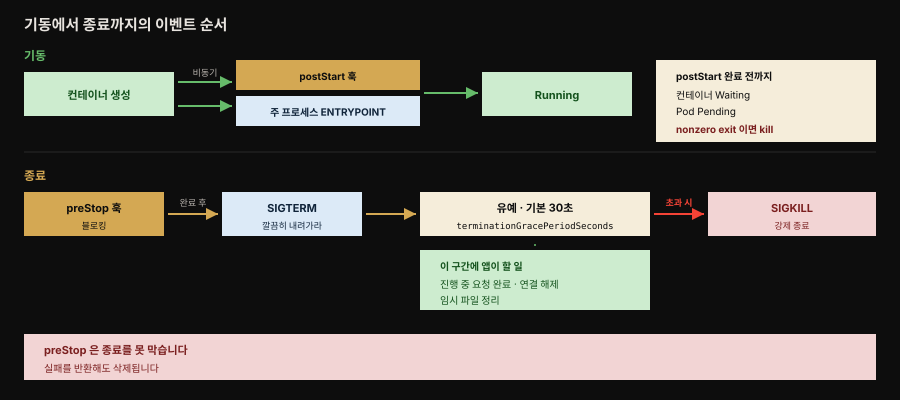

# Managed Lifecycle — 플랫폼의 생애주기 이벤트에 반응하기
---
> 『Kubernetes Patterns』 5장 정독. 4장 Health Probe가 "플랫폼이 앱에서 정보를 *읽는*" 읽기 전용 방향이었다면, **Managed Lifecycle**은 반대 방향입니다 — 플랫폼이 앱에 **명령을 보내고**, 앱이 거기에 반응합니다. 컨테이너는 자기 생애주기를 통제하지 못하므로, 좋은 클라우드 네이티브 시민이 되려면 플랫폼이 내는 이벤트를 듣고 생애주기를 맞춰야 합니다.


## 핵심 요약

> 프로세스 상태 확인만으로 건강을 판단하기 부족하듯, 프로세스 모델만으로 앱을 켜고 끄는 것도 부족합니다. 어떤 앱은 워밍업 도움이, 어떤 앱은 부드럽고 깔끔한 종료 절차가 필요합니다. Kubernetes는 이를 위해 **SIGTERM/SIGKILL 시그널**과 **postStart/preStop 훅**을 냅니다. 컨테이너는 이 이벤트를 듣고 반응할지 무시할지 스스로 정하지만 반응하면 소비 서비스에 최소 영향으로 우아하게 시작·종료할 수 있습니다.

핵심 계약은 종료 쪽에 있습니다. Kubernetes가 컨테이너를 내릴 때 **SIGTERM**을 먼저 보냅니다 — "깔끔히 내려가라"는 부드러운 신호입니다. 앱은 진행 중 요청을 마치고 연결을 닫고 임시 파일을 정리한 뒤 가능한 빨리 종료해야 합니다. 기본 **30초** 안에 안 내려가면 Kubernetes가 **SIGKILL**로 강제 종료합니다.

시그널만으로는 제한적이라 **훅**이 있습니다. `postStart`는 컨테이너 생성 직후 주 프로세스와 비동기로 돌고 `preStop`은 종료 직전 블로킹으로 돕니다. 더 강한 제어가 필요하면 Pod 단위의 **init 컨테이너**나, entrypoint를 감싸는 **Commandlet 패턴**으로 올라갑니다. 이 사슬은 뒤로 갈수록 노력이 들지만 더 강한 보장과 재사용을 줍니다.


## 학습 목표

> 이 편을 읽고 나면 다음을 설명할 수 있습니다.

- SIGTERM과 SIGKILL의 역할, 기본 30초 유예(`terminationGracePeriodSeconds`)와 그것이 보장되지 않는 이유를 설명한다.
- `postStart`가 주 프로세스와 비동기로 돌지만 블로킹이라 컨테이너가 Waiting·Pod가 Pending에 머무는 메커니즘을 안다.
- `preStop`이 SIGTERM과 같은 의미이고 종료를 막지는 못한다는 점을 안다.
- 생애주기 훅(컨테이너 단위)과 init 컨테이너(Pod 단위)의 granularity·타이밍 보장 차이를 구분한다.
- entrypoint 재작성(Commandlet 패턴)이 왜, 언제(Tekton·Argo 같은 파이프라인) 필요한지 설명한다.


## 본문 정리

### 문제 — 플랫폼이 명령을 보내는 API

4장에서 헬스 체크 API는 플랫폼이 앱에서 정보를 *뽑아내는* 읽기 전용 엔드포인트였습니다. 그런데 플랫폼은 컨테이너 상태를 모니터링하는 데 더해, 때로 **명령을 내리고 앱이 반응하길** 기대합니다. 정책과 외부 요인에 따라 플랫폼은 관리하는 앱을 언제든 시작·중지할 수 있습니다. 어떤 이벤트가 중요하고 어떻게 반응할지는 컨테이너가 정하지만 실질적으로 이것은 플랫폼이 앱에 명령을 보내는 API입니다. 앱은 이 생애주기 관리를 이용할 수도, 필요 없으면 무시할 수도 있습니다.

> 이 장의 이벤트·훅은 모두 **Pod 단위가 아니라 개별 컨테이너 단위**에 적용됩니다. Pod 단위 초기화는 init 컨테이너(15장)가 맡습니다.

### SIGTERM — 깔끔한 종료의 신호

Kubernetes가 컨테이너를 내리기로 하면 — Pod 자체가 내려가서든, liveness 프로브 실패로 재시작되든 — 컨테이너는 **SIGTERM** 시그널을 받습니다. SIGTERM은 더 급작스러운 SIGKILL을 보내기 전에 "깔끔히 내려가라"고 찌르는 부드러운 신호입니다. 받은 뒤 앱은 가능한 빨리 종료해야 합니다. 어떤 앱은 즉시 끝나고 어떤 앱은 진행 중 요청 완료·열린 연결 해제·임시 파일 정리에 조금 더 시간이 걸립니다. 어느 경우든 SIGTERM에 반응하는 것이 컨테이너를 깔끔히 내리는 옳은 시점입니다.

### SIGKILL — 강제 종료

SIGTERM 뒤에도 컨테이너 프로세스가 안 내려가면 **SIGKILL**로 강제 종료됩니다. Kubernetes는 SIGKILL을 즉시 보내지 않고 SIGTERM 발행 후 **기본 30초** 기다립니다. 이 유예는 Pod별로 `.spec.terminationGracePeriodSeconds`로 정할 수 있지만 Kubernetes에 명령을 내릴 때 덮어써질 수 있어 **보장되지는 않습니다**. 목표는 빠른 기동·종료를 갖는 임시적(ephemeral) 컨테이너로 설계하는 것입니다.

### PostStart 훅 — 생성 직후 비동기 실행

시그널만으로는 제한적이라 `postStart`·`preStop` 훅이 있습니다.

```yaml
lifecycle:
  postStart:
    exec:
      command:
      - sh
      - -c
      - sleep 30 && echo "Wake up!" > /tmp/postStart_done
      # sleep은 여기서 돌 긴 기동 코드의 시뮬레이션. 트리거 파일로 병렬 시작하는 주 앱과 동기화
```

`postStart` 명령은 컨테이너 생성 **후** 주 컨테이너 프로세스와 **비동기로** 실행됩니다. 앱 초기화·워밍업의 상당수를 컨테이너 기동 단계로 구현할 수 있어도 postStart가 커버하는 경우가 있습니다. postStart는 **블로킹 호출**이라, 핸들러가 끝날 때까지 **컨테이너 상태가 Waiting**에 머물고 그에 따라 **Pod 상태가 Pending**에 머뭅니다. 이 성질로 컨테이너의 기동 상태를 지연시켜 주 프로세스 초기화에 시간을 줄 수 있습니다. 또 Pod가 특정 전제조건을 못 채우면 컨테이너 시작을 막는 데도 씁니다 — postStart가 **nonzero 종료 코드**로 에러를 알리면 Kubernetes가 주 컨테이너 프로세스를 죽입니다.

훅의 핸들러 타입은 헬스 프로브와 비슷하게 **exec**(컨테이너에서 직접 명령 실행)과 **httpGet**(Pod 컨테이너가 연 포트로 HTTP GET)입니다. 주의할 점 — postStart에 담는 핵심 로직은 조심해야 합니다. 실행 보장이 없기 때문입니다. 훅이 컨테이너 프로세스와 병렬로 도니 컨테이너 시작 전에 실행될 수 있고 **at-least-once** 의미라 중복 실행에 대비해야 하며 핸들러에 닿지 못한 실패 HTTP 요청에 플랫폼은 재시도하지 않습니다.

### PreStop 훅 — 종료 직전 블로킹

`preStop`은 컨테이너가 종료되기 전 보내지는 블로킹 호출입니다. SIGTERM과 같은 의미이고 **SIGTERM에 직접 반응할 수 없을 때** graceful shutdown을 시작하는 데 씁니다. preStop 액션은 컨테이너 삭제 호출(SIGTERM 통보를 유발)이 런타임에 전달되기 **전에 완료**돼야 합니다.

```yaml
lifecycle:
  preStop:
    httpGet:
      path: /shutdown        # 앱 안에서 도는 /shutdown 엔드포인트 호출
      port: 8080
```

preStop이 블로킹이지만 붙잡고 있거나 실패 결과를 반환해도 **컨테이너 삭제·프로세스 종료를 막지는 못합니다**. preStop은 graceful shutdown을 위한 SIGTERM의 편리한 대안일 뿐, 그 이상은 아닙니다. 핸들러 타입·보장은 postStart와 같습니다.

### Other Lifecycle Controls — init 컨테이너와 entrypoint 재작성

훅이 컨테이너 단위라면, **init 컨테이너**는 Pod 단위 초기화를 실행합니다(15장 상세). 일반 앱 컨테이너와 달리 init 컨테이너는 **순차 실행·완료까지 실행되며 어떤 앱 컨테이너보다 먼저** 돕니다. 둘은 granularity가 다르고(컨테이너 단위 vs Pod 단위) 경우에 따라 대체·보완합니다.



| 축 | 생애주기 훅 | init 컨테이너 |
|----|-------------|---------------|
| 발동 시점 | 컨테이너 생애주기 단계 | Pod 생애주기 단계 |
| 기동 액션 | postStart 명령 | 실행할 initContainers 목록 |
| 종료 액션 | preStop 명령 | 없음 |
| 타이밍 보장 | postStart는 컨테이너 ENTRYPOINT와 동시 실행 | 모든 init 컨테이너가 성공 완료돼야 앱 컨테이너 시작 |
| 용도 | 컨테이너별 비핵심 기동·종료 정리 | 워크플로우형 순차 작업, 작업용 컨테이너 재사용 |

더 강한 제어가 필요하면 컨테이너 entrypoint를 재작성하는 고급 기법 — **Commandlet 패턴** — 이 있습니다. Pod의 주 컨테이너들을 특정 순서로 시작하고 추가 제어가 필요할 때 유용합니다. Tekton·Argo CD 같은 Kubernetes 기반 파이프라인 플랫폼은 데이터를 공유하는 컨테이너의 순차 실행과 병렬 사이드카(16장)를 요구하는데, init 컨테이너 시퀀스는 **사이드카를 허용하지 않아** 부족합니다.

entrypoint 재작성의 아이디어는 컨테이너가 기본 실행하는 명령을, 원래 명령을 호출하면서 생애주기 관심사를 처리하는 **범용 래퍼 명령**으로 바꾸는 것입니다. 이 범용 명령은 앱 컨테이너 시작 전에 다른 컨테이너 이미지에서 주입됩니다.

```yaml
# init 컨테이너로 supervisor를 공유 볼륨에 복사한 뒤, 주 컨테이너의 원래 명령을 supervisor로 감쌈
volumes:
- name: wrapper
  emptyDir: { }
initContainers:
- name: copy-supervisor
  image: k8spatterns/supervisor
  volumeMounts:
  - mountPath: /var/run/wrapper
    name: wrapper
  command: [ cp ]
  args: [ supervisor, /var/run/wrapper/supervisor ]
containers:
- image: k8spatterns/random-generator:1.0
  name: random-generator
  volumeMounts:
  - mountPath: /var/run/wrapper
    name: wrapper
  command:
  - "/var/run/wrapper/supervisor"     # 원래 명령을 supervisor 데몬으로 대체
  args:
  - "random-generator-runner"          # 원래 명령은 supervisor의 인자가 됨
  - "--seed"
  - "42"
```

이 방식은 Tekton처럼 CI 파이프라인 실행 시 Pod를 프로그래밍적으로 만들고 관리하는 앱에 특히 유용합니다 — Pod 안 컨테이너를 언제 시작·중지·연결할지 훨씬 잘 제어합니다.

메커니즘 선택에 엄격한 규칙은 없습니다(특정 타이밍 보장이 필요한 경우 제외). bash 스크립트로 기동·종료 명령을 넣을 수도 있지만 컨테이너와 스크립트를 강결합시켜 유지보수 악몽이 됩니다. 생애주기 훅 → init 컨테이너 → supervisor 데몬 주입 순으로 갈수록 노력이 늘지만 더 강한 보장과 재사용을 줍니다.

### Discussion — 앱 생애주기는 더 이상 사람 손에 없다

클라우드 네이티브 플랫폼의 큰 이점은 신뢰할 수 없는 인프라 위에서 앱을 안정·예측 가능하게 굴리는 것입니다. 그 대가로 플랫폼은 앱에 제약과 계약을 요구합니다. 이 계약을 지키면 앱은 소비 서비스에 최소 영향으로 우아하게 시작·종료합니다. 기본 형태에서 이는 컨테이너가 **잘 설계된 POSIX 프로세스처럼** 행동해야 한다는 뜻입니다. 핵심은 앱 생애주기가 더 이상 사람 통제가 아니라 플랫폼이 완전 자동화한다는 것입니다. 다음 6장 Automated Placement는 플랫폼의 또 다른 큰 임무 — 컨테이너를 노드 무리에 분배하는 — 를 다룹니다.


## 심화 학습

> 본문(원서 5장) 밖에서 보강한 내용입니다. 출처를 링크로 남깁니다.

### Spring Boot graceful shutdown이 SIGTERM 계약과 맞물리는 지점

이 장의 SIGTERM 계약은 Spring Boot 앱에서 구체적 설정으로 나타납니다. Spring Boot 2.3+는 `server.shutdown=graceful`을 켜면 SIGTERM을 받았을 때 새 요청을 거부하고 **진행 중 요청을 마칠 시간**을 줍니다. 이 대기 시간은 `spring.lifecycle.timeout-per-shutdown-phase`(기본 30초)로 정하는데, **여기서 함정이 생깁니다** — 이 값이 Kubernetes의 `terminationGracePeriodSeconds`(기본 30초)보다 크면, 앱이 요청을 다 마치기 전에 SIGKILL로 강제 종료돼 graceful shutdown이 무의미해집니다. 그래서 실무 규칙은 **`terminationGracePeriodSeconds` > `timeout-per-shutdown-phase`** 로, K8s 유예를 앱 종료 타임아웃보다 넉넉히 크게 잡는 것입니다.

여기에 이 장이 말하지 않은 타이밍 이슈가 하나 더 있습니다. SIGTERM이 오면 Kubernetes는 동시에 Pod를 엔드포인트에서 빼지만 kube-proxy가 iptables 규칙을 갱신하는 데 시차가 있어 **SIGTERM 직후 잠깐은 여전히 새 트래픽이 올 수** 있습니다. 그래서 `preStop`에 짧은 `sleep`(예: 5~10초)을 걸어 엔드포인트 전파를 기다린 뒤 종료를 시작하는 패턴이 흔합니다 — 이 장의 "preStop은 SIGTERM 반응이 불가할 때의 대안"을 트래픽 드레이닝 목적으로 확장한 실무 관용구입니다.

> 생애주기 훅·Pod 생애주기 전체(phase 전이·재시작 정책·훅 실행 순서)는 형제 정독본 [lifecycle hook과 Pod 생애주기 전체](../kubernetes-in-action/06-03.lifecycle%20hook%EA%B3%BC%20Pod%20%EC%83%9D%EC%95%A0%EC%A3%BC%EA%B8%B0%20%EC%A0%84%EC%B2%B4.md)에 상세합니다.

### PID 1 문제 — SIGTERM이 앱에 안 닿는 흔한 함정

이 장이 "SIGTERM에 반응하라"고 하지만 컨테이너에서 SIGTERM이 애초에 **앱에 안 닿는** 경우가 흔합니다. 컨테이너의 PID 1 프로세스는 Unix 규약상 자기가 명시적으로 처리하지 않는 시그널을 무시하고 자식에게 전파하지도 않습니다. `sh -c "java -jar app.jar"` 처럼 셸을 통해 앱을 띄우면 PID 1은 셸이고 SIGTERM은 셸에서 멈춰 자바 프로세스에 전달되지 않아 graceful shutdown이 아예 발동하지 않습니다. 결국 30초 뒤 SIGKILL로 강제 종료됩니다. 해결은 앱을 PID 1로 직접 띄우거나(`exec` 형식 ENTRYPOINT, 또는 Dockerfile `ENTRYPOINT ["java","-jar","app.jar"]`), `tini` 같은 init을 PID 1에 두어 시그널을 자식에 전파시키는 것입니다.

- 출처: [Spring Boot — Graceful Shutdown (공식 문서)](https://docs.spring.io/spring-boot/reference/web/graceful-shutdown.html) (2026-07-12 조회)
- 출처: [Kubernetes — Pod Lifecycle: Termination (공식)](https://kubernetes.io/docs/concepts/workloads/pods/pod-lifecycle/#pod-termination)


## 실무 적용

- **SIGTERM에 graceful shutdown을 건다.** Spring Boot면 `server.shutdown=graceful`을 켜고 K8s `terminationGracePeriodSeconds`를 앱 종료 타임아웃보다 크게 잡습니다.
- **컨테이너를 PID 1로 직접 띄운다.** `sh -c`로 감싸지 말고 exec 형식 ENTRYPOINT나 `tini`를 써서 SIGTERM이 앱에 닿게 합니다.
- **트래픽 드레이닝엔 preStop sleep.** 엔드포인트 전파 시차 때문에 SIGTERM 직후 오는 트래픽을 흡수하려 preStop에 짧은 sleep을 겁니다.
- **postStart에 핵심 로직을 넣지 않는다.** 실행 보장·순서 보장이 없고 at-least-once라 중복 대비가 필요합니다. 초기화는 컨테이너 기동 코드나 init 컨테이너로.
- **Pod 단위 순차 초기화는 init 컨테이너.** 의존성 준비 대기·스키마 마이그레이션 같은 선행 작업은 훅이 아니라 init 컨테이너로 순서를 보장합니다.
- **파이프라인 플랫폼(Tekton·Argo)은 entrypoint 재작성.** 사이드카가 필요한 순차 실행에는 init 시퀀스 대신 supervisor 주입을 씁니다.


## 체크리스트

- [ ] SIGTERM(부드러운 종료 요청)과 SIGKILL(강제 종료), 기본 30초 유예를 설명할 수 있다.
- [ ] `terminationGracePeriodSeconds`가 보장되지 않는 이유(덮어쓰기 가능)를 안다.
- [ ] postStart가 비동기·블로킹이라 컨테이너 Waiting·Pod Pending에 머무는 메커니즘, nonzero exit 시 주 프로세스가 죽는 것을 설명할 수 있다.
- [ ] preStop이 블로킹이어도 컨테이너 삭제를 막지 못한다는 점을 안다.
- [ ] 생애주기 훅(컨테이너 단위)과 init 컨테이너(Pod 단위)의 타이밍 보장 차이를 구분할 수 있다.
- [ ] entrypoint 재작성(Commandlet)이 왜 필요하고(사이드카 순차 실행), 어디서 쓰이는지(Tekton·Argo) 안다.
- [ ] Spring Boot graceful shutdown과 K8s 유예 시간의 관계, PID 1 시그널 함정을 설명할 수 있다.


## 면접 관점

**Q. Kubernetes가 컨테이너를 종료할 때 어떤 순서로 진행됩니까?**
먼저 SIGTERM을 보내 깔끔한 종료를 요청합니다. 앱은 진행 중 요청을 마치고 연결·임시 파일을 정리한 뒤 종료해야 합니다. 기본 30초(`terminationGracePeriodSeconds`) 안에 안 내려가면 SIGKILL로 강제 종료합니다. preStop 훅이 있으면 SIGTERM보다 먼저 블로킹으로 돌지만 붙잡고 있어도 종료 자체를 막지는 못합니다.

**Q. postStart 훅에 핵심 초기화 로직을 넣으면 안 되는 이유는?**
실행 보장이 없기 때문입니다. postStart는 컨테이너 프로세스와 병렬로 돌아 컨테이너 시작 전에 실행될 수 있고 at-least-once 의미라 중복 실행될 수 있으며 핸들러에 닿지 못한 HTTP 실패는 재시도되지 않습니다. 초기화는 컨테이너 기동 코드나 순서가 보장되는 init 컨테이너에 두는 것이 옳습니다.

**Q. 생애주기 훅과 init 컨테이너는 무엇이 다릅니까?**
훅은 컨테이너 단위로, postStart는 ENTRYPOINT와 동시에 돌고 preStop은 종료 전에 돕니다. init 컨테이너는 Pod 단위로, 순차·완료까지 실행되며 어떤 앱 컨테이너보다 먼저 전부 완료돼야 합니다. 컨테이너별 정리는 훅으로, Pod 단위 순차 선행 작업은 init 컨테이너로 나눕니다.

**Q. Spring Boot graceful shutdown이 무의미해지는 흔한 실수는?**
K8s `terminationGracePeriodSeconds`를 앱의 `timeout-per-shutdown-phase`보다 작게 잡으면, 앱이 요청을 마치기 전에 SIGKILL로 강제 종료돼 graceful shutdown이 헛돕니다. 또 앱을 `sh -c`로 띄워 PID 1이 셸이면 SIGTERM이 자바 프로세스에 안 닿아 graceful shutdown이 아예 발동하지 않습니다. 유예를 넉넉히 잡고 exec 형식 ENTRYPOINT나 tini로 시그널이 앱에 닿게 해야 합니다.


## 참고 자료

- 원서: 《Kubernetes Patterns, Second Edition》(Bilgin Ibryam·Roland Huß, O'Reilly) Ch5. Managed Lifecycle
- 이 책의 MOC: [Kubernetes Patterns 정독 인덱스](./README.md) · 앞 편: [Health Probe](./04-01.Health%20Probe%20%E2%80%94%20%EC%95%B1%EC%9D%B4%20%EC%9E%90%EA%B8%B0%20%EA%B1%B4%EA%B0%95%EC%9D%84%20%ED%94%8C%EB%9E%AB%ED%8F%BC%EC%97%90%20%EC%95%8C%EB%A6%AC%EA%B8%B0.md)
- 형제 정독본: [lifecycle hook과 Pod 생애주기 전체](../kubernetes-in-action/06-03.lifecycle%20hook%EA%B3%BC%20Pod%20%EC%83%9D%EC%95%A0%EC%A3%BC%EA%B8%B0%20%EC%A0%84%EC%B2%B4.md)
- 개념 노트: [핵심 워크로드](../../kubernetes/01_workloads/01-01.%ED%95%B5%EC%8B%AC%20%EC%9B%8C%ED%81%AC%EB%A1%9C%EB%93%9C.md)
- [Kubernetes — Container Lifecycle Hooks (공식)](https://kubernetes.io/docs/concepts/containers/container-lifecycle-hooks/) · [Spring Boot Graceful Shutdown](https://docs.spring.io/spring-boot/reference/web/graceful-shutdown.html)
- 저자 예제 코드: [k8spatterns/examples](https://github.com/k8spatterns/examples)
