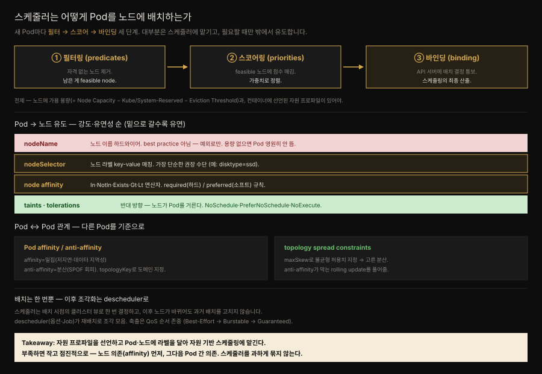
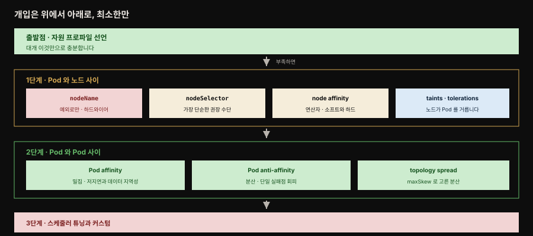

# Automated Placement — 스케줄러가 Pod를 노드에 배치하는 법

> 『Kubernetes Patterns』 6장 정독. **Automated Placement**는 새 Pod를 자원 요구와 스케줄링 정책에 맞는 노드에 배정하는 Kubernetes 스케줄러의 핵심 기능입니다. 
>
> 이 장은 스케줄링 알고리즘의 원리와 배치 결정을 밖에서 유도하는 방법을 다룹니다. 핵심 태도는 되도록 스케줄러에 맡기고 꼭 필요할 때만 최소로 개입하는 것입니다.



위쪽 화살표를 왼쪽에서 오른쪽으로 따라가면 필터링 → 스코어링 → 바인딩이 스케줄링의 전부입니다. 아래 두 상자는 그 과정이 성립하기 위한 전제이고, 맨 아래 띠가 이 장 후반부에서 descheduler가 필요해지는 이유입니다.


## 핵심 요약

> 스케줄링은 움직이는 표적입니다. 의존성도 자원도 클러스터도 모두 시간에 따라 변하기 때문입니다.

적당한 규모의 마이크로서비스 시스템은 수십에서 수백 개의 격리된 프로세스로 이루어집니다. 컨테이너와 Pod가 패키징과 배포에는 좋은 추상을 주지만, 그 프로세스들을 **적합한 노드에 배치하는 문제**는 풀어 주지 않습니다. 마이크로서비스 수가 많고 계속 늘어나는 상황에서 하나씩 노드에 배정하는 일은 관리 가능한 활동이 아닙니다.

게다가 모든 것이 변합니다. 컨테이너는 서로에 대한 의존성과 노드에 대한 의존성, 그리고 자원 수요를 갖는데 그 모두가 시간에 따라 바뀝니다. 클러스터의 가용 자원도 클러스터가 줄거나 늘면서, 또는 이미 배치된 컨테이너가 소비하면서 변합니다. 컨테이너를 어떻게 배치하느냐가 분산 시스템의 가용성·성능·용량에도 영향을 줍니다.

Kubernetes 스케줄러는 API 서버에서 새로 만들어진 Pod 정의를 가져와 노드에 배정합니다. 그런 노드가 있는 한 모든 Pod에 가장 적합한 노드를 찾아 주며, 초기 배치든 스케일 업이든 비정상 노드에서 건강한 노드로 앱을 옮기는 경우든 마찬가지입니다. 이때 런타임 의존성과 자원 요건, 고가용성을 위한 유도 정책을 고려해 Pod를 수평으로 분산하거나 성능과 저지연을 위해 가까이 배치합니다.

다만 스케줄러가 제 일을 하고 선언적 배치가 가능하려면 두 가지 전제가 필요합니다.

1. **가용 용량을 가진 노드** — 새 Pod를 돌릴 자원이 남아 있어야 합니다.
2. **선언된 자원 프로파일을 가진 컨테이너** — 2장 Predictable Demands의 내용입니다.

배치 유도의 원칙은 최소 개입입니다. 자원 기반 스케줄링으로 부족할 때만 노드 의존을 먼저, 그다음 Pod 간 의존을 표현하며 작고 점진적으로 개입하는 것이 이 장의 결론입니다.


## 학습 목표

> 이 편을 읽고 나면 다음을 설명할 수 있습니다.

1. 스케줄링 세 단계와 feasible node 개념을 설명할 수 있습니다.
2. 노드 allocatable 용량 공식과 시스템 데몬용 자원을 예약하지 않을 때 벌어지는 일을 말할 수 있습니다.
3. Kubernetes가 관리하지 않는 컨테이너가 노드에 있을 때의 우회책을 설명할 수 있습니다.
4. `nodeName`·`nodeSelector`·node affinity·taints의 차이와 강도 순서를 구분할 수 있습니다.
5. node affinity의 required와 preferred, Pod affinity의 `topologyKey`를 설명할 수 있습니다.
6. topology spread constraints가 required anti-affinity의 rolling update 문제를 어떻게 푸는지 설명할 수 있습니다.
7. taint effect 세 가지와 affinity가 opt-out, taint가 opt-in인 이유를 말할 수 있습니다.
8. descheduler가 왜 필요하고 무엇을 축출하지 않는지, 축출 순서가 어떻게 되는지 설명할 수 있습니다.


## 스케줄링 과정 — 필터 · 스코어 · 바인딩

> 스케줄러는 API 서버에서 미배정 Pod를 집어 세 단계를 거쳐 노드에 묶습니다.

노드에 아직 배정되지 않은 Pod가 만들어지면, 스케줄러가 그 Pod를 가용 노드 전체 및 필터링·우선순위 정책과 함께 집어 옵니다. 그다음 세 단계를 밟습니다.

1. **필터링(predicates)** — 자격 없는 노드를 모두 제거합니다. Pod의 스케줄링 요구를 만족하는 노드를 **feasible node**라 부릅니다.
2. **스코어링(priorities)** — 남은 feasible 노드에 점수를 매기는 함수들을 돌려 가중치 순으로 정렬합니다.
3. **바인딩(binding)** — API 서버에 배정 결정을 알립니다. 이것이 스케줄링 과정의 주된 산출입니다.

이 전체 과정을 스케줄링·배치·노드 배정·바인딩이라 부릅니다. 스케줄러는 Kubernetes에서 설정 가능성이 높고 지금도 발전하는 부분이며, API 서버나 Kubelet처럼 격리해 돌리거나 아예 쓰지 않을 수도 있는 구성요소입니다.

### 전제 하나 — 노드 가용 자원

먼저 클러스터에 새 Pod를 돌릴 자원 용량을 가진 노드가 있어야 합니다. 모든 노드는 Pod를 돌릴 용량을 가지며, 스케줄러는 Pod가 요청한 컨테이너 자원의 합이 노드의 **할당 가능(allocatable) 용량**보다 작음을 보장합니다.

```
Allocatable [앱 Pod용 용량] =
    Node Capacity [노드 전체 용량]
        - Kube-Reserved   [kubelet·컨테이너 런타임 등 Kubernetes 데몬]
        - System-Reserved [sshd·udev 등 OS 데몬]
        - Eviction Thresholds [시스템 OOM 방지용 예약 메모리]
```

OS와 Kubernetes 자체를 돌리는 시스템 데몬용 자원을 예약하지 않으면 어떻게 될까요. Pod가 노드 전체 용량까지 스케줄될 수 있고, 그러면 Pod와 시스템 데몬이 자원을 두고 다퉈 노드에 자원 기근이 생깁니다. 그렇게 되면 노드의 메모리 압박이 **OOMKilled** 에러로 그 노드의 모든 Pod에 영향을 주거나 노드를 일시적으로 오프라인으로 만들 수 있습니다.

OOMKilled는 시스템 메모리가 바닥나 Linux 커널의 OOM(Out-of-Memory) killer가 프로세스를 종료할 때 표시되는 에러입니다. Eviction threshold는 kubelet이 노드 메모리를 예약하는 **마지막 방어선**으로, 가용 메모리가 예약값 아래로 떨어지면 Pod 축출을 시도합니다.

한 가지 더 염두에 둘 것이 있습니다. Kubernetes가 관리하지 않는 컨테이너가 노드에서 돌고 있다면 그 컨테이너가 쓰는 자원은 Kubernetes의 노드 용량 계산에 **반영되지 않습니다.** 우회책은 아무 일도 하지 않지만 그 미추적 컨테이너의 사용량에 해당하는 CPU·메모리 requests만 가진 **placeholder Pod**를 띄우는 것입니다. 이 Pod는 오직 미추적 컨테이너의 자원 소비를 대표하고 예약하려 만들어지며, 스케줄러가 그 노드의 자원 모델을 더 잘 세우도록 돕습니다.

### 전제 둘 — 컨테이너 자원 수요

효율적인 Pod 배치의 또 다른 중요한 요건은 컨테이너의 런타임 의존성과 자원 수요를 정의하는 것입니다. 2장 Predictable Demands에서 자세히 다뤘습니다.

요약하면 컨테이너가 `request`와 `limit`으로 자원 프로파일을 선언해야 한다는 뜻입니다. 저장소나 포트 같은 환경 의존성도 함께 선언합니다. 그래야만 Pod가 최적으로 배정됩니다. 피크 사용 시에도 서로 영향을 주거나 자원 기근을 겪지 않고 돌 수 있습니다.

### 스케줄러 설정 — 프로파일과 플러그인

스케줄러에는 대부분의 경우 충분한 기본 predicate·priority 정책이 있습니다. v1.23 이전에는 scheduling policy로, 이후에는 **scheduling profile**로 같은 효과를 냅니다. 프로파일은 스케줄링 단계를 확장점으로 노출해 기본 구현을 오버라이드하는 플러그인을 설정하게 합니다.

```yaml
apiVersion: kubescheduler.config.k8s.io/v1
kind: KubeSchedulerConfiguration
profiles:
  - plugins:
      score:                       # 필터링 통과 노드에 점수를 주는 단계
        disabled:
        - name: PodTopologySpread  # 뒤에 볼 topology spread 구현 플러그인
        enabled:
        - name: MyCustomPlugin
          weight: 2
```

> 스케줄러 플러그인·커스텀 스케줄러는 클러스터 관리자만 정의합니다. 앱을 배포하는 일반 사용자는 미리 정의된 스케줄러를 참조만 합니다.

기본은 `default-scheduler` 프로파일입니다. 여러 스케줄러·프로파일을 돌리고 Pod가 `.spec.schedulerName`으로 쓸 프로파일을 지정할 수 있습니다(각 프로파일은 고유 이름 필요).


## 배치 유도 — 노드를 고르는 네 수단

> 대부분은 스케줄러에 맡기는 편이 낫지만, 특정 노드로 유도해야 할 때 쓸 수단이 강도 순으로 넷 있습니다.



### nodeSelector와 nodeName

대부분의 경우 Pod-노드 배정은 스케줄러에 맡기고 배치 로직을 미시관리하지 않는 편이 낫습니다. 그러나 어떤 경우에는 Pod를 특정 노드나 노드 그룹에 강제로 배정하고 싶을 수 있습니다.

`.spec.nodeSelector`는 노드가 그 Pod를 돌릴 자격을 가지려면 노드의 라벨로 존재해야 하는 key-value 쌍의 맵입니다. 예를 들어 SSD 스토리지나 GPU 가속 하드웨어가 있는 특정 노드에서 Pod를 돌리고 싶다고 해 봅시다.

```yaml
apiVersion: v1
kind: Pod
metadata:
  name: random-generator
spec:
  containers:
  - image: k8spatterns/random-generator:1.0
    name: random-generator
  nodeSelector:
    disktype: ssd          # 이 라벨을 가진 노드만 이 Pod 의 후보가 됩니다
```

이렇게 하면 `disktype=ssd` 라벨이 붙은 노드만 이 Pod를 돌릴 자격을 갖습니다.

노드에 커스텀 라벨을 붙이는 것 외에 모든 노드에 이미 있는 기본 라벨도 쓸 수 있습니다. 모든 노드는 고유한 `kubernetes.io/hostname` 라벨을 갖고 있어 호스트명으로 Pod를 배치할 수 있고, OS·아키텍처·인스턴스 타입을 가리키는 다른 기본 라벨도 배치에 유용합니다.

`nodeName`은 이보다 더 강한 방식으로 노드 이름을 직접 하드와이어합니다. 다만 이 필드는 이상적으로는 수동 배정이 아니라 정책에 이끌리는 스케줄러가 채워야 합니다. 이 방식으로 Pod를 노드에 배정하면 다른 어떤 노드로도 스케줄되지 않으며, 지정한 노드에 용량이 없거나 노드가 존재하지 않으면 **Pod는 영원히 돌지 않습니다.** Kubernetes 이전 시대로 돌아가는 셈이라 모범 사례가 아니고 예외로만 써야 합니다.

### Node Affinity

**node affinity**는 nodeSelector의 더 표현력 있는 방식으로[^affinity], 규칙을 **required**(하드) 또는 **preferred**(소프트)로 지정합니다. required는 반드시 충족돼야 스케줄되고 preferred는 매칭 노드의 가중치만 올릴 뿐 강제하지 않습니다. `In`·`NotIn`·`Exists`·`DoesNotExist`·`Gt`·`Lt` 연산자로 제약을 훨씬 풍부하게 표현합니다.

```yaml
affinity:
  nodeAffinity:
    requiredDuringSchedulingIgnoredDuringExecution:      # 하드 요건
      nodeSelectorTerms:
      - matchExpressions:
        - key: numberCores
          operator: Gt
          values: [ "3" ]                                # 코어 3개 초과 노드만
    preferredDuringSchedulingIgnoredDuringExecution:      # 소프트 요건 (가중치)
    - weight: 1
      preference:
        matchFields:
        - key: metadata.name
          operator: NotIn
          values: [ "control-plane-node" ]
```

소프트 요건은 가중치 붙은 셀렉터 목록으로, 노드마다 매칭 셀렉터 가중치 합을 계산해 하드 요건을 만족하는 한 최고값 노드를 고릅니다.

### Pod Affinity와 Anti-Affinity

node affinity가 노드 단위라면, **Pod affinity/anti-affinity**는 노드에 이미 도는 Pod를 기준으로 규칙을 표현합니다 — 고가용성을 위해 분산하거나, 저지연을 위해 밀집·공존시킬 때 씁니다. **`topologyKey`** 필드와 매칭 라벨로 node·rack·zone·region 같은 도메인 규칙을 조합합니다.

```yaml
affinity:
  podAffinity:                                           # 공존시킬 Pod 찾기
    requiredDuringSchedulingIgnoredDuringExecution:
    - labelSelector:
        matchLabels:
          confidential: high
      topologyKey: security-zone                          # 같은 security-zone 라벨 노드에 배치
  podAntiAffinity:                                        # 피할 Pod 찾기
    preferredDuringSchedulingIgnoredDuringExecution:
    - weight: 100
      podAffinityTerm:
        labelSelector:
          matchLabels:
            confidential: none
        topologyKey: kubernetes.io/hostname               # confidential=none Pod가 도는 노드는 피함(소프트)
```

node affinity처럼 하드(`requiredDuringSchedulingIgnoredDuringExecution`)·소프트(`preferred...`) 요건이 있습니다. `IgnoredDuringExecution` 접미사는 미래 확장을 위한 것으로, 지금은 노드 라벨이 바뀌어 affinity가 무효가 돼도 Pod가 계속 돕니다(런타임 변화 미반영).

### Topology Spread Constraints

Pod affinity는 한 토폴로지에 Pod를 무제한 배치하고 anti-affinity는 같은 토폴로지 공존을 금지하는데, **topology spread constraints**는 더 세밀하게 Pod를 고르게 분산합니다.

문제 상황을 봅시다. replica 2개·노드 2개 클러스터에서 SPOF를 피하려 anti-affinity로 두 Pod를 각 노드에 나눴다고 합시다. 이 설정은 합리적이지만 **rolling upgrade를 막습니다** — anti-affinity 때문에 세 번째 교체 Pod가 기존 노드에 못 놓입니다. 노드를 추가하거나 전략을 recreate로 바꿔야 합니다. topology spread constraints는 클러스터 자원이 부족할 때 **어느 정도 불균형을 허용**해 이 상황을 풉니다.

```yaml
spec:
  topologySpreadConstraints:
  - maxSkew: 1                                    # 불균형 최대 정도 (Pod 1개까지 skew 허용)
    topologyKey: topology.kubernetes.io/zone      # 같은 값이면 같은 토폴로지
    whenUnsatisfiable: DoNotSchedule              # 못 만족하면? DoNotSchedule(하드) / ScheduleAnyway(소프트)
    labelSelector:
      matchLabels:
        app: bar                                  # 이 셀렉터로 묶어 개수 세어 분산
```

`whenUnsatisfiable`이 `DoNotSchedule`이면 하드 제약(스케줄 막음), `ScheduleAnyway`면 불균형을 줄이는 노드에 우선순위를 주는 소프트 제약입니다.

### Taints와 Tolerations

node affinity가 Pod가 노드를 고르게 하는 **Pod의 속성**이라면, taints와 tolerations는 그 반대입니다. **노드가** 어떤 Pod를 받을지 받지 않을지 통제하게 합니다.

taint는 노드의 특성으로, 존재하면 Pod가 그 taint에 대한 toleration을 갖지 않는 한 그 노드로 스케줄되는 것을 막습니다. 그런 의미에서 방향이 정반대입니다.

| 수단 | 방향 | 의미 |
|------|------|------|
| affinity 규칙 | **opt-out** | 어느 노드에서 돌지 명시적으로 골라 선택되지 않은 나머지를 전부 배제합니다 |
| taints · tolerations | **opt-in** | 기본적으로 스케줄 불가인 노드에 스케줄을 허용해 들어갑니다 |

노드에 taint를 붙이는 것은 `kubectl`로 합니다.

```bash
kubectl taint nodes control-plane-node \
  node-role.kubernetes.io/control-plane="true":NoSchedule
```

그 결과 노드 리소스는 이렇게 됩니다.

```yaml
apiVersion: v1
kind: Node
metadata:
  name: control-plane-node
spec:
  taints:
  - effect: NoSchedule                            # 이 taint 를 견디는 Pod 외에는
    key: node-role.kubernetes.io/control-plane    # 이 노드를 스케줄 불가로 표시합니다
    value: "true"
```

Pod 쪽에는 매칭되는 toleration을 답니다. taint 쪽의 `key`와 `effect` 값이 toleration 쪽과 같아야 합니다.

```yaml
apiVersion: v1
kind: Pod
metadata:
  name: random-generator
spec:
  containers:
  - image: k8spatterns/random-generator:1.0
    name: random-generator
  tolerations:
  - key: node-role.kubernetes.io/control-plane   # 이 키의 taint 가 걸린 노드를 견딥니다
    operator: Exists
    effect: NoSchedule                           # 이 effect 일 때만 견딥니다
```

프로덕션 클러스터에서는 control plane 노드에 이 taint가 걸려 Pod 스케줄을 막습니다. 위와 같은 toleration이 있으면 그럼에도 이 Pod를 control plane 노드에 설치할 수 있습니다. `effect` 필드는 비워 둘 수도 있는데, 그러면 toleration이 **모든 effect에** 적용됩니다.

taint effect는 세 가지입니다.

| effect | 성격 | 동작 |
|--------|------|------|
| `NoSchedule` | 하드 | 그 노드로의 스케줄을 막습니다 |
| `PreferNoSchedule` | 소프트 | 되도록 그 노드를 피하려 합니다 |
| `NoExecute` | 축출 | 이미 노드에서 돌고 있는 Pod까지 쫓아냅니다 |

taints와 tolerations로 특정 Pod 집합만을 위한 전용 노드를 두거나, 문제 있는 노드에 taint를 걸어 Pod를 강제 축출하는 복잡한 use case를 다룰 수 있습니다.

### stranded resource를 경계한다

앱의 고가용성과 성능 요구에 맞춰 배치에 영향을 줄 수 있지만, 스케줄러를 과하게 묶어 더는 Pod를 놓지 못하고 자원이 방치되는 궁지에 스스로를 몰아넣지 않아야 합니다.

컨테이너의 자원 요건이 너무 거칠거나 노드가 너무 작으면 활용되지 못하는 **stranded resource**가 노드에 남습니다. 책의 예를 들면 어떤 노드에 메모리가 4GB 남았는데 **CPU가 하나도 남지 않아** 다른 컨테이너를 놓을 수 없는 상황입니다. 그 4GB는 있어도 쓸 수 없습니다.

완화책은 둘입니다. 자원 요건이 더 작은 컨테이너를 만들거나, Kubernetes **descheduler**로 노드를 조각모음해 활용률을 높이는 것입니다.


## Descheduler — 배치는 한 번뿐

Pod가 노드에 배정되면 스케줄러의 일은 끝나고 Pod가 삭제·재생성되지 않는 한 배치를 바꾸지 않습니다. 시간이 지나면 자원 조각화·저활용이 생깁니다. 또 스케줄러 결정은 **그 시점의 클러스터 뷰**에 기반해, 노드가 바뀌거나 추가돼도 과거 배치를 고치지 않습니다.

**descheduler**가 이를 해결합니다 — 관리자가 정리·조각모음이 필요하다 판단할 때 보통 Job으로 돌려 Pod를 재스케줄합니다. 미리 정의된 정책을 켜고 튜닝·비활성할 수 있습니다. 정책과 무관하게 descheduler는 다음을 **축출하지 않습니다**.

- 노드·클러스터 크리티컬 Pod
- ReplicaSet·Deployment·Job이 관리하지 않는 Pod(재생성 불가)
- DaemonSet이 관리하는 Pod
- 로컬 스토리지를 가진 Pod
- 축출이 규칙을 위반할 PodDisruptionBudget이 있는 Pod
- `DeletionTimestamp`가 nil이 아닌 Pod
- descheduler Pod 자신(스스로를 크리티컬로 표시)

모든 축출은 Pod의 QoS를 존중해 **Best-Effort → Burstable → Guaranteed** 순으로 후보를 고릅니다(2장).


## 최소 개입의 사다리

> 배치는 기술이라기보다 기예에 가깝고, 설정 조합은 예측이 어렵습니다. 그래서 개입을 최소화합니다.

배치는 Pod를 노드에 배정하는 기예입니다. 여러 설정의 조합은 예측하기 어려우므로 개입은 가능한 한 최소여야 합니다. 단순한 시나리오라면 자원 제약 기반 스케줄링만으로 충분합니다. 2장의 지침대로 컨테이너의 자원 요구를 모두 선언하면 스케줄러가 알아서 가장 적합한 노드에 Pod를 놓습니다.

그러나 더 현실적인 시나리오에서는 데이터 지역성·Pod 공존·앱 고가용성·효율적 클러스터 자원 활용 같은 다른 제약에 따라 특정 노드로 Pod를 스케줄하고 싶어집니다. 그때 밟는 순서가 있습니다.

**먼저 Pod와 노드 사이의 힘과 의존성을 식별합니다.** 전용 하드웨어 능력이나 효율적 자원 활용이 그 근거가 됩니다.

| 수단 | 성격 |
|------|------|
| `nodeName` | Pod를 노드에 하드와이어하는 가장 단순한 형태입니다. 지정 노드에 용량이 없거나 노드가 없으면 Pod가 영원히 돌지 않습니다. 모범 사례가 아니며 예외로만 씁니다 |
| `nodeSelector` | 라벨 맵입니다. Pod와 노드에 의미 있는 라벨을 달아 두었다면 스케줄러 선택을 통제하는 가장 단순한 권장 메커니즘입니다 |
| node affinity | 논리 연산자와 제약으로 노드 의존을 표현해 세밀한 제어를 줍니다. 소프트·하드 요건으로 엄격함도 조절합니다 |
| taints · tolerations | 기존 Pod를 수정하지 않고 노드가 Pod를 통제하게 합니다. 새 라벨을 가진 노드를 추가할 때 모든 Pod가 아니라 그 노드에 놓일 Pod에만 손대면 됩니다 |

**그다음 Pod 사이의 의존성을 식별합니다.** 강하게 결합된 앱은 Pod affinity로 공존시키고, 단일 실패점을 피하려면 anti-affinity로 분산합니다.

- **Pod affinity와 anti-affinity** — 노드가 아니라 다른 Pod에 대한 의존으로 스케줄합니다. affinity는 저지연과 데이터 지역성을 위해 여러 Pod로 구성된 앱 스택을 같은 토폴로지에 모으고, anti-affinity는 실패 도메인에 걸쳐 Pod를 흩어 단일 실패점을 피하거나 자원 집약적 Pod가 같은 노드에서 경쟁하지 않게 합니다.
- **Topology spread constraints** — 쓰려면 플랫폼 관리자가 노드에 라벨을 달아 region·zone 같은 토폴로지 정보를 제공해야 하고, Pod 설정을 만드는 사람이 그 토폴로지를 알고 제약을 지정해야 합니다. 여러 제약을 동시에 지정할 수도 있는데 **모두 만족돼야** Pod가 놓이므로 서로 충돌하지 않게 해야 합니다.

여기서 헷갈리기 쉬운 구분이 하나 있습니다. **여러 topology spread constraints**는 결과 집합을 각각 독립적으로 계산해 AND로 결합합니다. 반면 **NodeAffinity·NodeSelector와 조합**하는 것은 노드 제약의 결과를 걸러 내는(filter) 동작입니다.

**그래도 부족하면 스케줄러 자체로 내려갑니다.**

- **스케줄러 튜닝** — 필터링·우선순위 단계의 하나 이상을 바꿉니다. 확장점과 플러그인 메커니즘이 완전히 새 스케줄러 없이 작은 변경만 하도록 설계돼 있습니다.
- **커스텀 스케줄러** — 표준 스케줄러를 대체하거나 병행해 돌립니다. 하이브리드로 표준 스케줄러가 마지막 단계에 호출하는 **scheduler extender** 프로세스를 두면, 전체 스케줄러를 구현하지 않고 노드를 거르고 우선순위를 매기는 HTTP API만 제공하면 됩니다. 커스텀 스케줄러의 장점은 하드웨어 비용·네트워크 지연처럼 **클러스터 밖 요인**을 배치에 반영할 수 있다는 점입니다.

결론은 이렇습니다. 컨테이너 자원 프로파일의 크기를 재어 선언하고 Pod와 노드에 라벨을 달아 자원 소비 기반 스케줄링에 맡깁니다. 그것이 원하는 결과를 내지 못하면 작고 반복적인 변경으로 시작합니다. 노드 의존을 먼저, 그다음 Pod 간 의존을 표현하며 스케줄러에 대한 **최소한의 정책 개입**을 지향합니다.


## 심화 학습

> 본문(원서 6장) 밖에서 보강한 내용입니다. 출처를 링크로 남깁니다.

### requiredDuringSchedulingIgnoredDuringExecution — 이름이 긴 이유

책이 지나가듯 언급한 `IgnoredDuringExecution` 접미사는 affinity의 **시간적 범위**를 못박은 이름입니다. 이름을 둘로 끊어 읽으면 뜻이 분명해집니다.

- `RequiredDuringScheduling` — 스케줄 **시점**에 이 규칙을 강제합니다.
- `IgnoredDuringExecution` — 일단 스케줄된 **뒤**에는 노드 상태가 바뀌어 규칙이 깨져도 Pod를 쫓아내지 않습니다.

왜 이렇게 장황할까요. Kubernetes가 미래에 `RequiredDuringExecution`, 곧 실행 중에도 규칙이 깨지면 축출하는 변형을 추가할 여지를 이름에 남겨 뒀기 때문입니다.

실무에서 이 이름을 오해하면 곤란합니다. "노드 라벨을 바꾸면 affinity를 위반하는 Pod가 자동으로 옮겨지겠지"라고 기대해서는 안 됩니다. 지금은 재배치가 일어나지 않으며, 그것을 강제하려면 descheduler를 돌려야 합니다.

### anti-affinity와 HPA의 충돌

책이 말한 "anti-affinity가 rolling update를 막는다"는 함정은 오토스케일과도 얽힙니다. 29장 Elastic Scale의 주제입니다.

Spring Boot 앱을 HA로 굴리려고 "노드당 한 Pod"를 required anti-affinity로 강제했다고 해 봅시다. HPA가 부하 급증에 replica를 늘려도 **노드 수보다 많은 Pod를 띄우지 못해** 스케일아웃이 막힙니다. 노드가 3대면 replica가 3에서 멈추는 것입니다.

그래서 실무에서는 두 갈래를 씁니다.

1. required 대신 **preferred anti-affinity**를 써서 소프트 제약으로 둡니다.
2. **topology spread constraints**의 `maxSkew`로 "되도록 분산하되 부족하면 겹침 허용"을 표현합니다.

책이 topology spread를 anti-affinity의 대안으로 든 이유가 바로 이 유연성입니다.

> 스케줄링·노드 선택·토폴로지 분산의 개념 메커니즘은 개념 노트 [스케줄링과 노드 선택](../../kubernetes/05_scheduling/05-01.%EC%8A%A4%EC%BC%80%EC%A4%84%EB%A7%81%EA%B3%BC%20%EB%85%B8%EB%93%9C%20%EC%84%A0%ED%83%9D.md)·[토폴로지 분산과 중단 정책](../../kubernetes/05_scheduling/05-02.%ED%86%A0%ED%8F%B4%EB%A1%9C%EC%A7%80%20%EB%B6%84%EC%82%B0%EA%B3%BC%20%EC%A4%91%EB%8B%A8%20%EC%A0%95%EC%B1%85.md)에 상세합니다.

- 출처: [Assigning Pods to Nodes (Kubernetes 공식)](https://kubernetes.io/docs/concepts/scheduling-eviction/assign-pod-node/) (2026-07-12 조회)
- 출처: [Pod Topology Spread Constraints (Kubernetes 공식)](https://kubernetes.io/docs/concepts/scheduling-eviction/topology-spread-constraints/)


## 능동 회상

> 먼저 스스로 답해 본 뒤 아래 정답 절에서 맞춰 봅니다. 정답은 이 절 다음에 번호 순서대로 있습니다.

1. 스케줄링이 "움직이는 표적"인 이유를 세 가지로 말해 보세요.
2. 스케줄링 세 단계는 무엇이며 각 단계의 산출은 무엇인가요? feasible node 는 어느 단계의 결과인가요?
3. 노드의 allocatable 용량은 어떻게 계산되나요?
4. 시스템 데몬용 자원을 예약하지 않으면 어떤 일이 벌어지나요? OOMKilled 는 무엇인가요?
5. Kubernetes 가 관리하지 않는 컨테이너가 노드에 있으면 무엇이 문제이고 우회책은 무엇인가요?
6. 스케줄러 설정은 v1.23 전후로 어떻게 달라졌나요? 누가 정의해야 하나요?
7. `nodeName` 을 수동으로 지정하면 어떤 위험이 있나요?
8. node affinity 가 nodeSelector 보다 나은 점 두 가지는 무엇인가요?
9. Pod affinity 가 node affinity 와 다른 점은 무엇이며 `topologyKey` 는 무슨 역할을 하나요?
10. `IgnoredDuringExecution` 접미사는 무엇을 뜻하며 왜 그런 이름인가요?
11. replica 2개·노드 2대에서 required anti-affinity 를 걸면 rolling upgrade 에 무슨 일이 생기나요? 해법은 무엇인가요?
12. `maxSkew`·`topologyKey`·`whenUnsatisfiable`·`labelSelector` 는 각각 무엇을 정하나요?
13. affinity 가 opt-out 이고 taint 가 opt-in 이라는 말은 무슨 뜻인가요?
14. taint effect 세 가지와 각각의 동작을 말해 보세요.
15. stranded resource 란 무엇인가요? 책이 든 구체적 예와 완화책을 말해 보세요.
16. descheduler 가 필요한 이유 두 가지는 무엇인가요?
17. descheduler 가 축출하지 않는 Pod 를 다섯 가지 이상 들어 보세요. 축출 순서는 무엇을 따르나요?
18. 여러 topology spread constraints 를 쓰는 것과 NodeAffinity 와 조합하는 것은 무엇이 다른가요?


## 정답

> 위 회상 질문의 답입니다. 번호가 대응합니다.

**1.** 첫째, 컨테이너가 서로에 대한 의존성과 노드에 대한 의존성과 자원 수요를 갖는데 그 모두가 시간에 따라 바뀝니다. 둘째, 클러스터의 가용 자원도 클러스터가 줄거나 늘면서 또는 이미 배치된 컨테이너가 소비하면서 변합니다. 셋째, 배치 방식 자체가 분산 시스템의 가용성·성능·용량에 영향을 줍니다.

**2.** 필터링에서 자격 없는 노드를 모두 제거하며 남은 것이 **feasible node** 입니다. 스코어링에서 남은 feasible 노드에 점수를 매겨 가중치 순으로 정렬합니다. 바인딩에서 API 서버에 배정 결정을 알리며 이것이 스케줄링의 주된 산출입니다.

**3.** 노드 전체 용량에서 셋을 뺍니다. kubelet·컨테이너 런타임 같은 Kubernetes 데몬 몫인 Kube-Reserved, sshd·udev 같은 OS 데몬 몫인 System-Reserved, 그리고 시스템 OOM 방지용 예약 메모리인 Eviction Thresholds 입니다.

**4.** Pod 가 노드 전체 용량까지 스케줄될 수 있어 Pod 와 시스템 데몬이 자원을 두고 다투고 노드에 자원 기근이 생깁니다. 그 결과 노드의 메모리 압박이 OOMKilled 에러로 그 노드 모든 Pod 에 영향을 주거나 노드를 일시 오프라인으로 만들 수 있습니다. OOMKilled 는 시스템 메모리가 바닥나 Linux 커널의 OOM killer 가 프로세스를 종료할 때 표시되는 에러입니다.

**5.** 그 컨테이너가 쓰는 자원이 Kubernetes 의 노드 용량 계산에 반영되지 않는 것이 문제입니다. 우회책은 아무 일도 하지 않지만 미추적 컨테이너의 사용량에 해당하는 CPU·메모리 requests 만 가진 **placeholder Pod** 를 띄워, 스케줄러가 그 노드의 자원 모델을 더 잘 세우게 하는 것입니다.

**6.** v1.23 이전에는 scheduling policy 로 predicate 와 priority 를 설정했습니다. 이후 버전은 **scheduling profile** 로 같은 효과를 냅니다. 프로파일은 스케줄링 과정의 각 단계를 확장점으로 노출해 기본 구현을 오버라이드하는 플러그인을 설정하게 합니다. 스케줄러 플러그인과 커스텀 스케줄러는 **클러스터 관리자만** 정의해야 합니다. 앱을 배포하는 일반 사용자는 미리 정의된 스케줄러를 참조만 합니다.

**7.** 그 Pod 가 다른 어떤 노드로도 스케줄되지 않습니다. 지정한 노드에 용량이 없거나 노드가 존재하지 않으면 **Pod 가 영원히 돌지 않습니다.** 이 필드는 이상적으로 정책에 이끌리는 스케줄러가 채워야 하며, 수동 지정은 모범 사례가 아니라 예외로만 써야 합니다.

**8.** 첫째, 규칙을 required 와 preferred 로 나눠 지정할 수 있습니다. required 는 반드시 충족돼야 스케줄되고 preferred 는 매칭 노드의 가중치만 올릴 뿐 강제하지 않습니다. 둘째, `In`·`NotIn`·`Exists`·`DoesNotExist`·`Gt`·`Lt` 같은 연산자로 표현할 수 있는 제약의 종류가 훨씬 넓어집니다.

**9.** node affinity 는 노드 granularity 에서 동작하지만 Pod affinity 는 노드에 한정되지 않고 **이미 노드에서 돌고 있는 Pod 를 기준으로** 여러 토폴로지 수준의 규칙을 표현합니다. `topologyKey` 는 매칭 라벨과 함께 node·rack·클라우드 zone·region 같은 도메인 규칙을 조합하게 해 줍니다.

**10.** 스케줄 시점에는 규칙을 강제하지만 일단 스케줄된 뒤에는 노드 상태가 바뀌어 규칙이 깨져도 Pod 를 쫓아내지 않는다는 뜻입니다. 미래에 `RequiredDuringExecution` 변형을 추가할 여지를 남겨 둔 이름이라 이렇게 장황합니다.

**11.** 세 번째 교체 Pod 를 기존 두 노드 어디에도 놓을 수 없어 rolling upgrade 가 막힙니다. 노드를 추가하거나 Deployment 전략을 recreate 로 바꿔야 합니다. 더 나은 해법은 topology spread constraints 로, 클러스터 자원이 부족할 때 **어느 정도의 불균형을 허용**해 세 번째 Pod 를 두 노드 중 하나에 놓게 합니다.

**12.** `maxSkew` 는 Pod 가 토폴로지에서 불균등하게 분포할 수 있는 최대 정도를 정합니다. `topologyKey` 는 노드 라벨의 키로, 같은 값을 가지면 같은 토폴로지로 간주됩니다. `whenUnsatisfiable` 은 `maxSkew` 를 만족할 수 없을 때의 동작을 정하며 `DoNotSchedule` 은 스케줄을 막는 하드 제약, `ScheduleAnyway` 는 불균형을 줄이는 노드에 우선순위를 주는 소프트 제약입니다. `labelSelector` 는 이 셀렉터에 매칭되는 Pod 들을 한 묶음으로 세어 분산합니다.

**13.** affinity 규칙은 어느 노드에서 돌지 명시적으로 골라 선택되지 않은 나머지를 전부 배제하므로 **opt-out** 입니다. taints 와 tolerations 는 기본적으로 스케줄 불가인 노드에 스케줄을 허용해 들어가는 것이므로 **opt-in** 입니다.

**14.** `NoSchedule` 은 하드 taint 로 그 노드로의 스케줄을 막습니다. `PreferNoSchedule` 은 소프트 taint 로 되도록 그 노드를 피하려 합니다. `NoExecute` 는 이미 노드에서 돌고 있는 Pod 까지 축출합니다.

**15.** 자원 요건이 너무 거칠거나 노드가 너무 작아 활용되지 못하고 노드에 남는 자원입니다. 책의 예는 어떤 노드에 메모리 4GB 가 남았는데 CPU 가 하나도 남지 않아 다른 컨테이너를 놓을 수 없는 상황입니다. 완화책은 자원 요건이 더 작은 컨테이너를 만들거나 descheduler 로 노드를 조각모음하는 것입니다.

**16.** 첫째, Pod 가 노드에 배정되면 스케줄러의 일은 끝나고 Pod 가 삭제·재생성되지 않는 한 배치를 바꾸지 않아 시간이 지나면 자원 조각화와 저활용이 생깁니다. 둘째, 스케줄러 결정은 새 Pod 를 스케줄하는 **그 시점의 클러스터 뷰**에 기반해, 노드의 자원 프로파일이 바뀌거나 새 노드가 추가돼도 과거 배치를 고치지 않습니다.

**17.** 노드·클러스터 크리티컬 Pod, ReplicaSet·Deployment·Job 이 관리하지 않아 재생성 불가한 Pod, DaemonSet 이 관리하는 Pod, 로컬 스토리지를 가진 Pod, 축출이 규칙을 위반할 PodDisruptionBudget 이 있는 Pod, `DeletionTimestamp` 가 nil 이 아닌 Pod, 그리고 스스로를 크리티컬로 표시한 descheduler Pod 자신입니다. 모든 축출은 Pod 의 QoS 를 존중해 **Best-Effort → Burstable → Guaranteed** 순으로 후보를 고릅니다.

**18.** 여러 topology spread constraints 는 결과 집합을 각각 **독립적으로 계산해 AND 로 결합**합니다. 반면 NodeAffinity·NodeSelector 와 조합하는 것은 노드 제약의 **결과를 걸러 내는(filter)** 동작입니다. 전자는 모두 만족돼야 Pod 가 놓이므로 서로 충돌하지 않게 해야 합니다.


## 실무 적용

- **먼저 자원 프로파일 선언에 맡긴다.** 2장대로 request·limit을 선언하면 대부분 스케줄러가 알아서 최적 배치합니다. 개입은 그걸로 부족할 때만.
- **노드 유도는 nodeSelector부터.** nodeName은 예외로만(용량 없으면 Pod가 영원히 안 뜸). 세밀한 제약이 필요하면 node affinity로 올립니다.
- **HA 분산은 required anti-affinity 대신 topology spread.** required anti-affinity는 rolling update·HPA 스케일아웃을 막습니다. `maxSkew`로 "되도록 분산, 부족하면 겹침 허용"을 씁니다.
- **전용 노드는 taint로 격리.** GPU·control plane 같은 노드에 taint를 걸고 그걸 견디는 Pod만 toleration으로 올립니다. 새 노드 추가 시 Pod 전체가 아니라 해당 Pod에만 라벨을 답니다.
- **조각화는 descheduler로 정리.** 스케줄러는 배치를 한 번만 하므로, 노드가 동적으로 바뀌는 클러스터는 descheduler Job으로 주기적으로 조각모음합니다.
- **stranded resource를 경계한다.** 자원 요건이 너무 거칠거나 노드가 너무 작으면 활용 못 하는 자원이 생깁니다. 작은 요건이나 노드 크기 재조정으로 완화합니다.


## 체크리스트

- [ ] 스케줄링 세 단계와 feasible node 를 설명할 수 있습니까?
- [ ] 노드 allocatable 용량 공식과 예약을 빠뜨렸을 때의 결과를 압니까?
- [ ] 미추적 컨테이너에 대한 placeholder Pod 우회책을 설명할 수 있습니까?
- [ ] `nodeName`·`nodeSelector`·node affinity·taints 의 차이와 강도 순서를 구분할 수 있습니까?
- [ ] node affinity 의 required 와 preferred, Pod affinity 의 `topologyKey` 를 설명할 수 있습니까?
- [ ] topology spread constraints 가 required anti-affinity 의 rolling update 문제를 어떻게 푸는지 압니까?
- [ ] taint effect 세 가지와 affinity(opt-out) 대 taint(opt-in) 차이를 압니까?
- [ ] descheduler 가 왜 필요하고 무엇을 축출하지 않는지, 축출 순서가 무엇인지 설명할 수 있습니까?
- [ ] 여러 topology spread constraints 의 AND 결합과 NodeAffinity 조합의 filter 차이를 구분합니까?


## 면접 관점

**Q. Kubernetes 스케줄러는 Pod를 어떻게 노드에 배치합니까?**
세 단계입니다. 필터링에서 자격 없는 노드를 걸러 feasible node를 남기고 스코어링에서 남은 노드에 점수를 매겨 가중치로 정렬하고 바인딩에서 API 서버에 배정 결정을 알립니다. 전제로 노드에 가용 용량과 컨테이너에 선언된 자원 프로파일이 있어야 하고 스케줄러는 배치에 requests만 봅니다.

**Q. node affinity와 taints·tolerations는 무엇이 다릅니까?**
node affinity는 Pod가 노드를 고르는 opt-out 방식으로, 선택한 노드만 쓰고 나머지를 배제합니다. taints·tolerations는 반대로 노드가 Pod를 거르는 opt-in 방식으로, taint가 걸린 노드는 그걸 견디는 toleration을 가진 Pod만 받습니다. 새 노드를 추가할 때 taint 쪽은 모든 Pod가 아니라 그 노드에 놓일 Pod에만 toleration을 달면 됩니다.

**Q. required anti-affinity로 HA를 구성하면 어떤 문제가 생깁니까?**
"노드당 한 Pod"를 required anti-affinity로 강제하면, 노드 수보다 많은 Pod를 못 띄웁니다. 그래서 세 번째 교체 Pod를 놓을 곳이 없어 rolling update가 막히고 HPA가 replica를 늘려도 노드 수에서 스케일아웃이 멈춥니다. topology spread constraints의 maxSkew로 "되도록 분산하되 부족하면 겹침 허용"을 쓰면 이 유연성이 생깁니다.

**Q. descheduler는 왜 필요하고 무엇을 하지 않습니까?**
스케줄러는 배치 시점의 클러스터 뷰로 한 번 결정하고 이후 노드가 바뀌어도 과거 배치를 고치지 않아, 시간이 지나면 조각화·저활용이 생깁니다. descheduler는 Job으로 돌려 Pod를 재스케줄해 조각모음합니다. 단 재생성 불가한 Pod(ReplicaSet/Deployment/Job 미관리), DaemonSet Pod, 로컬 스토리지 Pod, PDB 위반 Pod 등은 축출하지 않고 축출 순서는 QoS(Best-Effort → Burstable → Guaranteed)를 존중합니다.


## 참고 자료

- 원서: 《Kubernetes Patterns, Second Edition》(Bilgin Ibryam·Roland Huß, O'Reilly) Ch6. Automated Placement
- 이 책의 MOC: [Kubernetes Patterns 정독 인덱스](./README.md) · 앞 편: [Managed Lifecycle](./05-01.Managed%20Lifecycle%20%E2%80%94%20%ED%94%8C%EB%9E%AB%ED%8F%BC%EC%9D%98%20%EC%83%9D%EC%95%A0%EC%A3%BC%EA%B8%B0%20%EC%9D%B4%EB%B2%A4%ED%8A%B8%EC%97%90%20%EB%B0%98%EC%9D%91%ED%95%98%EA%B8%B0.md)
- 관련 편: [Predictable Demands](./02-01.Predictable%20Demands%20%E2%80%94%20%EC%9E%90%EC%9B%90%20%EC%9A%94%EA%B5%AC%EB%A5%BC%20%EC%84%A0%EC%96%B8%ED%95%B4%20%EC%8A%A4%EC%BC%80%EC%A4%84%EB%9F%AC%EC%97%90%20%EC%95%8C%EB%A6%AC%EA%B8%B0.md) — 자원 프로파일·QoS
- 개념 노트: [스케줄링과 노드 선택](../../kubernetes/05_scheduling/05-01.%EC%8A%A4%EC%BC%80%EC%A4%84%EB%A7%81%EA%B3%BC%20%EB%85%B8%EB%93%9C%20%EC%84%A0%ED%83%9D.md) · [토폴로지 분산과 중단 정책](../../kubernetes/05_scheduling/05-02.%ED%86%A0%ED%8F%B4%EB%A1%9C%EC%A7%80%20%EB%B6%84%EC%82%B0%EA%B3%BC%20%EC%A4%91%EB%8B%A8%20%EC%A0%95%EC%B1%85.md)
- [Assigning Pods to Nodes (Kubernetes 공식)](https://kubernetes.io/docs/concepts/scheduling-eviction/assign-pod-node/) · [Descheduler for Kubernetes](https://github.com/kubernetes-sigs/descheduler)

[^affinity]: Kubernetes — nodeSelector·node affinity·Pod affinity·taints 의 필드 계약.
<https://kubernetes.io/docs/concepts/scheduling-eviction/assign-pod-node/>
- 저자 예제 코드: [k8spatterns/examples](https://github.com/k8spatterns/examples)
