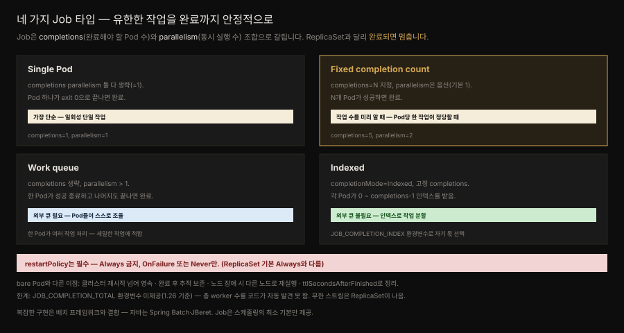

# Batch Job — 유한한 작업을 완료까지 안정적으로
---
> 『Kubernetes Patterns』 7장 정독. **Batch Job**은 격리된 원자적 작업 단위를 다루는 패턴으로, **Job 리소스**에 기반합니다. Job은 분산 환경에서 짧게 사는 Pod를 완료까지 안정적으로 돌립니다. 지금까지의 패턴이 계속 도는 워크로드였다면, 여기서 처음으로 "정해진 유한한 일을 하고 멈추는" 워크로드가 등장합니다.


## 핵심 요약

> Pod를 만드는 방식은 여럿입니다 — bare Pod(노드 장애 시 재시작 안 됨), ReplicaSet(계속 도는 프로세스), DaemonSet(노드마다 하나). 이들의 공통점은 멈추지 않을 장기 실행 프로세스라는 것입니다. 그런데 미리 정의된 유한한 작업 단위를 안정적으로 수행하고 컨테이너를 내려야 할 때가 있습니다. 그것이 **Job**입니다. Job은 ReplicaSet과 비슷하게 Pod를 만들지만 **기대한 수의 Pod가 성공 종료하면 완료**로 보고 더 만들지 않습니다.

Job의 동작을 정하는 두 필드가 핵심입니다 — `completions`(성공 완료해야 할 Pod 수)와 `parallelism`(동시 실행 Pod 수). 이 둘의 조합으로 네 타입이 됩니다: **single Pod**, **fixed completion count**, **work queue**, **indexed**. 그리고 Job에는 `restartPolicy`가 필수인데, ReplicaSet 기본값 `Always`가 **금지**되고 `OnFailure` 또는 `Never`만 허용됩니다.

bare Pod 대신 Job을 쓰는 이유는 안정성·확장성입니다 — 클러스터 재시작을 넘어 영속하고 완료 후 추적을 위해 보존되며 노드 장애 시 다른 노드로 재실행됩니다. 복잡한 구현은 Job에 배치 프레임워크(자바는 Spring Batch·JBeret)를 결합해 완성합니다.


## 학습 목표

> 이 편을 읽고 나면 다음을 설명할 수 있습니다.

- Job과 ReplicaSet의 차이(완료 후 멈춤 vs 계속 실행), Job에서 `restartPolicy: Always`가 금지되는 이유를 설명한다.
- `completions`·`parallelism` 조합으로 만들어지는 네 Job 타입을 구분한다.
- work queue Job과 indexed Job의 차이(외부 큐 의존 vs 인덱스 자체 분할)를 안다.
- `JOB_COMPLETION_INDEX`가 무엇이고 `JOB_COMPLETION_TOTAL`이 왜 없는지 설명한다.
- Job vs bare Pod의 안정성 이점, "one Job per work item" vs "one Job for all"의 트레이드오프를 안다.


## 본문 정리

### 문제 — 계속 도는 것 말고 끝나는 일

Kubernetes의 주 프리미티브 Pod를 만드는 방식은 성격이 다릅니다.

- **bare Pod**: 수동 생성. 노드가 죽으면 **재시작되지 않습니다**. 개발·테스트 외엔 권장하지 않습니다(unmanaged/naked Pod).
- **ReplicaSet**: 계속 돌아야 할 Pod(웹 서버 등)의 안정적 개수를 유지합니다(11장 Stateless Service).
- **DaemonSet**: 모든 노드에 Pod 하나씩, 모니터링·로그·스토리지 등 플랫폼 기능용(9장).

이들의 공통점은 멈추지 않을 장기 실행 프로세스입니다. 그런데 미리 정의된 유한한 작업을 안정적으로 수행하고 컨테이너를 내려야 할 때, Kubernetes는 **Job**을 제공합니다.

### Solution — Job 리소스

Job은 ReplicaSet처럼 하나 이상의 Pod를 만들어 성공 실행을 보장하지만 **기대 수의 Pod가 성공 종료하면 완료**로 보고 더 시작하지 않습니다.

```yaml
apiVersion: batch/v1
kind: Job
metadata:
  name: random-generator
spec:
  completions: 5              # 5개 Pod가 완료까지 성공해야 함
  parallelism: 2              # 2개까지 병렬 실행
  ttlSecondsAfterFinished: 300  # 완료 후 5분 보존하고 GC
  template:
    spec:
      restartPolicy: OnFailure  # Job엔 필수 — OnFailure 또는 Never만 (Always 금지)
      containers:
      - image: k8spatterns/random-generator:1.0
        name: random-generator
        command: [ "java", "RandomRunner", "/numbers.txt", "10000" ]
```

Job과 ReplicaSet의 결정적 차이는 `restartPolicy`입니다. ReplicaSet 기본은 `Always`로, 늘 돌아야 할 프로세스에 맞습니다. Job에는 `Always`가 **허용되지 않고** `OnFailure`·`Never`만 가능합니다.

**bare Pod 대신 Job을 쓰는 이유**는 안정성·확장성입니다.

- Job은 메모리 위 임시 작업이 아니라 **클러스터 재시작을 넘어 영속**하는 작업입니다.
- 완료돼도 삭제되지 않고 **추적을 위해 보존**됩니다(Pod도 로그 검사용으로 남음). `ttlSecondsAfterFinished`로 일정 시간 뒤 정리할 수 있습니다.
- `completions`로 여러 번 완료를, `parallelism`으로 동시에 여러 Pod를 실행합니다.
- `.spec.suspend`를 `true`로 하면 활성 Pod가 삭제되고 `false`로 재개하면 다시 시작됩니다.
- 노드 장애·축출 시 **스케줄러가 건강한 노드에 재배치·재실행**합니다. bare Pod는 실패 상태로 남습니다.

### 네 가지 Job 타입

`completions`·`parallelism` 조합으로 타입이 갈립니다.



- **Single Pod**: 둘 다 생략(=1). Pod 하나가 exit 0으로 끝나면 완료. 가장 단순.
- **Fixed completion count**: `completions`를 필요 수로, `parallelism`은 옵션(기본 1). `completions` 수만큼 성공하면 완료. **작업 수를 미리 알고 Pod당 한 작업이 정당할 때** 최선.
- **Work queue**: `completions`를 비우고 `parallelism > 1`. **한 Pod가 성공 종료하고 나머지도 다 끝나면** 완료. Pod들이 스스로 조율해 각자 무엇을 할지 정해야 합니다(외부 큐에서 작업을 하나씩 집는 식). 큐가 빈 걸 처음 감지하고 성공 종료한 Pod가 완료를 알립니다. **한 Pod가 여러 작업을 처리**하므로 Pod당 오버헤드가 정당하지 않은 세밀한 작업에 좋습니다.
- **Indexed**: `completionMode: Indexed` + 고정 `completions`. 각 Pod가 **0 ~ completions-1** 인덱스를 받습니다. 인덱스는 Pod annotation `batch.kubernetes.io/job-completion-index`(14장 Self Awareness) 또는 환경변수 `JOB_COMPLETION_INDEX`로 접근합니다. **외부 큐 없이** 각 Pod가 인덱스로 자기 몫을 골라 작업을 분할합니다(예: 비디오 프레임 범위 처리).

```yaml
# indexed Job — JOB_COMPLETION_INDEX로 파일의 특정 라인 범위를 각 Pod가 처리
spec:
  completionMode: Indexed
  completions: 5
  parallelism: 5
  template:
    spec:
      containers:
      - image: alpine
        name: split
        command:
        - "sh"
        - "-c"
        - |
          start=$(expr $JOB_COMPLETION_INDEX \* 10000)
          end=$(expr $JOB_COMPLETION_INDEX \* 10000 + 10000)
          awk "NR>=$start && NR<$end" /logs/random.log > /logs/random-$JOB_COMPLETION_INDEX.txt
      restartPolicy: OnFailure
```

> **작업 분할의 한계.** work queue Job은 외부 시스템이 작업을 나눠 큐에 넣어 줘야 합니다. indexed Job은 외부 큐 없이 스스로 나누지만 각 Pod가 자기 정체(`JOB_COMPLETION_INDEX`)·총 worker 수·전체 작업 크기를 알아야 합니다. 문제는 앱 코드가 **총 worker 수(`.spec.completions`)를 자동 발견할 수 없다**는 것입니다. `JOB_COMPLETION_TOTAL` 같은 환경변수가 있으면 좋겠지만 **1.26 기준 미제공**입니다(런타임에 환경변수를 못 바꿔 resizable Job을 복잡하게 만든다는 우려 때문). 우회책은 총 수를 코드에 하드코딩하거나(K8s 선언과 결합돼 불완전), `.spec.completions`를 환경변수·인자로 복사(변경 시 두 곳을 고쳐야 함)하는 것입니다. 무한 스트림 작업은 Job이 아니라 ReplicaSet이 낫습니다.

### Discussion — 작업을 Job에 어떻게 매핑할까

Job은 CronJob 같은 다른 프리미티브가 기반하는 기본 프리미티브입니다. 다만 Job은 작업 항목을 Job·Pod에 어떻게 매핑할지 지시하지 않아, 트레이드오프를 보고 결정해야 합니다.

- **One Job per work item**: 각 작업이 독립 기록·추적·스케일돼야 하는 복잡한 작업일 때 유용. 단 Job 생성 오버헤드와 대량 Job 관리 부담이 있습니다.
- **One Job for all work items**: 개별 추적이 필요 없는 대량 작업일 때. 이 경우 작업 항목을 **앱 안 배치 프레임워크**로 관리합니다.

Job은 작업 스케줄링의 최소 기본만 제공합니다. 복잡한 구현은 Job에 배치 프레임워크(자바는 **Spring Batch·JBeret**)를 결합해 완성합니다. Job으로 짧게 사는 작업을 필요할 때만 실행하면 ReplicaSet 같은 장기 추상보다 자원을 아껴 다른 워크로드에 돌립니다.


## 심화 학습

> 본문(원서 7장) 밖에서 보강한 내용입니다. 출처를 링크로 남깁니다.

### Spring Batch on Kubernetes — Job과 배치 프레임워크의 경계

이 장이 "복잡한 구현은 Spring Batch를 결합하라"고 짚은 지점은, 실무에서 **누가 무엇을 담당하는가**의 경계 문제로 나타납니다. Kubernetes Job과 Spring Batch는 겹치는 듯 다릅니다 — Job은 *Pod 수준의 실행·재시도·병렬*을 관리하고 Spring Batch는 *애플리케이션 수준의 청크 처리·스텝·재시작 지점(restartability)·읽기/처리/쓰기 파이프라인*을 관리합니다. 둘을 어떻게 조합하느냐가 설계 결정입니다.

한 가지 방식은 Spring Batch의 **partitioning**을 Kubernetes indexed Job에 얹는 것입니다. Spring Batch가 데이터를 파티션으로 나누고 각 파티션을 indexed Job의 한 Pod가 `JOB_COMPLETION_INDEX`로 골라 처리합니다 — 이 장이 indexed Job의 예로 든 "인덱스로 작업 분할"을 배치 프레임워크가 정교하게 하는 셈입니다. 다른 방식은 Spring Batch의 `JobLauncher`를 단일 Pod Job으로 띄우고 파티셔닝·병렬을 전부 앱 안에서 하는 것으로, 이 장의 "one Job for all work items"에 해당합니다. 전자는 K8s가 병렬을 관리(관측·재시도가 K8s 도구로)하고 후자는 앱이 관리(배치 메타데이터 DB로 재시작 지점 추적)합니다.

여기서 이 장의 `JOB_COMPLETION_TOTAL` 부재가 실무 함정으로 돌아옵니다 — Spring Batch partitioner가 "총 파티션 수"를 알아야 그리드 크기를 정하는데, 그 값을 K8s가 환경변수로 안 주니 `completions` 값을 별도 환경변수·`application.yaml`로 앱에 명시적으로 전달해야 합니다. 이 값과 Job의 `completions`가 어긋나면 파티션이 빠지거나 중복됩니다.

> Job의 실행·상태·suspend·자동삭제 메커니즘은 형제 정독본 [Job 기초](../kubernetes-in-action/18-01.Job%20%EA%B8%B0%EC%B4%88%20%E2%80%94%20%EC%8B%A4%ED%96%89%C2%B7%EC%83%81%ED%83%9C%C2%B7suspend%C2%B7%EC%9E%90%EB%8F%99%EC%82%AD%EC%A0%9C.md)에, 병렬·완료 모드는 같은 정독본 18-02에 상세합니다.

- 출처: [Spring Batch on Kubernetes (Spring 공식 블로그)](https://spring.io/blog/2021/01/27/spring-batch-on-kubernetes-efficient-batch-processing-at-scale) — 저자가 7장 More Information에서 든 참고 (2026-07-12 조회)
- 출처: [Kubernetes — Jobs (공식)](https://kubernetes.io/docs/concepts/workloads/controllers/job/)


## 실무 적용

- **끝나는 작업은 bare Pod가 아니라 Job으로.** 노드 장애 시 재실행·완료 후 추적 보존·클러스터 재시작 영속이 필요하면 Job입니다.
- **작업 수를 알면 fixed completion count, 세밀하면 work queue, 자체 분할이면 indexed.** Pod당 오버헤드가 정당한지로 fixed vs work-queue를 가릅니다.
- **`restartPolicy`는 `OnFailure`나 `Never`.** Job에 `Always`를 쓰면 거부됩니다. 재시도 성격이면 OnFailure, 실패를 남겨 조사하려면 Never.
- **완료 Pod 정리는 `ttlSecondsAfterFinished`.** 안 걸면 완료 Job·Pod가 계속 쌓입니다.
- **총 worker 수는 앱에 명시 전달한다.** `JOB_COMPLETION_TOTAL`이 없으니, Spring Batch partitioner 등에는 `completions` 값을 환경변수·설정으로 넘기고 Job 선언과 일치시킵니다.
- **복잡한 배치는 프레임워크와 결합.** 청크 처리·재시작 지점은 Spring Batch/JBeret가, Pod 병렬·재시도·관측은 Job이 담당하게 나눕니다.


## 체크리스트

- [ ] Job과 ReplicaSet의 차이(완료 후 멈춤), `restartPolicy: Always` 금지 이유를 설명할 수 있다.
- [ ] `completions`·`parallelism` 조합으로 네 Job 타입을 구분할 수 있다.
- [ ] work queue(외부 큐 의존)와 indexed(인덱스 자체 분할)의 차이를 안다.
- [ ] `JOB_COMPLETION_INDEX`의 역할과 `JOB_COMPLETION_TOTAL`이 없는 이유·우회책을 안다.
- [ ] Job vs bare Pod의 안정성 이점 네 가지를 댈 수 있다.
- [ ] "one Job per work item" vs "one Job for all"의 트레이드오프를 안다.
- [ ] Spring Batch와 Kubernetes Job의 담당 경계(앱 수준 vs Pod 수준)를 설명할 수 있다.


## 면접 관점

**Q. Job과 ReplicaSet은 무엇이 다릅니까?**
둘 다 Pod를 만들어 실행을 보장하지만 ReplicaSet은 계속 도는 프로세스의 개수를 유지하고 Job은 기대 수의 Pod가 성공 종료하면 완료로 보고 더 만들지 않습니다. 그래서 Job은 `restartPolicy: Always`가 금지되고 OnFailure나 Never만 허용됩니다 — 끝나야 할 작업에 Always는 모순이기 때문입니다.

**Q. work queue Job과 indexed Job은 어떻게 다릅니까?**
work queue는 `completions`를 비우고 parallelism만 키웁니다. 외부 큐가 작업을 나눠 주고 Pod들이 큐에서 하나씩 집어 처리하다 큐가 비면 종료합니다. indexed는 `completionMode: Indexed`로 각 Pod에 0~completions-1 인덱스를 주고 외부 큐 없이 각 Pod가 `JOB_COMPLETION_INDEX`로 자기 몫을 계산해 분할합니다.

**Q. indexed Job에서 총 worker 수를 코드가 알아야 할 때 문제가 무엇입니까?**
Kubernetes가 `.spec.completions` 값을 `JOB_COMPLETION_TOTAL` 같은 환경변수로 자동 제공하지 않기 때문입니다(1.26 기준). 그래서 총 수를 코드에 하드코딩하거나 completions 값을 환경변수·인자로 명시 전달해야 하는데, 후자는 completions를 바꿀 때 두 곳을 고쳐야 하는 결합이 생깁니다.

**Q. Kubernetes Job과 Spring Batch는 각각 무엇을 담당합니까?**
Job은 Pod 수준의 실행·재시도·병렬·완료 판정을 관리하고 Spring Batch는 앱 수준의 청크 처리·스텝·재시작 지점·읽기/처리/쓰기 파이프라인을 관리합니다. 예컨대 Spring Batch partitioning을 indexed Job에 얹으면, 파티션 분할은 Spring Batch가 하고 각 파티션 실행은 indexed Job의 Pod가 인덱스로 골라 처리합니다.


## 참고 자료

- 원서: 《Kubernetes Patterns, Second Edition》(Bilgin Ibryam·Roland Huß, O'Reilly) Ch7. Batch Job
- 이 책의 MOC: [Kubernetes Patterns 정독 인덱스](./README.md) · 앞 편: [Automated Placement](./06-01.Automated%20Placement%20%E2%80%94%20%EC%8A%A4%EC%BC%80%EC%A4%84%EB%9F%AC%EA%B0%80%20Pod%EB%A5%BC%20%EB%85%B8%EB%93%9C%EC%97%90%20%EB%B0%B0%EC%B9%98%ED%95%98%EB%8A%94%20%EB%B2%95.md)
- 형제 정독본: [Job 기초](../kubernetes-in-action/18-01.Job%20%EA%B8%B0%EC%B4%88%20%E2%80%94%20%EC%8B%A4%ED%96%89%C2%B7%EC%83%81%ED%83%9C%C2%B7suspend%C2%B7%EC%9E%90%EB%8F%99%EC%82%AD%EC%A0%9C.md)
- 개념 노트: [배치 워크로드](../../kubernetes/01_workloads/01-02.%EB%B0%B0%EC%B9%98%20%EC%9B%8C%ED%81%AC%EB%A1%9C%EB%93%9C.md)
- [Kubernetes — Jobs (공식)](https://kubernetes.io/docs/concepts/workloads/controllers/job/) · [Spring Batch on Kubernetes](https://spring.io/blog/2021/01/27/spring-batch-on-kubernetes-efficient-batch-processing-at-scale)
- 저자 예제 코드: [k8spatterns/examples](https://github.com/k8spatterns/examples)
