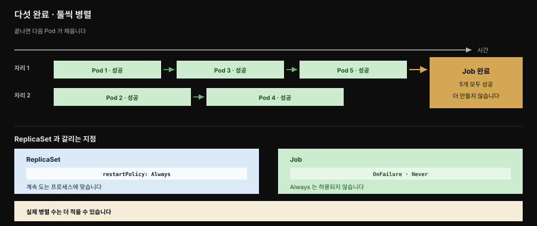

# Batch Job — 유한한 작업을 완료까지 안정적으로

> 『Kubernetes Patterns』 7장 정독. **Batch Job**은 격리된 원자적 작업 단위를 다루는 패턴으로 **Job 리소스**에 기반합니다. Job은 분산 환경에서 짧게 사는 Pod를 완료까지 안정적으로 돌립니다. 지금까지의 패턴이 계속 도는 워크로드였다면, 여기서 처음으로 정해진 유한한 일을 하고 멈추는 워크로드가 등장합니다.



책의 Figure 7-1이 보이는 흐름입니다. 자리가 둘뿐이라 Pod 하나가 끝나야 다음이 채워지고, 다섯 개가 모두 성공하면 Job이 완료됩니다. 아래 두 상자가 Job과 ReplicaSet을 가르는 지점입니다.


## 핵심 요약

> Pod를 만드는 기존 방식은 모두 멈추지 않을 프로세스를 전제합니다. 끝나야 하는 일에는 다른 프리미티브가 필요합니다.

Kubernetes에서 컨테이너를 관리하고 실행하는 주된 프리미티브는 Pod이고, Pod를 만드는 방식은 성격이 서로 다릅니다.

| 방식 | 성격 |
|------|------|
| **bare Pod** | 수동으로 만듭니다. 그 Pod가 도는 노드가 실패하면 **재시작되지 않습니다.** 개발이나 테스트 목적 외에는 권장하지 않으며 unmanaged Pod 또는 naked Pod라고도 부릅니다 |
| **ReplicaSet** | 웹 서버처럼 계속 돌아야 하는 Pod의 생애주기를 만들고 관리합니다. 지정된 수의 동일한 Pod가 늘 가용하도록 보장합니다 |
| **DaemonSet** | 모든 노드에 Pod 하나씩 돌리며 모니터링·로그 수집·스토리지 같은 플랫폼 기능을 관리합니다 |

이 셋의 공통점은 특정 시간이 지나면 멈추도록 의도되지 않은 **장기 실행 프로세스**를 대표한다는 점입니다. 그런데 미리 정의된 유한한 작업 단위를 안정적으로 수행하고 나서 컨테이너를 내려야 하는 경우가 있습니다. 그 작업을 위해 Kubernetes가 **Job** 리소스를 제공합니다.

Job은 ReplicaSet과 비슷하게 하나 이상의 Pod를 만들어 성공적으로 실행되도록 보장합니다. 다만 차이가 있습니다. **기대한 수의 Pod가 성공적으로 종료되면 Job이 완료된 것으로 간주되고 더 이상 Pod를 시작하지 않습니다.**

Job의 동작을 정하는 두 필드가 핵심입니다. `completions`는 성공 완료해야 할 Pod 수를, `parallelism`은 병렬로 돌 수 있는 Pod 수를 정합니다. 이 둘의 조합으로 네 가지 타입이 갈립니다.

그리고 Job에는 `restartPolicy`가 필수인데, ReplicaSet의 기본값인 `Always`가 **허용되지 않고** `OnFailure`나 `Never`만 쓸 수 있습니다.


## 학습 목표

> 이 편을 읽고 나면 다음을 설명할 수 있습니다.

1. Pod를 만드는 세 방식의 성격과 그 공통 한계를 설명할 수 있습니다.
2. Job과 ReplicaSet의 차이, `restartPolicy: Always`가 금지되는 이유를 말할 수 있습니다.
3. bare Pod 대신 Job을 쓰는 안정성·확장성 이점 다섯 가지를 들 수 있습니다.
4. `completions`와 `parallelism`이 각각 무엇을 정하며, `parallelism`을 높여도 실제 병렬 수가 다를 수 있는 이유를 설명할 수 있습니다.
5. 네 가지 Job 타입을 구분하고 각각이 어떤 상황에 맞는지 판단할 수 있습니다.
6. work queue Job과 indexed Job의 차이를 외부 큐 의존 여부로 설명할 수 있습니다.
7. `JOB_COMPLETION_INDEX`의 역할과 `JOB_COMPLETION_TOTAL`이 없는 이유, 두 우회책을 말할 수 있습니다.
8. 작업 항목을 Job에 매핑하는 두 방식의 트레이드오프를 판단할 수 있습니다.


## 해법 — Job 리소스

> Job은 ReplicaSet처럼 Pod를 만들지만, 기대한 수가 성공 종료하면 거기서 멈춥니다.

책의 Example 7-1이 Job 정의를 보입니다.[^job]

```yaml
apiVersion: batch/v1
kind: Job
metadata:
  name: random-generator
spec:
  completions: 5                # 다섯 Pod 가 완료까지 성공해야 합니다
  parallelism: 2                # 두 Pod 까지 병렬로 돕니다
  ttlSecondsAfterFinished: 300  # 완료 후 5분간 두었다가 GC 합니다
  template:
    metadata:
      name: random-generator
    spec:
      restartPolicy: OnFailure  # Job 에 필수 — OnFailure 또는 Never 만 가능합니다
      containers:
      - image: k8spatterns/random-generator:1.0
        name: random-generator
        command: [ "java", "RandomRunner", "/numbers.txt", "10000" ]
```

Job과 ReplicaSet 정의의 결정적 차이 하나가 `.spec.template.spec.restartPolicy`입니다. ReplicaSet의 기본값은 `Always`이고 이는 늘 돌아야 하는 장기 실행 프로세스에 맞습니다. Job에는 `Always`가 허용되지 않고 `OnFailure`와 `Never`만 가능합니다.

### bare Pod 대신 Job을 쓰는 이유

Pod를 한 번만 돌리려는 것뿐인데 왜 굳이 Job을 만들까요. Job이 주는 안정성과 확장성 이점이 그것을 선호하게 만듭니다.

1. Job은 메모리 위의 임시 작업이 아니라 **클러스터 재시작을 넘어 살아남는** 영속 작업입니다.
2. 완료돼도 삭제되지 않고 **추적을 위해 보존**됩니다. Job의 일부로 만들어진 Pod도 로그 확인 같은 검사를 위해 남습니다. bare Pod도 그렇긴 하지만 `restartPolicy: OnFailure`일 때만 그렇습니다. `.spec.ttlSecondsAfterFinished`를 지정하면 일정 시간 뒤 Pod를 정리할 수 있습니다.
3. 작업을 **여러 번 수행**해야 할 수 있습니다. `.spec.completions`로 Pod가 몇 번 성공 완료해야 Job이 끝나는지 지정합니다.
4. 여러 번 완료해야 한다면 동시에 여러 Pod를 시작해 **스케일**할 수도 있습니다. `.spec.parallelism`이 그 필드입니다.
5. `.spec.suspend`를 `true`로 두면 Job을 **일시 중단**할 수 있습니다. 이때 활성 Pod가 모두 삭제되고, 사용자가 `false`로 되돌려 재개하면 다시 시작됩니다.

여기에 더해 노드가 실패하거나 Pod가 실행 중 어떤 이유로 축출되면 **스케줄러가 그 Pod를 건강한 새 노드에 놓고 다시 실행**합니다. bare Pod는 기존 Pod가 다른 노드로 결코 옮겨지지 않으므로 실패 상태로 남습니다.

### completions와 parallelism

Job의 동작에서 주된 역할을 하는 두 필드입니다.

| 필드 | 정하는 것 |
|------|----------|
| `.spec.completions` | Job을 완료하려면 몇 개의 Pod가 돌아야 하는지 |
| `.spec.parallelism` | 몇 개의 Pod replica가 병렬로 돌 수 있는지 |

`parallelism`에는 주의할 점이 있습니다. **높은 수를 지정한다고 높은 병렬성이 보장되지는 않습니다.** 실제 Pod 수는 원하는 수보다 적을 수 있고 코너 케이스에서는 더 많을 수도 있습니다. 스로틀링·자원 쿼터·남은 completions 부족 등이 그 이유입니다. 이 필드를 `0`으로 두면 사실상 **Job이 일시 정지**됩니다.


## 네 가지 Job 타입

> 두 필드의 조합이 타입을 가릅니다. 무엇을 미리 아는지, 작업을 누가 나누는지가 선택 기준입니다.

| 타입 | 설정 | 완료 조건 | 언제 맞는가 |
|------|------|----------|------------|
| **Single Pod** | 둘 다 생략하거나 기본값 1 | Pod 하나가 exit 0으로 끝나면 | 가장 단순한 경우 |
| **Fixed completion count** | `completions`를 필요 수로, `parallelism`은 선택(기본 1) | `completions` 수만큼 성공하면 | 작업 수를 **미리 알고** Pod당 한 작업의 처리 비용이 전용 Pod를 정당화할 때 |
| **Work queue** | `completions`를 비우고 `parallelism > 1` | 최소 한 Pod가 성공 종료하고 **나머지도 모두** 종료하면 | 한 Pod가 여러 작업을 처리하므로 Pod당 오버헤드가 정당하지 않은 **세밀한 작업**에 |
| **Indexed** | `completionMode: Indexed` + 고정 `completions` | `completions` 수만큼 성공하면 | 외부 큐 없이 각 Pod가 **인덱스로 자기 몫**을 계산해 나눌 때 |

work queue Job에서는 Pod들이 서로 조율해 각자 무엇을 처리할지 정해야 합니다. 고정돼 있지만 개수를 모르는 작업 항목이 큐에 있다면 병렬 Pod들이 하나씩 집어 처리하는 식입니다. **큐가 빈 것을 처음 감지하고 성공 종료한 Pod**가 Job의 완료를 알리며, Job 컨트롤러는 나머지 Pod도 모두 종료되기를 기다립니다.

indexed Job에서는 각 Pod가 `0`부터 `completions - 1`까지의 인덱스를 받습니다. 원서는 접근 경로를 둘로 듭니다.

- Pod annotation `batch.kubernetes.io/job-completion-index` — 14장 Self Awareness에서 이 annotation을 코드에서 읽는 방법을 다룹니다.
- 환경변수 `JOB_COMPLETION_INDEX` — 이 Pod에 연관된 인덱스가 직접 설정됩니다.

공식 문서는 여기에 둘을 더해 **네 가지**를 듭니다(원서 범위 밖).

- 같은 이름의 **Pod label** `batch.kubernetes.io/job-completion-index` — v1.28 이후이며 `PodIndexLabel` 피처 게이트가 필요합니다(기본 활성). annotation과 달리 label이라 셀렉터로 고를 수 있습니다.
- **Pod 호스트네임**의 일부 — `$(job-name)-$(index)` 형태입니다. Service와 함께 쓰면 Job 안의 Pod들이 이 결정적 호스트네임으로 서로를 DNS로 부를 수 있습니다.

이 인덱스가 있으면 앱이 외부 동기화 없이 자기가 맡을 작업 항목을 고를 수 있습니다. 책의 Example 7-2는 한 파일의 줄들을 별도 Pod들이 나눠 처리합니다.

```yaml
apiVersion: batch/v1
kind: Job
metadata:
  name: file-split
spec:
  completionMode: Indexed         # indexed 완료 모드를 켭니다
  completions: 5
  parallelism: 5                  # 다섯 Pod 를 병렬로 완료까지 돌립니다
  template:
    metadata:
      name: file-split
    spec:
      containers:
      - image: alpine
        name: split
        command:
        - "sh"
        - "-c"
        - |
          # 자기 인덱스로 담당할 시작·끝 줄 번호를 계산합니다
          start=$(expr $JOB_COMPLETION_INDEX \* 10000)
          end=$(expr $JOB_COMPLETION_INDEX \* 10000 + 10000)
          # NR 은 파일을 훑을 때의 awk 내부 줄 번호입니다
          awk "NR>=$start && NR<$end" /logs/random.log \
               > /logs/random-$JOB_COMPLETION_INDEX.txt
        volumeMounts:
        - mountPath: /logs        # 입력 데이터는 외부 볼륨에서 마운트합니다
          name: log-volume
      restartPolicy: OnFailure
```

더 현실적인 예로는 비디오 처리가 있습니다. 병렬 Pod들이 인덱스에서 계산한 특정 프레임 범위를 각각 처리하는 식입니다.

### 작업을 나누는 두 방식의 한계

많은 작업 항목을 더 적은 수의 worker Pod로 처리하는 선택지를 봤습니다. 둘은 **누가 작업을 나누느냐**에서 갈립니다.

work queue Job은 알 수 없지만 유한한 작업 집합을 다룰 수 있으나 **작업 항목을 제공하는 외부 시스템의 지원이 필요합니다.** 외부 시스템이 이미 작업을 적당한 크기로 나눠 두었으므로 worker Pod는 그것을 처리하다 더 할 일이 없으면 멈추면 됩니다.

indexed Job은 외부 작업 큐에 기대지 않지만 **스스로 작업을 나눠야** 합니다. 그러려면 각 Pod가 세 가지를 알아야 합니다. 자기 정체(`JOB_COMPLETION_INDEX`가 제공), 전체 worker 수, 그리고 처리할 영화 파일 크기 같은 전체 작업의 규모입니다.

문제는 여기 있습니다. Job의 앱 코드는 indexed Job의 **전체 worker 수, 곧 `.spec.completions` 값을 발견할 수 없습니다.** `JOB_COMPLETION_TOTAL` 같은 환경변수가 있으면 작업을 동적으로 나누는 데 도움이 되겠지만 2023년 기준 지원되지 않습니다. 우회책은 둘입니다.

1. **총 Pod 수를 앱 코드에 하드코딩합니다.** 단순한 예에는 통하지만 일반적으로 불완전한 해법입니다. 컨테이너 코드가 Kubernetes 선언과 결합되기 때문입니다. Job 정의의 completions를 바꾸려면 갱신된 값을 담은 새 컨테이너 이미지를 만들어야 합니다.
2. **`.spec.completions` 값을 환경변수로 복사하거나** Job 템플릿 명세에서 컨테이너 명령의 인자로 넘깁니다. 다만 completions를 바꿀 계획이라면 Job 선언에서 **두 곳을 갱신**해야 합니다.

Kubernetes 커뮤니티에서 `.spec.completions` 값을 기본으로 환경변수로 제공할지 논의가 있었습니다. 주된 우려는 **환경변수를 런타임에 수정할 수 없다**는 점이며, 이것이 앞으로 크기 조절 가능한 Job을 지원하는 데 걸림돌이 될 수 있습니다. 그 결과 v1.26 기준으로 `JOB_COMPLETION_TOTAL` 환경변수는 제공되지 않습니다.

처리할 작업 항목이 **무제한 스트림**이라면 Job이 아니라 ReplicaSet 같은 다른 컨트롤러가 그 Pod들을 관리하는 데 더 낫습니다.


## 작업을 Job에 어떻게 매핑할까

> Job은 기본적이면서 근본적인 프리미티브입니다. 다만 작업 항목을 어떻게 나눠 담을지는 지시하지 않습니다.

Job 추상은 꽤 기본적이면서도 CronJob 같은 다른 프리미티브가 기반하는 근본 프리미티브입니다. Job은 격리된 작업 단위를 안정적이고 확장 가능한 실행 단위로 바꿔 줍니다. 그러나 개별 처리 가능한 작업 항목을 Job이나 Pod에 **어떻게 매핑할지는 지시하지 않습니다.** 각 선택지의 장단을 따져 결정해야 합니다.

| 방식 | 적합한 경우 | 대가 |
|------|------------|------|
| **작업 항목마다 Job 하나** | 각 작업이 독립적으로 기록·추적·스케일돼야 하는 복잡한 작업일 때 | Kubernetes Job 생성 오버헤드가 있고 플랫폼이 자원을 소비하는 다수의 Job을 관리해야 합니다 |
| **모든 작업 항목에 Job 하나** | 플랫폼이 독립적으로 추적·관리할 필요 없는 대량 작업일 때 | 작업 항목을 **앱 안의 배치 프레임워크**로 관리해야 합니다 |

Job 프리미티브는 작업 항목 스케줄링의 아주 최소한의 기본만 제공합니다. 복잡한 구현은 Job 프리미티브를 **배치 애플리케이션 프레임워크**와 결합해야 원하는 결과에 이릅니다. 자바 생태계에서는 Spring Batch와 JBeret가 표준 구현입니다.

모든 서비스가 항상 돌아야 하는 것은 아닙니다. 어떤 서비스는 필요할 때, 어떤 서비스는 특정 시각에, 어떤 서비스는 주기적으로 돌아야 합니다. Job을 쓰면 필요할 때만, 그리고 작업 실행 시간 동안만 Pod를 돌릴 수 있습니다.

Job은 필요한 용량이 있고 Pod 배치 정책을 만족하며 다른 컨테이너 의존성을 고려한 노드에 스케줄됩니다. ReplicaSet 같은 장기 실행 추상 대신 짧게 사는 작업에 Job을 쓰면 플랫폼의 다른 워크로드를 위해 **자원을 아낍니다.** 이 모두가 Job을 고유한 프리미티브로, Kubernetes를 다양한 워크로드를 지원하는 플랫폼으로 만듭니다.


## 심화 학습

> 본문(원서 7장) 밖에서 보강한 내용입니다. 출처를 링크로 남깁니다.

### Spring Batch와 Job의 담당 경계

책이 "복잡한 구현은 Spring Batch를 결합하라"고 짚은 지점은 실무에서 **누가 무엇을 담당하는가**의 경계 문제로 나타납니다. Kubernetes Job과 Spring Batch는 겹치는 듯 다릅니다.

| 층 | 관리하는 것 |
|----|------------|
| Kubernetes Job | Pod 수준의 실행·재시도·병렬·완료 판정 |
| Spring Batch | 앱 수준의 청크 처리·스텝·재시작 지점(restartability)·읽기와 처리와 쓰기 파이프라인 |

둘을 어떻게 조합하느냐가 설계 결정이고, 방식은 크게 둘입니다.

**첫째, Spring Batch partitioning을 indexed Job에 얹습니다.** Spring Batch가 데이터를 파티션으로 나누고 각 파티션을 indexed Job의 한 Pod가 `JOB_COMPLETION_INDEX`로 골라 처리합니다. 책이 indexed Job의 예로 든 인덱스 기반 작업 분할을 배치 프레임워크가 정교하게 수행하는 셈입니다. 이 경우 병렬은 Kubernetes가 관리하므로 관측과 재시도가 Kubernetes 도구로 이루어집니다.

**둘째, `JobLauncher`를 단일 Pod Job으로 띄웁니다.** 파티셔닝과 병렬을 전부 앱 안에서 처리하며, 책이 말한 "모든 작업 항목에 Job 하나"에 해당합니다. 이 경우 앱이 배치 메타데이터 DB로 재시작 지점을 추적합니다.

여기서 앞서 본 `JOB_COMPLETION_TOTAL` 부재가 실무 함정으로 돌아옵니다. Spring Batch partitioner는 그리드 크기를 정하려고 총 파티션 수를 알아야 하는데, Kubernetes가 그 값을 환경변수로 주지 않습니다. 그래서 `completions` 값을 별도 환경변수나 `application.yaml`로 앱에 명시적으로 전달해야 합니다. 이 값과 Job의 `completions`가 어긋나면 **파티션이 빠지거나 중복됩니다.**

> Job의 실행·상태·suspend·자동삭제 메커니즘은 형제 정독본 [Job 기초](../kubernetes-in-action/18-01.Job%20%EA%B8%B0%EC%B4%88%20%E2%80%94%20%EC%8B%A4%ED%96%89%C2%B7%EC%83%81%ED%83%9C%C2%B7suspend%C2%B7%EC%9E%90%EB%8F%99%EC%82%AD%EC%A0%9C.md)에, 병렬과 완료 모드는 같은 정독본 18-02에 상세합니다.

- 출처: [Spring Batch on Kubernetes (Spring 공식 블로그)](https://spring.io/blog/2021/01/27/spring-batch-on-kubernetes-efficient-batch-processing-at-scale) — 저자가 7장 More Information에서 든 참고 (2026-07-12 조회)
- 출처: [Kubernetes — Jobs (공식)](https://kubernetes.io/docs/concepts/workloads/controllers/job/)


## 능동 회상

> 먼저 스스로 답해 본 뒤 아래 정답 절에서 맞춰 봅니다. 정답은 이 절 다음에 번호 순서대로 있습니다.

1. Pod를 만드는 세 방식은 무엇이며 각각의 성격은 어떤가요? 셋의 공통점은 무엇인가요?
2. bare Pod 가 권장되지 않는 이유는 무엇이며 다른 이름으로 뭐라 부르나요?
3. Job 이 ReplicaSet 과 같은 점과 다른 점은 각각 무엇인가요?
4. Job 에서 `restartPolicy` 에 쓸 수 있는 값은 무엇이고 무엇이 금지되나요? 왜 그런가요?
5. bare Pod 대신 Job 을 쓰는 이점 다섯 가지를 들어 보세요.
6. bare Pod 도 Pod 가 보존되는 경우가 있습니다. 어떤 조건인가요?
7. `.spec.suspend` 를 true 로 하면 무슨 일이 일어나나요?
8. `parallelism` 을 높게 잡아도 실제 병렬 수가 다를 수 있는 이유는 무엇인가요? 0 으로 두면 어떻게 되나요?
9. 네 가지 Job 타입의 설정과 완료 조건을 각각 말해 보세요.
10. fixed completion count 가 최선인 조건 두 가지는 무엇인가요?
11. work queue Job 은 언제 완료되나요? 완료를 알리는 것은 무엇인가요?
12. work queue Job 이 세밀한 작업에 좋은 이유는 무엇인가요?
13. indexed Job 에서 인덱스에 접근하는 두 경로는 무엇인가요?
14. work queue 와 indexed 는 작업을 누가 나누느냐에서 갈립니다. 각각 어떻게 다른가요?
15. indexed Job 의 각 Pod 가 알아야 하는 세 가지는 무엇인가요? 그중 무엇을 알 수 없나요?
16. `JOB_COMPLETION_TOTAL` 이 제공되지 않는 이유와 두 우회책은 무엇인가요?
17. 무제한 스트림 작업에는 왜 Job 이 맞지 않나요?
18. 작업 항목을 Job 에 매핑하는 두 방식의 적합한 경우와 대가는 무엇인가요?


## 정답

> 위 회상 질문의 답입니다. 번호가 대응합니다.

**1.** 세 방식은 다음과 같습니다.

- **bare Pod** — 수동으로 만듭니다.
- **ReplicaSet** — 계속 돌아야 하는 Pod 의 생애주기를 관리하며 지정된 수의 동일한 Pod 가용성을 보장합니다.
- **DaemonSet** — 모든 노드에 Pod 하나씩 돌려 모니터링·로그 수집·스토리지 같은 플랫폼 기능을 관리합니다.

셋의 공통점은 특정 시간이 지나면 멈추도록 의도되지 않은 **장기 실행 프로세스**를 대표한다는 점입니다.

**2.** 그 Pod 가 도는 노드가 실패하면 재시작되지 않기 때문입니다. 개발이나 테스트 목적 외에는 권장하지 않으며 unmanaged Pod 또는 naked Pod 라고도 부릅니다.

**3.** 같은 점은 하나 이상의 Pod 를 만들어 성공적으로 실행되도록 보장한다는 것입니다. 다른 점은 **기대한 수의 Pod 가 성공 종료하면 Job 이 완료된 것으로 간주되고 더 이상 Pod 를 시작하지 않는다**는 것입니다.

**4.** `OnFailure` 와 `Never` 만 가능하고 `Always` 는 허용되지 않습니다. `Always` 는 늘 돌아야 하는 장기 실행 프로세스에 맞는 값이라 끝나야 하는 작업에는 모순이기 때문입니다. Job 에서 `restartPolicy` 지정은 필수입니다.

**5.** 첫째, 클러스터 재시작을 넘어 살아남는 영속 작업입니다. 둘째, 완료돼도 삭제되지 않고 추적을 위해 보존되며 Pod 도 검사용으로 남습니다. 셋째, `.spec.completions` 로 여러 번 완료를 지정할 수 있습니다. 넷째, `.spec.parallelism` 으로 동시에 여러 Pod 를 띄워 스케일할 수 있습니다. 다섯째, 노드가 실패하거나 Pod 가 축출되면 스케줄러가 건강한 노드에 다시 놓고 실행합니다.

**6.** `restartPolicy: OnFailure` 일 때만입니다. 이 조건에서는 bare Pod 도 검사를 위해 남습니다.

**7.** 활성 Pod 가 모두 삭제됩니다. 사용자가 `.spec.suspend` 를 다시 `false` 로 두어 재개하면 Pod 가 다시 시작됩니다.

**8.** 스로틀링·자원 쿼터·남은 completions 부족 같은 이유로 실제 Pod 수가 원하는 수보다 적을 수 있고, 코너 케이스에서는 더 많을 수도 있습니다. 이 필드를 `0` 으로 두면 사실상 Job 이 일시 정지됩니다.

**9.** Single Pod 는 둘 다 생략하거나 기본값 1 이며 Pod 하나가 exit 0 으로 끝나면 완료입니다. Fixed completion count 는 `completions` 를 필요 수로 두고 그만큼 성공하면 완료입니다. Work queue 는 `completions` 를 비우고 `parallelism` 을 1 보다 크게 두며 최소 한 Pod 가 성공 종료하고 나머지도 모두 종료하면 완료입니다. Indexed 는 `completionMode: Indexed` 와 고정 `completions` 를 쓰며 그 수만큼 성공하면 완료입니다.

**10.** 작업 항목의 수를 **미리 알고**, 단일 작업 항목의 처리 비용이 **전용 Pod 사용을 정당화**할 때입니다.

**11.** 최소 한 Pod 가 성공적으로 종료되고 다른 Pod 들도 모두 종료됐을 때입니다. 큐가 빈 것을 처음 감지하고 성공 종료한 Pod 가 Job 의 완료를 알리며, Job 컨트롤러는 나머지 Pod 도 모두 종료되기를 기다립니다.

**12.** 한 Pod 가 여러 작업 항목을 처리하기 때문입니다. 작업 항목 하나당 Pod 하나를 쓰는 오버헤드가 정당하지 않은 세밀한 작업에 적합합니다.

**13.** Pod annotation `batch.kubernetes.io/job-completion-index` 를 읽거나, 환경변수 `JOB_COMPLETION_INDEX` 를 직접 쓰는 것입니다. 전자를 코드에서 읽는 방법은 14장 Self Awareness 가 다룹니다.

**14.** work queue Job 은 작업 항목을 제공하는 **외부 시스템**이 이미 작업을 적당한 크기로 나눠 두어야 하며 worker Pod 는 그것을 처리하다 멈춥니다. indexed Job 은 외부 큐에 기대지 않고 **스스로 나눠** 각 Pod 가 전체 작업의 일부를 맡습니다.

**15.** 자기 정체(`JOB_COMPLETION_INDEX` 가 제공), 전체 worker 수, 그리고 전체 작업의 규모입니다. 이 중 **전체 worker 수**, 곧 `.spec.completions` 값을 앱 코드가 발견할 수 없습니다.

**16.** 환경변수를 런타임에 수정할 수 없어 앞으로 크기 조절 가능한 Job 을 지원하는 데 걸림돌이 될 수 있다는 우려 때문입니다. v1.26 기준 제공되지 않습니다. 우회책은 둘입니다. 하나는 총 Pod 수를 앱 코드에 하드코딩하는 것으로, 컨테이너 코드가 Kubernetes 선언과 결합됩니다. 다른 하나는 `.spec.completions` 값을 환경변수로 복사하거나 컨테이너 명령 인자로 넘기는 것으로, 값을 바꿀 때 두 곳을 갱신해야 합니다.

**17.** Job 은 유한한 작업 단위를 완료까지 수행하고 멈추는 프리미티브이기 때문입니다. 처리할 작업이 무제한 스트림이라면 ReplicaSet 같은 다른 컨트롤러가 그 Pod 들을 관리하는 편이 낫습니다.

**18.** 작업 항목마다 Job 하나를 두는 방식은 각 작업이 독립적으로 기록·추적·스케일돼야 하는 복잡한 작업에 유용합니다. 대가는 Job 생성 오버헤드와, 플랫폼이 자원을 소비하는 다수의 Job 을 관리해야 한다는 부담입니다. 모든 작업 항목에 Job 하나를 두는 방식은 독립 추적이 필요 없는 대량 작업에 맞습니다. 대가는 작업 항목을 앱 안의 배치 프레임워크로 관리해야 한다는 점입니다.


## 실무 적용

- **끝나는 작업은 bare Pod가 아니라 Job으로.** 노드 장애 시 재실행·완료 후 추적 보존·클러스터 재시작 영속이 필요하면 Job입니다.
- **작업 수를 알면 fixed completion count, 세밀하면 work queue, 자체 분할이면 indexed.** Pod당 오버헤드가 정당한지로 fixed vs work-queue를 가릅니다.
- **`restartPolicy`는 `OnFailure`나 `Never`.** Job에 `Always`를 쓰면 거부됩니다. 재시도 성격이면 OnFailure, 실패를 남겨 조사하려면 Never.
- **완료 Pod 정리는 `ttlSecondsAfterFinished`.** 안 걸면 완료 Job·Pod가 계속 쌓입니다.
- **총 worker 수는 앱에 명시 전달한다.** `JOB_COMPLETION_TOTAL`이 없으니, Spring Batch partitioner 등에는 `completions` 값을 환경변수·설정으로 넘기고 Job 선언과 일치시킵니다.
- **복잡한 배치는 프레임워크와 결합.** 청크 처리·재시작 지점은 Spring Batch/JBeret가, Pod 병렬·재시도·관측은 Job이 담당하게 나눕니다.


## 체크리스트

- [ ] Job 과 ReplicaSet 의 차이, `restartPolicy: Always` 금지 이유를 설명할 수 있습니까?
- [ ] bare Pod 대신 Job 을 쓰는 이점 다섯 가지를 댈 수 있습니까?
- [ ] `completions` 와 `parallelism` 이 각각 무엇을 정하는지, 실제 병렬 수가 다를 수 있는 이유를 압니까?
- [ ] 네 Job 타입의 설정과 완료 조건을 구분할 수 있습니까?
- [ ] work queue 와 indexed 가 작업을 누가 나누느냐에서 어떻게 갈리는지 압니까?
- [ ] `JOB_COMPLETION_INDEX` 의 역할과 `JOB_COMPLETION_TOTAL` 이 없는 이유·두 우회책을 압니까?
- [ ] 작업 항목을 Job 에 매핑하는 두 방식의 트레이드오프를 판단할 수 있습니까?
- [ ] Spring Batch 와 Kubernetes Job 의 담당 경계를 설명할 수 있습니까?


## 면접 관점

**Q. Job과 ReplicaSet은 무엇이 다릅니까?**
둘 다 Pod를 만들어 실행을 보장하지만 ReplicaSet은 계속 도는 프로세스의 개수를 유지하고 Job은 기대 수의 Pod가 성공 종료하면 완료로 보고 더 만들지 않습니다. 그래서 Job은 `restartPolicy: Always`가 금지되고 OnFailure나 Never만 허용됩니다 — 끝나야 할 작업에 Always는 모순이기 때문입니다.

**Q. work queue Job과 indexed Job은 어떻게 다릅니까?**
work queue는 `completions`를 비우고 parallelism만 키웁니다. 외부 큐가 작업을 나눠 주고 Pod들이 큐에서 하나씩 집어 처리하다 큐가 비면 종료합니다. indexed는 `completionMode: Indexed`로 각 Pod에 0~completions-1 인덱스를 주고 외부 큐 없이 각 Pod가 `JOB_COMPLETION_INDEX`로 자기 몫을 계산해 분할합니다.

**Q. indexed Job에서 총 worker 수를 코드가 알아야 할 때 문제가 무엇입니까?**
Kubernetes가 `.spec.completions` 값을 `JOB_COMPLETION_TOTAL` 같은 환경변수로 자동 제공하지 않기 때문입니다(1.26 기준). 그래서 총 수를 코드에 하드코딩하거나 completions 값을 환경변수·인자로 명시 전달해야 하는데, 후자는 completions를 바꿀 때 두 곳을 고쳐야 하는 결합이 생깁니다.

**Q. Kubernetes Job과 Spring Batch는 각각 무엇을 담당합니까?**
Job은 Pod 수준의 실행·재시도·병렬·완료 판정을 관리하고 Spring Batch는 앱 수준의 청크 처리·스텝·재시작 지점·읽기/처리/쓰기 파이프라인을 관리합니다. 예컨대 Spring Batch partitioning을 indexed Job에 얹으면, 파티션 분할은 Spring Batch가 하고 각 파티션 실행은 indexed Job의 Pod가 인덱스로 골라 처리합니다.


## 참고 자료

- 원서: 《Kubernetes Patterns, Second Edition》(Bilgin Ibryam·Roland Huß, O'Reilly) Ch7. Batch Job
- 이 책의 MOC: [Kubernetes Patterns 정독 인덱스](./README.md) · 앞 편: [Automated Placement](./06-01.Automated%20Placement%20%E2%80%94%20%EC%8A%A4%EC%BC%80%EC%A4%84%EB%9F%AC%EA%B0%80%20Pod%EB%A5%BC%20%EB%85%B8%EB%93%9C%EC%97%90%20%EB%B0%B0%EC%B9%98%ED%95%98%EB%8A%94%20%EB%B2%95.md)
- 형제 정독본: [Job 기초](../kubernetes-in-action/18-01.Job%20%EA%B8%B0%EC%B4%88%20%E2%80%94%20%EC%8B%A4%ED%96%89%C2%B7%EC%83%81%ED%83%9C%C2%B7suspend%C2%B7%EC%9E%90%EB%8F%99%EC%82%AD%EC%A0%9C.md)
- 개념 노트: [배치 워크로드](../../kubernetes/01_workloads/01-02.%EB%B0%B0%EC%B9%98%20%EC%9B%8C%ED%81%AC%EB%A1%9C%EB%93%9C.md)
- [Kubernetes — Jobs (공식)](https://kubernetes.io/docs/concepts/workloads/controllers/job/) · [Spring Batch on Kubernetes](https://spring.io/blog/2021/01/27/spring-batch-on-kubernetes-efficient-batch-processing-at-scale)

[^job]: Kubernetes — Job 의 completions·parallelism·completionMode 필드 계약.
<https://kubernetes.io/docs/concepts/workloads/controllers/job/>
- 저자 예제 코드: [k8spatterns/examples](https://github.com/k8spatterns/examples)
