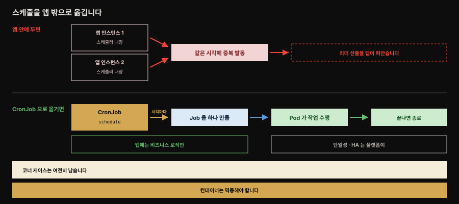
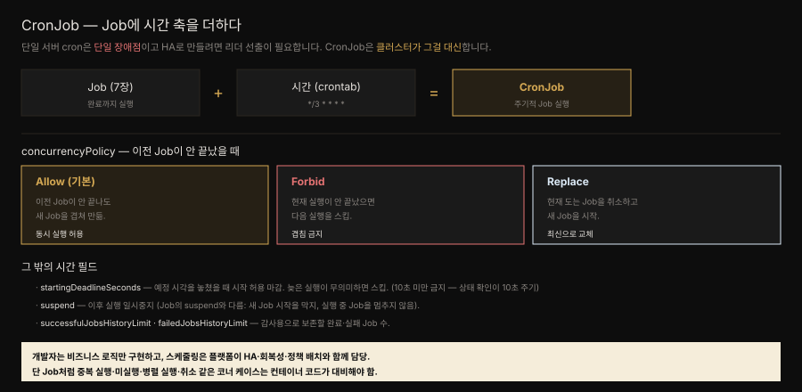

# Periodic Job — CronJob으로 시간 축을 더하다

> 『Kubernetes Patterns』 8장 정독. **Periodic Job**은 Batch Job 패턴에 **시간 차원**을 더해, 작업 실행을 시간 이벤트로 트리거합니다. Kubernetes **CronJob**은 Job 위에 얹혀, Unix crontab의 한 줄처럼 Job을 주기적으로 실행합니다. 단일 서버 cron이 가진 단일 장애점과 유지보수 부담을 클러스터가 대신 풉니다.



이 장 전체가 이 그림 한 장에 들어갑니다. 위아래가 같은 요구에 대한 두 가지 답입니다.

위쪽은 스케줄러를 앱 안에 두는 방식입니다. 인스턴스를 여럿 띄우는 순간 같은 시각에 모두 발동해 작업이 중복되고, 그것을 막으려고 리더 선출이 앱의 책임으로 들어옵니다. 아래쪽이 이 장의 답입니다. 스케줄을 CronJob에 맡기면 발동은 플랫폼이 하고 앱 컨테이너에는 비즈니스 로직만 남습니다. 다만 맨 아래 두 줄이 중요합니다. 스케줄링을 넘겨도 **중복·미실행·병렬·취소는 여전히 컨테이너가 대비해야 합니다.**


## 핵심 요약

> 주기 작업은 시스템 유지보수(백업·정리·아카이빙)나 비즈니스 작업(파일 전송·DB 폴링·뉴스레터 발송)에 흔합니다. 전통적으로 cron이나 전용 스케줄러를 썼지만 단일 서버 cron은 **단일 장애점**이고 앱 안에 스케줄러(Quartz·Spring Batch·`ScheduledThreadPoolExecutor`)를 넣으면 스케줄러를 HA로 만들기 위해 **앱 전체를 HA로** 만들어야 하고 리더 선출 같은 분산 문제가 따라옵니다. **CronJob**은 cron 포맷으로 Job을 스케줄해, 개발자가 스케줄링이 아니라 **수행할 작업만** 구현하게 합니다.

CronJob은 Job 위에 시간 필드를 더한 것입니다. `schedule`이 crontab 표현식을 받아 언제 돌지 정하고, `startingDeadlineSeconds`가 놓친 실행을 언제까지 시작해도 되는지 정합니다. `concurrencyPolicy`는 이전 실행이 안 끝났을 때 겹침을 어떻게 다룰지 고릅니다. 여기에 이후 실행을 멈추는 `suspend`와 보존할 Job 수를 정하는 history limit이 붙습니다.

CronJob은 특화된 프리미티브입니다. 그럼에도 이 장에 자리가 있는 이유는 Kubernetes의 기능이 서로 위에 쌓이는 방식을 잘 보여 주고, cron 같은 비클라우드 네이티브 용례까지 품는다는 점을 드러내기 때문입니다.


## 학습 목표

> 이 편을 읽고 나면 다음을 설명할 수 있습니다.

- 단일 서버 cron과 앱 내장 스케줄러가 가진 문제, 그리고 CronJob이 그것을 어떻게 푸는지 설명합니다.
- CronJob이 Job 위에 얹히는 구조와 시간 관련 필드 여섯 가지의 역할을 압니다.
- `concurrencyPolicy`의 Allow·Forbid·Replace 차이를 구분합니다.
- CronJob의 `suspend`와 Job의 `suspend`가 무엇을 대상으로 하는지 구분합니다.
- CronJob 컨테이너가 대비해야 할 코너 케이스 네 가지를 압니다.
- 스케줄이 해석되는 시간대와, 놓친 실행이 100회를 넘으면 벌어지는 일을 압니다.


## 본문 정리

### 문제 — 스케줄러를 HA로 만드는 비용

실시간·이벤트 기반 상호작용이 대세인 지금도 잡 스케줄링은 여전히 유효합니다. 시스템 유지보수나 관리 작업을 자동화할 때 흔히 쓰이고, 파일 전송을 통한 기업 간 연동이나 DB 폴링, 뉴스레터 발송, 오래된 파일 정리처럼 업무 애플리케이션에도 자리가 있습니다.

전통적인 해법은 전용 스케줄링 소프트웨어나 cron이었습니다. 그런데 전용 소프트웨어는 단순한 용례에 쓰기엔 비싸고, 단일 서버에서 도는 cron 잡은 유지보수가 어려운 데다 **단일 장애점**입니다.

그래서 개발자는 스케줄링과 비즈니스 로직을 함께 구현하는 쪽으로 기웁니다. 자바에서는 Quartz, Spring Batch, `ScheduledThreadPoolExecutor` 같은 것들이 그 자리를 채웁니다. 하지만 cron과 마찬가지로 여기서도 핵심 난점은 스케줄링을 **회복성 있고 고가용하게** 만드는 일이고, 그 대가로 자원 소비가 커집니다.

문제의 뿌리는 시간 기반 스케줄러가 **앱의 일부**라는 데 있습니다. 스케줄러를 HA로 만들려면 앱 전체를 HA로 만들어야 합니다. 인스턴스를 여럿 띄우되 그중 **하나만 활성이어서 잡을 스케줄하도록** 보장해야 하고, 그 순간 리더 선출을 비롯한 분산 시스템 난제가 딸려 옵니다. 하루 한 번 파일 몇 개를 복사하는 단순한 서비스가 결국 여러 노드와 분산 리더 선출 메커니즘을 요구하게 되는 것입니다.

Kubernetes CronJob은 이 문제를 통째로 걷어냅니다. 잘 알려진 cron 포맷으로 Job 리소스를 스케줄할 수 있게 해서, 개발자가 **시간 스케줄링이 아니라 수행할 작업 자체**에만 집중하게 합니다.

### Solution — CronJob 리소스

CronJob은 Job 위에 얹혀, crontab의 한 줄처럼 Job의 시간 측면을 관리합니다.

```yaml
apiVersion: batch/v1
kind: CronJob
metadata:
  name: random-generator
spec:
  schedule: "*/3 * * * *"       # 3분마다 실행하는 cron 명세
  jobTemplate:
    spec:                        # 일반 Job과 같은 명세를 쓰는 Job 템플릿
      template:
        spec:
          containers:
          - image: k8spatterns/random-generator:1.0
            name: random-generator
            command: [ "java", "RandomRunner", "/numbers.txt", "10000" ]
          restartPolicy: OnFailure
```

7장 Job의 용례·능력이 모두 적용됩니다. CronJob은 Job 스펙에 더해 시간 필드를 갖습니다.

- **`.spec.schedule`**: 스케줄 crontab 항목(예: `0 * * * *`=매시). `@daily`·`@hourly` 단축도 가능.
- **`.spec.startingDeadlineSeconds`**: 예정 시각을 놓쳤을 때 Job 시작을 허용하는 마감(초). 늦은 실행이 무의미한 경우(처리할 데이터가 이미 obsolete) 스킵이 낫습니다. **10초 미만 금지** — Kubernetes가 Job 상태를 10초마다 확인하기 때문입니다.
- **`.spec.concurrencyPolicy`**: 같은 CronJob이 만든 Job의 동시 실행 처리.
  - `Allow`(기본): 이전 Job이 안 끝나도 새 Job을 겹쳐 만듦.
  - `Forbid`: 현재 실행이 안 끝났으면 다음 실행을 스킵.
  - `Replace`: 현재 도는 Job을 취소하고 새 Job을 시작.
- **`.spec.suspend`**: 이후 실행을 모두 중지(이미 시작된 실행엔 영향 없음). **Job의 `suspend`와 다릅니다** — 새 Job의 *시작*을 막지, 실행 중인 Job 자체를 멈추지 않습니다.
- **`.spec.successfulJobsHistoryLimit`·`.spec.failedJobsHistoryLimit`**: 감사용으로 보존할 완료·실패 Job 수.



세 정책의 차이는 말로 들으면 비슷하지만 시간 축에 놓으면 분명해집니다. 세로 점선이 스케줄 발동 시각이고, 작업이 그 간격보다 오래 걸리는 상황을 가정했습니다.

Allow는 이전 Job을 둔 채 새 Job을 얹어 계단처럼 쌓입니다. Forbid는 이전 것이 도는 동안의 발동을 통째로 건너뜁니다. Replace는 겹치지 않는 대신 돌던 작업을 중간에 자릅니다.

### 원서에 없는 두 가지 — 시간대와 100회 한계

원서는 2023년 기준이라 그 뒤에 자리 잡은 필드 하나와, 원서가 다루지 않은 컨트롤러 한계 하나가 빠져 있습니다. 둘 다 운영에서 실제로 부딪히는 것이라 공식 문서에서 보강합니다.

**시간대를 명시하지 않으면 컨트롤러의 로컬 시간대를 따릅니다.** `"0 3 * * *"`를 새벽 3시로 의도해도, 그 3시는 kube-controller-manager가 서 있는 시간대의 3시입니다. 클러스터가 UTC로 도는데 한국 시간 새벽 배치를 기대했다면 아홉 시간이 어긋납니다. Kubernetes 1.27부터 `.spec.timeZone`이 stable이 되어 이것을 명시할 수 있습니다.

```yaml
spec:
  schedule: "0 3 * * *"
  timeZone: "Asia/Seoul"     # 이 스케줄을 한국 시간으로 해석합니다
```

주의할 것은 `schedule` 문자열 안에 `CRON_TZ`나 `TZ`를 적는 방식이 **공식 지원이 아니라는** 점입니다. 공식 문서는 그렇게 쓰면 리소스 생성·수정이 검증 오류로 실패한다고 못박습니다. 시간대는 반드시 `timeZone` 필드로 줍니다.

**놓친 스케줄이 100회를 넘으면 컨트롤러가 Job을 아예 시작하지 않습니다.** 컨트롤러는 마지막 스케줄 시각부터 지금까지 몇 번을 놓쳤는지 세는데, 그 수가 100을 넘으면 오류를 로그에 남기고 멈춥니다. 컨트롤러가 한동안 죽어 있었거나 클럭 스큐가 생겼을 때 벌어집니다.

여기서 `startingDeadlineSeconds`가 두 번째 역할을 합니다. 이 값이 설정돼 있으면 컨트롤러는 **마지막 스케줄 시각이 아니라 그 초 범위 안에서만** 놓친 횟수를 셉니다. 예를 들어 200으로 두면 최근 200초만 보므로, 컨트롤러가 두 시간 죽어 있다 살아나도 놓친 횟수가 100을 넘지 않아 다음 실행이 정상으로 돕니다. 이 필드를 "늦으면 건너뛰기" 용도로만 알고 있으면 이 쓸모를 놓칩니다.

### Discussion — 쌓아 올린 프리미티브

CronJob은 기존 Job에 클러스터형 cron 동작을 더하는 단순한 프리미티브지만 Pod·자원 격리·다른 기능(6장 Automated Placement, 4장 Health Probe)과 결합되면 강력한 잡 스케줄링 시스템이 됩니다. 개발자는 문제 도메인에만 집중해 비즈니스 로직만 구현하고 스케줄링은 HA·회복성·용량·정책 배치와 함께 플랫폼이 담당합니다. 단 Job처럼 CronJob 컨테이너도 **중복 실행·미실행·병렬 실행·취소** 같은 코너·실패 케이스를 대비해야 합니다.


## 심화 학습

> 본문(원서 8장) 밖에서 보강한 내용입니다. 출처를 링크로 남깁니다.

### Spring `@Scheduled`를 CronJob으로 옮길 때의 판단

1장 Table 1-1이 `ScheduledExecutorService`를 CronJob이 완전히 대체할 수 있다고 본 것과, 이 장이 "앱 내장 스케줄러는 앱 전체를 HA로 만들어야 한다"고 한 것은 같은 이야기의 두 면입니다.

Spring 앱에 `@Scheduled`가 있고 그 앱을 replica 여럿으로 띄우면 **인스턴스마다 스케줄이 발동해 작업이 중복 실행**됩니다. 이 장이 말한 "하나만 활성이도록 보장해야 한다"는 요구가 실무에서 부딪히는 지점이 정확히 여기입니다.

해결은 두 갈래입니다.

하나는 이 장의 권장대로 스케줄 로직을 앱에서 **떼어 CronJob으로** 옮기는 것입니다. 클러스터가 실행의 단일성을 보장하고 앱은 비즈니스 로직만 담습니다. 다른 하나는 앱 안에 남기되 **리더 선출로 한 인스턴스만 발동**하게 하는 것입니다. ShedLock 같은 라이브러리가 DB나 Redis 락으로 "이 스케줄은 한 번만"을 보장하는데, 10장 Singleton Service의 in-application 잠금과 같은 접근입니다.

트레이드오프는 이렇게 갈립니다. CronJob은 스케줄을 플랫폼에 맡겨 앱을 단순하게 만들지만, 실행이 별도 Pod라 앱 컨텍스트(빈·커넥션 풀)를 새로 띄우는 비용을 냅니다. in-app 리더 선출은 앱 컨텍스트를 그대로 재사용하는 대신 락 인프라와 중복 방지 로직을 앱이 떠안습니다.

주의할 함정 하나 — CronJob의 `concurrencyPolicy` 기본이 `Allow`라, 작업이 스케줄 간격보다 오래 걸리면 Job이 겹쳐 쌓입니다. `@Scheduled`의 `fixedDelay`(이전 실행 종료 후 대기)에 익숙한 사람은 CronJob도 그럴 거라 오해하기 쉽지만 CronJob은 cron 표현식 시각마다 무조건 발동하므로 겹침을 막으려면 `Forbid`를 명시해야 합니다.

> CronJob·work queue의 개념 메커니즘은 형제 정독본 [work queue·pod 통신·sidecar·CronJob](../kubernetes-in-action/18-03.work%20queue%C2%B7pod%20%ED%86%B5%EC%8B%A0%C2%B7sidecar%C2%B7CronJob.md)에 상세합니다.

- 출처: [Kubernetes — CronJob (공식)](https://kubernetes.io/docs/concepts/workloads/controllers/cron-jobs/) (2026-07-12 조회)
- 출처: [ShedLock — Distributed lock for scheduled tasks](https://github.com/lukas-krecan/ShedLock)


## 능동 회상

> 먼저 스스로 답해 본 뒤 아래 정답 절에서 맞춰 봅니다. 정답은 이 절 다음에 번호 순서대로 있습니다.

1. Periodic Job 은 Batch Job 에 무엇을 더한 패턴인가요?
2. 주기 작업이 쓰이는 자리를 시스템 쪽과 업무 쪽으로 나눠 들어 보세요.
3. 전용 스케줄링 소프트웨어와 단일 서버 cron 은 각각 어떤 약점이 있나요?
4. 자바 진영에서 스케줄링을 앱 안에 넣을 때 쓰는 수단 세 가지는 무엇인가요?
5. 앱 내장 스케줄러의 근본 문제는 무엇인가요? 왜 앱 전체가 HA 여야 하나요?
6. 하루 한 번 파일을 복사하는 단순 서비스가 결국 무엇까지 요구하게 되나요?
7. CronJob 은 무엇 위에 얹히며 무엇에 비유되나요?
8. `.spec.schedule` 에 쓸 수 있는 단축 표기 두 가지를 들어 보세요.
9. `.spec.startingDeadlineSeconds` 는 무엇을 정하나요? 어떤 상황에 쓰나요?
10. 이 값을 10초 미만으로 두면 안 되는 이유는 무엇인가요?
11. `concurrencyPolicy` 세 값은 각각 어떻게 동작하나요? 기본값은 무엇인가요?
12. 겹치면 안 되는 작업과, 최신 실행만 의미 있는 작업에는 각각 어느 값이 맞나요?
13. CronJob 의 `suspend` 와 Job 의 `suspend` 는 무엇이 다른가요?
14. history limit 두 필드는 무엇을 위한 것인가요?
15. 시간대를 명시하지 않으면 스케줄은 어느 시간대로 해석되나요?
16. 시간대를 지정하는 올바른 방법과, 해서는 안 되는 방법은 각각 무엇인가요?
17. 놓친 스케줄이 100 회를 넘으면 어떻게 되나요? 언제 그런 일이 생기나요?
18. `startingDeadlineSeconds` 가 놓친 횟수 집계에 어떤 영향을 주나요?
19. CronJob 컨테이너가 대비해야 할 코너 케이스 네 가지는 무엇인가요?
20. Spring `@Scheduled` 앱을 replica 여럿으로 띄우면 무슨 일이 벌어지나요?
21. 그 문제를 푸는 두 갈래와 각각의 대가는 무엇인가요?
22. `@Scheduled` 의 `fixedDelay` 에 익숙한 사람이 CronJob 에서 하기 쉬운 오해는 무엇인가요?


## 정답

> 위 회상 질문의 답입니다. 번호가 대응합니다.

**1.** **시간 차원**을 더했습니다. 작업 단위의 실행을 시간 이벤트로 트리거하게 만든 패턴입니다.

**2.** 시스템 쪽은 유지보수·관리 작업 자동화입니다. 업무 쪽은 파일 전송을 통한 기업 간 연동, DB 폴링을 통한 애플리케이션 연동, 뉴스레터 발송, 오래된 파일 정리·아카이빙 같은 것들입니다.

**3.** 전용 소프트웨어는 **단순한 용례에 쓰기엔 비쌉니다.** 단일 서버 cron 은 유지보수가 어렵고 **단일 장애점**입니다.

**4.** Quartz, Spring Batch, 그리고 `ScheduledThreadPoolExecutor` 를 쓴 직접 구현입니다.

**5.** 시간 기반 스케줄러가 **앱의 일부**라는 점입니다. 스케줄러를 고가용하게 만들려면 앱 전체를 고가용하게 만들어야 하고, 인스턴스를 여럿 띄우면서 동시에 **그중 하나만 활성이어서 잡을 스케줄하도록** 보장해야 합니다. 그 순간 리더 선출을 비롯한 분산 시스템 난제가 딸려 옵니다.

**6.** 여러 노드와 분산 리더 선출 메커니즘입니다. 작업 자체의 무게에 견주면 과한 인프라입니다.

**7.** **Job** 위에 얹힙니다. Unix crontab(cron table)의 **한 줄**에 비유됩니다. Job 의 시간 측면을 관리하며 지정된 시점에 Job 을 주기적으로 실행합니다.

**8.** `@daily` 와 `@hourly` 입니다. 그 밖의 옵션은 CronJob 공식 문서에 있습니다.

**9.** 예정 시각을 **놓쳤을 때 Job 시작을 허용하는 마감**(초)입니다. 정해진 시간 안에 실행돼야만 의미가 있고 늦게 돌면 쓸모없는 작업에 씁니다. 자원 부족이나 의존성 문제로 제때 못 돌았다면, 처리할 데이터가 이미 낡았으므로 차라리 건너뛰는 편이 나은 경우입니다.

**10.** Kubernetes 가 Job 상태를 **10초마다** 확인하기 때문입니다. 그보다 짧은 마감을 주면 CronJob 이 아예 스케줄되지 않을 수 있습니다.

**11.** 같은 CronJob 이 만든 Job 들의 동시 실행을 어떻게 다룰지 정합니다. **`Allow`가 기본값**으로, 이전 Job 이 안 끝나도 새 Job 을 겹쳐 만듭니다. `Forbid` 는 현재 실행이 안 끝났으면 다음 실행을 건너뜁니다. `Replace` 는 현재 도는 Job 을 취소하고 새 Job 을 시작합니다.

**12.** 겹치면 안 되는 작업에는 `Forbid` 를 **명시**합니다. 최신 실행만 의미가 있는 작업에는 `Replace` 가 맞습니다. 다만 Replace 는 진행 중이던 작업을 중간에 자른다는 점을 감수해야 합니다.

**13.** CronJob 의 `suspend` 는 **새 Job 의 시작**을 막고, 이미 시작된 실행에는 영향을 주지 않습니다. Job 의 `suspend` 는 그 Job 의 활성 Pod 를 삭제해 **실행 자체**를 멈춥니다. 즉 하나는 스케줄 트리거를, 다른 하나는 실행을 대상으로 합니다.

**14.** **감사(auditing) 목적**으로 완료된 Job 과 실패한 Job 을 각각 몇 개나 보존할지 정합니다.

**15.** **kube-controller-manager 의 로컬 시간대**로 해석됩니다. 클러스터가 UTC 로 도는데 한국 시간 기준 새벽 배치를 의도했다면 아홉 시간이 어긋납니다.

**16.** 올바른 방법은 `.spec.timeZone` 필드에 `"Asia/Seoul"` 같은 유효한 시간대 이름을 주는 것입니다(1.27 부터 stable). 해서는 안 되는 방법은 `schedule` 문자열 안에 `CRON_TZ` 나 `TZ` 를 적는 것으로, **공식 지원이 아니며** 그렇게 쓰면 리소스 생성·수정이 검증 오류로 실패합니다.

**17.** 컨트롤러가 **Job 을 시작하지 않고 오류를 로그에 남깁니다.** 컨트롤러가 한동안 죽어 있었거나 클럭 스큐가 생겼을 때 벌어집니다.

**18.** 집계 **기준 구간**을 바꿉니다. 이 값이 없으면 마지막 스케줄 시각부터 지금까지를 세지만, 값이 설정돼 있으면 **그 초 범위 안에서만** 셉니다. 200 으로 두면 최근 200 초만 보므로 컨트롤러가 두 시간 죽어 있다 살아나도 100 회 한계에 걸리지 않습니다.

**19.** **중복 실행 · 미실행 · 병렬 실행 · 취소**입니다. 스케줄링을 플랫폼에 넘겨도 이 대비는 여전히 컨테이너 코드의 몫입니다.

**20.** **인스턴스마다 스케줄이 발동해 작업이 중복 실행**됩니다. 이 장이 말한 "하나만 활성이도록 보장해야 한다"는 요구에 정면으로 부딪히는 지점입니다.

**21.** 하나는 스케줄 로직을 앱에서 떼어 **CronJob 으로** 옮기는 것으로, 대가는 실행이 매번 새 Pod 라 앱 컨텍스트(빈·커넥션 풀)를 새로 띄우는 비용입니다. 다른 하나는 앱에 남기되 ShedLock 같은 분산 락으로 **리더 선출**을 거는 것으로, 대가는 락 인프라와 중복 방지 로직을 앱이 떠안는 것입니다.

**22.** `fixedDelay` 는 이전 실행이 **끝난 뒤** 대기하고 다음을 돌립니다. CronJob 은 그렇지 않고 **cron 표현식 시각마다 무조건 발동**합니다. 그래서 기본값 `Allow` 그대로 두면 작업이 스케줄 간격보다 길어질 때 Job 이 겹쳐 쌓입니다.


## 실무 적용

- **여러 인스턴스로 뜨는 앱의 주기 작업은 CronJob으로.** `@Scheduled`를 앱에 남기면 인스턴스마다 중복 발동합니다. 스케줄을 CronJob으로 떼거나, 남기면 ShedLock 등으로 리더 선출을 겁니다.
- **겹치면 안 되는 작업은 `concurrencyPolicy: Forbid`.** 기본 Allow는 스케줄보다 오래 걸리는 작업을 겹쳐 쌓습니다.
- **늦으면 무의미한 작업은 `startingDeadlineSeconds`로 스킵.** 단 10초 미만은 금지(상태 확인 주기).
- **history limit으로 감사 로그를 관리한다.** 완료·실패 Job이 무한히 쌓이지 않게 보존 수를 정합니다.
- **컨테이너를 멱등(idempotent)하게.** 중복·병렬·취소가 일어날 수 있으니, 같은 작업이 두 번 돌아도 안전하게 설계합니다.


## 체크리스트

- [ ] 단일 서버 cron과 앱 내장 스케줄러의 문제, 그리고 CronJob의 해결을 설명할 수 있습니다.
- [ ] CronJob이 Job 위에 얹히는 구조와 시간 필드들의 역할을 압니다.
- [ ] `concurrencyPolicy` Allow·Forbid·Replace의 차이를 구분할 수 있습니다.
- [ ] CronJob의 `suspend`와 Job의 `suspend`가 각각 무엇을 막는지 압니다.
- [ ] `startingDeadlineSeconds`를 10초 미만으로 두면 안 되는 이유를 압니다.
- [ ] 스케줄이 어느 시간대로 해석되는지, `.spec.timeZone`을 왜 명시하는지 압니다.
- [ ] 놓친 실행이 100회를 넘으면 어떻게 되는지, 그것을 무엇으로 완화하는지 압니다.
- [ ] Spring `@Scheduled`를 CronJob으로 옮길지 리더 선출로 남길지의 트레이드오프를 설명할 수 있습니다.


## 면접 관점

**Q. 앱에 스케줄러를 넣는 것과 CronJob을 쓰는 것은 무엇이 다릅니까?**
앱 내장 스케줄러(Quartz·`@Scheduled`)는 시간 스케줄러가 앱의 일부라, HA로 만들려면 앱 전체를 HA로 만들고 여러 인스턴스 중 하나만 발동하게 리더 선출을 해야 합니다. CronJob은 스케줄링을 플랫폼에 맡겨, 개발자는 수행할 작업만 구현하고 실행 단일성·HA·회복성은 클러스터가 담당합니다.

**Q. `concurrencyPolicy`의 세 값은 무엇입니까?**
이전 Job이 안 끝났을 때의 동작입니다. Allow(기본)는 겹쳐 새 Job을 만들고 Forbid는 다음 실행을 스킵하며 Replace는 현재 Job을 취소하고 새 Job을 시작합니다. 스케줄보다 오래 걸리는 작업이 겹치면 안 되면 Forbid를 명시해야 합니다.

**Q. CronJob의 suspend와 Job의 suspend는 어떻게 다릅니까?**
CronJob의 `suspend`는 이후 새 Job의 *시작*을 막지, 이미 실행 중인 Job은 멈추지 않습니다. Job의 `suspend`는 그 Job의 활성 Pod를 삭제해 실행 자체를 멈춥니다. 즉 CronJob suspend는 스케줄 트리거를, Job suspend는 실행을 대상으로 합니다.

**Q. Spring `@Scheduled` 앱을 replica 여럿으로 띄우면 무슨 문제가 생기고 어떻게 막습니까?**
인스턴스마다 스케줄이 발동해 작업이 중복 실행됩니다. 스케줄 로직을 CronJob으로 떼어 클러스터가 단일 실행을 보장하게 하거나, 앱에 남기려면 ShedLock 같은 분산 락으로 한 인스턴스만 발동하게 리더 선출을 겁니다.


## 참고 자료

- 원서: 《Kubernetes Patterns, Second Edition》(Bilgin Ibryam·Roland Huß, O'Reilly) Ch8. Periodic Job
- 이 책의 MOC: [Kubernetes Patterns 정독 인덱스](./README.md) · 앞 편: [Batch Job](./07-01.Batch%20Job%20%E2%80%94%20%EC%9C%A0%ED%95%9C%ED%95%9C%20%EC%9E%91%EC%97%85%EC%9D%84%20%EC%99%84%EB%A3%8C%EA%B9%8C%EC%A7%80%20%EC%95%88%EC%A0%95%EC%A0%81%EC%9C%BC%EB%A1%9C.md)
- 형제 정독본: [work queue·pod 통신·sidecar·CronJob](../kubernetes-in-action/18-03.work%20queue%C2%B7pod%20%ED%86%B5%EC%8B%A0%C2%B7sidecar%C2%B7CronJob.md)
- 개념 노트: [배치 워크로드](../../kubernetes/01_workloads/01-02.%EB%B0%B0%EC%B9%98%20%EC%9B%8C%ED%81%AC%EB%A1%9C%EB%93%9C.md)
- [Kubernetes — CronJob (공식)](https://kubernetes.io/docs/concepts/workloads/controllers/cron-jobs/) · [ShedLock](https://github.com/lukas-krecan/ShedLock)
- 저자 예제 코드: [k8spatterns/examples](https://github.com/k8spatterns/examples)
