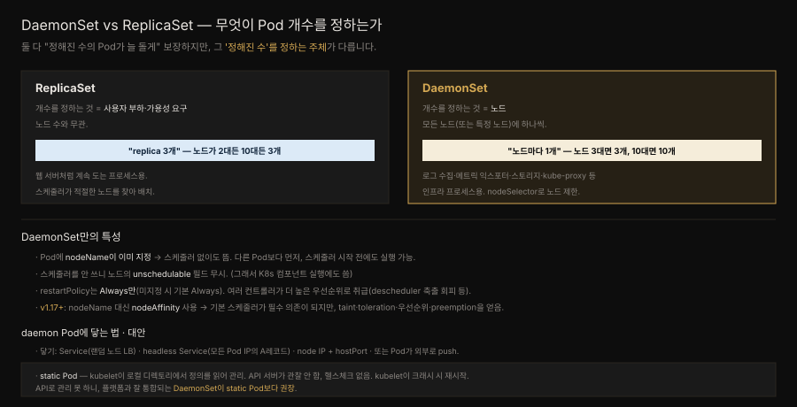
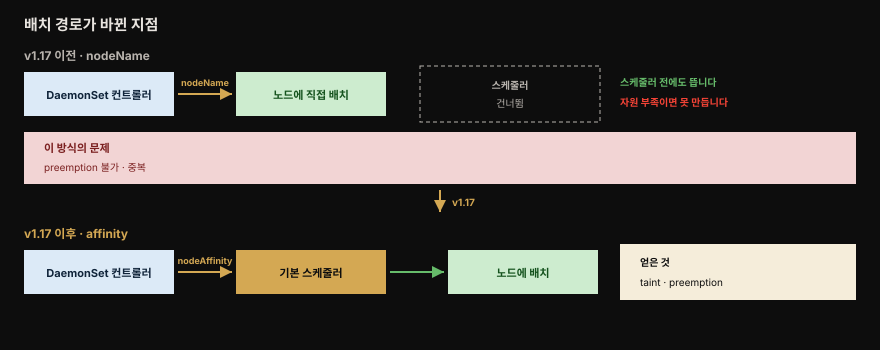

# Daemon Service — 노드마다 도는 인프라 Pod

> 『Kubernetes Patterns』 9장 정독. **Daemon Service**는 우선순위 높은 인프라 중심 Pod를 대상 노드에 배치·실행하는 패턴입니다. 주로 관리자가 노드별 Pod로 Kubernetes 플랫폼 능력을 보강하는 데 씁니다. OS의 데몬(httpd·sshd)이나 JVM의 데몬 스레드(GC)가 배경에서 지원 서비스를 제공하듯, **DaemonSet**은 클러스터 노드에서 돌며 나머지 클러스터에 배경 능력을 제공합니다.



노드를 한 대 추가했을 때 무슨 일이 벌어지는지가 두 컨트롤러의 차이를 가장 잘 드러냅니다. 위쪽 ReplicaSet은 계속 3개이고 새 노드는 비어 있을 수 있습니다. 아래쪽 DaemonSet은 새 노드에 Pod가 자동으로 생겨 3개가 됩니다. 개수를 정하는 주체가 다르기 때문입니다.


## 핵심 요약

> 개수를 정하는 주체가 부하냐 노드냐, 이 한 가지가 DaemonSet과 ReplicaSet을 가릅니다.

ReplicaSet과 그 전신인 ReplicationController는 특정 수의 Pod가 돌고 있는지 보장하는 제어 구조입니다. 돌고 있는 Pod 목록을 끊임없이 감시하며 실제 수가 늘 원하는 수와 일치하도록 만듭니다. 그 점에서 DaemonSet도 비슷한 구조이고 일정 수의 Pod가 늘 돌게 하는 책임을 집니다.

차이는 **그 수를 무엇이 정하느냐**입니다. 앞의 둘은 노드 수와 무관하게 앱의 고가용성 요구와 사용자 부하가 개수를 정합니다. DaemonSet은 소비자 부하에 이끌려 몇 개를 어디서 돌릴지 정하지 않습니다. 주된 목적이 **모든 노드 또는 특정 노드에 Pod 하나씩** 계속 돌리는 것이기 때문입니다.

주 후보는 클러스터 전역 작업을 수행하는 인프라 관련 프로세스입니다. 클러스터 스토리지 제공자, 로그 수집기, 메트릭 익스포터, 그리고 kube-proxy까지 여기 해당합니다.

DaemonSet에는 관리 방식에서 오는 고유한 특성이 여럿 있습니다. 원서는 Pod에 `nodeName`이 이미 지정돼 **스케줄러 없이** 뜬다고 설명하는데, 이것은 **v1.17 이전 방식**입니다. 지금은 컨트롤러가 `nodeAffinity`를 설정하고 기본 스케줄러가 바인딩합니다. 그럼에도 `unschedulable` 노드에 뜨는 결과는 그대로인데, 이유가 바뀌었습니다. 스케줄러를 안 써서가 아니라 컨트롤러가 **toleration을 자동으로 붙여 주기** 때문입니다. `restartPolicy`는 `Always`만 가능하고, 여러 컨트롤러가 이 Pod를 더 높은 우선순위로 취급합니다.

다만 **v1.17** 부터는 `nodeName` 대신 `nodeAffinity`를 설정해 기본 스케줄러로 스케줄합니다. 스케줄러가 필수 의존이 되는 대신 taint·toleration·Pod 우선순위·preemption을 얻습니다.

비슷한 대안으로 **static Pod**가 있습니다. kubelet이 로컬 디렉토리에서 정의를 읽어 관리하는 방식인데, API로 관리할 수 없어 플랫폼과 잘 통합되는 DaemonSet이 권장됩니다.


## 학습 목표

> 이 편을 읽고 나면 다음을 설명할 수 있습니다.

1. DaemonSet과 ReplicaSet에서 Pod 개수를 정하는 주체가 각각 무엇인지 구분하고, 노드가 추가될 때의 차이를 설명할 수 있습니다.
2. DaemonSet Pod가 스케줄러 없이 뜰 수 있었던 이유와 그로부터 따라오는 네 가지 특성을 말할 수 있습니다.
3. `restartPolicy`가 `Always`만 가능한 이유를 설명할 수 있습니다.
4. v1.17 이전 `nodeName` 방식의 세 가지 문제와 `nodeAffinity`로 바꿔 얻은 것을 설명할 수 있습니다.
5. DaemonSet Pod에 닿는 세 방법과 각각의 제약을 구분할 수 있습니다.
6. static Pod의 동작과 한계를 말하고, DaemonSet이 권장되는 이유를 판단할 수 있습니다.
7. 로그 수집기와 Node Exporter가 왜 DaemonSet인지 노드 로컬 수집 관점에서 설명할 수 있습니다.


## 문제 — 여러 층위에 있는 데몬 개념

> 데몬은 OS에도 JVM에도 있는 개념이며, Kubernetes는 그것을 다중 노드 클러스터 수준으로 끌어올립니다.

소프트웨어 시스템에서 데몬 개념은 여러 층위에 존재합니다.

**운영체제 수준**에서 데몬은 배경 프로세스로 도는 장기 실행 자가 복구 프로그램입니다. Unix에서는 이름이 `d`로 끝나며 httpd·named·sshd가 그 예입니다. 다른 운영체제에서는 services-started task나 ghost job 같은 다른 용어를 씁니다.

이름이 무엇이든 공통 특성은 셋입니다.

- 프로세스로 실행됩니다.
- 대개 모니터·키보드·마우스와 상호작용하지 않습니다.
- 시스템 부팅 시점에 시작됩니다.

**애플리케이션 수준**에도 비슷한 개념이 있습니다. 자바 가상 머신의 데몬 스레드는 배경에서 돌며 사용자 스레드에 지원 서비스를 제공합니다. 이 스레드들은 우선순위가 낮고 애플리케이션의 생애에 관여하지 않으면서 가비지 컬렉션이나 finalization 같은 작업을 수행합니다.

**Kubernetes**에도 DaemonSet 개념이 있습니다. Kubernetes가 여러 노드에 퍼진 분산 플랫폼이며 주된 목표가 애플리케이션 Pod를 관리하는 것임을 감안하면, DaemonSet은 클러스터 노드에서 돌며 나머지 클러스터에 배경 능력을 제공하는 Pod로 표현됩니다.


## 해법 — DaemonSet 리소스

> 노드마다 하나를 유지하는 것이 목적이며, 그 목적이 스케줄링·재시작·우선순위까지 일련의 특성을 끌고 옵니다.

책의 Example 9-1은 random-refresher를 DaemonSet으로 정의합니다.[^daemonset]

```yaml
apiVersion: apps/v1
kind: DaemonSet
metadata:
  name: random-refresher
spec:
  selector:
    matchLabels:
      app: random-refresher
  template:
    metadata:
      labels:
        app: random-refresher
    spec:
      nodeSelector:
        feature: hw-rng          # feature 라벨이 hw-rng 인 노드에만 둡니다
      containers:
      - image: k8spatterns/random-generator:1.0
        name: random-generator
        command: [ "java", "RandomRunner", "/numbers.txt", "10000", "30" ]
        volumeMounts:
        - mountPath: /host_dev
          name: devices
      volumes:
      - name: devices
        hostPath:
          path: /dev             # 노드 디렉토리 직접 접근 — 유지보수 작업에 흔한 패턴
```

DaemonSet은 유지보수 동작을 수행하려고 노드 파일시스템의 일부를 마운트하는 일이 잦습니다. 위의 `hostPath`가 그 통로입니다.

### DaemonSet과 ReplicaSet의 관리 차이

두 컨트롤러의 관리 방식에는 여러 차이가 있고, 주요한 것은 다음 여섯입니다.

| 항목 | DaemonSet의 동작 |
|------|-----------------|
| 배치 범위 | 기본적으로 모든 노드에 Pod 하나를 둡니다. `nodeSelector`나 `affinity` 필드로 노드 부분집합에 제한할 수 있습니다 |
| 스케줄러 의존 | Pod에 `nodeName`이 이미 지정돼 있어 스케줄러 없이도 컨테이너를 돌립니다. 그래서 Kubernetes 컴포넌트 실행에도 씁니다 |
| 실행 시점 | 스케줄러가 시작되기 전에도 돌 수 있어, 다른 어떤 Pod가 노드에 놓이기 전에 실행됩니다 |
| `unschedulable` | 이 필드가 걸린 노드에도 뜹니다 (v1.17 이전에는 스케줄러를 안 써서, 지금은 자동 toleration 덕입니다) |
| `restartPolicy` | `Always`만 설정할 수 있고 미지정 시 기본값도 `Always`입니다. liveness probe가 실패하면 컨테이너를 죽이고 **늘 재시작**하도록 보장하기 위함입니다 |
| 우선순위 | 대상 노드에서만 돌아야 하므로 많은 컨트롤러가 더 높은 우선순위로 취급합니다. descheduler는 이런 Pod의 축출을 피하고 cluster autoscaler는 별도로 관리합니다 |

DaemonSet의 주 use case는 클러스터의 특정 노드에서 **시스템에 결정적인 Pod**를 돌리는 것입니다. 자격 있는 모든 노드가 Pod 복사본을 돌리도록 보장하는 것이 이 컨트롤러의 일입니다.

**어떻게 노드에 붙이는지는 v1.17에서 바뀌었습니다.** 원서는 컨트롤러가 Pod 명세의 `nodeName`을 직접 설정한다고 설명하는데, 그 방식일 때는 기본 스케줄러가 시작되기 전에도 스케줄될 수 있고 사용자의 스케줄러 커스터마이징에도 영향받지 않았습니다. 아래에서 보듯 지금은 다른 방식이니, 이 서술은 배경으로만 읽으면 됩니다.

### v1.17 — nodeName에서 nodeAffinity로

앞의 방식은 노드에 자원이 충분하고 다른 Pod보다 먼저 이뤄지는 한 잘 동작합니다. 문제는 그렇지 않을 때 드러납니다.



`nodeName` 방식이 안고 있던 문제는 셋이었습니다.

1. 노드에 자원이 부족하면 DaemonSet 컨트롤러가 그 노드용 Pod를 만들지 못하고, 자원을 확보하려는 preemption 같은 조치도 취할 수 없습니다.
2. 스케줄링 로직이 DaemonSet 컨트롤러와 스케줄러 양쪽에 **중복**되어 유지보수 난제를 만듭니다.
3. affinity·anti-affinity·preemption 같은 새 스케줄러 기능의 혜택을 받지 못합니다.

그래서 **Kubernetes v1.17 이후** DaemonSet은 Pod에 `nodeName` 대신 `nodeAffinity` 필드를 설정합니다. 그다음 **기본 스케줄러가 바인딩하면서** `.spec.nodeName`을 채웁니다.

이 변경으로 기본 스케줄러가 DaemonSet 실행의 필수 의존이 됩니다. 대신 taint·toleration·Pod 우선순위·preemption이 DaemonSet에도 들어와, 자원 기근 상황에서 원하는 노드에 Pod를 돌리는 경험이 나아집니다.

여기서 자연스러운 의문이 생깁니다. 스케줄러를 쓰게 됐는데 어떻게 여전히 `unschedulable` 노드나 압박받는 노드에 뜰까요. **컨트롤러가 toleration을 자동으로 붙여 주기** 때문입니다. 원서에는 없지만 공식 문서가 표로 정리하는 부분입니다.

| 자동 toleration 키 | effect | 뜻 |
|-------------------|--------|-----|
| `node.kubernetes.io/not-ready` | `NoExecute` | 준비되지 않은 노드에도 뜨고, 그 노드에서 축출되지 않습니다 |
| `node.kubernetes.io/unreachable` | `NoExecute` | 노드 컨트롤러가 닿지 못하는 노드에서도 축출되지 않습니다 |
| `node.kubernetes.io/disk-pressure` | `NoSchedule` | 디스크 압박 노드에도 뜹니다 |
| `node.kubernetes.io/memory-pressure` | `NoSchedule` | 메모리 압박 노드에도 뜹니다 |
| `node.kubernetes.io/pid-pressure` | `NoSchedule` | 프로세스 압박 노드에도 뜹니다 |
| `node.kubernetes.io/unschedulable` | `NoSchedule` | `unschedulable` 노드에도 뜹니다 |
| `node.kubernetes.io/network-unavailable` | `NoSchedule` | **`hostNetwork: true`인 경우에만** 붙습니다 |

정리하면 결과는 v1.17 전후가 같고 **이유가 달라졌습니다.** 예전에는 스케줄러를 우회해서, 지금은 스케줄러를 쓰되 걸림돌이 되는 taint를 미리 견디도록 만들어져서입니다.

### DaemonSet Pod에 닿는 법

DaemonSet은 보통 모든 노드 또는 노드 부분집합에 Pod 하나를 만듭니다. 그 Pod에 닿는 방법은 셋입니다.

| 방법 | 동작 | 제약 |
|------|------|------|
| Service | DaemonSet과 같은 Pod 셀렉터로 Service를 만들어, 랜덤 노드로 로드밸런싱된 daemon Pod에 닿습니다 | 어느 Pod에 닿을지 고를 수 없습니다 |
| DNS | 같은 셀렉터의 headless Service로 모든 Pod IP와 포트를 담은 여러 A 레코드를 DNS에서 가져옵니다 | — |
| Node IP + hostPort | Pod가 `hostPort`를 지정하면 노드 IP와 그 포트로 닿을 수 있습니다 | 노드 IP·hostPort·프로토콜 조합이 고유해야 하므로 Pod가 스케줄될 수 있는 위치가 제한됩니다 |

또는 DaemonSet Pod 안의 앱이 Pod 외부의 알려진 위치나 서비스로 **데이터를 push**할 수도 있습니다. 이 경우 소비자가 DaemonSet Pod에 닿을 필요가 없습니다.

### static Pod라는 대안

DaemonSet과 비슷하게 컨테이너를 돌리는 다른 방법이 static Pod 메커니즘입니다. kubelet은 Kubernetes API 서버와 통신해 Pod 매니페스트를 받는 것에 더해, **로컬 디렉토리**에서 리소스 정의를 가져올 수 있습니다.

이렇게 정의된 Pod의 성질은 DaemonSet과 여러모로 다릅니다.

- kubelet만 관리하며 한 노드에서만 돕니다.
- API 서비스가 이 Pod를 관찰하지 않고, 어떤 컨트롤러도 헬스 체크도 수행되지 않습니다.
- kubelet이 이 Pod를 지켜보다가 크래시하면 재시작합니다.
- kubelet이 설정된 디렉토리를 **주기적으로 스캔**해 Pod 정의 변경을 감지하고 그에 따라 Pod를 추가하거나 제거합니다.

static Pod로 Kubernetes 시스템 프로세스의 컨테이너 버전이나 다른 컨테이너를 띄울 수 있습니다. 그러나 **DaemonSet이 플랫폼의 나머지와 더 잘 통합되므로 static Pod보다 권장됩니다.**


## 관리자 도구지만 개발자에게도

> 노드마다 데몬을 돌리는 다른 방법들이 모두 한계를 가지기에, DaemonSet이 매력적인 선택지가 됩니다.

노드마다 데몬 프로세스를 돌리는 방법은 DaemonSet 말고도 있지만 모두 한계가 있습니다.

| 방법 | 한계 |
|------|------|
| static Pod | kubelet이 관리하지만 Kubernetes API로는 관리할 수 없습니다 |
| bare Pod | 컨트롤러가 없는 Pod라 실수로 삭제되거나 종료되면 살아남지 못하고, 노드 장애나 파괴적인 노드 유지보수도 견디지 못합니다 |
| init 스크립트 | upstartd·systemd 같은 것은 모니터링과 관리에 별도 툴체인이 필요하며, 애플리케이션 워크로드에 쓰는 Kubernetes 도구의 이점을 받지 못합니다 |

이 모두가 데몬 프로세스를 돌리는 데도 Kubernetes와 DaemonSet을 매력적인 선택지로 만듭니다.

책은 플랫폼 관리자보다 개발자가 주로 쓰는 패턴과 기능을 다룹니다. DaemonSet은 그 사이 어디쯤에 있고 관리자 도구 쪽으로 더 기울지만, 애플리케이션 개발자에게도 유의미하기에 포함됐습니다.

DaemonSet과 CronJob은 Kubernetes가 crontab이나 daemon 스크립트 같은 **단일 노드 개념을 다중 노드 클러스터 프리미티브로** 바꿔 놓은 좋은 예이기도 합니다. 개발자도 익숙해져야 할 새로운 분산 개념입니다.


## 심화 학습

> 원서 9장 밖에서 보강한 내용입니다. 출처를 링크로 남깁니다.

### 관측 스택이 DaemonSet인 이유

책이 로그 수집기와 메트릭 익스포터를 DaemonSet의 대표 용례로 든 것은 관측(observability) 스택 설계의 근본 이유와 맞닿습니다. 다음이 모두 DaemonSet으로 배포되는 것들입니다.

- **Node Exporter** — 호스트의 CPU·메모리·디스크 메트릭을 노출합니다.
- **Fluent Bit·Promtail** — 노드의 컨테이너 로그를 수집합니다.
- **Grafana Alloy** — 노드에서 텔레메트리를 모아 전달합니다.

이들이 DaemonSet인 까닭은 **수집 대상이 노드에 묶여 있기** 때문입니다. 각 노드의 `/proc`과 `/var/log`, 커널 메트릭은 그 노드에서만 읽을 수 있으니 "노드마다 하나"라는 DaemonSet의 성질이 정확히 이 요구에 맞습니다.

ReplicaSet으로 replica 3개를 띄우면 어떻게 되는지 생각해 보면 차이가 분명합니다. 어느 세 노드만 수집되고 나머지 노드는 관측에서 빠집니다. DaemonSet은 노드가 추가되면 자동으로 그 노드에도 수집기가 뜹니다.

여기서 앞서 본 `hostPath` 마운트가 관측 스택의 핵심 메커니즘으로 드러납니다. 로그 수집기 DaemonSet은 `hostPath`로 노드의 `/var/log/containers`를 마운트해 그 노드에서 도는 모든 Pod의 로그를 읽습니다.

Prometheus 생태계에서는 Node Exporter가 이 패턴의 교과서적 예입니다. 이는 옆 폴더의 정독 노트 *Mastering Prometheus* 8장과 이어지며, 그 책은 Node Exporter를 DaemonSet으로 배포해 클러스터 전 노드의 메트릭을 긁는 방법을 다룹니다.

> DaemonSet의 기초와 노드 에이전트 특수 기능(privileged·hostPath·hostNetwork)은 형제 정독본 [DaemonSet 기초](../kubernetes-in-action/17-01.DaemonSet%20%EA%B8%B0%EC%B4%88%20%E2%80%94%20%EB%85%B8%EB%93%9C%EB%A7%88%EB%8B%A4%20%ED%95%98%EB%82%98%C2%B7node%20selector%C2%B7%EC%97%85%EB%8D%B0%EC%9D%B4%ED%8A%B8.md)에 상세합니다.

- 출처: [Kubernetes — Create static Pods (공식)](https://kubernetes.io/docs/tasks/configure-pod-container/static-pod/) (2026-07-12 조회)


## 능동 회상

> 먼저 스스로 답해 본 뒤 아래 정답 절에서 맞춰 봅니다. 정답은 이 절 다음에 번호 순서대로 있습니다.

1. OS·JVM·Kubernetes 세 층위에서 데몬은 각각 무엇인가요? 공통 특성은 무엇인가요?
2. ReplicaSet과 DaemonSet에서 Pod 개수를 정하는 주체는 각각 무엇인가요?
3. 노드를 한 대 추가하면 두 컨트롤러는 각각 어떻게 반응하나요?
4. DaemonSet Pod가 스케줄러 없이 뜰 수 있었던 이유는 무엇이며, 그로부터 어떤 특성이 따라오나요?
5. DaemonSet의 `restartPolicy`가 `Always`만 가능한 이유는 무엇인가요?
6. 왜 여러 컨트롤러가 DaemonSet Pod를 더 높은 우선순위로 취급하나요? 구체적으로 어떤 동작인가요?
7. `nodeName` 방식이 안고 있던 세 가지 문제는 무엇인가요?
8. v1.17에서 무엇으로 바뀌었고, 잃은 것과 얻은 것은 각각 무엇인가요?
9. DaemonSet Pod에 닿는 세 방법과 각각의 특징을 말해 보세요. hostPort 방식의 제약은 무엇인가요?
10. 소비자가 DaemonSet Pod에 닿지 않아도 되는 경우가 있습니다. 어떤 경우인가요?
11. static Pod는 무엇이 관리하며, DaemonSet과 무엇이 다른가요?
12. bare Pod와 init 스크립트는 각각 어떤 한계가 있나요?
13. 로그 수집기와 Node Exporter가 왜 DaemonSet이어야 하나요?


## 정답

> 위 회상 질문의 답입니다. 번호가 대응합니다.

**1.** OS 수준에서는 배경 프로세스로 도는 장기 실행 자가 복구 프로그램이며 Unix에서 이름이 `d`로 끝납니다. JVM 수준에서는 배경에서 돌며 사용자 스레드에 지원 서비스를 제공하는 데몬 스레드입니다. 우선순위가 낮고 GC나 finalization 같은 작업을 합니다. Kubernetes에서는 클러스터 노드에서 돌며 나머지 클러스터에 배경 능력을 제공하는 Pod입니다. 공통 특성은 셋입니다. 프로세스로 실행됩니다. 대개 입출력 장치와 상호작용하지 않습니다. 시스템 부팅 시점에 시작됩니다.

**2.** ReplicaSet은 애플리케이션의 고가용성 요구와 사용자 부하가 개수를 정하며 노드 수와 무관합니다. DaemonSet은 소비자 부하가 아니라 **노드**가 정합니다. 모든 노드 또는 특정 노드에 Pod 하나씩 계속 돌리는 것이 목적이기 때문입니다.

**3.** ReplicaSet은 선언된 replica 수를 그대로 유지하므로 개수가 변하지 않고, 새 노드는 비어 있을 수 있습니다. DaemonSet은 자격 있는 모든 노드가 Pod 복사본을 갖도록 보장하므로 새 노드에 Pod가 자동으로 생겨 개수가 하나 늘어납니다.

**4.** 원서 기준으로는 DaemonSet 컨트롤러가 Pod 명세의 `nodeName` 을 직접 설정해 노드에 할당하기 때문입니다. 그때 따라오던 특성은 넷이었습니다.

- 기본 스케줄러가 시작되기 전에도 스케줄될 수 있습니다.
- 다른 어떤 Pod 보다 먼저 실행됩니다.
- 사용자의 스케줄러 커스터마이징에 영향받지 않습니다.
- 노드의 `unschedulable` 필드를 존중하지 않습니다.

**다만 v1.17 부터는 이 설명이 유효하지 않습니다.** 지금은 컨트롤러가 `nodeAffinity` 를 설정하고 **기본 스케줄러가 바인딩**합니다. `unschedulable` 노드에 여전히 뜨는 것은 스케줄러를 안 써서가 아니라, 컨트롤러가 `node.kubernetes.io/unschedulable` 을 비롯한 **toleration 일곱 가지를 자동으로 붙여 주기** 때문입니다.

**5.** liveness probe가 실패했을 때 컨테이너를 죽이고 **늘 재시작**하도록 보장하기 위해서입니다. 미지정 시 기본값도 `Always`입니다.

**6.** DaemonSet이 관리하는 Pod는 대상 노드에서만 돌아야 하기 때문입니다. 구체적으로 descheduler는 이런 Pod의 축출을 피하고, cluster autoscaler는 이들을 별도로 관리합니다.

**7.** 첫째, 노드에 자원이 부족하면 컨트롤러가 그 노드용 Pod를 만들지 못하고 preemption 같은 조치로 자원을 확보할 수도 없습니다. 둘째, 스케줄링 로직이 DaemonSet 컨트롤러와 스케줄러 양쪽에 중복되어 유지보수 난제를 만듭니다. 셋째, affinity·anti-affinity·preemption 같은 새 스케줄러 기능의 혜택을 받지 못합니다.

**8.** `nodeName` 대신 `nodeAffinity` 필드를 설정해 기본 스케줄러로 스케줄하도록 바뀌었습니다. 잃은 것은 스케줄러 독립성으로, 기본 스케줄러가 DaemonSet 실행의 필수 의존이 됩니다. 얻은 것은 taint·toleration·Pod 우선순위·preemption이며, 자원 기근 상황에서도 원하는 노드에 Pod를 돌리는 경험이 개선됩니다.

**9.** Service는 같은 Pod 셀렉터로 만들어 랜덤 노드로 로드밸런싱된 daemon Pod에 닿습니다. DNS는 같은 셀렉터의 headless Service로 모든 Pod IP와 포트를 담은 여러 A 레코드를 가져옵니다. Node IP + hostPort는 Pod가 `hostPort`를 지정해 노드 IP와 그 포트로 닿는 방식인데, 노드 IP·hostPort·프로토콜 조합이 고유해야 하므로 Pod가 스케줄될 수 있는 위치가 제한됩니다.

**10.** DaemonSet Pod 안의 앱이 Pod 외부의 알려진 위치나 서비스로 데이터를 **push**하는 경우입니다. 이때는 소비자가 Pod에 닿을 필요가 없습니다.

**11.** kubelet이 관리합니다. kubelet이 API 서버와 통신하는 것에 더해 로컬 디렉토리에서 리소스 정의를 읽어 오며, 이렇게 정의된 Pod는 한 노드에서만 돕니다. DaemonSet과 달리 API 서비스가 관찰하지 않고 컨트롤러도 헬스 체크도 없습니다. kubelet이 크래시 시 재시작하고 디렉토리를 주기적으로 스캔해 변경을 반영합니다. API로 관리할 수 없기 때문에 플랫폼과 잘 통합되는 DaemonSet이 권장됩니다.

**12.** bare Pod는 컨트롤러가 없어 실수로 삭제되거나 종료되면 살아남지 못하고 노드 장애나 파괴적인 노드 유지보수도 견디지 못합니다. upstartd·systemd 같은 init 스크립트는 모니터링과 관리에 별도 툴체인이 필요하며 애플리케이션 워크로드에 쓰는 Kubernetes 도구의 이점을 받지 못합니다.

**13.** 수집 대상이 노드에 묶여 있기 때문입니다. 각 노드의 `/proc`·`/var/log`·커널 메트릭은 그 노드에서만 읽을 수 있어 "노드마다 하나"가 정확히 맞습니다. ReplicaSet으로 3 replica를 띄우면 세 노드만 수집되고 나머지가 빠지지만, DaemonSet은 노드가 추가되면 자동으로 수집기가 함께 뜹니다. `hostPath`로 노드의 `/var/log/containers`를 마운트해 그 노드 모든 Pod의 로그를 읽는 것이 구체적 메커니즘입니다.


## 실무 적용

- **노드마다 필요한 인프라 프로세스는 DaemonSet으로.** 로그 수집·메트릭·스토리지·CNI처럼 노드에 묶인 수집·기능은 ReplicaSet이 아니라 DaemonSet입니다.
- **특정 노드에만 두려면 `nodeSelector`·affinity.** GPU·특수 하드웨어 노드에만 도는 데몬은 라벨로 제한합니다.
- **control plane 노드에도 돌리려면 toleration을 직접 건다.** 컨트롤러가 붙여 주는 자동 toleration 일곱 가지에는 `node-role.kubernetes.io/control-plane`이 **없습니다.** 노드 상태(not-ready·압박·unschedulable)에 관한 것만 자동이라, control plane 배치는 직접 적어야 합니다.
- **노드 접근엔 `hostPath`.** 노드 로그·디바이스를 읽어야 하면 `hostPath`로 노드 디렉토리를 마운트합니다.
- **static Pod보다 DaemonSet.** kubeadm이 control plane을 static Pod로 띄우는 경우 외에는, API로 관리되는 DaemonSet이 낫습니다.


## 체크리스트

- [ ] DaemonSet과 ReplicaSet에서 개수를 정하는 주체가 각각 무엇인지 설명할 수 있습니까?
- [ ] 노드가 추가될 때 두 컨트롤러의 반응 차이를 말할 수 있습니까?
- [ ] DaemonSet Pod가 스케줄러 없이 뜰 수 있었던 이유와 `unschedulable` 무시를 압니까?
- [ ] `restartPolicy`가 `Always`만 가능한 이유를 압니까?
- [ ] `nodeName` 방식의 세 문제와 `nodeAffinity`로 얻은 것을 설명할 수 있습니까?
- [ ] DaemonSet Pod에 닿는 세 방법과 hostPort의 제약을 구분할 수 있습니까?
- [ ] static Pod의 관리 주체와 한계, DaemonSet이 권장되는 이유를 설명할 수 있습니까?
- [ ] 로그 수집기·Node Exporter가 왜 DaemonSet인지 노드 로컬 수집 관점에서 설명할 수 있습니까?


## 면접 관점

**Q. DaemonSet과 ReplicaSet은 무엇이 다릅니까?**
둘 다 정해진 수의 Pod가 늘 돌게 보장하지만 그 수를 정하는 주체가 다릅니다. ReplicaSet은 사용자 부하·가용성 요구로 개수가 정해지고 노드 수와 무관합니다. DaemonSet은 노드가 개수를 정해, 모든 노드(또는 특정 노드)에 Pod 하나씩 둡니다. 그래서 노드가 추가되면 자동으로 그 노드에도 Pod가 뜹니다.

**Q. DaemonSet Pod가 스케줄러 없이 뜰 수 있는 이유는?**
DaemonSet 컨트롤러가 Pod의 nodeName을 직접 지정하기 때문입니다(v1.17 이전). 그래서 스케줄러 시작 전에도, 노드의 unschedulable 상태와 무관하게 뜰 수 있어 Kubernetes 컴포넌트 실행에도 씁니다. v1.17+부터는 nodeName 대신 nodeAffinity를 써서 기본 스케줄러가 필수 의존이 되지만 taint·toleration·우선순위·preemption을 얻습니다.

**Q. 로그 수집기나 Node Exporter가 왜 DaemonSet입니까?**
수집 대상이 노드에 묶여 있기 때문입니다. 각 노드의 `/proc`·`/var/log`·커널 메트릭은 그 노드에서만 읽을 수 있어, "노드마다 하나"의 DaemonSet이 정확히 맞습니다. `hostPath`로 노드 디렉토리를 마운트해 그 노드의 로그·메트릭을 읽고 노드가 추가되면 수집기도 자동으로 그 노드에 뜹니다.

**Q. static Pod와 DaemonSet은 어떻게 다릅니까?**
static Pod는 kubelet이 로컬 디렉토리에서 정의를 읽어 관리하고 한 노드에서만 돕니다. API 서버가 관찰하지 않고 컨트롤러·헬스체크가 없어 API로 관리할 수 없습니다. DaemonSet은 API로 관리되고 플랫폼과 잘 통합돼 권장됩니다. kubeadm의 control plane 컴포넌트처럼 부트스트랩 단계에서만 static Pod를 씁니다.


## 참고 자료

- 원서: 《Kubernetes Patterns, Second Edition》(Bilgin Ibryam·Roland Huß, O'Reilly) Ch9. Daemon Service
- 이 책의 MOC: [Kubernetes Patterns 정독 인덱스](./README.md) · 앞 편: [Periodic Job](./08-01.Periodic%20Job%20%E2%80%94%20CronJob%EC%9C%BC%EB%A1%9C%20%EC%8B%9C%EA%B0%84%20%EC%B6%95%EC%9D%84%20%EB%8D%94%ED%95%98%EB%8B%A4.md)
- 형제 정독본: [DaemonSet 기초](../kubernetes-in-action/17-01.DaemonSet%20%EA%B8%B0%EC%B4%88%20%E2%80%94%20%EB%85%B8%EB%93%9C%EB%A7%88%EB%8B%A4%20%ED%95%98%EB%82%98%C2%B7node%20selector%C2%B7%EC%97%85%EB%8D%B0%EC%9D%B4%ED%8A%B8.md)
- 개념 노트: [핵심 워크로드](../../kubernetes/01_workloads/01-01.%ED%95%B5%EC%8B%AC%20%EC%9B%8C%ED%81%AC%EB%A1%9C%EB%93%9C.md)
- [Kubernetes — DaemonSet (공식)](https://kubernetes.io/docs/concepts/workloads/controllers/daemonset/) · [Create static Pods](https://kubernetes.io/docs/tasks/configure-pod-container/static-pod/)

[^daemonset]: Kubernetes — DaemonSet의 구성과 nodeAffinity 기반 스케줄링 동작.
<https://kubernetes.io/docs/concepts/workloads/controllers/daemonset/>
- 저자 예제 코드: [k8spatterns/examples](https://github.com/k8spatterns/examples)
