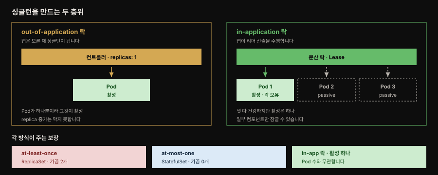
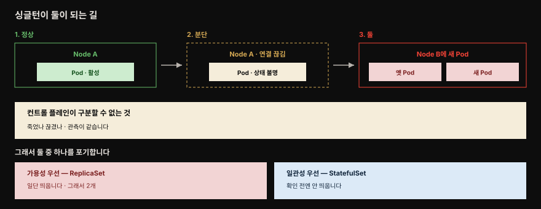

# Singleton Service — 한 번에 하나만 활성이되 고가용

> 『Kubernetes Patterns』 10장 정독. **Singleton Service**는 앱 인스턴스가 한 번에 하나만 활성이면서도 고가용성을 유지하도록 보장하는 패턴입니다. 앱 안에서 구현하거나 Kubernetes에 전적으로 위임할 수 있습니다. 스케일이 기본인 Kubernetes에서 "일부러 하나만"을 만들어야 하는 역설적 상황을 다룹니다.



왼쪽은 컨트롤러가 replica를 하나로 묶는 방식이고 오른쪽은 앱이 스스로 리더를 뽑는 방식입니다. 오른쪽에서 Pod 셋이 모두 건강한데도 활성은 하나뿐이라는 점이 이 패턴의 핵심입니다. 아래 세 상자가 각 방식이 실제로 주는 보장이며, 이 문서는 그 차이를 따라갑니다.


## 핵심 요약

> Kubernetes는 앱을 쉽게 스케일합니다. 그런데 한 번에 한 인스턴스만 활성이어야 하는 경우가 있고, 그럴 때도 고가용성은 유지해야 합니다.

Kubernetes가 제공하는 주된 능력 하나가 앱을 쉽고 투명하게 스케일하는 것입니다. `kubectl scale` 명령으로 명령형으로 하거나, ReplicaSet 같은 컨트롤러 정의로 선언적으로 하거나, 부하에 따라 동적으로 할 수도 있습니다. 같은 서비스를 여러 인스턴스로 돌리면 대개 처리량과 가용성이 함께 오릅니다. 한 인스턴스가 비정상이 되면 요청 디스패처가 이후 요청을 건강한 인스턴스로 넘기기 때문입니다.

그러나 한 번에 한 인스턴스만 돌아야 하는 경우가 있습니다. 책은 세 가지를 듭니다.

1. 서비스에 **주기적으로 실행되는 작업**이 있는데 인스턴스가 여럿이면, 매 인스턴스가 예정된 간격마다 작업을 발동해 기대와 달리 중복이 발생합니다.
2. 파일시스템이나 데이터베이스 같은 **특정 리소스를 폴링**하는데, 단일 인스턴스가 어쩌면 단일 스레드로만 폴링하고 처리해야 하는 경우입니다.
3. 메시지 브로커에서 **순서를 보존하며** 소비해야 하는데, 그 소비자가 단일 스레드이면서 싱글턴이어야 하는 경우입니다.

필요한 것은 **active-passive** 토폴로지입니다. 같은 Pod의 replica를 여럿 돌리면 모든 인스턴스가 활성인 active-active가 되므로, 하나만 활성이고 나머지는 passive인 구조를 따로 만들어야 합니다. 이는 근본적으로 두 층위에서 달성됩니다.

- **out-of-application 잠금** — 앱 바깥의 관리 프로세스가 단일 인스턴스를 보장합니다. `replicas: 1`인 컨트롤러가 그 역할을 합니다.
- **in-application 잠금** — 앱이 분산 락으로 리더 선출을 수행합니다. Pod가 여럿 떠도 락을 잡은 하나만 활성이 됩니다.

두 방식이 주는 보장은 같지 않습니다. **ReplicaSet은 가용성을 일관성보다 우선**해 replica 개수에 **at-least**(하나 이상) 의미를 적용하므로 노드 분단 같은 상황에서 가끔 두 개가 동시에 돕니다. **StatefulSet은 일관성을 우선**해 at-most-one을 보장하는 대신 가끔 0개가 됩니다.

**PodDisruptionBudget**은 반대 방향의 보완입니다. 싱글턴이 동시에 활성인 *최대* 수를 제한한다면, PDB는 유지보수로 동시에 *내려가는* 수를 제한합니다.


## 학습 목표

> 이 편을 읽고 나면 다음을 설명할 수 있습니다.

1. active-active와 active-passive 토폴로지의 차이를 말하고, 싱글턴이 필요한 세 상황을 들 수 있습니다.
2. ReplicaSet의 at-least와 StatefulSet의 at-most-one이 가용성과 일관성 중 무엇을 택한 결과인지 설명할 수 있습니다.
3. 노드 분단에서 싱글턴이 잠시 둘이 되는 경로를, 컨트롤 플레인이 무엇을 구분하지 못하는지와 함께 설명할 수 있습니다.
4. in-application 잠금의 네 구현(ZooKeeper·Kubernetes Lease·Camel·Dapr)이 각각 무엇을 락으로 쓰는지 구분할 수 있습니다.
5. headless Service가 싱글턴 StatefulSet에 적합한 이유와 그 DNS 동작을 설명할 수 있습니다.
6. PodDisruptionBudget의 자발적·비자발적 축출 구분과 `minAvailable`·`maxUnavailable` 제약을 설명할 수 있습니다.
7. 앱의 일부만 싱글턴이어야 할 때 두 가지 선택지를 비교하고 판단할 수 있습니다.


## Out-of-Application 잠금

> 앱 바깥의 관리 프로세스가 단일 인스턴스를 보장합니다. 앱 자신은 자기가 싱글턴이라는 사실조차 모릅니다.

이름 그대로 이 메커니즘은 애플리케이션 바깥의 관리 프로세스에 기댑니다. 앱 구현 자체는 이 제약을 인지하지 못한 채 싱글턴 인스턴스로 실행됩니다. 관점을 바꾸면 Spring Framework 같은 관리 런타임이 자바 클래스를 한 번만 인스턴스화하는 것과 비슷합니다. 그 클래스 구현은 자기가 싱글턴으로 실행된다는 것도, 다중 인스턴스화를 막는 코드 구성을 담고 있지도 않습니다.

Kubernetes에서 이를 달성하는 방법은 Pod 하나를 띄우는 것입니다. 다만 그 활동만으로는 싱글턴 Pod의 고가용성이 확보되지 않습니다. ReplicaSet 같은 컨트롤러로 그 Pod를 뒷받침해야 비로소 고가용 싱글턴이 됩니다. 이 토폴로지는 passive 인스턴스가 없으므로 정확한 active-passive는 아니지만 같은 효과를 냅니다. Kubernetes가 Pod 하나가 늘 돌고 있도록 보장하고, 컨트롤러가 헬스 체크와 치유를 수행해 고가용성을 주기 때문입니다.

이 접근에서 계속 지켜봐야 할 것은 **replica 수**입니다. 실수로 바뀌어서는 안 됩니다. 뒤에서 볼 PodDisruptionBudget으로 자발적인 감소는 다룰 수 있지만, **replica 수의 증가를 막을 플랫폼 수준의 메커니즘은 없습니다.**

### 왜 "늘 하나만"이 완전히 참이 아닌가

특히 상황이 나빠질 때 이 말은 참이 아니게 됩니다. ReplicaSet 같은 Kubernetes 프리미티브는 **가용성을 일관성보다 우선**하는데, 이는 고가용이고 확장 가능한 분산 시스템을 달성하기 위한 의도적 결정입니다. 그래서 ReplicaSet은 replica에 "at most"가 아니라 **"at least"** 의미를 적용합니다. `replicas: 1`로 싱글턴을 설정해도 컨트롤러는 최소 하나가 늘 돌고 있게 할 뿐, 가끔은 더 많을 수 있습니다.



가장 흔한 코너 케이스가 그림의 경로입니다. 컨트롤러가 관리하는 Pod가 놓인 노드가 비정상이 되어 클러스터의 나머지와 연결이 끊깁니다. 이 시나리오에서 ReplicaSet 컨트롤러는 용량이 충분하다는 전제 아래 건강한 노드에 다른 Pod 인스턴스를 시작합니다. 분단된 노드의 Pod가 종료됐음을 보장하지 **않은 채로** 말입니다. 비슷하게 replica 수를 바꾸거나 Pod를 다른 노드로 재배치할 때도 Pod 수가 일시적으로 원하는 수를 넘을 수 있습니다. 그 일시적 증가는 무상태이고 확장 가능한 앱에 필요한 고가용성을 확보하고 중단을 피하려는 의도에서 나옵니다.

싱글턴은 회복하고 복구할 수 있지만 정의상 고가용은 아닙니다. 그리고 보통 **일관성을 가용성보다 우선**합니다. 일관성을 우선하면서 원하는 엄격한 싱글턴 보장을 주는 Kubernetes 리소스가 **StatefulSet**입니다. ReplicaSet이 원하는 보장을 주지 못하고 엄격한 싱글턴 요구가 있다면 StatefulSet이 답일 수 있습니다. 상태 있는 앱을 위한 리소스라 더 강한 싱글턴 보장을 포함한 여러 기능을 주지만, 복잡성도 함께 늘어납니다. 자세한 것은 12장 Stateful Service에서 다룹니다.

### headless Service로 싱글턴에 닿기

Kubernetes의 싱글턴 앱은 보통 메시지 브로커·관계형 데이터베이스·파일 서버 같은 외부 시스템으로 **나가는** 연결을 엽니다. 그러나 가끔은 싱글턴 Pod가 들어오는 연결을 받아야 하고, 그것을 가능하게 하는 것이 Service 리소스입니다.

일반 Service(`type: ClusterIP`)는 가상 IP를 만들어 셀렉터가 일치하는 모든 Pod 인스턴스에 로드밸런싱을 수행합니다. 그런데 StatefulSet으로 관리되는 싱글턴 Pod는 Pod가 하나뿐이고 안정된 네트워크 정체성을 가집니다. 이런 경우에는 `type: ClusterIP`와 `clusterIP: None`을 함께 설정한 **headless Service**를 만드는 편이 낫습니다.

headless라 불리는 데는 세 가지 이유가 있습니다.

- 그런 Service에는 가상 IP 주소가 없습니다.
- kube-proxy가 이들 Service를 처리하지 않습니다.
- 플랫폼이 프록시를 수행하지 않습니다.

그럼에도 유용한 이유는 셀렉터를 가진 headless Service가 API 서버에 엔드포인트 레코드를 만들고 일치하는 Pod의 DNS A 레코드를 생성하기 때문입니다. 그 덕분에 Service에 대한 DNS 조회가 가상 IP가 아니라 백킹 Pod의 IP 주소를 반환합니다.

```
my-singleton.default.svc.cluster.local
└──────────┘ └─────┘
 Service명   네임스페이스
```

`my-singleton`이라는 이름의 headless Service를 만들었다면 위 주소로 Pod의 IP에 직접 접근합니다. Service 가상 IP를 거치지 않는 경로입니다.

정리하면 선택은 요구의 엄격함에 달렸습니다.

| 요구 | 선택 | 우선하는 것 | 감수하는 것 |
|------|------|------------|------------|
| 비엄격 싱글턴 (at-least-one이면 충분) | ReplicaSet `replicas: 1` | 가용성 | 코너 케이스에서 하나 이상 |
| 엄격 싱글턴 (at-most-one) + 나은 디스커버리 | StatefulSet + headless Service | 일관성 | 코너 케이스에서 0개 |


## In-Application 잠금

> 앱 자신이 분산 락으로 리더를 뽑습니다. Pod가 여럿 떠 모두 건강해도 활성은 하나입니다.

분산 환경에서 서비스 인스턴스 수를 제어하는 다른 방법이 **분산 락**입니다. 서비스 인스턴스나 그 안의 컴포넌트가 활성화될 때 락을 얻으려 시도해 성공하면 활성이 됩니다. 락 획득에 실패한 이후의 인스턴스는 대기 상태로 들어갑니다. 그러면서 현재 활성인 서비스가 락을 놓을 경우에 대비해 계속 락을 얻으려 시도합니다.

많은 기존 분산 프레임워크가 고가용성과 회복성을 얻으려 이 메커니즘을 씁니다. 메시지 브로커 Apache ActiveMQ가 예입니다. 데이터 소스가 공유 락을 제공하는 고가용 active-passive 토폴로지로 돌 수 있습니다. 먼저 시작한 브로커 인스턴스가 락을 획득해 활성이 되고, 이후 시작한 인스턴스는 passive가 되어 락이 풀리기를 기다립니다.

이 전략은 객체지향 세계의 고전 Singleton과 비교됩니다. 고전 Singleton은 정적 클래스 변수에 저장된 객체 인스턴스이며, 이 경우 클래스는 자기가 싱글턴임을 **알고** 같은 프로세스에서 다중 인스턴스화를 허용하지 않도록 작성됩니다. 분산 시스템에서 이는 컨테이너화된 앱 자체가, 시작된 Pod 인스턴스 수와 무관하게 한 번에 하나 넘는 활성 인스턴스를 허용하지 않도록 작성돼야 한다는 뜻입니다. 이를 위해 먼저 분산 락 구현이 필요하며 Apache ZooKeeper·HashiCorp Consul·Redis·etcd 등이 후보입니다.

네 가지 구현이 각각 무엇을 락으로 쓰는지가 이 절의 핵심입니다.

| 구현 | 락으로 쓰는 것 | 동작 |
|------|---------------|------|
| **ZooKeeper** | ephemeral node | 클라이언트 세션 동안 존재하고 세션이 끝나면 삭제되는 노드입니다. 먼저 뜬 인스턴스가 세션을 열고 ephemeral node를 만들어 활성이 되며, 나머지는 그 노드가 해제되기를 기다립니다 |
| **etcd · Kubernetes Lease** | Lease 오브젝트 | 락만을 위해 ZooKeeper 클러스터를 관리하기보다 Kubernetes API로 노출된 etcd를 쓰는 편이 낫습니다. Raft 프로토콜로 복제 상태를 유지하며 리더 선출에 필요한 빌딩 블록을 제공합니다 |
| **Apache Camel** | ConfigMap | etcd API를 직접 접근하는 대신 Kubernetes API로 ConfigMap을 분산 락으로 활용합니다. 한 번에 한 Pod만 ConfigMap을 수정할 수 있다는 낙관적 잠금 보장에 기댑니다 |
| **Dapr** | named lock | Distributed Lock 빌딩 블록이 교체 가능한 구현으로 HTTP·gRPC API를 제공합니다. lease 기반이라 앱이 락을 잡고 예외로 풀지 못해도 일정 시간 뒤 자동 해제되어 데드락을 막습니다 |

Kubernetes Lease를 조금 더 보면 이미 클러스터 안에서 쓰이고 있는 메커니즘임을 알 수 있습니다.[^lease] 노드마다 이름이 일치하는 Lease 오브젝트가 있고, 각 노드의 kubelet이 Lease의 `renewTime` 필드를 갱신하며 heartbeat를 냅니다. 컨트롤 플레인은 이 정보로 노드의 가용성을 판단합니다. 또한 고가용 클러스터 배포에서 kube-controller-manager와 kube-scheduler 같은 컨트롤 플레인 컴포넌트가 한 번에 하나만 활성이고 나머지는 standby로 남도록 하는 데도 Lease가 쓰입니다.

Dapr든 ZooKeeper든 etcd든 어떤 분산 락 구현이든 결과는 같습니다. 앱의 한 인스턴스만 리더가 되어 자기를 활성화하고 나머지는 passive로 락을 기다립니다. Pod replica가 여럿 시작되어 모두 건강하고 돌아가고 있어도, 오직 하나만 활성으로 비즈니스 기능을 수행하며 나머지는 리더가 실패하거나 종료될 경우에 대비해 락 획득을 기다립니다.


## Pod Disruption Budget

> 싱글턴이 동시에 활성인 최대 수를 제한한다면, PDB는 동시에 내려가는 수를 제한합니다. 방향이 반대인 보완입니다.

싱글턴 서비스와 리더 선출이 서비스가 한 번에 돌리는 인스턴스의 최대 수를 제한하려 한다면, Kubernetes의 PodDisruptionBudget 기능은 보완적이면서 다소 반대인 기능을 제공합니다. 유지보수로 동시에 내려가는 인스턴스 수를 제한하는 것입니다.

PDB는 핵심적으로 일정 수 또는 비율의 Pod가 어느 한 시점에 노드에서 **자발적으로 축출되지 않도록** 보장합니다. 여기서 자발적이란 특정 시간 동안 지연될 수 있는 축출을 뜻합니다. 무엇이 여기 해당하고 무엇이 해당하지 않는지가 PDB 이해의 갈림길입니다.

| 구분 | 예 | PDB 적용 |
|------|-----|---------|
| 자발적 축출 | 유지보수·업그레이드를 위한 노드 드레인(`kubectl drain`), 클러스터 스케일다운 | 적용됩니다. 지연시키거나 막습니다 |
| 비자발적 축출 | 노드가 비정상이 되는 경우처럼 예측·통제 불가한 상황 | 적용되지 않습니다 |

```yaml
apiVersion: policy/v1
kind: PodDisruptionBudget
metadata:
  name: random-generator-pdb
spec:
  selector:
    matchLabels:
      app: random-generator   # 가용 Pod를 세는 기준이 되는 셀렉터
  minAvailable: 2             # 최소 2개는 늘 가용해야 합니다
```

`minAvailable`에는 `80%` 같은 퍼센트도 지정할 수 있습니다. 일치하는 Pod의 20%만 축출될 수 있도록 설정하는 식입니다.

`.spec.minAvailable` 외에 `.spec.maxUnavailable`도 있습니다. 축출 후 그 집합에서 사용 불가능해질 수 있는 Pod 수를 지정하며 절대 수나 퍼센트를 쓸 수 있습니다. 다만 제약이 몇 가지 더 붙습니다.

- 하나의 PodDisruptionBudget에는 `minAvailable`과 `maxUnavailable` **둘 중 하나만** 지정할 수 있습니다.
- ReplicaSet이나 StatefulSet 같은 연관 컨트롤러가 있는 Pod의 축출을 제어하는 데만 쓸 수 있습니다. 컨트롤러가 관리하지 않는 **bare Pod**에는 별도의 제약을 함께 고려해야 합니다.

PDB는 쿼럼을 보장하려고 최소 replica 수가 늘 돌아야 하는 정족수 기반 앱에 유용합니다. 또는 전체 인스턴스 수의 일정 비율 아래로 절대 내려가서는 안 되는 크리티컬 트래픽을 처리하는 앱에도 유용합니다.

싱글턴 맥락에서도 PDB가 쓰입니다. `maxUnavailable`을 `0`으로 두거나 `minAvailable`을 `100%`로 두면 자발적 축출을 전부 막습니다. 어떤 워크로드의 자발적 축출을 0으로 설정하면 그 Pod는 unevictable이 되어 노드 드레인을 영원히 막습니다. 이는 클러스터 운영자가 고가용이 아닌 Pod를 실수로 축출하기 전에, 싱글턴 워크로드 소유자에게 다운타임을 문의하도록 만드는 절차의 한 단계로 활용할 수 있습니다.


## 앱 일부만 싱글턴일 때

> 책이 Discussion에서 마지막으로 다루는 시나리오입니다. 전체를 싱글턴으로 묶으면 스케일 가능한 부분까지 함께 묶여 버립니다.

강한 싱글턴 보장이 필요한 use case라면 ReplicaSet의 out-of-application 잠금에 기댈 수 없습니다. Kubernetes ReplicaSet은 Pod에 At-Most-One 의미를 보장하기보다 Pod의 가용성을 보존하도록 설계됐기 때문입니다. 그 결과 두 복제본이 짧은 기간 동시에 도는 실패 시나리오가 여럿 존재합니다. 이것이 받아들일 수 없다면 StatefulSet을 쓰거나, 리더 선출 과정을 더 강한 보장으로 제어하는 in-application 잠금을 검토합니다. 후자는 replica 수를 바꿔 실수로 Pod를 스케일하는 위험도 완화합니다.

다른 시나리오도 있습니다. 컨테이너화된 앱의 **일부만** 싱글턴이어야 하는 경우입니다. 여러 인스턴스로 스케일해도 안전한 HTTP 엔드포인트를 제공하면서, 동시에 싱글턴이어야 하는 폴링 컴포넌트도 가진 앱이 그 예입니다. 여기서 out-of-application 잠금을 쓰면 서비스 전체의 스케일이 막혀 버립니다. 선택은 둘입니다.

| 선택 | 방법 | 평가 |
|------|------|------|
| 배포 단위 분리 | 싱글턴 컴포넌트를 별도 배포 단위로 떼어내 그것만 싱글턴으로 유지 | 이론적으로는 좋지만 늘 실용적이거나 오버헤드를 감수할 값어치가 있지는 않습니다 |
| in-application 잠금 | 싱글턴이어야 하는 컴포넌트만 잠금 | 앱 전체를 투명하게 스케일하면서 HTTP는 스케일하고 다른 부분은 active-passive 싱글턴으로 둘 수 있습니다 |


## 심화 학습

> 원서 10장 밖에서 보강한 내용입니다. 출처를 링크로 남깁니다.

### ReplicaSet이 at-most-one을 보장하지 못하는 근본 이유

책은 "ReplicaSet이 가용성을 일관성보다 우선한다"고 담담히 말하지만, 그 밑에는 분산 시스템의 근본 한계가 있습니다. 노드가 클러스터에서 분리됐을 때 컨트롤 플레인은 그 노드의 Pod가 죽었는지 그저 연결이 끊긴 것인지 **구분할 수 없습니다.** 네트워크 분단과 노드 장애가 관측상 동일하기 때문입니다.

여기서 가능한 선택은 둘뿐입니다.

1. 일단 죽었다고 보고 새 Pod를 띄웁니다. 가용성을 지키지만 분리된 Pod가 실은 살아 있으면 두 개가 공존합니다.
2. 확인될 때까지 띄우지 않습니다. 일관성을 지키지만 정말 죽었다면 그동안 가용성을 잃습니다.

CAP 정리에서 분단(P) 상황에 놓였을 때 A와 C 중 하나를 포기하는 바로 그 지점입니다. ReplicaSet은 A를, StatefulSet은 C를 택합니다.

StatefulSet이 지키는 것은 정확히 **"같은 정체성(identity)의 Pod가 최대 하나"** 입니다. 메커니즘은 순서 자체가 아니라 **삭제 확인**입니다. 컨트롤러는 API 서버가 기존 `pod-0`의 삭제를 확인해 주기 전에는 새 `pod-0`을 만들지 않습니다.

그래서 노드가 닿지 않게 되면 그 Pod가 `Terminating`에 무기한 머물고, 노드 오브젝트를 지우거나 강제 삭제로 사람이 개입하기 전까지 대체 Pod가 생기지 않습니다. 그 대가가 가끔 0개입니다. (`podManagementPolicy: Parallel`로 순차 보장을 꺼도 at-most-one은 유지됩니다. 둘은 별개 장치입니다.)

그래서 판단 기준은 단순해집니다. 순서 보존 소비자나 단일 라이터 DB처럼 **둘이면 데이터가 깨지는** 워크로드는 StatefulSet이나 in-application 락을 씁니다. 잠깐 둘이어도 무방한 워크로드는 ReplicaSet으로 충분합니다.

### Spring 앱에서 컴포넌트만 잠그기

앞 절의 "앱 일부만 싱글턴" 시나리오가 Spring 실무에서 가장 흔합니다. HTTP 엔드포인트는 스케일해도 안전하지만 `@Scheduled` 폴링이나 Kafka 순서 보존 소비자는 싱글턴이어야 하는 앱입니다.

Spring 생태계에서는 ZooKeeper나 etcd를 직접 다루기보다 다음 두 가지를 씁니다.

- **Spring Integration의 `LockRegistry`** — JDBC·Redis·ZooKeeper 백엔드를 지원합니다.
- **ShedLock** — 스케줄 작업만 대상으로 하는 더 좁은 도구입니다.

`@Scheduled` 메서드를 `LockRegistry`로 감싸면 앱은 replica 여럿으로 떠서 HTTP를 모두 스케일하면서, 스케줄 작업만 락을 잡은 한 인스턴스에서 발동합니다. 책이 말한 "HTTP는 스케일하고 폴링만 active-passive"를 그대로 구현한 형태입니다.

Kubernetes 위에서라면 책의 권장대로 ZooKeeper 대신 **클러스터가 이미 가진 오브젝트**를 락으로 쓰는 편이 깔끔합니다. 락만을 위한 별도 인프라를 세우지 않아도 됩니다.

여기서 한 가지 정확히 해 둘 것이 있습니다. Spring Cloud Kubernetes의 leader election은 **구현이 둘**입니다.

- **예전 구현** — `ConfigMap`을 락으로 씁니다(`spring.cloud.kubernetes.leader.config-map-name`).
- **새 구현** — 공식 문서 표현대로 *"클러스터 버전에 따라 `Lease` 또는 `ConfigMap` 중 하나를"* 씁니다. Lease가 지원되는 클러스터에서도 `use-config-map-as-lock=true`로 ConfigMap을 강제할 수 있습니다.

즉 "Spring Cloud Kubernetes = Lease"라고 외우면 틀립니다.

> StatefulSet의 기초와 중단 정책은 형제 정독본 [StatefulSet 기초](../kubernetes-in-action/16-01.StatefulSet%20%EA%B8%B0%EC%B4%88%20%E2%80%94%20Pets%20vs%20Cattle%C2%B7ordinal%C2%B7headless%20Service.md)와 개념 노트 [토폴로지 분산과 중단 정책](../../kubernetes/05_scheduling/05-02.%ED%86%A0%ED%8F%B4%EB%A1%9C%EC%A7%80%20%EB%B6%84%EC%82%B0%EA%B3%BC%20%EC%A4%91%EB%8B%A8%20%EC%A0%95%EC%B1%85.md)에 상세합니다.

- 출처: [Spring Cloud Kubernetes — Leader Election](https://docs.spring.io/spring-cloud-kubernetes/reference/leader-election.html) (2026-07-12 조회)
- 출처: [Dapr — Distributed Lock](https://docs.dapr.io/developing-applications/building-blocks/distributed-lock/)


## 능동 회상

> 먼저 스스로 답해 본 뒤 아래 정답 절에서 맞춰 봅니다. 정답은 이 절 다음에 번호 순서대로 있습니다.

1. 싱글턴이 필요한 상황 세 가지를 책의 예로 들어 보세요.
2. active-active와 active-passive는 무엇이 다른가요? Pod replica를 여럿 돌리면 어느 쪽이 되나요?
3. out-of-application 잠금에서 앱은 자기가 싱글턴임을 아나요? 비유로 설명해 보세요.
4. Pod 하나를 띄우는 것만으로 부족한 이유는 무엇이며, 무엇을 더해야 고가용 싱글턴이 되나요?
5. out-of-application 잠금에서 플랫폼이 막아 주지 **못하는** 것은 무엇인가요?
6. `replicas: 1`인데 Pod가 둘이 되는 대표적 경로를 단계로 설명해 보세요.
7. 그 상황에서 컨트롤 플레인이 구분하지 못하는 것은 무엇인가요?
8. headless Service는 어떻게 만들며, 일반 Service와 달리 DNS 조회가 무엇을 반환하나요?
9. in-application 잠금의 네 구현은 각각 무엇을 락으로 쓰나요?
10. Kubernetes Lease는 클러스터 안에서 이미 어디에 쓰이고 있나요?
11. PDB의 자발적 축출과 비자발적 축출을 구분하고 예를 들어 보세요.
12. `minAvailable`과 `maxUnavailable`에는 어떤 제약이 있나요?
13. 싱글턴에 `maxUnavailable: 0`을 걸면 어떤 일이 일어나며, 왜 그렇게 하나요?
14. 앱 일부만 싱글턴이어야 할 때 두 선택지는 무엇이고 각각의 평가는 어떤가요?


## 정답

> 위 회상 질문의 답입니다. 번호가 대응합니다.

**1.** 첫째, 주기적으로 실행되는 작업이 있는데 인스턴스가 여럿이면 매 인스턴스가 예정된 간격마다 발동해 중복이 생기는 경우입니다. 둘째, 파일시스템이나 데이터베이스를 폴링하는데 단일 인스턴스가 어쩌면 단일 스레드로만 처리해야 하는 경우입니다. 셋째, 메시지 브로커에서 순서를 보존하며 소비해야 하는데 그 소비자가 단일 스레드 싱글턴이어야 하는 경우입니다.

**2.** active-active는 모든 인스턴스가 활성인 구조이고 active-passive는 하나만 활성이며 나머지는 passive인 구조입니다. 같은 Pod의 replica를 여럿 돌리면 active-active가 되므로, 싱글턴을 원한다면 active-passive를 따로 만들어야 합니다.

**3.** 알지 못합니다. 앱 바깥의 관리 프로세스가 단일 인스턴스를 보장하고 앱은 그 제약을 인지하지 못한 채 실행됩니다. Spring Framework 같은 관리 런타임이 자바 클래스를 한 번만 인스턴스화하는 것과 비슷합니다. 그 클래스는 자기가 싱글턴으로 실행되는 줄도 모르고, 다중 인스턴스화를 막는 코드도 갖고 있지 않습니다.

**4.** Pod 하나를 띄우는 것만으로는 고가용성이 확보되지 않기 때문입니다. ReplicaSet 같은 컨트롤러로 뒷받침해야 헬스 체크와 치유가 이루어져 고가용 싱글턴이 됩니다. passive 인스턴스가 없으므로 정확한 active-passive는 아니지만, Kubernetes가 Pod 하나가 늘 돌게 보장하므로 같은 효과를 냅니다.

**5.** **replica 수의 증가**입니다. PodDisruptionBudget으로 자발적인 감소는 다룰 수 있지만, replica 수가 올라가는 것을 막을 플랫폼 수준의 메커니즘은 없습니다. 그래서 replica 수가 실수로 바뀌지 않는지 계속 지켜봐야 합니다.

**6.** 먼저 Node A에서 Pod 하나가 정상 동작합니다. 그다음 Node A가 비정상이 되어 클러스터의 나머지와 연결이 끊깁니다. 그러면 ReplicaSet 컨트롤러가 용량이 충분하다는 전제 아래 건강한 노드에 다른 Pod 인스턴스를 시작하는데, 분단된 노드의 Pod가 종료됐음을 보장하지 않은 채로 그렇게 합니다. 결과적으로 분단된 Pod가 살아 있다면 둘이 동시에 돕니다.

**7.** Pod가 죽었는지 단지 연결만 끊긴 것인지를 구분하지 못합니다. 네트워크 분단과 노드 장애가 관측상 동일하기 때문입니다. 그래서 가용성을 택해 일단 새로 띄우거나, 일관성을 택해 확인 전까지 띄우지 않거나 둘 중 하나를 골라야 합니다.

**8.** `type: ClusterIP`와 `clusterIP: None`을 함께 설정해 만듭니다. 가상 IP가 없고 kube-proxy가 처리하지 않으며 프록시도 없습니다. 그래도 셀렉터가 있으면 API 서버에 엔드포인트 레코드를 만들고 일치하는 Pod의 DNS A 레코드를 생성합니다. 그래서 DNS 조회는 가상 IP가 아니라 **백킹 Pod의 IP 주소**를 반환합니다. `my-singleton.default.svc.cluster.local`로 Pod에 직접 접근하는 경로입니다.

**9.** ZooKeeper는 세션이 끝나면 삭제되는 ephemeral node를 씁니다. etcd 기반 Kubernetes Lease는 Lease 오브젝트를 씁니다. Apache Camel은 ConfigMap을 락으로 쓰며 한 번에 한 Pod만 수정 가능하다는 낙관적 잠금 보장에 기댑니다. Dapr는 named lock을 쓰고 lease 기반이라 앱이 예외로 락을 못 풀어도 일정 시간 뒤 자동 해제됩니다.

**10.** 두 곳입니다. 노드 heartbeat에 쓰여, 노드마다 이름이 일치하는 Lease가 있고 kubelet이 `renewTime`을 갱신하면 컨트롤 플레인이 그것으로 노드 가용성을 판단합니다. 또한 고가용 클러스터 배포에서 kube-controller-manager와 kube-scheduler 같은 컴포넌트가 한 번에 하나만 활성이고 나머지는 standby로 남게 하는 데 쓰입니다.

**11.** 자발적 축출은 특정 시간 동안 지연될 수 있는 축출로, 유지보수나 업그레이드를 위한 노드 드레인과 클러스터 스케일다운이 예입니다. 비자발적 축출은 노드가 비정상이 되는 경우처럼 예측하거나 통제할 수 없는 상황이며 PDB의 적용 범위 밖입니다.

**12.** 하나의 PDB에는 둘 중 **하나만** 지정할 수 있습니다. 또한 ReplicaSet이나 StatefulSet 같은 연관 컨트롤러가 있는 Pod의 축출을 제어하는 데만 쓸 수 있고, 컨트롤러가 관리하지 않는 bare Pod에는 별도의 제약을 고려해야 합니다. 값은 절대 수와 퍼센트 모두 가능합니다.

**13.** 자발적 축출이 전부 막혀 그 Pod가 unevictable이 되고 노드 드레인이 영원히 진행되지 않습니다. 이는 클러스터 운영자가 고가용이 아닌 Pod를 실수로 축출하기 전에, 싱글턴 워크로드 소유자에게 다운타임을 문의하도록 만드는 절차의 한 단계로 활용합니다.

**14.** 하나는 싱글턴 컴포넌트를 별도 배포 단위로 분리하는 것으로, 이론적으로는 좋지만 늘 실용적이거나 오버헤드를 감수할 값어치가 있지는 않습니다. 다른 하나는 in-application 잠금으로 싱글턴이어야 하는 컴포넌트만 잠그는 것이며, 앱 전체를 투명하게 스케일하면서 HTTP는 스케일하고 다른 부분은 active-passive로 둘 수 있습니다.


## 실무 적용

- **엄격 싱글턴이면 ReplicaSet에 의존하지 않는다.** ReplicaSet은 at-least라 잠깐 2개가 될 수 있습니다. 둘이면 데이터가 깨지는 워크로드는 StatefulSet이나 in-app 락을 씁니다.
- **비엄격 싱글턴은 ReplicaSet replicas:1로 충분.** 잠깐 둘이어도 무방하면 가장 단순합니다.
- **앱 일부만 싱글턴이면 in-application 잠금.** HTTP는 스케일하고 폴링·스케줄만 리더 선출로 잠급니다(Spring Integration LockRegistry·ShedLock).
- **잠금 백엔드는 클러스터가 가진 것을 재활용한다.** 별도 ZooKeeper 대신 Lease나 ConfigMap을 쓰면 인프라가 준다.
- **싱글턴은 PDB로 보호한다.** `maxUnavailable: 0`으로 자발적 축출을 막아, 드레인 전에 소유자에게 문의하게 합니다.
- **실수 스케일을 경계한다.** replicas를 실수로 올리면 out-of-app 싱글턴이 깨집니다. in-app 락은 이 위험도 완화합니다.


## 체크리스트

- [ ] active-active와 active-passive의 차이, 싱글턴이 필요한 세 경우를 말할 수 있습니까?
- [ ] ReplicaSet의 at-least와 StatefulSet의 at-most-one이 가용성과 일관성 중 무엇을 택한 결과인지 설명할 수 있습니까?
- [ ] 노드 분단에서 왜 잠깐 2개가 되는지, 컨트롤 플레인이 무엇을 구분하지 못하는지 압니까?
- [ ] replica 수의 증가는 플랫폼이 막아 주지 못한다는 점을 운영에 반영했습니까?
- [ ] in-application 잠금 네 구현이 각각 무엇을 락으로 쓰는지 구분할 수 있습니까?
- [ ] headless Service가 싱글턴 StatefulSet에 적합한 이유와 DNS 반환값을 설명할 수 있습니까?
- [ ] PDB의 minAvailable·maxUnavailable 제약과 자발적·비자발적 축출 구분을 압니까?
- [ ] 앱 일부만 싱글턴일 때 배포 단위 분리와 in-application 잠금 중 무엇이 맞는지 판단할 수 있습니까?


## 면접 관점

**Q. ReplicaSet replicas:1이 왜 엄격한 싱글턴이 아닙니까?**
ReplicaSet은 가용성을 일관성보다 우선해 replica 개수에 **"at least"**(하나 이상) 의미를 적용하기 때문입니다. 메시지 전달의 at-least-once와는 다른 말이니 섞지 않는 편이 좋습니다.

노드가 클러스터에서 분리되면 컨트롤 플레인은 그 Pod가 죽었는지 연결만 끊긴 건지 구분할 수 없습니다. 이때 ReplicaSet은 가용성을 위해 건강한 노드에 새 Pod를 띄우므로, 분리된 Pod가 살아 있으면 잠깐 2개가 공존합니다. 엄격한 at-most-one이 필요하면 StatefulSet이나 in-application 락을 씁니다.

**Q. in-application 잠금은 어떻게 싱글턴을 보장합니까?**
앱이 분산 락(ZooKeeper·etcd·Kubernetes Lease 등)으로 리더 선출을 합니다. 인스턴스가 활성화될 때 락을 얻으려 시도해 성공한 하나만 활성이 되고 실패한 인스턴스는 passive로 락 해제를 기다립니다. Pod가 여럿 떠 다 건강해도 락을 잡은 하나만 비즈니스 기능을 수행합니다.

**Q. 싱글턴과 PodDisruptionBudget은 어떻게 상호보완합니까?**
싱글턴·리더 선출이 최대 활성 인스턴스 수를 제한한다면, PDB는 유지보수로 동시에 내려가는 인스턴스 수를 제한합니다. 자발적 축출(드레인·스케일다운)만 대상이고 노드 비정상 같은 비자발적 축출은 제외합니다. 싱글턴에 `maxUnavailable: 0`을 걸면 자발적 축출을 막아, 운영자가 드레인 전에 소유자에게 문의하게 합니다.

**Q. HTTP는 스케일하고 스케줄 작업만 싱글턴으로 하려면?**
out-of-application 잠금(replicas:1)을 쓰면 HTTP까지 스케일 못 하니, in-application 잠금으로 그 컴포넌트만 잠급니다. Spring이면 Spring Integration의 LockRegistry나 ShedLock으로 `@Scheduled` 메서드만 락으로 감싸, 앱은 replica 여럿으로 HTTP를 스케일하면서 스케줄은 락을 잡은 한 인스턴스에서만 발동합니다. 백엔드는 Kubernetes Lease API를 재활용하면 깔끔합니다.


## 참고 자료

- 원서: 《Kubernetes Patterns, Second Edition》(Bilgin Ibryam·Roland Huß, O'Reilly) Ch10. Singleton Service
- 이 책의 MOC: [Kubernetes Patterns 정독 인덱스](./README.md) · 앞 편: [Daemon Service](./09-01.Daemon%20Service%20%E2%80%94%20%EB%85%B8%EB%93%9C%EB%A7%88%EB%8B%A4%20%EB%8F%84%EB%8A%94%20%EC%9D%B8%ED%94%84%EB%9D%BC%20Pod.md)
- 형제 정독본: [StatefulSet 기초](../kubernetes-in-action/16-01.StatefulSet%20%EA%B8%B0%EC%B4%88%20%E2%80%94%20Pets%20vs%20Cattle%C2%B7ordinal%C2%B7headless%20Service.md)
- 개념 노트: [토폴로지 분산과 중단 정책](../../kubernetes/05_scheduling/05-02.%ED%86%A0%ED%8F%B4%EB%A1%9C%EC%A7%80%20%EB%B6%84%EC%82%B0%EA%B3%BC%20%EC%A4%91%EB%8B%A8%20%EC%A0%95%EC%B1%85.md)
- [Kubernetes — Leases (공식)](https://kubernetes.io/docs/concepts/architecture/leases/) · [Spring Cloud Kubernetes — Leader Election](https://docs.spring.io/spring-cloud-kubernetes/reference/leader-election.html)

[^lease]: Kubernetes — Lease 오브젝트의 노드 heartbeat와 컴포넌트 리더 선출 용도.
<https://kubernetes.io/docs/concepts/architecture/leases/>
- 저자 예제 코드: [k8spatterns/examples](https://github.com/k8spatterns/examples)
