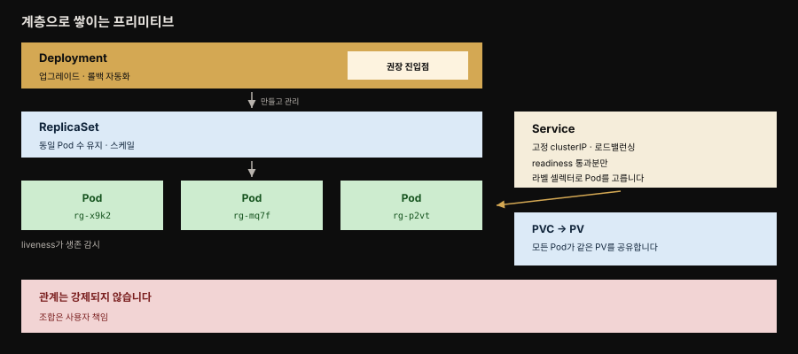
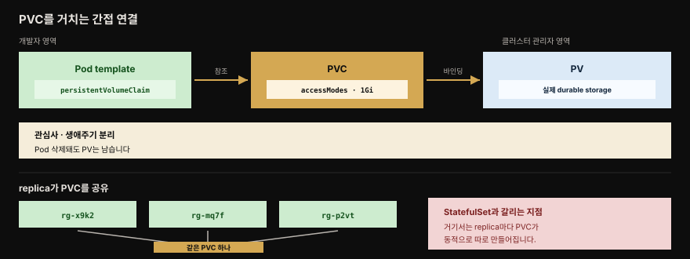

# Stateless Service — 동일·교체 가능한 replica로 수평 확장

> 『Kubernetes Patterns』 11장 정독. **Stateless Service**는 상태를 갖지 않는 애플리케이션을 동일하고 교체 가능한 임시 replica의 집합으로 실행하는 패턴입니다. Kubernetes가 가장 자연스럽게 잘하는 일이며 ReplicaSet·Deployment·Service·PVC라는 계층적 빌딩 블록으로 조립합니다. 뒤이어 오는 Stateful Service(12장)와 짝을 이루는, 기준선이 되는 패턴입니다.



책의 Figure 11-1이 보이는 구조입니다. 아래에서 위로 Pod·ReplicaSet·Deployment가 쌓이고, 오른쪽에서 Service가 readiness를 통과한 Pod로 트래픽을 보내며 PVC가 스토리지를 붙입니다. 아래 붉은 띠가 이 장의 마지막 당부입니다. Kubernetes는 이 블록들 사이에 어떤 관계도 강제하지 않으므로 조합은 사용자 몫입니다.


## 핵심 요약

> 무상태 서비스는 인스턴스 사이에 공유하거나 동기화할 상태가 없는 앱입니다. 어느 replica가 요청을 처리하든 결과가 같습니다.

무상태 컨테이너란 앞으로의 요청 처리에 결정적인 정보를 **내부 저장소**, 곧 메모리나 임시 파일시스템에 담아 두지 않는 컨테이너입니다. 무상태 프로세스는 과거 요청에 대한 기억이나 참조를 갖지 않으므로 모든 요청이 백지에서 시작하는 것처럼 처리됩니다. 그런 정보를 저장해야 한다면 데이터베이스·메시지 큐·마운트된 파일시스템처럼 다른 인스턴스도 접근할 수 있는 **외부 저장소**에 두어야 합니다.

책이 제안하는 검증법은 사고 실험입니다. 서비스 인스턴스들이 서로 다른 노드에 배포돼 있고, 로드밸런서가 sticky session 없이 요청을 아무 인스턴스에나 랜덤으로 흘린다고 상상해 봅니다. 이 구성에서도 서비스가 제 목적을 다한다면 무상태일 가능성이 높습니다. 데이터 그리드처럼 인스턴스 사이에 상태를 분산하는 메커니즘을 갖춘 경우도 여기 포함됩니다.

무상태 앱의 인스턴스는 **동일**하고 **교체 가능**하며 **임시적**입니다. 그래서 수평 확장이 쉽고 죽으면 새 인스턴스로 갈아 끼우면 그만입니다. Kubernetes는 이를 위해 네 가지 프리미티브를 계층으로 제공합니다.

1. **Pod** — liveness probe로 컨테이너가 늘 살아 있도록 지킵니다.
2. **ReplicaSet** — 지정된 수의 동일한 Pod가 건강한 노드에서 돌도록 유지합니다.
3. **Deployment** — replica의 업그레이드와 롤백을 자동화하며, 무상태 앱을 만들 때 권장되는 사용자 추상입니다.
4. **Service** — 고정 IP로 진입점을 주고 readiness probe를 통과한 Pod에만 트래픽을 분배합니다.

상태가 아예 없는 앱은 드뭅니다. 대부분의 무상태 서비스도 상태를 필요로 합니다. 그 상태를 다른 상태 저장 시스템으로 **오프로드**하기 때문에 무상태인 것입니다. 영속 파일 저장이 필요하면 PVC로 요청해 마운트합니다. 다만 ReplicaSet의 모든 Pod는 **같은 PVC를 공유**해 같은 PV를 참조합니다. 이것이 12장 StatefulSet과 갈리는 결정적 지점입니다.


## 학습 목표

> 이 편을 읽고 나면 다음을 설명할 수 있습니다.

1. 무상태 서비스의 정의를 내부 저장소 기준으로 말하고, 랜덤 로드밸런서 사고 실험으로 판별할 수 있습니다.
2. Pod·ReplicaSet·Deployment·Service의 계층 관계와 각자의 책임을 구분할 수 있습니다.
3. ReplicaSet을 Deployment 대신 직접 쓰는 것이 정당한 세 경우를 들 수 있습니다.
4. bare Pod가 ReplicaSet에 acquire되는 조건과 그 부작용을 설명하고 예방할 수 있습니다.
5. Pod가 PV를 직접 참조하지 못하고 PVC를 거치는 이유를 관심사 분리 관점에서 설명할 수 있습니다.
6. accessModes 네 가지의 차이를 노드 단위와 Pod 단위 granularity로 구분하고, ReadWriteOncePod의 싱글턴 함정을 판단할 수 있습니다.
7. ReplicaSet의 모든 Pod가 같은 PVC를 공유한다는 점이 StatefulSet과 어떻게 다른지 설명할 수 있습니다.


## 문제 — 왜 무상태가 다루기 쉬운가

> 마이크로서비스는 임시적(ephemeral)일 때 운영이 쉬워지고, 임시성은 상태가 없을 때 훨씬 쉽게 얻어집니다.

마이크로서비스 아키텍처는 새 클라우드 네이티브 애플리케이션을 만들 때 지배적인 선택입니다. 이 아키텍처를 이끄는 원칙으로는 다음과 같은 것들이 있습니다.

- 단일 관심사를 다룹니다.
- 자기 데이터를 소유합니다.
- 잘 캡슐화된 배포 경계를 갖습니다.

이런 앱은 대개 12-factor 원칙도 따르므로 동적인 클라우드 환경에서 Kubernetes로 운영하기 좋습니다.

원칙 중 일부는 비즈니스 도메인을 이해하고 서비스 경계를 식별하는 일, 곧 도메인 주도 설계 같은 방법론을 요구합니다. 반면 다른 일부는 서비스를 **임시적으로 만드는** 일과 관련됩니다. 임시적이라는 것은 부작용 없이 생성·확장·파괴할 수 있다는 뜻입니다. 그리고 이 후자의 관심사는 서비스가 상태를 가질 때보다 갖지 않을 때 훨씬 다루기 쉽습니다.

무상태 서비스는 서비스 상호작용을 가로질러 인스턴스 내부에 어떤 상태도 유지하지 않습니다. 컨테이너 관점으로 좁히면, 앞으로의 요청 처리에 결정적인 정보를 내부 저장소인 메모리나 임시 파일시스템에 담지 않는 컨테이너가 무상태입니다.

무상태 서비스는 동일하고 대체 가능한 인스턴스로 구성되며, 흔히 상태를 외부 영속 저장 시스템으로 오프로드하고 들어오는 요청을 자기들끼리 나누기 위해 로드밸런서를 씁니다.


## 해법 — 인스턴스·네트워킹·스토리지

> 3장이 Deployment의 업그레이드 측면을 다뤘다면, 여기서는 Deployment가 클러스터에 배포된 애플리케이션 전체를 대표한다는 더 넓은 관점을 봅니다.

Kubernetes에는 Application이나 Container라는 최상위 개체가 없습니다. 대신 애플리케이션은 보통 ReplicaSet·Deployment·StatefulSet 같은 컨트롤러가 관리하는 Pod 집합에 ConfigMap·Secret·Service·PVC 등이 결합된 형태입니다.

무상태 Pod를 관리하는 컨트롤러는 ReplicaSet입니다. 다만 이는 Deployment가 내부적으로 쓰는 **하위 제어 구조**입니다. 무상태 앱을 만들고 갱신할 때 권장되는 사용자 대면 추상은 Deployment이고, Deployment가 뒤에서 ReplicaSet을 만들어 관리합니다.

### 인스턴스 — ReplicaSet이 수를 맞춘다

ReplicaSet의 주된 목적은 지정된 수의 동일한 Pod replica가 언제나 돌고 있도록 보장하는 것입니다. 정의의 핵심은 셋입니다. 유지할 Pod 수를 가리키는 `replicas`, 관리 대상 Pod를 식별하는 `selector`, 새 replica를 만들 때 쓰는 Pod `template`입니다.[^replicaset]

```yaml
apiVersion: apps/v1
kind: ReplicaSet
metadata:
  name: rg
  labels:
    app: random-generator
spec:
  replicas: 3                  # 유지할 Pod replica 수
  selector:
    matchLabels:
      app: random-generator    # 관리 대상 Pod를 고르는 셀렉터
  template:                    # 새 Pod를 만들 때 쓰는 틀
    metadata:
      labels:
        app: random-generator
    spec:
      containers:
      - name: random-generator
        image: k8spatterns/random-generator:1.0
```

여기에 놓치기 쉬운 함정이 있습니다. ReplicaSet은 template이 지정한 Pod만 관리하지 않습니다. **bare Pod**, 곧 컨트롤러가 관리하지 않아 owner reference가 없는 Pod가 라벨 셀렉터와 일치하면, ReplicaSet이 owner reference를 설정해 그 Pod를 **acquire**합니다.

이렇게 되면 두 가지 원치 않는 결과가 따라옵니다.

- ReplicaSet이 서로 다른 방법으로 만들어진 **동일하지 않은** Pod 집합을 소유하게 됩니다.
- 선언된 replica 수를 초과하는 기존 bare Pod를 **종료**시킵니다.

그래서 bare Pod에는 ReplicaSet 셀렉터와 겹치는 라벨을 주지 않는 것이 권장됩니다.

ReplicaSet을 직접 만들든 Deployment를 통해 만들든 결과는 같습니다. 지정된 수의 동일한 replica가 만들어지고 유지됩니다. Deployment를 쓸 때 더해지는 이점은 replica의 업그레이드와 롤백을 제어할 수 있다는 점이며 3장에서 자세히 다뤘습니다. 반대로 ReplicaSet을 직접 써야 하는 경우는 다음 셋입니다.

| 경우 | 이유 |
|------|------|
| Deployment의 업데이트 전략이 맞지 않을 때 | RollingUpdate·Recreate로 요구를 충족하지 못하는 경우입니다 |
| 커스텀 메커니즘이 필요할 때 | 갱신 과정을 직접 설계해 제어하려는 경우입니다 |
| 업데이트 제어가 아예 필요 없을 때 | 한 번 뜨면 바꾸지 않는 워크로드가 여기 해당합니다 |

replica가 어느 노드에 놓이는지는 6장 Automated Placement의 정책을 따릅니다. ReplicaSet의 일은 필요하면 컨테이너를 재시작하고 replica 수가 늘거나 줄 때 스케일 아웃·인 하는 것입니다.

### 네트워킹 — Pod IP 대신 Service의 고정 IP

ReplicaSet이 만든 Pod는 임시적이라 언제든 사라질 수 있습니다. 자원 부족으로 evict되거나 Pod가 돌던 노드가 실패하는 경우입니다. 그러면 ReplicaSet이 새 Pod를 만드는데, 이 Pod는 **새 이름과 새 호스트명과 새 IP 주소**를 갖습니다. 앱이 무상태라면 새로 만들어진 Pod가 다른 Pod와 똑같이 요청을 처리해야 합니다.

Service가 늘 필요한 것은 아닙니다. 컨테이너 안의 앱이 다른 시스템에 어떻게 연결되는지에 따라 갈립니다.

- 앱이 메시지 브로커나 데이터베이스로 **egress 연결**을 시작하고 그것이 데이터를 교환하는 유일한 방법이라면 Service가 필요 없습니다.
- 그러나 더 흔하게는 다른 서비스가 HTTP·gRPC 같은 동기 요청·응답 프로토콜로 이 서비스에 접촉합니다. 이때는 Pod IP가 재시작마다 바뀌므로 Service 기반의 영구 IP를 쓰는 편이 낫습니다.

```yaml
apiVersion: v1
kind: Service
metadata:
  name: random-generator   # 이 이름으로 대상 Pod들에 닿습니다
spec:
  selector:
    app: random-generator  # ReplicaSet의 Pod 라벨과 일치시킵니다
  ports:
  - port: 80               # Service가 받는 포트
    targetPort: 8080       # Pod로 전달할 포트
    protocol: TCP
```

이 정의는 80 포트로 TCP 연결을 받아 셀렉터에 일치하는 모든 Pod의 8080 포트로 라우팅합니다. Service가 만들어지면 `clusterIP`가 할당되는데, 이 IP는 클러스터 안에서만 접근 가능하고 Service 정의가 존재하는 한 바뀌지 않습니다. IP가 계속 바뀌는 임시 Pod들에 대한 **영구 진입점** 역할을 하는 셈입니다.

여기서 짚어 둘 것은 **느슨한 결합**입니다. Deployment와 그 결과로 생긴 ReplicaSet은 라벨 셀렉터에 맞는 무상태 Pod의 수를 유지하는 책임만 집니다. 같은 Pod 집합이나 다른 조합으로 트래픽을 보내고 있을 Kubernetes Service의 존재를 이들은 알지 못합니다.

### 스토리지 — PVC를 거치는 간접 연결

무상태 서비스 중 상태가 전혀 필요 없어 매 요청에 담긴 데이터만으로 처리 가능한 경우는 드뭅니다. 대부분은 상태를 필요로 하되 그 상태를 파일시스템 같은 다른 상태 저장 시스템으로 오프로드하기 때문에 무상태입니다. ReplicaSet이 만들었든 아니든 어떤 Pod든 볼륨을 통해 파일 저장소를 선언하고 쓸 수 있습니다.



**PersistentVolume(PV)** 은 Kubernetes 클러스터의 스토리지 자원 추상으로, 그것을 쓰는 어떤 Pod의 생애주기와도 독립적인 생애주기를 갖습니다. Pod는 PV를 직접 참조할 수 없고 **PersistentVolumeClaim(PVC)** 으로 PV를 요청하고 바인딩합니다.

이 간접 연결이 두 가지를 만들어 냅니다.

1. **관심사 분리** — 클러스터 관리자는 스토리지 프로비저닝을 설정하고 PV를 정의합니다. Pod 정의를 만드는 개발자는 PVC로 그 스토리지를 씁니다.
2. **생애주기 분리** — Pod가 삭제되어도 PV의 소유권은 PVC에 붙어 있어 계속 존재합니다.

```yaml
apiVersion: v1
kind: PersistentVolumeClaim
metadata:
  name: random-generator-log   # Pod 템플릿에서 참조할 클레임 이름
spec:
  storageClassName: "manual"
  accessModes:
    - ReadWriteOnce            # 단일 노드만 읽기쓰기로 마운트 가능
  resources:
    requests:
      storage: 1Gi
```

PVC를 정의하면 Pod 템플릿의 `persistentVolumeClaim` 필드로 참조할 수 있습니다.

### accessModes — 노드 단위와 Pod 단위

`accessModes`는 스토리지가 노드에 어떻게 마운트되고 Pod가 그것을 어떻게 소비하는지를 제어합니다. 네트워크 파일시스템은 여러 노드에 마운트되어 여러 앱이 동시에 읽고 쓸 수 있는 반면, 다른 구현은 한 번에 한 노드에만 마운트되어 그 노드에 스케줄된 Pod만 접근할 수 있습니다.

| 모드 | 단위 | 동작 |
|------|------|------|
| `ReadWriteOnce` | 노드 | 한 번에 단일 노드에 마운트됩니다. 그 노드의 Pod 하나 또는 여럿이 읽기쓰기를 수행할 수 있습니다 |
| `ReadOnlyMany` | 노드 | 여러 노드에 마운트되지만 모든 Pod에 읽기 전용입니다 |
| `ReadWriteMany` | 노드 | 여러 노드가 마운트하며 읽기와 쓰기를 모두 허용합니다 |
| `ReadWriteOncePod` | **Pod** | 오직 한 Pod만 볼륨에 접근하도록 보장합니다 |

이름이 오해를 부르는 자리가 여기입니다. 앞의 셋은 모두 **노드 단위** granularity를 제공하며, `ReadWriteOnce`조차 같은 노드의 여러 Pod가 같은 볼륨을 동시에 읽고 쓰도록 허용합니다. 오직 `ReadWriteOncePod`만 Pod 단위입니다.

`ReadWriteOncePod`는 데이터 정합성을 위해 최대 한 개의 writer 앱만 데이터에 접근해야 하는 시나리오에서 값집니다. 다만 **주의해서 써야 합니다.** 서비스를 싱글턴으로 만들어 스케일 아웃을 막기 때문입니다. 다른 Pod replica가 같은 PVC를 쓰려 하면 PVC가 이미 다른 Pod에 사용 중이라 그 Pod는 기동에 실패합니다. 게다가 집필 시점 기준으로 `ReadWriteOncePod`는 **preemption도 존중하지 않습니다.** 낮은 우선순위 Pod가 스토리지를 계속 붙들고, 같은 클레임을 기다리는 높은 우선순위 Pod를 위해 노드에서 밀려나지 않는다는 뜻입니다.

마지막으로 이 장 전체에서 가장 중요한 한 문장이 남습니다. **ReplicaSet에서 모든 Pod는 동일하며 같은 PVC를 공유하고 같은 PV를 참조합니다.** 다음 장에서 다룰 StatefulSet은 이와 대조적으로 상태 Pod replica마다 PVC를 동적으로 만듭니다. 이것이 Kubernetes가 무상태 워크로드와 상태 워크로드를 다루는 방식의 주요한 차이 가운데 하나입니다.


## 심화 학습

> 책 본문 밖에서, 이 패턴이 Spring 개발자의 일상과 만나는 두 자리를 짚습니다.

### ReadWriteOncePod의 싱글턴 함정

`ReadWriteOncePod`를 무심코 쓰면 서비스가 **의도치 않게 싱글턴**이 됩니다. 단일 Pod만 볼륨에 접근하도록 강제하므로 두 번째 replica는 볼륨을 마운트하지 못해 기동에 실패하고, 결과적으로 수평 확장이 막힙니다.

Spring Boot 앱에서 이 함정에 빠지는 전형적인 경로가 있습니다. 여러 인스턴스가 같은 파일 기반 데이터를 써야 한다고 착각하는 경우입니다. 로컬 임베디드 H2 파일, 파일 락, Lucene 인덱스 디렉토리가 흔한 예입니다. 여기에 RWOP PVC를 붙이면 스케일 아웃이 되지 않습니다.

올바른 설계는 두 갈래입니다.

1. 그 상태를 외부 저장소로 오프로드해 앱을 진짜 무상태로 만듭니다. RDB·Redis·오브젝트 스토리지가 후보입니다.
2. PVC는 아예 붙이지 않거나, 로그·캐시처럼 인스턴스별로 독립적인 용도에만 씁니다.

반대로 RWOP를 **의도적으로** 쓴다면 그것은 10장 Singleton Service의 out-of-application 잠금 수단이 됩니다. 스토리지 계층에서 싱글턴을 강제하는 셈입니다.

Kubernetes 공식 문서 [Persistent Volumes — Access Modes](https://kubernetes.io/docs/concepts/storage/persistent-volumes/#access-modes)에서 RWOP가 v1.29부터 GA임을 확인할 수 있습니다. 책 범위 밖의 버전 정보입니다.

### 무상태와 12-factor의 관계

무상태 서비스는 [The Twelve-Factor App](https://12factor.net/)의 여섯 번째 요소 "Processes: Execute the app as one or more stateless processes"를 Kubernetes 프리미티브로 구현한 것입니다. 프로세스는 무상태이고 share-nothing이어야 하며, 지속되어야 할 데이터는 네 번째 요소인 백킹 서비스에 저장하라는 규범입니다.

Spring 진영에서 이 원칙의 전형적 적용은 세션 외부화입니다. 세션을 서버 메모리가 아니라 Spring Session과 Redis 조합으로 밀어냅니다. 세션이 외부화되면 어느 인스턴스가 요청을 받든 같은 세션을 읽으므로, 앞서 본 랜덤 로드밸런서 사고 실험을 통과합니다.


## 능동 회상

> 먼저 스스로 답해 본 뒤 아래 정답 절에서 맞춰 봅니다. 정답은 이 절 다음에 번호 순서대로 있습니다.

1. 컨테이너가 무상태라는 것을 내부 저장소 기준으로 정의해 보세요.
2. 책이 제안하는 무상태 판별 사고 실험은 무엇인가요? 이 실험을 통과하는 예외적인 경우도 하나 있습니다.
3. Kubernetes에 Application이나 Container라는 최상위 개체가 없다면, 애플리케이션은 무엇으로 구성되나요?
4. 무상태 앱에 Deployment가 권장되는데도 ReplicaSet을 직접 써야 하는 세 경우는 무엇인가요?
5. bare Pod가 ReplicaSet에 acquire되는 조건은 무엇이며, 그 결과 어떤 일이 벌어지나요? 어떻게 예방하나요?
6. 무상태 앱인데 Kubernetes Service가 필요 없는 경우가 있습니다. 어떤 경우인가요?
7. Pod가 재생성되면 무엇이 바뀌나요? 그래서 소비자는 무엇을 써야 하나요?
8. Deployment와 ReplicaSet은 자신에게 트래픽을 보내는 Service를 알고 있나요?
9. Pod는 왜 PV를 직접 참조하지 못하나요? 그 간접 연결이 주는 이점 두 가지는 무엇인가요?
10. `ReadWriteOnce`에서 "Once"는 무엇이 하나라는 뜻인가요? 같은 노드의 Pod 둘은 어떻게 되나요?
11. `ReadWriteOncePod`를 쓸 때 주의해야 하는 이유 두 가지를 말해 보세요.
12. ReplicaSet의 replica들은 스토리지를 어떻게 나눠 갖나요? StatefulSet은 이 지점에서 무엇이 다른가요?


## 정답

> 위 회상 질문의 답입니다. 번호가 대응합니다.

**1.** 앞으로의 요청 처리에 결정적인 정보를 내부 저장소, 곧 메모리나 임시 파일시스템에 담아 두지 않는 컨테이너입니다. 무상태 프로세스는 과거 요청에 대한 저장된 지식이나 참조를 갖지 않으므로 모든 요청이 백지에서 시작하는 것처럼 처리됩니다. 그런 정보가 필요하면 다른 인스턴스도 접근할 수 있는 외부 저장소에 두어야 합니다.

**2.** 서비스 인스턴스들이 서로 다른 노드에 배포돼 있고 로드밸런서가 sticky session 없이 요청을 랜덤 분배하는 상황을 상상하는 것입니다. 클라이언트와 특정 인스턴스 사이에 affinity가 없는 구성이며, 여기서도 서비스가 제 목적을 다하면 무상태일 가능성이 높습니다. 예외적으로 데이터 그리드처럼 인스턴스 사이에 상태를 분산하는 메커니즘을 갖춘 경우도 이 실험을 통과합니다.

**3.** 보통 ReplicaSet·Deployment·StatefulSet 같은 컨트롤러가 관리하는 Pod 집합에 ConfigMap·Secret·Service·PVC 등이 결합된 형태입니다. Kubernetes는 Application이나 Container를 최상위 개체로 두지 않습니다.

**4.** 첫째는 Deployment가 제공하는 업데이트 전략이 적합하지 않을 때입니다. 둘째는 커스텀 메커니즘이 필요할 때입니다. 셋째는 업데이트 과정에 대한 제어가 아예 필요 없을 때입니다.

**5.** bare Pod에 owner reference가 없어 어떤 컨트롤러도 관리하지 않는 상태이면서 ReplicaSet의 라벨 셀렉터와 일치하면 acquire됩니다. 그 결과 ReplicaSet은 서로 다른 방법으로 만들어진 동일하지 않은 Pod 집합을 소유하게 됩니다. 또한 선언된 replica 수를 초과하는 기존 bare Pod를 종료시킵니다. 예방책은 bare Pod에 ReplicaSet 셀렉터와 일치하는 라벨을 주지 않는 것입니다.

**6.** 앱이 메시지 브로커나 데이터베이스로 egress 연결을 시작하고 그것이 데이터를 교환하는 유일한 방법일 때입니다. 반대로 다른 서비스가 HTTP·gRPC 같은 동기 요청·응답 프로토콜로 접촉해 온다면 Service가 필요합니다.

**7.** 새 이름과 새 호스트명과 새 IP 주소를 갖습니다. Pod IP가 재시작마다 바뀌므로 소비자는 Pod IP가 아니라 Service의 고정 IP를 써야 합니다. Service의 `clusterIP`는 Service 정의가 존재하는 한 바뀌지 않아 임시 Pod들에 대한 영구 진입점이 됩니다.

**8.** 알지 못합니다. Deployment와 ReplicaSet은 라벨 셀렉터에 맞는 Pod의 수를 유지하는 책임만 지며, 같은 Pod 집합이나 다른 조합으로 트래픽을 보내고 있을 Service의 존재를 인지하지 않습니다. 이 느슨한 결합이 각 계층을 독립적으로 바꿀 수 있게 합니다.

**9.** PV는 그것을 쓰는 Pod의 생애주기와 독립적인 생애주기를 갖는 스토리지 자원 추상이기 때문입니다. Pod는 PVC로 PV를 요청하고 바인딩합니다. 이점은 둘입니다. 관심사가 분리되어 관리자는 PV를 정의하고 개발자는 PVC로 소비합니다. 그리고 생애주기가 분리되어 Pod가 삭제되어도 PV 소유권은 PVC에 남아 계속 존재합니다.

**10.** 노드가 하나라는 뜻입니다. Pod가 하나라는 뜻이 아닙니다. 한 번에 단일 노드에 마운트되며, 그 노드에서 돌고 있는 Pod 하나 또는 여럿이 동시에 읽기쓰기를 수행할 수 있습니다.

**11.** 첫째, 서비스를 싱글턴으로 만들어 스케일 아웃을 막습니다. 다른 Pod replica가 같은 PVC를 쓰려 하면 PVC가 이미 사용 중이라 기동에 실패합니다. 둘째, preemption을 존중하지 않아 낮은 우선순위 Pod가 스토리지를 계속 붙들고, 같은 클레임을 기다리는 높은 우선순위 Pod를 위해 밀려나지 않습니다.

**12.** ReplicaSet에서 모든 Pod는 동일하며 같은 PVC를 공유하고 같은 PV를 참조합니다. StatefulSet은 상태 Pod replica마다 PVC를 동적으로 만든다는 점이 다르며, 이것이 Kubernetes가 무상태 워크로드와 상태 워크로드를 다루는 방식의 주요 차이 가운데 하나입니다.


## 실무 적용

- **기본은 Deployment로 시작합니다.** 무상태 서비스는 Deployment → ReplicaSet → Pod 계층이 표준입니다. ReplicaSet 직접 조작은 특별한 이유가 있을 때만 합니다.
- **상태는 외부로 오프로드합니다.** 세션·캐시·업로드 파일을 앱 프로세스 안에 두지 말고 Redis·오브젝트 스토리지·RDB로 밀어냅니다. 그래야 자유롭게 스케일하고 갈아 끼울 수 있습니다.
- **PVC를 붙이기 전에 정말 필요한지 되묻습니다.** 무상태 서비스에 PVC를 붙이면 replica들이 같은 PV를 공유합니다. 인스턴스별 독립 스토리지가 필요하면 그것은 무상태가 아니라 StatefulSet 후보입니다.
- **accessModes를 신중히 고릅니다.** ReadWriteOncePod는 스케일을 막습니다. 수평 확장이 목표라면 RWOP는 피하거나, 스토리지 접근이 인스턴스별로 겹치지 않는지 확인합니다.
- **bare Pod 라벨을 관리합니다.** 실험용으로 만든 Pod가 운영 ReplicaSet 셀렉터와 라벨이 겹치면 뜻밖에 관리 대상이 되어 종료될 수 있습니다.


## 체크리스트

- [ ] 이 서비스는 sticky session 없는 랜덤 로드밸런서 뒤에서도 동작하는가?(무상태 검증)
- [ ] 상태를 외부 스토리지로 오프로드했는가, 아니면 앱 프로세스 안에 남겼는가?
- [ ] Deployment로 시작했는가? ReplicaSet 직접 조작이라면 그 이유가 명확한가?
- [ ] 소비자는 Pod IP가 아니라 Service의 고정 IP를 쓰는가?
- [ ] PVC를 붙였다면, replica들이 같은 PV를 공유해도 괜찮은 용도인가?
- [ ] accessModes 선택이 목표 스케일과 충돌하지 않는가?(특히 ReadWriteOncePod)
- [ ] bare Pod가 ReplicaSet 셀렉터와 겹치는 라벨을 갖지 않는가?


## 면접 관점

> 위 능동 회상이 학습 점검이라면, 여기는 실제 면접 답변에 가까운 형태로 다듬은 다섯 문항입니다.

**Q. 무상태 서비스인지 어떻게 판별합니까?**
인스턴스들이 서로 다른 노드에 있고 sticky session 없는 로드밸런서가 요청을 랜덤 분배하는 상황을 상상해 봅니다. 그 구성에서도 서비스가 제 목적을 다하면 무상태입니다. 구현 기준으로 말하면 앞으로의 요청 처리에 결정적인 정보를 메모리나 임시 파일시스템에 담지 않고 외부 저장소로 오프로드한 상태입니다.

**Q. Deployment와 ReplicaSet의 관계는 무엇입니까?**
Deployment가 사용자 대면 추상이고 ReplicaSet은 그것이 내부적으로 쓰는 하위 제어 구조입니다. Deployment는 업그레이드와 롤백을 선언적으로 자동화하며 뒤에서 ReplicaSet을 만들고 관리합니다. 무상태 앱에서는 Deployment가 권장 진입점이고, 업데이트 전략이 맞지 않거나 커스텀 제어가 필요하거나 업데이트 제어가 아예 불필요할 때만 ReplicaSet을 직접 씁니다.

**Q. ReadWriteOnce와 ReadWriteOncePod의 차이는 무엇인가요?**
`ReadWriteOnce`는 단일 **노드**에 마운트되며 그 노드의 여러 Pod가 동시에 읽고 쓸 수 있습니다. `ReadWriteOncePod`만 단일 **Pod** 접근을 보장하는 유일한 Pod 단위 모드입니다. 후자는 단일 writer가 필요한 데이터 정합성 시나리오에 값지지만 서비스를 싱글턴으로 만들어 수평 확장을 막고 preemption도 존중하지 않으므로 주의해서 써야 합니다.

**Q. ReplicaSet의 replica들은 스토리지를 어떻게 공유합니까?**
모든 Pod가 동일하며 같은 PVC를 공유해 같은 PV를 참조합니다. 인스턴스별 전용 스토리지가 필요하다면 그것은 무상태 워크로드가 아니라 StatefulSet의 자리이며, 거기서는 replica마다 PVC가 동적으로 만들어집니다.

**Q. bare Pod가 운영 ReplicaSet에 영향을 줄 수 있나요?**
줄 수 있습니다. 컨트롤러가 관리하지 않아 owner reference가 없는 Pod가 ReplicaSet의 라벨 셀렉터와 일치하면 ReplicaSet이 owner reference를 설정해 그 Pod를 acquire합니다. 그러면 동일하지 않은 Pod 집합을 소유하게 되고 선언된 replica 수를 초과하는 bare Pod는 종료됩니다. 그래서 bare Pod에 운영 셀렉터와 겹치는 라벨을 주지 않아야 합니다.


## 참고 자료

- 《Kubernetes Patterns, Second Edition》 Ch11. Stateless Service (Bilgin Ibryam·Roland Huß, O'Reilly)
- [핵심 워크로드 개념 노트](../../kubernetes/01_workloads/01-01.핵심%20워크로드.md) — Pod·ReplicaSet·Deployment 개념 정리
- [ReplicaSet 기초 (Kubernetes in Action)](../kubernetes-in-action/14-01.ReplicaSet%20기초%20—%20생성·소유·스케일링.md)
- [Kubernetes 공식 문서 — Access Modes](https://kubernetes.io/docs/concepts/storage/persistent-volumes/#access-modes)
- [The Twelve-Factor App — Processes](https://12factor.net/processes)

[^replicaset]: Kubernetes — ReplicaSet의 replicas·selector·template 구성과 bare Pod acquire 동작.
<https://kubernetes.io/docs/concepts/workloads/controllers/replicaset/>
