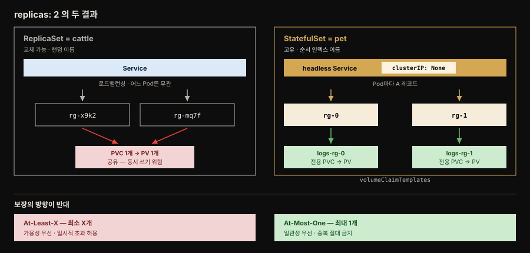
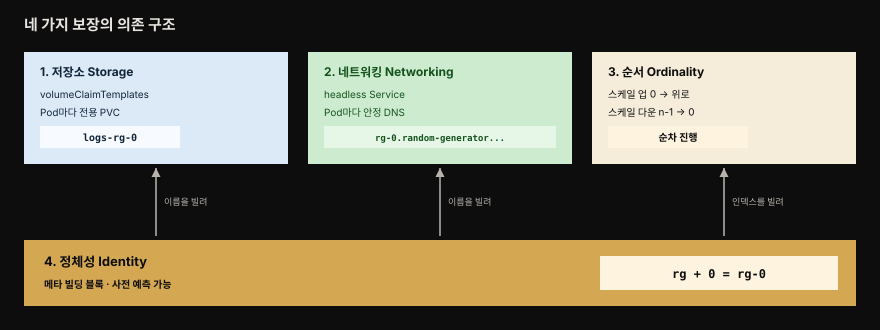
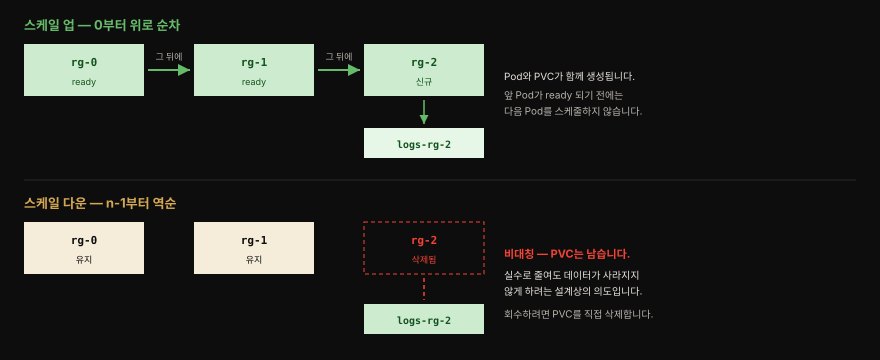

# Stateful Service — StatefulSet으로 상태를 first-class로

> 『Kubernetes Patterns』 12장 정독. **Stateful Service**는 인스턴스마다 고유한 정체성과 오래 사는 특성을 가진 분산 상태 애플리케이션을 다루는 패턴입니다. Kubernetes의 **StatefulSet** 프리미티브가 저장소·네트워킹·정체성·순서라는 네 가지 보장을 제공해, 무상태 서비스(11장)로는 감당할 수 없던 데이터 스토어·클러스터형 앱을 클라우드 네이티브의 1급 시민으로 만듭니다.



같은 `replicas: 2` 선언이 왼쪽과 오른쪽에서 전혀 다른 구조를 만듭니다. 왼쪽 ReplicaSet은 랜덤 이름의 Pod 둘이 PV 하나를 공유하고, 오른쪽 StatefulSet은 `rg-0`·`rg-1`이 각자의 PVC를 갖습니다. 아래쪽 두 상자가 이 장의 결론입니다. 두 프리미티브의 보장은 서로 반대 방향을 향합니다.


## 핵심 요약

> 확장성 있는 무상태 서비스 뒤에는 거의 언제나 상태를 가진 데이터 스토어가 있습니다. StatefulSet은 ReplicaSet이 다루지 못하는 그 영역을 맡습니다.

초기 Kubernetes는 상태 워크로드를 지원하지 못했습니다. 그래서 무상태 앱만 클러스터에 올리고 데이터베이스는 퍼블릭 클라우드나 온프레미스 하드웨어에 남겨 전통적인 방식으로 관리하는 것이 당시의 해법이었습니다. 모든 기업이 레거시와 모던을 합쳐 수많은 상태 워크로드를 가진 현실에서, 이 공백은 범용 클라우드 네이티브 플랫폼을 표방하던 Kubernetes의 뚜렷한 한계였습니다.

StatefulSet이 그 공백을 메웁니다. ReplicaSet이 동일하고 교체 가능한 **cattle**을 다룬다면, StatefulSet은 고유하고 개별 돌봄이 필요한 **pet**을 다룹니다. 초기 이름이 PetSet이었던 것도 이 비유에서 나왔습니다.

분산 상태 앱이 인프라에 요구하는 것은 네 가지입니다.

1. **저장소** — 인스턴스마다 전용 영속 스토리지를 갖습니다. 공유가 아니라 전용이어야 합니다.
2. **네트워킹** — 재시작해도 바뀌지 않는 예측 가능한 주소를 갖습니다. 상태 앱은 피어의 호스트명을 저장해 두기 때문입니다.
3. **정체성** — 고유하고 지속되는 이름을 갖습니다. 재시작을 넘어 보존되어야 합니다.
4. **순서** — 컬렉션 안에서 고정된 위치를 갖습니다. 스케일 차례, 데이터 분산, 리더 결정에 이 위치가 쓰입니다.

ReplicaSet과 PVC 조합으로는 이 넷을 채우지 못합니다. `replicas: 3`에 PVC 하나를 붙이면 세 Pod가 같은 PV를 공유하고, Pod 이름은 랜덤 접미사로 붙습니다. 게다가 ReplicaSet은 At-Most-One을 보장하지 않아 인스턴스 수가 일시적으로 늘 수 있습니다. 분산 상태 앱에서 이는 데이터 손실로 이어질 수 있는 재앙입니다.

StatefulSet은 이를 정면으로 해결합니다. `volumeClaimTemplates`가 Pod마다 전용 PVC를 즉석 생성합니다. 이름은 `StatefulSet명-순서인덱스` 형태로 예측 가능하게 붙습니다. **headless Service**는 각 Pod에 안정된 DNS를 부여합니다. 스케일은 0부터 위로 또는 n−1부터 아래로 순차 진행합니다. 그리고 ReplicaSet의 **At-Least-X**와 반대인 **At-Most-One**을 보장합니다.


## 학습 목표

> 이 편을 읽고 나면 다음을 설명할 수 있습니다.

1. 분산 상태 앱이 요구하는 네 가지 보장을 각각 무엇이 왜 필요한지와 함께 설명할 수 있습니다.
2. ReplicaSet과 PVC 조합이 분산 상태 앱에 부적합한 이유를, 책이 제시한 두 우회책의 한계까지 들어 설명할 수 있습니다.
3. `volumeClaimTemplates`와 `persistentVolumeClaim`의 차이를 말하고, StatefulSet이 PV를 관리하지 않는다는 점이 운영에 무엇을 요구하는지 판단할 수 있습니다.
4. headless Service가 `clusterIP: None`인 이유와 Pod별 안정 DNS가 만들어지는 구조를 설명할 수 있습니다.
5. At-Most-One과 At-Least-X의 의미 차이를 일관성·가용성 우선순위로 설명하고, 각각 어떤 앱에 맞는지 판단할 수 있습니다.
6. 스케일 다운이 PVC를 남기는 비대칭 동작을 설명하고 운영 절차에 반영할 수 있습니다.


## 문제 — 상태는 여러 얼굴을 가진다

> 상태를 저장소 하나로만 보면 분산 상태 앱을 담을 수 없습니다. 저장소·네트워킹·정체성·순서 네 축이 모두 요구되며, ReplicaSet의 우회책은 어느 축에서도 온전한 답이 되지 못합니다.

지금까지 살펴본 프리미티브는 관리 대상을 **무상태**로 취급했습니다. 리소스 제한을 가진 컨테이너, 다중 컨테이너 Pod, 배치 작업과 주기 작업, 싱글턴이 모두 그랬습니다. 동일하고 교체 가능한 컨테이너로 구성되며 12-factor 원칙을 따르는 앱이 전제였습니다. 하지만 확장성 있는 무상태 서비스 뒤에는 거의 언제나 데이터 스토어 형태의 상태 서비스가 있습니다.

단일 인스턴스 상태 앱이라면 기존 조합으로 그럭저럭 됩니다. ZooKeeper·MongoDB·Redis·MySQL 하나를 Deployment(`replicas: 1`)로 띄우고 Service로 엔드포인트를 찾고 PVC와 PV로 상태를 영속화하면 됩니다. 그러나 이것도 완전하지는 않습니다. ReplicaSet은 At-Most-One을 보장하지 않아 replica 수가 일시적으로 늘 수 있기 때문입니다.

진짜 도전은 **여러 인스턴스로 구성된 분산 상태 서비스**입니다. 여기서 네 가지 요구가 드러납니다.

**저장소(Storage)** — 인스턴스마다 전용 영속 스토리지가 필요합니다. `replicas: 3`인 ReplicaSet에 PVC 정의 하나를 두면 세 Pod가 모두 같은 PV에 붙습니다. 인스턴스는 떠 있고 스토리지도 붙지만, 그 스토리지가 전용이 아니라 공유입니다. 책은 두 가지 우회책과 각각의 한계를 짚습니다.

| 우회책 | 방법 | 한계 |
|--------|------|------|
| 앱 내부 분할 | 공유 스토리지를 서브폴더로 나눠 인스턴스별로 씀 | 단일 스토리지가 단일 실패점이 됩니다. 스케일 중 Pod 수가 바뀌면 오류가 나기 쉽고 데이터 손상·손실 위험이 큽니다 |
| 인스턴스별 ReplicaSet | 인스턴스마다 `replicas: 1` ReplicaSet을 따로 둠 | 각자 PVC와 전용 스토리지를 갖지만 수작업이 과합니다. 스케일 업마다 ReplicaSet·PVC·Service 정의를 새로 만들어야 하고, 전체를 하나로 관리할 추상이 없습니다 |

**네트워킹(Networking)** — 상태 앱은 애플리케이션 데이터뿐 아니라 피어의 호스트명과 연결 정보 같은 설정도 저장합니다. 그래서 각 인스턴스가 동적으로 바뀌지 않는 예측 가능한 주소로 도달 가능해야 합니다. ReplicaSet의 Pod IP는 이 조건을 만족하지 못합니다. 여기서도 ReplicaSet마다 Service를 하나씩 두는 우회책이 가능하지만 역시 수작업이며, 앱 자신은 재시작 때마다 바뀌는 호스트명에 기댈 수 없고 자기가 어떤 Service 이름으로 접근되는지도 알지 못합니다.

**정체성(Identity)** — 상태 앱에서는 모든 인스턴스가 고유하고 자기 정체성을 압니다. 그 정체성의 재료가 오래 사는 스토리지와 네트워킹 좌표입니다. 여기에 인스턴스의 이름도 더해집니다. 일부 상태 앱은 고유하고 지속되는 이름 자체를 요구하며, Kubernetes에서 그것은 Pod 이름입니다. ReplicaSet이 만든 Pod는 랜덤 이름을 받고 재시작을 넘어 그 정체성을 보존하지 못합니다.

**순서(Ordinality)** — 인스턴스는 고유할 뿐 아니라 컬렉션 안에서 고정된 위치를 가집니다. 이 순서는 보통 스케일 업다운의 차례에 영향을 주지만, 데이터 분산이나 접근에도 쓰이고 락·싱글턴·리더처럼 클러스터 내 위치를 정하는 데도 쓰입니다.

이 넷 말고도 앱마다 다른 요구가 있습니다. 어떤 앱은 쿼럼 개념을 갖고 최소 인스턴스 수가 항상 유지되기를 요구합니다. 어떤 앱은 순서에 민감한 반면 어떤 앱은 병렬 배포로도 충분합니다. 중복 인스턴스를 견디는 앱이 있는가 하면 그렇지 않은 앱도 있습니다.

이 모든 일회성 사례를 미리 계획해 범용 메커니즘으로 제공하는 것은 불가능한 일입니다. 그래서 Kubernetes는 맞춤 요구를 가진 앱을 위해 CRD와 Operator를 만들 수 있게 열어 두었습니다. 이는 28장에서 다룹니다.


## 해법 — StatefulSet과 네 가지 보장

> StatefulSet은 pet을, ReplicaSet은 cattle을 다룹니다. 네 보장 중 정체성이 토대이고 나머지 셋이 그 위에 세워집니다.

pets versus cattle은 DevOps 세계에서 유명하면서도 논쟁적인 비유입니다. 동일하고 교체 가능한 서버를 cattle이라 부릅니다. 대체 불가능하며 개별 돌봄이 필요한 서버는 pet이라 부릅니다. StatefulSet은 처음에 이 비유에서 영감을 받아 PetSet으로 불렸습니다. 지금도 대체 불가능한 Pod를 다루는 프리미티브라는 성격은 그대로입니다.

책의 Example 12-1은 random-generator 서비스를 StatefulSet으로 정의합니다.[^statefulset]

```yaml
apiVersion: apps/v1
kind: StatefulSet
metadata:
  name: rg                        # 이 이름이 생성될 Pod 이름의 접두사가 됩니다
spec:
  serviceName: random-generator   # 필수 — Example 12-2의 Service를 역참조합니다
  replicas: 2                     # rg-0, rg-1 두 Pod가 만들어집니다
  selector:
    matchLabels:
      app: random-generator
  template:
    metadata:
      labels:
        app: random-generator
    spec:
      containers:
      - image: k8spatterns/random-generator:1.0
        name: random-generator
        ports:
        - containerPort: 8080
          name: http
        volumeMounts:
        - name: logs
          mountPath: /logs
  volumeClaimTemplates:           # Pod 템플릿과 같은 발상의 PVC 템플릿입니다
  - metadata:
      name: logs                  # 최종 PVC 이름은 logs-rg-0 처럼 조합됩니다
    spec:
      accessModes: [ "ReadWriteOnce" ]
      resources:
        requests:
          storage: 10Mi
```



정체성이 아래에 깔리고 나머지 셋이 그 위에 얹힌다는 점이 이 그림의 요지입니다. 셋은 각각 정체성에서 다른 것을 빌려 씁니다.

- **저장소** — 이름을 빌려 `logs-rg-0` 같은 PVC 이름을 짓습니다.
- **네트워킹** — 같은 이름을 빌려 Pod별 DNS 항목을 만듭니다.
- **순서** — 인덱스를 빌려 스케일 차례를 정합니다.

### 저장소 — volumeClaimTemplates로 Pod마다 전용 PVC

대부분의 상태 앱은 상태를 저장하므로 인스턴스별 전용 영속 스토리지를 요구합니다. Kubernetes에서 Pod에 영속 스토리지를 요청하고 연결하는 방법은 PV와 PVC입니다. StatefulSet은 Pod를 만드는 것과 같은 방식으로 PVC를 만들기 위해 `volumeClaimTemplates` 요소를 씁니다. 이 속성이 StatefulSet과 ReplicaSet을 가르는 주된 차이 중 하나이며, ReplicaSet에는 대신 `persistentVolumeClaim` 요소가 있습니다.

| 구분 | ReplicaSet | StatefulSet |
|------|-----------|-------------|
| 필드 | `persistentVolumeClaim` | `volumeClaimTemplates` |
| 동작 | 미리 정의된 PVC 하나를 참조 | Pod 생성 시점에 템플릿으로 PVC를 즉석 생성 |
| 결과 | 모든 Pod가 같은 PV 공유 | Pod마다 전용 PVC |
| 스케일 업 | PVC 그대로 | 새 Pod마다 새 PVC 생성 |

단, StatefulSet은 **PV 자체는 어떤 방식으로도 관리하지 않습니다.** Pod가 쓸 스토리지는 관리자가 미리 프로비저닝하거나, 요청된 스토리지 클래스에 기반해 PV 프로비저너가 온디맨드로 만들어 두어야 합니다.



여기에 주의할 **비대칭 동작**이 있습니다. 스케일 업은 새 Pod와 그에 딸린 PVC를 함께 만들지만, 스케일 다운은 Pod만 지우고 PVC는 지우지 않습니다. PVC가 남으므로 PV도 회수되거나 삭제되지 않고 Kubernetes는 그 스토리지를 해제하지 못합니다.

> **지금은 이 동작을 고를 수 있습니다.** 원서가 쓰인 뒤 `.spec.persistentVolumeClaimRetentionPolicy` 가 들어왔습니다(`StatefulSetAutoDeletePVC` 피처 게이트). 두 시점을 따로 정합니다.
>
> | 필드 | 언제 적용되나 |
> |------|-------------|
> | `whenScaled` | replica 수를 줄일 때 |
> | `whenDeleted` | StatefulSet 자체를 지울 때 |
>
> 각각 `Retain`이나 `Delete`를 줄 수 있고 **기본값은 둘 다 `Retain`** 입니다. 위에서 설명한 "PVC가 남는다"는 동작이 바로 그 기본값이라, 원서 서술이 틀린 것은 아니고 **선택지가 하나 늘었다**고 읽으면 됩니다.
>
> 한 가지 오해하기 쉬운 점이 있습니다. 이 정책은 **StatefulSet을 지우거나 스케일 다운할 때만** 적용됩니다. 노드 장애로 Pod가 죽고 컨트롤 플레인이 대체 Pod를 만드는 경우에는 PVC가 그대로 유지되고, 기존 볼륨이 새 Pod가 뜰 노드에 다시 붙습니다.

이는 설계상 의도입니다. 상태 앱의 스토리지는 중요하며 실수로 인한 스케일 다운이 데이터 손실을 일으켜서는 안 된다는 전제가 깔려 있습니다. 의도적으로 스케일 다운했고 데이터를 다른 인스턴스로 복제하거나 비웠다고 확신한다면, PVC를 수동으로 지워 이후의 PV 회수를 허용하면 됩니다.

### 네트워킹 — headless Service가 Pod마다 DNS를 준다

StatefulSet이 만든 각 Pod는 StatefulSet 이름과 0부터 시작하는 순서 인덱스로 조합된 안정된 정체성을 받습니다. 앞의 예제라면 두 Pod가 `rg-0`과 `rg-1`이 됩니다. 랜덤 접미사가 붙는 ReplicaSet의 이름 생성 방식과 달리 예측 가능한 형식입니다.

Example 12-2는 **headless Service**를 정의합니다.[^headless]

```yaml
apiVersion: v1
kind: Service
metadata:
  name: random-generator
spec:
  clusterIP: None          # 이 한 줄이 Service를 headless로 만듭니다
  selector:
    app: random-generator  # 이 셀렉터가 있어야 Pod별 A 레코드가 생성됩니다
  ports:
  - name: http
    port: 8080
```

`clusterIP`를 `None`으로 두는 것은 kube-proxy가 이 Service를 처리하지 않기를 바라며 클러스터 IP 할당도 로드밸런싱도 원하지 않는다는 뜻입니다. 그렇다면 Service가 왜 필요한가라는 질문이 남습니다.

답은 무상태 Pod와 상태 Pod의 차이에 있습니다. ReplicaSet이 만든 무상태 Pod는 동일하다고 가정되므로 요청이 어느 Pod에 도착하든 상관없고, 그래서 일반 Service의 로드밸런싱이 맞습니다. 그러나 상태 Pod는 서로 다르므로 특정 Pod에 그 좌표로 도달해야 할 수 있습니다.

셀렉터를 가진 headless Service가 정확히 이것을 가능하게 합니다. 이런 Service는 API 서버에 엔드포인트 레코드를 만들고, Service를 떠받치는 Pod들을 직접 가리키는 A 레코드를 반환하는 DNS 항목을 만듭니다. 각 Pod가 DNS 항목을 하나씩 갖게 되어 클라이언트가 예측 가능한 방식으로 직접 접근할 수 있습니다. random-generator Service가 default 네임스페이스에 있다면 `rg-0` Pod의 완전한 도메인 이름은 다음과 같습니다.

```
rg-0.random-generator.default.svc.cluster.local
└──┘ └──────────────┘ └─────┘
Pod명   Service명      네임스페이스
```

Pod 이름이 Service 이름 앞에 붙는 구조입니다. 이 매핑 덕분에 클러스터 앱의 다른 멤버나 클라이언트가 원하는 특정 Pod에 도달할 수 있습니다.

SRV 레코드로 DNS 조회를 하면 한 걸음 더 나갈 수 있습니다.

```bash
# governing Service에 등록된 모든 Pod를 발견합니다 — 동적 멤버 디스커버리
dig SRV random-generator.default.svc.cluster.local
```

StatefulSet과 headless Service의 연결은 셀렉터만으로 이루어지지 않습니다. StatefulSet도 `serviceName: "random-generator"`로 그 Service를 이름으로 역참조해야 합니다. 여기서 무엇이 선택이고 무엇이 필수인지가 갈립니다.

- `volumeClaimTemplates`로 전용 스토리지를 정의하는 것은 **선택**입니다.
- `serviceName` 필드로 governing Service를 가리킵니다. 원서는 이를 **필수**라고 적는데, API 레퍼런스상으로는 optional 이고 없어도 StatefulSet 자체는 만들어집니다. 다만 Pod 별 DNS 이름이 이 필드로 정해지므로, 안정적 네트워크 정체성을 쓰려면 사실상 필요합니다.

이 governing Service는 StatefulSet이 생성되기 **전에** 존재해야 하며 집합의 네트워크 정체성을 책임집니다. 로드밸런싱이 필요하다면 상태 Pod들을 대상으로 하는 다른 종류의 Service를 얼마든지 추가로 만들 수 있습니다.

### 정체성 — 나머지 셋이 올라서는 메타 빌딩 블록

정체성은 다른 모든 StatefulSet 보장이 그 위에 세워지는 메타 빌딩 블록입니다. StatefulSet 이름을 바탕으로 예측 가능한 Pod 이름과 정체성이 생성됩니다. 그다음 그 정체성으로 PVC 이름을 짓고, headless Service를 통해 특정 Pod에 도달합니다.

실무에서 중요한 성질은 **Pod를 만들기 전에 그 정체성을 예측할 수 있다**는 점입니다. 필요하다면 이 지식을 애플리케이션 자체에서 활용할 수 있습니다.

### 순서 — 스케일이 순차로 진행된다

정의상 분산 상태 앱은 고유하고 교체 불가능한 여러 인스턴스로 구성됩니다. 고유성에 더해 인스턴스들은 생성 순서나 위치로 서로 관계를 맺기도 하는데, 여기서 순서 요구가 등장합니다.

StatefulSet 관점에서 순서가 실제로 작동하는 곳은 스케일링입니다. Pod는 0부터 시작하는 순서 접미사를 갖고, 이 생성 순서가 곧 스케일 업다운의 순서를 정합니다. 다운은 n−1에서 0으로 역순입니다.

ReplicaSet과 비교하면 차이가 분명해집니다. ReplicaSet을 여러 replica로 만들면 Pod들은 첫 번째가 성공적으로 뜨기를 기다리지 않고 함께 스케줄되어 시작합니다. 시작과 ready 도달 순서는 보장되지 않습니다. 스케일 다운도 마찬가지여서 모든 Pod가 순서나 의존 없이 동시에 종료를 시작합니다. 이 방식은 완료가 더 빠를 수 있지만 상태 앱에는, 특히 인스턴스 사이에 데이터 파티셔닝과 분산이 얽혀 있다면 적합하지 않습니다.

그래서 StatefulSet은 스케일 업다운 중 적절한 데이터 동기화가 이루어지도록 기본적으로 **순차** 시작과 종료를 수행합니다. 인덱스 0 Pod부터 시작하고 그 Pod가 성공적으로 뜬 뒤에야 인덱스 1이 스케줄되며 이 순서가 이어집니다. 스케일 다운에서는 순서가 뒤집혀 가장 높은 인덱스 Pod부터 종료하고, 그것이 성공적으로 종료된 뒤에야 다음으로 낮은 인덱스 Pod를 멈춥니다. 이 과정이 인덱스 0 Pod가 종료될 때까지 이어집니다.


## 그 밖의 기능

> 순차 보장이 늘 최선은 아닙니다. 갱신 범위와 병렬성을 조절하는 두 옵션이 있고, At-Most-One 보장이 이 장의 결론을 이룹니다.

상태 앱마다 성격이 다르므로 StatefulSet 모델에 끼워 맞출 때는 신중한 검토가 필요합니다. 다음 세 가지가 그 조절 지점입니다.

### Partitioned updates

이미 돌고 있는 상태 앱을 갱신할 때, 예를 들어 `.spec.template` 요소를 바꿀 때 StatefulSet은 단계적 롤아웃을 허용합니다. 일정 수의 인스턴스를 그대로 둔 채 나머지에만 갱신을 적용하는 카나리 릴리스 같은 방식입니다.

기본 롤링 업데이트 전략에서 `.spec.updateStrategy.rollingUpdate.partition` 숫자를 지정해 인스턴스를 나눕니다. 기본값은 0이며, 이 값은 갱신을 위해 StatefulSet을 어느 순서에서 나눌지를 가리킵니다. 값을 지정하면 순서 인덱스가 partition 이상인 Pod만 갱신되고 그보다 작은 Pod는 갱신되지 않습니다. 갱신되지 않는 Pod는 삭제하더라도 Kubernetes가 이전 버전으로 다시 만듭니다.

이 기능으로 클러스터형 상태 앱을 부분 갱신해 쿼럼을 보존한 뒤, partition을 0으로 되돌려 나머지 클러스터에 변경을 전파할 수 있습니다.

### Parallel deployments

`.spec.podManagementPolicy`를 `Parallel`로 두면 StatefulSet이 모든 Pod를 병렬로 시작하거나 종료합니다. 다음 Pod로 넘어가기 전에 이전 Pod가 running·ready가 되거나 완전히 종료되기를 기다리지 않습니다. 순차 처리가 요구사항이 아니라면 이 옵션이 운영 절차의 속도를 높입니다.

### At-Most-One 보장

고유성은 상태 앱 인스턴스의 근본 속성입니다. Kubernetes는 StatefulSet의 어떤 두 Pod도 같은 정체성을 갖거나 같은 PV에 묶이지 않도록 보장합니다. StatefulSet 컨트롤러가 중복 Pod를 막기 위해 가능한 모든 검사를 수행하는 것, 이것이 At-Most-One 보장입니다. 컨트롤러는 두 가지를 지킵니다.

- 옛 인스턴스가 완전히 종료됐다고 확인되기 전에는 Pod를 다시 시작하지 않습니다.
- 노드가 실패해도 Pod들이 종료됐음을 확인하기 전에는 다른 노드에 새 Pod를 스케줄하지 않습니다.

반대로 ReplicaSet은 인스턴스에 **At-Least-X** 보장을 제공합니다. replica가 둘인 ReplicaSet은 항상 최소 두 인스턴스를 띄우려 하고, 그 수가 가끔 더 올라갈 여지가 있더라도 컨트롤러의 우선순위는 지정 수 아래로 내려가지 않게 하는 데 있습니다. 실제로 지정된 수보다 많이 돌 수 있는 경우가 둘 있습니다.

1. Pod가 새 Pod로 교체되는 중인데 옛 Pod가 아직 완전히 종료되지 않은 경우입니다.
2. 노드가 `NotReady` 상태로 도달 불가인데 여전히 Pod가 돌고 있는 경우입니다. 이때 ReplicaSet 컨트롤러가 정상 노드에 새 Pod를 시작하므로 원하는 것보다 많은 Pod가 돌 수 있습니다.

둘 다 At-Least-X 의미 안에서는 허용됩니다.

StatefulSet의 이 보장도 깨질 수는 있지만 **적극적인 사람의 개입**이 있어야 합니다.

| 개입 | 왜 위험한가 |
|------|------------|
| 도달 불가 노드의 오브젝트를 API 서버에서 삭제 | 물리 노드가 여전히 돌고 있다면 보장이 깨집니다. 노드가 확실히 죽었거나 전원이 내려갔고 Pod 프로세스가 돌지 않음이 확인됐을 때만 수행해야 합니다 |
| `kubectl delete pods <pod> --grace-period=0 --force` | Pod가 종료됐다는 Kubelet의 확인을 기다리지 않습니다. API 서버에서 Pod를 즉시 지우므로 StatefulSet 컨트롤러가 교체 Pod를 시작해 중복이 생길 수 있습니다 |

싱글턴을 달성하는 다른 접근은 10장 Singleton Service에서 더 깊이 다룹니다.


## 심화 학습

> 책 본문 밖에서 이 패턴이 실제로 놓이는 자리를 짚습니다. Spring 개발자에게 StatefulSet은 대개 자기 앱이 아니라 옆의 데이터 스토어에서 만나는 프리미티브입니다.

### StatefulSet 위의 Spring Boot 클러스터 앱

Spring Boot 앱 자체는 대개 무상태로 설계해 Deployment로 굴리는 것이 맞습니다. StatefulSet이 필요해지는 경우는 앱이 **클러스터 내 자기 위치**, 곧 순서 정체성을 알아야 할 때입니다.

예를 들어 Spring 앱을 데이터 샤딩 코디네이터로 쓰면서 각 인스턴스가 담당 샤드를 순서 인덱스로 결정한다고 해 봅시다. Pod 이름이 `app-0`·`app-1`로 예측 가능하므로 여기서 인덱스를 파싱해 자기 샤드를 정할 수 있습니다. 순서 인덱스는 hostname으로도 노출되므로 `@Value`나 `Environment`로 `HOSTNAME`을 읽어 접미사 숫자를 떼어내면 애플리케이션 로직이 순서 정체성을 그대로 활용할 수 있습니다.

다만 더 흔한 실무는 다릅니다. Spring 앱은 무상태로 두고 그 **옆의** 상태 저장소를 StatefulSet이나 전용 Operator로 운영하는 형태입니다. Kafka·Cassandra·Elasticsearch 같은 분산 시스템은 각 노드가 안정된 정체성과 전용 스토리지, 순서 있는 부트스트랩을 요구하므로 StatefulSet의 네 보장이 그대로 필요합니다.

Kubernetes 공식 튜토리얼의 [Cassandra with a StatefulSet](https://kubernetes.io/docs/tutorials/stateful-application/cassandra/)과 [Running ZooKeeper](https://kubernetes.io/docs/tutorials/stateful-application/zookeeper/)가 이 패턴의 정석 예제이며 책의 More Information에도 인용됩니다.

### At-Most-One과 Singleton Service의 관계

12장의 At-Most-One은 10장 Singleton Service와 이어집니다. 10장에서 out-of-application 잠금으로 싱글턴을 만들 때, StatefulSet의 At-Most-One이 ReplicaSet의 At-Least-X보다 엄격한 싱글턴을 준다고 했습니다.

두 보장의 차이는 결국 무엇을 먼저 포기하느냐입니다.

| | StatefulSet At-Most-One | ReplicaSet At-Least-X |
|---|---|---|
| 우선하는 것 | 일관성 | 가용성 |
| 감수하는 것 | 가끔 0개 | 가끔 지정 수 초과 |
| 절대 막는 것 | 중복 인스턴스 | 지정 수 미달 |

상태 앱에서 중복 인스턴스가 같은 PV에 동시에 쓰면 데이터가 깨집니다. At-Most-One의 보수성이 상태 앱에 꼭 맞는 이유가 여기 있습니다.


## 능동 회상

> 먼저 스스로 답해 본 뒤 아래 정답 절에서 맞춰 봅니다. 정답은 이 절 다음에 번호 순서대로 있습니다.

1. 분산 상태 앱이 인프라에 요구하는 네 가지는 무엇이고, 그중 무엇이 나머지의 토대가 되나요?
2. `replicas: 3`인 ReplicaSet에 PVC 하나를 붙이면 무엇이 문제가 되나요? 책이 든 두 우회책은 각각 왜 부족한가요?
3. `volumeClaimTemplates`와 `persistentVolumeClaim`은 무엇이 다른가요?
4. StatefulSet은 PV를 만들어 주나요? 그렇지 않다면 운영자는 무엇을 준비해야 하나요?
5. 스케일 업과 스케일 다운의 비대칭이란 무엇이며 왜 그렇게 설계됐나요?
6. headless Service의 `clusterIP: None`은 무엇을 하지 말라는 뜻인가요? 그런데도 Service가 필요한 이유는 무엇인가요?
7. `rg-0.random-generator.default.svc.cluster.local`의 각 마디는 무엇을 가리키나요?
8. StatefulSet과 governing Service를 잇는 필수 조건 두 가지는 무엇인가요? 순서상 무엇이 먼저 존재해야 하나요?
9. StatefulSet의 기본 스케일 동작을 ReplicaSet과 비교해 설명해 보세요. 순차 진행이 상태 앱에 필요한 이유는 무엇인가요?
10. `partition`을 지정하면 어떤 Pod가 갱신되나요? 이 기능을 쿼럼 보존에 어떻게 쓰나요?
11. At-Most-One과 At-Least-X는 각각 무엇을 우선하고 무엇을 감수하나요?
12. At-Most-One이 깨질 수 있는 인위적 개입 두 가지는 무엇인가요?


## 정답

> 위 회상 질문의 답입니다. 번호가 대응합니다.

**1.** 저장소·네트워킹·정체성·순서입니다. 이 중 **정체성**이 메타 빌딩 블록으로 나머지 셋의 토대가 됩니다. StatefulSet 이름과 순서 인덱스로 예측 가능한 Pod 이름이 먼저 만들어지기 때문입니다. 저장소는 그 이름으로 PVC 이름을 짓습니다. 네트워킹은 그 이름으로 DNS 항목을 만듭니다. 순서는 그 인덱스로 스케일 차례를 정합니다.

**2.** 세 Pod가 모두 같은 PV에 붙어 스토리지가 전용이 아니라 공유가 됩니다. 첫째 우회책인 앱 내부 서브폴더 분할은 단일 스토리지가 단일 실패점이 되고, 스케일 중 Pod 수가 바뀌면 오류가 나기 쉬워 데이터 손상·손실 위험이 큽니다. 둘째 우회책인 인스턴스별 `replicas: 1` ReplicaSet은 전용 스토리지를 주기는 하지만 수작업이 과합니다. 스케일 업마다 ReplicaSet·PVC·Service 정의를 새로 만들어야 하고 전체를 하나로 관리할 추상이 없습니다.

**3.** `persistentVolumeClaim`은 미리 정의된 PVC 하나를 **참조**하므로 모든 Pod가 같은 PV를 공유합니다. `volumeClaimTemplates`는 Pod 생성 시점에 템플릿으로 PVC를 **즉석 생성**하므로 Pod마다 전용 PVC를 갖고, 스케일 업 때도 새 Pod마다 새 PVC가 만들어집니다.

**4.** 만들어 주지 않습니다. StatefulSet은 PVC만 만들고 PV는 어떤 방식으로도 관리하지 않습니다. 따라서 관리자가 스토리지를 미리 프로비저닝하거나, 요청된 스토리지 클래스에 기반해 PV 프로비저너가 온디맨드로 만들도록 준비해 두어야 합니다.

**5.** 스케일 업은 새 Pod 와 PVC 를 함께 만들지만, 스케일 다운은 Pod 만 지우고 PVC 와 PV 는 남깁니다. 상태 앱의 스토리지가 중요하며 실수로 인한 스케일 다운이 데이터 손실을 일으켜서는 안 된다는 전제에서 나온 설계상의 의도입니다.

다만 이것은 이제 **기본값**입니다. `.spec.persistentVolumeClaimRetentionPolicy` 의 `whenScaled`·`whenDeleted` 를 각각 `Delete` 로 두면 자동 삭제도 가능합니다(둘 다 기본은 `Retain`). 기본값을 그대로 쓰면서 정말 회수하고 싶다면 데이터를 옮겼는지 확인한 뒤 PVC 를 수동으로 지웁니다.

**6.** kube-proxy가 이 Service를 처리하지 말고 클러스터 IP 할당도 로드밸런싱도 하지 말라는 뜻입니다. 그런데도 Service가 필요한 이유는, 셀렉터를 가진 headless Service가 API 서버에 엔드포인트 레코드를 만들고 각 Pod를 직접 가리키는 A 레코드 DNS 항목을 만들어 주기 때문입니다. 무상태 Pod와 달리 상태 Pod는 서로 다르므로 특정 Pod에 그 좌표로 도달해야 합니다.

**7.** `rg-0`은 Pod 이름, `random-generator`는 governing Service 이름, `default`는 네임스페이스이며 나머지는 클러스터 도메인입니다. Pod 이름이 Service 이름 앞에 붙는 구조입니다.

**8.** 첫째로 Service가 셀렉터로 Pod를 고를 수 있어야 하고, 둘째로 StatefulSet이 `serviceName` 필드로 그 Service를 이름으로 역참조해야 합니다. governing Service가 StatefulSet보다 **먼저** 존재해야 합니다. `volumeClaimTemplates`는 선택이지만 `serviceName` 링크는 필수입니다.

**9.** ReplicaSet은 모든 Pod를 순서나 의존 없이 동시에 시작·종료하며 ready 도달 순서를 보장하지 않습니다. StatefulSet은 기본적으로 순차 진행해 인덱스 0이 성공적으로 뜬 뒤에야 인덱스 1을 스케줄하고, 다운은 가장 높은 인덱스부터 0까지 역순으로 하나씩 내립니다. 인스턴스 사이에 데이터 파티셔닝과 분산이 얽혀 있을 때 적절한 데이터 동기화가 이루어지도록 하기 위해서입니다.

**10.** 순서 인덱스가 `partition` 값 **이상**인 Pod만 갱신되고 그보다 작은 Pod는 갱신되지 않습니다. 갱신되지 않는 Pod는 삭제해도 이전 버전으로 다시 만들어집니다. 쿼럼을 지켜야 하는 클러스터라면 partition을 높게 두어 일부만 갱신·검증한 뒤, partition을 0으로 되돌려 나머지 전체에 변경을 전파합니다.

**11.** At-Most-One은 일관성을 우선해 가끔 0개가 되는 것을 감수하면서 중복을 절대 막습니다. At-Least-X는 가용성을 우선해 일시적 초과를 감수하면서 지정 수 미달을 막습니다. 상태 앱은 중복 인스턴스가 같은 PV에 동시에 쓰면 데이터가 깨지므로 At-Most-One이 맞습니다.

**12.** 첫째는 물리 노드가 여전히 돌고 있는데 도달 불가 노드의 오브젝트를 API 서버에서 삭제하는 것이고, 둘째는 `kubectl delete pods <pod> --grace-period=0 --force`로 강제 삭제하는 것입니다. 후자는 Pod가 종료됐다는 Kubelet의 확인을 기다리지 않고 API 서버에서 즉시 지우므로 컨트롤러가 교체 Pod를 시작해 중복이 생길 수 있습니다.


## 실무 적용

> 이 패턴을 실제로 적용할 때 반복해서 문제가 되는 자리들입니다.

- **분산 상태 앱이면 StatefulSet을, 단일 인스턴스면 Deployment(replicas=1)도 고려합니다.** 여러 인스턴스가 각자 정체성·전용 스토리지·순서를 요구할 때가 StatefulSet의 자리입니다.
- **governing headless Service를 먼저 만듭니다.** StatefulSet은 serviceName으로 이를 역참조합니다. Service가 없어도 StatefulSet 생성 자체는 막히지 않지만, Pod별 DNS 이름이 서지 않아 안정적 네트워크 정체성을 잃습니다.
- **스케일 다운이 PVC를 지우지 않는 것이 기본값임을 기억합니다.** 데이터 보호를 위한 의도된 동작입니다. 자동 삭제가 필요하면 `persistentVolumeClaimRetentionPolicy.whenScaled: Delete`를 걸고, 기본값을 쓰면서 회수하려면 PVC를 수동으로 지웁니다. 실수로 지우면 복구 불가한 손실이 됩니다.
- **PV는 미리 준비합니다.** StatefulSet은 PVC만 만들고 PV는 관리하지 않습니다. 스토리지 클래스 기반 동적 프로비저닝을 걸어두거나 관리자가 미리 만듭니다.
- **partitioned update로 안전하게 롤아웃합니다.** 쿼럼을 지켜야 하는 클러스터는 partition을 높게 두어 일부만 갱신·검증한 뒤 0으로 되돌려 전체에 적용합니다.
- **At-Most-One을 인위적으로 깨지 않습니다.** `--force --grace-period=0` 강제 삭제나 살아 있는 노드의 오브젝트 삭제는 중복 Pod를 부를 수 있습니다. 노드가 확실히 죽었을 때만 합니다.


## 체크리스트

- [ ] 이 앱은 인스턴스마다 전용 스토리지·안정 정체성·순서가 필요한 분산 상태 앱인가?
- [ ] governing headless Service(clusterIP None)를 StatefulSet보다 먼저 만들었는가?
- [ ] StatefulSet이 serviceName으로 그 Service를 역참조하는가?
- [ ] volumeClaimTemplates로 Pod별 PVC를 만드는가?(ReplicaSet의 공유 PVC와 혼동하지 않았는가)
- [ ] PV를 미리 프로비저닝했는가?(StatefulSet은 PV를 관리하지 않음)
- [ ] 스케일 다운이 PVC를 남긴다는 점을 운영 절차에 반영했는가?
- [ ] 순차 스케일이 필요한가, 아니면 podManagementPolicy: Parallel이 맞는가?
- [ ] 강제 삭제·노드 오브젝트 삭제로 At-Most-One을 깨뜨릴 위험을 통제하는가?


## 면접 관점

> 위 능동 회상이 학습 점검이라면, 여기는 실제 면접 답변에 가까운 형태로 다듬은 다섯 문항입니다.

**Q. StatefulSet이 ReplicaSet과 다른 점을 네 가지로 말해 보세요.**
저장소는 `volumeClaimTemplates`로 Pod별 전용 PVC를 즉석 생성하는 반면 ReplicaSet은 하나의 PVC를 공유합니다. 네트워킹은 headless Service로 Pod별 안정 DNS를 받지만 ReplicaSet의 Pod IP는 재시작마다 바뀝니다. 정체성은 예측 가능한 순서 이름인 반면 ReplicaSet은 랜덤 접미사를 붙입니다. 순서는 순차 스케일을 보장하지만 ReplicaSet은 동시에 시작하고 종료합니다.

**Q. headless Service는 왜 clusterIP가 None입니까?**
로드밸런싱을 원치 않기 때문입니다. 무상태 Pod는 동일하다고 가정되어 요청이 어디에 도착하든 상관없지만, 상태 Pod는 서로 다르므로 특정 Pod에 그 좌표로 도달해야 합니다. `clusterIP: None`이면 클러스터 IP 대신 각 Pod를 직접 가리키는 A 레코드 DNS가 만들어져 `rg-0.random-generator.default.svc.cluster.local` 형태로 개별 Pod에 접근합니다.

**Q. At-Most-One과 At-Least-X의 차이는 무엇인가요?**
StatefulSet의 At-Most-One은 같은 정체성이나 같은 PV를 가진 Pod가 절대 둘이 되지 않게 보장하며, 일관성을 우선해 가끔 0개가 되는 것을 감수합니다. ReplicaSet의 At-Least-X는 최소 개수를 유지하되 롤링 교체나 노드 NotReady 상황에서 일시적 초과를 허용하며 가용성을 우선합니다. 상태 앱은 중복 인스턴스가 같은 PV에 동시에 쓰면 데이터가 깨지므로 At-Most-One이 맞습니다.

**Q. StatefulSet을 스케일 다운하면 스토리지는 어떻게 됩니까?**
Pod는 지워지지만 PVC와 PV는 남습니다. 스케일 업은 Pod와 PVC를 함께 만드는데 다운은 Pod만 지우는 비대칭 동작입니다. 실수로 인한 스케일 다운이 데이터 손실을 일으켜서는 안 된다는 전제에서 나온 설계상의 의도이며, 회수하려면 PVC를 수동으로 지워야 합니다.

**Q. StatefulSet은 PV를 만들어 줍니까?**
아니요. `volumeClaimTemplates`로 PVC만 만들고 PV는 어떤 방식으로도 관리하지 않습니다. PV는 관리자가 미리 프로비저닝하거나 스토리지 클래스 기반 프로비저너가 온디맨드로 만들어야 합니다.


## 참고 자료

- 《Kubernetes Patterns, Second Edition》 Ch12. Stateful Service (Bilgin Ibryam·Roland Huß, O'Reilly)
- [StatefulSet 기초 (Kubernetes in Action)](../kubernetes-in-action/16-01.StatefulSet%20기초%20—%20Pets%20vs%20Cattle·ordinal·headless%20Service.md)
- [StatefulSet 동작 — 미싱 파드·노드 장애·스케일·retention (Kubernetes in Action)](../kubernetes-in-action/16-02.StatefulSet%20동작%20—%20미싱%20파드·노드%20장애·스케일·retention.md)
- [Kubernetes 공식 튜토리얼 — Cassandra with StatefulSet](https://kubernetes.io/docs/tutorials/stateful-application/cassandra/)
- [Kubernetes 공식 튜토리얼 — Running ZooKeeper](https://kubernetes.io/docs/tutorials/stateful-application/zookeeper/)

[^statefulset]: Kubernetes — StatefulSet의 구성 요소와 volumeClaimTemplates·serviceName 필드 계약.
<https://kubernetes.io/docs/concepts/workloads/controllers/statefulset/>

[^headless]: Kubernetes — clusterIP를 None으로 둔 headless Service와 Pod별 A 레코드 생성.
<https://kubernetes.io/docs/concepts/services-networking/service/#headless-services>
